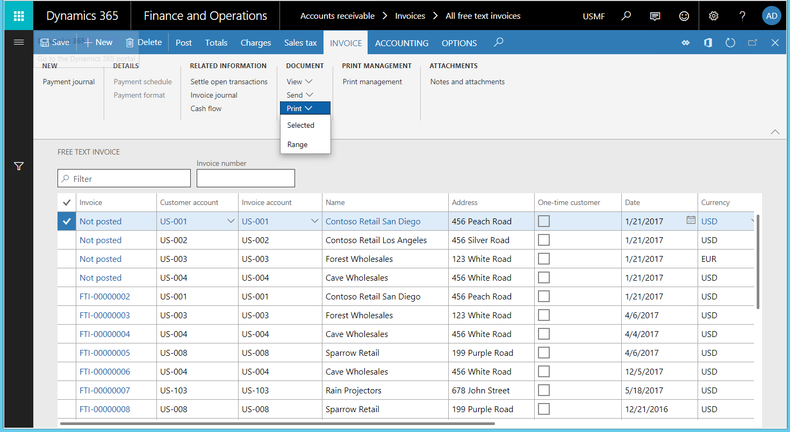
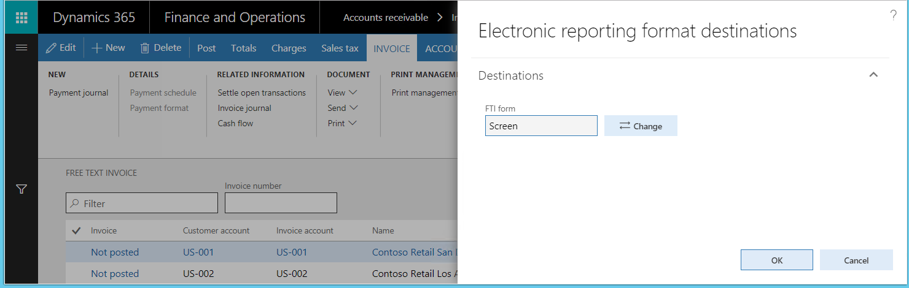

---
# required metadata

title: Generate printable FTI forms 
description: This topic explains how to use the Electronic reporting (ER) framework to generate printable free text invoice (FTI) forms as Microsoft Office documents.
author: NickSelin
ms.date: 07/24/2018
ms.topic: article
ms.prod: 
ms.technology: 

# optional metadata

# ms.search.form: PrintMgmtSetupUIMain
# ROBOTS: 
audience: Application User, Developer, IT Pro
# ms.devlang: 
ms.reviewer: kfend
# ms.tgt_pltfrm: 
ms.custom: 220314
ms.assetid: 2685df16-5ec8-4fd7-9495-c0f653e82567
ms.search.region: Global
# ms.search.industry: 
ms.author: nselin
ms.search.validFrom: 2018-04-01
ms.dyn365.ops.version: Release 8.0

---

# Generate printable FTI forms

[!include[banner](../includes/banner.md)]

The Electronic reporting (ER) framework lets you generate printable free text invoice (FTI) forms as Microsoft Office documents. This topic provides information about how to build your own configurations as well as details of available configuration templates.

## Overview

In addition to the existing capability of generating printable FTI forms by using Microsoft SQL Server Reporting Services (SSRS), you can now use the ER framework. You can manage printable FTI forms in Microsoft Office Excel and Word. You can also modify the layout, data flow, and formatting to meet specific requirements without making code changes.

> [!NOTE]
> If you want to start with an overview of existing ER configurations for this sample of the printable FTI forms solution, you can go directly to section **Download sample ER configurations to generate printable FTI forms** later in this topic.

## Create customized configurations for FTI printable forms
As part of your customized solution for printable FTI forms, you must create a set of ER configurations.

### Configure the ER data model
Your application must include the ER data model configuration that contains a data model that describes the customer invoicing business domain. As a requirement, the name of the data model must be **CustomersInvoicing**. For information about how to design ER data models, see [ER Design domain specific data model](tasks/er-design-domain-specific-data-model-2016-11.md).

### Configure the ER model mapping
Your application must include the ER model mapping for the CustomersInvoicing data model. The model mapping can be in either the ER data model configuration or the ER model mapping configuration. However, the name of the root descriptor of the model mapping must be **FreeTextInvoice**.

The mapping must contain the following data sources:

- Data source type: **Table records**

    - This data source must be named **CustInvoiceJour**.
    - It must refer to the CustInvoiceJour application table.
    - It's used at runtime to pass from the application to the ER model mapping the list of invoices that have been selected for printing.

- Data source type: **Object**

    - This data source must be named **PrintMgmtPrintSettingDetail**.
    - It must refer to the **PrintMgmtPrintSettingDetail** application class.
    - It's used at runtime to pass from the application to the ER model mapping details of the print management settings for the ER format that is running.

The details of the application integration with the ER framework can be found in the **ERPrintMgmtReportFormatSubscriber** class (ER Application Suite integration model) in the source code of the application.

For more information about the design of ER model mappings, see [Define ER model mappings and select data sources for them](tasks/er-define-model-mapping-select-data-sources-2016-11.md).

### Configure the ER format
In your application instance, you must have the ER format configuration that will be used to generate FTI forms. 

> [!NOTE]
> This format configuration must be created for the CustomersInvoicing data model, and it must use the model mapping that has the **FreeTextInvoice** root descriptor.

For information about how to configure ER formats, see [ER Create a format configuration (November 2016)](tasks/er-format-configuration-2016-11.md). For information about how to design ER formats to generate reports in OpenXML format, see [ER Design a configuration for generating reports in OPENXML format (November 2016)](tasks/er-design-reports-openxml-2016-11.md).

## Configure print management
To generate FTI forms by using the ER framework, you can assign ER formats in the same way that you assign SSRS reports. To associate the ER format with all Accounts receivable FTIs, go to **Accounts receivable** \> **Setup** \> **Forms** \> **Form setup** \> **General** \> **Print management** \> **Free text invoice** \> **Original**. To associate the ER format with a specific customer or invoice, follow these steps.

1. Go to **Accounts receivable** \> **Invoices** \> **All free text invoices**.
2. Select the FTI to associate the ER format with, and open the **Print management setup** page.
3. Select the document level to specify the scope of invoices for processing.
4. Select the ER format for the specified document level.

> [!NOTE]
> Only ER formats that use the **FreeTextInvoice** root descriptor of the **CustomersInvoicing** data model appear in the **Report format lookup** field for the selected format.

## Generate FTI forms
FTI forms are generated in the ER framework in the same way that SSRS reports are generated.

To generate FTI forms, you can select invoices either by range or by selection. 

When you use ER formats to print FTI forms in this way, the default ER file destinations are used. You can't change the destination. For more information about how to configure the ER destinations for ER formats, see [Electronic reporting (ER) destinations](electronic-reporting-destinations.md).

You can also generate FTI forms when you post an FTI, by turning **Print invoice** on and turning **Use print management destinations** off.

> [!NOTE]
> When you use ER formats to print FTI forms in this way, the default ER file destinations are used. You can change the default destination at runtime if the destination has already been configured. To change the destination, you must have the following security privilege:
>
> -	**Name:** ERFormatDestinationRuntimeMaintain
> -	**Label:** Maintain electronic reporting format destination during runtime

The ER framework currently supports the following destinations for generated documents:

- **Downloaded file** – Generated forms are offered as downloads that you can save by using the browser.
- **Screen** – Microsoft 365 Excel is used to preview generated FTI forms in Excel format.
- **SharePoint folder** – Generated forms are stored based on the settings of the Document management framework.
- **Application archive** – Generated forms are stored as attachments of execution log records in the Microsoft Azure Storage.
- **Email** – Generated forms are sent as email attachments.

> [!NOTE]
> You can't send the FTI forms that are generated directly to the printer, because direct printing that uses the Dynamics Printer Routing Agent isn't currently supported.

## Download sample ER configurations to generate printable FTI forms
You can download sample ER configurations to use as a template for your FTI solution. The configurations are stored in the Shared asset library in Microsoft Dynamics Lifecycle Services (LCS). The configurations include:

- The **Customer invoicing model** configuration contains the required data model and model mapping.
- The **Customer FTI report (GER)** configuration contains the sample format.

> [!NOTE]
> These configurations have been created as samples to help clarify possible scenarios. The future of these configurations depends on the results of this evaluation and any feedback that is received.

### Features that are implemented in the sample ER format
In the sample ER format configuration, an Excel file is used as a template to generate FTI forms.

Currently, this sample ER format supports the following features to generate FTI forms:

- FTI forms are generated for both original invoices that have been posted and original invoices that haven't yet been posted. Corrected invoices and credit notes aren't supported.
- FTI forms are generated in the invoice language. The format of values and dates in the generated forms is based on the settings of the user's client locale.
- Generated invoices show data unavailability notifications if there are no lines in the invoices that are processed.
- Generated invoice headers are based on the paper format that has been selected for the FTI form on the **Accounts receivable parameters** page. Company details appear in the header of the generated invoice form only if the paper format is blank.
- Generated invoice forms show company and customer tax exempt numbers when the appropriate option has been selected for the FTI form on the **Accounts receivable parameters** page.
- The generated invoice lines and invoice totals sections show the default invoice's monetary details in the invoice registration currency.
- The generated invoice totals section can show monetary details in the euro currency and the invoice registration currency when the **Print amount in currency representing the euro** option is enabled on the **Accounts receivable parameters** page.
- Generated invoice forms show any process invoice notes that are available, based on settings on the **Accounts receivable parameters** page. Notes are included for both the whole invoice and each invoice line.
- Generated invoice forms include notes for the customer FTI form and the processing invoice language when they have been configured in the AR form notes list.
- Depending on the Print management settings, generated invoices include custom footer text when it has been configured for the invoice language, the ER format, and the FTI document scope.
- The totals section of generated invoice forms includes any cash discount information that is available.
- The payment schedule section of generated invoice forms includes any payment schedule details that are available.
- The markup section of generated invoice forms includes any charges transactions that are available.
- Generated invoice forms include sales tax details, based on the **Sales tax specification** setting on the **Accounts receivable parameters** page. This section can show tax details either in the invoice registration currency only, or in the invoice registration currency and the company accounting currency at the same time.
- Generated invoice forms show direct debit notification details. For example, they show when the method of payment that has the mandatory direct debit mandate ID was selected for the invoice, when the processing invoice was registered in the euro currency, and when the direct debit mandate ID was defined for the invoice.
- Generated invoices show any prepayment details that are available for posted invoices.
- Generated invoice forms can be sent to an invoice customer as an email attachment. The appropriate ER file destination should be configured for the ER format that is being used.

### Country/region-specific features 
The following country/region-specific features are included in the sample ER format to show how specific requirements can be handled in ER configurations.

#### Norway
The Enterprise register term is put on the header of the generated invoice form when the invoice is processed for a legal entity that is configured in the following manner:

- The country/region context for Norway is used.
- The **Print Foretaksregisteret** parameter is active on sales documents.

#### Spain
The **Special regime for cash accounting method** term is put on the header of the generated invoice form when the invoice is processed for a legal entity that is configured in the following manner:

- The country/region context for Spain is used.
- The special regime for the cash accounting method is enabled on the invoice processing date.

When cash discount details, such as the cash discount amount and invoice line net amount, are available, they are presented in the invoice totals section of the generated invoice form when it has been processed for a legal entity that is configured in the following manner:

- The country/region context for Spain is used.
- **Cash discount is applied in the invoice** is turned on in the invoice option (**General ledger parameters** \> **Sales tax section**).

#### Italy
The goods discount mark is included on the invoice lines of the generated invoice when it's being processed for a legal entity that is configured using the country/region context for Italy.

#### Finland
In addition to the generated invoice form, Giro money transfer slips can be generated as follows:

- For the legal entity that uses the country/region context for Finland, and that has at least one bank account that is marked as **Giro account** and **Bank bar code**. 
- For an invoice that is marked as required for the **Finnish** associated payment attachment.

> [!NOTE]
> The sample ER format has been configured to optionally generate the Giro money transfer slips in the separate worksheet.

> [!NOTE]
> You must first install the font that is used to generate the bar code on the local machine where the generated invoice form in Excel format will be previewed.

### Use the sample ER format to configure email destinations
Use the following elements of the sample ER format to configure email destinations:

- The email address of a customer contact can be accessed through the following ER expression: **model.InvoiceBase.Contact.ElectronicMail**.
- The email subject text can be accessed through the following ER expression: **Emailing.TxtToUse.Subject**.
- The email body text can be accessed through the following ER expression: **Emailing.TxtToUse.Body**.

The default text of the email's subject and body is defined in the sample ER format. The language depends on the format's labels. This default text will be used for emails if a custom organization email template that has the predefined **ERFTITMP** ID hasn't been added.

> [!NOTE]
> The **ERFTITMP** email template ID has been defined in the sample ER format. It can be changed as required in a new ER format that is created from this sample format.

If the organization email template that has the predefined **ERFTITMP** ID has been added for the legal entity that you're processing the invoice for, the template for the email subject and body text will be used to generate the email. 

The **Emailing.TxtToUse.Subject** ER expression of the sample ER format is configured to replace any occurrences of the placeholder %1 by the processing invoice ID.

The **Emailing.TxtToUse.Body** expression of the sample format is configured for the following substitutions for placeholders:

- "%1" is replaced with the name of the customer's contact person.
- "%2" is replaced with the company name.
- "%3" is replaced with the customer name.
- "%4" is replaced with the name of the company's contact person.
- "%5" is replaced with the job title of the company's contact person.
- "%6" is replaced with the email address of the company's contact person.

## Additional resources
[Electronic reporting (ER) overview](general-electronic-reporting.md)

[!INCLUDE[footer-include](../../../includes/footer-banner.md)]