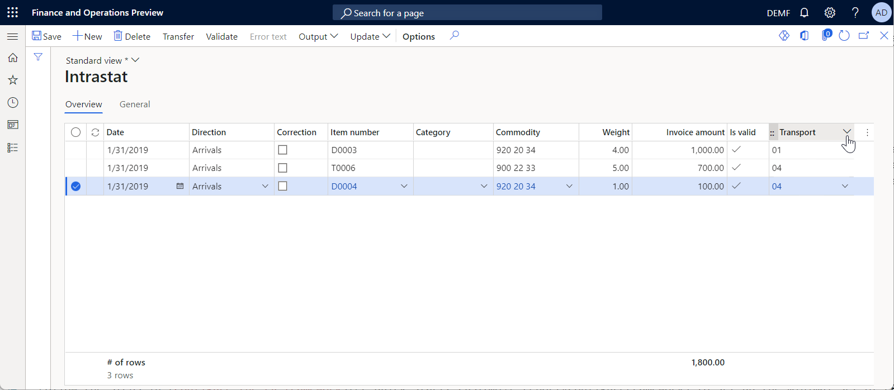
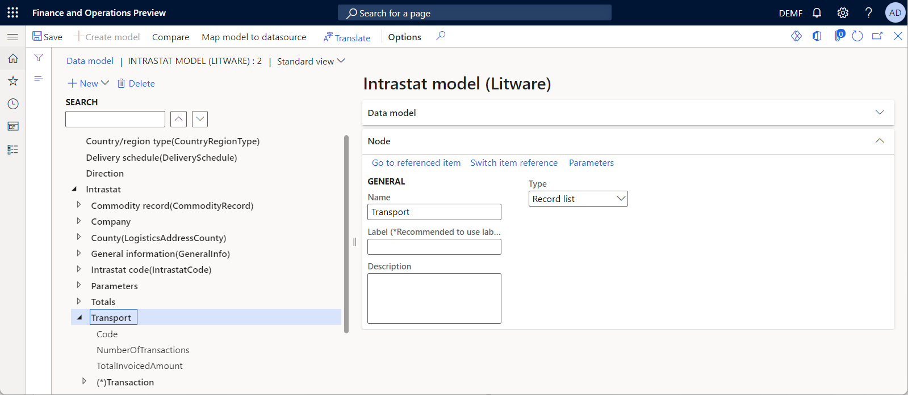
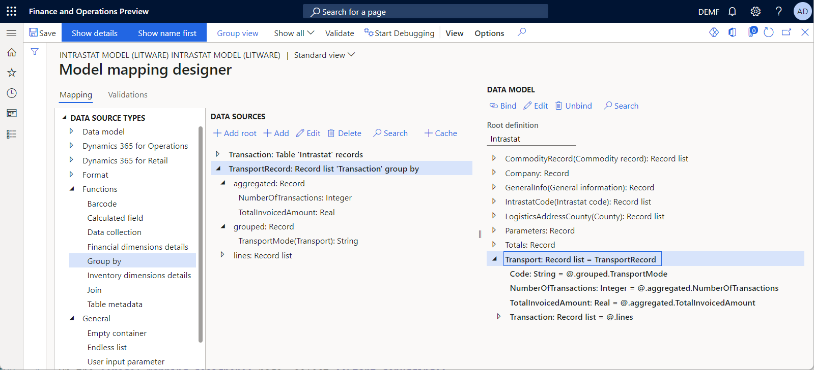
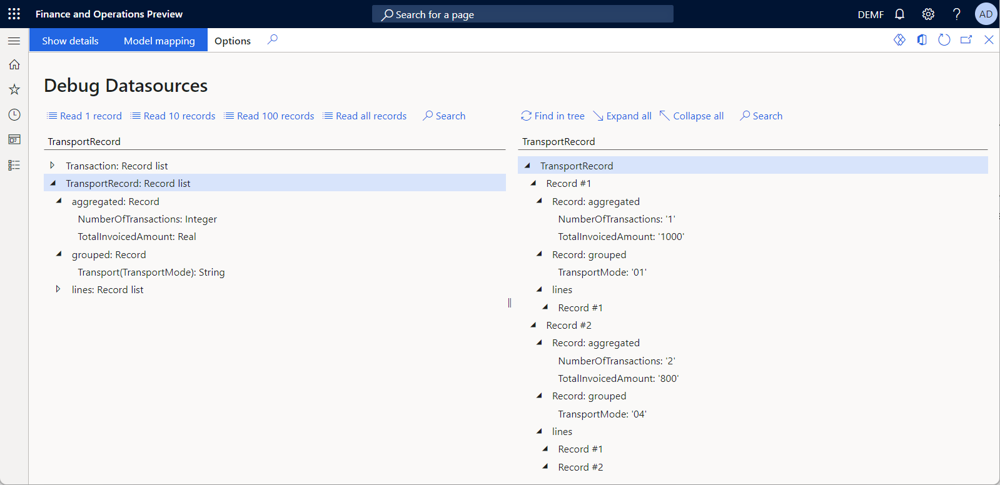
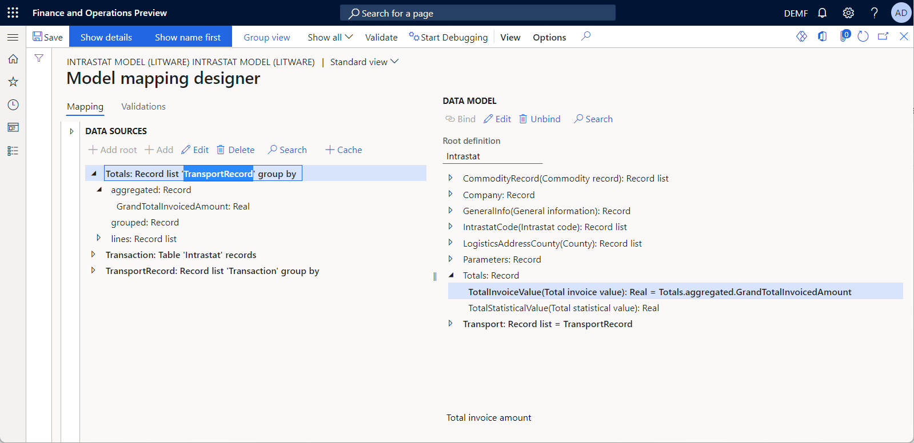
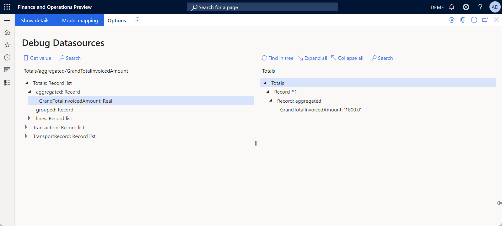

# Group records and aggregate calculations by using GROUPBY data sources

[!include[banner](../includes/banner.md)]

When you configuring [Electronic reporting (ER)](general-electronic-reporting.md) model mappings or formats, you can [add](#AddMmDataSource2) required data sources of the **GroupBy** type.

At design time, a **GroupBy** data source is configured to identify the following elements:

- A [base data source](#BaseDataSource) that contains records that will be grouped at runtime
- [Grouping fields](#GroupingFields) of the base data source, which will be used for record grouping at runtime
- [Aggregate functions](#AggregateFunctions) that specify the aggregate calculations that will be done for each discovered group at runtime

At runtime, a configured **GroupBy** data source groups records that have the same values in the grouping fields, and then returns a list of records. Each record represents a single group. For each group, the data source exposes the field values that the initial records were grouped by, the values of the calculated aggregate functions, and the list of records of the base data source that belongs to the group.

## Aggregate functions

At runtime, every aggregate calculation is done for each group of records. This calculation is done by using the value of a single field or an expression in the records of a data source that was selected for grouping in the editable data source of the **GroupBy** type. The following aggregate functions are currently supported:

- **AVG** – This function returns the average of the values in a group. It can be used only with numeric fields.
- **COUNT** – This function returns the number of items that were found in a group.
- **Min** – This function returns the minimum value among the values in a group.
- **Max** – This function returns the maximum value among the values in a group.
- **SUM** – This function returns the sum of all the values in a group. It can be used only with numeric fields.

## Execution location

When you edit a **GroupBy** data source and specify the base data source that contains the records that must be grouped, the system automatically detects the most efficient [location](#ExecutionLocation) for execution of that **GroupBy** data source. If the base data source is
[queryable](er-functions-list-filter.md#usage-notes) (that is, if it can be run at the database level), the application database is also specified as the execution location of the editable **GroupBy** data source. Otherwise, the application server memory is specified as the execution location.

You can manually change the automatically detected execution location by selecting the location that is applicable to the configured data source. If the execution location that is selected isn't applicable, a [validation error](er-components-inspections.md#i5) is thrown at design time.

> [!TIP]
> We recommend that you use the database location to group data sources that expose a large number of records.

## Memory consumption

By default, if a **GroupBy** data source is run in memory, the application server memory is used to store records of the base data source that belongs to each discovered group as records of a single group. To help reduce memory consumption, you can suppress record storage for **GroupBy** data sources if they were configured to compute only aggregated functions and their group's records aren't used at runtime. To reduce memory consumption in this way, enable the **Reduce memory usage in ER when records grouping is only used to compute aggregations** feature in the **Feature management** workspace.

## Alternatives

Similar aggregations can be calculated by using [different](er-data-collection-data-sources.md#if-i-have-to-calculate-running-totals-and-collect-data-what-is-the-difference-between-using-a-data-collection-data-source-and-using-the-built-in-data-collection-functions) types of data sources or ER built-in functions.

To learn more about this feature, complete the example that follows.

## Example: Use a GROUPBY data source for aggregate calculations and record grouping

This example shows how a user in the System administrator or Electronic reporting functional consultant role can configure an ER model mapping that has a **GROUPBY** data source that is used to calculate aggregate functions and group records. This model mapping is used to print the control report when the Intrastat declaration is generated. That report lets you review reported Intrastat transactions.

The procedures in this example can be completed in the **DEMF** company in Microsoft Dynamics 365 Finance. 

### Prepare sample data

Make sure that you have Intrastat transactions for reporting on the **Intrastat** page. You must have transactions for different transport codes, because you will group transactions by the **Transport** field in this example.

### Configure the ER framework

Follow the steps in [Configure the ER framework](er-quick-start2-customize-report.md#ConfigureFramework) to set up the minimal set of ER parameters. You must complete this setup before you start to use the ER framework to design an ER model mapping.

### Import the standard ER format configuration

Follow the steps in [Import the standard ER format configuration](er-quick-start2-customize-report.md#ImportERSolution1) to add the standard ER configurations to your current instance of Dynamics 365 Finance. Import version 1 of the **Intrastat model** configuration from the repository.

### Create a custom data model configuration

Follow the steps in [Add a custom data model configuration](er-quick-start3-customize-report.md#add-a-custom-data-model-configuration) to manually add a new **Intrastat model (Litware)** ER data model configuration that you derive from the imported **Intrastat model** configuration.

### Configure a custom data model component

Follow these steps to make the required changes to the derived **Intrastat model (Litware)** data model, so that it can be used to expose transport codes that have the required details.

1. Go to **Organization administration** \> **Electronic reporting** \> **Configurations**.
2. On the **Configurations** page, in the configuration tree, select **Intrastat model (Litware)**.
3. Select **Designer**.
4. On the **Data model designer** page, in the model tree, select **Intrastat**.
5. Select **New** to add a new nested node for the selected **Intrastat** node. In the drop-down dialog box for adding a data model node, follow these steps:

    1. In the **Name** field, enter **Transport**.
    2. In the **Item type** field, select **Record list**.
    3. Select **Add** to add the new node.

6. Select **New** to add a new nested node for the **Transport** node that you just added. In the drop-down dialog box for adding a data model node, follow these steps:

    1. In the **Name** field, enter **Code**.
    2. In the **Item type** field, select **String**.
    3. Select **Add** to add the new node.

7. Select **New** to add another new nested node for the **Transport** node. In the drop-down dialog box for adding a data model node, follow these steps:

    1. In the **Name** field, enter **TotalInvoicedAmount**.
    2. In the **Item type** field, select **Real**.
    3. Select **Add** to add the new node.

8. Select **New** to add another new nested node for the **Transport** node. In the drop-down dialog box for adding a data model node, follow these steps:

    1. In the **Name** field, enter **NumberOfTransactions**.
    2. In the **Item type** field, select **Integer**.
    3. Select **Add** to add the new node.

9. Select **New** to add another new nested node for the **Transport** node. In the drop-down dialog box for adding a data model node, follow these steps:

    1. In the **Name** field, enter **Transaction**.
    2. In the **Item type** field, select **Record list**.
    3. Select **Add** to add the new node.

10. For the **Transaction** node that you just added, on the **Node** FastTab, select **Switch item reference**.
11. In the **Switch item reference** dialog box, in the data model tree, select **CommodityRecord**. Then select **OK**.

### Complete the design of a custom data model

Follow the steps in [Complete the design of the data model](er-quick-start3-customize-report.md#add-a-custom-data-model-configuration) to complete the design of the derived **Intrastat model (Litware)** data model.

### Create a new model mapping configuration

Follow the steps in [Create a new model mapping configuration](er-quick-start1-new-solution.md#CreateModelMapping) to manually add a new **Intrastat sample mapping** ER model mapping configuration for the derived **Intrastat model (Litware)** configuration.

### Add a new model mapping component

1. Go to **Organization administration** \> **Electronic reporting** \> **Configurations**.
2. On the **Configurations** page, in the configuration tree, expand the **Intrastat model** configuration.
3. Select the **Intrastat sample mapping** configuration.
4. Select **Designer** to open the list of mappings.
5. Select **Delete** to remove the existing mapping component.
6. Select **New** to add a new mapping component.
7. In the **Definition** field, select **Intrastat**.
8. In the **Name** field, enter **Intrastat mapping**.
9. Select **Designer** to configure the new mapping.

### Design the added model mapping component

#### Add a data source to access an application table

Configure a data source to access the application tables that contain the details of Intrastat transactions.

1. On the **Model mapping designer** page, in the **Data source types** pane, select **Dynamics 365 for Operations\\Table records**.
2. In the **Data sources** pane, select **Add root** to add a new data source that will be used to access the **Intrastat** table. Each record in the **Intrastat** table represents a single Intrastat transaction.
3. In the **Data source properties** dialog box, in the **Name** field, enter **Transaction**.
4. In the **Table** field, enter **Intrastat**.
5. Select **OK** to add the new data source.

#### Add a data source to group Intrastat transactions

Configure a **GroupBy** data source to group Intrastat transactions and compute aggregate functions.

1. On the **Model mapping designer** page, in the **Data source types** pane, select **Functions\\Group by**.
2. In the **Data sources** pane, select **Add root** to add a new data source that will be used to group Intrastat transactions and compute aggregate functions.
3. In the **Data source properties** dialog box, in the **Name** field, enter **TransportRecord**.
4. Select **Edit group by** to configure grouping conditions.
5. On the **Edit 'Group By' parameters** page, in the data sources list in the right pane, select the **Transaction** data source, and expand it.
6. Select **Add field to \> What to group** to indicate that the **Transaction** data source is selected as the <a name="BaseDataSource">base data source</a> for the configured **GroupBy** data source. The records of the **Transaction** data source will be grouped, and the field values of this data source will be used for calculations in aggregate functions.
7. Select the **Transaction\Transport** field, and then select **Add field to \> Grouped field** to indicate that the **Transport** field of the base data source is selected as the <a name="GroupingFields">grouping criterion</a> for the configured **GroupBy** data source. In other words, the records of the **Transaction** data source will be grouped based on the value of the **Transport** field. Every record of the configured **GroupBy** data source will represent a single transport code that has been found in records of the base data source.
8. Select the **Transaction\AmountMST** field, and then follow these steps:

    1. Select **Add field to \> Aggregate fields** to indicate that an <a name="AggregateFunctions">aggregate function</a> will be calculated for this field.
    2. In the **Aggregations** pane, in the record that has been added for the selected **Transaction\AmountMST** field, in the **Method** field, select the **Sum** function.
    3. In the **Name** optional field, enter **TotalInvoicedAmount**.

    These settings specify that, for every transport group, the total amount of the **Transaction\AmountMST** field will be calculated.

9. Select the **Transaction\RecId** field, and then follow these steps:

    1. Select **Add field to \> Aggregate fields** to indicate that an aggregate function will be calculated for this field.
    2. In the **Aggregations** pane, in the record that has been added for the selected **Transaction\RecId** field, in the **Method** field, select the **Count** function.
    3. In the **Name** optional field, enter **NumberOfTransactions**.

    These settings specify that, for every transport group, the number of transactions in the group will be calculated.

10. Select **Save**.
11. Review the <a name="ExecutionLocation">execution</a> parameters of the editable data source. Notice that **Autodetect** has been automatically selected in the **Execution location** field, and the **Execution at** field contains the value **SQL**. These settings specify that the selected **Transaction** base data source is currently queryable, and you can run the editable **GroupBy** data source at database level.
12. Open the lookup for the **Execution location** field to review the list of available values. Notice that you can select **Query** or **In memory** to force this **GroupBy** data source to be run on the database level or in the application server memory.
13. Select **Save**, and close the **Edit 'Group By' parameters** page.
14. Select **OK** to complete the settings of the **GroupBy** data source.

#### Bind the GroupBy data source to data model fields

Bind the configured data source to the fields of the data model to specify how the data model will be filled in with application data at runtime.

1. On the **Model mapping designer** page, in the **Data model** pane, expand the **Transport** node.
2. In the **Data sources** pane, expand the **TransportRecord** data source.
3. Add a binding to expose the list of discovered transport groups:

    1. In the **Data model** pane, select the **Transport** item.
    2. In the **Data sources** pane, select the **TransportRecord** data source.
    3. Select **Bind**.

4. Add a binding to expose the transport code of each discovered transport group:

    1. Select the **Transport.Code** data model item.
    2. Select the **TransportRecord.grouped.TransportMode** grouped field.
    3. Select **Bind**.

5. Add a binding to expose the values of calculated aggregate functions for each discovered transport group:

    1. Select the **Transport.NumberOfTransactions** data model item.
    2. Select the **TransportRecord.aggregated.NumberOfTransactions** aggregated field.
    3. Select **Bind**.
    4. Select the **Transport.TotalInvoicedAmount** data model item.
    5. Select the **TransportRecord.aggregated.TotalInvoicedAmount** aggregated field.
    6. Select **Bind**.

6. Add a binding to expose transaction records that belongs to each discovered transport group:

    1. Select the **Transport.Transaction** data model item.
    2. Select the **TransportRecord.lines** field.
    3. Select **Bind**.

    You can continue to configure bindings for the nested items of the **Transport.Transaction** data model item and the **TransportRecord.lines** data source field to expose, at runtime, details of the Intrastat transactions that belong to each discovered transport group.

### Debug the added model mapping component

Use the [ER data source debugger](er-debug-data-sources.md) to test the configured model mapping.

1. On the **Model mapping designer** page, select **Start debugging**.
2. On the **Debug datasources** page, in the left pane, select the **TransportRecord** data source, and then select **Read all records**.
3. Expand the **TransportRecord** data source, and then follow these steps:

    1. Select the **TransportRecord.grouped.TransportMode** data source.
    2. Select **Get value**.
    3. Select the **TransportRecord.grouped.NumberOfTransactions** data source.
    4. Select **Get value**.
    5. Select the **TransportRecord.grouped.TotalInvoicedAmount** data source.
    6. Select **Get value**.

4. In the right pane, select **Expand all**.

The **TransportRecord** data source exposes two records and presents two transport codes. For each transport code, the number of transactions and the total invoiced amount are calculated.

> [!NOTE]
> The "lazy reading" approach is used when a **GroupBy** data source is called to optimize database calls. Therefore, some of the field values in a **GroupBy** data source are calculated in the ER data source debugger only when they are bound to data model fields.

## Frequently asked questions

### Is there any way to calculate grand totals when the group totals are calculated?

Yes. To calculate grand totals, configure another **GroupBy** data source where the **GroupBy** data source that you previously configured is used as the base data source. The following illustration shows the **Totals** data source of the **GroupBy** type that is used to calculate the aggregate **SUM** function, based on the **SUM** aggregation of the **TransportRecord** data source of the **GroupBy** type.

The following illustration shows the results of the **Totals** data source debugging.

## Additional resources

- [Electronic Reporting overview](general-electronic-reporting.md)
- [Debug data sources of an executed ER format to analyze data flow and transformation](er-debug-data-sources.md)
- [Use DATA COLLECTION data sources in Electronic reporting formats](er-data-collection-data-sources.md)

[!INCLUDE[footer-include](../../../includes/footer-banner.md)]
