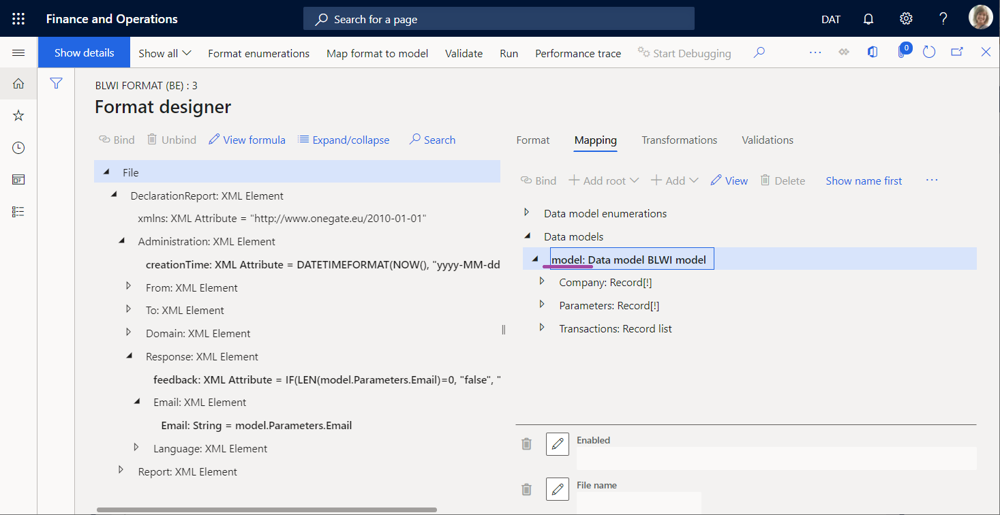
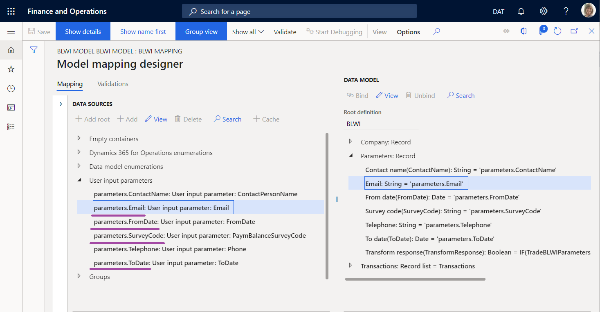
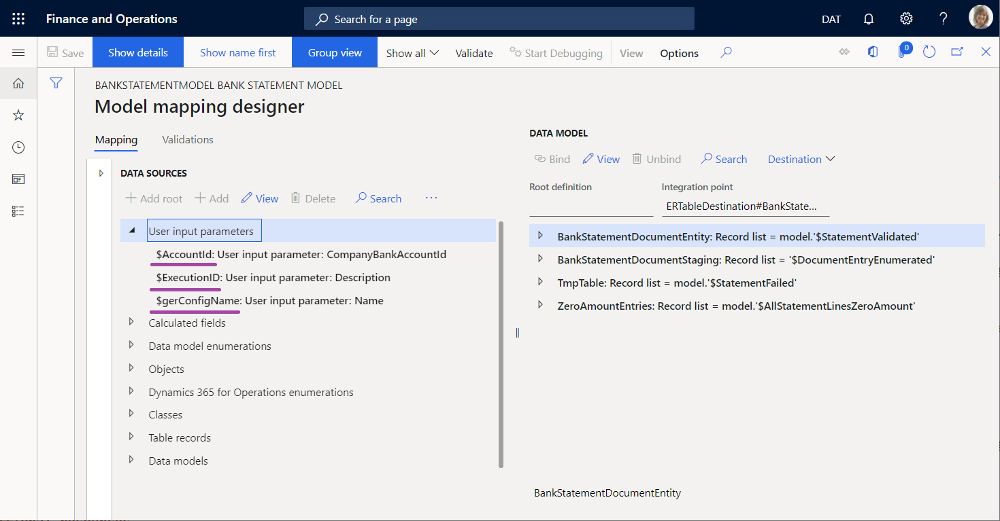

---
# required metadata

title: Initiate data source values of the USER INPUT PARAMETER type from source code
description: This topic describes how the data source values of the USER INPUT PARAMETER type can be initiated from source code.
author: NickSelin
ms.date: 04/26/2022
ms.topic: article
ms.prod: 
ms.technology: 

# optional metadata

# ms.search.form:  
audience: Developer, IT Pro
# ms.devlang: 
ms.reviewer: kfend
# ms.tgt_pltfrm: 
# ms.custom: 
ms.search.region: Global 
# ms.search.industry: 
ms.author: nselin
ms.search.validFrom: 2017-11-01
ms.dyn365.ops.version: Platform update 8
---

# Initiate data source values of the USER INPUT PARAMETER type from source code

[!include [banner](../includes/banner.md)]

When you design ER model mapping and ER format components, use the data sources of the *User input parameter* type to obtain the necessary values offered at runtime before the execution of an ER format begins. This dialog box can be programmatically turned off when the required parameters are entered on another page or when an ER format is executed in unattended (batch) mode. When the ER dialog box is turned off, you must initiate the data source values of the *User input parameter* type from source code.

## Format components for outgoing electronic documents

You can configure an ER format to generate an outbound document. When you configure the format, an ER data model is selected as the data source used to fill in the outbound document. Configure an ER model mapping to specify how the selected data model is filled in by application data at runtime. When you design your model mapping, specify data sources to collect the desired values from different sources and populate them to your data model. Among others, you might use data sources of the *User input parameter* type to fill in your data model with values that are entered by users on the ER user dialog box that is offered when you first [run](er-apis-app73.md#code-to-run-a-format-mapping-for-data-export) an ER format. 

For an ER format that is configured to generate an outbound document, the ER dialog box can be programmatically turned off by using the `_showPromptDialog` parameter of the `createFormatMappingRunByFormatMappingId()` method of the `ERObjectsFactory` class. In this case, you need to initiate values of data sources of the *User input parameter* type from the source code. To do this, use the following pattern.

```xpp
ERModelDefinitionInputParametersAction Obj = new ERModelDefinitionInputParametersAction();
Obj.addParameter(<path to an ER data source>, <data source value>);
ERObjectsFactory::createFormatMappingRunByFormatMappingId(formatMappingID, fileName, false)
            .withParameter(Obj)
            .run();
```

For ER formats that are configured to generate an outbound document, the path to an ER data source is constructed from the prefix and the suffix that are separated by a slash ( **/** ) character. The prefix represents the name of a data source of the *Model* type that resides in the running ER format. The suffix represents the path to a data source of the *User input parameter* type that resides in a model mapping that is used by the running ER format as the implementation of the relevant data model.

> [!TIP]
> The nodes of a data source path are separated by a slash ( **/** ) character. Use the `ERPath::Combine()` method to construct a path.

For more information, review the source code of the `BankPaymBalanceXML` application class that can be used as an example. From the Global repository, [import](er-download-configurations-global-repo.md) the **BLWI format (BE)** ER format [configuration](general-electronic-reporting.md#Configuration) that is called  to your Finance instance by using this application class. The base **BLWI model** configuration is imported automatically with the imported ER format configuration.

```x++
    /// <summary>
    /// Runs export via ER solution.
    /// </summary>
    [Microsoft.Dynamics.BusinessPlatform.SharedTypes.InternalUseOnlyAttribute]
    protected void runER()
    {
        const str erParmEmail = 'model/parameters.Email';
        const str erParmFromDate = 'model/parameters.FromDate';
        const str erParmToDate = 'model/parameters.ToDate';
        const str erParmSurveyCode = 'model/parameters.SurveyCode';

        ERModelDefinitionInputParametersAction modelDefinitionInputParametersAction = new ERModelDefinitionInputParametersAction();

        modelDefinitionInputParametersAction.addParameter(erParmEmail, email)
            .addParameter(erParmFromDate, fromDate)
            .addParameter(erParmToDate, toDate)
            .addParameter(erParmSurveyCode, BankPaymBalanceSurvey::find(surveyCodeRecId).SurveyCode);

        ERObjectsFactory::createFormatMappingRunByFormatMappingId(tradeBLWIParameters.ERFormatMappingID, fileName)
            .withFileDestination(fileDestination)
            .withParameter(modelDefinitionInputParametersAction)
            .run();
    }
```

The `email`, `fromDate`, and `toDate` variables are used to store values that have been entered on other pages other than the ER dialog box before an ER format has been called. The `runER()` method of this class [runs](er-apis-app73.md#code-to-run-a-format-mapping-for-data-export) an ER format mapping that uses these variables to initiate values of several data sources. The prefix of every path of such a data source (such as `erParmEmail`, `erParmFromDate`, or `erParmToDate` constants in the sample code) is defined as the name of a format data source of the *Model* type (**model** value).



The suffix of every path of such a data source is defined as the path to the relevant data source of a model mapping that is used at runtime. In the sample code, this can include `parameters.Email`, `parameters.FromDate`, or `parameters.ToDate`.



## Format components for inbound electronic documents

You can also configure an ER format that can be [run](er-apis-app73.md#code-to-run-a-format-mapping-for-data-import) to parse an inbound document and update application data. This format must contain a format mapping that refers to a model mapping of the *To destination* type that is used to update application data based on the content of an inbound document. In this type of model mapping, you can also use data sources of the *User input parameter* type to get values at runtime from the ER user dialog box and then use them for application data update.

When an ER format is executed to parse an inbound document, the ER dialog box can be programmatically turned off by using the `_showPromptDialog` parameter of the `createMappingDestinationRunByImportFormatMappingId()` method of the `ERObjectsFactory` class.

For ER formats that are configured to parse an inbound document, the path to an ER data source is constructed as the path to a data source of the *User input parameter* type that resides in a model mapping of the *To destination* type that is called from the running ER format to update application data.

For more information, review the source code of the `BankStatementImportBatch` application class that can be used as an example.

```xpp
        var integrationPoint = classStr(ERTableDestination) + '#' + tableStr(BankStatementDocumentEntity);
        ERmodelDefinitionInputParametersAction inputParameters = new ERmodelDefinitionInputParametersAction();
        inputParameters.addParameter('$ExecutionID', _executionID)
            .addParameter('$gerConfigName', _gerConfigName)
            .addParameter('$AccountId', bankAccount);

        var runner = ERObjectsFactory::createMappingDestinationRunByImportFormatMappingId(_erModelMappingId, integrationPoint);
        runner.withParameter(inputParameters);
        runner.init();
        
        if (runner.promptsContractedModelMapping())
        {
            var parameters = runner.getParameters();
            var traverser = new ERModelDefinitionParametersTraverser(parameters);
            while (traverser.moveNext())
            {
                ERIImportFormatDataSourceContract current = ERCast::asObject(traverser.current()) as ERIImportFormatDataSourceContract;
                if (current)
                {
                    current.parmInputDataStream(File::UseFileFromURL(DMFStagingWriter::getDownloadURLFromFileId(_uploadedStatement)));
                }
            }
        }

        runner.runUnattended();
```

Pay attention to the `_executionID`, `_gerConfigName`, and `bankAccount` variables that are used to initiate the values of the `$ExecutionID`, `$gerConfigName`, and `$AccountId` data sources.

From the Global repository, import the **Camt.053 Format** ER format configuration that is called by using this application class to your Finance instance. The **Bank statement model** configuration is imported automatically with the imported ER format configuration. Additionally, import the **Bank statement mapping to destination** ER configuration that contains a model mapping using to update application data.



## Limitations
You can only initiate data source values of the *User input parameter* type that are configured in an ER model mapping that is used at runtime. The data source values of the *User input parameter* type that are configured in an ER format can't be initiated from the source code.

## Additional resources

[Electronic reporting (ER) overview](general-electronic-reporting.md)

[Parse incoming documents](er-parse-incoming-documents.md)


[!INCLUDE[footer-include](../../../includes/footer-banner.md)]
