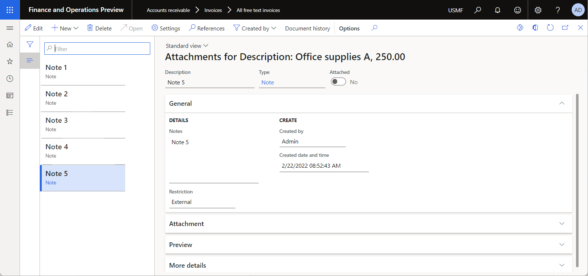
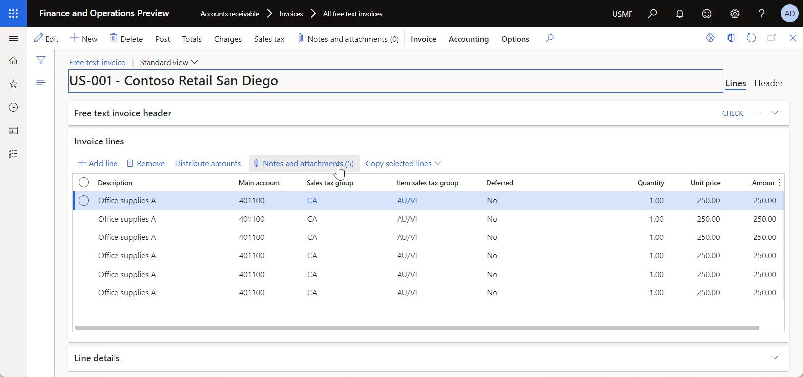
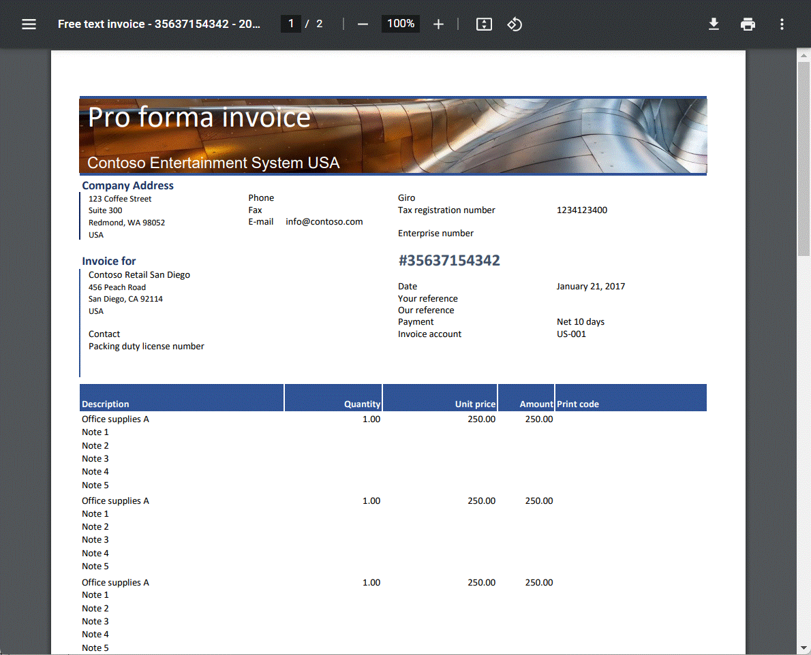
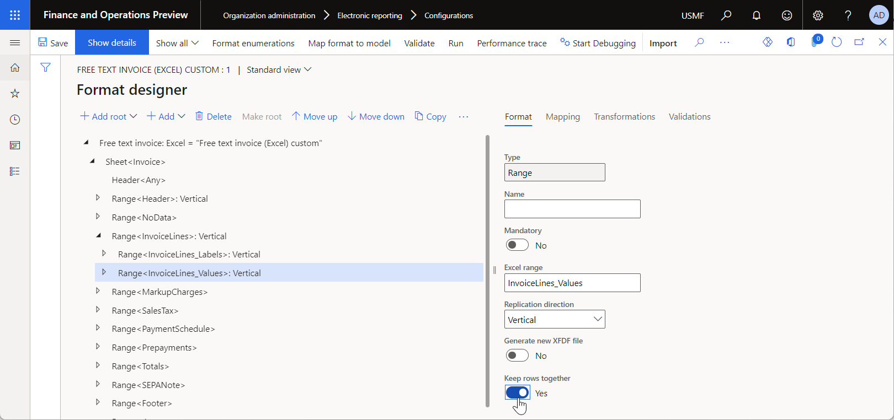

---
# required metadata

title: Design an ER format to keep rows together on the same Excel page
description: This topic explains how to design an Electronic reporting (ER) format that keeps rows together on the same Microsoft Excel page.
author: NickSelin
ms.date: 02/28/2022
ms.topic: article
ms.prod: 
ms.technology: 

# optional metadata

ms.search.form: EROperationDesigner
# ROBOTS: 
audience: Application User, Developer, IT Pro
# ms.devlang: 
ms.reviewer: kfend
# ms.tgt_pltfrm: 
ms.custom: 220314
ms.assetid: 
ms.search.region: Global
# ms.search.industry: 
ms.author: nselin
ms.search.validFrom: 2022-03-01
ms.dyn365.ops.version: Version 10.0.26

---

# Design an ER format to keep rows together on the same Excel page

[!include [banner](../includes/banner.md)]

This topic explains how a user in the System Administrator or Electronic Reporting Functional Consultant role can configure an [Electronic reporting (ER)](general-electronic-reporting.md) [format](er-overview-components.md#format-component) that generates outbound documents in Microsoft Excel and manage document pagination so that rows that are created are kept on the same page.

In this example, you will modify the Microsoft-provided ER format that is used to print free text invoices in Excel. Your modifications will let you manage the pagination of a generated free text invoice report so that all the rows of a single invoice line are kept on the same page when possible.

The procedures in this topic can be completed in the **USMF** company. No coding is required.

In this example, you will create the required ER [configurations](general-electronic-reporting.md#Configuration) for the **Litware, Inc.** sample company. Make sure that the configuration provider for the **Litware, Inc.** (`http://www.litware.com`) sample company is listed for the ER framework, and that it's marked as **Active**. If this configuration provider isn't listed, or if it isn't marked as **Active**, follow the steps in [Create a configuration provider and mark it as active](tasks/er-configuration-provider-mark-it-active-2016-11.md).

## Enter a new free text invoice

1. Follow the steps in [Create a free text invoice](../../../finance/accounts-receivable/create-free-text-invoice-new.md#create-a-free-text-invoice-1) to add a free text invoice.

    1. Add a single line to the invoice.
    2. Add five notes for the invoice line.

    

2. Follow the steps in [Copy lines](../../../finance/accounts-receivable/create-free-text-invoice-new.md#copy-lines) to create five additional invoice lines that are copies the invoice line that you added in the previous step.

    

## Configure the ER framework

Follow the steps in [Configure the ER framework](er-quick-start2-customize-report.md#ConfigureFramework) to set up the minimal set of ER parameters. You must complete this setup before you start to use the ER framework to design a custom version of a standard ER format.

## Import the standard ER format configuration

Follow the steps in [Import the standard ER format configuration](er-quick-start2-customize-report.md#ImportERSolution1) to add the standard ER configurations to your current instance of Dynamics 365 Finance. For example, import version **252.116** of the **Free text invoice (Excel)** format configuration. Base version **252** of the base **Invoice model** configuration is automatically imported from the repository together with the required **Invoice model mapping** configuration.

## Set up print management to use the standard ER format

Follow the steps in [Set up print management](er-embed-images-header-footer-excel-reports.md#ConfigurePrintManagement1) to configure print management for the **Accounts receivable** module so that the standard ER format is used to print free text invoices.

## Configure a format destination for the standard ER format

Follow the steps in [Configure a format destination for on-screen preview](er-quick-start1-new-solution.md#ConfigureDestination) to configure the [Screen](er-destination-type-screen.md) ER destination of the standard ER format so that generated reports are converted to PDF format and previewed on a new browser tab.

## Print a free text invoice by using the standard ER format

1. Follow the steps in [Print a free text invoice](er-embed-images-header-footer-excel-reports.md#ProcessInvoice1) to use the standard ER format to generate a free text invoice report in Excel format for the added invoice.
2. Download the generated Excel workbook, and review it in the Excel desktop application.

    Notice that the sixth line of the invoice starts on the first page of the report and continues on the second page. The last note appears on the second page, and it isn't obvious that it belongs to the sixth invoice line. Therefore, the page break in the middle of the content for the invoice line makes this document more difficult to read.

    

The remaining procedures in this topic show how you can tune the standard ER format to improve the look and readability of the invoice report by keeping all the content for a single invoice line on the same page.

## Create a custom format

Follow the steps in [Create a custom format](er-embed-images-header-footer-excel-reports.md#DeriveProvidedFormat) to derive a format from the imported ER format and create a **Free text invoice (Excel) custom** ER configuration that is available for editing and modification.

## Edit the custom format

1. Follow the steps in [Create a custom format](er-embed-images-header-footer-excel-reports.md#ConfigureDerivedFormat) to open the derived ER format for editing in the ER format designer.
2. On the **Format designer** page, in the format component tree in the left pane, expand **Free text invoice \> Sheet \> InvoiceLines**, and select the **InvoiceLines_Values** component.
3. On the **Format** tab, set the **Keep rows together** option to **Yes**.

    

4. Select **Save**, and close the page.

## Mark the custom format as runnable

Follow the steps in [Mark the custom format as runnable](er-embed-images-header-footer-excel-reports.md#MarkFormatRunnable) to make the modified version of the custom ER format runnable.

## Set up print management to use the custom ER format

Follow the steps in [Set up print management](er-embed-images-header-footer-excel-reports.md#ConfigurePrintManagement2) to configure print management for the **Accounts receivable** module so that the custom ER format is used to print free text invoices.

## Configure a format destination for the custom ER format

Follow the steps in [Configure a format destination for on-screen preview](er-quick-start1-new-solution.md#ConfigureDestination) to configure the **Screen** ER destination of the custom ER format so that generated reports are converted to PDF format and previewed on a new browser tab.

## Print a free text invoice by using the custom ER format

1. Follow the steps in [Print a free text invoice](er-embed-images-header-footer-excel-reports.md#ProcessInvoice2) to use the custom ER format to generate a free text invoice report in Excel format for the added invoice.
2. Download the generated Excel workbook, and review it in the Excel desktop application.

    Notice that the sixth line of the invoice starts on the second page, and all the Excel rows that represent this invoice line appear together on that page.

    

## Additional resources

[Design a configuration for generating documents in Excel format](er-fillable-excel.md)

[!INCLUDE[footer-include](../../../includes/footer-banner.md)]
