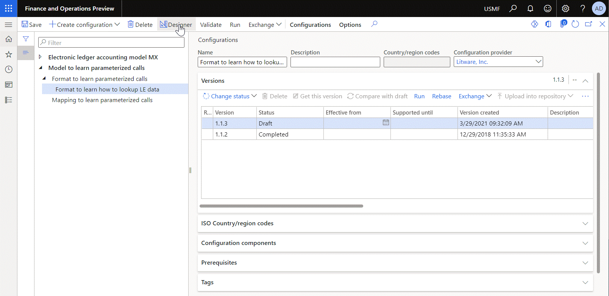
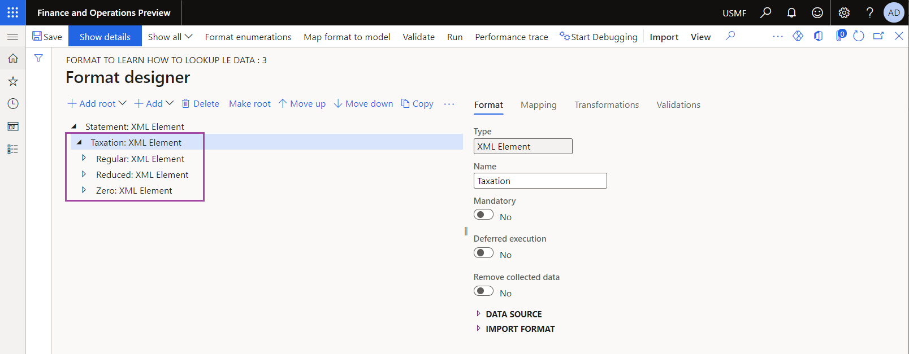
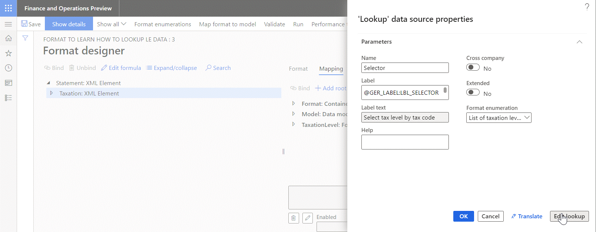
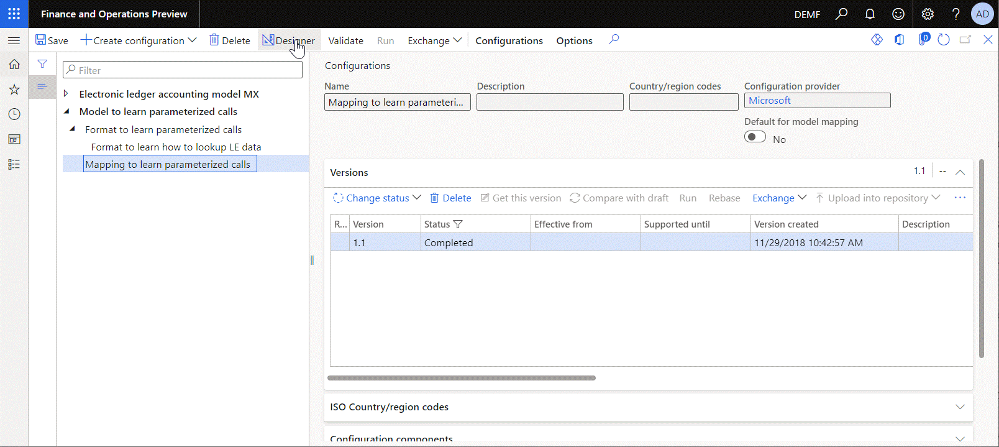
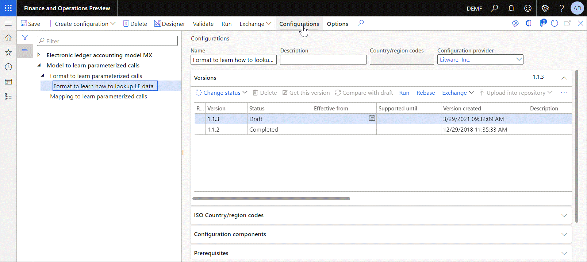
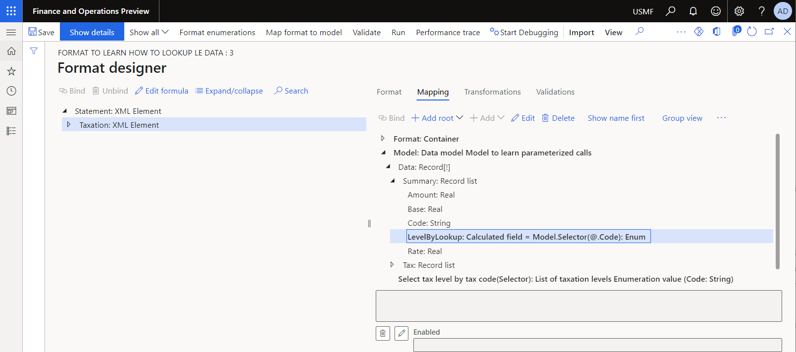
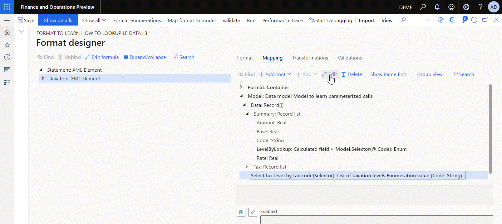
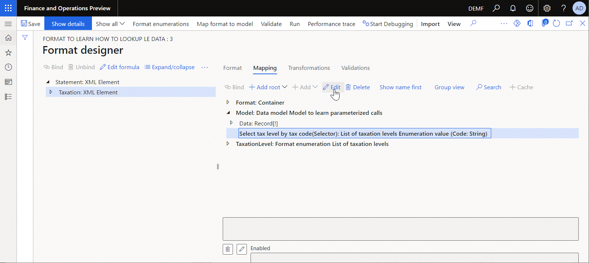

# Configure Lookup data sources to use ER application-specific parameters 

[!include[banner](../includes/banner.md)]

The [Electronic reporting (ER)](general-electronic-reporting.md) application-specific parameters feature lets you configure data filtering in an ER format so that it's based on a set of abstract rules. This set of rules can be configured to use the data source of the **Lookup** type that is available in an ER format. You can then specify real rules beyond the ER components designers by using the user interface (UI) that is automatically generated based on the settings of the **Lookup** data source of the corresponding ER format and the current legal entity data. Eventually, the specified rules will be accessed by the ER format's **Lookup** data source when this ER format is executed.

> [!NOTE]
> Use the configured data sources of the editable ER format to specify what application data is used to configure real rules.

Use the [ER Operations designer](general-electronic-reporting.md#building-a-format-that-uses-a-data-model-as-a-base) to bring a data source of the **Lookup** type in to your ER format. The data source must be configured to describe how your abstract rules look, including the following:

   - The parameter set of certain data type whose value is provided to specify a single rule.
   - The value type of certain data type that is returned by a single rule when this rule is considered the most appropriate among others.

You can configure the following types of **Lookup** data sources depending on the type of value that is returned by any configured rule:

   - Use the **Data model\Lookup** type when a model enumeration value must be returned.
   - Use the **Dynamics 365 Operations\Lookup** type when an application enumeration value or an application [extended data type](../extensibility/extensible-edts.md) value must be returned.
   - Use the **Format enumeration\Lookup** type when a format enumeration value must be returned.

The following illustration shows how a format enumeration can be configured in the sample ER format.

   

The following illustration shows the format components that were configured to report different type of taxes in a different section of a generated report.

   

The following illustration shows how the ER Operations designer allows the addition of a data source of the **Format enumeration\Lookup** type.  The added data source is configured as returning a value of the `List of taxation levels` format enumeration.

   

The following illustration shows how the added data source is configured to use the **Code** field of the **Model.Data.Tax** record list of the **Model** data source as a parameter that must be specified for every configured rule.

The added `Model.Data.Tax` data source is configured to specify a tax code for every configured rule by accessing records of the **TaxTable** application table.

   

You can set up the lookup rules for the selected ER format by using the UI that is automatically aligned with the structure of the configured data source. Currently, this UI requires that for each rule, you specify the returned value as the `List of taxation levels` format enumeration value as well as the tax code as a parameter.

   

The following illustration shows how the `Model.Data.Summary.LevelByLookup` data source of the **Calculated field** type can be configured to call the configured **Lookup** data source providing the required parameters. To process this call at runtime, ER goes through the list of configured rules in the defined sequence to locate the first rule that satisfies the provided conditions. In this example, it's the rule that contains the tax code that matches the provided one. As the result, the most appropriate rule is found and the enumeration value that is configured for the found rule is returned by this data source.

> [!NOTE]
> An exception is thrown when no applicable rule is found. To prevent these exceptions, configure additional rules at the end of the rules list to handle cases when a non-configured value or no value is provided. Use the **\*Not blank**\* and **\*Blank**\* options accordingly.  
>
> 

When you set the **Cross-company** option to **Yes** for the editable lookup data source, you add a new required **Company** parameter to the set of parameters of this data source. The value of the **Company** parameter must be specified at runtime when the lookup data source is called. When the company code is specified at runtime, the rules configured for this company are used to find the most appropriate rule, and the corresponding value is returned. The following illustration shows how you can do this and how the set of parameters of the editable data source is changed.

   

> [!NOTE]
> Select every company seperately to configure the set of rules for this lookup data source of the editable ER format. An exception is thrown at runtime when the cross-company lookup is called with the code of the company for which the lookup setting was not completed.
>
> Make sure that you grant permissions for a user who runs the ER format with the cross-company **Lookup** data source to access the data of every company that is in scope of this data source. Otherwise, an exception is thrown at runtime.

Starting in version 10.0.19, the extended capabilities of the **Lookup** data sources are available. When you set the **Extended** option to **Yes** for the editable lookup data source, the configured lookup data source is transformed to the structured data source that offers the additional capabilities to analyze the configured set of rules. The following illustration shows this transformation.

   

- The **Lookup** sub-item is designed as a function to find the most appropriate rule from the set of configurable rules based on the provided set of parameters.
- The **IsLookupResultSet** sub-item is designed as a function to accept the provided value of the base enumeration data source and return the *Boolean* value of **True** when the set of rules contain at least one rule for which the provided enumeration value was configured as a returned value. This function returns the *Boolean* value of **False** when there are no rules configured to return the provided enumeration value.
- The **Setting** sub-item is designed as a function that returns the set of configured rules as records of a record list. The returned values and the set of parameters of the configured rules are presented in every returned record as fields of the relevant data types:

    - The returned value is presented as the **Lookup result** field.
    - The configured parameters are presented as fields having names of parameters (**Code** field in this example).

For more information about to how configure the **Lookup** data source, see [Configure ER formats to use parameters that are specified per legal entity](er-app-specific-parameters-configure-format.md). To learn how to set the Lookup rules, see [Set up the parameters of an ER format per legal entity](er-app-specific-parameters-set-up.md).

## Additional resources

[Configure ER formats to use parameters that are specified per legal entity](er-app-specific-parameters-configure-format.md)

[Set up the parameters of an ER format per legal entity](er-app-specific-parameters-set-up.md)
