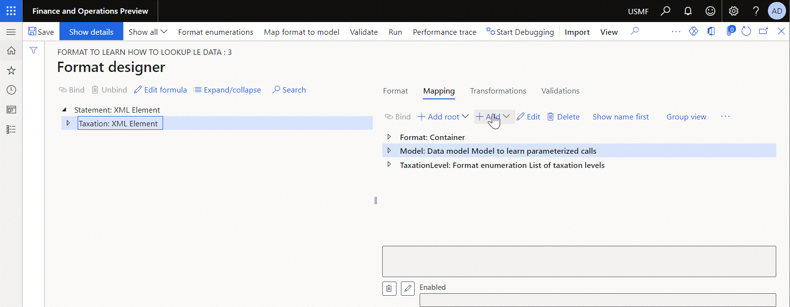

---
# required metadata

title: Configure Lookup data sources to use the ER application-specific parameters feature
description: This topic explains how you can configure Lookup data sources in Electronic reporting (ER) formats to use the ER application-specific parameters feature.
author: NickSelin
manager: AnnBe
ms.date: 3/18/2021
ms.topic: article
ms.prod: 
ms.technology: 

# optional metadata

ms.search.form: ERSolutionTable, EROperationDesigner, ERLookupDesigner, ERComponentLookupStructureEditing
# ROBOTS: 
audience: Application User, Developer, IT Pro
# ms.devlang: 
ms.reviewer: kfend
# ms.tgt_pltfrm: 
ms.custom: 
ms.assetid: 
ms.search.region: Global
# ms.search.industry: 
ms.author: nselin
ms.search.validFrom: 2019-01-01
ms.dyn365.ops.version: Release 8.1.3

---

# Configure Lookup data sources to use the ER application-specific parameters feature

[!include[banner](../includes/banner.md)]

## Overview

The [Electronic reporting (ER)](general-electronic-reporting.md) application-specific parameters feature lets power users configure data filtering in an ER format so that it's based on a set of abstract rules. This set of rules can be configured to use the data source of the **Lookup** type that is available in an ER format. Business users can then specify real rules beyond the ER components designers by using the user interface (UI) that is automatically generated based on the settings of the **Lookup** data source of the corresponding ER format and the current legal entity data. Eventually, the specified rules will be accessed by the ER format's **Lookup** data source when this ER format is executed.

> [!NOTE]
> Note that you can use the configured data sources of the editable ER format to specify what application data is used for configuring real rules.

You can use the [ER Operations designer](general-electronic-reporting.md#building-a-format-that-uses-a-data-model-as-a-base) to bring into your ER format a data source of the **Lookup** type. It must be configured to describe how your abstract rules look like including the following:

- The set of parameters of certain data type the value of which is provided to specify a single rule
- The type of a value of certain data type that is returned by a single rule when this rule is considered as the most appropriate one among others

You can configure the following types of **Lookup** data sources depending on the type of value that is returned by any configured rule:

- **Data model\Lookup** type is used when a model enumeration value must be returned
- **Dynamics 365 for Operations\Lookup** type is used when an application enumeration value or an application [extended data type](../extensibility/extensible-edts.md) value must be returned
- **Format enumeration\Lookup** type is used when a format enumeration value must be returned

The following illustration shows that a format enumeration can be configured in the sample ER format.

The following illustration shows the format components that were configured to report different type of taxes in different section of a generated report.

The following illustration shows how the ER Operations designer allows to add a data source of the **Format enumeration\Lookup** type.  Note that the added data source was configured as returning a value of the `List of taxation levels` format enumeration.

The following illustration shows how the added data source is configured to use the **Code** field of the **Model.Data.Tax** record list of the **Model** data source as a parameter that must be specified for every configured rule.

Note that the added `Model.Data.Tax` data source was configured to specify a tax code for every configured rule by accessing records of the **TaxTable** application table.

You can set up the lookup rules for the selected ER format by using the UI that is automatically aligned with the structure of the configured data source. Currently, this UI requires to specify for every rule a returned value as the `List of taxation levels` format enumeration value as well as the tax code as a parameter.

The following illustration shows how the `Model.Data.Summary.LevelByLookup` data source of the **Calculated field** type can be configured to call the configured **Lookup** data source providing the required parameters. To process this call at runtime, ER will go through the list of configured rules in the defined sequence trying to find the first rule that satisfies the provided conditions - in this sample it will be the rule that contains the tax code that matches to the provided one. As the result, the most appropriate rule will be found and the configured for the found rule enumeration value will be returned by this data source.

> [!NOTE]
> An exception is thrown when no applicable rule is found. To prevent such exceptions, configure additional rules at the end of the rules list to handle cases when either non-configured value or no value is provided. Use the **\*Not blank*** and **\*Blank*** options accordingly.  

When you set the **Cross-company** option to **Yes** for the editable lookup data source, you add a new **Company** mandatory parameter to the set of parameters of this data source. The value of the **Company** parameter must be specified at runtime whenever the lookup data source is called. When the company code is specified at runtime call, the configured for this company rules will be used to find the most appropriate rule and the corresponding value will be returned. The following illustration shows how you can do this and how the set of parameters of the editable data source is changed.

> [!NOTE]
> Note that you must select every company individually to configure the set of rules for this lookup data source of the editable ER format. An exception is thrown at runtime when the cross-company lookup is called with the code of the company for which the lookup setting was not completed.
>
> Please, make sure that you granted permissions for a user who runs the ER format with the cross-company **Lookup** data source to access data of every company that is in scope of this data source. Otherwise, an exception is thrown  at runtime.

Starting from the version 10.0.19, the extended capabilities of the **Lookup** data sources are available. When you set the **Extended** option to **Yes** for the editable lookup data source, the configured lookup data source is transformed to the structured data source that offers the additional capabilities to analyze the configured set of rules. The following illustration shows this transformation.

- The **Lookup** sub-item is designed as a function to find the most appropriate rule from the set of configurable rules based on the provided set of parameters.
- The **IsLookupResultSet** sub-item is designed as a function to accept the provided value of the base enumeration data source and return the *Boolean* value of **True** when the set of rules contains at least one rule for which the provided enumeration value was configured as a returned value. This function returns the *Boolean* value of **False** when there are no rules configured to return the provided enumeration value.
- The **Setting** sub-item is designed as a function returning the set of configured rules as records of a record list. The returned values and the set of parameters of the configured rules are presented in every returned record as fields of the relevant data types:

    - The returned value is presented as the **Lookup result** field.
    - The configured parameters are presented as fields having names of parameters (**Code** field in our sample).

To learn how you can configure the **Lookup** data source, review the [Configure ER formats to use parameters that are specified per legal entity](er-app-specific-parameters-configure-format.md) page. To learn how you can set the Lookup rules, review the [Set up the parameters of an ER format per legal entity](er-app-specific-parameters-set-up.md) page.

## Additional resources

[Configure ER formats to use parameters that are specified per legal entity](er-app-specific-parameters-configure-format.md)

[Set up the parameters of an ER format per legal entity](er-app-specific-parameters-set-up.md)
