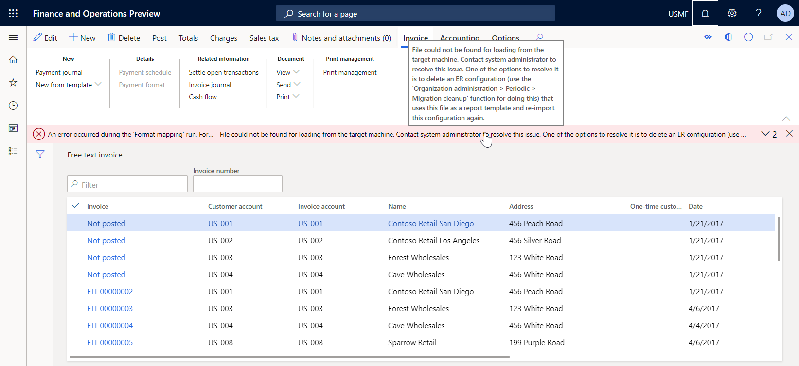
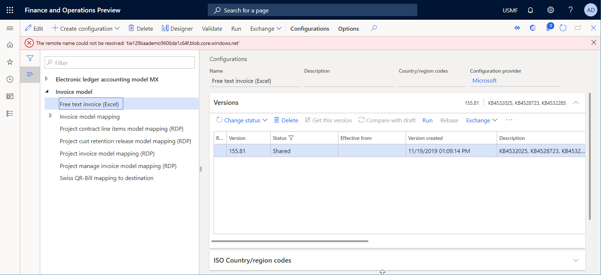
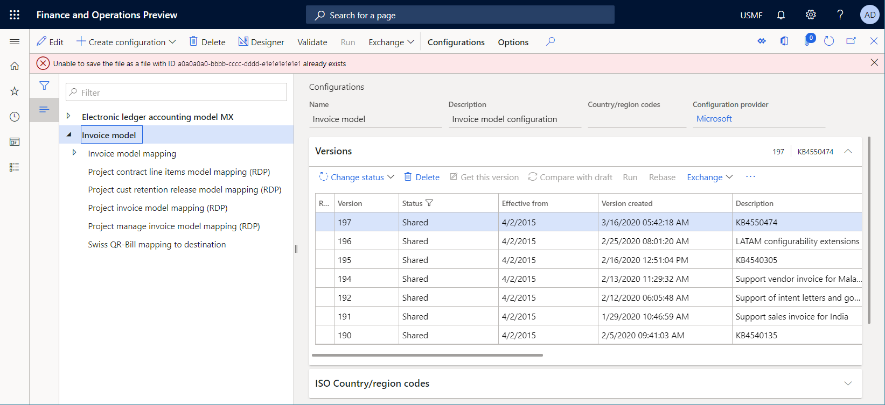

---
# required metadata

title: ER migration cleanup
description: This topic explains how you can use the ER migration cleanup function to resolve issues with ER templates.
author: NickSelin
ms.date: 04/29/2020
ms.topic: article
ms.prod: 
ms.technology: 

# optional metadata

ms.search.form: ERSolutionTable, ERWorkspace, ERParameters, ERMigrationCleanup
# ROBOTS: 
audience: Application User, Developer, IT Pro
# ms.devlang: 
ms.reviewer: kfend
# ms.tgt_pltfrm: 
ms.custom: 
ms.assetid: 
ms.search.region: Global
# ms.search.industry: 
ms.author: nselin
ms.search.validFrom: 2018-01-01
ms.dyn365.ops.version: AX 8.0.0

---

# ER migration cleanup 

[!include[banner](../includes/banner.md)]

When you manage your Finance instances, you might decide to migrate your current instance to another location. For example, you might migrate your production instance to a new sandbox environment. If you configured the Electronic reporting (ER) framework to store templates in Microsoft Azure Blob storage, the **DocuValue** table in the new sandbox environment refers to the instance of Blob storage in the production environment. However, this instance can't be accessed from the sandbox environment because the migration process doesn't support the migration of artifacts in Blob storage. Rather, it's expected that in the new sandbox environment, you refer to the instance of Blob storage in the sandbox environment that does not yet obtain the ER templates.

If you try to run an ER format that uses a template to generate business documents, an exception occurs, and you're notified about the missing template. You're also guided to use the ER migration cleanup option to delete and then re-import the ER format configuration that contains the template.

You will receive a similar error if you navigate to the **Configurations** page (**Organization administration** \> **Electronic reporting** \> **Configurations**) and in the configurations tree, try to delete an ER format configuration that uses a template.

Complete the following steps to resolve issues with ER templates that you are unable to access.

1.  Go to **Organization administration** \> **Periodic** \> **Migration cleanup** page.
2.  Select an ER format configuration that can’t be executed or deleted.
3.  Select **Delete**.
4.  Confirm the deletion of the selected ER format configuration.
5.  [Import](download-electronic-reporting-configuration-lcs.md) the deleted ER format configuration to the current Finance instance.

## Applicability

> [Important]
> The **Migration cleanup** option is targeted only for ER format configurations that contain non-accessible ER templates. When you delete an ER format configuration by using the **Migration cleanup** option, ER deletes the templates that are related to the configuration artifacts in the only application database. The existence of the appropriate physical files in Blob storage are not validated. Instead, it is assumed that there are none. Therefore, do not use the **Migration cleanup** option as an alternative to the ER configuration deletion option on the **Configurations** page. Use the **Migration cleanup** option only when the ER configuration deletion option on the **Configurations** page failed.
>
> If you use the **Migration cleanup** option to delete an ER format configuration when the referred template is available in the Blob storage, you only delete related configuration artifacts in the application database. The physical file of the template in the Blob storage remains. File overwriting in Blob storage is no longer allowed. For more information, see [KB4557217](https://fix.lcs.dynamics.com/Issue/Details?kb=4557217). Additionally, you will no longer be able to re-import the configurations deleted by using the Migration cleanup in this environment. To resolve this issue, you need to find the corresponding file in Blob storage and manually delete it.

A similar issue may occur if you migrate your application instance to another location that has been used as a migration target more than once and for which the Blob storage already contains ER template files.

Because you can have several ER format configurations, this process can be time consuming. Therefore, using the [Backup storage of ER templates](er-backup-storage-templates.md) feature to automatically recover templates with broken references is preferred.

[!INCLUDE[footer-include](../../../includes/footer-banner.md)]