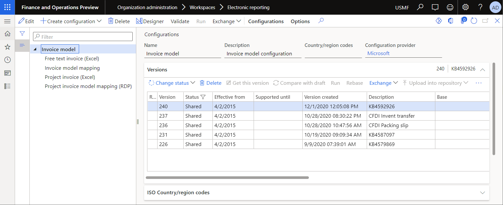
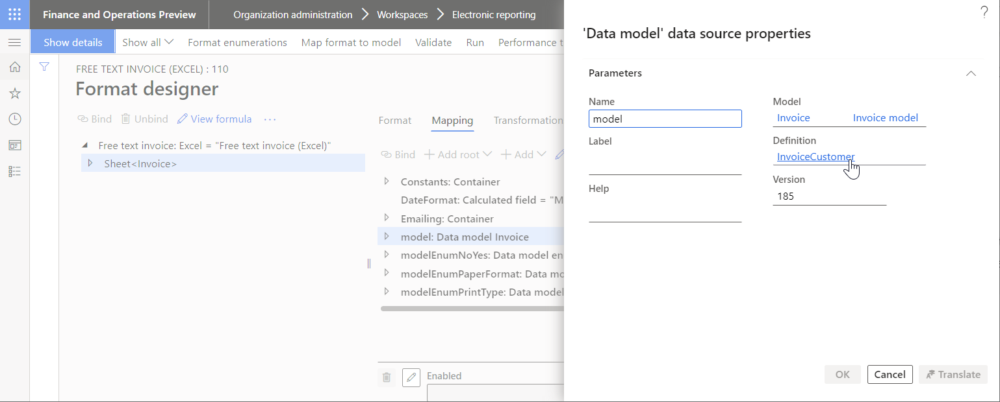
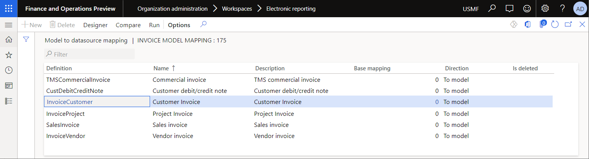
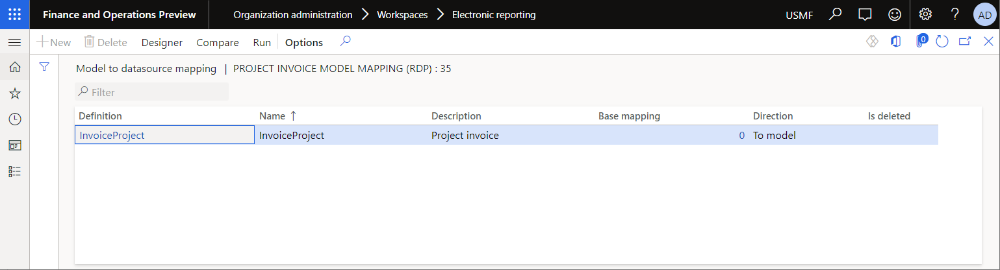
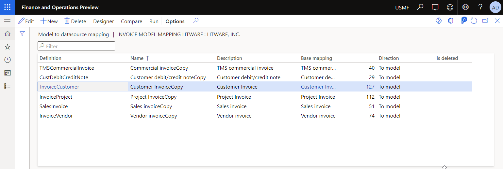
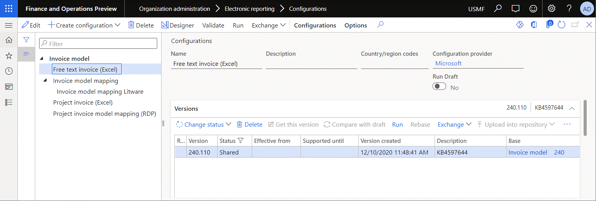
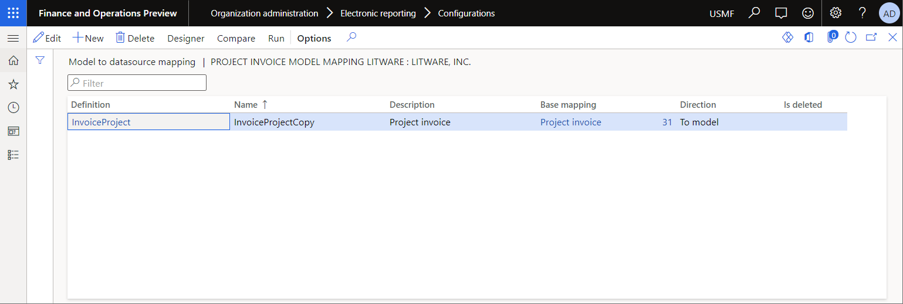
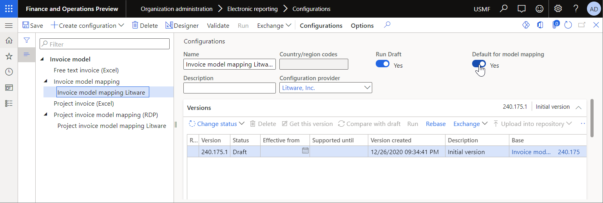
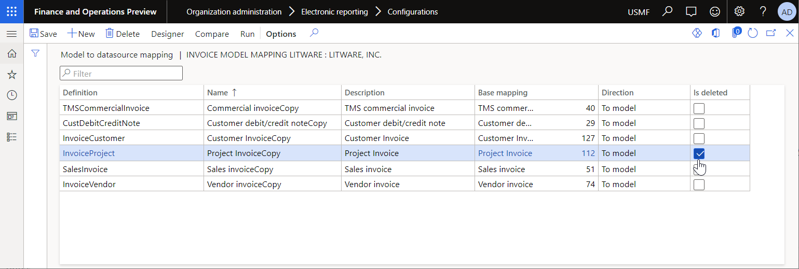

---
# required metadata

title: Manage several derived mappings for a single model root
description: This topic explains how a user in the System administrator or Electronic reporting developer role can manage several derived mappings that were configured for a single model root.
author: NickSelin
manager: AnnBe
ms.date: 12/26/2020
ms.topic: business-process
ms.prod: 
ms.service: dynamics-ax-applications
ms.technology: 

# optional metadata

ms.search.form: ERSolutionTable, ERModelMappingTable
audience: Application User
# ms.devlang: 
ms.reviewer: kfend
# ms.tgt_pltfrm: 
# ms.custom: 
ms.search.region: Global
# ms.search.industry: 
ms.author: nselin
ms.search.validFrom: 2016-06-30
ms.dyn365.ops.version: Version 7.0.0
---

# Manage several derived mappings for a single model root

[!include [banner](../includes/banner.md)]

An [Electronic reporting (ER)](general-electronic-reporting.md) data [model](general-electronic-reporting.md#data-model-and-model-mapping-components) component is used in every configured ER [format](general-electronic-reporting.md#FormatComponentOutbound) component as the source of data to generate outbound documents. To describe a single business domain, you can configure a data model component so that it has many root definitions. 

Every root definition lets you represent data of that domain in the way that is best suited to specific reporting purposes. For every root definition, you can configure an ER [model mapping](general-electronic-reporting.md#data-model-and-model-mapping-components) component as the Microsoft Dynamics 365 Finance–specific implementation of your data model. In this way, you describe how your data model will be filled in at runtime.

ER model mapping components can reside in ER data model [configurations](general-electronic-reporting.md#Configuration) and ER model mapping configurations. A single ER configuration can contain many mapping components, each of which is configured for a single root definition. Alternatively, a single ER configuration can contain just one mapping component that is configured for a single root definition.

Therefore, many configuration providers might offer ER model mapping configurations for the same ER data model, and those model mapping configurations might contain mapping components for different root definitions. You might decide to use a model mapping for one root definition that is offered by one [provider](general-electronic-reporting.md#Provider) and simultaneously use a model mapping for another root definition that is offered by another provider.

The procedures in this topic explain how a user who is assigned to the System administrator or Electronic reporting developer role can manage multiple ER model mapping configurations of an ER data model when they contain different model mapping components that have been configured for the same root definition.

All the following procedures can be done in the USMF company. No coding is required.

## Configure the ER framework

As a user in the Electronic reporting developer role, you must [configure the minimal set](er-quick-start2-customize-report.md#ConfigureFramework) of ER parameters before you can start to use the ER framework to generate business documents.

## Import the standard ER format configurations

To add the standard ER configurations to your current instance of Finance, you must import them from the ER repository that was configured for that instance. Follow the steps in [Download ER configurations from the Global repository of Configuration service](er-download-configurations-global-repo.md) to import the following ER format configurations:

- **Free text invoice (Excel)**, version 220.106
- **Project invoice (Excel)**, version 226.27

## Review the imported ER configurations

1. Go to **Organization administration** \> **Workspaces** \> **Electronic reporting**.
2. On the **Localization configurations** page, in the **Configurations** section, select the **Reporting configurations** tile.
3. On the **Configurations** page, in the configuration tree in the left pane, expand **Invoice model**.

    

4. Review the **Free text invoice (Excel)** format:

    1. In the configuration tree in the left pane, select **Free text invoice (Excel)**.
    2. On the Action Pane, select **Designer**.
    3. On the **Format designer** page, on the **Mapping** tab, in the data sources list, select **Model**.
    4. Select **View**.
    5. Notice that the current ER format is configured to use the **InvoiceCustomer** root definition of **Invoice model**. Therefore, when this format is run, and the **Model** data source is called, the model mapping that is configured for the **InvoiceCustomer** root definition will be used to access application data and fill in the data model.

        

    6. Close the **Format designer** page.

5. Review the content of the **Invoice model mapping** configuration:

    1. In the configuration tree in the left pane, select **Invoice model mapping**.
    2. On the Action Pane, select **Designer**.
    3. On the **Model to datasource mapping** page, notice that the current ER model mapping configuration contains several model mapping components:

        + The **Customer Invoice** model mapping is configured for the **InvoiceCustomer** root definition of **Invoice model**. Therefore, when the **Free text invoice (Excel)** ER format is run, the **Customer Invoice** model mapping of this ER configuration can be chosen to access application data and fill in the data model.
        + The **Project Invoice** model mapping is configured for the **InvoiceProject** root definition of **Invoice model**. Therefore, when the **Project invoice (Excel)** ER format is run, the **Project Invoice** model mapping of this ER configuration can be chosen to access application data and fill in the data model.

        

    4. Close the **Model to datasource mapping** page.
    5. On the **Versions** FastTab, select **Delete** to delete all versions of this ER configuration that are later than version 240.175.

6. Review the content of the **Project invoice model mapping (RDP)** configuration:

    1. In the configuration tree in the left pane, select **Project invoice model mapping (RDP)**.
    2. On the Action Pane, select **Designer**.
    3. On the **Model to datasource mapping** page, notice that the current ER model mapping configuration contains the **InvoiceProject** model mapping, and that this model mapping is configured for the **InvoiceProject** root definition of **Invoice model**. Therefore, when the **Project invoice (Excel)** ER format is run, the **InvoiceProject** model mapping of this ER configuration can be chosen to access application data and fill in the data model.

        

    4. Close the **Model to datasource mapping** page.
    5. On the **Versions** FastTab, select **Delete** to delete all versions of this ER configuration that are later than version 226.35.

## Customize the imported ER configurations

This section explains how to [customize](er-quick-start3-customize-report.md#customize-the-model-mapping-configuration) the model mappings that are provided by Microsoft. For example, customization might be required to implement your custom logic or add missing bindings.

### Customize the Invoice model mapping configuration

1. On the **Configurations** page, in the configuration tree in the left pane, select **Invoice model mapping**.
2. On the Action Pane, select **Create configuration**.
3. In the **Create configuration** drop-down dialog box, in the **New** field, select **Derive from Name: Invoice model mapping, Microsoft**.
4. In the **Name** field, enter **Invoice model mapping Litware**.
5. Select **Create configuration**.
6. [Mark](er-quick-start2-customize-report.md#MarkFormatRunnable) the [draft](general-electronic-reporting.md#component-versioning) version of the derived mapping as available for use at runtime:

    1. On the Action Pane, on the **Configurations** tab, in the **Advanced settings** group, select **User parameters**.
    2. In the **User parameters** dialog box, set the **Run settings** option to **Yes**, and then select **OK**.
    3. Select **Edit** to make the page editable, as required.
    4. For the **Invoice model mapping Litware** configuration that is currently selected in the configuration tree, set the **Run Draft** option to **Yes**.

7. On the Action Pane, select **Designer** to review the model mappings of this configuration.

    

    > [!TIP]
    > You can now open any of the ER model mapping components of this ER configuration in the designer to configure your custom logic. For more information, see [Customize the model mapping configuration](er-quick-start3-customize-report.md#customize-the-model-mapping-configuration).

8. Close the **Model to datasource mapping** page.

You now have **Invoice model mapping** and **Invoice model mapping Litware** configurations, each of which has a model mapping that is configured for the **InvoiceCustomer** root definition. You must explicitly assign one of the model mappings as the default model mapping that is used by any of the ER formats, such as the **Free text invoice (Excel)** format that contains a model data source that has the **InvoiceCustomer** root definition. Otherwise, when you run one of the ER formats, or try to edit or validate it, the following exception will be thrown to notify you that no default model mapping has been explicitly assigned:
 
> More than one model mapping exists for the '\<model name\> (\<root descriptor\>)' data model in the configurations \<configuration names separated by commas\>. Set one of the configurations as default.

### Customize the Project invoice model mapping (RDP) configuration

1. On the **Configurations** page, in the configuration tree in the left pane, select **Project invoice model mapping (RDP)**.
2. On the Action Pane, select **Create configuration**.
3. In the **Create configuration** dialog box, in the **New** field, select **Derive from Name: Project invoice model mapping (RDP), Microsoft**.
4. In the **Name** field, enter **Project invoice model mapping Litware**.
5. Select **Create configuration**.
6. For the **Project invoice model mapping Litware** configuration that is currently selected in the configuration tree, set the **Run Draft** option to **Yes**.
7. On the Action Pane, select **Designer** to review the model mappings of this configuration.

    

8. Close the **Model to datasource mapping** page.

You now have **Invoice model mapping**, **Project invoice model mapping (RDP)**, and **Project invoice model mapping Litware** configurations, each of which has a model mapping that is configured for the **InvoiceProject** root definition. You must explicitly assign one of the model mappings as the default model mapping that is used by any of the ER formats, such as the **Project invoice (Excel)** format that contains a model data source that has the **InvoiceProject** root definition. Otherwise, when you run one of the ER formats, or try to edit it, an exception will be thrown to notify you that no default model mapping has been explicitly assigned.

## Select the derived Invoice model mapping Litware configuration as the configuration that contains default model mappings

1. On the **Configurations** page, in the configuration tree in the left pane, select **Invoice model mapping Litware**.
2. Set the **Default for model mapping** option to **Yes**.

    

    Because of this setting, the **Customer Invoice Copy** model mapping from the **Invoice model mapping Litware** configuration will be used when you run the **Free text invoice (Excel)**, or when you start to edit or validate it. The **Customer invoice** model mapping from the **Invoice model mapping** configuration will be ignored.

    You can now open the **Free text invoice (Excel)** format for review in the format designer.

## Select the derived Project invoice model mapping Litware configuration as the configuration that contains default model mappings

1. On the **Configurations** page, in the configuration tree in the left pane, select **Project invoice model mapping Litware**.
2. Set the **Default for model mapping** option to **Yes**.

    In this case, unlike the case that is described for the **Invoice model mapping Litware** configuration in the previous section, you can't just start to use the **InvoiceProject Copy** model mapping from the **Project invoice model mapping Litware** configuration, because two configurations that contain a model mapping for the **InvoiceProject** root definition are currently marked as the default configuration. Therefore, they have equal priority for use. To resolve this issue, complete the remaining steps of this procedure.

3. In the configuration tree in the left pane, select **Invoice model mapping Litware**.
4. On the Action Pane, select **Designer**.
5. On the **Model to datasource mapping** page, select **Edit** to make the page editable, as required.
6. Select the **Project Invoice Copy** model mapping, and then select the **Is deleted** check box for it.

    

    Because of this setting, the **Invoice model mapping Litware** configuration will be treated as though it has no model mapping for the **InvoiceProject** root definition. Therefore, the **InvoiceProject Copy** model mapping will be used by default, because the **Project invoice model mapping Litware** configuration that contains this model mapping is marked as the default configuration and therefore has higher priority than the **InvoiceProject** model mapping from the **Project invoice model mapping (RDP)** configuration.

## Other considerations

Notice that the **InvoiceProject Copy** model mapping of the **Project invoice model mapping Litware** configuration is designed to use the **ReportDataProvider** data source of the *Object* type that refers to the **PsaProjInvoiceDP** application class. This class is implemented as the data provider for the project invoice SQL Server Reporting Services (SSRS) report of the Print management framework. You can select this data source as the ER [integration point](er-apis-app10-0-11.md#api-to-run-a-format-mapping-for-the-generation-of-outbound-documents). The current ER implementation for Print management reports takes this setting into account. (For more details, review the source code of the **ERPrintMgmtDataProviderReport** application class.) Therefore, at runtime, the assignment of the **ReportDataProvider** data source as the model mapping integration point will force Finance to treat this mapping component as though it has higher priority than the **InvoiceProject** mapping component from the **Project invoice model mapping (RDP)** configuration that the integration point wasn't configured for.

## Additional resources

- [Manage ER model mapping in separate ER configurations](./tasks/er-manage-model-mapping-configurations-july-2017.md)
- [Configure country context dependent ER model mappings](er-country-dependent-model-mapping.md)
- [Electronic reporting framework API changes](er-apis-app10-0-11.md)
