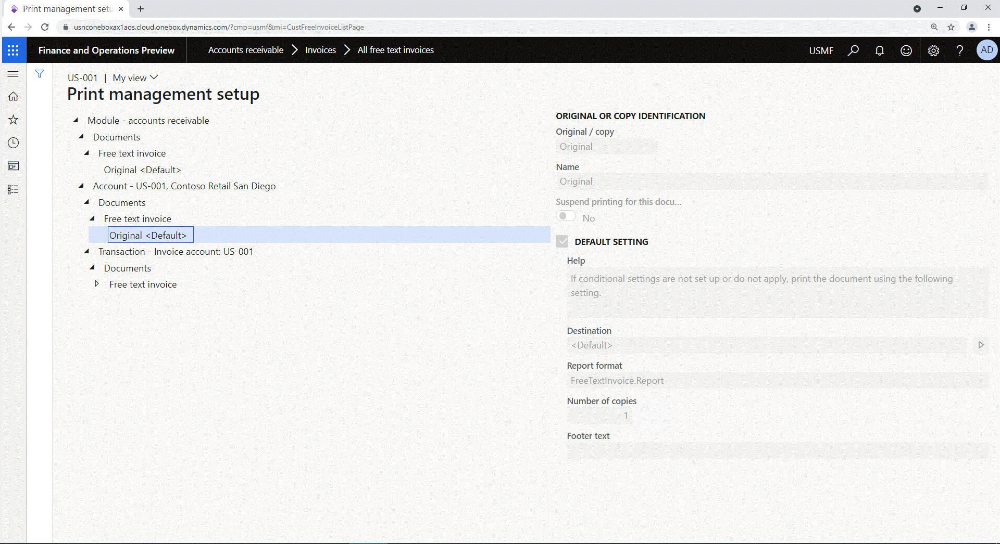
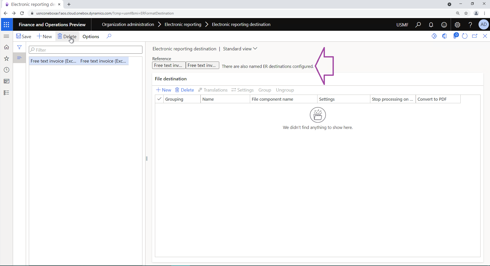

# Configure print management record-specific ER destinations

[!include [banner](../includes/banner.md)]

This article explains how a user in the System Administrator or Accounts Receivable Clerk role can perform the following tasks:

- Configure named [Electronic reporting (ER)](general-electronic-reporting.md) destinations for an ER solution that generates free text invoices.
- Assign an ER destination to a single [print management](document-reporting-services.md) record.

The procedures can be completed in the USMF company. No coding is required.

## Introduction

You can configure [destinations](electronic-reporting-destinations.md) for each folder in the file output component of an ER [format](general-electronic-reporting.md) [configuration](general-electronic-reporting.md#Configuration) that is used to generate an outbound document. When you run an ER format of this type, if you have the appropriate access rights, you can also change the configured destination settings at runtime.

In Microsoft Dynamics 365 Finance **version 10.0.17 and later**, an action code can be [set up](er-apis-app10-0-17.md) for an ER format to specify the action that users perform by running that ER format. For example, in the **Accounts receivable** module, in the print management settings, you can select an ER format that generates a specific business document, such as a free text invoice. You can then select **View** to preview the invoice or **Print** to send it to a printer. If an action is passed for the running ER format at runtime, you can [configure different ER destinations for different user actions](er-action-dependent-destinations.md).

In Finance **version 10.0.21 and later**, a named destination can be [set up](er-apis-app10-0-21.md) for an ER format and assigned to the print management record that is processed when that ER format is run. For example, in the **Accounts receivable** module, in the print management settings, you want to configure the **Original** record to perform the following actions:

- Run an ER format.
- Email the generated invoice to a customer.
- Configure the **Copy** record to run the same format.
- Print a copy of the invoice to a network printer.

In this case, you must configure different ER destinations for the ER format that is running, and you must select the destinations for different print management records.

## Prerequisites

Before you begin, the **Allow to set up ER destinations per print management item** feature must be turned on in the [Feature management](../../fin-ops/get-started/feature-management/feature-management-overview.md#the-feature-management-workspace) workspace. The source code must also be changed to allow for the configuration of named ER destinations in the current Finance instance and to enable the [new](er-apis-app10-0-21.md) ER API.

Additionally, the **Free text invoice (Excel)** ER configuration must be [imported](er-download-configurations-global-repo.md) into your Finance instance.

## Configure a new ER destination

1. Go to **Accounts receivable** \> **Invoices** \> **All free text invoices**.
2. Select an invoice for customer account **US-001**.
3. On the **Free text invoice** page, on the **Invoice** tab, in the **Print management** group, select **Print management**.
4. On the **Print management setup** page, expand **Module - accounts receivable** \> **Documents** \> **Free text invoice**, select the **Original** record, and then follow these steps:

    1.  Observe the current settings of the selected record:
        -   The default SSRS report **FreeTextInvoice.Report** is selected in the **Report format** field.
        -   The **\<Default\>** name is shown in the **Destination** field informing that there is no custom destination selected for the assigned SSRS report. 
    2.  In the **Report format** field, select the **Free text invoice (Excel)** ER format configuration.
        -   The name of the **Destination** field is changed to **Destination name**.
        -   The **\<No named destination\>** name is shown in the **Destination name** field informing that there is no named destination selected for the assigned ER format.
    3.  Select the arrow button to the right of the **Destination name** field.    
    4. On the **Electronic reporting named destination** page, in the **Name** field, enter **Main destination**.
    5. Select **Save**.
    6. On the **File destination** FastTab, [configure](er-destination-type-email.md) the **Email** destination for the **Report** component.
    7. Close the **Electronic reporting named destination** page.
    8. On the **Print management setup** page, in the **Destination name** field, select the **Main destination** named destination.

    

    You've now configured the named ER destination **Main destination** for the **Free text invoice (Excel)** format and assigned it to the **Original** print management record under **Module - accounts receivable** \> **Documents** \> **Free text invoice**.

5. Expand **Module - accounts receivable** \> **Account - US-001** \> **Free text invoice**, select the **Original** record, and then follow these steps:

    1. Select and hold (or right-click) the record, and then select **Override**.
    2. Select the arrow button to the right of the **Destination name** field.
    3. On the **Electronic reporting named destination** page, on the Action Pane, select **New**.
    4. In the **Name** field, enter **US-001 destination**.
    5. On the **File destination** FastTab, [configure](er-destination-type-print.md) the **Printer** destination for the **Report** component.
    6. Close the **Electronic reporting named destination** page.
    7. On the **Print management setup** page, in the **Destination name** field, select the **US-001 destination** named destination.

    

    You've now configured the named ER destination **US-001 destination** for the **Free text invoice (Excel)** format and assigned it to the **Original** print management record under **Module - accounts receivable** \> **Account - US-001** \> **Free text invoice**.

Now, when a free text invoice is processed, the **Free text invoice (Excel)** ER format is run, and one of the following events occurs:

- If the free text invoice is for a customer other than US-001, the generated document is sent by email.
- If the free text invoice is for customer US-001, the generated document is printed.

> [!NOTE]
> When a named destination hasn't been defined for a print management record that is processed at runtime, the default ER destinations are used if they are available for the ER format that is running.

> [!IMPORTANT]
> On the **Electronic reporting destination** page (**Organization administration** \> **Electronic reporting** \> **Electronic reporting destination**), if you select an ER format that at least one named destination was configured for, you're notified about the presence of named destinations.
>
> 
>
> If you delete the default destination, all named destinations are also deleted. If those named destinations were selected for print management records, the selection of those named destinations is canceled.

## Copy an existing ER destination as a new named destination

When the default named ER destination is available for an ER format, it can be used as a template for new ER destinations. To create a new ER destination that is based on the default destination, select **Copy from default** on the **Electronic reporting named destination** page. The new destination is named **Default**. You can repeat this step as many times as required.

You can select any existing named destination as a template for a new named destination. To create a new named ER destination that is based on a selected named destination, select **Copy** on the **Electronic reporting named destination** page. The new destination has the same name as the selected named destination, but the suffix "Copy" is added. You can repeat this step as many times as required.

## Security considerations

You can set up named ER destinations on the **Print management setup** page only if you have [permission](../sysadmin/role-based-security.md#permissions) to perform this task. Permission can be granted to you if the **Configure electronic reporting format destination** [duty](../sysadmin/role-based-security.md#duties) is assigned to one of your [security roles](../sysadmin/role-based-security.md#security-roles). For more information, see [Security considerations](electronic-reporting-destinations.md#security-considerations).

## Additional resources

[Electronic reporting (ER) overview](general-electronic-reporting.md)

[Electronic reporting (ER) destinations](electronic-reporting-destinations.md)

[Electronic reporting framework API changes for Application update 10.0.17](er-apis-app10-0-17.md)

[Electronic reporting framework API changes for Application update 10.0.21](er-apis-app10-0-21.md)

[Change code to enable users to configure and use named ER destinations](er-api-named-destinations.md)

[!INCLUDE[footer-include](../../../includes/footer-banner.md)]
