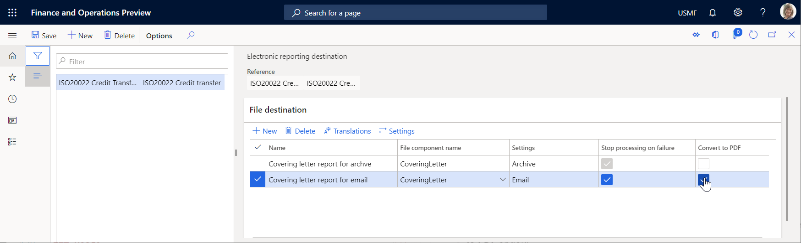
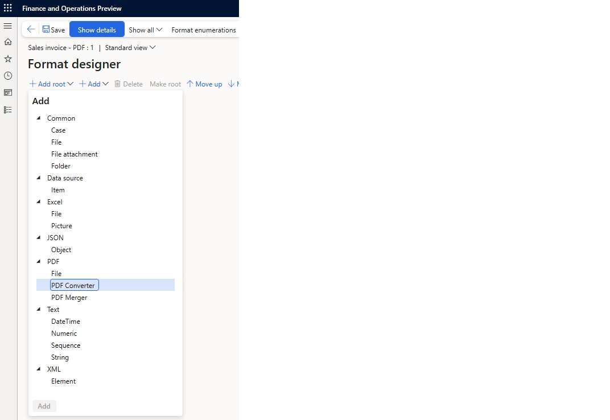
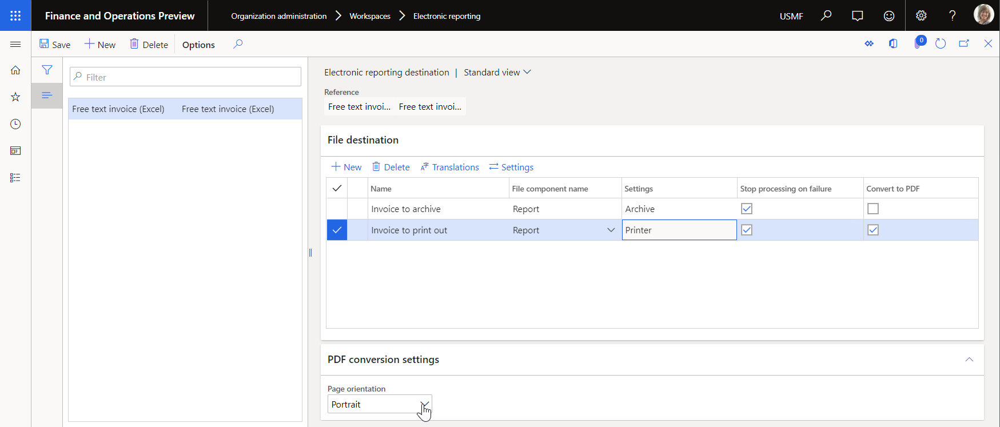

# Output conversion to PDF

[!include [banner](../includes/banner.md)]

You can use the PDF conversion option to convert output in Microsoft Office (Excel or Word) format to PDF format.

The PDF conversion option can be turned on for **Excel\\File** and  **Common\\File** components that are used to generate output in Office (Excel or Word) format. 
When this option is turned on, output that is generated in Office format is automatically converted to PDF format.

> [!NOTE]
> Pay attention to the warning message that you receive when you turn on the PDF conversion option for an ER component of the **Common\\File** type.
> This message informs you that there isn't a way to guarantee, at design time, that the selected file component exposes the content in PDF format or the PDF-convertible content at runtime.
> Therefore, you should turn on the option only if you're sure that the selected file component was configured to expose the content in PDF format or the PDF-convertible content at runtime.
> 
> If you turn on the PDF conversion option for a format component, if that component exposes content in a format other than PDF, and if the exposed content can't be converted to PDF format, an exception occurs at runtime.
> The message that you receive informs you that the generated content can't be converted to PDF format.

## Limitations

In versions earlier than Dynamics 365 Finance version 10.0.43, the PDF conversion could be done only outside the current Finance instance. 
A generated file was sent out of Finance to the conversion service, and that service then returned the converted document. This solution has the following limitations:

- the PDF conversion option is available for cloud deployments and on-premises deployment that has [Internet connectivity](../user-interface/client-disconnected.md) enabled.
- the PDF document that is produced is limited to a maximum length of 300 pages.

In Dynamics 365 Finance version **10.0.43** and later, you can enable the **In-App PDF conversion for Configurable Business Documents \(CBD\)** feature in **Feature management** to facilitate 
the seamless conversion of configurable business documents from Word or Excel formats to PDF. 

> [!NOTE]
> The **In-App PDF conversion for Configurable Business Documents \(CBD\) \(preview\)** feature is available in Finance version 10.0.43 and the 10.0.2095.**124** build and later of the 10.0.42 version.

This feature utilizes Application Object Server (AOS) resources to eliminate the need for external conversion services. 
Using in-app capabilities ensures efficient and secure document processing and reduces dependency on tools outside of Finance while maintaining high performance and reliability. 
This enhancement supports a wide range of business scenarios to provide users with the flexibility to generate and distribute professional-grade PDF documents directly within the application.

The following are advantages of in-app PDF conversion when the **In-App PDF conversion for Configurable Business Documents \(CBD\)** feature is enabled:

- The PDF document that is produced isn't limited to 300 pages.
- The Word document that is converted can contain a [large number of content controls](https://fix.lcs.dynamics.com/Issue/Details?bugId=647877&dbType=3).
- Internet connectivity isn't required in on-premises deployments.

> [!NOTE]
> Only the common system fonts of the Window operating system are used to convert output that contains no embedded fonts.

> [!TIP]
> When using the **In-App PDF conversion for Configurable Business Documents (CBD)**, you may notice the font in the generated PDFs has a lighter weight compared to the one in Excel templates. This may result in small visual discrepancies between your original template and the final PDF output. Recommendation: Configuration engineers are advised to preview the generated PDF before completing and sharing their configurations.

## Use the PDF conversion option

To turn on PDF conversion for a file destination, select the **Convert to PDF** checkbox.

## Use the PDF conversion component in ER format configurations

You can use PDF conversion directly in format configurations. In this case, you don't have to use the [**Convert to PDF**](#ConvertToPDF) checkbox on the **Electronic reporting destination** page. 
A format component, **PDF Converter**, is available.

> [!NOTE]
> The **PDF Converter** component can be added only in the format configurations of a **PDF** format type, or when the format type isn't explicitly defined but is left blank.
> The **PDF Converter** component can contain only one **Excel\\File** subcomponent.

##  Select a page orientation for PDF conversion

If you generate an ER configuration in Excel format and want to convert it to PDF format, you can explicitly specify the page orientation of the PDF document. 
When you select the **Convert to PDF** checkbox to turn on PDF conversion for a file destination that produces an output file in Excel format, the **Page orientation** field becomes available on the **PDF conversion settings** FastTab. 
In the **Page orientation** field, select the preferred orientation.

The following page orientation options are supported:

- Portrait
- Landscape
- Worksheet specific

The selected page orientation is applied to all pages of an outbound document that is generated in Excel format and then converted to PDF format. 
When you select the **Worksheet specific** option, every worksheet of a generated Excel workbook is converted to PDF by using page orientation that has been configured for this worksheet in the used Excel template. 
So, you might have a final PDF document containing portrait and landscape pages. 

> [!NOTE]
> For ER configuration in Word format converted to PDF format, the page orientation of the PDF document is always taken from the Word document.

