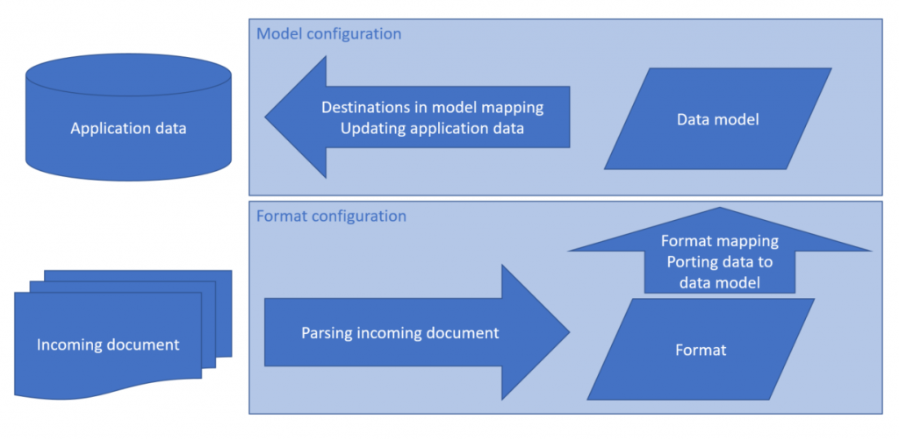

# Electronic reporting components

[!include [banner](../includes/banner.md)]

Electronic reporting (ER) supports the following types of components:

- Data model
- Model mapping
- Format
- Metadata

## Data model component

A data model component is an abstract representation of a data structure. It describes a specific business domain area in enough detail to satisfy the reporting requirements for that domain. A data model component consists of the following parts:

- **Data model** – A set of domain-specific business entities and a hierarchically structured definition of relations between those entities.
- **Model mapping** – Selected application data sources are linked to individual elements of a data model that specifies, at runtime, the data flow and rules for entering business data in a data model component.

The business entity of a data model is represented as a container, or record. Business entity properties are represented as data items, or fields. Each data item has a unique name, label, description, and value. The value of each data item can be designed so that it's recognized as a string, integer, real, date, enumeration (enum), or Boolean value. Additionally, the data item can be another record or record list.

A single data model component can contain several hierarchies of domain-specific business entities. It can also contain model mappings that support a report-specific data flow at runtime. The hierarchies are differentiated by a single record that is selected as a root for model mapping. For example, the data model of the payment domain area might support the following mappings:

- Company \> Vendor \> Payment transactions of the AP domain
- Customer \> Company \> Payment transactions of the AR domain

Business entities, such as company and payment transactions, are designed only one time. Different mappings can reuse them as required.

## Model mapping component

Model mapping links application data sources to individual elements of a data model that specify, at runtime, the data flow and rules for entering business data in a data model component.

A model mapping that supports outgoing electronic documents has the following capabilities:

- It can use different data types as data sources for a data model. These data types include tables, data entities, methods, and enums.
- It supports user input parameters that can be defined as data sources for a data model when some data must be specified at runtime.
- It supports data transformation into required groups. You can also filter, sort, and sum data, and append logical calculated fields that are designed through formulas that resemble Microsoft Excel formulas. For more information, see [Formula designer in Electronic reporting (ER)](general-electronic-reporting-formula-designer.md).

A model mapping that supports incoming electronic documents has the following capabilities:

- It can use different updatable data elements as targets. These data elements include tables, data entities, and views. The data can be updated by incoming data from electronic documents. Multiple targets can be used in a single model mapping.
- It supports user input parameters that can be defined as data sources for a data model when some data must be specified at runtime.

A data model component is designed for each business domain that is used as a unified data source for reporting. The unified data source isolates reporting from the physical implementation of data sources. The component represents domain-specific business concepts and functionalities in a form that makes a reporting format's initial design and further maintenance more efficient.

## Format component

### Format components for outgoing electronic documents

A format component is the scheme of the reporting output that is generated at runtime. A scheme consists of the following elements:

- A format that defines the structure and content of the outgoing electronic document that is generated at runtime.
- Data sources, as a set of user input parameters and a domain-specific data model that uses a selected model mapping.
- A format mapping, as a set of bindings of format data sources that have individual elements of a format that specify, at runtime, the data flow and rules for generating format output.
- A format validation, as a set of configurable rules that control report generation at runtime, depending on the running context. For example, there might be a rule that stops output generation of a vendor's payments and throws an exception when specific attributes of the selected vendor are missing, such as the bank account number.

A format component supports the following functions:

- Creating a reporting output as individual files in various formats, such as text, XML, Microsoft Word document, or worksheet
- Creating multiple files separately and encapsulating them into zip files

A format component lets you attach specific files that can be used in the reporting output:

- Excel workbooks that contain a worksheet that can be used as a template for output in the OPENXML worksheet format
- Word files that contain a document that can be used as a template for output in the Microsoft Word document format
- Other files that can be incorporated into the format's output as predefined files

The following illustration shows how the data flows for these formats.

To run a single ER format configuration and generate an outgoing electronic document, you must identify the mapping of the format configuration.

#### Format components for incoming electronic documents
A format component is the scheme of the incoming document that is imported at run time. A scheme consists of the following elements:

- A format that defines the structure and content of the incoming electronic document that contains data that is imported at run time. A format component is used to parse an incoming document in various formats, such as text and XML.
- A format mapping that binds individual format elements to elements of a domain-specific data model. At run time, the elements in the data model specify the data flow and the rules for importing data from an incoming document, and then store the data in a data model.
- A format validation, as a set of configurable rules that control data import at run time, depending on the running context. For example, there might be a rule that stops data import of a bank statement that has a vendor's payments and throws an exception when a specific vendor's attributes are missing, such as the vendor identification code.

The following illustration shows how the data flows for these formats.

To run a single ER format configuration to import data from an incoming electronic document, you must identify the desired mapping of a format configuration, and also the integration point of a model mapping. You can use the same model mapping and destinations together with different formats for different type of incoming documents.

## Component versioning

Versioning is supported for ER components. The following workflow is provided to manage changes in ER components:

1. The version that was originally created is marked as a **Draft** version. This version can be edited and is available for test runs.
2. The **Draft** version can be converted to a **Completed** version. This version can be used in local reporting processes.
3. The **Completed** version can be converted to a **Shared** version. This version is published in Microsoft Dynamics Lifecycle Services (LCS) and can be used in global reporting processes.
4. The **Shared** version can be converted to a **Discontinued** version. This version can be deleted.

Versions that have either **Completed** or **Shared** status are available for other data interchange. The following actions can be performed on a component that has these statuses:

- The component can be serialized in XML format and exported as a file in XML format.
- The component can be reserialized from an XML file and imported into the application as a new version of an ER component.

For more information, see [Import a new data model configuration](er-quick-start1-new-solution.md#ImportDataModel) and [Export completed version of a derived format](er-calculated-field-type.md#export-completed-version-of-a-derived-format).

### Draft versions at runtime

In your personal user parameters for the ER framework, you can enable the option that lets you specify whether the draft version of an ER configuration must be used at runtime. For information about how to make the **Run Draft** option available for your ER configurations, see [Mark a custom format as runnable](er-quick-start2-customize-report.md#MarkFormatRunnable).

> [!NOTE]
> The ER user parameters are company-specific and user-specific.

### Draft format versions at runtime

By default, when you run an ER solution, the draft versions of its format components are ignored. Instead, only the relevant version that has a status other than **Draft** is used. Sometimes, you might want to force ER to use the draft version of your ER format configuration at runtime. For example, after you introduce necessary changes in your draft version, you can use that draft version to do the test run. In this way, you can validate the correctness of your changes. To start to use the draft format version, you must [set](er-quick-start2-customize-report.md#MarkFormatRunnable) the **Run Draft** option of the relevant ER configuration to **Yes**.

### Draft model mapping versions at runtime

By default, when you run an ER solution, the draft versions of its model mapping components are always used. Sometimes, you might want to force ER to ignore the draft version of your ER model mapping configuration at runtime. In **version 10.0.29 and later**, you can enable the **Always take into consideration the "Run draft" option for ER model mappings** feature to control the model mapping version that is used at runtime. When this feature is enabled, the following behavior occurs:

- When the **Run Draft** option is set to **No** for a model mapping configuration, the highest non-draft version of that configuration is used at runtime. An exception is thrown if the configuration isn't available in the current Finance instance.
- When the **Run Draft** option is set to **Yes** for a model mapping configuration, the draft version of that configuration is used at runtime.

## Component date effectivity

ER format component versions are date-effective. You can set the "effective from" date for an ER format component to specify the date when the component becomes effective for reporting processes. The application session date is used to define whether a component is valid for execution. If more than one version is valid for a specific date, the latest version is used for reporting processes.

## Component access

Access to ER format and model mapping components at runtime depends on the setting for the International Organization for Standardization (ISO) country/region code. If this setting is blank for a selected version of a format or model mapping configuration, a format or model mapping component can be accessed from any company at runtime. If the setting contains ISO country/region codes, a format or model mapping component is available only from companies that have a primary address defined for one of a format component's ISO country/region codes.

Different versions of a format or a model mapping component can have different settings for ISO country/region codes.

For more information, see [Configure country context dependent ER model mappings](er-country-dependent-model-mapping.md).

[!INCLUDE[footer-include](../../../includes/footer-banner.md)]

