# Design an ER format to paginate generated documents in Excel

[!include [banner](../includes/banner.md)]

This article explains how a user in the System Administrator or Electronic Reporting Functional Consultant role can configure an [Electronic reporting (ER)](general-electronic-reporting.md) format to generate outbound documents in Microsoft Excel and manage document pagination.

In this example, you will modify the Microsoft-provided ER format that is used to print the control report when the Intrastat declaration is [generated](../../../finance/localizations/tasks/eur-00002-eu-intrastat-declaration.md). This report lets you observe reported Intrastat transactions. Your modifications will let you manage the pagination of control reports that are generated.

The procedures in this article can be completed in the **DEMF** company. No coding is required. Before you begin, download and save the following files.

| Description       | File name |
|-------------------|-----------| 
| Report template 1 | [ERIntrastatReportDemo1.xlsx](https://download.microsoft.com/download/7/2/a/72ae292a-8bb2-4b9d-8397-9764218f6fa8/ERIntrastatReportDemo1%20.xlsx) |
| Report template 2 | [ERIntrastatReportDemo2.xlsx](https://download.microsoft.com/download/7/d/1/7d15858d-6260-4afa-9dda-d8b955e59b1a/ERIntrastatReportDemo2.xlsx) |

## Configure the ER framework

Follow the steps in [Configure the ER framework](er-quick-start2-customize-report.md#ConfigureFramework) to set up the minimal set of ER parameters. You must complete this setup before you start to use the ER framework to design a custom version of a standard ER format.

## Import the standard ER format configuration

Follow the steps in [Import the standard ER format configuration](er-quick-start2-customize-report.md#ImportERSolution1) to add the standard ER configurations to your current instance of Dynamics 365 Finance. Import version **1.9** of the **Intrastat report** format configuration. Base version 1 of the base **Intrastat model** configuration is automatically imported from the repository.

## Customize the standard ER format

### Create the custom ER format

In this scenario, you're the representative of Litware, Inc., which is currently selected as the active ER configuration provider. You must create a new ER format configuration by using the **Intrastat report** configuration as a base.

1. Go to **Organization administration** \> **Electronic reporting** \> **Configurations**.
2. On the **Configurations** page, in the configuration tree in the left pane, expand **Intrastat model**, and select **Intrastat report**. Litware, Inc. will use version 1.9 of this ER format configuration as the base for the custom version.
3. Select **Create configuration** to open the drop-down dialog box. You can use this dialog box to create a new configuration for a custom payment format.
4. In the **New** field group, select **Derive from Name: Intrastat report, Microsoft**.
5. In the **Name** field, enter **Intrastat report Litware**.
6. Select **Create configuration** to create the new format.

Version 1.9.1 of the **Intrastat report Litware** ER format configuration is created. This version has a status of **Draft** and can be edited. The current content of your custom ER format matches the content of the format that is provided by Microsoft.

### Make the custom format runnable

Now that the first version of your custom format has been created and has a status of **Draft**, you can run the format for testing purposes. To run the report, process a vendor payment by using the payment method that refers to your custom ER format. By default, when you call an ER format from the application, only versions that have a status of **Completed** or **Shared** are considered. This behavior helps prevent ER formats that have unfinished designs from being used. However, for your test runs, you can force the application to use the version of your ER format that has a status of **Draft**. In this way, you can adjust the current format version if any modifications are required. For more information, see [Applicability](electronic-reporting-destinations.md#applicability).

To use the draft version of an ER format, you must explicitly mark the ER format.

1. Go to **Organization administration** \> **Electronic reporting** \> **Configurations**.
2. On the **Configurations** page, on the Action Pane, on the **Configurations** tab, in the **Advanced settings** group, select **User parameters**.
3. In the **User parameters** dialog box, set the **Run settings** option to **Yes**, and then select **OK**.
4. Select **Edit** to make the current page editable, as required.
5. In the configuration tree in the left pane, select **Intrastat report Litware**.
6. Set the **Run Draft** option to **Yes** and then select **Save**.

    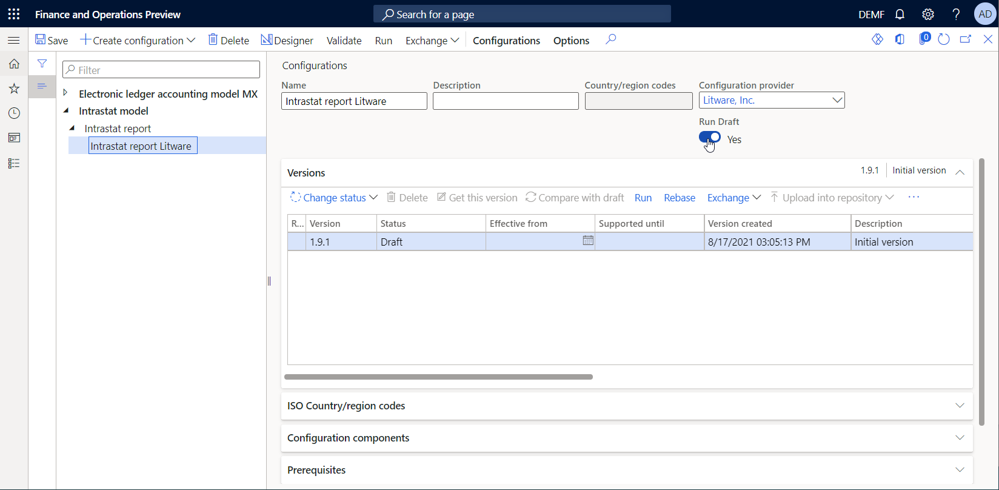

## Set up Foreign trade parameters to use the custom ER format

Follow these steps to configure Foreign trade parameters so that you can use the custom format.

1. Go to **Tax** \> **Setup** \> **Foreign trade** \> **Foreign trade parameters**.
2. On the **Foreign trade parameters** page, on the **Electronic reporting** FastTab, in the **File format mapping** field, select **Intrastat report Litware**.
3. In the **Report format mapping** field, select **Intrastat report Litware**.
4. Select **Save**.

## Configure the custom format to use the downloaded report template

### Review the first downloaded Excel template

1. In the Excel desktop application, open the **ERIntrastatReportDemo1.xlsx** template file that you downloaded earlier.
2. Verify that the template contains named ranges to create report header, report details, and report footer sections in generated documents.

    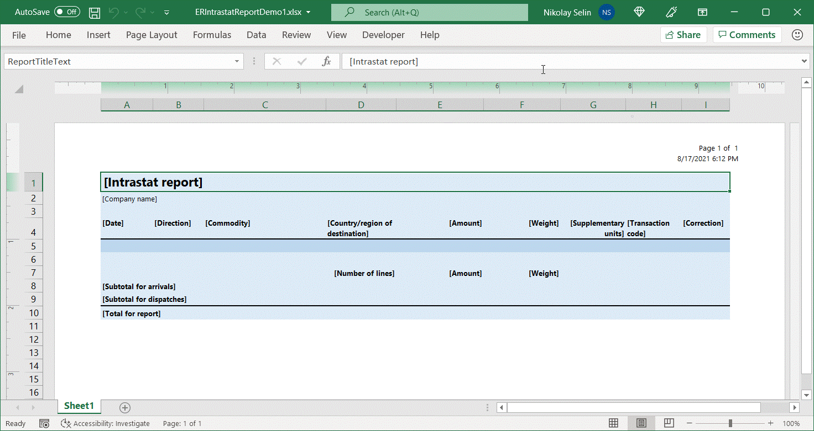

### Replace the current Excel template in the custom ER format

You must add a new Excel template to the custom ER format.

1. Go to **Organization administration** \> **Electronic reporting** \> **Configurations**.
2. On the **Configurations** page, in the configuration tree in the left pane, expand **Intrastat model** \> **Intrastat report**, and select the **Intrastat report Litware** configuration.
3. Select **Designer**.
4. On the **Format designer** page, on the Action Pane, select **Show details**.
5. Make sure that the **Intrastat: Excel** root format component is selected, and then, on the Action Pane, on the **Import** tab, in the **Import** group, select **Update from Excel**.
6. In the **Update from Excel** dialog box, select **Update template**.
7. In the **Open** dialog box, browse to and select the **ERIntrastatReportDemo1.xlsx** file that you downloaded earlier, and then select **Open**.
8. Select **OK**.
9. Select **Save**.

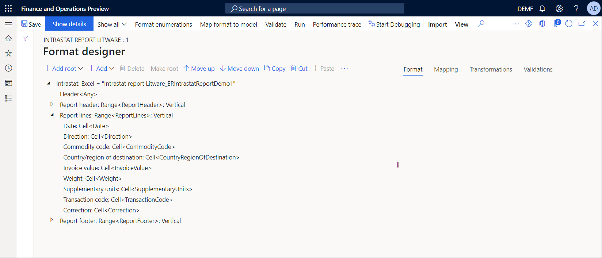

## Change the data binding to show the item description on a generated report

1. On the **Format designer** page, select the **Mapping** tab.
2. Expand **Intrastat** \> **Report lines**, and select the **Commodity code** component.
3. Select **Edit formula**.
4. Change the binding formula from `@.CommodityCode` to `CONCATENATE(@.CommodityCode, " ", @.ProductName)`.
5. Select **Save**.

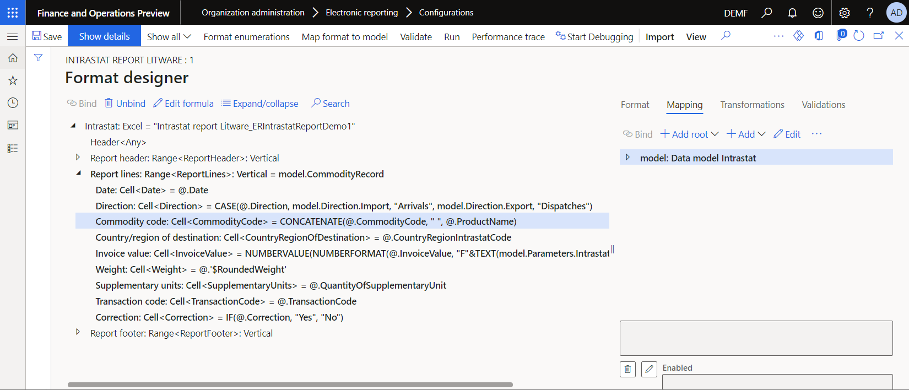

## Generate an Intrastat declaration control report

First, make sure that you have Intrastat transactions for reporting on the **Intrastat** page.

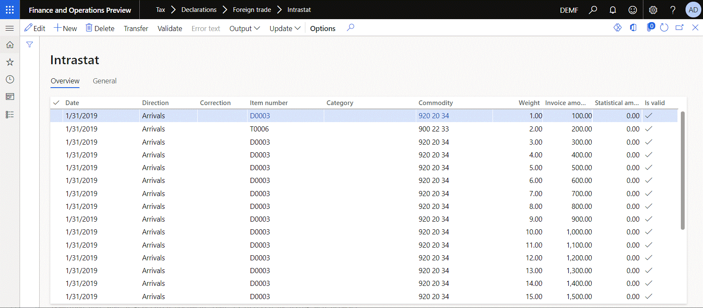

Then use the custom ER format to generate the control report of the Intrastat declaration.

1. Go to **Tax** \> **Declarations** \> **Foreign trade** \> **Intrastat**.
2. On the **Intrastat** page, on the Action Pane, select **Output** \> **Report**.
3. In the **Intrastat Report** dialog box, follow these steps to run the report:

    1. Set the **From date** and **To date** fields to include specific Intrastat transactions to the report.
    2. Set the **Generate file** option to **No**.
    3. Set the **Generate report** option to **Yes**.
    4. Select **OK**.

4. Download and save the document that is generated.
5. Open the document in Excel, and review it.

    

## Configure the custom format to paginate generated documents

### Review the second downloaded Excel template

1. In Excel, open the **ERIntrastatReportDemo2.xlsx** template file that you downloaded earlier.
2. Compare this template with the **ERIntrastatReportDemo1.xlsx** template, and verify that it contains several new Excel names to create and fill in page-specific sections in generated documents:

    - The **ReportPageHeader** range is added to create page headers.
    - The **ReportPageFooter** range is added to create page footers.
    - The **ReportPageFooter\_PageLines** cell is configured to show the number of transactions per page.
    - The **ReportPageFooter\_PageAmount** cell is configured to show the total amount of transactions per page.
    - The **ReportPageFooter\_PageWeight** cell is configured to show the total weight of transactions per page.
    - The **ReportPageFooter\_RunningCounterLines** cell is configured to show the running counter of transactions from the beginning of the report through the current page.
    - The **ReportPageFooter\_RunningTotalAmount** cell is configured to show the amount running total for all transactions from the beginning of the report through the current page.
    - The **ReportPageFooter\_RunningTotalWeight** cell is configured to show the weight running total for transactions from the beginning of the report through the current page.

    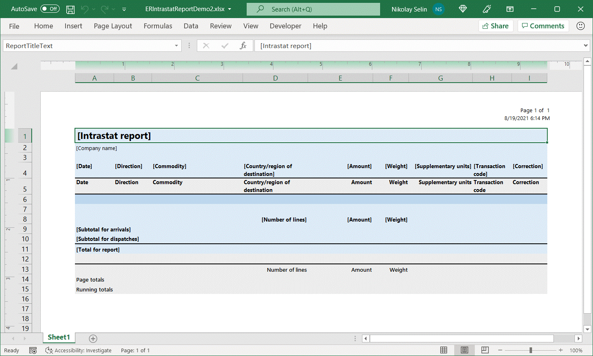

    The **CommodityCode** cell of this template is configured to wrap cell text. Because the transaction details row is configured so that it will automatically fit the height of a row, the height of the whole row must automatically change when the text in the **CommodityCode** cell is wrapped.

    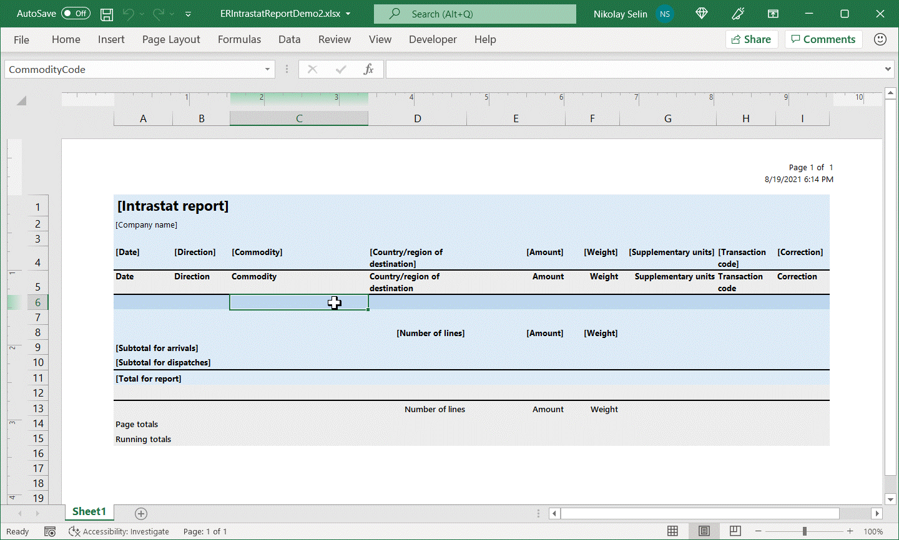

### Repeat the replacement of the current Excel template in the custom ER format

1. Follow the steps in the [Replace the current Excel template in the custom ER format](#replace-template) section of this article. However, in step 7, select the **ERIntrastatReportDemo2.xlsx** file.
2. On the **Format designer** page, expand **Intrastat**.
3. Name the [Range](er-fillable-excel.md#range-component) format components that have been added to the editable ER format to sync the structure with the structure of the applied Excel template:

    1. Select the **Range** component that is associated with the Excel name **ReportPageHeader**.
    2. On the **Format** tab, in the **Name** field, enter **Report page header**.
    3. Select the **Range** component that is associated with the Excel name **ReportPageFooter**.
    4. On the **Format** tab, in the **Name** field, enter **Report page footer**.

4. Select **Save**.

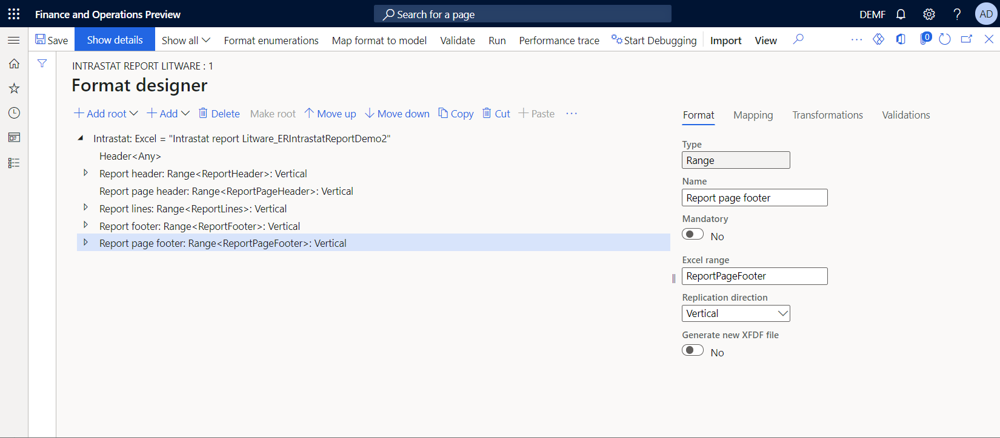

### Change the format structure to implement document pagination

1. On the **Format designer** page, in the format tree in the left pane, select the **Intrastat** root component.
2. Select **Add**.
3. In the **Add** dialog box, select the [Page](er-fillable-excel.md#page-component) component in the **Excel** group of components.
4. In the **Component properties** dialog box, in the **Name** field, enter **Report page**. Then select **OK**.
5. To use the **Report page header** component as a page header on every generated page, follow these steps:

    1. Select the **Report page header** component, and then select **Cut**.
    2. Select the **Report page** component, and then select **Paste**.
    3. Expand **Report page**.
    4. To force the **Page** component to [consider](er-fillable-excel.md#page-component-structure) this range a page header, select **Report page header**, and then, on the **Format** tab, in the **Replication direction** field, select **No replication**.

6. To paginate a generated document so that the content on report lines is considered, follow these steps:

    1. Select the **Report lines** component, and then select **Cut**.
    2. Select the **Report page** component, and then select **Paste**.

7. To include the report footer after report lines but before the final page footer, follow these steps:

    1. Select the **Report footer** component, and then select **Cut**.
    2. Select the **Report page** component, and then select **Paste**.

8. To use the **Report page footer** component as a page footer on every generated page, follow these steps:

    1. Select the **Report page footer** component, and then select **Cut**.
    2. Select the **Report page** component, and then select **Paste**.
    3. To force the **Page** component to [consider](er-fillable-excel.md#page-component-structure) this range a page footer, select **Report page footer**, and then, on the **Format** tab, in the **Replication direction** field, select **No replication**.

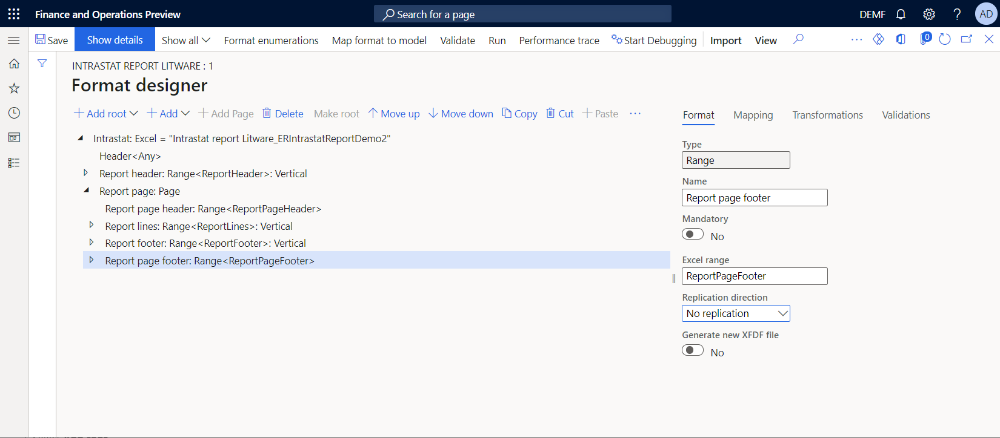

### Add data sources to calculate page footer totals

You must configure new data sources to calculate the page total, the running counter, and the running total values, and to show them in the page footer section. We recommend that you use [Data collection](er-data-collection-data-sources.md) data sources for this purpose.

1. On the **Format designer** page, select the **Mapping** tab.
2. Select **Add root**, and then follow these steps:

    1. In the **Add data source** dialog box, in the **General** section, select **Empty container**.
    2. In the **'Empty container' data source properties** dialog box, in the **Name** field, enter **Total**.
    3. Select **OK**.

3. Select the **Total** data source, select **Add**, and then follow these steps:

    1. In the **Add data source** dialog box, in the **General** section, select **Empty container**.
    2. In the **'Empty container' data source properties** dialog box, in the **Name** field, enter **Page**.
    3. Select **OK**.

4. Select **Add** again, and then follow these steps:

    1. In the **Add data source** dialog box, in the **General** section, select **Empty container**.
    2. In the **'Empty container' data source properties** dialog box, in the **Name** field, enter **Running**.
    3. Select **OK**.

5. Select the **Total.Page** data source, select **Add**, and then follow these steps:

    1. In the **Add data source** dialog box, in the **Functions** section, select **Data collection**.
    2. In the **'Data collection' data source properties** dialog box, in the **Name** field, enter **Amount**.
    3. In the **Item type** field, select **Real**.
    4. Set the **Collect all values** option to **Yes**.
    5. Select **OK**.

6. Select **Add** again, and then follow these steps:

    1. In the **Add data source** dialog box, in the **Functions** section, select **Data collection**.
    2. In the **'Data collection' data source properties** dialog box, in the **Name** field, enter **Weight**.
    3. In the **Item type** field, select **Real**.
    4. Set the **Collect all values** option to **Yes**.
    5. Select **OK**.

7. Select the **Total.Running** data source, select **Add**, and then follow these steps:

    1. In the **Add data source** dialog box, in the **Functions** section, select **Data collection**.
    2. In the **'Data collection' data source properties** dialog box, in the **Name** field, enter **Amount**.
    3. In the **Item type** field, select **Real**.
    4. Set the **Collect all values** field to **Yes**.
    5. Select **OK**.

8. Select **Add** again, and then follow these steps:

    1. In the **Add data source** dialog box, in the **Functions** section, select **Data collection**.
    2. In the **'Data collection' data source properties** dialog box, in the **Name** field, enter **Weight**.
    3. In the **Item type** field, select **Real**.
    4. Set the **Collect all values** field to **Yes**.
    5. Select **OK**.

9. Select **Add** again, and then follow these steps:

    1. In the **Add data source** dialog box, in the **Functions** section, select **Data collection**.
    2. In the **'Data collection' data source properties** dialog box, in the **Name** field, enter **Lines**.
    3. In the **Item type** field, select **Integer**.
    4. Set the **Collect all values** field to **Yes**.
    5. Select **OK**.

10. Select **Save**.

### Add data sources to control page footer visibility

If you plan to control page footer visibility, and you don't plan to include the footer on the final page if it contains transactions, configure a new data source to calculate the required running counter.

1. On the **Format designer** page, select the **Mapping** tab.
2. Select the **Total.Running** data source, select **Add**.
3. In the **Add data source** dialog box, in the **Functions** section, select **Data collection**.
4. In the **'Data collection' data source properties** dialog box, in the **Name** field, enter **Lines2**.
5. In the **Item type** field, select **Integer**.
6. Set the **Collect all values** option to **Yes**.
7. Select **OK**.
8. Select **Save**.

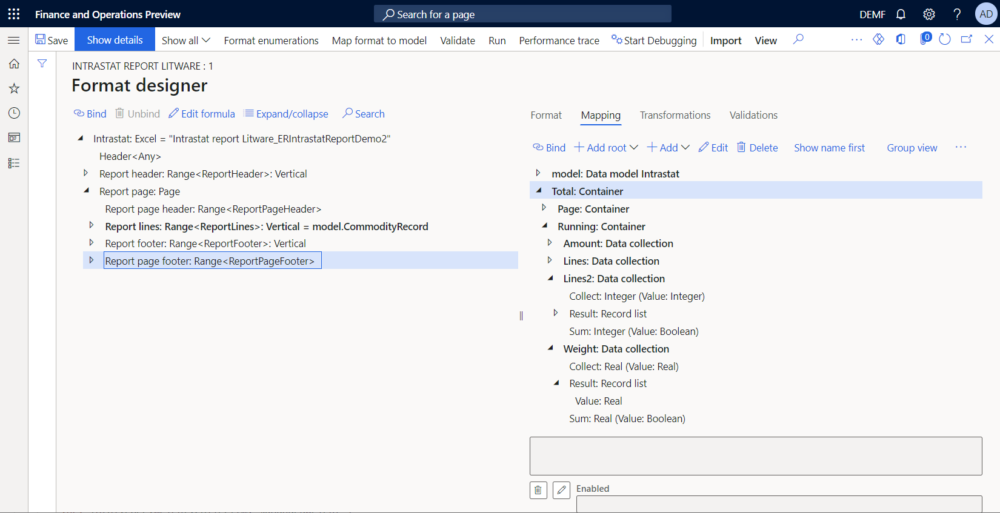

### Configure bindings to collect total values

1. On the **Format designer** page, in the format tree, expand the **Report lines** component, and select the nested **Invoice value** component.
2. Select **Edit formula**.
3. Change the binding formula from `NUMBERVALUE(NUMBERFORMAT(@.InvoiceValue, "F"&TEXT(model.Parameters.IntrastatAmountDecimals)), ".", "")` to `Total.Page.Amount.Collect(NUMBERVALUE(NUMBERFORMAT(@.InvoiceValue, "F"&TEXT(model.Parameters.IntrastatAmountDecimals)), ".", ""))`.

    > [!NOTE]
    > In addition to putting the amount value in an Excel cell for every iterated transaction, this binding collects the value in the data collection **Total.Page.Amount** data source.

4. Select the nested **Weight** component.
5. Select **Edit formula**.
6. Change the binding formula from `@.'$RoundedWeight'` to `Total.Page.Weight.Collect(@.'$RoundedWeight')`.

    > [!NOTE]
    > In addition to putting the weight value in an Excel cell for every iterated transaction, this binding collects the value in the **Total.Page.Weight** data source.

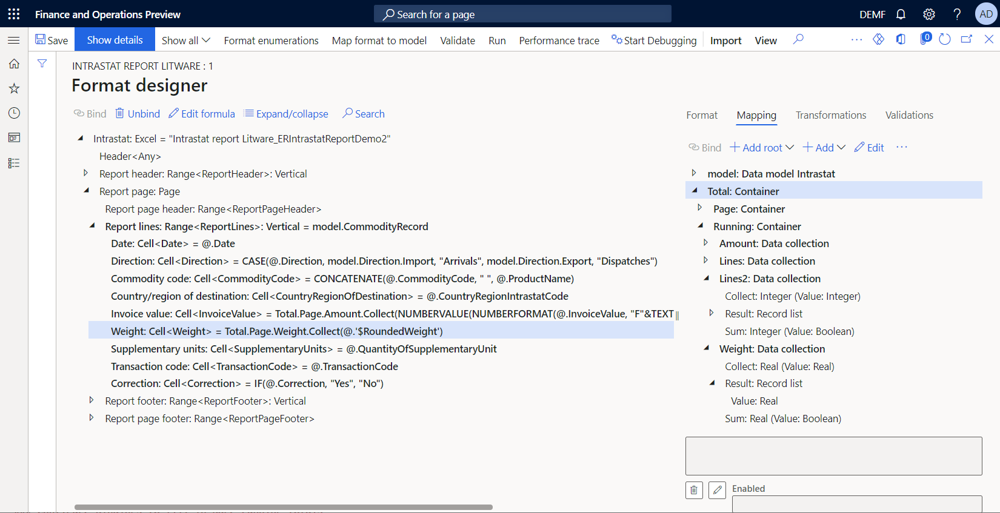

### Configure bindings to fill in page footer totals

1. On the **Format designer** page, in the format tree, expand the **Report page footer** component, select the nested **Range** component that refers to the Excel **ReportPageFooter\_PageAmount** cell, and then follow these steps:

    1. In the data sources tree in the right pane, select the **Total.Page.Amount.Sum()** item.
    2. Select **Bind**.
    3. Select **Edit formula**.
    4. Update the formula to `Total.Page.Amount.Sum(false)`.

    > [!NOTE]
    > You must specify the argument of this function as **False** to keep collected data for the current page, because this data is required to calculate the amount running total, total number of lines per page, and running counter of lines.

2. In the format tree, select the nested **Range** component that refers to the Excel **ReportPageFooter\_PageWeight** cell, and then follow these steps:

    1. In the data sources tree in the right pane, select the **Total.Page.Weight.Sum()** item.
    2. Select **Bind**.
    3. Select **Edit formula**.
    4. Update the formula to `Total.Page.Weight.Sum(false)`.

### Configure bindings to fill in page running totals

1. On the **Format designer** page, in the format tree, expand the **Report page footer** component, select the nested **Range** component that refers to the Excel **ReportPageFooter\_RunningTotalAmount** cell, and then follow these steps:

    1. In the data sources tree in the right pane, select the **Total.Running.Amount.Collect()** item.
    2. Select **Bind**.
    3. Select **Edit formula**.
    4. Update the formula to `Total.Running.Amount.Sum(false)+Total.Running.Amount.Collect(Total.Page.Amount.Sum(true))`.

    > [!NOTE]
    > The `Total.Running.Amount.Sum(false)` operand returns the previously collected amount running total. The `Total.Running.Amount.Collect(Total.Page.Amount.Sum(true))` operand returns the total amount of the current page. You must specify the argument of the nested function of the second operand as **True** to reset the `Total.Page.Amount` data collection as soon as this value is put in the `Total.Running.Amount` running total collection. The specified argument must start to collect the next page total from a 0 (zero) value.
    >
    > The `Total.Running.Amount.Sum(false)` function is called to enter the amount running total in the Excel **ReportPageFooter\_RunningTotalAmount** cell on the current page.

2. In the format tree, select the nested **Range** component that refers to the Excel **ReportPageFooter\_RunningTotalWeight** cell, and then follow these steps:

    1. In the data sources tree in the right pane, select **Total.Running.Weight.Collect()** item.
    2. Select **Bind**.
    3. Select **Edit formula**.
    4. Update the formula to `Total.Running.Weight.Sum(false)+Total.Running.Weight.Collect(Total.Page.Weight.Sum(true))`.

### Configure bindings to fill in the page running counter

1. On the **Format designer** page, in the format tree, expand the **Report page footer** component, and select the nested **Range** component that refers to the Excel **ReportPageFooter\_RunningCounterLines** cell.
2. Select **Edit formula**.
3. Add the formula `Total.Running.Lines.Collect(COUNT(Total.Page.Amount.Result))`.

    > [!NOTE]
    > This formula returns the number of collected amount values for the whole report. This number equals the number of transactions that have been iterated at the current moment. At the same time, the formula collects the returned value in the **Total.Running.Lines** collection.

### Configure bindings to fill in the page footer counter

1. On the **Format designer** page, in the format tree, expand the **Report page footer** component, and select the nested **Range** component that refers to the Excel **ReportPageFooter\_PageLines** cell.
2. Select **Edit formula**.
3. Add the formula `COUNT(Total.Page.Amount.Result)-Total.Running.Lines.Sum(false)`.

    > [!NOTE]
    > This formula calculates the number of transactions on the current page as the difference between the number of transactions that was collected in **Total.Page.Amount.Result** for the whole report and the number of transactions that has been stored at this stage in **Total.Running.Lines.Sum**. Because the number of transactions for the current page is stored in **Total.Running.Lines** in the binding of the **Range** component that refers to the Excel **ReportPageFooter\_RunningCounterLines** cell, the number of transactions on the current page isn't yet included. Therefore, this difference equals the number of transactions on the current page.

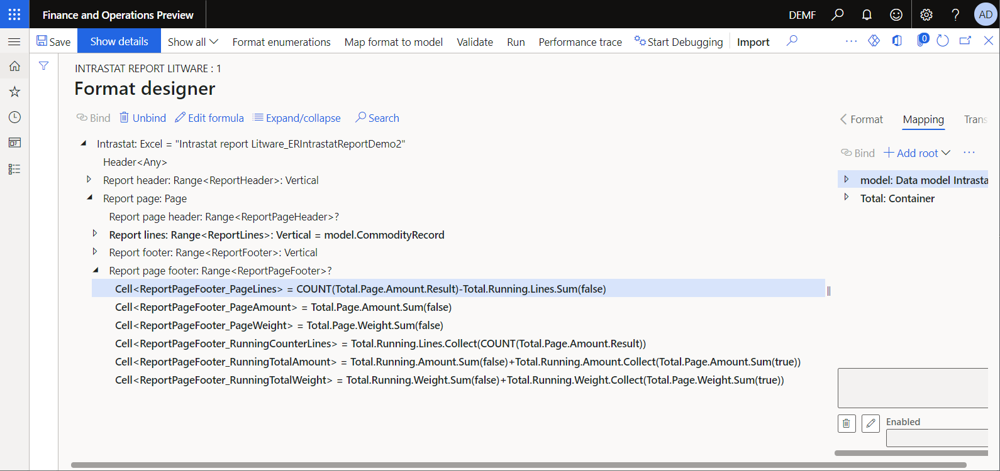

### Configure component visibility

You can change the visibility of the page header and footer on a specific page of a generated document to hide the following elements:

- The page header on the first page, because the report header already contains column titles
- The page header on any page that doesn't have transactions that can occur for the last page
- The page footer on any page that doesn't have transactions that can occur for the last page

To change the visibility, update the **Enabled** property of the **Report page header** and **Report page footer** components.

1. On the **Format designer** page, in the format tree, expand the **Report page** component, select the nested **Report page header** component, and then follow these steps:

    1. Select **Edit** for the **Enabled** field.
    2. On the **Formula designer** page, in the **Formula** field, enter the following expression:

        `AND(` 
        `COUNT(Total.Page.Amount.Result)<>0,` 
        `COUNT(Total.Page.Amount.Result)<>COUNT(model.CommodityRecord)` 
        `)`

2. In the format tree, select the nested **Report page footer** component, and then follow these steps:

    1. Select **Edit** for the **Enabled** field.
    2. On the **Formula designer** page, in the **Formula** field, enter the following expression:

        `(` 
        `COUNT(Total.Page.Amount.Result)-Total.Running.Lines2.Sum(false)+` 
        `0*Total.Running.Lines2.Collect(COUNT(Total.Page.Amount.Result))` 
        `)<>0`

    > [!NOTE]
    > The `COUNT(Total.Page.Amount.Result)-Total.Running.Lines2.Sum(false)` construction is used to calculate the number of transactions on the current page. The `0*Total.Running.Lines2.Collect(COUNT(Total.Page.Amount.Result)` construction is used to add the number of transactions on the current page to the collection, to correctly handle the visibility of the next page footer.
    >
    > The `Total.Running.Lines` collection can't be reused here, because the **Enabled** property of a base component is processed **after** the bindings of nested components are processed. When the **Enabled** property is processed, the `Total.Running.Lines` collection is already incremented by the number of transactions on the current page.

3. Select **Save**.

## Generate an Intrastat declaration control report (updated)

1. Make sure that you have 24 transactions on the **Intrastat** page. Repeat the steps in the [Generate an Intrastat declaration control report](#generate-intrastat-control-report) section of this article to generate and review the control report.

    All transactions are presented on the first page. The page totals and counters equal the report totals and counters. The page header range is hidden on the first page because the report header already contains column titles. The page header and footer are hidden on the second page because that page contains no transactions.

    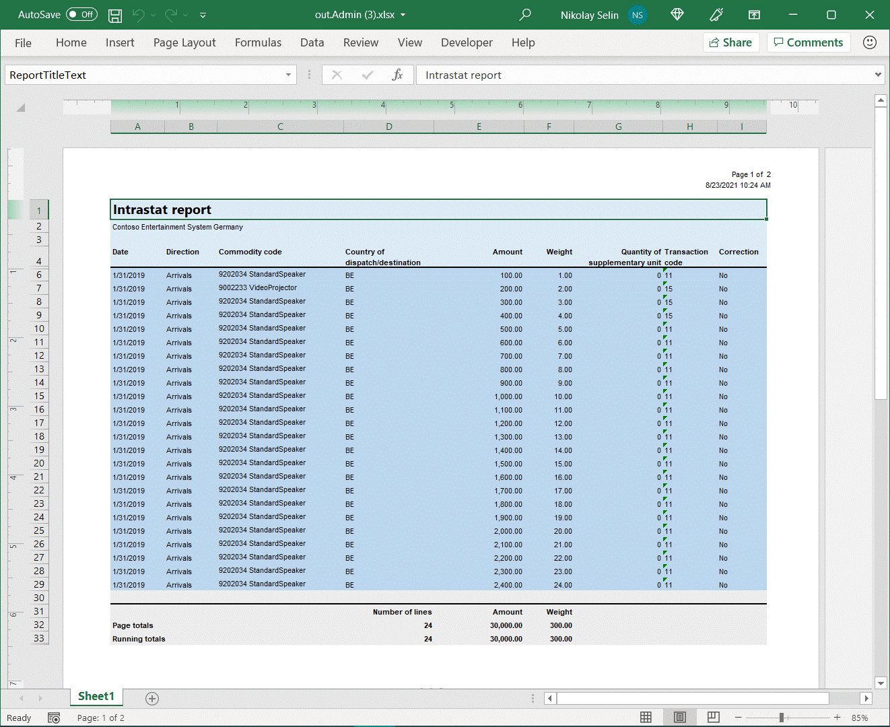

2. Update two transactions on the **Intrastat** page by changing the **Item number** code from **D00006** to **L0010**. Notice that the product name of the new item, **Active stereo speaker pair**, is longer than the product name of the original item, **Standard speaker**. This situation forces text wrapping in the corresponding cell of the generated document. Document pagination, and page-related summing and counting, must now be updated. Repeat the steps in the [Generate an Intrastat declaration control report](#generate-intrastat-control-report) section to generate and review the control report.

    Currently, transactions are presented on two pages, and page totals and counters are correctly calculated. The page header range is correctly hidden on the first page and visible on the second page. The page footer is visible on both pages because they contain transactions.

    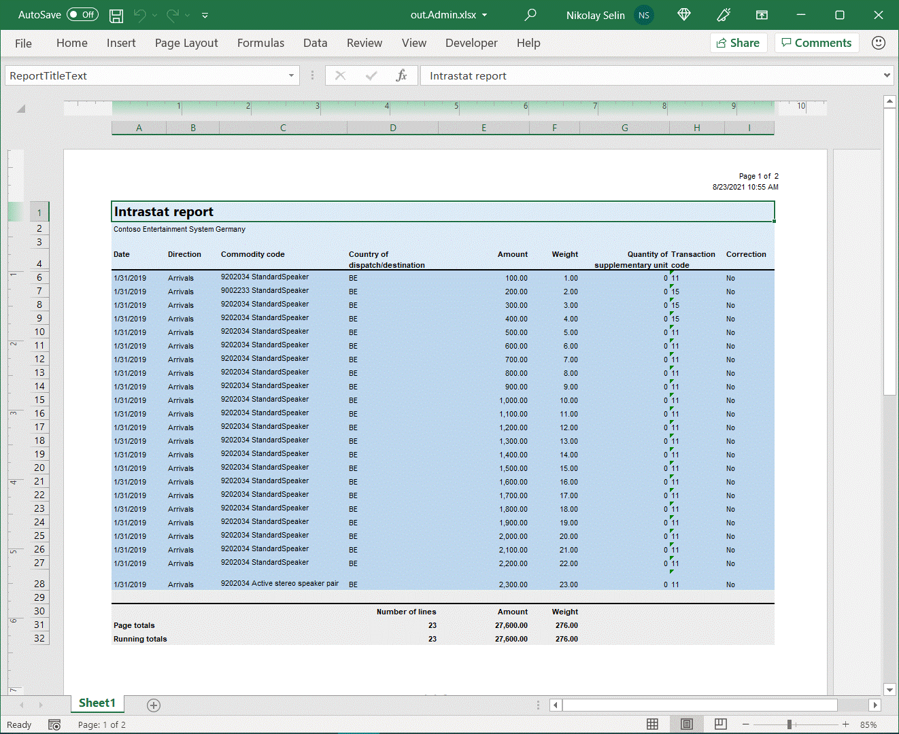

## Frequently asked questions

### Is there any way to recognize when the final page is processed by the Page format component?

The **Page** component [doesn't expose](er-fillable-excel.md#page-component-limitations) information about the number of the processed page and the total number of pages in a generated document. Nevertheless, you can configure ER [formulas](er-formula-language.md) to recognize the final page. Here is an example:

- Calculate the total number of transactions that have already been processed by using the **Report page** component. You can do this calculation by using the formula `COUNT(Total.Page.Amount.Result)`. 
- Calculate the total number of transactions that must be processed based on the `model.CommodityRecord` binding that is configured for the **Report lines** component. You can do this calculation by using the formula `COUNT(model.CommodityRecord)`.
- Compare two numbers to recognize the final page. When both values are equal, the final page is generated.

> [!NOTE]
> We recommend that you use this approach only when the **Enabled** property of the **Report lines** component contains no formula that might return [False](er-formula-supported-data-types-primitive.md#boolean) at runtime for some of the iterated [records](er-formula-supported-data-types-composite.md#record) of the bound [Record list](er-formula-supported-data-types-composite.md#record-list).

## Additional resources

- [Design a configuration for generating documents in Excel format](er-fillable-excel.md)
- [Use DATA COLLECTION data sources in Electronic reporting (ER) formats](er-data-collection-data-sources.md)

[!INCLUDE[footer-include](../../../includes/footer-banner.md)]
