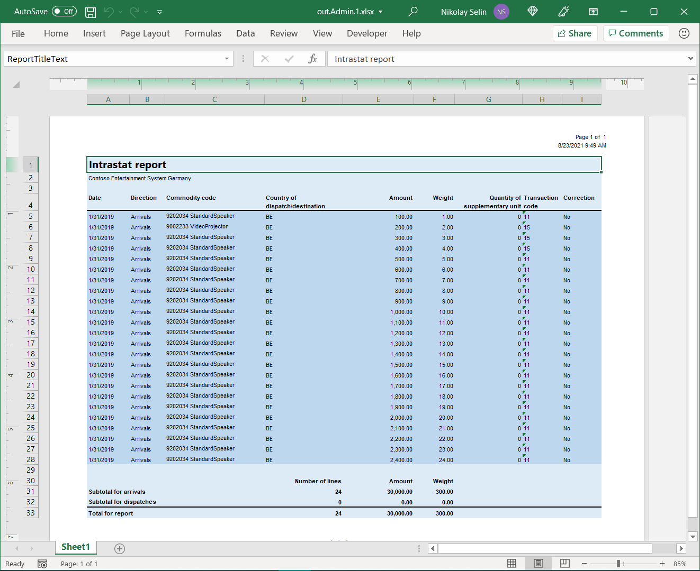

---
# required metadata

title: Design an ER format to paginate a generated document in Microsoft Excel 
description: This topic describes how to design an Electronic reporting (ER) format to paginate a generated document in Microsoft Excel.
author: NickSelin
ms.date: 08/27/2021
ms.topic: article
ms.prod: 
ms.technology: 

# optional metadata

ms.search.form: EROperationDesigner
# ROBOTS: 
audience: Application User, Developer, IT Pro
# ms.devlang: 
ms.reviewer: kfend
# ms.tgt_pltfrm: 
ms.custom: 220314
ms.assetid: 2685df16-5ec8-4fd7-9495-c0f653e82567
ms.search.region: Global
# ms.search.industry: 
ms.author: nselin
ms.search.validFrom: 2021-08-01
ms.dyn365.ops.version: Version 10.0.22

---

# Design an ER format to paginate a generated document in Excel format

[!include [banner](../includes/banner.md)]

This topic explains how a user in the System Administrator or Electronic Reporting Functional Consultant role can configure an [Electronic reporting (ER)](general-electronic-reporting.md) format to generate an outbound document in Microsoft Excel and manage document pagination.

In this example, you will modify the ER format provided by Microsoft that's used to print out the control report when the Intrastat declaration is [generated](../../../finance/localizations/tasks/eur-00002-eu-intrastat-declaration.md). This report lets you observe reported Intrastat transactions. Your modifications allow you to manage the pagination of a generated control report.

The procedures in this topic can be completed in the **DEMF** company. No coding is required. Before you begin, download and save the following files.

| **Description**   | **File name**                   |
| ------------------|---------------------------------| 
| Report template 1 | [ERIntrastatReportDemo1.xlsx](?) |
| Report template 2 | [ERIntrastatReportDemo2.xlsx](?) |

## Configure the ER framework

Complete the steps of the [Configure the ER framework](er-quick-start2-customize-report.md#ConfigureFramework) procedure to set up the minimal set of ER parameters before you can start to use the ER framework to design a custom version of a standard ER format.

## Import the standard ER format configuration

Complete the steps of the [Import the standard ER format configuration](er-quick-start2-customize-report.md#ImportERSolution1) procedure to add the standard ER configurations to your current instance of Microsoft Dynamics 365 Finance. You must select for import the version **1.9** of the **Intrastat report** format configuration. The base version 1 of the base **Intrastat model** configuration is imported from the repository automatically.

## Customize the standard ER format

### Create the custom ER format

In this case, as the representative of **Litware, Inc.** that is currently selected active ER configurations provider, you must create (derive) a new ER format configuration by using (deriving) the **Intrastat report** Microsoft-provided configuration as a base.

1.  Go to **Organization administration** \> **Electronic reporting** \> **Configurations**.
2.  On the **Configurations** page, in the configuration tree in the left pane, expand **Intrastat model**, and then select **Intrastat report**. Litware, Inc. will use version 1.9 of this ER format configuration as the base for the custom version.
3.  Select **Create configuration** to open the drop-down dialog box. You can use this dialog box to create a new configuration for a custom payment format.
4.  In the **New** field group, select the **Derive from Name: Intrastat report, Microsoft** option.
5.  In the **Name** field, enter **Intrastat report Litware**.
6. Select **Create configuration** to complete a new format entry.

Version 1.9.1 of the **Intrastat report Litware** ER format configuration is created. This version has a [status](general-electronic-reporting.md#component-versioning) of **Draft** and can be edited. The current content of your custom ER format matches the content of the format that is provided by Microsoft.

### Make the custom format runnable

Now that the first version of your custom format has been created and has a status of **Draft**, you can run it for testing purposes. To run the report, you must process a vendor payment by using the payment method that refers to your custom ER format. By default, when you call an ER format from the application, only versions that have a status of **Completed** or **Shared** are [considered](general-electronic-reporting.md#component-versioning). This behavior helps prevent ER formats that have unfinished designs from being used. However, for your test runs, you can force the application to use the version of your ER format that has a status of **Draft**. In this way, you can adjust the current format version if any modifications are required. For more information, see [Applicability](electronic-reporting-destinations.md#applicability).

To use the draft version of an ER format, you must explicitly mark the ER format.

1.  Go to **Organization administration** \> **Electronic reporting** \> **Configurations**.
2.  On the **Configurations** page, on the Action Pane, on the **Configurations** tab, in the **Advanced settings** group, select **User parameters**.
3.  In the **User parameters** dialog box, set the **Run settings** option to **Yes**, and then select **OK**.
4.  Select **Edit** to make the current page editable, as required.
5.  In the configuration tree in the left pane, select **Intrastat report Litware**.
6.  Set the **Run Draft** option to **Yes**.
7.  Select **Save**.

## Set up foreign trade parameters to use the custom ER format

To start using the custom format, you must configure foreign trade parameters accordingly.

1.  Go to **Tax** \> **Setup** \> **Foreign trade** \> **Foreign trade parameters**.
2.  On the **Electronic reporting** FastTab, in the **File format mapping** field, select **Intrastat report Litware**.
3.  On the **Electronic reporting** FastTab, in the **Report format mapping** field, select **Intrastat report Litware**.
4.  Select **Save**.

## Configure the custom format adopting the downloaded report template

### Review the first downloaded Excel template

1.  In the Excel desktop application, open the **ERIntrastatReportDemo1.xlsx** template file that you downloaded earlier.
2.  Verify that the template contains named ranges to create report header, report details, and report footer sections in a generated document.

### Replace the current Excel template in the custom ER format

Bring into the custom ER format a new Excel template.

1.  Go to **Organization administration** \> **Electronic reporting** \> **Configurations**.
2.  On the **Configurations** page, in the configuration tree in the left pane, expand **Intrastat model**, and then expand **Intrastat report**.
3.  Select the **Intrastat report Litware** configuration.
4.  Select **Designer**.
5.  On the Action Pane, select **Show details**.
6.  On the **Format designer** page, notice that the root format component **Intrastat: Excel** is selected by default.
7.  On the Action Pane, for the selected **Intrastat: Excel** format component, select **Import**.
8.  On the Action Pane, in the **Import** group, select **Update from Excel**.
    1.  On the **Update from Excel** dialog box, select **Update template**.
    2.  On the **Open** dialog, browse to and select the **ERIntrastatReportDemo1.xlsx** file that you downloaded earlier, and then select **Open**.
    3.  Select **OK**.
9.  Select **Save**.

## Change data binding to show the item description in a generated report

1.  On the **Format designer** page, select the **Mapping** tab.
2.  Select the **Intrastat \> Report lines \> Commodity code** component.
3.  Select **Edit formula**.
4.  Change the binding formula from `@.CommodityCode` to `CONCATENATE(@.CommodityCode, " ", @.ProductName)`
5.  Select **Save**.

## Generate Intrastat declaration control report

Make sure that you have Intrastat transactions for reporting on the **Intrastat** page. 

Generate the control report of the Intrastat declaration by using the custom ER format.

1.  Go to **Tax** \> **Declarations** \> **Foreign trade** \> **Intrastat**.
2.  On the **Intrastat** page, on the Action Pane, select **Output \> Report**.
3.  On the **Intrastat Report** dialog box, specify parameters to execute the report:
    1.  Specify values in **From date** and **To date** fields to include the desire Intrastat transactions to the report.
    2.  Set **Generate file** to **No**.
    3.  Set **Generate report** to **Yes**.
    4.  Select **OK**.
4.  Download and save a generated document that is offered by using web browser.
5.  Open this document in the Excel desktop application for review.

## Configure the custom format to paginate generated documents

### Review the second downloaded Excel template

1.  In the Excel desktop application, open the **ERIntrastatReportDemo2.xlsx** template file that you downloaded earlier.
2.  Verify that, comparing with the **ERIntrastatReportDemo1.xlsx** template, this template contains several new Excel names to create and fill in page specific sections in a generated document:
    -   **ReportPageHeader** range is added to make page headers
    -   **ReportPageFooter** range is added to make page footers
    -   **ReportPageFooter_PageLines** cell is configured to show the number of transactions per page
    -   **ReportPageFooter_PageAmount** cell is configured to show the total amount of transactions per page
    -   **ReportPageFooter_PageWeight** cell is configured to show the total weight of transactions per page
    -   **ReportPageFooter_RunningCounterLines** cells is configured to show the running counter of transactions starting from the beginning of the report including the current page
    -   **ReportPageFooter_RunningTotalAmount** cells is configured to show the amount running total for all transactions starting from the beginning of the report including the current page
    -   **ReportPageFooter_RunningTotalWeight** cells is configured to show the weight running total for transactions starting from the beginning of the report including the current page

    
3.  Note that the **CommodityCode** cell of this template is configured to wrap cell text. As the transaction details row is configured to automatically fit the height of a row, wrapping the text of the **CommodityCode** cell must automatically change the height of the entire row.

    

### Replace the current Excel template in the custom ER format

1.  Complete the steps of the [Replace the current Excel template in the custom ER format](#replace-template) procedure selecting **ERIntrastatReportDemo2.xlsx** in the step 2 of the step 6.
2.  On the **Format designer** page, expand **Intrastat**.
3.  Name [Range](er-fillable-excel.md#range-component) format components that have been added to the editable ER format to synchronize its structure with the structure of the applied Excel template:
    1.  Select the **Range** component that is associated with the Excel name **ReportPageHeader**.
    2.  On the **Format** tab, in the **Name** field enter **Report page header**.
    3.  Select the **Range** component that is associated with the Excel name **ReportPageFooter**.
    4.  On the **Format** tab, in the **Name** field enter **Report page footer**.
4.  Select **Save**.

### Change format structure to implement document pagination

1.  On the **Format designer** page, in the format tree in the left pane, select the **Intrastat** root component.
2.  Select **Add**.
3.  On the **Add** dialog box, choose the [Page](er-fillable-excel.md#page-component) component in the **Excel** group of components.
4.  On the **Component properties** dialog box, in the **Name** field, enter **Report page** and select **OK**.
5.  To use the **Report page header** component as a page header on every generated page, complete the following steps:
    1.  Select the **Report page header** component, then select **Cut**.
    2.  Select the **Report page** component, then select **Paste**.
    3.  Expand **Report page**.
    4.  To force Page component [consider](er-fillable-excel.md#page-component-structure) this range as a page header, complete the following steps:
        1.  Select **Report page header**.
        2.  On the **Format** tab, in the **Replication direction** field, select **No replication**.
6.  To paginate a generated documents taking into account report lines content, complete the following steps:
    1.  Select the **Report lines** component, then select **Cut**.
    2.  Select the **Report page** component, then select **Paste**.
7.  To place the report footer after report lines but before the final page footer, complete the following steps:
    1.  Select the **Report footer** component, then select **Cut**.
    2.  Select the **Report page** component, then select **Paste**.
8.  To use the **Report page footer** component as a page footer on every generated page, complete the following steps:
    1.  Select the **Report page footer** component, then select **Cut**.
    2.  Select the **Report page** component, then select **Paste**.
    3.  To force Page component [consider](er-fillable-excel.md#page-component-structure) this range as a page footer, complete the following steps:
        1.  Select **Report page footer**.
        2.  On the **Format** tab, in the **Replication direction** field, select **No replication**.

### Add data sources to calculate page footer totals

You must configure new data sources to calculate page total, running counter and running total values and show them in the page footer section. For doing this, it is recommended to use [Data collection](er-data-collection-data-sources.md) data sources.

1.  On the **Format designer** page, select the **Mapping** tab.
2.  Select **Add root**.
    1.  On the **Add data source** dialog box, in the **General** section, select **Empty container**.
    2.  On the **'Empty container' data source properties** dialog box, in the **Name** field, enter **Total**.
    3.  Select **OK**.
3.  Select the **Total** data source.
    1.  Select **Add**.
        1.  On the **Add data source** dialog box, in the **General** section, select **Empty container**.
        2.  On the **'Empty container' data source properties** dialog box, in the **Name** field, enter **Page**.
        3.  Select **OK**.
    2.  Select **Add**.
        1.  On the **Add data source** dialog box, in the **General** section, select **Empty container**.
        2.  On the **'Empty container' data source properties** dialog box, in the **Name** field, enter **Running**.
        3.  Select **OK**.
4.  Select the **Total.Page** data source.
    1.  Select **Add**.
        1.  On the **Add data source** dialog box, in the **Functions** section, select **Data collection**.
        2.  On the **'Data collection' data source properties** dialog box, in the **Name** field, enter **Amount**.
        3.  In the **Item type** field, select **Real**.
        4.  Set the **Collect all values** field to **Yes**.
        5.  Select **OK**.
    2.  Select **Add**.
        1.  On the **Add data source** dialog box, in the **Functions** section, select **Data collection**.
        2.  On the **'Data collection' data source properties** dialog box, in the **Name** field, enter **Weight**.
        3.  In the **Item type** field, select **Real**.
        4.  Set the **Collect all values** field to **Yes**.
        5.  Select **OK**.
5.  Select the **Total.Running** data source.
    1.  Select **Add**.
        1.  On the **Add data source** dialog box, in the **Functions** section, select **Data collection**.
        2.  On the **'Data collection' data source properties** dialog box, in the **Name** field, enter **Amount**.
        3.  In the **Item type** field, select **Real**.
        4.  Set the **Collect all values** field to **Yes**.
        5.  Select **OK**.
    2.  Select **Add**.
        1.  On the **Add data source** dialog box, in the **Functions** section, select **Data collection**.
        2.  On the **'Data collection' data source properties** dialog box, in the **Name** field, enter **Weight**.
        3.  In the **Item type** field, select **Real**.
        4.  Set the **Collect all values** field to **Yes**.
        5.  Select **OK**.
    3.  Select **Add**.
        1.  On the **Add data source** dialog box, in the **Functions** section, select **Data collection**.
        2.  On the **'Data collection' data source properties** dialog box, in the **Name** field, enter **Lines**.
        3.  In the **Item type** field, select **Integer**.
        4.  Set the **Collect all values** field to **Yes**.
        5.  Select **OK**.
7.  Select **Save**.

### Add data sources to control page footer visibility

If you plan to control page footer visibility and do not show it on the final page when it contains to transactions, you must configure a new data source to calculate the required running counter.

1.  On the **Format designer** page, select the **Mapping** tab.
2.  Select the **Total.Running** data source.
3.  Select **Add**.
    1.  On the **Add data source** dialog box, in the **Functions** section, select **Data collection**.
    2.  On the **'Data collection' data source properties** dialog box, in the **Name** field, enter **Lines2**.
    3.  In the **Item type** field, select **Integer**.
    4.  Set the **Collect all values** field to **Yes**.
    5.  Select **OK**.
4.  Select **Save**.

### Configure bindings to collect total values

1.  In the format tree, expand the **Report lines** component.
2.  Select the nested **Invoice value** component.
    1.  Select **Edit formula**.
    2.  Change the binding formula from
         `NUMBERVALUE(NUMBERFORMAT(@.InvoiceValue, "F"&TEXT(model.Parameters.IntrastatAmountDecimals)), ".", "")`
         to
         `Total.Page.Amount.Collect(NUMBERVALUE(NUMBERFORMAT(@.InvoiceValue, "F"&TEXT(model.Parameters.IntrastatAmountDecimals)), ".", ""))`
    >[!TIP]
    > In addition to placing amount value to an Excel cell for every iterated transaction, this binding will collect this value in the data collection **Total.Page.Amount** data source.
3.  Select the nested **Weight** component.
    1.  Select **Edit formula**.
    2.  Change the binding formula from
         `@.'$RoundedWeight'`
         to
         `Total.Page.Weight.Collect(@.'$RoundedWeight')`
    >[!TIP]
    > In addition to placing weight value to an Excel cell for every iterated transaction, this binding will also collect this value in the **Total.Page.Weight** data source.

### Configure bindings to fill in page footer totals

1.  In the format tree, expand the **Report page footer** component.
2.  In the format tree, select the nested **Range** component that refers to the Excel **ReportPageFooter_PageAmount** cell.
    1.  In the data sources tree in the right pane, select **Total.Page.Amount.Sum()** item.
    2.  Select **Bind**.
    3.  Select **Edit formula**.
    4.  Update formula to `Total.Page.Amount.Sum(false)`
    > [!TIP]
    > You must specify the argument of this function as **False** to keep collected data for the current page as it is required to compute amount running total, total number of lines per page, and running counter of lines.
3.  In the format tree, select the nested **Range** component that refers to the Excel **ReportPageFooter_PageWeight** cell.
    1.  In the data sources tree in the right pane, select **Total.Page.Weight.Sum()** item.
    2.  Select **Bind**.
    3.  Select **Edit formula**.
    4.  Update formula to `Total.Page.Weight.Sum(false)`

### Configure bindings to fill in page running totals

1.  In the format tree, expand the **Report page footer** component.
2.  In the format tree, select the nested **Range** component that refers to the Excel **ReportPageFooter_RunningTotalAmount** cell.
    1.  In the data sources tree in the right pane, select **Total.Running.Amount.Collect()** item.
    2.  Select **Bind**.
    3.  Select **Edit formula**.
    4.  Update formula to `Total.Running.Amount.Sum(false)+Total.Running.Amount.Collect(Total.Page.Amount.Sum(true))`
    > [!TIP]
    > The `Total.Running.Amount.Sum(false)` operand returns the earlier collected amount running total. The `Total.Running.Amount.Collect(Total.Page.Amount.Sum(true))` operand returns the total amount of the current page. You must specify the argument of the nested function of the second operand as **True** to reset the `Total.Page.Amount` data collection as soon as this value is placed to the `Total.Running.Amount` running total collection. It is required to start collecting next page total from zero value.
    > 
    > The `Total.Running.Amount.Sum(false)` function is called to populate the amount running total to the Excel **ReportPageFooter_RunningTotalAmount** cell on the current page.
3.  In the format tree, select the nested **Range** component that refers to the Excel **ReportPageFooter_RunningTotalWeight** cell.
    1.  In the data sources tree in the right pane, select **Total.Running.Weight.Collect()** item.
    2.  Select **Bind**.
    3.  Select **Edit formula**.
    4.  Update formula to `Total.Running.Weight.Sum(false)+Total.Running.Weight.Collect(Total.Page.Weight.Sum(true))`

### Configure bindings to fill in page running counter

1.  In the format tree, expand the **Report page footer** component.
2.  In the format tree, select the nested **Range** component that refers to the Excel **ReportPageFooter_RunningCounterLines** cell.
    1.  Select **Edit formula**.
    2.  Add the formula `Total.Running.Lines.Collect(COUNT(Total.Page.Amount.Result))`
    > [!TIP]
    > This formula returns the number of collected amount values for the entire report that equals to the number of transactions that have been iterated at this moment. At the same time this formula collects the returned value in the **Total.Running.Lines** collection.

### Configure bindings to fill in page footer counter

1.  In the format tree, expand the **Report page footer** component.
2.  In the format tree, select the nested **Range** component that refers to the Excel **ReportPageFooter_PageLines** cell.
    1.  Select **Edit formula**.
    2.  Add the formula `COUNT(Total.Page.Amount.Result)-Total.Running.Lines.Sum(false)`
    > [!TIP]
    > This formula calculates the number of transactions on the current page as the difference between the number of transactions that is collected in **Total.Page.Amount.Result** for the entire report and the number of transactions that is memorized at this stage in **Total.Running.Lines.Sum**. As the number of transactions for the current page is memorized to **Total.Running.Lines** in the binding of the **Range** component that refers to the Excel **ReportPageFooter_RunningCounterLines** cell, it does not include yet the number of transactions on the current page. So, this difference equal to the number of transactions on the current page.

### Configure components visibility

You can change the visibility of the page header and footer on a particular page of a generated document to hide the following:

    - The page header on the first page because the report header already contains column titles.
    - The page header on any page that doesn't have transactions that can happen for the last page.
    - The page footer on any page that doesn't have transactions that can happen for the last page.

To do this, change the **Enabled** property of the **Report page header** and **Report page footer** components.

1.  In the format tree, select the **Report page header** component that is nested under the **Report page** component.
    1.  Select **Edit** button for the **Enabled** field.
    2.  On the **Formula designer** page, in the **Formula** field, enter the following expression:
         `AND(`
         `COUNT(Total.Page.Amount.Result)<>0,`
         `COUNT(Total.Page.Amount.Result)<>COUNT(model.CommodityRecord)`
         `)`
2.  In the format tree, select the **Report page footer** component that is nested under the **Report page** component.
    1.  Select **Edit** button for the **Enabled** field.
    2.  On the **Formula designer** page, in the **Formula** field, enter the following expression:
     `(`
     `COUNT(Total.Page.Amount.Result)-Total.Running.Lines2.Sum(false)+`
     `0*Total.Running.Lines2.Collect(COUNT(Total.Page.Amount.Result))`
     `)<>0`
    > [!TIP]
    > The `COUNT(Total.Page.Amount.Result)-Total.Running.Lines2.Sum(false)` construction is used to calculate the number of transactions on the current page.
    >
    > The `0*Total.Running.Lines2.Collect(COUNT(Total.Page.Amount.Result)` construction is used to add the number of transactions on the current page to the collection to properly handle the next page footer visibility.
    >
    > The `Total.Running.Lines` collection cannot be re-used here as the **Enabled** property of a base component is processed **after** processing bindings of nested components. So, at the time when the **Enabled** property is processed, the `Total.Running.Lines` collection already incremented by the number of transactions on the current page.
3.  Select **Save**.

## Generate Intrastat declaration control report (updated)

1. Make sure that you have 24 transactions on the **Intrastat** page. Repeat the steps of the [Generate Intrastat declaration control report](#generate-intrastat-control-report) procedure to generate and review the control report.

   All transactions are presented on the first page. The page totals and counters are equal to the report totals and counters. The page header range is hidden on the first page because the report header already contains column titles. The page header and footer are hidden on the second page because it contains no transactions.
   
    
    
2. Update two transactions on the **Intrastat** page by changing the **Item number** code from **D00006** to **L0010**. The **Active stereo speaker pair** product name of the selected **L0010** item is longer than the original **Standard speaker**. This forces text wrapping in the corresponding cell of a generated document. Following this, the document pagination and page related summing and counting must be updated. Repeat the steps of the [Generate Intrastat declaration control report](#generate-intrastat-control-report) procedure to generate and review the control report.
    
    Currently, transactions are presented on two pages and page totals and counters are properly calculated. Page header range is properly hidden on the first page and visible on the second one. The page footer is visible on both pages because they contain transactions.
   
   

## Frequently asked questions

### Is there any way to recognize when the final page is processed by the **Page** format component?

The **Page** component [doesn't expose](er-fillable-excel.md#page-component-limitations) information about the number of the processed page and the total number of pages in a generated document. Nevertheless, you can configure ER [formulas](er-formula-language.md) to recognize the final page. For example,

    - Calculate the total number of transactions that have already been processed by using the **Report page** component. You can do this using the formula `COUNT(Total.Page.Amount.Result)`. 
    - Calculate the total number of transactions that must be processed based on the `model.CommodityRecord` binding that's configured for the **Report lines** component. You can do this using the formula `COUNT(model.CommodityRecord)`
    - Compare two numbers to recognize the final page. When both values are equal, the final page is generated.

    > [!NOTE]
    > We recommend that you use this approach only when the **Enabled** property of the **Report lines** component contains no formula that might return [False](er-formula-supported-data-types-primitive.md#boolean) at runtime for some of the iterated [records](er-formula-supported-data-types-composite.md#record) of the bound [Record list](er-formula-supported-data-types-composite.md#record-list).

## Additional resources

- [Design a configuration for generating documents in Excel format](er-fillable-excel.md)
- [Use DATA COLLECTION data sources in Electronic reporting (ER) formats](er-data-collection-data-sources.md)

[!INCLUDE[footer-include](../../../includes/footer-banner.md)]
