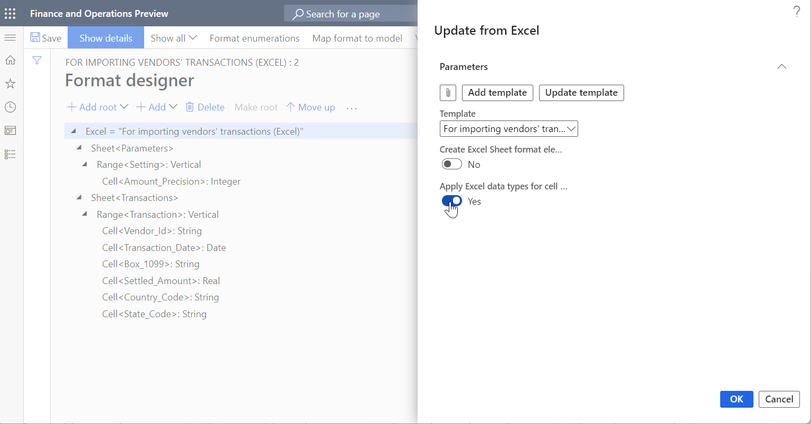
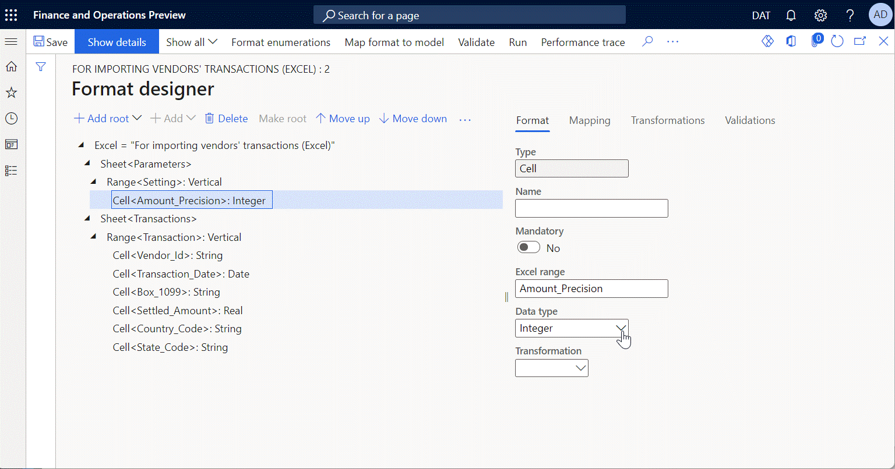

---
# required metadata

title: Parse incoming documents
description: This topic provides information about how to set up Electronic reporting formats that can be used to parse incoming documents. 
author: nickselin
ms.date: 11/24/2021
ms.topic: article
ms.prod: 
ms.technology: 

# optional metadata

ms.search.form: ERSolutionTable, ERVendorTable, ERWorkspace
# ROBOTS: 
audience: Developer
# ms.devlang: 
ms.reviewer: kfend
# ms.tgt_pltfrm: 
# ms.custom: 
# ms.assetid: 
ms.search.region: Global
# ms.search.industry: 
ms.author: nselin
ms.search.validFrom: 2017-11-10
ms.dyn365.ops.version: 7.3

---

# Parse incoming documents
[!include [banner](../includes/banner.md)]

This topic covers the following three tasks:

- [Parse incoming documents to update application data](#parse-incoming-documents-to-update-application-data)
- [Parse incoming documents in Excel format](#parse-incoming-documents-in-excel-format)
- [Parse incoming documents in CSV format](#parse-incoming-documents-in-csv-format)

## Parse incoming documents to update application data
You can design Electronic reporting (ER) formats and run them in the application to parse incoming electronic documents and then use their content to update application data.

The following new ER functionality that has been introduced improves the parsing of incoming electronic documents in XML format:

- The **CASE** format element can be used as a root element of the ER format that is configured to parse incoming electronic documents in XML format. The **FILE** format element is supported as a nested element of the **CASE** element. Therefore, you can configure a single ER format to parse incoming electronic documents that might contain different root XML elements.
- A **Parsing order of nested elements** attribute has been introduced for XML format elements in ER formats. You can use this attribute to define a single XML element that is expected in the incoming file. There are two valid sequences of the nested elements:

    - **As in format** – The incoming file is valid when the sequence of nested elements in the file is the same as the order that is described in the ER format.
    - **Any** – The incoming file is valid when all nested elements in the ER format are present in the parsing file, regardless of their sequence in that file.

To become more familiar with the details of this feature, play the task guide, ER - Parse incoming documents to update application data (part of the 7.5.4.3 Acquire/Develop IT service/solution components (10677) business process). This task guide shows how the responses from a web service can be parsed by using an ER format.

To complete some steps of the task guide, you must download the following files:

| Content description           | File                                                              |
|-------------------------------|-------------------------------------------------------------------|
| ER data model configuration   | [EFSTAmodel.xml](https://download.microsoft.com/download/9/d/9/9d9c8562-7281-4db9-8bb3-b9083c6e2b5d/EFSTAmodel.xml)  |
| ER format configuration       | [EFSTAformat.xml](https://download.microsoft.com/download/8/8/e/88e230cf-120f-4d58-93eb-779f2db1190f/EFSTAformat.xml) |
| Web service response sample 1 | [Response1.xml](https://download.microsoft.com/download/8/0/5/805cc4fc-c6d2-447f-90e8-67ca6e970f2d/Response1.xml)   |
| Web service response sample 2 | [Response2.xml](https://download.microsoft.com/download/e/0/a/e0a53eca-0d75-4958-8e3d-f9b1d91f1421/Response2.xml)   |
| Web service response sample 3 | [Response3.xml](https://download.microsoft.com/download/e/c/2/ec24dcfa-84cd-44b9-9398-ff90f9627986/Response3.xml)   |
| Web service response sample 4 | [Response4.xml](https://download.microsoft.com/download/6/6/b/66ba9a89-989a-454a-96c2-5e50b7e53fd7/Response4.xml)   |

## Parse incoming documents in Excel format

You can design Electronic reporting (ER) formats to parse incoming Microsoft Excel files that represent data in Microsoft Excel workbooks (files in XLSX format). You can then use the content from these files to update application data. This is useful if you:

- Design a new model and format and want to test them at run-time. In this case, Excel will simulate the actual application data.
- Manage data beyond your application in Excel and want to import this data to submit a specific report.

When you design a new ER format to parse inbound documents, you can import an Excel workbook into it as a template for inbound files. To automatically detect the data type that is stored in Excel named cells, set the **Apply Excel data types for cell components** option to **Yes** in the **Update from Excel** dialog box.

You can manually change the cells later in the **Data type** field on the **Format** tab, if either no data type (void) or an incorrect data type has been automatically detected for a single [Cell](er-fillable-excel.md#cell-component) component of the edited ER format. These data types are used in the format model mapping when you specify how data from an inbound file is used to fill in a data model.

By default, when you run this format to parse a real inbound file, ER tries to detect the data type of each cell, just as it did when you imported an Excel template. In some cases, an incorrect data type might be detected and cause incorrect data conversion or a runtime exception. In Finance version 10.0.25 and later, you can force the ER framework at runtime to use the data conversion data types that have been specified for each cell component in the **Data type** field on the **Format** tab of the edited ER format. To force this behavior, enable the **Forcing to use for data parsing only cell data types that are defined in an ER format** feature in the **Feature management** workspace.

To learn more about this feature, play the task guides **ER Import data from a Microsoft Excel file (Part 1: Design format)** and **ER Import data from a Microsoft Excel file (Part 2: Import data)** (parts of the 7.5.4.3 Acquire/Develop IT service/solution components (10677) business process). These task guides walk through how the incoming Excel file can be parsed by using the ER format to import information from incoming documents and update application data. You can download the task guide files from the [Microsoft Download Center](https://go.microsoft.com/fwlink/?linkid=874684).

Download the following files to complete the task guides mentioned above.

| Content description                         | File                                                                       |
|---------------------------------------------|----------------------------------------------------------------------------|
| Incoming file in .XLSX format - template    | [1099import-template.xlsx](https://download.microsoft.com/download/b/8/b/b8ba3c9c-97c6-4fc2-898f-7701aac6035c/1099import-template.xlsx) |
| Incoming file in .XLSX format - sample data | [1099import-data.xlsx](https://download.microsoft.com/download/f/f/4/ff4dbce9-8364-4391-adee-877945ff01f7/1099import-data.xlsx)     |

If you have not yet played the following task guide, [ER Create required configurations to import data from an external file](./tasks/er-required-configurations-import-data.md) in the current Finance and Operations application, download the following file.

| Content description    | File                                                            |
|------------------------|-----------------------------------------------------------------|
| ER model configuration | [1099model.xml](https://download.microsoft.com/download/b/d/9/bd9e8373-d558-4ab8-aa9b-31981adc97ea/1099model.xml) |

##  Parse incoming documents in CSV format

You can design Electronic reporting (ER) formats to parse incoming electronic documents that represent tabular data in plain text (files in CSV format) and then use the content from these documents to update application data. The following approach can be used:

+ Begin your format's design by adding a new root sequence element to specify that each line in the parsing file is considered a separate record.

    + In the added sequence element, select the appropriate value, for example **New line - Windows (CR LF)**, in the **Special characters** field in the **Sequence element delimiter** field group.

+ Continue your format's design by adding a nested sequence element of the added root sequence element to specify that each line in the parsing file is considered as a set of fields.

    + You can specify the character in the **Custom delimiter** field that will be recognized in the parsing line as a fields separator.

        > [!NOTE]
        > - You can define different field separators for different sequence elements to parse specific file lines in which fields are separated by different characters.
        > - The **Custom delimiter** field can be left blank for certain sequence elements. An empty field means that any file line that is parsed by using this sequence will be parsed like a .txt (fixed length text) file line.

    + In the **Quotation application** field, select the value when you expect that some fields of any line that is parsed by this sequence element will be enclosed by certain characters. The following options are available:

        + **All** – Include quotation characters in the parsing line for any field of any data type. If you select this, define the desired characters in the **Quotation mark** field that will be used for fields quotation. For example, the double quotes character.
        + **Text only** – Include quotation characters in the parsing line for any field of the **String** data type. If you select this, define the desired characters in the **Quotation mark** field that will be used for fields quotation.
        + **Derive from parent only** – Use the same **Quotation application** field settings that are defined for the parent sequence element. Note that the **Quotation mark** field setting will be taken from the settings of the parent sequence element as well.
        + **None** – Exclude quotation characters in the parsing line for any field of any data type.

+ Complete your format's design by adding nested elements for the added sequence element that represents the set of fields of the parsing line. Add the required elements of the **Text** group, such as **String**, **DateTime**, and **Numeric**, to describe the structure of the parsing line as a set of individual fields of different data types.

    + For each format element that represents an individual field of the parsing line, by default, nothing is selected in the **Multiplicity** field. This means that the value of the field in the parsing line is considered required. In the **Multiplicity** field, select **Zero one** to consider the value of this field in the parsing line as optional.

        > [!NOTE]
        > The data source item **isMatch** is available when you map this format to ER data model for each **String**, **DateTime**, or **Numeric** format element with the option **Zero one** selected in the **Multiplicity** field. When this field contains a value, **isMatch** will return **True**. If there is no value in the field, it will return **False**.

To learn more about this feature, play the task guide, **ER Create a format configuration to import data from an external CSV file** (part of the 7.5.4.3 Acquire/Develop IT service/solution components (10677) business process), which walks through how the incoming CSV file can be parsed by using the ER format to update application data.

Download the following files to complete the task guide mentioned above.

| Title                                  | File name                                                            |
|----------------------------------------|----------------------------------------------------------------------|
| ER format configuration                | [1099formatcsv.xml](https://download.microsoft.com/download/c/0/1/c014b0fa-d4ee-4de6-8f55-fa539df9ce83/1099formatcsv.xml)  |
| Sample of incoming file in .csv format | [1099entriescsv.csv](https://download.microsoft.com/download/0/0/c/00c7c78c-55d5-46ba-b6ac-971fb9646502/1099entriescsv.csv) |

Download the following file that is required to complete the task guide mentioned above if you have not played the task guide, **ER Create required configurations to import data from an external file for electronic reporting** in the current Finance and Operations application.

| Title                  | File name                                                       |
|------------------------|-----------------------------------------------------------------|
| ER model configuration | [1099model.xml](https://download.microsoft.com/download/b/d/9/bd9e8373-d558-4ab8-aa9b-31981adc97ea/1099model.xml) |

[!INCLUDE[footer-include](../../../includes/footer-banner.md)]
