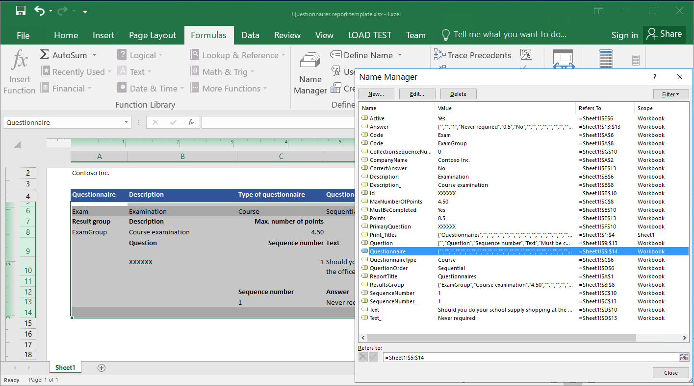
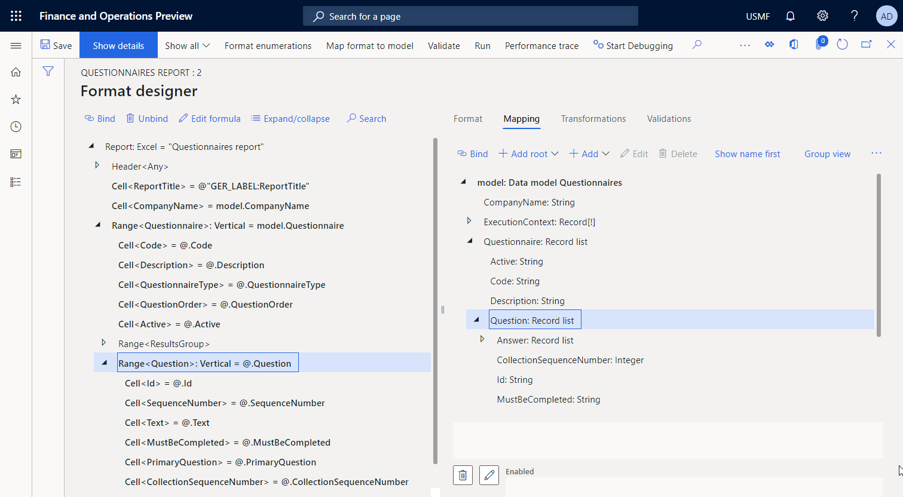

# Design a new ER solution to print a custom report

[!include[banner](../includes/banner.md)]

The following steps explain how a user in the System Administrator, Electronic Reporting Developer, or Electronic Reporting Functional Consultant role can configure parameters of the ER framework, design the required ER configurations of a new ER solution to access the data of a particular business domain, and generate a custom report in Microsoft Office format. These steps can be completed in the **USMF** company.

- [Configure the ER framework](#ConfigureFramework)

    - [Configure ER parameters](#ConfigureParameters)
    - [Activate an ER configuration provider](#ActivateProvider)

        - [Review the list of ER configuration providers](#ReviewProvidersList)
        - [Add a new ER configuration provider](#AddProvider)
        - [Activate an ER configuration provider](#ActivateAddedProvider)

- [Design a domain-specific data model](#DesignModel)

    - [Import a new data model configuration](#ImportDataModel)
    - [Create a new data model configuration](#DesignDataModel)

        - [Name the data model](#NameDataModel)
        - [Add data model fields](#FieldsEntry)
        - [Complete the design of the data model](#CompleteDataModel)

- [Design a model mapping for the configured data model](#DesignMapping)

    - [Import a new model mapping configuration](#ImportModelMapping)
    - [Create a new model mapping configuration](#CreateModelMapping)

        - [Design a new model mapping component](#DesignMappingComponent)
        - [Add data sources to access application tables](#AddMmDataSource1)
        - [Add data sources to access application enumerations](#AddMmDataSource2)
        - [Add ER labels to generate a report in a specified language](#AddMmLabels)
        - [Add a data source to transform the results of comparing enumeration values to a text value](#AddMmDataSource3)
        - [Bind data sources to data model fields](#AddMmBindings1)
        - [Complete the design of the model mapping](#CompleteModelMapping)

- [Design a template for a custom report](#DesignReportTemplate)
- [Design a format](#DesignFormat)

    - [Import a designed format configuration](#FormatImport)
    - [Create a new format configuration](#FormatCreate)

        - [Import a report template](#ImportReportTemplate)
        - [Configure a format](#ConfigureFormat)
        - [Define the data binding for a report title](#DefineFormatBindings)
        - [Review the model data source](#ReviewModelDataSource)
        - [Bind format elements to data source fields](#BindFormatElements)

    - [Run a designed format from ER](#RunFormatFromER)

- [Tune a designed format](#TuneFormat)

    - [Modify a format to change the name of a generated document](#ModifyToChangeName)
    - [Modify a format to change the order of questions](#ModifyToOrder)
    - [Run a modified format from ER](#RunFormatFromER2)
    - [Complete the format design](#CompleteFormat)

- [Develop application artefacts to call the designed report](#DevelopCustomCode)

    - [Modify source code](#ModifySourceCode)

        - [Add a data contract class](#DataContractClass)
        - [Add a UI builder class](#UIBuilderClass)
        - [Add a data provider class](#DataProviderClass)
        - [Add a labels file](#LabelsFile)
        - [Add a report service class](#ServiceClass)
        - [Add a report controller class](#ControllerClass)
        - [Add a menu item](#MenuItem)
        - [Add a menu item to a menu](#Menu)
        - [Build a Visual Studio project](#BuildVSProject)

    - [Run a format from the application](#RunFormatFromApp)

- [Tune a designed ER solution](#TuneSolution)

    - [Modify a model mapping](#ModifyModelMapping)

        - [Add data sources to access a data contract object](#AddDataSource1)
        - [Add a data source to access ER format mapping records](#AddDataSource2)
        - [Add a data source to access a format mapping record of a running ER format](#AddDataSource3)
        - [Enter the name of the running ER format in the data model](#AddBinding)
        - [Complete the design of the model mapping](#CompleteModelMapping2)

    - [Modify a format](#ModifyFormat)

        - [Add a new format element](#AddFormatElement)
        - [Bind the added format element](#BindAddedFormatElement)
        - [Complete the format design](#CompleteFormat2)

    - [Run a format from the application](#RunFormatFromApp2)
    - [Run a format from ER](#RunFormatFromER3)
    - [Configure a format destination for on-screen preview](#ConfigureDestination)
    - [Run a format from the application to preview it as a PDF document](#RunFormatFromApp3)

- [Additional resources](#References)

In this example, you will create a new ER solution for the [Questionnaire](../../../human-resources/hr-learning-questionnaires.md) module. This new ER solution lets you design a report by using a Microsoft Excel worksheet as a template. You can then generate the **Questionnaire** report in Excel or PDF format, in addition to generating the existing SQL Server Reporting Services (SSRS) report. You can also modify the new report later, upon request. No coding is required.

1. To run the existing report, go to **Questionnaire** \> **Design** \> **Questionnaires report**.

    

2. In the **Questionnaires report** dialog box, specify selection criteria. Apply a filter so that the report includes only the **SBCCrsExam** questionnaire.

    

The following illustration shows the generated version of the SSRS report for the **SBCCrsExam** questionnaire.


## <a name="ConfigureFramework"></a>Configure the ER framework

As a user in the Electronic Reporting Developer role, you must configure the minimal set of ER parameters before you can start to use the ER framework to design your new ER solution.

### <a name="ConfigureParameters"></a>Configure ER parameters

1. Go to **Organization administration** \> **Workspaces** \> **Electronic reporting**.
2. In the **Electronic reporting** workspace, select **Electronic reporting parameters**.
3. On the **Electronic reporting parameters** page, on the **General** tab, set the **Enable design mode** option to **Yes**.
4. On the **Attachments** tab, set the following parameters:

    - Set the **Configurations** field to **File** for the **USMF** company.
    - Set **Job archive**, **Temporary**, **Baseline**, and **Others** fields to **File**.

For more information about ER parameters, see [Configure the ER framework](electronic-reporting-er-configure-parameters.md).

### <a name="ActivateProvider"></a>Activate an ER configuration provider

Every ER configuration is marked as owned by an ER configuration provider. Therefore, you must activate an ER configuration provider in the **Electronic reporting** workspace before you start to add or edit any ER configurations.

> [!NOTE]
> Only the owner of an ER configuration can edit it. Therefore, before an ER configuration can be edited, the appropriate ER configuration provider must be activated in the **Electronic reporting** workspace.

#### <a name="ReviewProvidersList"></a>Review the list of ER configuration providers

1. Go to **Organization administration** \> **Workspaces** \> **Electronic reporting**.
2. In the **Electronic reporting** workspace, in the **Related links** section, select **Configuration providers**.
3. On the **Configuration providers** page, each configuration provider record has a unique name and URL. Review the contents of this page. If a record for **Litware, Inc.** (`https://www.litware.com`) already exists, skip the next procedure, [Add a new ER configuration provider](#ActivateProvider).

#### <a name="AddProvider"></a>Add a new ER configuration provider

1. On the **Configuration providers** page, select **New**.
2. In the **Name** field, enter **Litware, Inc.**
3. In the **Internet address** field, enter `https://www.litware.com`.
4. Select **Save**.

#### <a name="ActivateAddedProvider"></a>Activate an ER configuration provider

1. Go to **Organization administration** \> **Workspaces** \> **Electronic reporting**.
2. In the **Electronic reporting** workspace, select the **Litware, Inc.** configuration provider.
3. Select **Set active**.

For more information about ER configuration providers, see [Create configuration providers and mark them as active](tasks/er-configuration-provider-mark-it-active-2016-11.md).

## <a name="DesignModel"></a>Design a domain-specific data model

You must create a new ER configuration that contains a data model component for the **Questionnaire** business domain. This data model will later be used as a data source when you design an ER format to generate the **Questionnaire** report.

By completing the steps in the [Import a new data model configuration](#ImportDataModel) section, you can import the required data model from the provided XML file. Alternatively, you can complete the steps in the [Create a new data model configuration](#DesignDataModel) section to design this data model from scratch.

### <a name="ImportDataModel"></a>Import a new data model configuration

1. Download the [Questionnaires model.version.1.xml](https://download.microsoft.com/download/b/6/3/b633bd34-d200-4422-96d9-8f62eb5218f8/Questionnaires_model.version.1.xml) file, and save it to your local computer.
2. Go to **Organization administration** \> **Workspaces** \> **Electronic reporting**.
3. In the **Electronic reporting** workspace, select **Reporting configurations**.
4. On the Action Pane, select **Exchange** \> **Load from XML file**.
5. Select **Browse**, and then find and select the **Questionnaires model.version.1.xml** file.
6. Select **OK** to import the configuration.

To continue, skip the next procedure, [Create a new data model configuration](#DesignDataModel).

### <a name="DesignDataModel"></a>Create a new data model configuration

1. Go to **Organization administration** \> **Workspaces** \> **Electronic reporting**.
2. In the **Electronic reporting** workspace, select **Reporting configurations**.
3. Select **Create configuration**.
4. In the drop-down dialog box, in the **Name** field, enter **Questionnaire model**.
5. Select **Create configuration** to create the configuration.

#### <a name="NameDataModel"></a>Name the data model

1. On the **Configurations** page, in the configuration tree, select **Questionnaire model**.
2. Select **Designer**.
3. On the **Data model designer** page, on the **General** FastTab, in the **Name** field, enter <a name="DataModeName"></a>**Questionnaires**.

#### <a name="FieldsEntry"></a>Add new data model fields

1. On the **Data model designer** page, select **New**.
2. In the drop-down dialog box for adding a data model node, follow these steps:

    1. Select **Model root** as the type of the new node.
    2. In the **Name** field, enter <a name="RootDefinitionName"></a>**Root**.
    3. Select **Add** to add the new node.

    This root descriptor will be used to provide data for the **Questionnaire** report. A single data model can have multiple descriptors. Each descriptor can be specified for a single ER format, to identify data that is required to generate the report.

3. Select **New** again, and then, in the drop-down dialog box for adding a data model node, follow these steps:

    1. Select **Child of an active node** as the type of the new node.
    2. In the **Name** field, enter **CompanyName**.
    3. In the **Item type** field, select **String**.
    4. Select **Add** to add the new field.

    This field is required to pass the name of the current company to an ER report that consumes this data model as a data source.

4. Select **New** again, and then, in the drop-down dialog box for adding a data model node, follow these steps:

    1. Select **Child of an active node** as the type of the new node.
    2. In the **Name** field, enter **Questionnaire**.
    3. In the **Item type** field, select **Record list**.
    4. Select **Add** to add the new field.

    This field will be used to pass the list of questionnaires to an ER report that consumes this data model as a data source.

5. Select the **Questionnaire** node.
6. Continue to add the required fields of the editable data model in the same manner until you complete the following data model structure.

    | Field path                                                    | Data type   | Field designation/returned value |
    |---------------------------------------------------------------|-------------|----------------------------------|
    | Root                                                          |             | The reference point to request questionnaire data. |
    | Root\\CompanyName                                             | String      | The name of the current company. |
    | Root\\ExecutionContext                                        | Record      | Format execution details. |
    | Root\\ExecutionContext\\FormatName                            | String      | The name of the ER format that is being run. |
    | Root\\Questionnaire                                           | Record list | The list of questionnaires |
    | Root\\Questionnaire\\Active                                   | String      | The status of the current questionnaire. |
    | Root\\Questionnaire\\Code                                     | String      | The code of the current questionnaire. |
    | Root\\Questionnaire\\Description                              | String      | The description of the current questionnaire. |
    | Root\\Questionnaire\\QuestionnaireType                        | String      | The type of the current questionnaire. |
    | Root\\Questionnaire\\QuestionOrder                            | String      | The numerical order of the current questionnaire. |
    | Root\\Questionnaire\\ResultsGroup                             | Record      | The result parameters of the current questionnaire. |
    | Root\\Questionnaire\\ResultsGroup\\Code                       | String      | The identification code of the current result group. |
    | Root\\Questionnaire\\ResultsGroup\\Description                | String      | The description of the current result group. |
    | Root\\Questionnaire\\ResultsGroup\\MaxNumberOfPoints          | Real        | The maximum number of points that could be earned. |
    | Root\\Questionnaire\\Question                                 | Record list | The list of questions for the current questionnaire. |
    | Root\\Questionnaire\\Question\\CollectionSequenceNumber       | Integer     | The sequence number of the current answer collection. |
    | Root\\Questionnaire\\Question\\Id                             | String      | The identification code of the current question. |
    | Root\\Questionnaire\\Question\\MustBeCompleted                | String      | A flag that indicates whether the current question must be answered. |
    | Root\\Questionnaire\\Question\\PrimaryQuestion                | String      | A flag that indicates whether the current question is primary. |
    | Root\\Questionnaire\\Question\\SequenceNumber                 | Integer     | The sequence number of the current question. |
    | Root\\Questionnaire\\Question\\Text                           | String      | The text of the current question. |
    | Root\\Questionnaire\\Question\\Answer                         | Record list | The list of answers for the current question. |
    | Root\\Questionnaire\\Question\\Answer\\CorrectAnswer          | String      | A flag that indicates whether the current answer is correct. |
    | Root\\Questionnaire\\Question\\Answer\\Points                 | Real        | The points that are earned when the current answer is selected. |
    | Root\\Questionnaire\\Question\\Answer\\SequenceNumber         | Integer     | The sequence number of the current answer. |
    | Root\\Questionnaire\\Question\\Answer\\Text                   | String      | The text of the current answer. |

    The following illustration shows the completed editable data model on the **Data model designer** page.

    

7. Save your changes.
8. Close the **Data model designer** page.

#### <a name="CompleteDataModel"></a>Complete the design of the data model

1. Go to **Organization administration** \> **Electronic reporting** \> **Configurations**.
2. On the **Configurations** page, in the configuration tree, select **Questionnaire model**.
3. On the **Versions** FastTab, select the configuration version that has a status of **Draft**.
4. Select **Change status** \> **Complete**.

The status of version 1 of this configuration is changed from **Draft** to **Completed**. Version 1 can no longer be changed. This version contains the configured data model and can be used as the basis for other ER configurations. Version 2 of this configuration is created and has a status of **Draft**. You can edit this version to adjust the **Questionnaire** data model.


For more information about versioning for ER configurations, see [Electronic reporting (ER) overview](general-electronic-reporting.md).

> [!NOTE]
> The configured data model is your abstract representation of the **Questionnaire** business domain and contains no relations to artefacts that are specific to Microsoft Dynamics 365 Finance.

## <a name="DesignMapping"></a>Design a model mapping for the configured data model

As a user in the Electronic Reporting Developer role, you must create a new ER configuration that contains a model mapping component for the **Questionnaire** data model. Because this component implements the configured data model for Finance, it's Finance-specific. You must configure the model mapping component to specify the application objects that must be used to fill in the configured data model with application data at runtime. To complete this task, you must be aware of the implementation details of the data structure of the **Questionnaire** business domain in Finance.

By completing the steps in the [Import a new model mapping configuration](#ImportModelMapping) section that follows, you can import the required model mapping configuration from the provided XML file. Alternatively, you can complete the steps in the [Create a new model mapping configuration](#CreateModelMapping) section to design this model mapping from scratch.

### <a name="ImportModelMapping"></a>Import a new model mapping configuration

1. Download the [Questionnaires mapping.version.1.1.xml](https://download.microsoft.com/download/7/b/2/7b258e4e-4bd5-46a4-8114-27419ae4acd8/Questionnaires_mapping.version.1.1.xml) file, and save it to your local computer.
2. Go to **Organization administration** \> **Workspaces** \> **Electronic reporting**.
3. In the **Electronic reporting** workspace, select **Reporting configurations**.
4. On the Action Pane, select **Exchange** \> **Load from XML file**.
5. Select **Browse**, and then find and select the **Questionnaires mapping.version.1.1.xml** file.
6. Select **OK** to import the configuration.

To continue, skip the next procedure, [Create a new model mapping configuration](#CreateModelMapping).

### <a name="CreateModelMapping"></a>Create a new model mapping configuration

1. Go to **Organization administration** \> **Electronic reporting** \> **Configurations**.
2. On the **Configurations** page, in the configuration tree, select **Questionnaire model**.
3. Select **Create configuration**.
4. In the drop-down dialog box, follow these steps:

    1. In the **New** field, select **Model Mapping based on data model Questionnaires**.
    2. In the **Name** field, enter **Questionnaire mapping**.
    3. In the **Data model definition** field, select the **Root** definition.
    4. Select **Create configuration** to create the configuration.

#### <a name="DesignMappingComponent"></a>Design a new model mapping component

1. On the **Configurations** page, in the configuration tree, select **Questionnaire mapping**.
2. Select **Designer** to open the list of mappings.
3. Select the **Questionnaires mapping** mapping that was automatically added for the **Root** definition
4. Select **Designer** to start to configure the selected mapping.

A new mapping is automatically added for the **Root** definition. This mapping has the **To model** direction. Therefore, this mapping can be used to fill in a data model with required data.

#### <a name="AddMmDataSource1"></a>Add data sources to access application tables

You must configure data sources to access the application tables that contain questionnaire details.

1. On the **Model mapping designer** page, in the **Data source types** pane, select **Dynamics 365 for Operations\\Table records**.
2. Add a new data source that will be used to access the KMCollection table, where every record represents a single questionnaire:

    1. In the **Data sources** pane, select **Add root**.
    2. In dialog box, in the **Name** field, enter **Questionnaire**.
    3. In the **Table** field, enter **KMCollection**.
    4. Set the **Ask for query** option to **Yes**. You will then be able to specify [filtering](../../fin-ops/get-started/advanced-filtering-query-options.md) options for this table in the system query dialog box at runtime.
    5. Select **OK** to add the new data source.

3. In the **Data source types** pane, select **Dynamics 365 for Operations\\Table records**.
4. Add a new data source that will be used to access the KMQuestion table, where every record represents a single question in a questionnaire:

    1. In the **Data sources** pane, select **Add root**.
    2. In the dialog box, in the **Name** field, enter **Question**.
    3. In the **Table** field, enter **KMQuestion**.
    4. Select **OK** to add the new data source.

5. In the **Data source types** pane, select **Dynamics 365 for Operations\\Table records**.
6. Add a new data source try that will be used to access the KMAnswer table, where every record represents a single answer to a question in a questionnaire:

    1. In the **Data sources** pane, select **Add root**.
    2. In the **Name** field, enter **Answer**.
    3. In the **Table** field, enter **KMAnswer**.
    4. Select **OK** to add the new data source.

7. In the **Data source types** pane, select **Functions\\Calculated field**.
8. Add a new calculated field that will be used to access a record of the KMQuestionResultGroup table from every record of the parent KMCollection table:

    1. In the **Data sources** pane, select **Questionnaire**.
    2. Select **Add**.
    3. In the dialog box, in the **Name** field, enter **\$ResultGroup**.
    4. Select **Edit formula**.
    5. In the [ER formula editor](general-electronic-reporting-formula-designer.md), in the **Formula** field, enter **FIRSTORNULL(\@.'\<Relations'.KMQuestionResultGroup)** to use the [path](er-formula-language.md#Paths) of the one-to-many relation between the KMCollection and KMQuestionResultGroup tables.
    6. Select **Save**, and close the formula editor.
    7. Select **OK** to add the new calculated field.

9. In the **Data source types** pane, select **Functions\\Calculated field**.
10. Add a new calculated field that will be used to access question records of the KMQuestion table from every record of the parent KMCollectionQuestion table:

    1. In the **Data sources** pane, select **Questionnaire**.
    2. Expand the **\<Relations** node that contains one-to-many relations of the KMCollection table.
    3. Select the related **KMCollectionQuestion** table, and then select **Add**.
    4. In the dialog box, in the **Name** field, enter **\$Question**.
    5. Select **Edit formula**.
    6. In the formula editor, in the **Formula** field, enter **FIRSTORNULL (FILTER(Question, Question.kmQuestionId = \@.kmQuestionId))** to return the appropriate question records from the KMQuestion table.
    7. Select **Save**, and close the formula editor.
    8. Select **OK** to add the new calculated field.

11. In the **Data source types** pane, select **Functions\\Calculated field**.
12. Add a new calculated field that will be used to access answer records of the KMAnswer table from every record of the parent KMQuestion table:

    1. In the **Data sources** pane, select **Questionnaire.\<Relations.KMCollectionQuestion.\$Question**, and then select **Add**.
    2. In the dialog box, in the **Name** field, enter **\$Answer**.
    3. Select **Edit formula**.
    4. In the formula editor, in the **Formula** field, enter **FILTER (Answer, Answer.kmAnswerCollectionId = \@.kmAnswerCollectionId)** to return the appropriate answer records from the KMAnswer table.
    5. Select **Save**, and close the formula editor.
    6. Select **OK** to add the new calculated field.

13. In the **Data source types** pane, select **Dynamics 365 for Operations\\Table**.
14. Add a new data source that will be used to access methods of the CompanyInfo table. Note that the **find()** method of this table returns a record that represents a company of the current Finance instance that this mapping is called in the context of.

    1. In the **Data sources** pane, select **Add root**.
    2. In the dialog box, in the **Name** field, enter **CompanyInfo**.
    3. In the **Table** field, enter **CompanyInfo**.
    4. Select **OK** to add the new data source.

#### <a name="AddMmDataSource2"></a>Add data sources to access application enumerations

You must configure data sources to access application enumerations and compare their values with values of fields of the **Enumeration** type in the application tables. You must use the result of the comparison to fill in appropriate fields of the data model.

1. On the **Model mapping designer** page, in the **Data source types** pane, select **Dynamics 365 for Operations\\Enumeration**.
2. Add a new data source that will be used to access values of the **EnumAppNoYes** enumeration:

    1. In the **Data sources** pane, select **Add root**.
    2. In the dialog box, in the **Name** field, enter **EnumAppNoYes**.
    3. In the **Enumeration** field, enter **NoYes**.
    4. Select **OK** to add the new data source.

3. In the **Data source types** pane, select **Dynamics 365 for Operations\\Enumeration**.
4. Add a new data source that will be used to access the values of the **KMCollectionQuestionMode** enumeration:

    1. In the **Data sources** pane, select **Add root**.
    2. In the dialog box, in the **Name** field, enter **EnumAppQuestionOrder**.
    3. In the **Enumeration** field, enter **KMCollectionQuestionMode**.
    4. Select **OK** to add the new data source.

#### <a name="AddMmLabels"></a>Add ER labels to generate a report in a specified language

You can add ER labels to configure some of your data sources to return values that depend on the language that is defined in the context of the model mapping's call.

1. On the **Model mapping designer** page, in the **Data sources** pane, select **Answer**, and then select **Edit**.
2. Activate the **Label** field.
3. Select **Translate**.
4. In the **Text translation** dialog box, follow these steps:

    1. In the **Label Id** field, enter **PositiveAnswer**.
    2. In the **Text in default language** field, enter **Yes**.
    3. Select **Translate**.
    4. In the **Label Id** field, enter **NegativeAnswer**.
    5. In the **Text in default language** field, enter **No**.
    6. Select **Translate**.

5. Close the **Text translation** dialog box.
6. Select **Cancel**.


You've entered ER labels only for the default language. For information about how ER labels can be translated into other languages, see [Design multilingual reports](er-design-multilingual-reports.md).

#### <a name="AddMmDataSource3"></a>Add a data source to transform the results of comparing enumeration values to a text value

Because you must transform the results of the comparison between enumeration values and text values several times for difference sources, it's a good idea to configure this logic as a single data source. However, to make this data source reusable, you must then configure it as the parametrized data source. For more information, see [Support parameterized calls of ER data sources of the Calculated field type](er-calculated-field-type.md).

1. On the **Model mapping designer** page, in the **Data source types** pane, select **General\\Empty container**.
2. Add a new container data source:

    1. In the **Data sources** pane, select **Add root**.
    2. In the dialog box, in the **Name** field, enter **Helper**.
    3. Select **OK** to add the new container data source.

3. In the **Data source types** pane, select **Functions\\Calculated field**.
4. Add a new data source:

    1. In the **Data sources** pane, select **Helper**.
    2. Select **Add**.
    3. In the dialog box, in the **Name** field, enter **NoYesEnumToString**.
    4. Select **Edit formula**.
    5. In the formula editor, select **Parameters**.
    6. Follow these steps to specify parameters for the configured expression:

        1. Select **New**.
        2. In the dialog box, in the **Name** field, enter **Argument**.
        3. In the **Type** field, select the **Boolean** data type.
        4. Select **OK**.

    7. In the **Formula** field, enter **IF (Argument = true, \@"GER\_LABEL:PositiveAnswer", \@"GER\_LABEL:NegativeAnswer")** to return the text of the appropriate ER label, depending on the language of the execution context and value of the specified parameter.
    8. Select **Save**, and close the formula editor.
    9. Select **OK** to add the new data source.


#### <a name="AddMmBindings1"></a>Bind data sources to data model fields

You must bind the configured data sources to the fields of the data model to specify how the data model will by filled in with application data at runtime.

1. On the **Model mapping designer** page, in the **Data model** pane, select **CompanyName**.
2. In the **Data sources** pane, expand **CompanyInfo**, and then follow these steps:

    1. Expand the **CompanyInfo.find()** node that represents the **find()** method of the CompanyInfo table.
    2. Select **CompanyInfo.find().Name**.
    3. Select **Bind** to fill in the name of the company that the configured model mapping is called in the context of at runtime.

3. In the **Data model** pane, select **Questionnaire**.
4. In the **Data sources** pane, select **Questionnaire**, and then select **Bind** to fill in questionnaire records.
5. In the **Data model** pane, expand **Questionnaire**, and then follow these steps:

    1. In the **Data model** pane, select **Active**.
    2. In the **Data model** pane, select **Edit**.
    3. In the **Formula** field, enter **Helper.NoYesEnumToString (\@.Active = EnumAppNoYes.Yes)** to fill the text-dependent and language-dependent result of the comparison between enumeration values.

6. Continue to bind data sources to data model fields in the same manner until you achieve the following result.

    | Field path                                              | Data type   | Action | Binding expression |
    |---------------------------------------------------------|-------------|--------|--------------------|
    | CompanyName                                             | String      | Bind   | CompanyInfo.'find()'.Name |
    | Questionnaire                                           | Record list | Bind   | Questionnaire |
    | Questionnaire\\Active                                   | String      | Edit   | Helper.NoYesEnumToString(\@.active = EnumAppNoYes.Yes) |
    | Questionnaire\\Code                                     | String      | Bind   | \@.kmCollectionId |
    | Questionnaire\\Description                              | String      | Bind   | \@.Description |
    | Questionnaire\\QuestionnaireType                        | String      | Bind   | \@.'&gt;Relations'.kmCollectionTypeId.Description |
    | Questionnaire\\QuestionOrder                            | String      | Edit   | CASE (\@.questionMode,<br>EnumAppQuestionOrder.Conditional, "Conditional",<br>EnumAppQuestionOrder.Random, "Random (percentage in questionnaire)",<br>EnumAppQuestionOrder.RandomGroup, "Random (percentage in result groups)",<br>EnumAppQuestionOrder.Sequence, "Sequential",<br>"") |
    | Questionnaire\\ResultsGroup                             | Record      |        | |
    | Questionnaire\\ResultsGroup\\Code                       | String      | Bind   | \@.'\$ResultGroup'.kmQuestionResultGroupId |
    | Questionnaire\\ResultsGroup\\Description                | String      | Bind   | \@.'\$ResultGroup'.description |
    | Questionnaire\\ResultsGroup\\MaxNumberOfPoints          | Real        | Bind   | \@.'\$ResultGroup'.maxPoint |
    | Questionnaire\\Question                                 | Record list | Bind   | \@.'&lt;Relations'.KMCollectionQuestion |
    | Questionnaire\\Question\\CollectionSequenceNumber       | Integer     | Bind   | \@.answerCollectionSequenceNumber |
    | Questionnaire\\Question\\Id                             | String      | Bind   | \@.kmQuestionId |
    | Questionnaire\\Question\\MustBeCompleted                | String      | Edit   | Helper.NoYesEnumToString(\@.mandatory = EnumAppNoYes.Yes) |
    | Questionnaire\\Question\\PrimaryQuestion                | String      | Bind   | \@.parentQuestionId |
    | Questionnaire\\Question\\SequenceNumber                 | Integer     | Bind   | \@.SequenceNumber |
    | Questionnaire\\Question\\Text                           | String      | Bind   | \@.'\$Question'.text |
    | Questionnaire\\Question\\Answer                         | Record list | Bind   | \@.'\$Question'.'\$Answer' |
    | Questionnaire\\Question\\Answer\\CorrectAnswer          | String      | Edit   | Helper.NoYesEnumToString(\@.correctAnswer = EnumAppNoYes.Yes) |
    | Questionnaire\\Question\\Answer\\Points                 | Real        | Bind   | \@.point |
    | Questionnaire\\Question\\Answer\\SequenceNumber         | Integer     | Bind   | \@.sequenceNumber |
    | Questionnaire\\Question\\Answer\\Text                   | String      | Bind   | \@.text |

    The following illustration shows the final state of the configured model mapping on the **Model mapping designer** page.

    

7. Save your changes.
8. Close the **Model mapping designer** page.

#### <a name="CompleteModelMapping"></a>Complete the design of the model mapping

1. Go to **Organization administration** \> **Electronic reporting** \> **Configurations**.
2. On the **Configurations** page, in the configuration tree, select **Questionnaire mapping**.
3. On the **Versions** FastTab, select the configuration version that has a status of **Draft**.
4. Select **Change status** \> **Complete**.

The status of version 1.1 of this configuration is changed from **Draft** to **Completed**. Version 1.1 can no longer be changed. This version contains the configured model mapping and can be used as the basis for other ER configurations. Version 1.2 of this configuration is created and has a status of **Draft**. You can edit this version to adjust the **Questionnaire mapping** configuration.


> [!NOTE]
> The configured model mapping is your Finance-specific implementation of the abstract data model that represents the **Questionnaire** business domain.

## <a name="DesignReportTemplate"></a>Design a template for a custom report

The ER framework uses predefined templates to generate reports in Microsoft Office formats (Excel workbooks or Word documents). While the required report is being generated, a template is filled in with required data according to the configured dataflow. Therefore, you must first design a template for your custom report. This template must be designed as an Excel workbook, the structure of which represents the layout of a custom report. You must name every Excel item that you plan to fill in with required data.

1. Download the [Questionnaires report template.xlsx](https://download.microsoft.com/download/3/8/2/382c3cf0-87bb-473f-b7bb-3015b4facb74/Questionnaires_report_template.xlsx) file, and save it to your local computer.
2. Open the file in Excel, and review the structure of the workbook.

As the following illustration shows, the downloaded template has been designed to print specified questionnaires that present a questionnaire's questions together with appropriate answers.


Excel names have been added to this template to fill in the questionnaire details. You can use Name Manager to review the Excel names.


Report labels have been added as fixed text in the English language. You can replace the report labels with new Excel names that fill in the labels with language-dependent text by using the ER format [labels](#AddMmLabels), as you did for language-dependent expressions in the configured model mapping. In this case, ER labels must be added in the editable ER format.

As the following illustration shows, the custom report header has been specified to enable Excel to do paging.


## <a name="DesignFormat"></a>Design a format

As a user in the Electronic Reporting Functional Consultant role, you must create a new ER configuration that contains a format component. You must configure the format component to specify how a report template will be filled in with required data at runtime.

By completing the steps in the [Import a designed format configuration](#FormatImport) section, you can import the required format from the provided XML file. Alternatively, you can complete the steps in the [Create a new format configuration](#FormatCreate) section to design this format from scratch.

### <a name="FormatImport"></a>Import a designed format configuration

1. Download the [Questionnaires format.version.1.1.xml](https://download.microsoft.com/download/1/b/a/1ba39ec2-257a-44d8-972f-25bf7d18fb41/Questionnaires_format.version.1.1.xml) file, and save it to your local computer.
2. Go to **Organization administration** \> **Workspaces** \> **Electronic reporting**.
3. In the **Electronic reporting** workspace, select **Reporting configurations**.
4. On the Action pane, Select **Exchange** \> **Load from XML file**.
5. Select **Browse**, and then find and select the **Questionnaires format.version.1.1.xml** file.
6. Select **OK** to import the configuration.

To continue, skip the next procedure, [Create a new format configuration](#FormatCreate).

### <a name="FormatCreate"></a>Create a new format configuration
 
1. Go to **Organization administration** \> **Electronic reporting** \> **Configurations**.
2. On the **Configurations** page, in the configuration tree, select **Questionnaire model**.
3. Select **Create configuration**.
4. In the drop-down dialog box, follow these steps:

    1. In the **New** field, select **Format based on data model Questionnaires**.
    2. In the **Name** field, enter **Questionnaire report**.
    3. In the **Data model version** field, select **1**.

        > [!NOTE]
        > - If you select a specific version of the base data model, the structure of the corresponding version of the data model will be presented to you as the structure of the **Model** data source in the format that is created.
        > - You can leave this field blank. In that case, the structure of the **Draft** version of the data model will be presented to you as the structure of the **Model** data source in the format that is created. You can then adjust your model and immediately see those adjustments in your format. This approach might improve the efficiency of ER solution design when you configure your data model, model mapping, and format simultaneously.
        > - If you select a specific version of the base data model, you can switch to using the **Draft** version later, when you start to edit a format.

    4. In the **Data model definition** field, select the **Root** definition.

5. Select **Create configuration** to create the configuration.

#### <a name="ImportReportTemplate"></a>Import a report template

1. On the **Configurations** page, in the configuration tree, select **Questionnaire report**.
2. Select **Designer** to start to configure a custom format.
3. On the **Format designer** page, on the Action Pane, select **Import** \> **Import from Excel**.
4. In the dialog box, follow these steps:

    1. Select **Add template**.
    2. Find and select the locally saved **Questionnaires report template.xslx** file, and then select **Open**.
    3. Select **OK** to import the template.

    

The **Excel\\File** format element is automatically added to the editable format as a root element. Additionally, either the **Excel\\Range** format element or the **Excel\\Cell** format element is automatically added for every recognized Excel name of the imported template. The **Excel\\Header** format that has the nested **String** element is automatically added to reflect the header settings of the imported template.


#### <a name="ConfigureFormat"></a>Configure a format

1. On the **Format designer** page, in the format tree, select the **Excel** root element.
2. On the **Format** tab on the right side of the page, in the **Name** field, enter <a name="AddFormatRootElement"></a>**Report**.
3. In the **Language preference** field, select **User preference** to run the report in the user's preferred language.
4. In the **Culture preference** field, select **User preference** to run the report in the user's preferred culture.

    For information about how to specify the language and culture contexts for an ER process, see [Design multilingual reports](er-design-multilingual-reports.md).

    

5. In the format tree, expand the root node, and then select **ResultsGroup**.
6. On the **Format** tab, in the **Replication direction** field, select **No replication**, because you don't expect to have multiple result groups for a single questionnaire.

    

7. Select **Save**.

#### <a name="DefineFormatBindings"></a>Define the data binding for a report title

You must specify a data binding for a format element that is used to fill in the title of a generated report.

1. On the **Format designer** page, on the **Mapping** tab on the right, select the **Report\\ReportTitle** element.
2. Select **Edit formula**.
3. In the formula editor, select **Translate**.
4. In the **Text translation** dialog box, follow these steps:

    1. In the **Label ID** field, enter **ReportTitle**.
    2. In the **Text in default language** field, enter **Questionnaires report**.
    3. Select **Translate**, and then select **Save**.
    4. Select **Translate** to close the **Text translation** dialog box.

5. Close the formula editor.

    

You can use this technique to make all other labels of the current template language-dependent. For information about how the added labels of a single ER configuration can be translated into all supported languages, see [Design multilingual reports](er-design-multilingual-reports.md).

#### <a name="ReviewModelDataSource"></a>Review model data source

1. On the **Format designer** page, on the **Mapping** tab, select the <a name="ModelDSName"></a>**model** data source that represents the base data model of this ER format.
2. Select **Edit**.
3. Review the information in the **Data source properties** dialog box. This data source represents version 1 of the **Questionnaires** data model component that resides in the **Questionnaires model** ER configuration.


#### <a name="BindFormatElements"></a>Bind format elements to data source fields

To specify how a template is filled in at runtime, you must bind every format element that is associated with an appropriate Excel name to a single field of this format's data source.

1. On the **Format designer** page, in the format tree, select the **Report\\CompanyName** format element.
2. On the **Mapping** tab, select the **model.CompanyName** data source field of the **String** type.
3. Select **Bind** to enter a company name in a template.
4. In the format tree, select the **Report\\Questionnaire** element.
5. On the **Mapping** tab, select the **model.Questionnaire** data source field of the **Record list** type.
6. Select **Bind**.
7. Select **Show details** to see more details for format elements.

    The **Questionnaire** range format element is configured as vertically replicated. When it's bound to a data source of the **Record list** type, the appropriate **Questionnaire** range of the Excel template is repeated for every record of the bound data source.
 
    

    Because the **Questionnaire** range of the Excel template is defined between rows 5 through 14, these rows are repeated for every reported questionnaire.

    

8. Configure similar bindings for the remaining format elements, as described in the following table.

    > [!NOTE]
    > In this table, the information in the "Data source path" column assumes that the [relative path](relative-path-data-bindings-er-models-format.md) ER feature is turned on.

    | Format element path                                      | Data source path |
    |----------------------------------------------------------|------------------|
    | Excel\\ReportTitle                                       | **\@"GER\_LABEL:ReportTitle"** |
    | Excel\\CompanyName                                       | **model.CompanyName** |
    | Excel\\Questionnaire                                     | **model.Questionnaire** |
    | Excel\\Questionnaire\\Active                             | **\@.Active**, where **\@** is **model.Questionnaire** |
    | Excel\\Questionnaire\\Code                               | **\@.Code** |
    | Excel\\Questionnaire\\Description                        | **\@.Description** |
    | Excel\\Questionnaire\\QuestionnaireType                  | **\@.QuestionnaireType** |
    | Excel\\Questionnaire\\QuestionOrder                      | **\@.QuestionOrder** |
    | Excel\\Questionnaire\\ResultsGroup\\Code\_               | **\@.ResultsGroup.Code** |
    | Excel\\Questionnaire\\ResultsGroup\\Description\_        | **\@.ResultsGroup.Description** |
    | Excel\\Questionnaire\\ResultsGroup\\MaxNumberOfPoints    | **\@.ResultsGroup.MaxNumberOfPoint** |
    | Excel\\Questionnaire\\Question                           | **\@.Question** |
    | Excel\\Questionnaire\\Question\\CollectionSequenceNumber | **\@.CollectionSequenceNumber**, where **\@** is **model.Questionnaire.Question** |
    | Excel\\Questionnaire\\Question\\Id                       | **\@.Id** |
    | Excel\\Questionnaire\\Question\\MustBeCompleted          | **\@.MustBeCompleted** |
    | Excel\\Questionnaire\\Question\\PrimaryQuestion          | **\@.PrimaryQuestion** |
    | Excel\\Questionnaire\\Question\\SequenceNumber           | **\@.SequenceNumber** |
    | Excel\\Questionnaire\\Question\\Text                     | **\@.Text** |
    | Excel\\Questionnaire\\Question\\Answer                   | **\@.Answer** |
    | Excel\\Questionnaire\\Question\\Answer\\CorrectAnswer    | **\@.CorrectAnswer**, where **\@** is **model.Questionnaire.Answer** |
    | Excel\\Questionnaire\\Question\\Answer\\Points           | **\@.Points** |
    | Excel\\Questionnaire\\Question\\Answer\\Text             | **\@.Text** |

9. When you've finished, select **Save**.

The following illustration shows the final state of the configured data bindings on the **Format designer** page.


> [!IMPORTANT]
> The whole collection of specified data sources and bindings represents a format mapping component of the configured format. This format mapping is called when you run the configured format for report generation.

### <a name="RunFormatFromER"></a>Run a designed format from ER

You can now run a designed format for testing purposes from the **Configurations** page.

1. Go to **Organization administration** \> **Electronic reporting** \> **Configurations**.
2. On the **Configuration** page, in the configuration tree, expand **Questionnaire model**, and then select **Questionnaire report**.
3. Select **Designer** for the format version that has a status of **Draft**.
4. On the **Format designer** page, select **Run**.
5. In the **ER parameters** dialog box, on the **Records to include** FastTab, configure the filtering option so that only the **SBCCrsExam** questionnaire is included.
6. Select **OK** to confirm the filtering option.
7. Select **OK** to run the report.
8. Review the generated report.

By [default](electronic-reporting-destinations.md#default-behavior), a generated report is delivered as an Excel file that you can download. The following illustrations show two pages of the generated report in Excel format.


## <a name="TuneFormat"></a>Tune a designed format

### <a name="ModifyToChangeName"></a>Modify a format to change the name of a generated document

By default, a generated document is named by using the alias of the current user. By modifying the format, you can change this behavior so that a generated document is named based on your custom logic. For example, the name of a generated document can be based on the current session date and time, and on the report's title.

1. On the **Format designer** page, select the **Report** root item.
2. On the **Mapping** tab, select **Edit file name**.
3. In the **Formula** field, enter **CONCATENATE (\@"GER\_LABEL:ReportTitle", " - ", DATETIMEFORMAT(SESSIONNOW(), "yyyy-MM-dd hh-mm-ss"))**.
4. Select **Save**, and close the formula editor.
5. Select **Save**.

### <a name="ModifyToOrder"></a>Modify a format to change the order of questions

The questions aren't correctly ordered in a generated report. You can change the order by modifying the format.

1. On the **Format designer** page, select the **Report** root item.
2. On the **Mapping** tab, in the format tree, expand **Report\\Questionnaire\\Question**.

    

3. On the **Mapping** tab, select **model.Questionnaire**.
4. Select **Add** \> **Functions\\Calculated field**, and then, in the **Name** field, enter **OrderedQuestions**.
5. Select **Edit formula**.
6. In the formula editor, in the **Formula** field, enter **ORDERBY (model.Questionnaire.Question, model.Questionnaire.Question.SequenceNumber)** to order the list of questions of the current questionnaire by the sequence order number.
7. Select **Save**, and close the formula editor.
8. Select **OK** to complete the entry of a new calculated field.
9. On the **Mapping** tab, select **model.Questionnaire.OrderedQuestions**.
10. In the format tree, select **Excel\\Questionnaire\\Question**.
11. Select **Bind**, and then confirm that the current **model.Questionnaire.Questions** path is replaced by the new **model.Questionnaire.OrderedQuestions** path in all bindings of nested elements.
12. Select **Save**.


### <a name="RunFormatFromER2"></a>Run a modified format from ER

You can now run a modified format for testing purposes from the ER framework.

1. On the **Format designer** page, select **Run**.
2. In the **ER parameters** dialog box, on the **Records to include** FastTab, configure the filtering option so that only the **SBCCrsExam** questionnaire is included.
3. Select **OK** to confirm the filtering option.
4. Select **OK** to run the report.
5. Review the generated report.

The following illustration shows a generated report in Excel format where the questions are correctly ordered.


### <a name="CompleteFormat"></a>Complete the format design

1. Go to **Organization administration** \> **Electronic reporting** \> **Configurations**.
2. On the **Configurations** page, in the configuration tree, expand **Questionnaire model**, and then select **Questionnaire report**.
3. On the **Versions** FastTab, select the configuration version that has a status of **Draft**.
4. Select **Change status** \> **Complete**.

The status of version 1.1 of this configuration is changed from **Draft** to **Completed**. Version 1.1 can no longer be changed. This version contains the configured format and can be used to print your custom report. Version 1.2 of this configuration is created and has a status of **Draft**. You can edit this version to adjust the format of your **Questionnaire** report.


> [!NOTE]
> The configured format is your design of the **Questionnaire** report and contains no relations to the Finance-specific artefacts.

## <a name="DevelopCustomCode"></a>Develop application artefacts to call the designed report

As a user in the System Administrator role, you must develop new logic so that the configured ER format can be called from the application user interface (UI) to generate your custom report. Currently, ER doesn't offer any capability for configuring this type of logic. Therefore, some engineering work is required. 

To develop the new logic, you must deploy a topology that supports continuous build. For more information, see [Deploy topologies that support continuous build and test automation](../perf-test/continuous-build-test-automation.md). You must also have access to the development environment for this topology. For more information about the available ER API, see [ER framework API](er-apis-app73.md).

### <a name="ModifySourceCode"></a>Modify source code

#### <a name="DataContractClass"></a>Add a data contract class

Add the new **QuestionnairesErReportContract** class to your Microsoft Visual Studio project, and write code that specifies the data contract that should be used to run the configured ER format.

```xpp
/// <summary>
///     This class is the data contract class for the <c>QuestionnairesErReportDP</c> class.
/// </summary>
/// <remarks>
///    This is the data contract class for the Questionnaires ER report.
/// </remarks>
[
    DataContractAttribute,
    SysOperationContractProcessingAttribute(classStr(QuestionnairesErReportUIBuilder))
    ]
    public class QuestionnairesErReportContract extends ERFormatMappingRunBaseContract implements SysOperationValidatable
{
    ERFormatMappingId formatMapping;

    /// <summary>
    ///    Validates the report parameters.
    /// </summary>
    /// <returns>
    ///    true if no errors; otherwise, false.
    /// </returns>
    public boolean validate()
    {
        boolean ret = true;
        if (!formatMapping)
        {
            ret = checkFailed(strFmt("@SYS26332", new SysDictType(extendedTypeNum(ERFormatMappingId)).label()));
        }
        return ret;
    }
    [
        DataMemberAttribute('FormatMapping'),
        SysOperationLabelAttribute(literalstr("@ElectronicReporting:FormatMapping")),
        SysOperationHelpTextAttribute(literalstr("@ElectronicReporting:FormatMapping"))
    ]
    public ERFormatMappingId parmFormatMapping(ERFormatMappingId _formatMapping = formatMapping)
    {
        formatMapping = _formatMapping;
        return formatMapping;
    }
}
```

#### <a name="UIBuilderClass"></a>Add a UI builder class

Add the new **QuestionnairesErReportUIBuilder** class to your Visual Studio project, and write code to generate a runtime dialog box that will be used to look up the format mapping ID of the ER format that must be run. The provided code looks up only ER formats that contain a data source of the **Data model** type that refers to the **[Questionnaires](#DataModeName)** data model by using the **[Root](#RootDefinitionName)** definition.

> [!NOTE]
> Alternatively, you can use ER integration points to filter ER formats. For more information, see [API to show a format mapping lookup](er-apis-app10-0-11.md#api-to-show-a-format-mapping-lookup).

```xpp
/// <summary>
/// The UIBuilder class for Questionnaires ER report
/// </summary>
class QuestionnairesErReportUIBuilder extends SysOperationAutomaticUIBuilder
{
    public const str ERQuestionnairesModel = 'Questionnaires';
    public const str ERQuestionnairesDataContainer = 'Root';

    /// <summary>
    /// Action after build of the dialog UI.
    /// </summary>
    public void postBuild()
    {
        DialogField formatMapping;
        super();
        formatMapping = this.bindInfo().getDialogField(this.dataContractObject(),
            methodStr(QuestionnairesErReportContract, parmFormatMapping));
        formatMapping.registerOverrideMethod(
            methodStr(FormReferenceControl, lookupReference),
            methodStr(QuestionnairesErReportUIBuilder, formatMappingLookup),
            this);
    }

    /// <summary>
    /// Performs the lookup form for format mapping.
    /// </summary>
    /// <param name="_referenceGroupControl">
    /// The control to perform lookup form.
    /// </param>
    public void formatMappingLookup(FormReferenceControl _referenceGroupControl)
    {
        ERObjectsFactory::createFormatMappingTableLookupForControlAndModel(
            _referenceGroupControl,
            ERQuestionnairesModel,
            ERQuestionnairesDataContainer).performFormLookup();
    }
}
```

#### <a name="DataProviderClass"></a>Add a data provider class

Add the new **QuestionnairesErReportDP** class to your Visual Studio project, and write code that introduces the data provider that should used to run the configured ER format. The provided code includes only the data contract for this data provider.

```xpp
/// <summary>
/// Data provider class for Questionnaires ER report.
/// </summary>
public class QuestionnairesErReportDP
{
    QuestionnairesErReportContract contract;
    public static QuestionnairesErReportDP construct()
    {
        QuestionnairesErReportDP  dataProvider;
        dataProvider = new QuestionnairesErReportDP();
        return dataProvider;
    }
}
```

#### <a name="LabelsFile"></a>Add a labels file

Add the new **QuestionnairesErReportLabels\_en-US** labels file to your Visual Studio project, and specify the following labels for new UI resources:

- The **\@QuestionnairesReport** label for a new menu item that contains the following text in US English (en-US): **Questionnaires report (powered by ER)**
- The **\@QuestionnairesReportBatchJobDescription** label for a batch job title if a selected ER format is scheduled for execution as a batch job

#### <a name="ServiceClass"></a>Add a report service class

Add the new **QuestionnairesErReportService** class to your Visual Studio project, and write code that calls an ER format, identifies it by a format mapping ID, and provides a data contract as a parameter.

```xpp
using Microsoft.Dynamics365.LocalizationFramework;
/// <summary>
/// The electronic reporting service class for Questionnaires ER report
/// </summary>
class QuestionnairesErReportService extends SysOperationServiceBase
{
    public const str ERModelDataSourceName = 'model';
    public const str DefaultExportedFileName = 'Questionnaires report';
    public const str ParametersDataSourceName = 'RunTimeParameters';

    /// <summary>
    /// Generates report by using Electronic reporting framework
    /// </summary>
    /// <param name = "_contract">The Questionnaires report contract</param>
    public void generateReportByGER(QuestionnairesErReportContract _contract)
    {
        ERFormatMappingId formatMappingId;
        QuestionnairesErReportDP  dataProvider;
        dataProvider = QuestionnairesErReportDP::construct();
        formatMappingId = _contract.parmFormatMapping();
        if (formatMappingId)
        {
            try
            {
                ERIModelDefinitionParamsAction parameters = new ERModelDefinitionParamsUIActionComposite()
                    .add(new ERModelDefinitionObjectParameterAction(ERModelDataSourceName, ParametersDataSourceName, _contract, true));

                // Call ER to generate the report.
                ERIFormatMappingRun formatMappingRun = ERObjectsFactory::createFormatMappingRunByFormatMappingId(formatMappingId, DefaultExportedFileName);
                if (formatMappingRun.parmShowPromptDialog(true))
                {
                    formatMappingRun.withParameter(parameters);
                    formatMappingRun.withFileDestination(_contract.getFileDestination());
                    formatMappingRun.run();
                }
            }
            catch
            {
                // An error occurred while exporting data.
                error("@SYP4861341");
            }
        }
        else
        {
            // There is no data available.
            info("@SYS300117");
        }
    }
}
```

When you must use an ER format that runs application data, you must configure a data source of the **Data model** type in the format mapping. This data source refers to a specific part of the specified data model by using a single root definition. When the ER format is run, it calls this data source to access the appropriate ER model mapping that is configured for a given model and root definition.

All the information that you might prepare in the source code and store as part of the data contract can be passed to the running ER format by using an ER model mapping of this type. In the ER model mapping, you must configure a data source of the **Object** type that refers to the **[QuestionnairesErReportContract](#DataContractClass)** class. To identify a model mapping, you must specify a data source that calls this model mapping. In the provided code, this data source specified by the **ERModelDataSourceName** constant that has the **[model](#ModelDSName)** value. To identify which data source is used to expose the data contract in the model mapping, you must specify a data source name. In the provided code, this name is specified by the **ParametersDataSourceName** constant that has <a name="DataContractDSName"></a>**RunTimeParameters** value.

> [!NOTE]
> In a new environment, you might have to refresh the ER metadata so that this type of class is available in the ER model mapping designer. For more information, see [Configure the ER framework](electronic-reporting-er-configure-parameters.md#frequently-asked-questions).

#### <a name="ControllerClass"></a>Add a report controller class

Add the new **QuestionnairesErReportController** class to your Visual Studio project, and write code that runs an ER format in either synchronous mode or batch mode, as you prefer, in the dialog box that is built based on the logic of the provided **QuestionnairesErReportUIBuilder** class.

```xpp
/// <summary>
/// The controller for Questionnaires ER report
/// </summary>
class QuestionnairesErReportController extends ERFormatMappingRunBaseController
{
    /// <summary>
    /// The main entrance of the controller
    /// </summary>
    /// <param name = "args">The arguments</param>
    public static void main(Args args)
    {
        QuestionnairesErReportController operation;
        operation = new QuestionnairesErReportController(
            classStr(QuestionnairesErReportService),
            methodStr(QuestionnairesErReportService, generateReportByGER),
            SysOperationExecutionMode::Synchronous);
        operation.startOperation();
    }

    /// <summary>
    /// Gets caption of the dialog.
    /// </summary>
    /// <returns>Caption of the dialog</returns>
    public ClassDescription defaultCaption()
    {
        ClassDescription batchDescription;
        batchDescription = "Questionnaires report (powered by ER)";
        return batchDescription;
    }
}
```

#### <a name="MenuItem"></a>Add a menu item

Add the new **QuestionnairesErReport** menu item to your Visual Studio project. In the **Object** property, this menu item refers to the **QuestionnairesErReportController** class, and it's used to specify a user permission to select and run an ER format. In the **Label** property, this menu item refers to the **\@QuestionnairesReport** label that you created earlier, so that correct text is presented in the application UI.

#### <a name="Menu"></a>Add a menu item to a menu

Add the existing **KM** menu to your Visual Studio project. You must add a new **QuestionnairesErReport** item of the **Output** type to this menu. This item must refer to the **QuestionnairesErReport** menu item that is described in the previous section.

#### <a name="BuildVSProject"></a>Build a Visual Studio project

Build your project to make a new menu item available to users.

### <a name="RunFormatFromApp"></a>Run a format from the application

1. Go to **Questionnaire** \> **Design** \> **Questionnaires report (powered by ER)**.

    

2. In the dialog box, in the **Format mapping** field, select **Questionnaires report**.
3. Select **OK**.
4. In the **Electronic report parameters** dialog box, on the **Records to include** FastTab, configure the filtering option so that only the **SBCCrsExam** questionnaire is included.
5. Select **OK** to confirm the filtering option.
6. Select **OK** to run the report.

    

7. Review the generated report.

## <a name="TuneSolution"></a>Tune a designed ER solution

You can modify the configured ER solution so that it uses the data provider class that you developed to access details of the running ER format, and so that it enters the name of this ER format in a generated report.

### <a name="ModifyModelMapping"></a>Modify a model mapping

#### <a name="AddDataSource1"></a>Add data sources to access a data contract object

1. Go to **Organization administration** \> **Electronic reporting** \> **Configurations**.
2. On the **Configurations** page, in the configuration tree, expand **Questionnaire model**, and then select **Questionnaire mapping**.
3. Select **Designer** to open the **Model to datasource mapping** page.
4. Select **Designer** to open the selected mapping in the model mapping designer.
5. On the **Model mapping designer** page, in the **Data source types** pane, select **Dynamics 365 for Operations\\Object**.
6. In the **Data sources** pane, select **Add root**.
7. In the dialog box, in the **Name** field, enter **[RunTimeParameters](#DataContractDSName)**, as defined in the source code of the **QuestionnairesErReportService** class.
8. In the **Class** field, enter **[QuestionnairesErReportContract](#DataContractClass)**, which was coded earlier.
9. Select **OK**.
10. Expand **RunTimeParameters**.

The added data source provides information about the record ID of the running ER format mapping.


#### <a name="AddDataSource2"></a>Add a data source to access ER format mapping records

Continue to edit the selected model mapping by adding a data source to access ER format mapping records.

1. On the **Model mapping designer** page, in the **Data source types** pane, select **Dynamics 365 for Operations\\Table records**.
2. In the **Data sources** pane, select **Add root**.
3. In the dialog box, in the **Name** field, enter **ER1**.
4. In the **Table** field, enter **ERFormatMappingTable**.
5. Select **OK**.

#### <a name="AddDataSource3"></a>Add a data source to access a format mapping record of a running ER format

Continue to edit the selected model mapping by adding a data source to access the format mapping record of the running ER format.

1. On the **Model mapping designer** page, in the **Data source types** pane, select **Functions\\Calculated field**.
2. In the **Data sources** pane, select **Add root**.
3. In the dialog box, in the **Name** field, enter **ER2**.
4. Select **Edit formula**.
5. In the formula editor, in the **Formula** field, enter **FIRSTORNULL (FILTER(ER1, ER1.RecId = RunTimeParameters.parmFormatMapping))**.
6. Select **Save**, and close the formula editor.
7. Select **OK**.

#### <a name="AddBinding"></a>Enter the name of the running ER format in the data model

Continue to edit the selected model mapping so that the name of the running ER format is entered in the data model.

1. On the **Model mapping designer** page, in the **Data model** pane, expand **ExecutionContext**, and then select **ExecutionContext\\FormatName**.
2. In the **Data model** pane, select **Edit** to configure a data binding for the selected data model's field.
3. In the formula editor, in the **Formula** field, enter **FIRSTORNULL (ER2.'\>Relations'.Format).Name**.
4. Select **Save**, and close the formula editor.

Because you used the **FormatName** field, the configured model mapping now exposes the name of an ER format that calls this model mapping during execution.


#### <a name="CompleteModelMapping2"></a>Complete the design of the model mapping

1. On the **Model mapping designer** page, select **Save**.
2. Close the page.
3. Close the model mappings page.
4. On the **Configurations** page, in the configuration tree, make sure that the **Questionnaire mapping** configuration is still selected. Then, on the **Versions** FastTab, select the configuration version that has a status of **Draft**.
5. Select **Change status** \> **Complete**.

The status of version 1.2 of this configuration is changed from **Draft** to **Completed**. Version 1.2 can no longer be changed. This version contains the configured model mapping and can be used as the basis for other ER configurations. Version 1.3 of this configuration is created and has a status of **Draft**. You can edit this version to adjust the **Questionnaire** model mapping.

### <a name="ModifyFormat"></a>Modify a format

You can modify the configured ER format so that its name is shown in the footer of a report that is generated when the ER format is run.

#### <a name="AddFormatElement"></a>Add a new format element

1. Go to **Organization administration** \> **Electronic reporting** \> **Configurations**.
2. On the **Configurations** page, in the configuration tree, expand **Questionnaire model**, and then select **Questionnaire report**.
3. Select **Designer**.
4. On the **Format designer** page, select the **Report** root item.
5. Select **Add** to add a new nested format element for the selected **Report** root item.
6. Select **Excel\\Footer**.
7. In the **Name** field, enter **Footer**.
8. Select **Report\Footer**, and then select **Add**.
9. Select **Text\\String**.

#### <a name="BindAddedFormatElement"></a>Bind the added format element

1. On the **Format designer** page, on the **Mapping** tab, in the format tree, for the active **Footer\\String** element, select **Edit formula**.
2. In the formula editor, in the **Formula** field, enter **CONCATENATE ("\&C\&10", FORMAT("Generated by'\%1' ER solution", model.ExecutionContext.FormatName))**.
3. Select **Save**, and close the formula editor.
4. Select **Save**.

The configured format has now been modified so that its name will be entered in the footer of a generated report by using the **Footer\\String** element.


#### <a name="CompleteFormat2"></a>Complete the format design

1. Close the **Format designer** page.
2. On the **Configurations** page, in the configuration tree, make sure that the **Questionnaire report** configuration is still selected. Then, on the **Versions** FastTab, select the configuration version that has a status of **Draft**.
3. Select **Change status** \> **Complete**.

The status of version 1.2 of this configuration is changed from **Draft** to **Completed**. Version 1.2 can no longer be changed. This version contains the configured format and can be used as the basis for other ER configurations. Version 1.3 of this configuration is created and has a status of **Draft**. You can edit this version to adjust the **Questionnaire** report.

### <a name="RunFormatFromApp2"></a>Run a format from the application

1. Go to **Questionnaire** \> **Design** \> **Questionnaires report (powered by ER)**.
2. In the dialog box, in the **Format mapping** field, select **Questionnaires report**.
3. Select **OK**.
4. In the **ER parameters** dialog box, on the **Records to include** FastTab, configure the filtering option so that only the **SBCCrsExam** questionnaire is included.
5. Select **OK** to confirm the filtering option.
6. Select **OK** to run the report.
7. Review the generated report in Excel format.

Notice that the footer of the generated report contains the name of the ER format that was used to generate it.


### <a name="RunFormatFromER3"></a>Run a format from ER

1. Go to **Organization administration** \> **Electronic reporting** \> **Configurations**.
2. On the **Configurations** page, in the configuration tree, expand **Questionnaire model**, and then select **Questionnaire report**.
3. On the Action Pane, select **Run**.
4. In the **Electronic report parameters** dialog box, on the **Records to include** FastTab, configure the filtering option so that only the **SBCCrsExam** questionnaire is included.
5. Select **OK** to confirm the filtering option.
6. Select **OK** to run the report.
7. Review the generated report in Excel format.

Notice that the footer of the generated report doesn't contain the name of ER format that was used to generate it, because the data contract object wasn't passed to the running model mapping when it was called by the ER format that was run from ER.

### <a name="ConfigureDestination"></a>Configure a format destination for on-screen preview

1. Go to **Organization administration** \> **Electronic reporting** \> **Electronic reporting destination**.
2. On the **Electronic reporting destination** page, add a destination record for the configured **Questionnaire report** ER format.
3. On the **File destination** FastTab, set up the **Screen** [destination](er-destination-type-screen.md) for the **Report** format component that has been [added](#AddFormatRootElement) as the root element of the configured **Questionnaire report** ER format.
4. On the **PDF conversion settings** FastTab, configure the destination to convert a report to [PDF format](electronic-reporting-destinations.md#OutputConversionToPDF) that uses the **Landscape** page orientation.


### <a name="RunFormatFromApp3"></a>Run a format from the application to preview it as a PDF document

1. Go to **Questionnaire** \> **Design** \> **Questionnaires report (powered by ER)**.
2. In the dialog box, in the **Format mapping** field, select **Questionnaires report**.
3. Select **OK**.
4. In the **Electronic report parameters** dialog box, on the **Records to include** FastTab, configure the filtering option so that only the **SBCCrsExam** questionnaire is included.
5. Select **OK** to confirm the filtering option.

    On the **Destinations** FastTab, notice that the **Output** field is set to **Screen**. If you want to change the configured destination, select **Change**.

    

6. Select **OK** to run the report.
7. Review the generated report in PDF format.

    

## <a name="References"></a>Additional resources

- [Electronic Reporting overview](general-electronic-reporting.md)
- [Electronic reporting formula language](er-formula-language.md)
- [Design multilingual reports](er-design-multilingual-reports.md)
- [ER framework API](er-apis-app73.md)
- [CASE function](er-functions-logical-case.md)
- [CONCATENATE function](er-functions-text-concatenate.md)
- [DATETIMEFORMAT function](er-functions-datetime-datetimeformat.md)
- [FILTER function](er-functions-list-filter.md)
- [FIRSTORNULL function](er-functions-list-firstornull.md)
- [FORMAT function](er-functions-text-format.md)
- [IF function](er-functions-logical-if.md)
- [ORDERBY function](er-functions-list-orderby.md)
- [SESSIONNOW function](er-functions-datetime-sessionnow.md)


[!INCLUDE[footer-include](../../../includes/footer-banner.md)]
