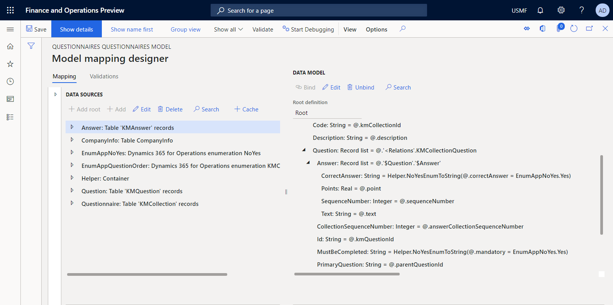

---
# required metadata

title: Quick start guide - design a new ER solution to print out a custom report
description: This topic explains how to design an Electronic reporting (ER) solution to to print out a custom report.
author: NickSelin
manager: AnnBe
ms.date: 05/07/2020
ms.topic: article
ms.prod: 
ms.service: dynamics-ax-platform
ms.technology: 

# optional metadata

ms.search.form: ERWorkspace, ERSolutionTable, ERParameters, ERDataModelDesigner, ERModelMappingTable, ERModelMappingDesigner, EROperationDesigner, ERVendorTable
# ROBOTS: 
audience: Application User, Developer, IT Pro
# ms.devlang: 
ms.reviewer: kfend
ms.search.scope: Core, Operations
# ms.tgt_pltfrm: 
ms.custom: 220314
ms.assetid: 
ms.search.region: Global
# ms.search.industry: 
ms.author: nselin
ms.search.validFrom: 2016-06-30
ms.dyn365.ops.version: Version 7.0.0

---

# Design a new ER solution to print out a custom report

[!include[banner](../includes/banner.md)]

The following steps explain how a user in the System Administrator, Electronic Reporting Developer, or Electronic Reporting Functional Consultant role can configure parameters of the ER framework, configure necessary ER configurations of a new ER solution using for accessing data of a particular business domain and generating a custom report in Microsoft office format. These steps can be performed in **USMF** company.

-   [Configure ER framework](#ConfigureFramework)
    -   [Configure ER parameters](#ConfigureParameters)
    -   [Activate an ER solution provider](#ActivateProvider)
        -   [Review ER solution providers list](#ReviewProvidersList)
        -   [Add a new ER solution provider](#ActivateProvider)
        -   [Activate an ER solution provider](#ActivateAddedProvider)
-   [Design domain specific data model](#DesingModel)
    -   [Import a new data model configuration](#ImportDataModel)
    -   [Create a new data model configuration](#DesignDataModel)
        -   [Name data model](#NameDataModel)
        -   [Start entry of new data model fields](#StartFieldsEntry)
        -   [Continue new fields entry](#ContinueFieldsEntry)
        -   [Finalize new fields entry](#FinalizeFieldsEntry)
        -   [Complete the data model design](#CompleteDataModel)
-   [Design a model mapping for configured data model](#DesingMapping)
    -   [Import a new model mapping configuration](#ImportModelMapping)
    -   [Create a new model mapping configuration](#CreateModelMapping)
        -   [Design a new model mapping component](#DesignMappingComponent)
        -   [Add data sources to access application tables](#AddMmDataSource1)
        -   [Add data sources to access application enumerations](#AddMmDataSource2)
        -   [Add ER labels to generate a report in a specified language](#AddMmLabels)
        -   [Add a data source to transform results of comparison of enumeration values to text value](#AddMmDataSource3)
        -   [Start binding data sources with data model fields](#AddMmBindings1)
        -   [Continue binding data sources with data model fields](#AddMmBindings2)
        -   [Finalize data model fields binding](#AddMmBindings3)
        -   [Complete the model mapping design](#CompleteModelMapping)
-   [Design a template for a custom report](#DesignReportTemplate)
-   [Design a format](#DesignFormat)
    -   [Import a designed format configuration](#FormatImport)
    -   [Create a new format configuration](#FormatCreate)
        -   [Import a report template](#ImportReportTemplate)
        -   [Configure a format](#ConfigureFormat)
        -   [Define data binding for a report title](#DefineFormatBindings)
        -   [Review model data source](#ReviewModelDataSource)
        -   [Bind format elements to data source fields](#BindFormatElements)
    -   [Run a designed format from ER](#RunFormatFromER)
-   [Tune a designed format](#TuneFormat)
    -   [Modify a format to change the name of a generated document](#ModifyToChangeName)
    -   [Modify a format to change the order of questions](#ModifyToOrder)
    -   [Run a modified format from ER](#RunFormatFromER2)
    -   [Complete the format design](#CompleteFormat)
-   [Develop application artefacts to call the designed report](#DevelopCustomCode)
    -   [Modify source code](#ModifySourceCode)
        -   [Add data contract class](#DataContractClass)
        -   [Add UI builder class](#UIBuilderClass)
        -   [Add data provider class](#DataProviderClass)
        -   [Add labels file](#LabelsFile)
        -   [Add report service class](#ServiceClass)
        -   [Add report controller class](#ControllerClass)
        -   [Add menu item](#MenuItem)
        -   [Add an item to menu](#Menu)
        -   [Build VS project](#BuildVSProject)
    -   [Run format from application](#RunFormatFromApp)
-   [Tune a designed ER solution](#TuneSolution)
    -   [Modify a model mapping](#ModifyModelMapping)
        -   [Add data sources to access data contract object](#AddDataSource1)
        -   [Add a data source to access ER format mapping records](#AddDataSource2)
        -   [Add a data source to access format mapping record of running ER format](#AddDataSource3)
        -   [Populate the name of running ER format to data model](#AddBinding)
        -   [Complete the model mapping design](#CompleteModelMapping2)
    -   [Modify a format](#ModifyFormat)
        -   [Add a new format element](#AddFormatElement)
        -   [Bind the added format element](#BindAddedFormatElement)
        -   [Complete the format design](#CompleteFormat2)
    -   [Run format from application](#RunFormatFromApp2)
    -   [Run format from ER](#RunFormatFromER3)
    -   [Configure format destination for screen preview](#ConfigureDestination)
    -   [Run format from application to preview it as PDF document](#RunFormatFromApp3)
-   [Additional resources](#References)

In this example, you will create a new ER solution for the [Questionnaire](https://docs.microsoft.com/dynamics365/human-resources/hr-learning-questionnaires) module. This new ER solution will allow you to design a report using an Excel worksheet as a template and generate the Questionnaire report in Excel or PDF format in addition to the existing SSRS report. You can modify this new report later on upon request with no coding.

To run the existing report, you must open the **Modules \> Questionnaire \> Design** page and select the **Questionnaire report** menu item.


The generated for **SBCCrsExam** questionnaire SSRS report is presented below.


## <a name="ConfigureFramework">Configure ER framework</a>

As the Electronic Reporting Developer, you must configure the minimal set of ER parameters to start using the ER framework for designing your new ER solution.

### <a name="ConfigureParameters">Configure ER parameters</a>

1.  Open the **Electronic reporting** workspace page.
2.  Select **Electronic reporting parameters**.
3.  On the **General** tab of the **Electronic reporting parameters** page, set the **Enable design mode** parameter to **Yes.**
4.  On the **Attachments** tab of the **Electronic reporting parameters** page, set the following parameters:
    1.  Set the **Configurations** parameter to **File** for the **USMF** company.
    2.  Set **Job archive**, **Temporary**, **Baseline**, and **Others** parameters to **File**.

To learn more about ER parameters, review the [Configure the ER framework](electronic-reporting-er-configure-parameters.md) page.

### <a name="ActivateProvider">Activate an ER solution provider</a>

Every added ER configuration is marked as owned by an ER solution provider. The activated in the ER workspace ER solution provider is used for that. Therefore, you must activate an ER solution provider in the ER workspace before you start adding or editing any ER configuration.

> [!NOTE]
> The only owner of an ER configuration can edit it. Therefore, the appropriate ER solution provider must be activated in the ER workspace for editing an ER configuration.

#### <a name="ReviewProvidersList">Review ER solution providers list</a>

1.  Go to the **Navigation pane** in the upper left corner.
2.  Select **Organization administration** module.
3.  Go to **Workspaces \> Electronic reporting**.
4.  Go to **Related links \> Configuration providers**.

A provider record has a unique name and URL. Review the content of this page and skip the remaining steps of the [Add a new ER solution provider](#ActivateProvider) section  if a record for Litware, Inc. ([https://www.litware.com](https://www.litware.com/)) already exists.

#### <a name="ActivateProvider">Add a new ER solution provider</a>

1.  Select **New**.
2.  In the **Name** field, type **Litware, Inc.**.
3.  In the **Internet address** field, type <https://www.litware.com>.
4.  Select **Save**.

#### <a name="ActivateAddedProvider">Activate an ER solution provider</a>

1.  Go to **Workspaces \> Electronic reporting**.
2.  Select the Litware, Inc. provider.
3.  Select **Set active**.

To learn more about ER solution provider, review the [Create configuration providers and mark them as active](tasks/er-configuration-provider-mark-it-active-2016-11.md) page.

## <a name="DesingModel">Design domain specific data model</a>

You must create a new ER configuration that contains a [data model](general-electronic-reporting.md#data-model-and-model-mapping-components) component for the Questionnaire business domain. This data model will later be used as a data source when you design an ER format to generate the Questionnaire report.

Completing the steps of the [Import a new data model configuration](#ImportDataModel) section, you can import the required data model from the provided XML file. Alternatively, you can complete the steps of the [Create a new data model configuration](#DesignDataModel) section to learn how this data model can be designed from scratch.

### <a name="ImportDataModel">Import a new data model configuration</a>

1.  Save locally the [Questionnaires model.version.1.xml](https://go.microsoft.com/fwlink/?linkid=851448) file.
2.  Go to **Organization administration \> Workspaces \> Electronic reporting**.
3.  Select **Reporting configurations**.
4.  On the Action pane, select **Exchange**.
5.  Select **Load from XML file**.
6.  Select **Browse** and point to the **Questionnaires model.version.1.xml** file.
7.  Select **OK** to complete the configuration import.

To continue, skip steps of the [Create a new data model configuration](#DesignDataModel) section.

### <a name="DesignDataModel">Create a new data model configuration</a>

1.  Go to **Organization administration \> Workspaces \> Electronic reporting**.
2.  Select **Reporting configurations**.
3.  Select **Create configuration** to open the drop dialog.
4.  In the **Name** field, type **Questionnaire model**.
5.  Select **Create configuration** to complete the configuration creation process.

#### <a name="NameDataModel">Name data model</a>

1.  For the selected in the configurations tree **Questionnaire model**, select **Designer**.
2.  On the **General** Fast tab of the data model designer, in the **Name** field, type <a name="DataModeName">**Questionnaires**</a>.

#### <a name="StartFieldsEntry">Start entry of new data model fields</a>

1.  Continue configuring a data model on the data model designer page.
2.  Select **New** to open the drop dialog of a new data model node.
    1.  Select **Model root** type of an added node.
    2.  In the **Name** field, type <a name="RootDefinitionName">**Root**</a>.
    3.  Select **Add** to complete a new entry. This root descriptor will be used to provide data for Questionnaire report. A single data model can have multiple descriptors each of which can be specified for a single ER format as the identification of data that is needed for report generation.
3.  Select **New** to open the drop dialog of a new data model node.
    1.  Select **Child of an active node** type of an added node.
    2.  In the **Name** field, type **CompanyName**.
    3.  In the **Item type** field, select **String**.
    4.  Select **Add** to complete a new field entry. This field is needed to pass the name of the current company to an ER report consuming this data model as a data source.
4.  Select **New** to open the drop dialog of a new data model node.
    1.  Select **Child of an active node** type of an added node.
    2.  In the **Name** field, type **Questionnaire**.
    3.  In the **Item type** field, select **Record list**.
    4.  Select **Add** to complete a new field entry. This field is used to pass the list of questionnaires to an ER report consuming this data model as a data source.
5.  Select **Questionnaire**.

Currently, the editable data model contains the following fields:

<table>
<tr>
<td colspan="5"><strong>Field path</strong></td>
<td><strong>Data type</strong></td>
<td><strong>Field designation \ Returned value</strong></td>
</tr>
<tr>
<td>Root</td>
<td colspan="5"/>
<td>Reference point to request questionnaires data</td>
</tr>
<tr>
<td></td>
<td>CompanyName</td>
<td colspan="3"/>
<td>String</td><td>Name of the current company</td>
</tr>
<tr>
<td></td>
<td>Questionnaire</td>
<td colspan="3"/>
<td>Record list</td><td>List of questionnaires</td></tr>
</table>

The current state of the configured data model is presented on the screenshot below.


#### <a name="ContinueFieldsEntry">Continue new fields entry</a>

Using this technique, compete the entry of required fields of the editable data model to finally have the following data model structure:

<table>
<tr>
<td><strong>Field path</strong></td>
<td><strong>Data type</strong></td>
<td><strong>Field designation \ Returned value</strong></td>
</tr>
<tr>
<td>Root</td>
<td></td>
<td>Reference point to request questionnaires data</td>
</tr>
<tr>
<td>* CompanyName</td>
<td>String</td>
<td>Name of the current company</td>
</tr>
<tr>
<td>* ExecutionContext</td>
<td>Record</td>
<td>Format execution details</td>
</tr>
<tr>
<td>** FormatName</td>
<td>String</td>
<td>Name of the running ER format</td>
</tr>
<tr>
<td>* Questionnaire</td>
<td>Record list</td>
<td>List of questionnaires</td>
</tr>
<tr>
<td>** Active</td>
<td>String</td>
<td>Status of the current questionnaire</td>
</tr>
<tr>
<td>** Code</td>
<td>String</td>
<td>Code of the current questionnaire</td>
</tr>
<tr>
<td>** Description</td>
<td>String</td>
<td>Description of the current questionnaire</td>
</tr>
<tr>
<td>** QuestionnaireType</td>
<td>String</td>
<td>Type of the current questionnaire</td>
</tr>
<tr>
<td>** QuestionOrder</td>
<td>String</td>
<td>Number order of the current questionnaire</td>
</tr>
<tr>
<td>** ResultsGroup</td>
<td>Record</td>
<td>Result parameters of the current questionnaire</td>
</tr>
<tr>
<td>*** Code</td>
<td>String</td>
<td>Identification code of the current result group</td>
</tr>
<tr>
<td>*** Description</td>
<td>String</td>
<td>Description of the current result group</td>
</tr>
<tr>
<td>*** MaxNumberOfPoints</td>
<td>Real</td>
<td>Maximum number of points that could be earned</td>
</tr>
<tr>
<td>** Question</td>
<td>Record list</td>
<td>List of questions of the current questionnaire</td>
</tr>
<tr>
<td>*** CollectionSequenceNumber</td>
<td>Integer</td>
<td>Sequence number of the current answers collection</td>
</tr>
<tr>
<td>*** Id</td>
<td>String</td>
<td>Identification code of the current question</td>
</tr>
<tr>
<td>*** MustBeCompleted</td>
<td>String</td>
<td>Flag whether this question must be answered</td>
</tr>
<tr>
<td>*** PrimaryQuestion</td>
<td>String</td>
<td>Flag whether this question is primary</td>
</tr>
<tr>
<td>*** SequenceNumber</td>
<td>Integer</td>
<td>Sequence number of the current question</td>
</tr>
<tr>
<td>*** Text</td>
<td>String</td>
<td>Text of the current question</td>
</tr>
<tr>
<td>*** Answer</td>
<td>Record list</td>
<td>List of answers for the current question</td>
</tr>
<tr>
<td>**** CorrectAnswer</td>
<td>String</td>
<td>Flag whether this answer is correct</td>
</tr>
<tr>
<td>**** Points</td>
<td>Real</td>
<td>Points to earn when this answer is chosen</td>
</tr>
<tr>
<td>**** SequenceNumber</td>
<td>Integer</td>
<td>Sequence number of the current answer</td>
</tr>
<tr>
<td>**** Text</td>
<td>String</td>
<td>Text of the current answer</td>
</tr>
</table>

The final state of the editable data model is presented on the screenshot below.


#### <a name="FinalizeFieldsEntry">Finalize new fields entry</a>

1.  Save changes.
2.  Leave the ER data model designer.

#### <a name="CompleteDataModel">Complete the data model design</a>

1.  Go to **Modules \> Organization administration \> Electronic reporting \> Configurations**.
2.  In the configurations tree, select **Questionnaire model**.
3.  In the **Versions** Fast tab, select the configuration version in the **Draft** status.
4.  Select **Change status**.
5.  Select **Complete**.

The status of the version 1 of this configuration has been changed from **Draft** to **Completed**. The version 1 can’t be changed any more. It contains the configured data model and can be used as the base of other ER configurations. The version 2 of this configuration has been created in the **Draft** status. You can edit it to bring in necessary adjustments of the Questionnaire data model.


To learn more about ER configurations versioning, review the [Electronic reporting (ER) overview](general-electronic-reporting.md#component-versioning) page.

> [!NOTE]
> Note that the configured data model is your abstract representation of the Questionnaire domain and contains no relations to the Finance specific artefacts.

## <a name="DesingMapping">Design a model mapping for configured data model</a>

As the Electronic Reporting Developer, you must create a new ER configuration that contains a [model mapping](general-electronic-reporting.md#data-model-and-model-mapping-components) component for the Questionnaire data model. This component implements the configured data model for Finance and, therefore, it is
Finance specific. You must configure the model mapping component to specify what application objects must be used to fill in the configured data model by application data at runtime. For doing this, you must be aware of the implementation details of the data structure of the Questionnaire domain in Finance.

Completing the steps of the [Import a new model mapping configuration](#ImportModelMapping) section, you can import the required model mapping configuration from the provided XML file. Alternatively, you can complete the steps of the [Create a new model mapping configuration](#CreateModelMapping) section to learn how this model mapping can be designed from scratch.

### <a name="ImportModelMapping">Import a new model mapping configuration</a>

1.  Save locally the [Questionnaires mapping.version.1.1.xml](https://go.microsoft.com/fwlink/?linkid=851448) file.
2.  Go to **Organization administration \> Workspaces \> Electronic reporting**.
3.  Select **Reporting configurations**.
4.  On the Action pane, select **Exchange**.
5.  Select **Load from XML file**.
6.  Select **Browse** and point to the **Questionnaires mapping.version.1.1.xml** file.
7.  Select **OK** to complete the configuration import.

To continue, skip steps of the [Create a new model mapping configuration](#CreateModelMapping) section.

### <a name="CreateModelMapping">Create a new model mapping configuration</a>

1.  Go to **Modules \> Organization administration \> Electronic reporting \> Configurations**.
2.  In the configurations tree, select **Questionnaire model**.
3.  Select **Create configuration** to open the drop dialog.
    1.  In the **New** field, select **Model Mapping based on data model Questionnaires**.
    2.  In the **Name** field, type **Questionnaire mapping**.
    3.  In the **Data model definition** field, select the **Root** definition.
4.  Select **Create configuration** to complete the configuration creation process.

#### <a name="DesignMappingComponent">Design a new model mapping component</a>

1.  In the configurations tree, select the **Questionnaire mapping** configuration.
2.  Select **Designer** to open the list of mappings.
3.  Select the **Questionnaires mapping** that has been automatically added for the **Root** definition
4.  Select **Designer** to start configuring a selected mapping.

Note that a new mapping has been automatically added for the **Root** definition. This mapping has been created with the **To model** direction meaning that this mapping can be used to fill in a data model by required data.

#### <a name="AddMmDataSource1">Add data sources to access application tables</a>

You must configure data sources to access application tables containing details of questionnaires.

1.  In the **Data source types** pane, select **Dynamics 365 for Operations \\ Table records**.
    1.  In the **Data sources** pane, select **Add root**.
    2.  In the **Name** field, type **Questionnaire**.
    3.  In the **Table** field, type **KMCollection**.
    4.  Set **Ask for query** field to **Yes**. This will allow you to specify
[filtering](https://docs.microsoft.com/dynamics365/fin-ops-core/fin-ops/get-started/advanced-filtering-query-options)
options for this table on the system query dialog at runtime.
    5.  Select **OK** to complete a new data source entry for accessing the **KMCollection** table every record of which represents a single questionnaire.
2.  In the **Data source types** pane, select **Dynamics 365 for Operations \\ Table records**.
    1.  In the **Data sources** pane, select **Add root**.
    2.  In the **Name** field, type **Question**.
    3.  In the **Table** field, type **KMQuestion**.
    4.  Select **OK** to complete a new data source entry for accessing the **KMQuestion** table every record of which represents a single
        questionnaire’s question.
3.  In the **Data source types** pane, select **Dynamics 365 for Operations \\ Table records**.
    1.  In the **Data sources** pane, select **Add root**.
    2.  In the **Name** field, type **Answer**.
    3.  In the **Table** field, type **KMAnswer**.
    4.  Select **OK** to complete a new data source entry for accessing the **KMAnswer** table every record of which represents a single answer to a questionnaire’s question.
4.  In the **Data source types** pane, select **Functions \\ Calculated field**.
    1.  In the **Data sources** pane, select **Questionnaire**.
    2.  Select **Add**.
    3.  In the **Name** field, type **\$ResultGroup**.
    4.  Select **Edit formula**.
    5.  In the **Formula** field, type `FIRSTORNULL(@.'<Relations'.KMQuestionResultGroup)` to use the [path](er-formula-language.md#paths) to the one-to-many relation between **KMCollection** and **KMQuestionResultGroup** tables.
    6.  Select **Save** and close the [ER formula editor](general-electronic-reporting-formula-designer.md) page.
    7.  Select **OK** to complete the entry of a new calculated field for accessing a record of the **KMQuestionResultGroup** table from every record of the parent **KMCollection** table.
5.  In the **Data source types** pane, select **Functions \\ Calculated field**.
    1.  In the **Data sources** pane, select **Questionnaire**.
    2.  Expand **\<Relations** containing one-to-many relations of the **KMCollection** table.
    3.  Select the related **KMCollectionQuestion** table.
    4.  Select **Add**.
    5.  In the **Name** field, type **\$Question**.
    6.  Select **Edit formula**.
    7.  In the **Formula** field, type `FIRSTORNULL (FILTER(Question, Question.kmQuestionId = @.kmQuestionId))` to return the appropriate question records from the **KMQuestion** table.
    8.  Select **Save** and close the page.
    9.  Select **OK** to complete the entry of a new calculated field for accessing question records of the **KMQuestion** table from every record of the parent **KMCollectionQuestion** table.
6.  In the **Data source types** pane, select **Functions \\ Calculated field**.
    1.  In the **Data sources** pane, select **Questionnaire.\<Relations.KMCollectionQuestion.\$Question**.
    2.  Select **Add**.
    3.  In the **Name** field, type **\$Answer**.
    4.  Select **Edit formula**.
    5.  In the **Formula** field, type `FILTER (Answer, Answer.kmAnswerCollectionId = @.kmAnswerCollectionId)` to return the
        appropriate answer records from the **KMAnswer** table.
    6.  Select **Save** and close the page.
    7.  Select **OK** to complete the entry of a new calculated field for accessing answer records of the **KMAnswer** table from every record of the parent **KMQuestion** table.
7.  In the **Data source types** pane, select **Dynamics 365 for Operations \\ Table**.
    1.  In the **Data sources** pane, select **Add root**.
    2.  In the **Name** field, type **CompanyInfo**.
    3.  In the **Table** field, type **CompanyInfo**.
    4.  Select **OK** to complete a new data source entry for accessing methods of the **CompanyInfo** table. Note that the **find()** method of this table returns a record representing a company of the current Finance instance in the context of which this mapping is called.

#### <a name="AddMmDataSource2">Add data sources to access application enumerations</a>

You must configure data sources to access application enumerations to compare their values with values of application table fields of the **Enumeration** type. You must use the result of such comparison to fill in appropriate fields of the data model accordingly.

1.  In the **Data source types** pane, select **Dynamics 365 for Operations \\ Enumeration**.
    1.  In the **Data sources** pane, select **Add root**.
    2.  In the **Name** field, type **EnumAppNoYes**.
    3.  In the **Enumeration** field, type **NoYes**.
    4.  Select **OK** to complete a new data source entry for accessing values of the **EnumAppNoYes** enumeration.
2.  In the **Data source types** pane, select **Dynamics 365 for Operations \\ Enumeration**.
    1.  In the **Data sources** pane, select **Add root**.
    2.  In the **Name** field, type **EnumAppQuestionOrder**.
    3.  In the **Enumeration** field, type **KMCollectionQuestionMode**.
    4.  Select **OK** to complete a new data source entry for accessing values of the **KMCollectionQuestionMode** enumeration.

#### <a name="AddMmLabels">Add ER labels to generate a report in a specified language</a>

You can add ER labels to configure some of your data sources as returning values depending on the language that is defined in the context of this model mapping’s call.

1.  In the **Data sources** pane, select **Answer**.
2.  In the **Data sources** pane, select **Edit**.
3.  Activate the **Label** field.
4.  Select **Translate**.
    1.  In the **Label Id** field, type **PositiveAnswer**.
    2.  In the **Text in default language** field, type **Yes**.
    3.  Select **Translate**.
    4.  In the **Label Id** field, type **NegativeAnswer**.
    5.  In the **Text in default language** field, type **No**.
    6.  Select **Translate**.
5.  Close the **Text translation** pane.
6.  Select **Cancel**.


You have entered ER labels for the only default language. Review the [Design multilingual reports](er-design-multilingual-reports.md) page to learn how ER labels can be translated into other languages.

#### <a name="AddMmDataSource3">Add a data source to transform results of comparison of enumeration values to text value</a>

As you need to transform results of comparison of enumeration values to text value several times for difference sources, better to configure this logic as a single data source. But in this case to make it re-usable, you must configure this data source as the parametrized one. See [Support parameterized calls of ER data sources of the Calculated field type](er-calculated-field-type.md) for more
details.

1.  In the **Data source types** pane, select **General \\ Empty container**.
    1.  In the **Data sources** pane, select **Add root**.
    2.  In the **Name** field, type **Helper**.
    3.  Select **OK** to complete the entry of a new container data source.
2.  In the **Data source types** pane, select **Functions \\ Calculated field**.
    1.  In the **Data sources** pane, select **Helper**.
    2.  Select **Add**.
    3.  In the **Name** field, type **NoYesEnumToString**.
    4.  Select **Edit formula**.
    5.  Select **Parameters**.
        1.  Select **New**.
        2.  In the **Name** field, type **Argument**.
        3.  In the **Type** field, select **Boolean** data type.
        4.  Select **OK** to complete the specification of parameters for the configured expression.
    6.  In the **Formula** field, type `IF (Argument = true, @"GER_LABEL:PositiveAnswer", @"GER_LABEL:NegativeAnswer")` to return
        a text of the appropriate ER label depending on language of the execution context and value of the specified parameter.
    7.  Select **Save** and close the page.
    8.  Select **OK** to complete the entry of a new data source.


#### <a name="AddMmBindings1">Start binding data sources with data model fields</a>

You must bind the configured data sources with the fields of the data model specifying how the data model is filled in at runtime by application data.

1.  In the **Data model** pane, select **CompanyName**.
2.  In the **Data sources** pane, expand **CompanyInfo**.
    1.  Expand **CompanyInfo.find()** node representing the **find()** method of the **CompanyInfo** table.
    2.  Select **CompanyInfo.find().Name**.
    3.  Select **Bind** to populate the name of a company in the context of which the configured model mapping is called at runtime.
3.  In the **Data model** pane, select **Questionnaire**.
4.  In the **Data sources** pane, select **Questionnaire**.
    1.  Select **Bind** to populate questionnaire records.
5.  In the **Data model** pane, expand **Questionnaire**.
    1.  In the **Data model** pane, select **Active**.
    2.  In the **Data model** pane, select **Edit**.
    3.  In the **Formula** field, type `Helper.NoYesEnumToString (@.Active = EnumAppNoYes.Yes)` to populate the textual and language dependent result of comparison of enumeration values.

Currently, the editable model mapping contains the following bindings:

<table>
<tr>
<td><strong>Field path</strong></td>
<td><strong>Data type</strong></td>
<td><strong>Action</strong></td>
<td><strong>Binding expression</strong></td>
</tr>
<tr>
<td>CompanyName</td>
<td>String</td>
<td>Bind</td>
<td>CompanyInfo.'find()'.Name</td>
</tr>
<tr>
<td>Questionnaire</td>
<td>Record list</td>
<td>Bind</td>
<td>Questionnaire</td>
</tr>
<tr>
<td>* Active</td>
<td>String</td>
<td>Edit</td>
<td>Helper.NoYesEnumToString(@.active = EnumAppNoYes.Yes)</td>
</tr>
</table>

The current state of the editable model mapping is presented on the screenshot below.


#### <a name="AddMmBindings2">Continue binding data sources with data model fields</a>

Using this technique, compete the binding data sources to data model fields to finally have the following setting:

<table>
<tr>
<td><strong>Field path</strong></td>
<td><strong>Data type</strong></td>
<td><strong>Action</strong></td>
<td><strong>Binding expression</strong></td>
</tr>
<tr>
<td>CompanyName</td>
<td>String</td>
<td>Bind</td>
<td>CompanyInfo.'find()'.Name</td>
</tr>
<tr>
<td>Questionnaire</td>
<td>Record list</td>
<td>Bind</td>
<td>Questionnaire</td>
</tr>
<tr>
<td>* Active</td>
<td>String</td>
<td>Edit</td>
<td>Helper.NoYesEnumToString(@.active = EnumAppNoYes.Yes)</td>
</tr>
<tr>
<td>* Code</td>
<td>String</td>
<td>Bind</td>
<td>@.kmCollectionId</td>
</tr>
<tr>
<td>* Description</td>
<td>String</td>
<td>Bind</td>
<td>@.Description</td>
</tr>
<tr>
<td>* QuestionnaireType</td>
<td>String</td>
<td>Bind</td>
<td>@.'&gt;Relations'.kmCollectionTypeId.Description</td>
</tr>
<tr>
<td>* QuestionOrder</td>
<td>String</td>
<td>Edit</td>
<td>CASE (@.questionMode, <br>
EnumAppQuestionOrder.Conditional, "Conditional", <br>
EnumAppQuestionOrder.Random, "Random (percentage in questionnaire)", <br>
EnumAppQuestionOrder.RandomGroup, "Random (percentage in result groups)", <br>
EnumAppQuestionOrder.Sequence, "Sequential", <br>
"")</td>
</tr>
<tr>
<td>* ResultsGroup</td>
<td>Record</td>
<td></td>
<td></td>
</tr>
<tr>
<td>** Code</td>
<td>String</td>
<td>Bind</td>
<td>@.'$ResultGroup'.kmQuestionResultGroupId</td>
</tr>
<tr>
<td>** Description</td>
<td>String</td>
<td>Bind</td>
<td>@.'$ResultGroup'.description</td>
</tr>
<tr>
<td>** MaxNumberOfPoints</td>
<td>Real</td>
<td>Bind</td>
<td>@.'$ResultGroup'.maxPoint</td>
</tr>
<tr>
<td>* Question</td>
<td>Record list</td>
<td>Bind</td>
<td>@.'&lt;Relations'.KMCollectionQuestion</td>
</tr>
<tr>
<td>** CollectionSequenceNumber</td>
<td>Integer</td>
<td>Bind</td>
<td>@.answerCollectionSequenceNumber</td>
</tr>
<tr>
<td>** Id</td>
<td>String</td>
<td>Bind</td>
<td>@.kmQuestionId</td>
</tr>
<tr>
<td>** MustBeCompleted</td>
<td>String</td>
<td>Edit</td>
<td>Helper.NoYesEnumToString(@.mandatory = EnumAppNoYes.Yes)</td>
</tr>
<tr>
<td>** PrimaryQuestion</td>
<td>String</td>
<td>Bind</td>
<td>@.parentQuestionId</td>
</tr>
<tr>
<td>** SequenceNumber</td>
<td>Integer</td>
<td>Bind</td>
<td>@.SequenceNumber</td>
</tr>
<tr>
<td>** Text</td>
<td>String</td>
<td>Bind</td>
<td>@.'$Question'.text</td>
</tr>
<tr>
<td>** Answer</td>
<td>Record list</td>
<td>Bind</td>
<td>@.'$Question'.'$Answer'</td>
</tr>
<tr>
<td>*** CorrectAnswer</td>
<td>String</td>
<td>Edit</td>
<td>Helper.NoYesEnumToString(@.correctAnswer = EnumAppNoYes.Yes)</td>
</tr>
<tr>
<td>*** Points</td>
<td>Real</td>
<td>Bind</td>
<td>@.point</td>
</tr>
<tr>
<td>*** SequenceNumber</td>
<td>Integer</td>
<td>Bind</td>
<td>@.sequenceNumber</td>
</tr>
<tr>
<td>*** Text</td>
<td>String</td>
<td>Bind</td>
<td>@.text</td>
</tr>
</table>

The final state of the editable model mapping is presented on the screenshot below.



#### <a name="AddMmBindings3">Finalize data model fields binding</a>

1.  Save changes.
2.  Leave the ER model mapping designer.

#### <a name="CompleteModelMapping">Complete the model mapping design</a>

1.  Go to **Modules \> Organization administration \> Electronic reporting \> Configurations**.
2.  In the configurations tree, select **Questionnaire mapping**.
3.  In the **Versions** Fast tab, select the configuration version in the **Draft** status.
4.  Select **Change status**.
5.  Select **Complete**.

The status of the version 1.1 of this configuration has been changed from **Draft** to **Completed**. The version 1.1 can’t be changed any more. It contains the configured model mapping and can be used as the base of other ER configurations. The version 1.2 of this configuration has been created in the **Draft** status. You can edit it to bring in necessary adjustments of the **Questionnaire mapping**.

> [!Note]
> Note that the configured model mapping is your Finance specific implementation of the abstract data model that represents the Questionnaire domain.


## <a name="DesignReportTemplate">Design a template for a custom report</a>

The ER framework generates reports in Microsoft Office formats (Excel workbooks or Word documents) by using predefined templates. A template is populated with required data in accordance to configured dataflow while required report is generated. Therefore, you must first design a template for your custom report. This template must be designed as an Excel workbook the structure of which
represents the layout of a custom report. You must name every Excel item that you plan to fill in by required data.

1.  Download and save locally the [Questionnaires report template.xslx](https://go.microsoft.com/fwlink/?linkid=851448) file.
2.  Open the downloaded file in Excel desktop application.
3.  Review the structure of the opened workbook.

The worksheet of the downloaded template has been designed to print out specified questionnaires presenting a questionnaire's questions with appropriate answers.


Excel names have been added to populate questionnaire details.


Report labels have been added as fixed text in English language. You can replace them by new Excel names to fill them in by language dependent text using ER format [labels](#AddMmLabels) as you did for language dependent expressions in the configured model mapping. In this case, ER labels must be added in the editable ER format.

Custom report header has been specified to allow Excel do paging.


## <a name="DesignFormat">Design a format</a>

As the Electronic Reporting Functional Consultant, you must create a new ER configuration containing a [format](general-electronic-reporting.md#FormatComponentOutbound) component. You must configure the format component to specify how a report template is filled in by required data at runtime.

Completing the steps of the [Import a designed format configuration](#FormatImport) section, you can import the required format from the provided XML file. Alternatively, you can complete the steps of the [Create a new format configuration](#FormatCreate) section to learn how this format can be designed from scratch.

### <a name="FormatImport">Import a designed format configuration</a>

1.  Save locally the [Questionnaires format.version.1.1.xml](https://go.microsoft.com/fwlink/?linkid=851448) file.
2.  Go to **Organization administration \> Workspaces \> Electronic reporting**.
3.  Select **Reporting configurations**.
4.  On the Action pane, select **Exchange**.
5.  Select **Load from XML file**.
6.  Select **Browse** and point to the **Questionnaires format.version.1.1.xml** file.
7.  Select **OK** to complete the configuration import.

To continue, skip steps of the [Create a new format configuration](#FormatCreate) section.

### <a name="FormatCreate">Create a new format configuration</a>
 
1.  Go to **Modules \> Organization administration \> Electronic reporting \> Configurations**.
2.  In the configurations tree, select **Questionnaire model**.
3.  Select **Create configuration** to open the drop dialog.
    1.  In the **New** field, select **Format based on data model Questionnaires**.
    2.  In the **Name** field, type **Questionnaire report**.
    3.  In the **Data model version** field, select **1**.
    > [!Note]
    >
    > If you selected a particular version of the base data model, the structure of the corresponding version of this data model will be offered to you in the created format as the structure of the **Model** data source.
    >
    > You can keep this field blank. In this case the structure of the **Draft** version of this data model will be offered to you in the created format as the structure of the **Model** data source. It will allow you to adjust your model and immediately see these adjustments in your format. This might improve the efficiency of an ER solution design when you configure your data model, model mapping and format simultaneously.
    >
    > You can either select a particular version of the base data model and switch to the usage of the **Draft** version later when you start editing a format.

    4.  In the **Data model definition** field, select the **Root** definition.
4.  Select **Create configuration** to complete the configuration creation process.

#### <a name="ImportReportTemplate">Import a report template</a>

1.  In the configurations tree, select the **Questionnaire report** configuration.
2.  Select **Designer** to start configuring a custom format.
3.  On the Action pane, select **Import**.
    1.  Select **Import from Excel**.
    2.  On the dialog page, select **Add template**.
    3.  Point to the locally saved **Questionnaires report template.xslx** file.
    4.  Select **Open**.
    5.  Select **OK** to confirm a template import.


Note that the **Excel\\File** format element has been automatically added to the editable format as a root one. In addition to that, either **Excel\\Range** or **Excel\\Cell** format element has been automatically added for every recognized Excel name of the imported template. **Excel\\Header** format with the nested **String** element has been automatically added to reflect the header settings
of the imported template.


#### <a name="ConfigureFormat">Configure a format</a>

1.  In the format tree, select the **Excel** root element.
2.  Select the **Format** tab.
3.  In the **Name** field, type <a name="AddFormatRootElement">**Report**</a>.
4.  In the **Language preference** field, select **User preference** to run the report in user preferred language.
5.  In the **Culture preference** field, select **User preference** to run the report in user preferred culture.
    
    > Review the [Design multilingual reports](er-design-multilingual-reports.md) page to learn how language and culture context can be specified for an ER process.
    
    

6.  In the format tree, expand the root node.
7.  Select **ResultsGroup**.
8.  In the **Replication direction** field, select **No replication** as you do not expect to have multiple result groups for a single questionnaire.
9.  Select **Save**.
    
    

#### <a name="DefineFormatBindings">Define data binding for a report title</a>

You must specify a data binding for a format element using to populate to a generated report a report title.

1.  In the Operation designer, select the **Mapping** tab.
2.  Select **Report\\ReportTitle** element.
3.  Select **Edit formula**.
4.  Select **Translate** to open the **Text translation** pane.
    1.  In the **Label Id** field, type **ReportTitle**.
    2.  In the **Text in default language** field, type **Questionnaires report**.
    3.  Select **Translate**.
    4.  Select **Save**.
5.  Select **Translate** to close the **Text translation** pane.
6.  Close the formula editor page.


You can use this technique to make language dependent all other labels of the current template. Review the [Design multilingual
reports](er-design-multilingual-reports.md) page to learn how the added labels of a single ER configuration can be translated to all supported languages.

#### <a name="ReviewModelDataSource">Review model data source</a>

1.  On the **Mapping** tab, select <a name="ModelDSName">**model**</a> data source representing the base data model of this ER format.
2.  Select **Edit**.

Note that this data source represents the version 1 of the **Questionnaires** data model residing in the **Questionnaires model** ER configuration.


#### <a name="BindFormatElements">Bind format elements to data source fields</a>

To specify how a template is filled in at runtime, you must bind every format element that is associated with an appropriate Excel name to a single field of the data source of this format.

1.  In the format tree, select **Report\\CompanyName** format element.
2.  On the **Mapping** tab, select **model.CompanyName** data source field of the **String** type.
3.  Select **Bind**. to populate a company name to a template.
4.  In the format tree, select **Report\\Questionnaire** element.
5.  On the **Mapping** tab, select **model.Questionnaire** data source field of the **Record list** type.
6.  Select **Bind**.
7.  Select **Show details** to see more details for format elements.

    > The **Questionnaire** range format element is configured as vertically replicated. When it is bound to a data source of the **Record list** type, the appropriate **Questionnaire** range of the Excel template is repeated for every record of the bound data source.

    

    > As the **Questionnaire** range of the Excel template is defined as a range embracing rows from 5 to 14, these rows are repeated for every reported questionnaire.

    

8.  Configure similar bindings for the rest of format elements as described in the table below.
9.  Select **Save**.

The content of the **Data source path** column in the table below is presented assuming that the [relative path](relative-path-data-bindings-er-models-format.md) ER feature is enabled.

| **Format element path**                                        | **Data source path**                                                  |
|----------------------------------------------------------------|-----------------------------------------------------------------------|
| Excel \\ ReportTitle                                           |`@"GER_LABEL:ReportTitle"`                                             |
| Excel \\ CompanyName                                           |`model.CompanyName`                                                    |
| Excel \\ Questionnaire                                         |`model.Questionnaire`                                                  |
| Excel \\ Questionnaire \\ Active                               |`@.Active` where \@ is `model.Questionnaire`                           |
| Excel \\ Questionnaire \\ Code                                 |`@.Code`                                                               |
| Excel \\ Questionnaire \\ Description                          |`@.Description`                                                        |
| Excel \\ Questionnaire \\ QuestionnaireType                    |`@.QuestionnaireType`                                                  |
| Excel \\ Questionnaire \\ QuestionOrder                        |`@.QuestionOrder`                                                      |
| Excel \\ Questionnaire \\ ResultsGroup \\ Code\_               |`@.ResultsGroup.Code`                                                  |
| Excel \\ Questionnaire \\ ResultsGroup \\ Description\_        |`@.ResultsGroup.Description`                                           |
| Excel \\ Questionnaire \\ ResultsGroup \\ MaxNumberOfPoints    |`@.ResultsGroup.MaxNumberOfPoint`                                      |
| Excel \\ Questionnaire \\ Question                             |`@.Question`                                                           |
| Excel \\ Questionnaire \\ Question \\ CollectionSequenceNumber |`@.CollectionSequenceNumber` where \@ is `model.Questionnaire.Question`|
| Excel \\ Questionnaire \\ Question \\ Id                       |`@.Id`                                                                 |
| Excel \\ Questionnaire \\ Question \\ MustBeCompleted          |`@.MustBeCompleted`                                                    |
| Excel \\ Questionnaire \\ Question \\ PrimaryQuestion          |`@.PrimaryQuestion`                                                    |
| Excel \\ Questionnaire \\ Question \\ SequenceNumber           |`@.SequenceNumber`                                                     |
| Excel \\ Questionnaire \\ Question \\ Text                     |`@.Text`                                                               |
| Excel \\ Questionnaire \\ Question \\ Answer                   |`@.Answer`                                                             |
| Excel \\ Questionnaire \\ Question \\ Answer \\ CorrectAnswer  |`@.CorrectAnswer` where \@ is `model.Questionnaire.Answer`             |
| Excel \\ Questionnaire \\ Question \\ Answer \\ Points         |`@.Points`                                                             |
| Excel \\ Questionnaire \\ Question \\ Answer \\ Text           |`@.Text`                                                               |

Finally, you must have the following data bindings.


> [!Important]
>
> The entire collection of specified data sources and bindings represents a format mapping of the configured format. This format mapping is called when you run the configured format for report generation.

### <a name="RunFormatFromER">Run a designed format from ER</a>

You can now run a designed format for testing purposes from the ER configurations page (from ER).

1.  Go to **Modules \> Organization administration \> Electronic reporting \> Configurations**.
2.  In the configurations tree, expand **Questionnaire model**.
3.  Select **Questionnaire report**.
4.  Select **Designer** for the format version in **Draft** status.
5.  In the Operation designer, select **Run**.
6.  In the **ER parameters** dialog, expand the **Records to include** tab.
7.  Configure the filtering option to include the only **SBCCrsExam** questionnaire.
8.  Select **OK** to confirm the filtering option.
9.  Select **OK** to run the report.
10. Review a generated report.

Review a generated report in Excel format. By [default](electronic-reporting-destinations.md#default-behavior), the report is
delivered as an Excel file that is offered for downloading by using web browser.


## <a name="TuneFormat">Tune a designed format</a>

### <a name="ModifyToChangeName">Modify a format to change the name of a generated document</a>

Note that by default a generated document is named by using alias of the current user. You can change this behavior by modifying your format to name a generated document based on your custom logic, for example, based on the current session date and time and the report’s title.

1.  In the Operation designer, select the **Report** root item.
2.  Select the **Mapping** tab.
3.  Select **Edit file name**.
4.  In the **Formula** field, type `CONCATENATE (@"GER_LABEL:ReportTitle", " - ", DATETIMEFORMAT(SESSIONNOW(), "yyyy-MM-dd hh-mm-ss"))`
5.  Select **Save** and close the formula editor page.
6.  Select **Save**.

### <a name="ModifyToOrder">Modify a format to change the order of questions</a>

Note that the questions are not properly ordered in a generated report. You can change this order by modifying your format.

1.  In the Operation designer, select the **Report** root item.
2.  Select the **Mapping** tab.
3.  In the format tree, select **Report\\Questionnaire\\Question**.
4.  Expand **Report\\Questionnaire\\Question**.

    

5.  In the **Mapping** tab, select **model.Questionnaire**.
6.  Select **Add**.
7.  Select **Functions\\Calculated field**.
8.  In the **Name** field, type **OrderedQuestions**.
9.  Select **Edit formula**.
10.  In the **Formula** field, type `ORDERBY (model.Questionnaire.Question, model.Questionnaire.Question.SequenceNumber)` to order the list of questions of the current questionnaire by the sequence order number.
11.  Select **Save** and close the formula editor page.
12.  Select **OK** to complete the entry of a new calculated field.
13.  In the **Mapping** tab, select **model.Questionnaire.OrderedQuestions**.
14.  In the format tree, **select Excel\\Questionnaire\\Question**.
15.  Select **Bind**.
16.  Confirm replacing of the current **model.Questionnaire.Questions** path to the new **model.Questionnaire.OrderedQuestions** path in all bindings of nested elements.
17. Select **Save**.

    

### <a name="RunFormatFromER2">Run a modified format from ER</a>

You can now run a modified format for testing purposes from ER framework.

1.  In the Operation designer, select **Run**.
2.  In the **ER parameters** dialog, expand the **Records to include** tab.
3.  Configure the filtering option to include the only **SBCCrsExam** questionnaire.
4.  Select **OK** to confirm the filtering option.
5.  Select **OK** to run the report.
6.  Review a generated report.

Review a generated report in Excel format.


### <a name="CompleteFormat">Complete the format design</a>

1.  Go to **Modules \> Organization administration \> Electronic reporting \> Configurations**.
2.  In the configurations tree, expand **Questionnaire model**.
3.  In the configurations tree, select **Questionnaire report**.
4.  In the **Versions** Fast tab, select the configuration version in the **Draft** status.
5.  Select **Change status**.
6.  Select **Complete**.

The status of the version 1.1 of this configuration has been changed from **Draft** to **Completed**. The version 1.1 can’t be changed any more. It contains the configured format and can be used to print out your custom report. The version 1.2 of this configuration has been created in the **Draft** status. You can edit it to bring in necessary adjustments to the format of your Questionnaire report.

Note that the configured format is your design of the Questionnaire report and contains no relations to the Finance specific artefacts.


## <a name="DevelopCustomCode">Develop application artefacts to call the designed report</a>

As the System Administrator, you must develop a new logic to call the configured ER format from the application user interface to generate your custom report. Currently, ER does not offer you a capability to configure such logic and some engineering work is needed for this.

For doing this, you must deploy a topology that supports continuous build. (For more information, see [Deploy topologies that support continuous build and test automation](https://docs.microsoft.com/dynamics365/unified-operations/dev-itpro/perf-test/continuous-build-test-automation).) You must also have access to the development environment for this topology. See [ER framework API](er-apis-app73.md) to learn more about available ER API.

### <a name="ModifySourceCode">Modify source code</a>

#### <a name="DataContractClass">Add data contract class</a>

Add to your Microsoft Visual Studio project the new **QuestionnairesErReportContract** class and write code to specify data contract
for execution of the configured ER format.

```xpp
/// <summary>
///     This class is the data contract class for the <c>QuestionnairesErReportDP</c> class.
/// </summary>
/// <remarks>
///    This is the data contract class for the Questionnaires ER report.
/// </remarks>
[
    DataContractAttribute,
    SysOperationContractProcessingAttribute(classStr(QuestionnairesErReportUIBuilder))
    ]
    public class QuestionnairesErReportContract extends ERFormatMappingRunBaseContract implements SysOperationValidatable
{
    ERFormatMappingId formatMapping;

    /// <summary>
    ///    Validates the report parameters.
    /// </summary>
    /// <returns>
    ///    true if no errors; otherwise, false.
    /// </returns>
    public boolean validate()
    {
        boolean ret = true;

        if (!formatMapping)
        {
            ret = checkFailed(strFmt("@SYS26332", new SysDictType(extendedTypeNum(ERFormatMappingId)).label()));
        }

        return ret;
    }

    [
        DataMemberAttribute('FormatMapping'),
        SysOperationLabelAttribute(literalstr("@ElectronicReporting:FormatMapping")),
        SysOperationHelpTextAttribute(literalstr("@ElectronicReporting:FormatMapping"))
    ]
    public ERFormatMappingId parmFormatMapping(ERFormatMappingId _formatMapping = formatMapping)
    {
        formatMapping = _formatMapping;
        return formatMapping;
    }

}
```

#### <a name="UIBuilderClass">Add UI builder class</a>

Add to your Microsoft Visual Studio project the new **QuestionnairesErReportUIBuilder** class and write code to generate runtime
dialog for looking up the format mapping Id of an ER format that must be executed. The provided code is written to look up the only ER formats containing a data source of the **Data model** type that refers to the [**Questionnaires**](#DataModeName) data model by using the [**Root**](#RootDefinitionName) definition.

> [!Note]
>
> You can use the alternative way of ER formats filtering by using ER integration points. For more details, see [API to show a format mapping lookup](er-apis-app10-0-11.md#api-to-show-a-format-mapping-lookup).

```xpp
/// <summary>
/// The UIBuilder class for Questionnaires ER report
/// </summary>
class QuestionnairesErReportUIBuilder extends SysOperationAutomaticUIBuilder
{
    public const str ERQuestionnairesModel = 'Questionnaires';
    public const str ERQuestionnairesDataContainer = 'Root';

    /// <summary>
    /// Action after build of the dialog UI.
    /// </summary>
    public void postBuild()
    {
        DialogField formatMapping;

        super();

        formatMapping = this.bindInfo().getDialogField(this.dataContractObject(),
            methodStr(QuestionnairesErReportContract, parmFormatMapping));

        formatMapping.registerOverrideMethod(
            methodStr(FormReferenceControl, lookupReference),
            methodStr(QuestionnairesErReportUIBuilder, formatMappingLookup),
            this);
    }

    /// <summary>
    /// Performs the lookup form for format mapping.
    /// </summary>
    /// <param name="_referenceGroupControl">
    /// The control to perform lookup form.
    /// </param>
    public void formatMappingLookup(FormReferenceControl _referenceGroupControl)
    {
        ERObjectsFactory::createFormatMappingTableLookupForControlAndModel(
            _referenceGroupControl,
            ERQuestionnairesModel,
            ERQuestionnairesDataContainer).performFormLookup();
    }

}
```

#### <a name="DataProviderClass">Add data provider class</a>

Add to your Microsoft Visual Studio project the new **QuestionnairesErReportDP** class and write code to introduce data provider for execution of the configured ER format. The provided code is written to include the only data contract to this data provider.

```xpp
/// <summary>
/// Data provider class for Questionnaires ER report.
/// </summary>
public class QuestionnairesErReportDP
{
    QuestionnairesErReportContract contract;

    public static QuestionnairesErReportDP construct()
    {
        QuestionnairesErReportDP  dataProvider;

        dataProvider = new QuestionnairesErReportDP();

        return dataProvider;
    }

}
```

#### <a name="LabelsFile">Add labels file</a>

Add to your Microsoft Visual Studio project the new **QuestionnairesErReportLabels_en-US** labels file and specify labels for new UI
resources:

-   label `@QuestionnairesReport` for a new menu item containing the EN-US text **Questionnaires report (powered by ER)**

-   label `@QuestionnairesReportBatchJobDescription` for a batch job title using if a selected ER format is scheduled for execution as a batch job.

#### <a name="ServiceClass">Add report service class</a>

Add to your Microsoft Visual Studio project the new **QuestionnairesErReportService** class and write code to call an ER format
identifying it by format mapping Id and providing data contract as a parameter.

```xpp
using Microsoft.Dynamics365.LocalizationFramework;
/// <summary>
/// The electronic reporting service class for Questionnaires ER report
/// </summary>
class QuestionnairesErReportService extends SysOperationServiceBase
{
    public const str ERModelDataSourceName = 'model';
    public const str DefaultExportedFileName = 'Questionnaires report';
    public const str ParametersDataSourceName = 'RunTimeParameters';

    /// <summary>
    /// Generates report by using Electronic reporting framework
    /// </summary>
    /// <param name = "_contract">The Questionnaires report contract</param>
    public void generateReportByGER(QuestionnairesErReportContract _contract)
    {
        ERFormatMappingId formatMappingId;
        QuestionnairesErReportDP  dataProvider;

        dataProvider = QuestionnairesErReportDP::construct();
        formatMappingId = _contract.parmFormatMapping();

        if (formatMappingId)
        {
            try
            {
                ERIModelDefinitionParamsAction parameters = new ERModelDefinitionParamsUIActionComposite()
                    .add(new ERModelDefinitionObjectParameterAction(ERModelDataSourceName, ParametersDataSourceName, _contract, true));

                // Call ER to generate the report.
                ERIFormatMappingRun formatMappingRun = ERObjectsFactory::createFormatMappingRunByFormatMappingId(formatMappingId, DefaultExportedFileName);
                if (formatMappingRun.parmShowPromptDialog(true))
                {
                    formatMappingRun.withParameter(parameters);
                    formatMappingRun.withFileDestination(_contract.getFileDestination());
                    formatMappingRun.run();
                }
            }
            catch
            {
                // An error occurred while exporting data.
                error("@SYP4861341");
            }
        }
        else
        {
            // There is no data available.
            info("@SYS300117");
        }
    }

}
```

When you need to use application data in running ER format, you must configure in format mapping of this ER format a data source of the **Data model** type. This data source refers to a particular part of specified data model using a single root definition. When ER format is executed, it calls this data source to access the appropriate ER model mapping that is configured for a given model and root definition.

You can pass to the running ER format via such ER model mapping all information that you might prepare in source code and store as part of data contract. For doing this you must configure in ER model mapping a data source of the **Object** type that refers to the [**QuestionnairesErReportContract**](#DataContractClass) class. To identify a model mapping, you need to specify a data source that calls this model mapping – in the given code it is specified by the **ERModelDataSourceName** constant with [**model**](#ModelDSName) value. To identify which data source is used for exposing data contract in model mapping, you need to specify a particular data source name – in the given code it is specified by the **ParametersDataSourceName** constant with <a name="DataContractDSName">**RunTimeParameters**</a> value.

> [!Note]
>
> In a new environment you might need to refresh ER metadata for having such a class available in ER model mapping designer. For more information, see [Configure the ER framework](electronic-reporting-er-configure-parameters.md#frequently-asked-questions).

#### <a name="ControllerClass">Add report controller class</a>

Add to your Microsoft Visual Studio project the new **QuestionnairesErReportController** class and write code to run an ER format in
synchronous or batch mode depending on user’s choice on the dialog page that is built based on the logic of the provided **QuestionnairesErReportUIBuilder** class.

```xpp
/// <summary>
/// The controller for Questionnaires ER report
/// </summary>
class QuestionnairesErReportController extends ERFormatMappingRunBaseController
{
    /// <summary>
    /// The main entrance of the controller
    /// </summary>
    /// <param name = "args">The arguments</param>
    public static void main(Args args)
    {
        QuestionnairesErReportController operation;
        
        operation = new QuestionnairesErReportController(
            classStr(QuestionnairesErReportService),
            methodStr(QuestionnairesErReportService, generateReportByGER),
            SysOperationExecutionMode::Synchronous);

        operation.startOperation();
    }

    /// <summary>
    /// Gets caption of the dialog.
    /// </summary>
    /// <returns>Caption of the dialog</returns>
    public ClassDescription defaultCaption()
    {
        ClassDescription batchDescription;
        batchDescription = "Questionnaires report (powered by ER)";
        return batchDescription;
    }

}
```

#### <a name="MenuItem">Add menu item</a>

Add to your Microsoft Visual Studio project the new **QuestionnairesErReport** menu item that refers in the **Object** property to the
**QuestionnairesErReportController** class and is used to specify a user permission to select and run an ER format. For presenting proper text in application UI, this menu item refers in the **Label** property to the configured earlier `@QuestionnairesReport` label.

#### <a name="Menu">Add an item to menu</a>

Add to your Microsoft Visual Studio project the existing **KM** menu. You must add to this menu a new **QuestionnairesErReport** item of the **Output** type that refers to the described above **QuestionnairesErReport** menu item.

#### <a name="BuildVSProject">Build VS project</a>

Build your project to make a new menu item available for usage by end-users.

### <a name="RunFormatFromApp">Run format from application</a>

1.  Go to **Questionnaire \> Design \> Electronic reporting \> Configurations**.
2.  Select **Questionnaires report (powered by ER)**.

    

3.  In the **Format mapping** field, select **Questionnaires report**.
4.  Select **OK** to run the report.
5.  In the **ER parameters** dialog, expand the **Records to include** tab.
6.  Configure the filtering option to include the only **SBCCrsExam** questionnaire.
7.  Select **OK** to confirm the filtering option.
8.  Select **OK** to run the report.

    

9.  Review a generated report.

## <a name="TuneSolution">Tune a designed ER solution</a>

You can modify the configured ER solution to use the developed data provider class for accessing details of running ER format and populating the name of this ER format to a generated report.

### <a name="ModifyModelMapping">Modify a model mapping</a>

#### <a name="AddDataSource1">Add data sources to access data contract object</a>

1.  Go to **Modules \> Organization administration \> Electronic reporting \> Configurations**.
2.  In the configurations tree, expand **Questionnaire model**.
3.  Select **Questionnaire mapping**.
4.  Select **Designer** to open the model mappings page.
5.  Select **Designer** to open the selected mapping in the model mapping designer.
6.  In **Data source types** tree, select **Dynamics 365 for Operations \\ Object** type.
7.  Select **Add root**.
8.  In the **Name** field, type [**RunTimeParameters**](#DataContractDSName) as defined in the source code of the **QuestionnairesErReportService** class.
9.  In the **Class** field, type [**QuestionnairesErReportContract**](#DataContractClass) that has been coded earlier.
10. Select **OK**.
11. Expand **RunTimeParameters**.

Note that the added data source provides information about the record Id of the running ER format mapping.


#### <a name="AddDataSource2">Add a data source to access ER format mapping records</a>

In the model mapping designer, continue editing the selected model mapping by adding a data source to access ER format mapping records.

1.  In **Data source types** tree, select **Dynamics 365 for Operations \\ Table records** type.
2.  Select **Add root**.
3.  In the **Name** field, type **ER1**.
4.  In the **Table** field, type **ERFormatMappingTable**.
5.  Select **OK**.

#### <a name="AddDataSource3">Add a data source to access format mapping record of running ER format</a>

In the model mapping designer, continue editing the selected model mapping by adding a data source to access a format mapping record of running ER format.

1.  In **Data source types** tree, select **Functions \\ Calculated field** type.
2.  Select **Add root**.
3.  In the **Name** field, type **ER2**.
4.  Select **Edit formula**.
5.  In the **Formula** field, type `FIRSTORNULL (FILTER(ER1, ER1.RecId = RunTimeParameters.parmFormatMapping))`
6.  Select **Save** and close the formula editor page.
7.  Select **OK**.

#### <a name="AddBinding">Populate the name of running ER format to data model</a>

In the model mapping designer, continue editing the selected model mapping to populate the name of running ER format to data model.

1.  In the **Data model** pane, expand **ExecutionContext**.
2.  Select **ExecutionContext\\FormatName**.
3.  In the **Data model** pane, select **Edit** to configure a data binding for the selected data model’s field.
4.  In the **Formula** field, type `FIRSTORNULL (ER2.'>Relations'.Format).Name`
5.  Select **Save** and close the formula editor page.

The configured model mapping has been modified to expose via the **FormatName** field the name of an ER format that calls this model mapping during the execution.


#### <a name="CompleteModelMapping2">Complete the model mapping design</a>

1.  In the model mapping designer, select **Save**.
2.  Close the model mapping designer page.
3.  Close the model mappings page
4.  For the selected in the configurations tree **Questionnaire mapping** configuration, in the **Versions** Fast tab, select the configuration version in the **Draft** status.
5.  Select **Change status**.
6.  Select **Complete**.

The status of the version 1.2 of this configuration has been changed from **Draft** to **Completed**. The version 1.2 can’t be changed any more. It contains the configured model mapping and can be used as the base of other ER configurations. The version 1.3 of this configuration has been created in the **Draft** status. You can edit it to bring in necessary adjustments of the Questionnaire model mapping.

### <a name="ModifyFormat">Modify a format</a>

You can modify the configured ER format to show its name in the footer of a report that is generated when this ER format is executed.

#### <a name="AddFormatElement">Add a new format element</a>

1.  Go to **Modules \> Organization administration \> Electronic reporting \> Configurations**.
2.  In the configurations tree, expand **Questionnaire model**.
3.  Select **Questionnaire report**.
4.  Select **Designer**.
5.  In the Operation designer, select the **Report** root item.
6.  Select **Add** to add a new nested format element for the selected **Report** one.
7.  Select **Excel\\Footer**.
8.  In the **Name** field, type **Footer**.
9.  Select **Report\Footer**.
10. Select **Add**.
11. Select **Text\\String**.

#### <a name="BindAddedFormatElement">Bind the added format element</a>

1.  In the Operation designer, select the **Mapping** tab.
2.  In the format tree, for the active **Footer\\String** element select **Edit formula**.
3.  In the **Formula** field, type `CONCATENATE ("&C&10", FORMAT("Generated by'%1' ER solution", model.ExecutionContext.FormatName))`
4.  Select **Save** and close the formula editor page.
5.  Select **Save**.

The configured format has been modified to populate its name via the **Footer\\String** element to the footer of a generated report.


#### <a name="CompleteFormat2">Complete the format design</a>

1.  Close the Operation designer page.
2.  For the selected in the configurations tree **Questionnaire report** configuration, in the **Versions** Fast tab, select the configuration version in the **Draft** status.
3.  Select **Change status**.
4.  Select **Complete**.

The status of the version 1.2 of this configuration has been changed from **Draft** to **Completed**. The version 1.2 can’t be changed any more. It contains the configured format and can be used as the base of other ER configurations. The version 1.3 of this configuration has been created in the **Draft** status. You can edit it to bring in necessary adjustments of the Questionnaire report.

### <a name="RunFormatFromApp2">Run format from application</a>

1.  Go to **Questionnaire \> Design \> Electronic reporting \> Configurations**.
2.  Select **Questionnaires report (powered by ER)**.
3.  In the **Format mapping** field, select **Questionnaires report**.
4.  Select **OK** to run the report.
5.  In the **ER parameters** dialog, expand the **Records to include** tab.
6.  Configure the filtering option to include the only **SBCCrsExam** questionnaire.
7.  Select **OK** to confirm the filtering option.
8.  Select **OK** to run the report.
9.  Review a generated report in Excel format.

Note that the footer of a generated report contains the name of ER format using to generate it.


### <a name="RunFormatFromER3">Run format from ER</a>

1.  Go to **Modules \> Organization administration \> Electronic reporting \> Configurations**.
2.  In the configurations tree, expand **Questionnaire model**.
3.  Select **Questionnaire report**.
4.  On the Action pane, select **Run**.
5.  In the **ER parameters** dialog, expand the **Records to include** tab.
6.  Configure the filtering option to include the only **SBCCrsExam** questionnaire.
7.  Select **OK** to confirm the filtering option.
8.  Select **OK** to run the report.
9.  Review a generated report in Excel format.

Note that the footer of a generated report does not contains the name of ER format using to generate it. It happens because the data contract object has not been passed to the running model mapping when it is called by this ER format that is executed from ER.

### <a name="ConfigureDestination">Configure format destination for screen preview</a>

1.  Go to **Modules \> Organization administration \> Electronic reporting \> Electronic reporting destination**.
2.  Add the destination record for the configured **Questionnaire report** ER format.
3.  Set up **Screen** [destination](er-destination-type-screen.md) for the **Report** format component that has been [added](#AddFormatRootElement) as the root element of the configured **Questionnaire report** ER format.
4.  Configure this destination to convert a report to [PDF format](electronic-reporting-destinations.md#OutputConversionToPDF)
    using the **Landscape** page orientation.

    

### <a name="RunFormatFromApp3">Run format from application to preview it as PDF document</a>

1.  Go to **Questionnaire \> Design \> Electronic reporting \> Configurations**.
2.  Select **Questionnaires report (powered by ER)**.
3.  In the **Format mapping** field, select **Questionnaires report**.
4.  Select **OK** to run the report.
5.  In the **ER parameters** dialog, expand the **Records to include** tab.
6.  Configure the filtering option to include the only **SBCCrsExam** questionnaire.
7.  Select **OK** to confirm the filtering option.


8.  Select **OK** to run the report.
9.  Review a generated report in PDF format.


## <a name="References">Additional resources</a>

-   [Electronic Reporting overview](general-electronic-reporting.md)
-   [Electronic reporting formula language](er-formula-language.md)
-   [Design multilingual reports](er-design-multilingual-reports.md)
-   [ER framework API](er-apis-app73.md)
-   [CASE function](er-functions-logical-case.md)
-   [CONCATENATE function](er-functions-text-concatenate.md)
-   [DATETIMEFORMAT function](er-functions-datetime-datetimeformat.md)
-   [FILTER function](er-functions-list-filter.md)
-   [FIRSTORNULL function](er-functions-list-firstornull.md)
-   [FORMAT function](er-functions-text-format.md)
-   [IF function](er-functions-logical-if.md)
-   [ORDERBY function](er-functions-list-orderby.md)
-   [SESSIONNOW function](er-functions-datetime-sessionnow.md)
