# Adjust an ER format to generate a custom electronic document

[!include[banner](../includes/banner.md)]

The procedures in this article explain how a user in the System Administrator or Electronic Reporting Functional Consultant role can perform these tasks:

- Configure parameters for the [Electronic reporting (ER) framework](general-electronic-reporting.md).
- Import ER configurations that are provided by Microsoft and used to generate a payment file while a [vendor payment](../../../finance/cash-bank-management/tasks/vendor-payment-overview.md) is being processed.
- Create a custom version of a standard ER format configuration that is provided by Microsoft.
- Modify the custom ER format configuration so that it generates payment files that meets the requirements of a specific bank.
- Adopt changes that are made to the standard ER format configuration in the custom ER format configuration.

All the following procedures can be done in the **GBSI** company. No coding is required.

- [Configure the ER framework](#ConfigureFramework)

    - [Configure ER parameters](#ConfigureParameters)
    - [Activate an ER configuration provider](#ActivateProvider)

        - [Review the list of ER configuration providers](#ReviewProvidersList)
        - [Add a new ER configuration provider](#ActivateProvider)
        - [Activate an ER configuration provider](#ActivateAddedProvider)

- [Import the standard ER format configurations](#ImportERSolution1)

    - [Import the standard ER configurations](#ImportERFormat1)
    - [Review the imported ER configurations](#ReviewImportedERSolution)

- [Prepare a vendor payment for processing](#PrepareVendorPayment)

    - [Add bank information for a vendor account](#AddBankAccount)
    - [Enter a vendor payment](#EnterVendorPayment)

- [Process a vendor payment by using the standard ER format](#ProcessVendorPayment1)

    - [Set up the electronic payment method](#ConfigureMethodOfPayment1)
    - [Process a vendor payment](#ProcessPayment1)

- [Customize the standard ER format](#CustomizeProvidedFormat)

    - [Create a custom format](#DeriveProvidedFormat)
    - [Edit a custom format](#ConfigureDerivedFormat)
    - [Mark a custom format as runnable](#MarkFormatRunnable)

- [Process a vendor payment by using the custom ER format](#ProcessVendorPayment2)

    - [Set up the electronic payment method](#ConfigureMethodOfPayment2)
    - [Process a vendor payment](#ProcessPayment2)

- [Import new versions of the standard ER format configurations](#ImportERSolution2)

    - [Import new versions of the standard ER configurations](#ImportERFormat2)
    - [Review the imported ER format configurations](#ReviewImportedERFormat)

- [Adopt the changes in the new version of an imported format in a custom format](#AdoptNewBaseVersion)

    - [Complete the current draft version of a custom format](#CompleteDerivedFormat)
    - [Rebase a custom format to a new base version](#RebaseDerivedFormat)
    - [Process a vendor payment by using a rebased ER format](#ProcessPayment3)

- [Additional resources](#References)

## Configure the ER framework

As a user in the Electronic Reporting Functional Consultant role, you must configure the minimal set of ER parameters before you can start to use the ER framework to design a custom version of a standard ER format.

### Configure ER parameters

1. Go to **Organization administration** \> **Workspaces** \> **Electronic reporting**.
2. On the **Localization configurations** page, in the **Related links** section, select **Electronic reporting parameters**.
3. On the **Electronic reporting parameters** page, on the **General** tab, set the **Enable design mode** option to **Yes**.
4. On the **Attachments** tab, set the following parameters:

    - In the **Configurations** field, select the **File** type for the **USMF** company.
    - In the **Job archive**, **Temporary**, **Baseline**, and **Others** fields, select the **File** type.

For more information about ER parameters, see [Configure the ER framework](electronic-reporting-er-configure-parameters.md).

### Activate an ER configuration provider

Every ER configuration that is added is marked as owned by an ER configuration provider. The ER configuration provider that is activated in the **Electronic reporting** workspace is used for this purpose. Therefore, you must activate an ER configuration provider in the **Electronic reporting** workspace before you start to add or edit ER configurations.

> [!NOTE]
> Only the owner of an ER configuration can edit it. Therefore, before an ER configuration can be edited, the appropriate ER configuration provider must be activated in the **Electronic reporting** workspace.

#### Review the list of ER configuration providers

1. Go to **Organization administration** \> **Workspaces** \> **Electronic reporting**.
2. On the **Localization configurations** page, in the **Related links** section, select **Configuration providers**.
3. On the **Configuration provider table** page, each provider record has a unique name and URL. Review the contents of this page. If a record for **Litware, Inc.** (`https://www.litware.com`) already exists, skip the next procedure, [Add a new ER configuration provider](#ActivateProvider).

#### Add a new ER configuration provider

1. Go to **Organization administration** \> **Workspaces** \> **Electronic reporting**.
2. On the **Localization configurations** page, in the **Related links** section, select **Configuration providers**.
3. On the **Configuration providers** page, select **New**.
4. In the **Name** field, enter **Litware, Inc.**
5. In the **Internet address** field, enter `https://www.litware.com`.
6. Select **Save**.

#### Activate an ER configuration provider

1. Go to **Organization administration** \> **Workspaces** \> **Electronic reporting**.
2. On the **Localization configurations** page, in the **Configuration providers** section, select the **Litware, Inc.** tile, and then select **Set active**.

For more information about ER configuration providers, see [Create configuration providers and mark them as active](tasks/er-configuration-provider-mark-it-active-2016-11.md).

## Import the standard ER format configurations

### Import the standard ER configurations

To add the standard ER configurations to your current instance of Microsoft Dynamics 365 Finance, you must import them from the ER [repository](general-electronic-reporting.md#Repository) that was configured for that instance.

1. Go to **Organization administration** \> **Workspaces** \> **Electronic reporting**.
2. On the **Localization configurations** page, in the **Configuration providers** section, select the **Microsoft** tile, and then select **Repositories** to view the list of repositories for the Microsoft provider.
3. On the **Configuration repositories** page, select the repository of the **Global** type, and then select **Open**. If you're prompted for authorization to connect to Regulatory Configuration Service, follow the authorization instructions.
4. On the **Configuration repository** page, in the configuration tree in the left pane, select the **BACS (UK)** format configuration.
5. On the **Versions** FastTab, select version **1.1** of the selected ER format configuration.
6. Select **Import** to download the selected version from the Global repository to the current Finance instance.

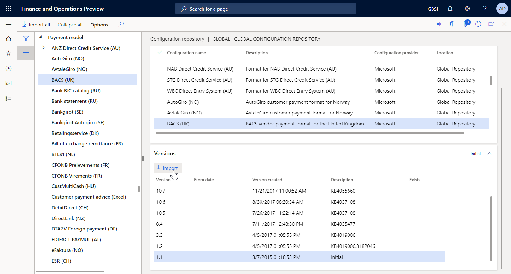

> [!TIP]
> If you have trouble accessing the [Global repository](er-download-configurations-global-repo.md), you can [download configurations](download-electronic-reporting-configuration-lcs.md) from Microsoft Dynamics Lifecycle Services (LCS) instead.

### Review the imported ER configurations

1. Go to **Organization administration** \> **Workspaces** \> **Electronic reporting**.
2. On the **Localization configurations** page, in the **Configurations** section, select the **Reporting configurations** tile.
3. On the **Configurations** page, in the configuration tree in the left pane, expand **Payment model**.
4. Notice that, in addition to the selected **BACS (UK)** ER format, other required ER configurations were imported. Make sure that the following ER configurations are available in the configuration tree:

    - **Payment model** – This configuration contains the data model ER component that represents the data structure of the payment business domain.
    - **Payment model mapping 1611** – This configuration contains the model mapping ER component that describes how the data model is filled in with application data at runtime.
    - **BACS (UK)** – This configuration contains the format and format mapping ER components. The format component specifies the report layout. The format mapping component contains the model data source and specifies how the report layout is filled in by using this data source at runtime.

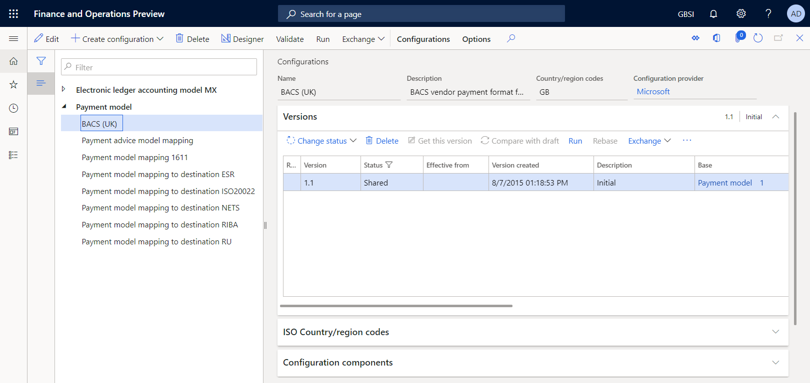

## Prepare a vendor payment for processing

### Add bank information for a vendor account

You must add bank information for a vendor account that will be referred to later in a registered payment.

1. Go to **Accounts payable** \> **Vendors** \> **All vendors**.
2. On the **All vendors** page, select the **GB_SI_000001** vendor account, and then, on the Action Pane, on the **Vendor** tab, in the **Set up** group, select **Bank accounts**.
3. On the **Vendor bank accounts** page, select **New**, and then enter the following information:

    1. In the **Bank account** field, enter **GBP OPER**.
    2. In the **Bank groups** field, select **BankGBP**.
    3. In the **Bank account number** field, enter **202015**.
    4. In the **SWIFT code** field, enter **CHASDEFXXXX**.
    5. In the **IBAN** field, enter **GB33BUKB20201555555555**.
    6. In the **Routing number** field, keep the default value, **123456**.

    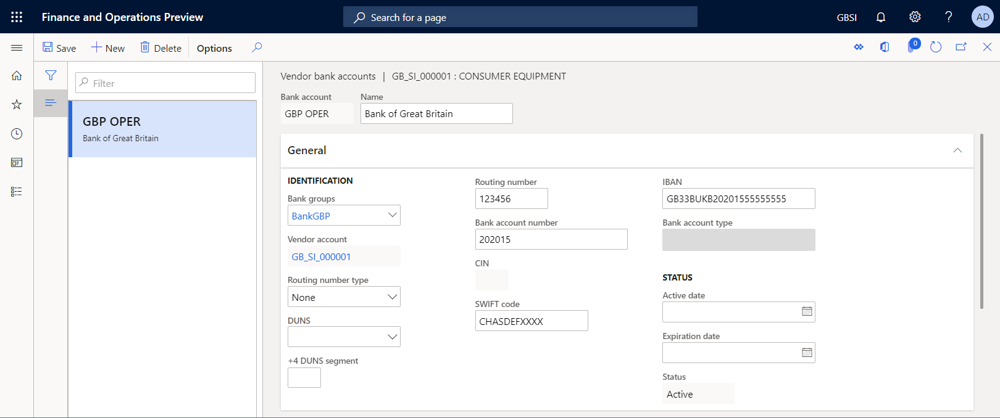

4. Select **Save**.
5. Close the page.
6. On the **All vendors** page, open the **GB_SI_000001** vendor account.
7. On the vendor details page, select **Edit** to make the page editable, if required.
8. On the **Payment** FastTab, in the **Bank account** field, select **GBP OPER**.

    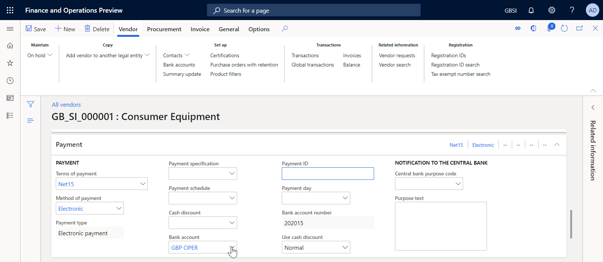

9. Select **Save**.
10. Close the page.

### Enter a vendor payment

You must enter a new vendor payment by using a [payment proposal](../../../finance/accounts-payable/create-vendor-payments-payment-proposal.md).

1. Go to **Accounts payable** \> **Payments** \> **Vendor payment journal**.
2. On the **Vendor payment journal** page, select **New**.
3. In the **Name** field, select **VendPay**.
4. Select **Lines**.
5. Select **Payment proposal** \> **Create payment proposal**.
6. In the **Vendor payment proposal** dialog box, configure conditions to filter for records for the **GB_SI_000001** vendor account only, and then select **OK**.
7. Select the line for the **00000007_Inv** invoice, and then select **Create payment**.

    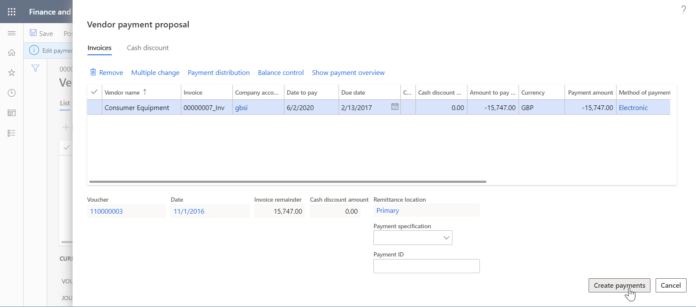

8. Verify that the payment that is entered is configured to use the **Electronic** method of payment.

    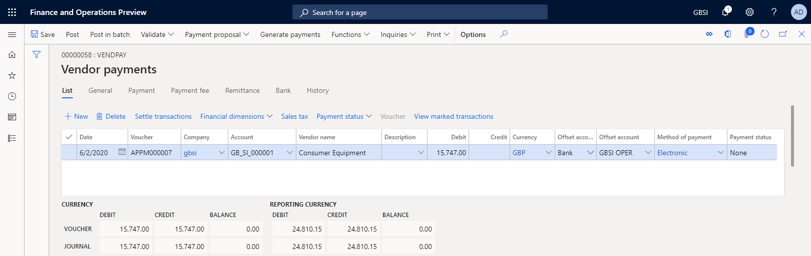

## Process a vendor payment by using the standard ER format

### Set up the electronic payment method

You must configure the electronic method of payment so that it uses the imported ER format configuration.

1. Go to **Accounts payable** \> **Payment setup** \> **Methods of payment**.
2. On the **Methods of payment - vendors** page, select the **Electronic** method of payment in the left pane.
3. Select **Edit**.
4. On the **File formats** FastTab, set the **General electronic Export format** option to **Yes**.
5. In the **Export format configuration** field, select the **BACS (UK)** format configuration.

    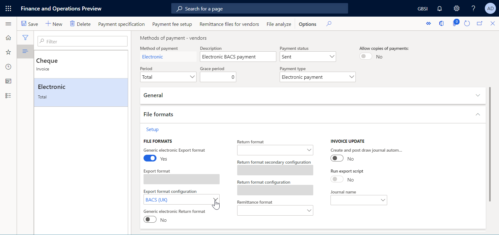

6. Select **Save**.

### Process a vendor payment

1. Go to **Accounts payable** \> **Payments** \> **Vendor payment journal**.
2. On the **Vendor payment journal** page, select the payment journal that you added earlier, and then select **Lines**.
3. On the **Vendor payments** page, select **Generate payments**.
4. In the **Generate payments** dialog box, enter the following information:

    - In the **Method of payment** field, select **Electronic**.
    - In the **Bank account** field, select **GBSI OPER**.

5. Select **OK**.
6. In the **Electronic report parameters** dialog box, set the **Print control report** option to **Yes**, and then select **OK**.

    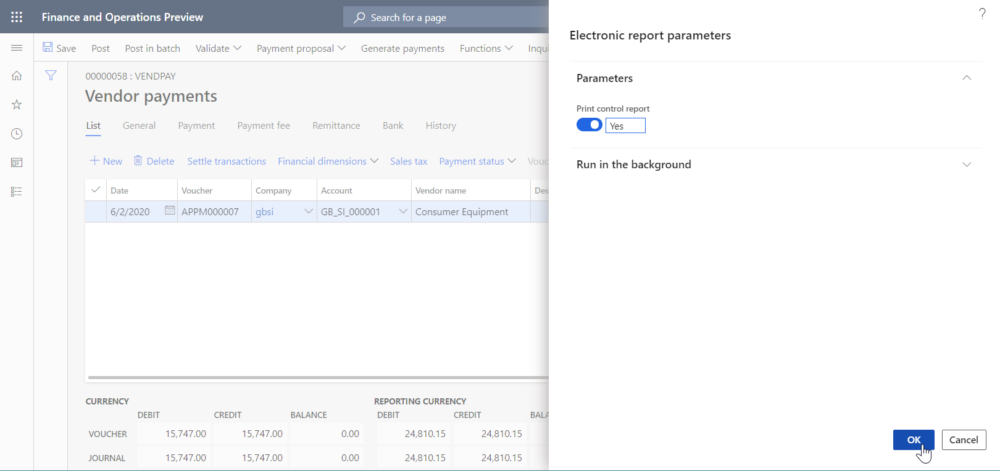

    > [!NOTE]
    > In addition to the payment file, you can now generate the control report.

7. Download the zip file, and then extract the following files from it:

    - The control report in Excel format
    - The payment file in TXT format

        Notice that, in accordance with the [structure](#PositionRoutingNumber) of the provided ER format, the payment line in the generated file starts with the routing number that was [defined](#DefineRoutingNumber) for the configured bank account.

        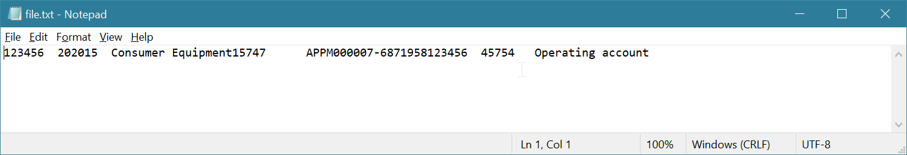

## Customize the standard ER format

For the example that is shown in this section, you want to use the ER configurations that are provided by Microsoft to generate vendor payment files in BACS format, but you must add a customization to support the requirements of a specific bank. You also want to be able to upgrade your custom format when new versions of ER configurations become available. However, you want to be able to do the upgrade at the lowest cost.

In this case, as the representative of Litware, Inc., you must create (derive) a new ER format configuration by using the **BACS (UK)** Microsoft-provided configuration as a base.

### Create a custom format

1. Go to **Organization administration** \> **Electronic reporting** \> **Configurations**.
2. On the **Configurations** page, in the configuration tree in the left pane, expand **Payment model**, and then select **BACS (UK)**. Litware, Inc. will use version 1.1 of this ER format configuration as the base for the custom version.
3. Select **Create configuration** to open the drop-down dialog box. You can use this dialog box to create a new configuration for a custom payment format.
4. In the **New** field group, select the **Derive from Name: BACS (UK), Microsoft** option.
5. In the **Name** field, enter **BACS (UK custom)**.

    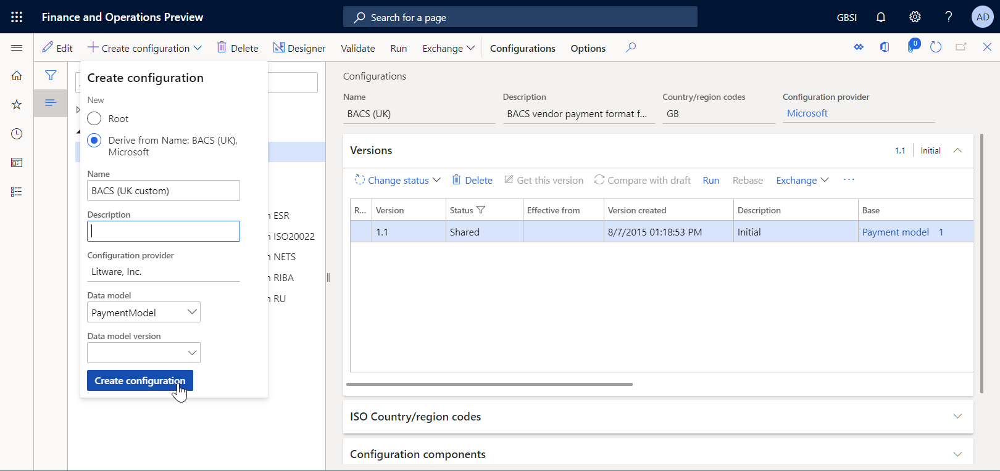

6. Select **Create configuration**.

Version 1.1.1 of the **BACS (UK custom)** ER format configuration is created. This version has a status of **Draft** and can be edited. The current content of your custom ER format matches the content of the format that is provided by Microsoft.

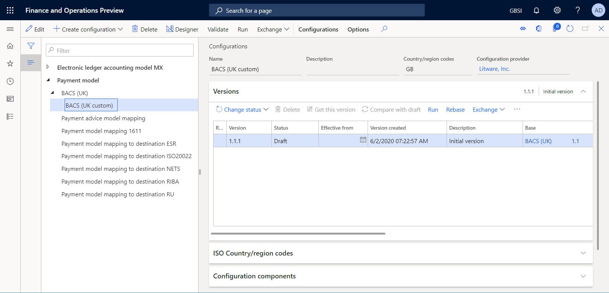

### Edit a custom format

You must configure your custom format so that it meets bank-specific requirements. For example, a bank might require that payment files that are generated include the Society for Worldwide Interbank Financial Telecommunication (SWIFT) code of a bank that is assigned the agent role in the processed vendor payment. SWIFT codes are international bank codes that identify specific banks worldwide. They are also known as Bank Identifier Codes (BICs). The SWIFT code must be 11 characters long, and it must be entered at the beginning of every payment line in a generated payment file.

1. Go to **Organization administration** \> **Electronic reporting** \> **Configurations**.
2. On the **Configurations** page, in the configuration tree in the left pane, expand **Payment model**, and then select **BACS (UK custom)**.
3. On the **Versions** FastTab, select version **1.1.1** of the selected configuration.
4. Select **Designer**.
5. On the **Format designer** page, select **Show details** to view more information about the format elements.
6. Expand and review the following elements:

    - The **BACSReportsFolder** element of the **Folder** type. This element is used to generate output in ZIP format.
    - The **file** element of the **File** type. This element is used to generate a payment file in TXT format.
    - The **transactions** element of the **Sequence** type. This element is used to generate a single payment line in a payment file.
    - The **transaction** element of the **Sequence** type. This element is used to generate individual fields of a single payment line.

7. Select the **transaction** element.

    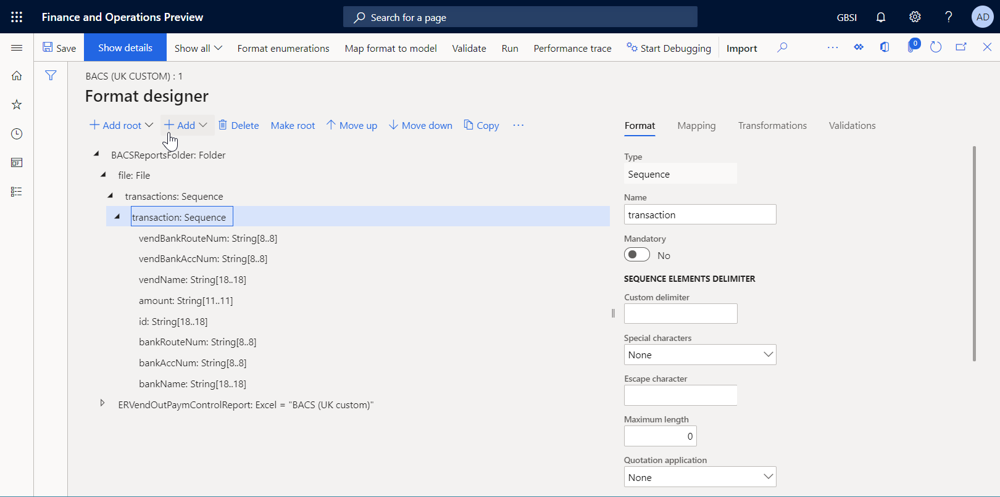

    > [!NOTE]
    > The provided report is configured so that every payment line starts with the bank routing number. The **vendBankRouteNum** format element is used for this purpose. 

8. Select **Add**, and then select the **Text\\String** type of the format element that you're adding:

    1. In the **Name** field, enter **vendBankSWIFT**.
    2. In the **Minimum length** field, enter **11**.
    3. In the **Maximum length** field, enter **11**.
    4. Select **OK**.

    > [!NOTE]
    > The **vendBankSWIFT** element will be used to enter the SWIFT code of a vendor bank in generated files.

9. In the format structure tree, select **vendBankSWIFT**.
10. Select **Move up** to move the selected format element up one level. Repeat this step until the **vendBankSWIFT** element is the first element under the parent **transaction** element.

    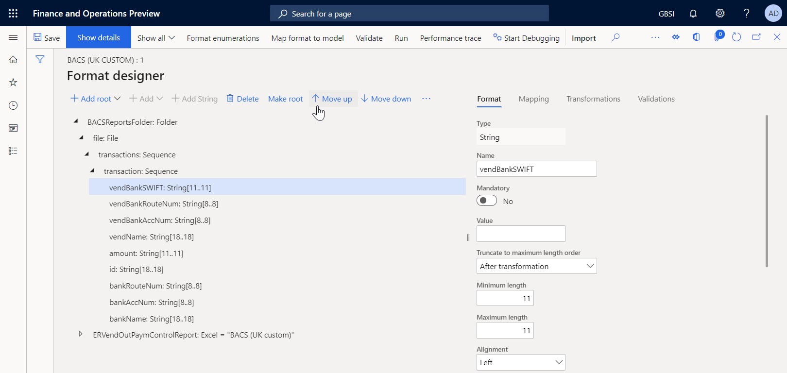

11. While the **vendBankSWIFT** is still selected in the format structure tree, select the **Mapping** tab, and then expand the **model** data source.
12. Expand **model.Payment** \> **model.Payment.CreditorAgent**, and select the **model.Payment.CreditorAgent.BICFI** data source field. This data source field exposes the SWIFT code of a vendor bank that is assigned the agent role in the processed vendor payment.
13. Select **Bind**. The **vendBankSWIFT** format element is now bound with the **model.Payment.CreditorAgent.BICFI** data source field, so that SWIFT codes will be entered in generated payment files.

    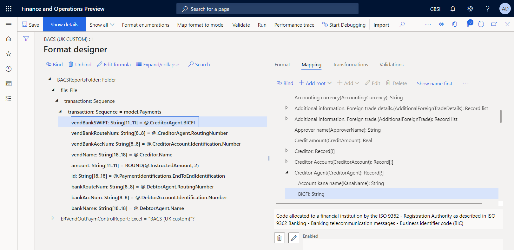

14. Select **Save**.
15. Close the designer page.

### Mark a custom format as runnable

Now that the first version of your custom format has been created and has a status of **Draft**, you can run it for testing purposes. To run the report, you must process a vendor payment by using the payment method that refers to your custom ER format. By default, when you call an ER format from the application, only versions that have a status of **Completed** or **Shared** are considered. This behavior helps prevent ER formats that have unfinished designs from being used. However, for your test runs, you can force the application to use the version of your ER format that has a status of **Draft**. In this way, you can adjust the current format version if any modifications are required. For more information, see [Applicability](electronic-reporting-destinations.md#applicability).

To use the draft version of an ER format, you must explicitly mark the ER format.

1. Go to **Organization administration** \> **Electronic reporting** \> **Configurations**.
2. On the **Configurations** page, on the Action Pane, on the **Configurations** tab, in the **Advanced settings** group, select **User parameters**.
3. In the **User parameters** dialog box, set the **Run settings** option to **Yes**, and then select **OK**.
4. Select **Edit** to make the current page editable, as required.
5. In the configuration tree in the left pane, select **BACS (UK custom)**.
6. Set the **Run Draft** option to **Yes**.

    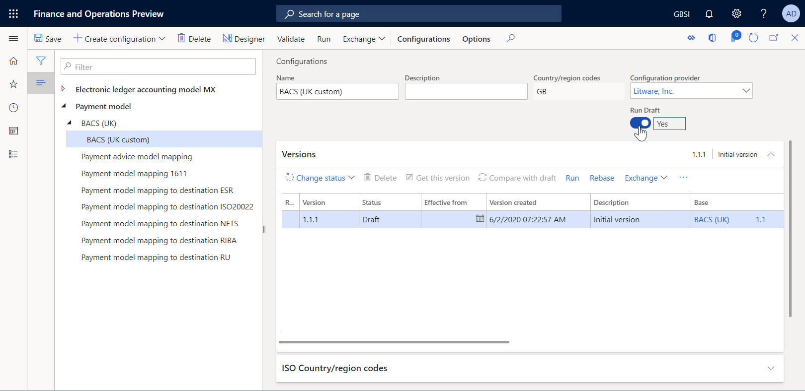

## Process a vendor payment by using the custom ER format

### Set up the electronic payment method

You must configure the electronic method of payment so that your custom ER format is used to process vendor payments.

1. Go to **Accounts payable** \> **Payment setup** \> **Methods of payment**.
2. On the **Methods of payment - vendors** page, select the **Electronic** method of payment in the left pane.
3. Select **Edit**.
4. On the **File format** FastTab, set the **General electronic export format** option to **Yes**.
5. In the **Export format configuration** field, select the **BACS (UK custom)** format configuration.

    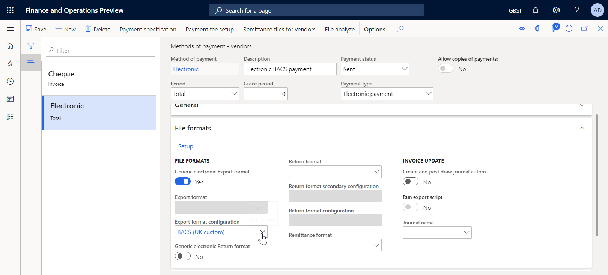

6. Select **Save**.

### Process a vendor payment

1. Go to **Accounts payable** \> **Payments** \> **Vendor payment journal**.
2. On the **Vendor payment journal** page, select the payment journal that you created earlier.
3. Select **Lines**.
4. On the **Vendor payments** page, above the grid, select **Payment status** \> **None**.
5. Select **Generate payment**.
6. In the **Generate payments** dialog box, enter the following information:

    - In the **Method of payment** field, select **Electronic**.
    - In the **Bank account** field, select **GBSI OPER**.

7. Select **OK**.
8. In the **Electronic report parameters** dialog box, set the **Print control report** option to **Yes**, and then select **OK**.

    > [!NOTE]
    > In addition to the payment file, you can generate only the control report.

9. Download the zip file, and then extract the following files from it:

    - The control report in Excel format
    - The payment file in TXT format

        Notice that, in accordance with the structure of your custom ER format, the payment line in the generated file now [starts](#PositionSWIFTCode) with the SWIFT code that was [entered](#DefineSWIFTCode) for the bank account of the vendor whose payment has been processed.

        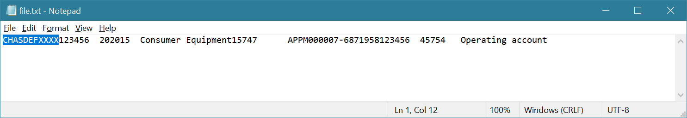

## Import new versions of the standard ER format configurations

For the example that is shown in this section, you receive a notification about Knowledge Base article [KB3763330](https://fix.lcs.dynamics.com/Issue/Details?kb=3182046). This notification informs you about the new version of the **BACS (UK)** ER format that has been published by Microsoft. In addition to the control report, this new version lets users generate the payment advice report and the attending note report while a vendor payment is being processed. You want to start to use that functionality.

### Import new versions of the standard ER configurations

To add new versions of the ER configurations to the current Finance instance, you must import them from the ER [repository](general-electronic-reporting.md#Repository) that you've configured.

1. Go to **Organization administration** \> **Workspaces** \> **Electronic reporting**.
2. On the **Localization configurations** page, in the **Configuration providers** section, select the **Microsoft** tile, and then select **Repositories** to view the list of repositories for the Microsoft provider.
3. On the **Configuration repositories** page, select the repository of the **Global** type, and then select **Open**. If you're prompted for authorization to connect to Regulatory Configuration Service, follow the authorization instructions.
4. On the **Configuration repository** page, in the configuration tree in the left pane, select the **BACS (UK)** format configuration.
5. On the **Versions** FastTab, select version **3.3** of the selected ER format configuration.
6. Select **Import** to download the selected version from the Global repository to the current Finance instance.

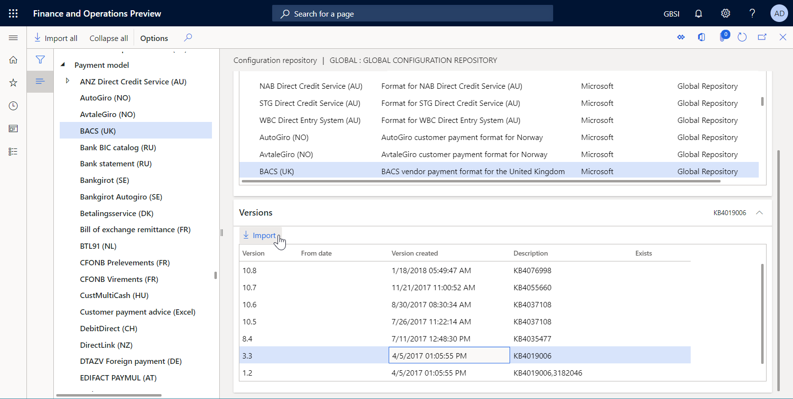

> [!TIP]
> If you have trouble accessing the [Global repository](er-download-configurations-global-repo.md), you can [download configurations](download-electronic-reporting-configuration-lcs.md) from LCS instead.

### Review the imported ER format configurations

1. Go to **Organization administration** \> **Workspaces** \> **Electronic reporting**.
2. On the **Localization configurations** page, in the **Configurations** section, select the **Reporting configurations** tile.
3. On the **Configurations** page, in the configuration tree in the left pane, expand **Payment model**, and then select **BACS (UK)**.
4. On the **Versions** FastTab, select version **3.3**.
5. Select **Designer**.
6. On the **Format designer** page, expand the **BACSReportsFolder** format element.
7.  Notice that version 3.3 contains the **PaymentAdviceReport** format element that is used to generate a payment advice report when a vendor payment is processed.

    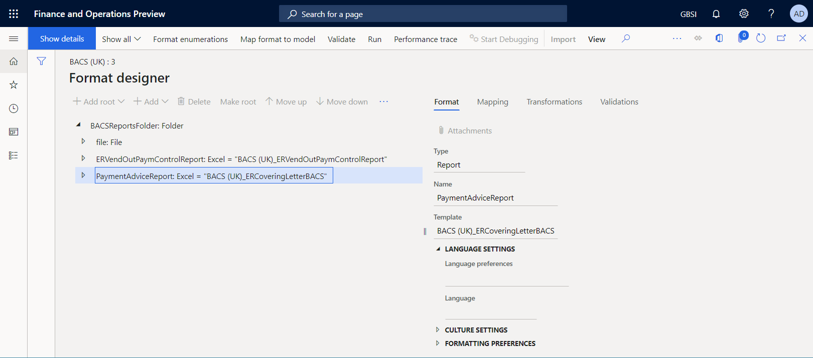

8. Close the designer page.

## Adopt the changes in the new version of an imported format in a custom format

### Complete the current draft version of a custom format

If you want to keep the current state of your custom format, complete the draft version 1.1.1 by changing its status from **Draft** to **Completed**.

1. Go to **Organization administration** \> **Workspaces** \> **Electronic reporting**.
2. On the **Localization configurations** page, in the **Configurations** section, select the **Reporting configurations** tile.
3. On the **Configurations** page, in the configuration tree in the left pane, expand **Payment model**, expand **BACS (UK)**, and then select **BACS (UK custom)**.
4. On the **Versions** FastTab, select **Change status** \> **Complete**, and then select **OK**.

The status of version 1.1.1 is changed from **Draft** to **Completed**, and the version becomes read-only. A new editable version, 1.1.2, has been added and has a status of **Draft**. You can use this version to make further changes in your custom ER format.

### Rebase a custom format to a new base version

To start to use the new functionality of version 3.3 of the **BACS (UK)** format in your customization, you must change the base configuration version for the custom configuration, **BACS (UK custom)**. This process is known as [rebasing](general-electronic-reporting.md#upgrading-a-format-selecting-a-new-version-of-base-format-rebase). Instead of version 1.1 of **BACS (UK)**, use version 3.3.

1. Go to **Organization administration** \> **Electronic reporting** \> **Configurations**.
2. On the **Configurations** page, in the configuration tree in the left pane, expand **Payment model**, and then select **BACS (UK custom)**.
3. On the **Versions** FastTab, select version **1.1.2**, and then select **Rebase**.
4. In the **Rebase** dialog box, in the **Target version** field, select version **3.3** of the base configuration to apply it as the new base and use it to update the configuration.

    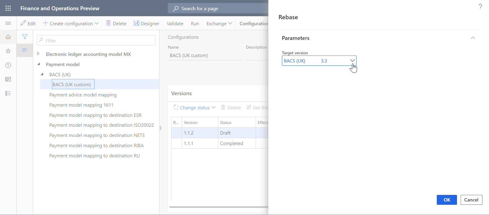

5. Select **OK**.
6. Notice that the number of the draft version has been changed from **1.1.2** to **3.3.2** to reflect the change in the base version.

    When the custom version and a new base version are merged, some conflicts might be discovered because of format changes that can't be merged automatically.

    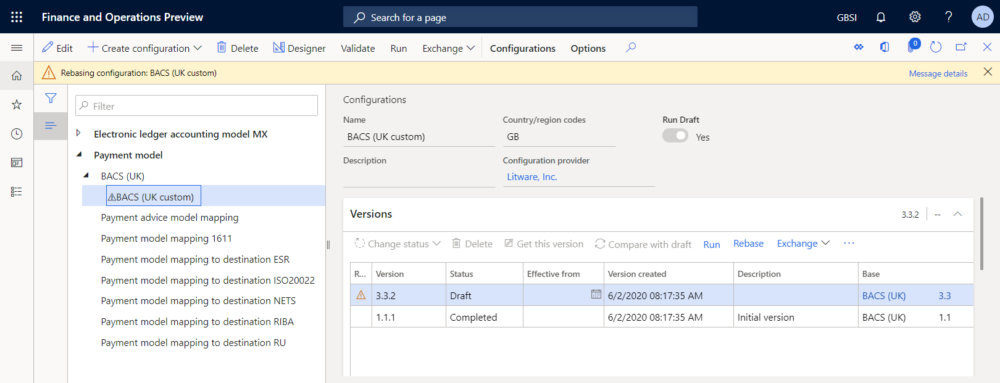

    If conflicts are discovered, they must be manually resolved in the format designer.

7. On the **Versions** FastTab, select version **3.3.2**.
8. Select **Designer**.
9. On the **Format designer** page, on the **Details** FastTab, select a rebase conflict record, and then select **Apply base value**.

    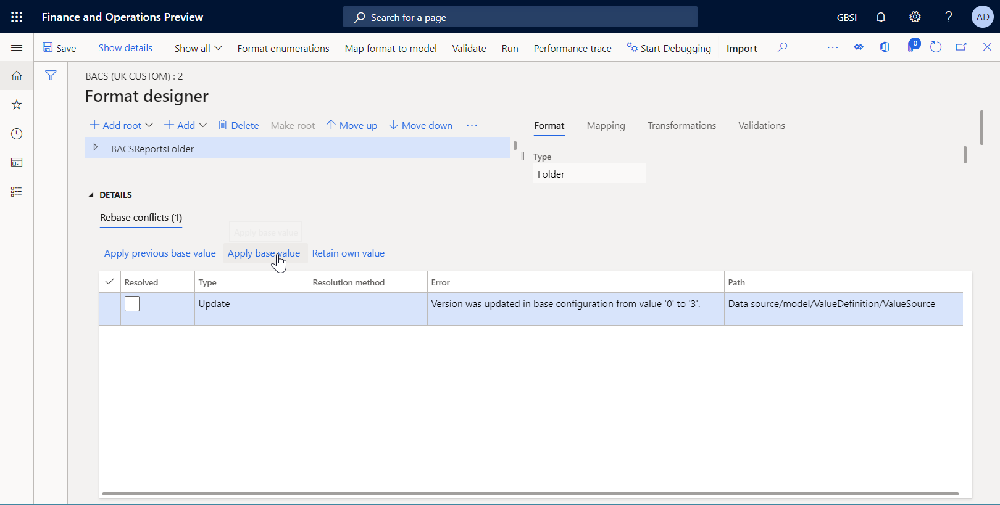

10. Select **Save**.

    The rebase conflict record should no longer appear on the **Details** FastTab.

    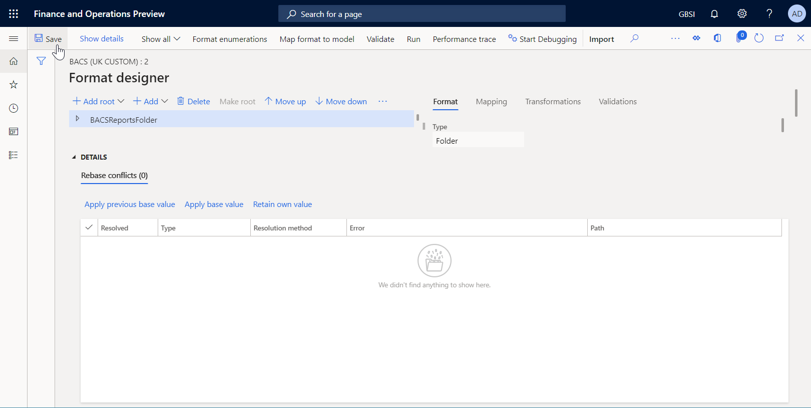

    > [!NOTE]
    > You resolved the conflict by confirming that version 3 of the base model must be used in this ER format.

11. Expand **BACSReportsFolder** \> **file** \> **transactions** \> **transaction**.
12. On the **Mapping** tab, notice that version 3.3.2 of your custom ER format contains both your customization (the **vendBankSWIFT** format element and its binding) and the new functionality of version 3.3 of the base ER format that was provided by Microsoft (the **PaymentAdviceReport** format element together with its nested elements and configured bindings). In just a few mouse clicks, you adopted the modifications of a new base version by merging them with your customization.

    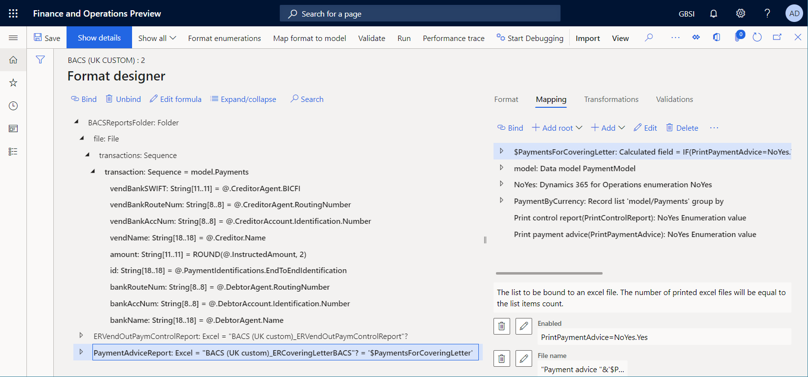

13. Close the designer page.

> [!NOTE]
> The rebase action is reversible. To cancel this rebase, select version **1.1.1** of the **BACS (UK custom)** format on the **Versions** FastTab, and then select **Get this version**. Version 3.3.2 will then be renumbered 1.1.2, and the content of draft version 1.1.2 will match the content of version 1.1.1.

### Process a vendor payment by using a rebased ER format

1. Go to **Accounts payable** \> **Payments** \> **Vendor payment journal**.
2. On the **Vendor payment journal** page, select the payment journal that you created earlier.
3. Select **Lines**.
4. On the **Vendor payments** page, above the grid, select **Payment status** \> **None**.
5. Select **Generate payment**.
6. In the **Generate payments** dialog box, enter the following information:

    - In the **Method of payment** field, select **Electronic**.
    - In the **Bank account** field, select **GBSI OPER**.

7. Select **OK**.
8. In the **Electronic report parameters** dialog box, enter the following information:

    - Set the **Print control report** option to **Yes**.
    - Set the **Print payment advice** option to **Yes**.

    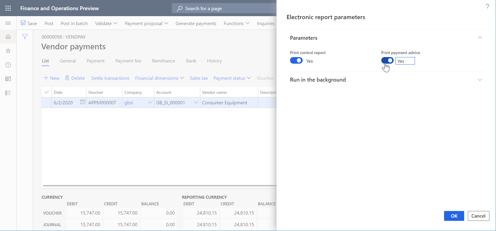

    > [!NOTE]
    > In addition to the payment file, you can now generate both the control report and the payment advice report.

9. Select **OK**.
10. Download the zip file, and then extract the following files from it:

    - The control report in Excel format
    - The payment advice report in Excel format

        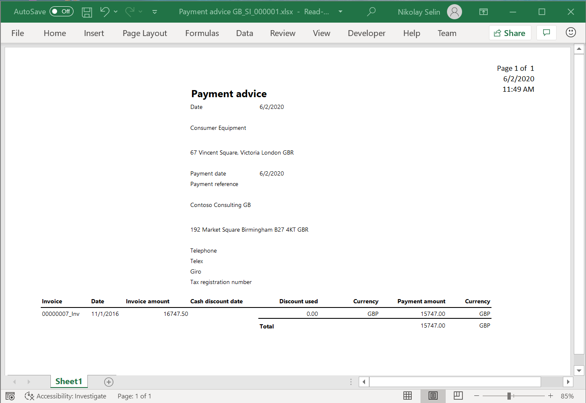

    - The payment file in TXT format

        Notice that the payment line in the generated file starts  with the SWIFT code that was entered for the bank account of a vendor whose payment has been processed.

        

## Additional resources

- [Electronic Reporting overview](general-electronic-reporting.md)
- [Download ER configurations from Lifecycle Services](download-electronic-reporting-configuration-lcs.md)
- [Download ER configurations from Global repository of Configuration service](er-download-configurations-global-repo.md)

[!INCLUDE[footer-include](../../../includes/footer-banner.md)]
