# Customize Electronic reporting configurations to generate an electronic document

[!include[banner](../includes/banner.md)]

The [Electronic reporting (ER) framework](general-electronic-reporting.md) lets you upload the ER [configurations](general-electronic-reporting.md#Configuration) that Microsoft provides into your Microsoft Dynamics 365 Finance instance. In this way, the Microsoft-provided configurations can serve as the ER solution that is used to generate electronic customer invoices (e-invoices). You can use this ER solution to configure your custom ER solution to access your custom database fields and generate e-invoices that are compliant with your specific requirements, without having to edit the source code.

## Overview

For the example in this article, you must specify a federal tax identification code as a new custom attribute of every customer that you electronically invoice. Therefore, you must customize the structure of the invoice that is currently used, by adding a new item that must be filled with the tax code in every e-invoice that is generated.

The procedures in this article explain how a user in the System Administrator, Electronic Reporting Developer, or Electronic Reporting Functional Consultant role can perform the following tasks in your Finance instance:

- [Configure the minimal set of ER parameters that is required to start to use the ER framework](#ConfigureER).
- [Import the initial versions of the standard ER configurations that are provided to generate e-invoices](#ImportERConfigurations1).
- [Configure the Accounts receivable parameters to start to use the standard ER configurations](#ConfigureAR1).
- [Configure the legal entity parameters to invoice customers](#ConfigureLE).
- [Prepare a customer record for electronic invoicing](#ConfigureCustomer1).
- [Add, post, and send a customer invoice by using the standard ER configurations](#ProcessInvoice1).
- [Add a custom database field to manage a federal tax identification code for customers](#AddCustomField).
- [Refresh the ER metadata to enable database changes for the ER model mapping designer](#RefreshERMetadata).
- [Design the custom ER configurations to generate e-invoices that contain the new tax code](#DesignCustomERConfigurations).
- [Configure the Accounts receivable parameters to start to use the custom ER configurations](#ConfigureAR2).
- [Update a customer record for electronic invoicing](#ConfigureCustomer2).
- [Add, post, and send a customer invoice by using the custom ER configurations](#ProcessInvoice2).
- [Import the new versions of the standard ER configurations that are provided to generate e-invoices](#ImportERConfigurations2).
- [Adopt the changes to the new versions of the standard ER configurations in your custom ER configurations](#RebaseCustomERConfigurations).
- [Add, post, and send a customer invoice by using the new versions of the custom ER configurations](#ProcessInvoice3).

All these procedures can be completed in the **DEMF** company.

## Configure the ER framework

As a user in the Electronic Reporting Functional Consultant or Electronic Reporting Developer role, you must configure the minimal set of ER parameters. You can then start to use the ER framework to design custom versions of the standard configurations of the ER solution that is used to generate e-invoices.

### Configure ER parameters

1. Go to **Organization administration** \> **Workspaces** \> **Electronic reporting**.
2. On the **Localization blueprint** page, in the **Related links** section, select **Electronic reporting parameters**.
3. On the **Electronic reporting parameters** page, on the **General** tab, set the **Enable design mode** option to **Yes**.
4. On the **Attachments** tab, in the **Configurations** field, select **File**.
5. In the **Job archive**, **Temporary**, **Baseline**, and **Others** fields, select the **File** type.

For more information about ER parameters, see [Configure the ER framework](electronic-reporting-er-configure-parameters.md).

### Activate an ER configuration provider

Every ER configuration that is added is marked as owned by an ER configuration provider. The ER configuration provider that is activated in the **Electronic reporting** workspace is used for this purpose. Therefore, you must activate an ER configuration provider in the **Electronic reporting** workspace before you start to add or edit ER configurations.

> [!NOTE]
> Only the owner of an ER configuration can edit it. Therefore, before an ER configuration can be edited, the appropriate ER configuration provider must be activated in the **Electronic reporting** workspace.

#### Review the list of ER configuration providers

1. Go to **Organization administration** \> **Workspaces** \> **Electronic reporting**.
2. On the **Localization blueprint** page, in the **Related links** section, select **Configuration providers**.
3. On the **Configuration provider table** page, each provider record has a unique name and URL. Review the contents of this page. If a record for **Litware, Inc.** (`https://www.litware.com`) already exists, skip the next procedure, [Add a new ER configuration provider](#AddProvider).

#### Add a new ER configuration provider

1. Go to **Organization administration** \> **Workspaces** \> **Electronic reporting**.
2. On the **Localization blueprint** page, in the **Related links** section, select **Configuration providers**.
3. On the **Configuration providers** page, select **New**.
4. In the **Name** field, enter **Litware, Inc.**
5. In the **Internet address** field, enter `https://www.litware.com`.
6. Select **Save**.

#### Activate an ER configuration provider

1. Go to **Organization administration** \> **Workspaces** \> **Electronic reporting**.
2. On the **Localization blueprint** page, in the **Configuration providers** section, select the **Litware, Inc.** tile, and then select **Set active**.

For more information about ER configuration providers, see [Create configuration providers and mark them as active](tasks/er-configuration-provider-mark-it-active-2016-11.md).

## Import the initial versions of standard ER configurations

To add the standard ER configurations to your current Finance instance, you must import them from the ER [repository](general-electronic-reporting.md#Repository) that was configured for that instance.

1. Go to **Organization administration** \> **Workspaces** \> **Electronic reporting**.
2. On the **Localization blueprint** page, in the **Configuration providers** section, select the **Microsoft** tile, and then select **Repositories** to view the list of repositories for the Microsoft provider.
3. On the **Configuration repositories** page, select the repository of the **Global** type, and then select **Open**. If you're prompted for authorization to connect to Regulatory Configuration Service, follow the authorization instructions.
4. On the **Configuration repository** page, in the configuration tree in the left pane, select the **Peppol Sales Invoice** format configuration.
5. On the **Versions** FastTab, select version **11.2.2**.
6. Select **Import** to download the selected version from the Global repository.

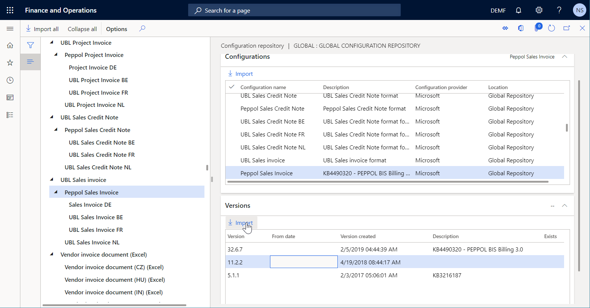

> [!TIP]
> If you have trouble accessing the [Global repository](er-download-configurations-global-repo.md), you can [download configurations](download-electronic-reporting-configuration-lcs.md) from Microsoft Dynamics Lifecycle Services (LCS) instead.

### Review the imported ER configurations

1. Go to **Organization administration** \> **Workspaces** \> **Electronic reporting**.
2. On the **Localization blueprint** page, in the **Configurations** section, select the **Reporting configurations** tile.
3. On the **Configurations** page, expand the **Configuration components** FastTab.
4. In the configuration tree in the left pane, expand **Invoice model**, and then expand **UBL Sales invoice**.

Notice that, in addition to the selected **Peppol Sales Invoice** ER format, other required ER configurations were imported. Because new versions of ER configurations are constantly published to the Global repository and LCS to keep the corresponding solutions compliant with new requirements, the latest versions of the required data model configuration and its model mapping configurations were imported.

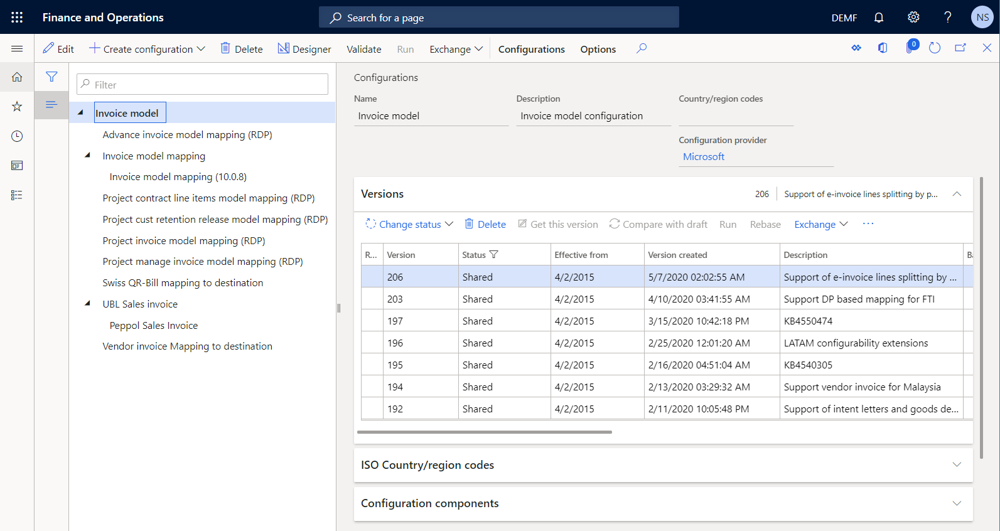

To simulate the state that ER configurations in the current Finance instance  would be in if you imported version **11.2.2** of the **Peppol Sales Invoice** ER format in the past (for example, on August 7, 2019), follow these steps.

- On the Action Pane, select **Delete** to delete all ER configurations that were published after August 7, 2019. The only **Invoice model**, **Invoice model mapping** (initially named **Customer invoice model mapping**), **UBL Sales invoice** and **Peppol Sales Invoice** configurations must be left.
- For the remained ER configurations, on the **Versions** FastTab, select **Delete** to delete all versions of ER configurations that were published after August 7, 2019.

Then verify that the following configurations are available in the configuration tree:

- **Invoice model** ER data model configuration (initially named **Customer invoice model**):

    - Version 11 contains version 10 of the data model ER component that represents the data structure of the invoicing business domain. This ER configuration has been imported as an ancestor of the **Peppol Sales Invoice** ER format that was selected for import.
    - Version 50 contains version 31 of the data model ER component. This ER configuration has been imported as an ancestor of the August 7, 2019, version of the **Invoice model mapping** ER model mapping configuration.

    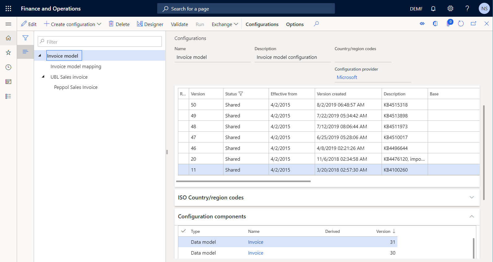

    > [!TIP]
    > If you don't see version 50 of this data model, open the Global repository, and import version 50.19 of the **Invoice model mapping** ER configuration.

- **Invoice model mapping** ER model mapping configuration (initially named **Customer invoice model mapping**):

    - Version 50.19 has been imported as the latest implementation of version 50 of the **Invoice model** ER data model configuration. It contains two model mapping ER components that describe how the data model is filled in with application data at runtime.

    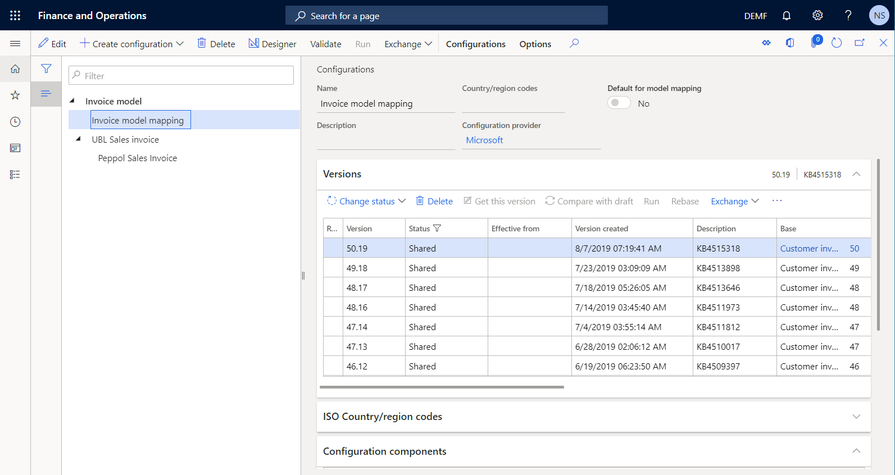

    > [!TIP]
    > If you don't see version 50.19 of this model mapping, open the Global repository, and import version 50.19 of the **Invoice model mapping** ER configuration.

- **UBL Sales invoice** ER format configuration:

    - Version 11.2 contains the format and format mapping ER components. The format component specifies the report layout. The format mapping component contains the model data source and specifies how this data source is used to fill in the report layout at runtime. This ER format was configured to generate e-invoices in Universal Business Language (UBL) format. It has been imported as a parent of the **Peppol Sales Invoice** ER format that was selected for import.

- **Peppol Sales Invoice** ER format configuration:

    - Version 11.2.2 contains the format and format mapping ER components that were configured to generate e-invoices in Pan-European Public Procurement OnLine (PEPPOL) format.

    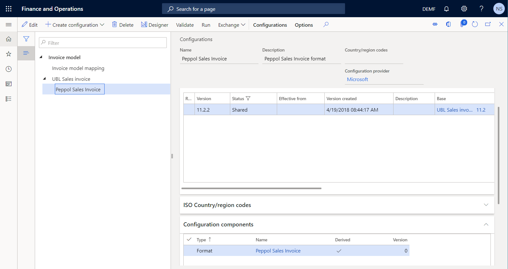

## Configure the Accounts receivable parameters

1. Go to **Accounts receivable** \> **Setup** \> **Accounts receivable parameters**.
2. On the **Electronic documents** tab, on the **Electronic reporting** FastTab, in the **Sales and Free text invoice** field, select **Peppol Sales Invoice**.
3. Select **Save**.

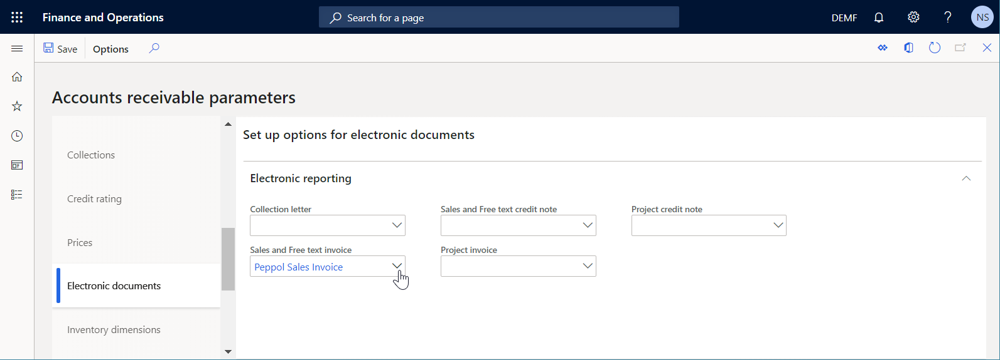

## Configure the legal entity parameters

1. Go to **Organization administration** \> **Organizations** \> **Legal entities**.
2. For the selected **DEMF** company, on the **Bank account information** FastTab, in the **Routing number** field, enter **1234**.
3. Select **Save**.
4. Close the **Legal entities** page.

## Prepare a customer record

1. Go to **Accounts receivable** \> **Customers** \> **All customers**.
2. On the **All customers** page, select the **DE-014** customer account link.

### Add a customer contact

1. Go to **Accounts receivable** \> **Customers** \> **All customers**.
2. On the Action Pane, on the **Customer** tab, in the **Accounts** group, select **Contacts**.
3. Select **Add contacts**.
4. On the **Contacts** page, in the **First name** field, open the lookup, select **Adam Carter**, and then select **Select** to close the lookup.
5. Select **Save**.
6. Close the **Contacts** page.

### Define a primary contact

1. Go to **Accounts receivable** \> **Customers** \> **All customers**.
2. On the **Sales demographics** FastTab, in the **Primary contact** field, select **Adam Carter**.

### Set the e-invoicing option

1. Go to **Accounts receivable** \> **Customers** \> **All customers**.
2. On the **Invoice and delivery** FastTab, set the **eInvoice** option to **Yes**.
3. Select **Save**.
4. Close the **All customers** page.

## Process a customer invoice by using the standard ER configurations

You can now use the standard ER configurations that you imported to electronically send a free text invoice to a customer.

### Add a new invoice

1. Go to **Accounts receivable** \> **Invoices** \> **All free text invoices**.
2. On the **Free text invoice** page, select **New**.
3. On the **Free text invoice header** FastTab, in the **Customer account** field, select **DE-014**.
4. On the **Invoice lines** FastTab, an invoice line is automatically added. On this line, set the following fields:

    - In the **Description** field, enter **Notebook**.
    - In the **Main account** field, select **401100**.
    - In the **Unit price** field, enter **1000**.

5. Select **Save**.

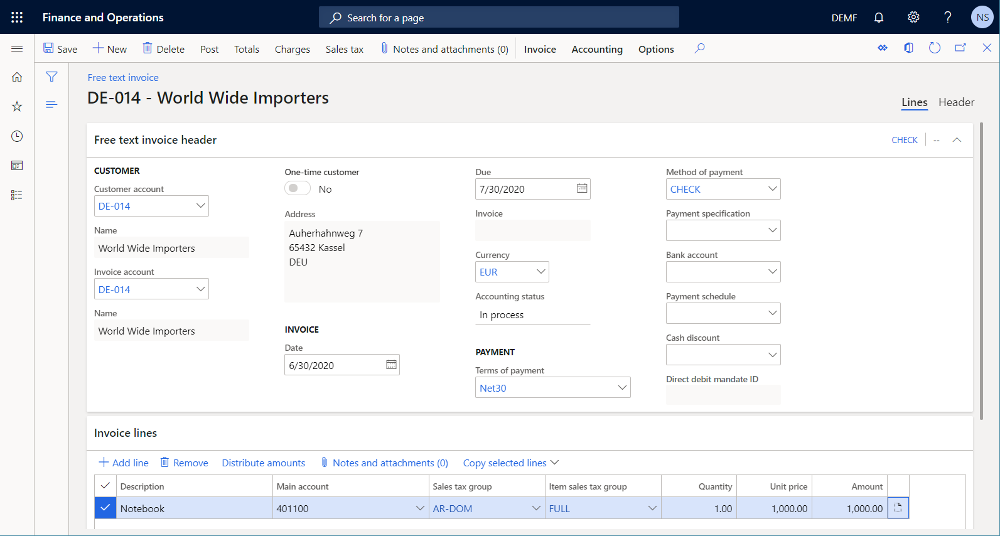

For more information, see [Create a free text invoice](../../../finance/accounts-receivable/create-free-text-invoice-new.md).

### Post a new invoice

1. Go to **Accounts receivable** \> **Invoices** \> **All free text invoices**.
2. On the **Free text invoice** page, on the Action Pane, select **Post**.
3. In the **Post free text invoice** dialog box, select **OK**.

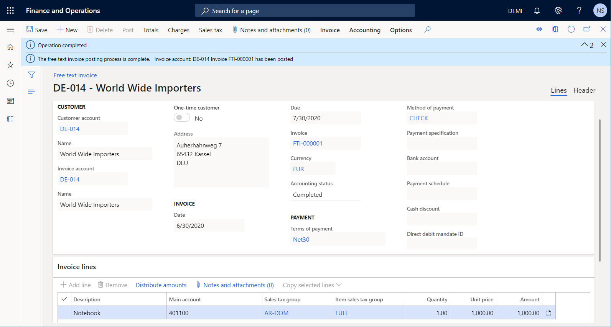

### Send a posted invoice

1. Go to **Accounts receivable** \> **Invoices** \> **All free text invoices**.
2. On the **Free text invoice** page, on the Action Pane, in the **Document** group, select **Send** \> **Original**.

    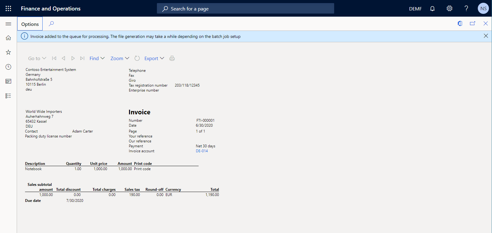

3. Close the **Free text invoice** page.

### Analyze a generated e-invoice

1. Go to **Organization administration** \> **Electronic reporting** \> **Electronic reporting jobs**.
2. On the **Electronic reporting jobs** page, select the initial record that has the task description **Send the eInvoice XML**.
3. Select **Show files** to access the list of generated files.

    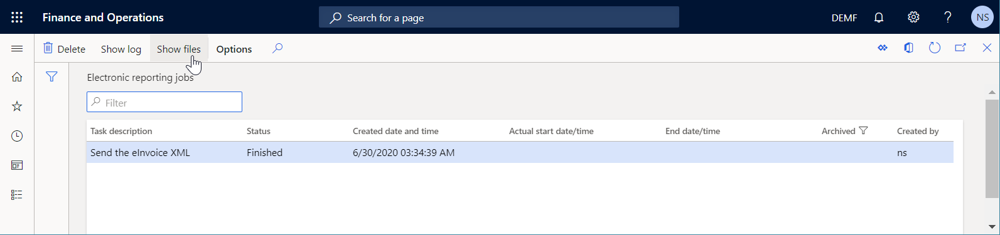

4. Select **Open** to download the e-invoice XML file that is generated.
5. Analyze the e-invoice XML file. Notice that the customer tax schema is currently represented by the **schemeID** and **schemeAgencyID** XML attributes. Also notice that the **cbc:CustomizationID** XML element currently contains the following text: `urn:www.cenbii.eu:transaction:biicoretrdm010:ver1.0:# urn:www.peppol.eu:bis:peppol5a:ver1.0`.

    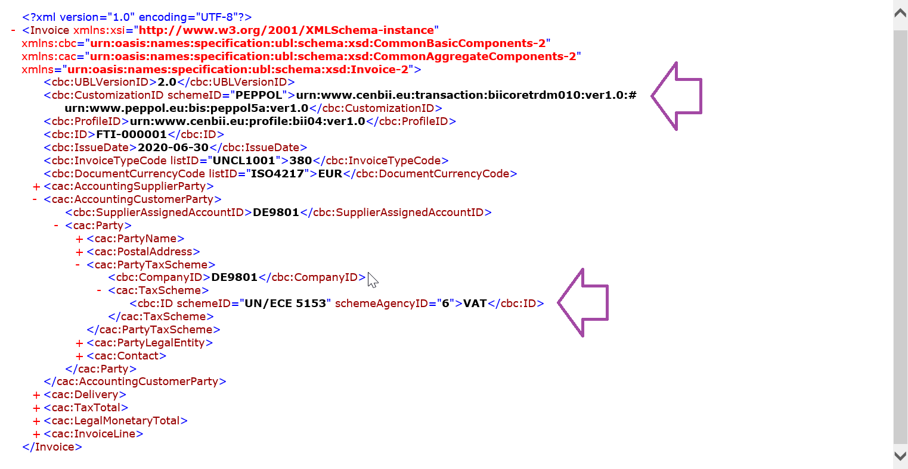

## Add a custom database field

You can use the [Custom field](../../fin-ops/get-started/user-defined-fields.md) feature to do the following customization in the current Finance instance:

- Customize the database structure by adding a new custom database field that stores a federal tax identification code for every customer.
- Customize the **Customer** page by adding a new data entry field that can be used to enter a tax code value in the new custom database field.

Follow these steps to do the customization.

1. Go to **Accounts receivables** \> **Customers** \> **All customers**.
2. On the **All customers** page, select the **DE-014** customer account link.
3. On the **General** FastTab, right-click in any blank area under the **Language** field, and then select **Personalize: UpperGroup**.

    The contents of the **General** FastTab are highlighted, and a **Personalize** menu appears.

4. On the **Personalize** menu, select **Add a field**.
5. In the **Add columns** dialog box, select **Create new field**.
6. In the **Create new field** dialog box, in the **Table name** field, select **Customers**.
7. In the **Name prefix** field, enter **FederalTaxID**.

    > [!NOTE]
    > The whole field name has been automatically defined as **FederalTaxID\_Custom**.

8. In the **Label** field, enter **Federal Tax ID**.
9. In the **Type** field, select **Text**.
10. In the **Length** field, enter **20**.
11. Select **Save**.
12. In the message box that appears, select **Yes** to confirm that you want to create a new **FederalTaxID** field entry for the **Customers** table.
13. Select **Insert** to add the **FederalTaxID\_Custom** field to the current page.

    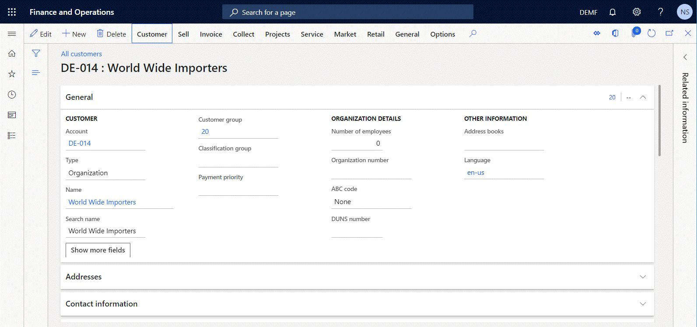

14. Close the **All customers** page.

## Refresh the ER metadata

You must refresh the ER metadata to make the custom field that you added [visible](electronic-reporting-er-configure-parameters.md#frequently-asked-questions) in the ER model mapping designer.

1. Go to **Organization administration** \> **Electronic reporting** \> **Rebuild table references**.
2. In the **Update data model** dialog box, select **OK**.

## Design the custom ER configurations

You can use the Microsoft-provided ER configurations to design your custom ER configurations so that they generate e-invoices that contain the new tax code.

### Customize the data model configuration

As a user in the Electronic Reporting Functional Consultant role, you can design your custom ER data model.

#### Add a custom data model configuration

1. Go to **Organization administration** \> **Electronic reporting** \> **Configurations**.
2. On the **Configurations** page, in the configuration tree in the left pane, select **Customer invoice model**.
3. On the Action Pane, select **Create configuration**.
4. In the drop-down dialog box, in the **New** field, select **Derive from Name: Customer invoice model, Microsoft** to indicate that your new custom ER data model configuration should be based on the ER data model configuration.
5. In the **Name** field, enter **Invoice model (Litware)**.
6. Select **Create configuration** to add the new ER configuration.

You can now use the ER data model designer to edit version 50.1 of the **Invoice model (Litware)** ER configuration in **Draft** status.

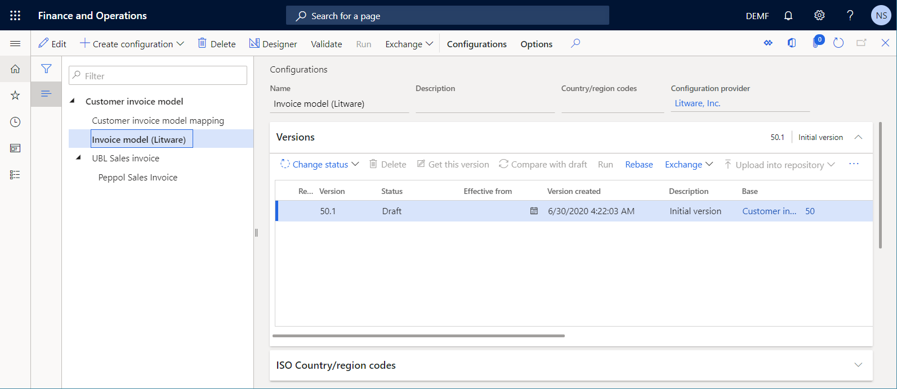

#### Configure a custom data model

You must modify your custom data model by adding a new field to provide the value of a federal tax identification code. This code is part of the customer data for every ER format that will use this data model as a data source.

1. On the **Configurations** page, in the configuration tree in the left pane, select **Invoice model (Litware)**.
2. On the **Versions** FastTab, select version **50.1** of the selected ER data model configuration in **Draft** status.
3. On the Action Pane, select **Designer** for the selected configuration version.
4. On the **Data model designer** page, in the data model tree, select **Customer information (Customer)**.
5. Select **New**.
6. In the drop-down dialog box, in the **New node as a** field, accept the default value, **Child of an active node**.
7. In the **Name** field, enter **FederalTaxID\_Litware**.
8. In the **Item type** field, accept the default value, **String**.
9. Select **Add**, and then select **Save**.

    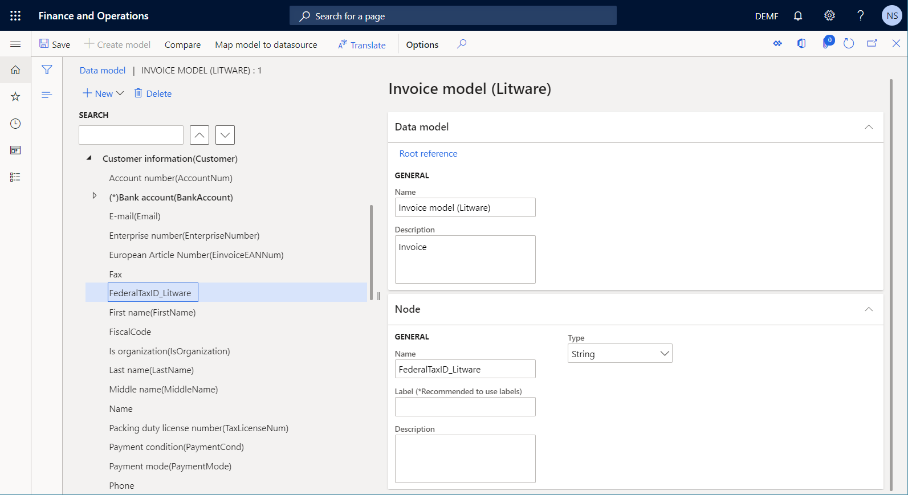

    > [!NOTE]
    > The **Label** and **Description** fields describe the purpose of the new field. You can fill in these fields in multiple languages. For more information, see [Design multilingual reports in Electronic reporting](er-design-multilingual-reports.md).

10. Close the **Data model designer** page.

#### Complete a custom data model configuration

You must complete your work with version 50.1 of your custom ER data model configuration to make it available so that other custom ER configurations can be added.

1. Go to **Organization administration** \> **Electronic reporting** \> **Configurations**.
2. On the **Configurations** page, in the configuration tree in the left pane, expand **Invoice model**, and select **Invoice model (Litware)**.
3. On the **Versions** FastTab, select **Change status** \> **Complete**, and then select **OK**.

The status of version 50.1 is changed from **Draft** to **Completed**, and the version becomes read-only. A new editable version, 50.2, is added and has a status of **Draft**. You can use this version to make further changes in your custom ER data model configuration.

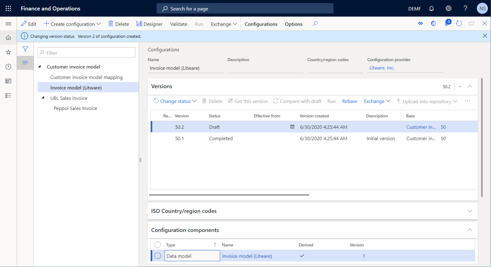

### Customize the model mapping configuration

As a user in the Electronic Reporting Developer role, you can design your custom ER model mapping.

#### Add a custom model mapping configuration

1. Go to **Organization administration** \> **Electronic reporting** \> **Configurations**.
2. On the **Configurations** page, in the configuration tree in the left pane, expand **Customer invoice model**, and select **Customer invoice model mapping**.
3. On the Action Pane, select **Create configuration**.
4. In the drop-down dialog box, in the **New** field, select **Derive from Name: Customer invoice model mapping, Microsoft** to indicate that your new custom ER model mapping configuration should be based on the ER model mapping configuration.
5. In the **Name** field, enter **Invoice model mapping (Litware)**.
6. In the **Target model** field, select **Invoice model (Litware)**.

    > [!IMPORTANT]
    > This step is very important. If you omit it, you won't be able to use your custom data model in the configured model mapping.

7. Select **Create configuration** to add the new ER configuration.

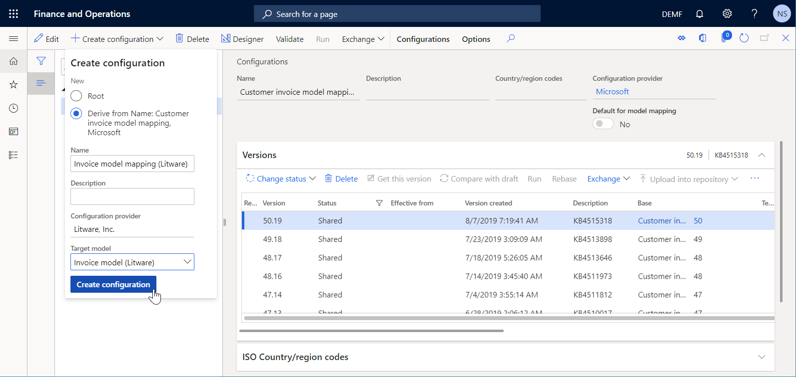

#### Configure a custom model mapping

You must modify your custom model mapping and specify how the custom **FederalTaxID\_Litware** field of the custom data model should be filled in with application data at runtime.

1. Go to **Organization administration** \> **Electronic reporting** \> **Configurations**.
2. On the **Configurations** page, in the configuration tree in the left pane, expand **Customer invoice model** \> **Customer invoice model mapping**, and select **Invoice model mapping (Litware)**.
3. On the Action Pane, select **Designer**.
4. On the **Model to datasource mapping** page, select the **Customer invoice** mapping.

    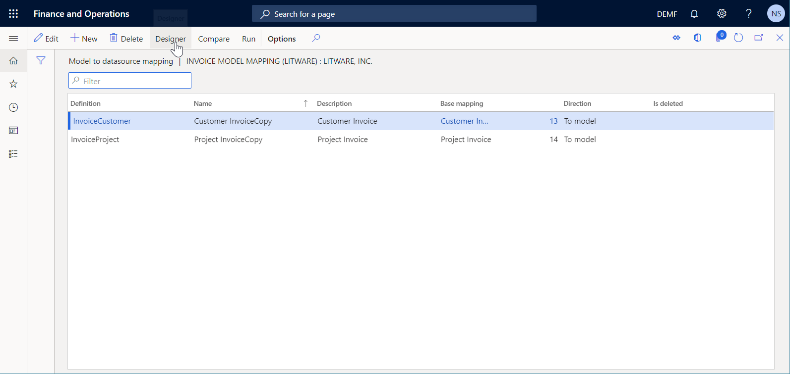

5. Select **Designer**.
6. On the **Model mapping designer** page, in the **Data sources** pane, expand the **CustInvoiceJour** data source that represents the **CustInvoiceJour** application table.
7. Under **CustInvoiceJour**, expand **Relations** to review the list of relations of the many-to-one (N:1) type for the **CustInvoiceJour** table.
8. Under **CustInvoiceJour** \> **Relations**, expand **Customers (CustTable)** to access the fields and relations of the **Customers (CustTable)** table.
9. Select the **FederalTaxID\_Custom** data source field that you implemented [earlier](#insert_custom_field).
10. In the **Data model** pane, expand **Customer information (Customer)**, and select the **FederalTaxID\_Litware** data model field.
11. Select **Bind**.

    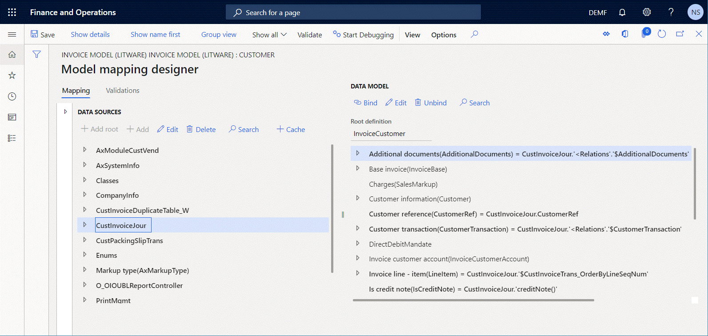

12. Select **Save**.
13. Close the **Model mapping designer** page.
14. Close the **Model to datasource mapping** page.

#### Complete a custom model mapping configuration

You must complete your work with version 50.19.1 of your custom ER model mapping configuration to make it available for use.

1. Go to **Organization administration** \> **Electronic reporting** \> **Configurations**.
2. On the **Configurations** page, in the configuration tree in the left pane, expand **Customer invoice model** \> **Customer invoice model mapping**, and select **Invoice model mapping (Litware)**.
3. On the **Versions** FastTab, select **Change status** \> **Complete**, and then select **OK**.

The status of version 50.19.1 is changed from **Draft** to **Completed**, and the version becomes read-only. A new editable version, 50.19.2, is added and has a status of **Draft**. You can use this version to make further changes in your custom ER model mapping configuration.

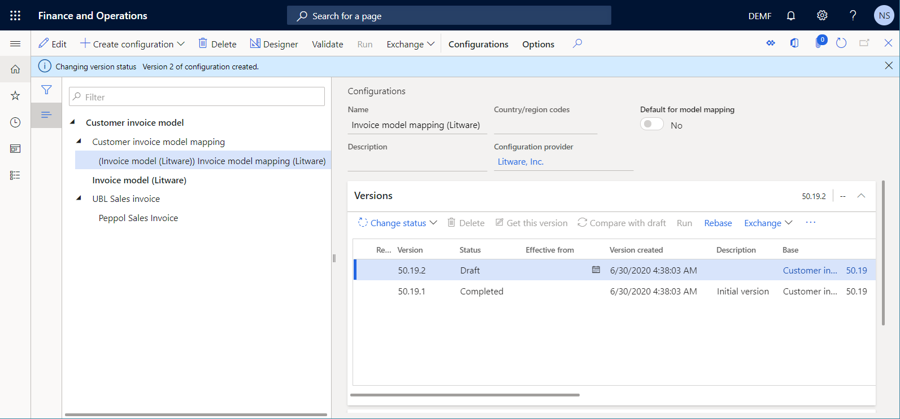

> [!NOTE]
> The supported configuration [lifecycle](general-electronic-reporting-manage-configuration-lifecycle.md) doesn't cover the lifecycle of database changes. If you export version 50.19.1 of the **Invoice model mapping (Litware)** configuration from the current Finance instance and try to import it into another instance that doesn't contain the custom **FederalTaxID\_Custom** field in the **CustTable** table, an exception will occur. The exception will state that the imported ER configuration isn't compatible with the metadata of the target Finance instance.

### Customize the format configuration

As a user in the Electronic Reporting Functional Consultant role, you can design your custom ER format.

#### Add a custom format configuration

1. Go to **Organization administration** \> **Electronic reporting** \> **Configurations**.
2. On the **Configurations** page, in the configuration tree in the left pane, expand **Customer invoice model** \> **UBL Sales invoice**, and select **Peppol Sales Invoice**.
3. On the Action Pane, select **Create configuration**.
4. In the drop-down dialog box, in the **New** field, select **Derive from Name: Peppol Sales Invoice, Microsoft** to indicate that your custom ER format configuration should be based on the ER format configuration.
5. In the **Name** field, enter **Peppol Sales Invoice (Litware)**.
6. In the **Data model** field, select **Invoice model (Litware)** to use your custom data model and model mapping components.

    > [!NOTE]
    > This step is very important. If you omit it, you won't be able to use your custom data model in the configured format.

7. In the **Data model** field, select the **InvoiceCustomer** root definition.
8. Select **Create configuration** to add the new ER configuration.

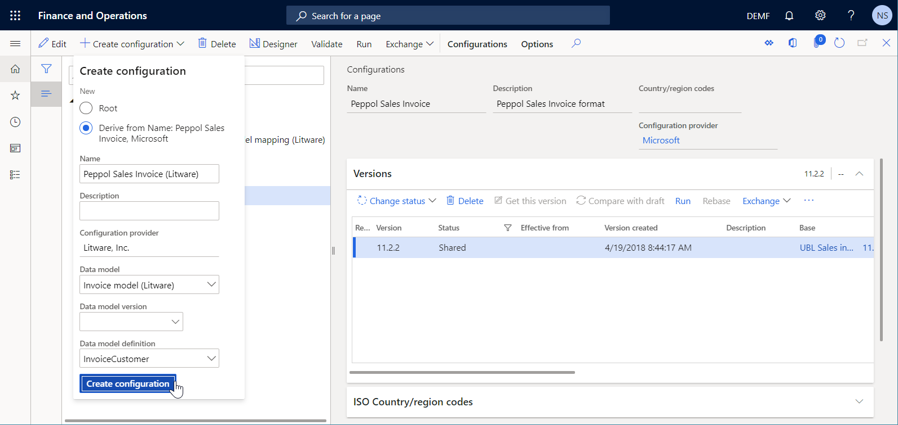

You can now use the ER Operations designer to edit version 11.2.2.1 of the **Peppol Sales Invoice (Litware)** ER configuration in **Draft** status.

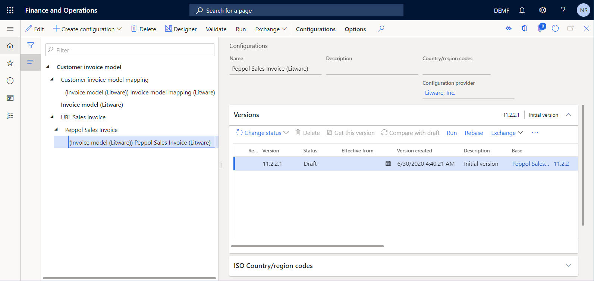

#### Configure a custom format

You must modify your custom format by adding a new format element to fill in the value of an invoiced customer's federal tax identification code.

1. Go to **Organization administration** \> **Electronic reporting** \> **Configurations**.
2. On the **Configurations** page, in the configuration tree in the left pane, expand **Customer invoice model** \> **UBL Sales invoice** \> **Peppol Sales Invoice**, and select **Peppol Sales Invoice (Litware)**.
3. On the Action Pane, select **Designer**.
4. In the format tree, expand **XMLHeader** \> **Invoice** \> **cac:AccountingCustomerParty** \> **cac:Party** \> **cac:PartyTaxScheme** \> **cac:TaxScheme**, and select **cbc:ID**.
5. Select **Add**, and then select **XML** \> **Attribute**.
6. In the **Component property** dialog box, in the **Name** field, enter **FederalTaxID**.
7. Select **OK** to add a new format element to create a new **FederalTaxID** XML attribute in a generated XML file.
8. In the format tree, under **XMLHeader** \> **Invoice** \> **cac:AccountingCustomerParty** \> **cac:Party** \> **cac:PartyTaxScheme** \> **cac:TaxScheme** \> **cbc:ID**, select **FederalTaxID**.
9. Select **Move up**.

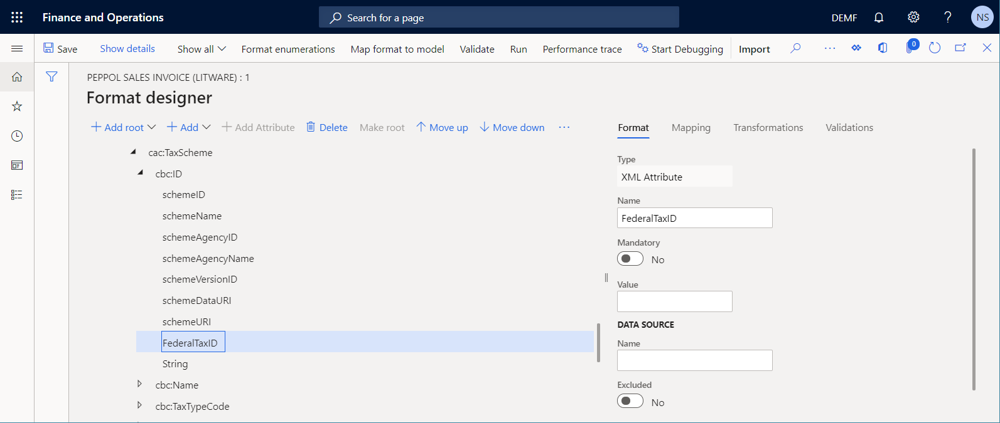

#### Configure a custom format mapping

1. On the **Format designer** page, on the **Mapping** tab, expand the **Invoice** data source of the **Model** type.
2. Under **Invoice**, expand **Customer information (Customer)**, and select **FederalTaxID\_Litware**.
3. Select **Bind**.

    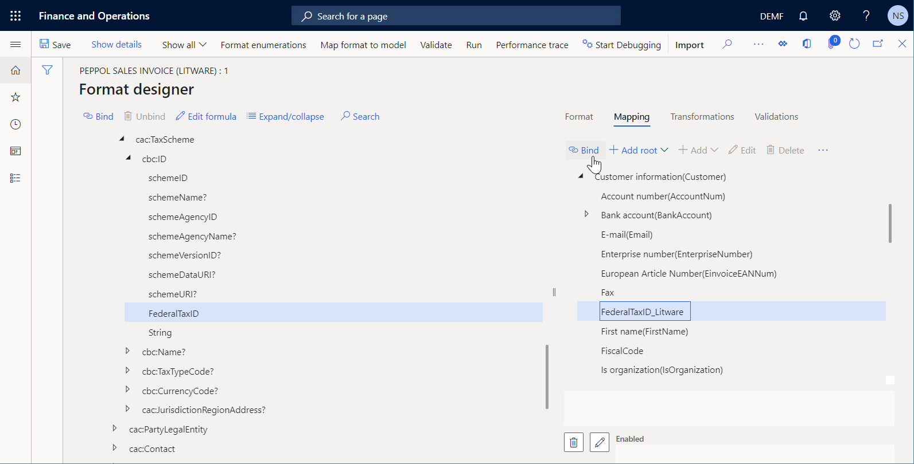

4. Select the **Invoice** data source of the **Model** type, and then select **Edit**.
5. In the **Version** field, select version **1** of your custom data model, and then select **OK**.
6. Select **Save**.
7. Close the **Format designer** page.

#### Complete a custom format configuration

You must completeyour work with version 11.2.2.1 of your custom ER format configuration to make it available for use.

1. Go to **Organization administration** \> **Electronic reporting** \> **Configurations**.
2. On the **Configurations** page, in the configuration tree in the left pane, expand **Customer invoice model** \> **UBL Sales invoice** \> **Peppol Sales Invoice**, and select **Peppol Sales Invoice (Litware)**.
3. On the **Versions** FastTab, select **Change status** \> **Complete**, and then select **OK**.

The status of version 11.2.2.1 is changed from **Draft** to **Completed**, and the version becomes read-only. A new editable version, 11.2.2.2, is added and has a status of **Draft**. You can use this version to make further changes in your custom ER format configuration.

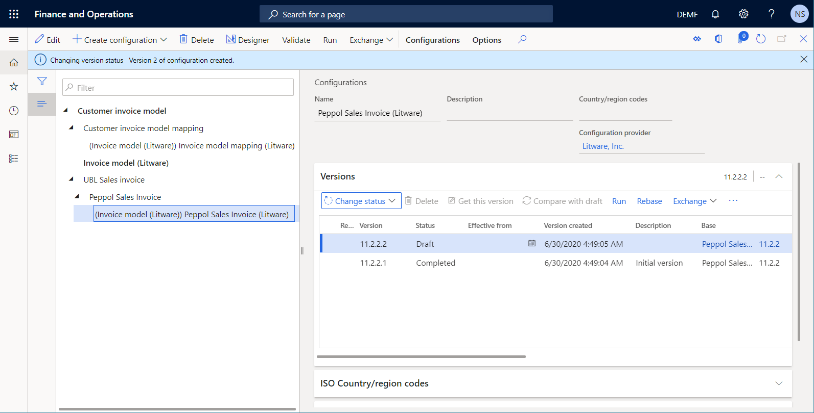

## Configure the Accounts receivable parameters to start to use custom ER configurations

1. Go to **Accounts receivable** \> **Setup** \> **Accounts receivable parameters**.
2. On the **Electronic documents** tab, on the **Electronic reporting** FastTab, in the **Sales and Free text invoice** field, select **Peppol Sales Invoice (Litware)**.
3. Select **Save**.

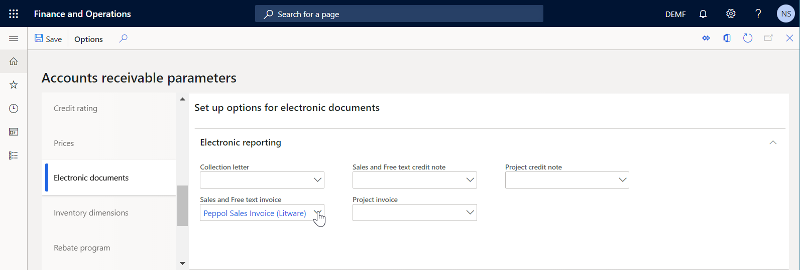

## Update a customer record by adding a federal tax identification code

1. Go to **Accounts receivable** \> **Customers** \> **All customers**.
2. On the **All customers** page, select the **DE-014** customer account link.
3. On the **General** FastTab, in the **Federal Tax ID** field, enter **LITWARE-6789**.
4. Select **Save**.

    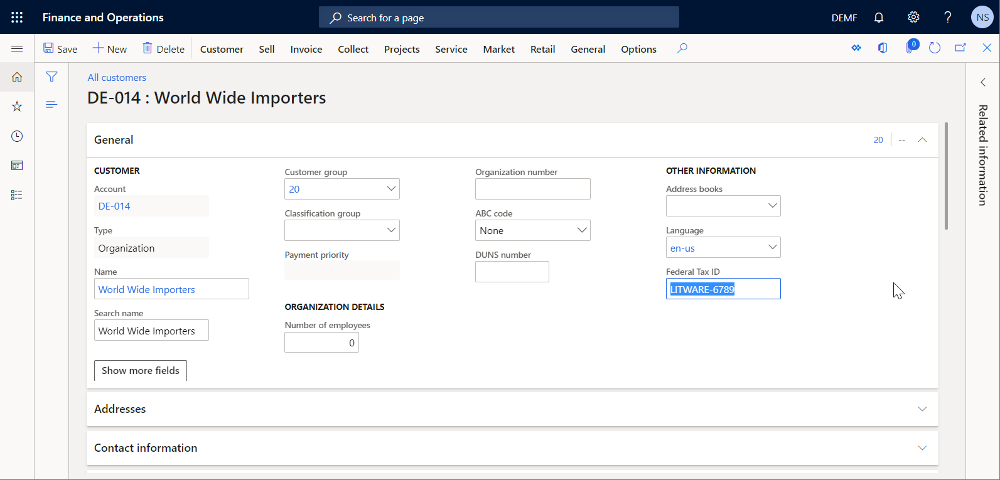

5. Close the **All customers** page.

## Process a customer invoice by using custom ER configurations

### Select and send a posted invoice

1. Go to **Accounts receivable** \> **Invoices** \> **All free text invoices**.
2. On the **Free text invoice** page, select the invoice that you previously added and posted.
3. On the Action Pane, in the **Document** group, select **Send** \> **Original**.
4. Close the **Free text invoice** page.

### Analyze a generated e-invoice

1. Go to **Organization administration** \> **Electronic reporting** \> **Electronic reporting jobs**.
2. On the **Electronic reporting jobs** page, select the latest record that has the task description **Send the eInvoice XML**.
3. Select **Show files** to access the list of generated files.
4. Select **Open** to download the e-invoice XML file that is generated.
5. Analyze the e-invoice XML file. Notice that, in accordance with your customization, the customer tax schema includes the custom **FederalTaxID** XML attribute in addition to the **schemeID** and **schemeAgencyID** XML attributes. The value of this new XML attribute is specified by the **LITWARE-6789** federal tax ID that was entered for an invoiced customer.

    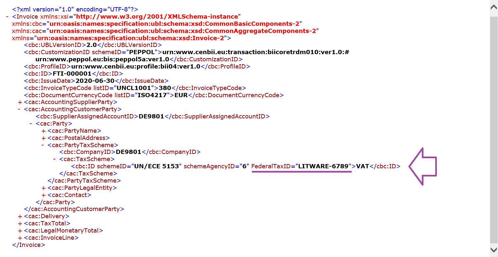

## Import the latest versions of standard ER configurations

To keep the set of standard ER configurations in your Finance instance [up to date](general-electronic-reporting-manage-configuration-lifecycle.md), you must import new versions of them whenever they become available in the ER [repository](general-electronic-reporting.md#Repository) that was configured for that instance.

1. Go to **Organization administration** \> **Workspaces** \> **Electronic reporting**.
2. On the **Localization configurations** page, in the **Configuration providers** section, select the **Microsoft** tile, and then select **Repositories** to view the list of repositories for the Microsoft provider.
3. On the **Configuration repositories** page, select the repository of the **Global** type, and then select **Open**. If you're prompted for authorization to connect to Regulatory Configuration Service, follow the authorization instructions.
4. On the **Configuration repository** page, in the configuration tree in the left pane, select the **Peppol Sales Invoice** format configuration.
5. On the **Versions** FastTab, select version **32.6.7** of the selected ER format configuration that has been released to support customer electronic invoices in PEPPOL BIS 3 format. For more information, see [KB4490320](https://support.microsoft.com/help/4490320/an-update-for-european-union-to-support-export-of-customers-electronic).
6. Select **Import** to download the selected version from the Global repository to the current Finance instance.

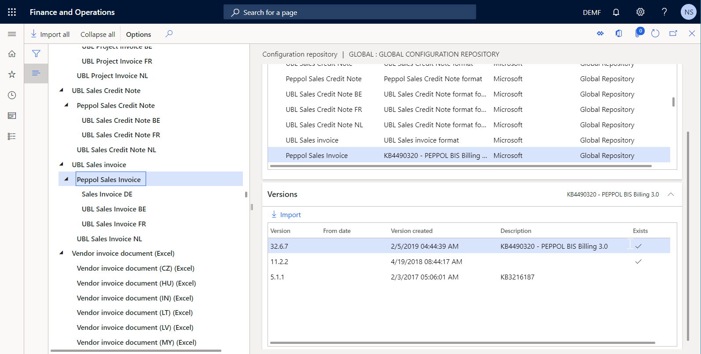

For information about how this process can be automated, see [Import updated versions of ER configurations](er-download-updated-versions-global-repo.md).

### Review the imported ER configurations

1. Go to **Organization administration** \> **Workspaces** \> **Electronic reporting**.
2. On the **Localization configurations** page, in the **Configurations** section, select the **Reporting configurations** tile.
3. Expand the **Configuration components** FastTab.
4. In the configuration tree in the left pane, expand **Invoice model**. Notice that the name of **Customer invoice model** has been changed to **Invoice model** in one of the imported ER data model configurations.
5. In the configuration tree in the left pane, expand **Invoice model mapping**. Notice that the name of **Customer invoice model mapping** has been changed to **Invoice model mapping** in one of the imported ER model mapping configurations.
6. Expand **UBL Sales invoice** \> **Peppol Sales Invoice**.

Notice that, in addition to the selected **Peppol Sales Invoice** ER format, the latest versions of other required ER configurations were imported. Because new versions of ER configurations are constantly published to the Global repository and LCS to keep the corresponding ER solutions compliant with new requirements, the latest versions of the required data model configuration and its model mapping configurations were imported.

Make sure that the following ER configurations are eventually available in the configuration tree:

- **Invoice model** ER data model configuration:

    - Version 206 (or later) contains version 24 (or later) of the data model ER component that represents the data structure of the invoicing business domain. This ER configuration has been imported as an ancestor of the latest available **Invoice model mapping** ER model mapping configuration.

    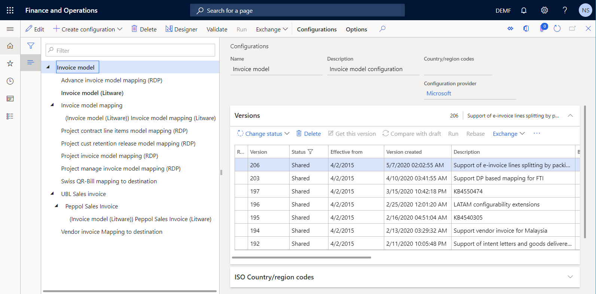

- **Invoice model mapping** ER model mapping configuration:

    - Version 206.132 (or later) has been imported as the latest implementation of version 206 of the **Invoice model** ER data model configuration. It contains several model mapping ER components that describe how the data model is filled in with application data at runtime.

    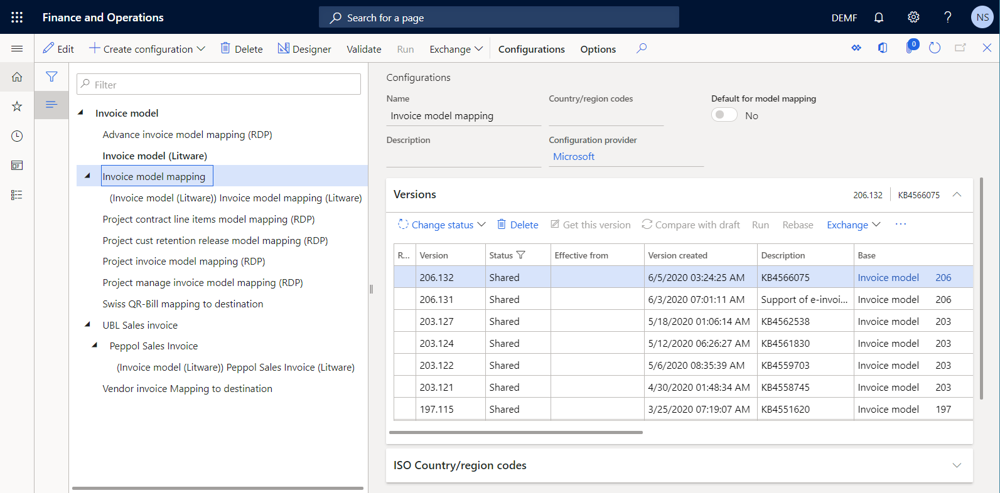

- **UBL Sales invoice** ER format configuration:

    - Version 32.6 contains the format and format mapping ER components. The format component specifies the report layout. The format mapping component contains the model data source and specifies how this data source is used to fill in the report layout at runtime. This ER format was configured to generate e-invoices in UBL format. It has been imported as a parent of the **Peppol Sales Invoice** ER format that was selected for import.

- **Peppol Sales Invoice** ER format configuration:

    - Version 32.6.7 contains the format and format mapping ER components that were configured to generate e-invoices in PEPPOL format.

    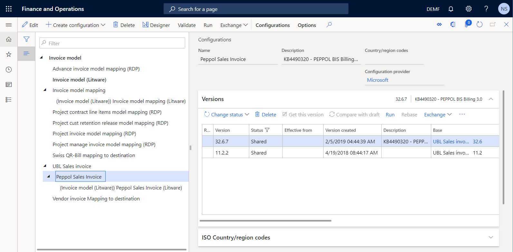

## Adopt the changes to the new standard ER configurations in your custom ER configurations

### Adopt your custom ER data model

1. Go to **Organization administration** \> **Electronic reporting** \> **Configurations**.
2. On the **Configurations** page, in the configuration tree in the left pane, expand **Invoice model**, and select **Invoice model (Litware)**.
3. On the **Versions** FastTab, for draft version **50.2** of the selected data model configuration, select **Rebase**.
4. In the **Target version** field, confirm the selection of version **206** of the base ER data model configuration, and then select **OK**.

    The draft version of your custom ER data model configuration is renumbered from **50.2** to **206.2** to indicate that it now contains your customization that was merged with the changes in the latest version (206) of the base ER data model configuration.

    > [!NOTE]
    > The rebase action is reversible. To cancel this rebase, select version **50.1** of the **Invoice model (Litware)** model on the **Versions** FastTab, and then select **Get this version**. Version 206.2 will be renumbered back to **50.2**, and the content of draft version 50.2 will match the content of version 50.1.

5. On the **Versions** FastTab, select **Change status** \> **Complete**, and then select **OK**.

The status of version 206.2 is changed from **Draft** to **Completed**, and the version becomes read-only. A new editable version, 206.3, is added and has a status of **Draft**. You can use this version to make further changes in your custom ER data model configuration.

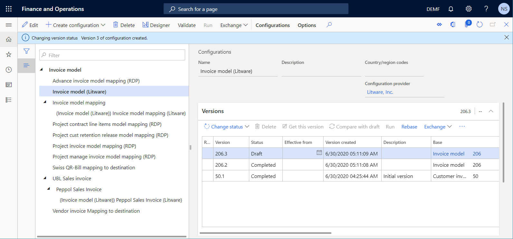

### Adopt your custom ER model mapping

1. Go to **Organization administration** \> **Electronic reporting** \> **Configurations**.
2. On the **Configurations** page, in the configuration tree in the left pane, expand **Invoice model** \> **Invoice model mapping**, and select **Invoice model mapping (Litware)**.
3. On the **Versions** FastTab, for draft version **50.19.2** of the selected model mapping configuration, select **Rebase**.
4. In the **Target version** field, confirm the selection of version **206.132** of the base ER model mapping configuration, and then select **OK**.

    The draft version of your custom ER model mapping configuration is renumbered from **50.19.2** to **206.132.2** to indicate that it now contains your customization that was merged with the changes in the latest version (206.132) of the base ER model mapping configuration.

    Notice that some rebase conflicts were discovered. You must now manually resolve those conflicts.

    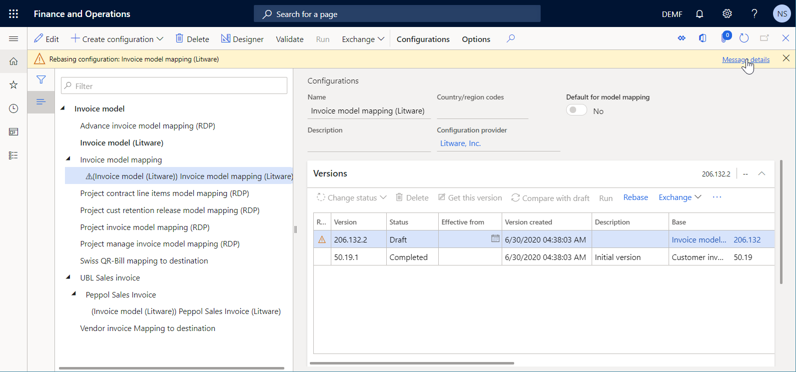

5. On the Action Pane, select **Designer**, and then, in the list of mappings, select **Customer Invoice**.
6. For each rebase conflict, select **Retain own value**, because you must keep the version number of your custom data model for every component that has been mentioned.

    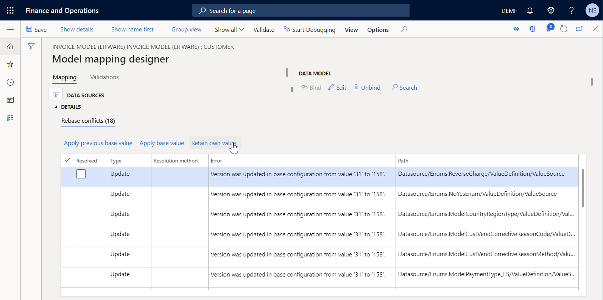

7. Select **Save**, and then close the **Model mapping designer** page.
8. In the list of mappings, select **Project Invoice**.
9. For each rebase conflict, select **Retain own value**, because you must keep the version number of your custom data model for every component that has been mentioned.
10. Select **Save**, and then close the **Model mappings** page.

    > [!NOTE]
    > The rebase action is reversible. To cancel this rebase, select version **50.19.1** of the **Invoice model mapping (Litware)** model mapping on the **Versions** FastTab, and then select **Get this version**. Version 206.132.2 will be renumbered back to **50.19.2**, and the content of draft version 50.19.2 will match the content of version 50.19.1.

11. On the **Versions** FastTab, select **Change status** \> **Complete**, and then select **OK**.

The status of version 206.132.2 is changed from **Draft** to **Completed**, and the version becomes read-only. A new editable version, 206.132.3, is added and has a status of **Draft**. You can use this version to make further changes in your custom ER model mapping configuration.

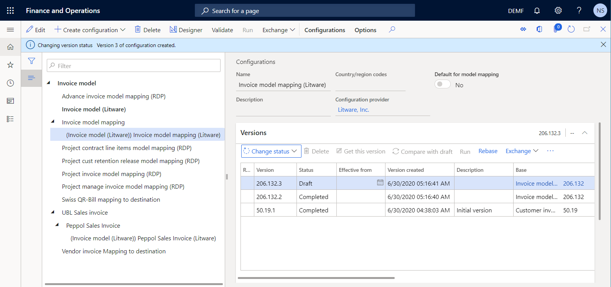

### Adopt your custom ER format

1. Go to **Organization administration** \> **Electronic reporting** \> **Configurations**.
2. On the **Configurations** page, in the configuration tree in the left pane, expand **Invoice model** \> **UBL Sales invoice** \> **Peppol Sales Invoice**, and select **Peppol Sales Invoice (Litware)**.
3. On the **Versions** FastTab, for draft version **11.2.2.2** of the selected format configuration, select **Rebase**.
4. In the **Target** version field, confirm the selection of version **32.6.7** of the base ER format configuration, and then select **OK**.

    The draft version of your custom ER format configuration is renumbered from **11.2.2.2** to **32.6.7.2** to indicate that it now contains your customization that was merged with the changes in the latest version (32.6.7) of the base ER format configuration.

    Notice that some rebase conflicts were discovered. You must now manually resolve those conflicts.

5. On the Action Pane, select **Designer**.
6. For each rebase conflict, select **Retain own value**, because you must keep the version number of your custom data model for every component that has been mentioned.
7. Select **Save**.
8. On the **Mapping** tab, select the **Invoice** data source of the **Model** type, and then select **Edit**.
9. In the **Version** field, select version **2** of your custom data model, and then select **OK**.
10. Select **Save**.

    > [!NOTE]
    > The rebase action is reversible. To cancel this rebase, select version **11.2.2.1** of the **Peppol Sales Invoice (Litware)** format on the **Versions** FastTab, and then select **Get this version**. Version 32.6.7.2 will be renumbered back to **11.2.2.2**, and the content of draft version 11.2.2.2 will match the content of version 11.2.2.1.

11. Close the **Format designer** page.
12. On the **Versions** FastTab, select **Change status** \> **Complete**, and then select **OK**.

The status of version 32.6.7.2 is changed from **Draft** to **Completed**, and the version becomes read-only. A new editable version, 32.6.7.3, is added and has a status of **Draft**. You can use this version to make further changes in your custom ER format configuration.

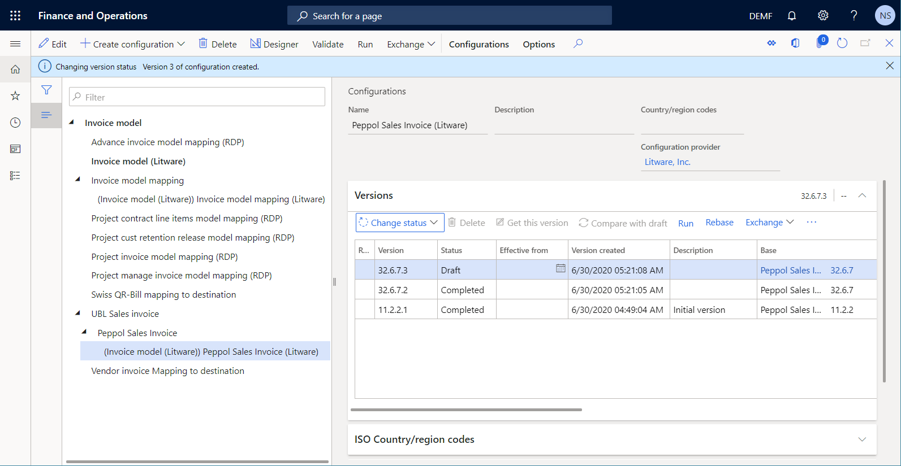

## Process a customer invoice by using new versions of the custom ER configurations

### Select and send a posted invoice

1. Go to **Accounts receivable** \> **Invoices** \> **All free text invoices**.
2. On the **Free text invoice** page, select the invoice that you previously added and posted.
3. On the Action Pane, in the **Document** group, select **Send** \> **Original**.

    > [!NOTE] 
    > Because you now have two versions of the **Peppol Sales Invoice (Litware)** ER format configuration, and neither version has an effective date value, the latest version is used to generate an e-invoice.

4. Close the **Free text invoice** page.

### Analyze a generated e-invoice

1. Go to **Organization administration** \> **Electronic reporting** \> **Electronic reporting jobs**.
2. On the **Electronic reporting jobs** page, select the most recent record that has the task description **Send the eInvoice XML**.
3. Select **Show files** to access the list of generated files.
4. Select **Open** to download the e-invoice XML file that is generated.
5. Analyze the e-invoice XML file. Notice that, in accordance with your customization, the customer tax schema still contains the custom **FederalTaxID** XML attribute in addition to the **schemeID** and **schemeAgencyID** XML attributes. Additionally, because the changes in the new version of the base **UBL Sales invoice** format were merged with your customization, the text of the **cbc:CustomizationID** XML element has been changed from `urn:www.cenbii.eu:transaction:biicoretrdm010:ver1.0:# urn:www.peppol.eu:bis:peppol5a:ver1.0` to `urn:cen.eu:en16931:2017#compliant#urn:fdc:peppol.eu:2017:poacc:billing:3.0`.

    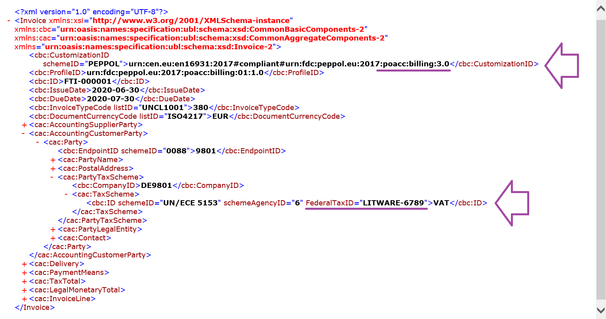

## Additional resources

- [Electronic Reporting overview](general-electronic-reporting.md)
- [Download ER configurations from Lifecycle Services](download-electronic-reporting-configuration-lcs.md)
- [Download ER configurations from Global repository of Configuration service](er-download-configurations-global-repo.md)
- [Create a free text invoice](../../../finance/accounts-receivable/create-free-text-invoice-new.md)
- [Create and work with custom fields](../../fin-ops/get-started/user-defined-fields.md)

[!INCLUDE[footer-include](../../../includes/footer-banner.md)]
