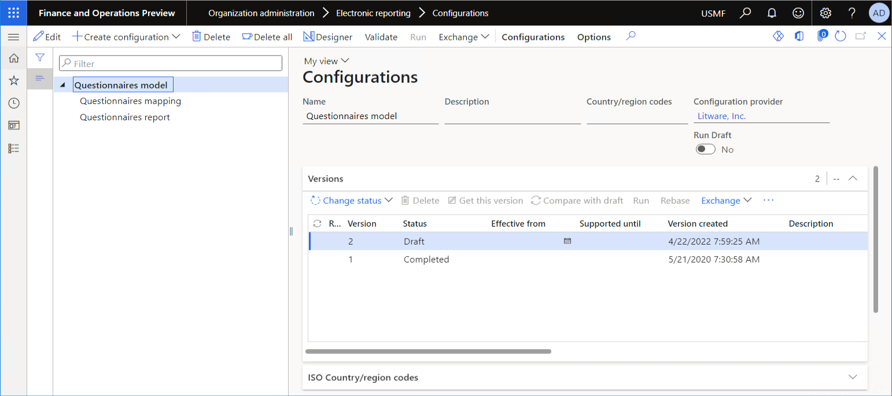
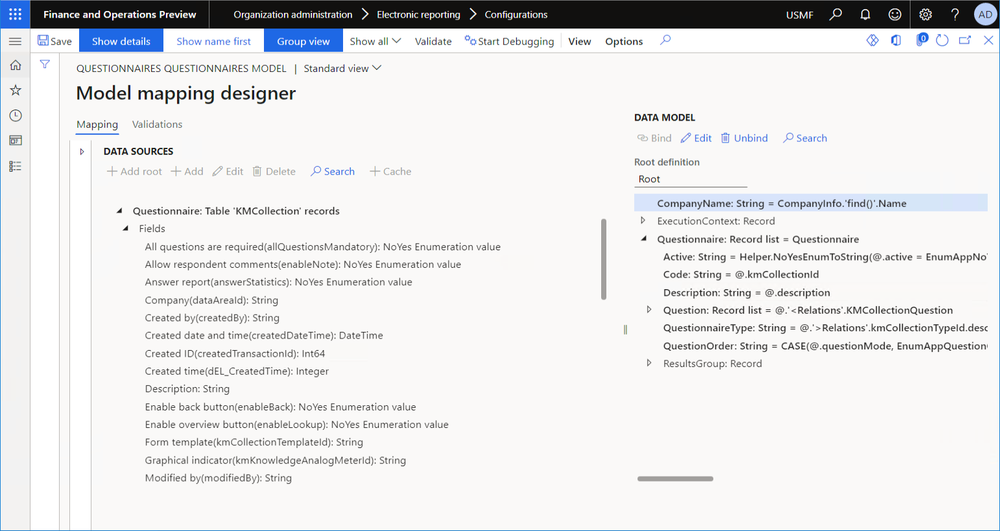
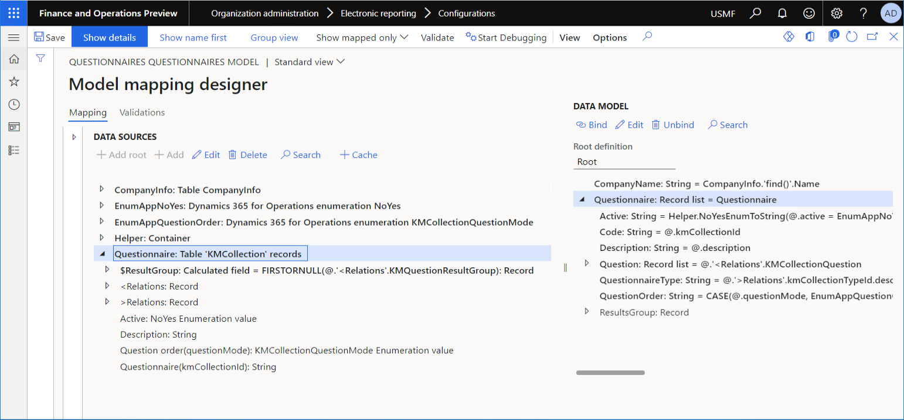
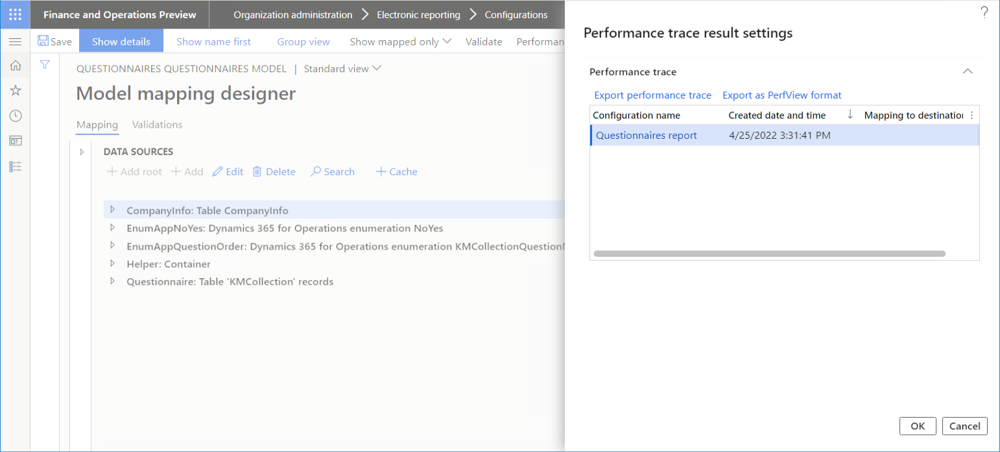
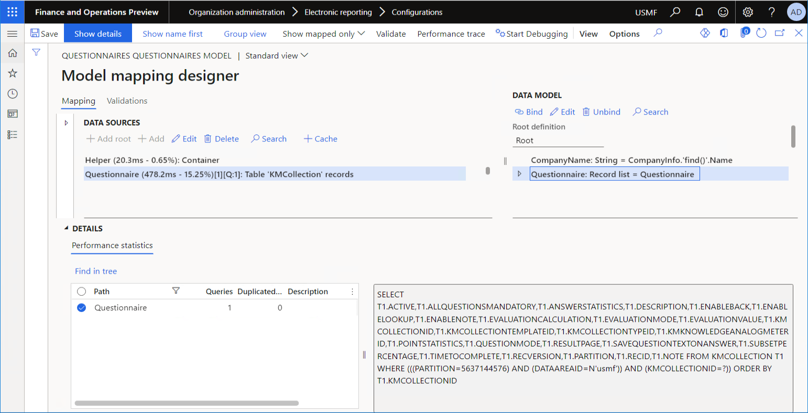
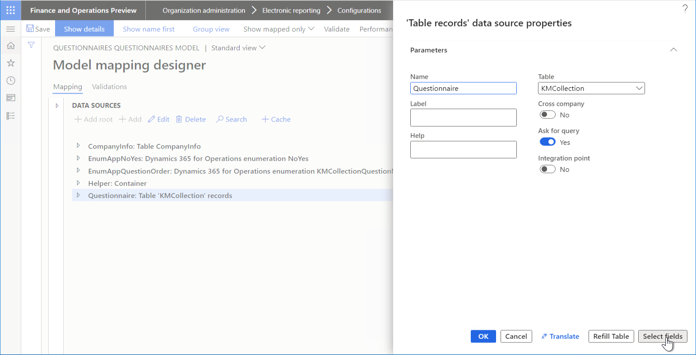
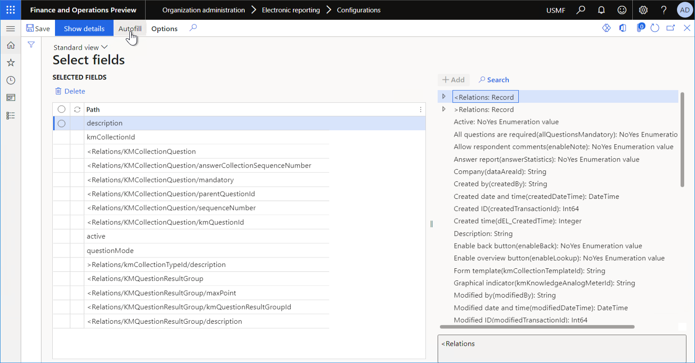
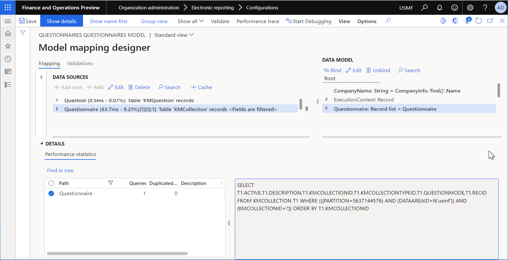

# Improve performance of ER solutions by reducing the number of table fields that are fetched at runtime

[!include[banner](../includes/banner.md)]

You can design [Electronic reporting](general-electronic-reporting.md) (ER) [formats](er-overview-components.md#format-components-for-outgoing-electronic-documents) that generate outgoing documents in various formats. When a document is generated, an ER format calls data sources that were configured in a corresponding ER [model mapping](er-overview-components.md#model-mapping-component). To configure access to application tables, queries, or entities for record retrieval, you can use ER data sources of the *Table records* type. By default, a data source of the *Table records* type retrieves the values of all fields in the requested records. However, you can configure this type of data source so that it fetches only the field values that are required for the running ER format. This configuration helps reduce memory consumption of the application server that performs data retrieval and further record caching.

To learn more about how to limit the list of fetched fields of data sources of the *Table records* type, complete the example in this article.

## Example: Reduce the number of table fields that are fetched at runtime

The following procedures show how a user in the System administrator or Electronic reporting developer role can configure an ER model mapping so that it fetches only the fields that are required to run the ER format, to help reduce the consumption of application server memory.

These procedures can be completed in the **USMF** company in Microsoft Dynamics 365 Finance. No coding is required.

To complete this example, you must have access to the **USMF** company for one of the following roles:

- Electronic reporting functional consultant
- System administrator

In this example, you will use the ER [configurations](general-electronic-reporting.md#Configuration) that are provided for the **Litware, Inc.** sample company. Make sure that the configuration provider for the **Litware, Inc.** (`http://www.litware.com`) sample company is listed for the ER framework, and that it's marked as **Active**. If this configuration provider isn't listed, or if it isn't marked as **Active**, follow the steps in [Create a configuration provider and mark it as active](tasks/er-configuration-provider-mark-it-active-2016-11.md).

### Configure the ER framework

Follow the steps in [Configure the ER framework](er-quick-start2-customize-report.md#ConfigureFramework) to set up the minimal set of ER parameters. You must complete this setup before you start to use the ER framework to modify data sources of the provided ER solution.

### Import the sample ER configurations

If you haven't yet completed the example in the [Design a new ER solution to print a custom report](er-quick-start1-new-solution.md) article, download and locally store the XML files for the following configurations of the provided ER solution.

| Content description            | File name |
|--------------------------------|-----------|
| ER data model configuration    | [Questionnaires model.version.1.xml](https://download.microsoft.com/download/b/6/3/b633bd34-d200-4422-96d9-8f62eb5218f8/Questionnaires_model.version.1.xml) |
| ER model mapping configuration | [Questionnaires mapping.version.1.1.xml](https://download.microsoft.com/download/7/b/2/7b258e4e-4bd5-46a4-8114-27419ae4acd8/Questionnaires_mapping.version.1.1.xml) |
| ER format configuration        | [Questionnaires format.version.1.1.xml](https://download.microsoft.com/download/1/b/a/1ba39ec2-257a-44d8-972f-25bf7d18fb41/Questionnaires_format.version.1.1.xml) |

Then follow these steps to upload the configurations of the provided ER solution to your Finance instance.

1. Go to **Organization administration** \> **Workspaces** \> **Electronic reporting**.
2. Select **Reporting configurations**.
3. On the **Configurations** page, import the ER data model configuration.

    1. Select **Exchange**, and then select **Load from XML file**.
    2. Select **Browse**, find and select the **Questionnaires model.version.1.xml** file, and then select **OK**.

4. Import the ER model mapping configuration.

    1. Select **Exchange**, and then select **Load from XML file**.
    2. Select **Browse**, find and select the **Questionnaires mapping.1.1.xml** file, and then select **OK**.

5. Import the ER format configuration.

    1. Select **Exchange**, and then select **Load from XML file**.
    2. Select **Browse**, find and select the **Questionnaires format.1.1.xml** file, and then select **OK**.

6. In the configuration tree, expand **Questionnaires model**.
7. Review the list of imported ER configurations in the configuration tree.

    

### Review the provided ER model mapping

1. On the **Configurations** page, select **Questionnaires mapping**.
2. On the Action Pane, select **Designer**.
3. On the **Model to datasource mapping** page, select **Designer**.
4. On the **Model mapping designer** page, on the Action Pane, select **Group view** to turn on **Group** view.
5. In the **Data model** pane, expand **Questionnaire**.

    Notice that the **Questionnaire** data source has been configured to access the `KMCollection` application table.

6. In the **Data sources** pane, expand **Table records** \> **Questionnaire** \> **Fields**.

    Notice how many fields from the `KMCollection` application table are exposed by the **Questionnaire** data source of the *Table records* type.

    

7. On the Action Pane, select **Group view** again to turn off **Group** view, and then select **Show all** \> **Show mapped only**.

    Notice that a few fields of the `KMCollection` application table are used to fill in the **Questionnaire** record list in the ER data model:

    - `Active`
    - `Description`
    - `questionMode`
    - `kmCollectionId`

    

### Turn on the ER performance trace

Follow the steps in [Turn on the ER performance trace](trace-execution-er-troubleshoot-perf.md#turn-on-the-er-performance-trace) to set the ER user parameters that enable the execution of ER components to be traced.

### Run the provided ER format by using the provided model mapping

Follow the steps in [Run a designed format from ER](er-quick-start1-new-solution.md#RunFormatFromER) to run the provided ER format for a single questionnaire from the **Configurations** page.

### Review the execution trace of the first run

1. Go to **Organization administration** \> **Electronic reporting \> Configurations**.
2. On the **Configurations** page, expand **Questionnaires model**, and select **Questionnaires mapping**.

    > [!NOTE]
    > The details on the **Versions** FastTab indicate that you selected the draft version of the **Questionnaires mapping** configuration. Therefore, you can modify the content of this model mapping.

3. On the Action Pane, select **Designer**.
4. On the **Model to datasource mapping** page, select **Designer**.
5. On the **Model mapping designer** page, on the Action Pane, select **Performance trace**.
6. In the **Performance trace result settings** dialog box, select the trace that was generated during the last format run.

    

7. Select **OK**. 
8. On the **Details** FastTab, filter the **Questionnaire** path that points to the **Questionnaire** data source.
9. Review the details of the database query that was generated when the **Questionnaire** data source was called.

    Notice that all fields of the `KMCollection` application table were fetched at runtime when the **Questionnaire** data source was called.

    

### Modify the provided ER model mapping

1. On the **Model mapping designer** page, in the **Data sources** pane, select the **Questionnaire** data source.
2. In the **Data sources** pane, select **Edit**.
3. In the **Data source properties** dialog box, select **Select fields** to specify the list of fields of the referenced `KMCollection` application table that will be fetched at runtime when the editable **Questionnaire** data source is called.

    

4. On the **Select fields** page, select **Autofill**.

    The **Selected fields** list is automatically filled in, based on preconfigured artefacts of the model mapping. All fields and relations of the referenced table that are mentioned in any binding, formula, or data source of the model mapping are added to the list.

    

5. Select **Save**, and close the **Select fields** page.
6. Select **OK** to store the changes that you've made to the data source settings.
7. On the Action Pane, select **Show all**.

    Notice that the **Questionnaire** data source now shows the text **\<Fields are filtered\>**. This text indicates that the data source has been configured to fetch a limited number of fields from the referenced application table.

    

8. Select **Save** to store the changes that you've made to the editable model mapping.

    > [!NOTE]
    > At runtime, ER analyzes the added relations and adds all fields that are used in them to the database query, even if those fields weren't explicitly added to the list of fetched fields at design time.

### Run the provided ER format by using the updated model mapping

Follow the steps in [Run a designed format from ER](er-quick-start1-new-solution.md#RunFormatFromER) to run the provided ER format for a single questionnaire from the **Configurations** page.

### Review the execution trace of the second run

1. Go to **Organization administration** \> **Electronic reporting** \> **Configurations**.
2. On the **Configurations** page, expand **Questionnaires model**, and select **Questionnaires mapping**.
3. On the Action Pane, select **Designer**.
4. On the **Model to datasource mapping** page, select **Designer**.
5. On the **Model mapping designer** page, on the Action Pane, select **Performance trace**.
6. In the **Performance trace result settings** dialog box, select the trace that was generated during the last format run.
7. Select **OK**.
8. On the **Details** FastTab, filter the **Questionnaire** path that points to the **Questionnaire** data source.
9. Review the details of the database query that was generated when the **Questionnaire** data source was called.

    Notice that only the fields that are required to fill in the data source were fetched at runtime from the `KMCollection` application table when the **Questionnaire** data source was called.

    > [!NOTE]
    > Some fields, such as the fields for the partition ID, data area ID, and record ID, are automatically added by the Data Management framework of the Finance app.

    

You can use this technique to reduce the number of fetched records when you must reduce memory consumption by the running ER model mapping and ER format.

## Limitations

When you limit the number of fetched fields for a data source of the *Table records* type, you can't use the methods of an application table that the data source refers to, because the application metadata doesn't provide information about table fields that are required to call those methods.

## Usage notes

Although the **Autofill** command automatically adds fields, it doesn't automatically delete previously added fields, even if they are no longer used in bindings, formulas, and data sources of the editable model mapping.

When you select **Autofill**, ER analyzes bindings, formulas, and the data sources that the editable model mapping had when you opened it for editing. If you change bindings, formulas, and data sources of the editable model mapping, and you want to use the **Autofill** command, close the model mapping designer, and then re-open it to edit your model mapping. 

## Additional resources

- [Trace the execution of ER formats to troubleshoot performance issues](trace-execution-er-troubleshoot-perf.md)
- [Troubleshooting performance issues in ER configurations](er-troubleshoot-perf-issues-in-configurations.md)

[!INCLUDE[footer-include](../../../includes/footer-banner.md)]
