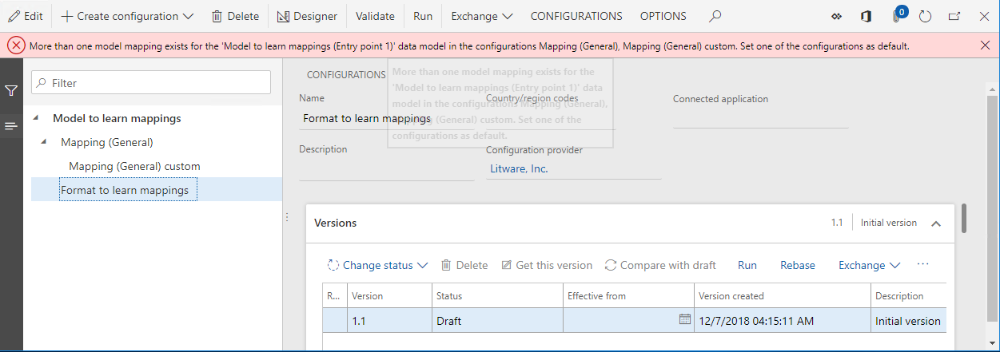

# Configure country/region context dependent ER model mappings

[!include[banner](../includes/banner.md)]

You can configure Electronic reporting (ER) model mappings so that they implement a generic ER data model but are specific to Dynamics 365 Finance. This article explains how to design multiple ER model mappings for an ER data model to control how corresponding ER formats use them when you run them from companies that have different country/region contexts.

## Prerequisites

To complete the examples in this article, you must have the following access:

- Access to Finance for one of the following roles:
  - Electronic reporting developer
  - Electronic reporting functional consultant
  - System administrator

- Access to the instance of Regulatory Configuration Services (RCS) that is provisioned for the same tenant as Finance for one of the following roles:
  - Electronic reporting developer
  - Electronic reporting functional consultant
  - System administrator

Some steps in this article require execution of an ER format. In some cases, the country/region context of the company that you're currently signed in to affects execution of an ER format. You can run an ER format in the current RCS instance if the company that has the required country/region context is available in RCS. Otherwise, you must upload a completed version of the ER model mapping and ER format configurations that use the ER data model to your Finance instance, and then run the ER format in that Finance instance. For information about how to import configurations that reside in RCS into a Finance instance, see [Import configurations from RCS](rcs-download-configurations.md).

## Single model mapping case

Follow the steps in [Appendix 1](#appendix1) of this article to design the required ER components. You now have the **Mapping (General)** model mapping configuration that contains the model mapping for the **Entry point 1** definition.

:::image type="content" source="./media/RCS-Context-specific-mapping-Tree.PNG" alt-text="Screenshot of the ER configurations page showing the Format to learn mappings configuration.":::

### Run the configured format

1. On the **Configurations page**, on the **Versions** FastTab, select **Run**.
1. Select **OK**.

The web browser offers to download the text file that the executed ER format generated. Because you configured this format to use the **Entry point 1** definition, and only a single model mapping is currently available for the base model that contains a mapping for this definition, the executed ER format uses the **Mapping (General)** model mapping of the **Mapping (General)** configuration as a data source. Therefore, the downloaded file contains the **Generic functionality 1** text.

## Multiple shared model mappings case

Follow the steps in [Appendix 2](#appendix2) of this article to design the required ER components. You now have **Mapping (General)** and **Mapping (General) custom** model mapping configurations, each of which contains the model mapping for the **Entry point 1** definition.

:::image type="content" source="./media/RCS-Context-specific-mapping-TreeCustom.PNG" alt-text="Screenshot of the ER configurations page showing the Mapping general custom configuration.":::

### Run the configured format

1. On **Configurations**, in the configurations tree, select **Format to learn mappings**.
1. On the **Versions** FastTab, select **Run**.
1. Select **OK**.

Execution of the selected ER format isn't successful. An error message informs you that more than one model mapping exists for the **Model to learn mappings** model and the **Entry point 1** definition in the **Mapping (General)** and **Mapping (General) custom** model mapping configurations. The message also recommends that you select one of those configurations as the default configuration.

### Define a default mapping configuration

Follow these steps to define the **Mapping (General) custom** model mapping configuration as the default configuration, so that you can use its mappings as data sources for the **Format to learn mappings** ER format.

1. On **Configurations**, in the configurations tree, select **Mapping (General) custom**.
1. Select **Edit** to make the current page ready for editing.
1. Set the **Default for model mapping** option to **Yes**.
1. Select **Save**.

:::image type="content" source="./media/RCS-Context-specific-mapping-MappingsCustomDefault.PNG" alt-text="Screenshot of the ER configurations page showing the Default for model mapping slider set to Yes.":::

### Run the configured format

1. On **Configurations**, in the configurations tree, select **Format to learn mappings**.
1. On the **Versions** FastTab, select **Run**.
1. Select **OK**.

The execution of the selected ER format succeeds. The web browser offers to download the text file that the executed ER format generated. Because you configured this format to use the **Entry point 1** definition, and you selected the **Mapping (General) custom** model mapping configuration as the default configuration, the executed ER format uses the **Mapping (General) copy** model mapping of the **Mapping (General) custom** configuration as a data source. Therefore, the downloaded file contains the **Generic functionality 1 custom** text.

> [!NOTE]
> If you change the company that you're currently signed in to and run this ER format again, you get the same content in the generated file, because the default ER model mapping configuration doesn't contain any company-dependent restrictions.

## Multiple mixed model mappings case

Follow the steps in [Appendix 3](#appendix3) of this article to design the required ER components. You now have **Mapping (General)**, **Mapping (General) custom**, and **Mapping (FR) model mapping** configurations that contain the model mapping for the **Entry point 1** definition.

Version 1 of the **Mapping (FR)** model mapping configuration is configured so that it applies only to ER formats of the **Model to learn mappings** model that run in Finance companies that have French country/region context.

:::image type="content" source="./media/RCS-Context-specific-mapping-TreeFR.PNG" alt-text="Screenshot of the ER configurations page showing the Model mapping (FR) configuration.":::

### Run the configured format

1. Change the company to **FRSI**.
1. On **Configurations**, in the configurations tree, select **Format to learn mappings**.
1. On the **Versions** FastTab, select **Run**.
1. Select **OK**.

The execution of the selected ER format succeeds. The web browser offers to download the text file that the executed ER format generated. Because this format uses the **Entry point 1** definition and the **Mapping (General) custom** model mapping configuration is selected as the default configuration, the executed ER format uses the **Mapping (General) copy** model mapping of the **Mapping (General) custom** configuration as a data source. Therefore, the downloaded file contains the **Generic functionality 1 custom** text.

### Define the France-specific mapping configuration as the default configuration

Follow these steps to define the custom **Mapping (FR)** model mapping configuration as the default configuration. Because this mapping is specific to France, it's the default mapping between all model mapping configurations that have the **FR** country code specified in the **ISO country/region codes** field.

1. On **Configurations**, in the configurations tree, select **Mapping (FR)**.
1. Select **Edit** to make the current page ready for editing.
1. Set the **Default for model mapping** option to **Yes**.
1. Select **Save**.

:::image type="content" source="./media/RCS-Context-specific-mapping-TreeFRDefault.PNG" alt-text="Screenshot of the ER configurations page showing the Mapping (FR) configuration with the Default for model mapping slider set to Yes.":::

### Run the configured format

1. On **Configurations**, in the configurations tree, select **Format to learn mappings**.
1. On the **Versions** FastTab, select **Run**.
1. Select **OK**.

The execution of the selected ER format succeeds. The web browser offers to download the text file that the executed ER format generated. Because this format uses the **Entry point 1** definition and the **Mapping (FR)** model mapping configuration is selected as the default configuration, the executed ER format uses the **Mapping (FR)** model mapping of the **Mapping (FR)** configuration as a data source. Therefore, the downloaded file contains the **FR functionality 1** text.

> [!NOTE]
> If you change the company that you're currently signed in to and run this ER format again, the output depends on the country/region context of the selected company.

## Other model mapping cases

As you saw, the selection of a model mapping for the execution of an ER format works in the following way:

1. You specify the model mapping definition that an ER format uses (**Entry point 1** in the examples in this article).
1. You can potentially use all mapping configurations that contain a mapping that has the specified definition and satisfy any country/region context restrictions that you configure to run the ER format (**Mapping (General)**, **Mapping (General) custom**, and **Mapping (FR)** in the examples in this article).
1. Any default model mapping that has country/region context restrictions has the highest priority for selection (**Mapping (FR)** in the examples in this article).
1. Any default model mapping that doesn't have country/region context restrictions has the next higher priority for selection  (**Mapping (General) custom** in the examples in this article).
1. Any model mapping that has country/region context restrictions has higher priority for selection than a model mapping that doesn't have country/region context restrictions.

The following table provides information about the results of model mapping selection for all possible cases for model mapping settings:

- Column 1 indicates whether the first model mapping that doesn't have country/region context restrictions (for example, the shared **Mapping (General)** mapping) is presented and, if it is, whether the **Default for model mapping** option is set to **Yes** for it.
- Column 2 indicates whether the second model mapping that doesn't have country/region context restrictions (for example, the shared **Mapping (General) custom** mapping) is presented and, if it is, whether the **Default for model mapping** option is set to **Yes** for it.
- Column 3 indicates whether the first model mapping that has country/region A context restrictions (for example, the France-specific **Mapping (FR)** mapping) is presented and, if it is, whether the **Default for model mapping** option is set to **Yes** for it.
- Column 4 indicates whether the second model mapping that has country/region A context restrictions is presented and, if it is, whether the **Default for model mapping** option is set to **Yes** for it.
- Column 5 presents the result of a model mapping selection for execution of an ER format under the control of a company that has country/region A context.
- Column 6 presents the result of a model mapping selection for execution of an ER format under the control of a company that has country/region B context.

In the table, a plus sign (+) indicates the presence of a model mapping configuration in the current instance of the Microsoft Azure service that is used to run an ER format (either Finance or RCS).

| Case | Model mapping 1 without country/region context (MM1) | Model mapping 2 without country/region context (MM2) | Model mapping 1 with country/region A context (MM1A) | Model mapping 2 with country/region A context (MM2A) | Run under control of a company that has country/region A context | Run under the control of a company that has country/region B context |
|---------|---------|---------|---------|---------|---------------------------|----------------------------|
|         |     1   |     2   |    3    |    4    |           5               |            6               |
|     1   |         |         |         |         | Error (missing mapping)   | Error (missing mapping)    |
|     2   |     +   |         |         |         | MM1                       | MM1                        |
|     3   |     +   |     +   |         |         | Error (multiple mappings) | Error (multiple mappings)  |
|     4   |     +   |         |    +    |         | MM1A                      | MM1                        |
|     5   |     +   |         |    +    |    +    | Error (multiple mappings) | MM1                        |
|     6   |     +   | default |    +    |    +    | MM2                       | MM2                        |
|     7   |     +   |         | default |         | MM1A                      | MM1                        |
|     8   |     +   |         | default |    +    | MM1A                      | MM1                        |
|     9   |     +   |         | default | default | Error (multiple mappings) | MM1                        |
|    10   | default |         |         |         | MM1                       | MM1                        |
|    11   | default |    +    |         |         | MM1                       | MM1                        |
|    12   | default |         |    +    |         | MM1                       | MM1                        |
|    13   | default | default |         |         | Error (multiple mappings) | Error (multiple mappings)  |
|    14   | default |         | default |         | MM1A                      | MM1                        |
|    15   | default |         | default | default | MM1A                      | MM2A                       |
|    16   |         |         |    +    |    +    | MM1A                      | MM2A                       |
|    17   |         |         | default | default | MM1A                      | MM2A                       |

## Learn what mapping was used in the execution of an ER format

### Configure ER user parameters

1. On **Configurations**, on the Action Pane, on the **CONFIGURATIONS** tab, select **User parameters**.
1. Set the **Run in debug mode** option to **Yes**.
1. Select **Ok**.

### Run the configured format

1. On **Configurations**, in the configurations tree, select **Format to learn mappings**.
1. On the **Versions** FastTab, select **Run**.
1. Select **Ok**.

### Review the ER debug log

1. In the navigation pane, go to **Modules \> Organization administration \> Electronic reporting \> Configuration debug log**.
1. Select the **Reload this page** button.

:::image type="content" source="./media/RCS-Context-specific-mapping-DebugLog.PNG" alt-text="Screenshot of the ER run logs page.":::

A new record is added to the ER debug log for the executed ER format. Because the **Level** field of this record is set to **Info**, the record is informational. Because the **Format component** field is set to **Mapping configuration**, the record informs you about a model mapping that was used during execution of the **Format to learn mappings** ER format (selected in the **Configuration name** field). The content of the **Generated text** field informs you that the **Mapping (FR)** mapping component that resides in the **Mapping (FR)** configuration is used to run this report.

##  Appendix 1

### Configure a sample data model

Sign in to your RCS instance.

In this example, you create a configuration for sample company, Litware, Inc. To complete these steps, you must first complete, in RCS, the steps in the [Create a configuration provider and mark it as active](tasks/er-configuration-provider-mark-it-active-2016-11.md) procedure.

#### Create an ER data model configuration

1. On the default dashboard, select **Electronic reporting**.
1. Select the **Reporting configurations** tile.
1. On **Configurations**, select **Create configuration**.
1. In the drop-down dialog box, in the **Name** field, enter **Model to learn mappings**.
1. Select **Create configuration**.
1. Select the **Configuration components** FastTab.

Draft version 1 of this ER configuration is ready for editing. This version contains the data model component.

#### Design a sample data model

1. On the **Configurations page**, select **Designer**.
1. Select **New**.
1. In the drop-down dialog box, in the **Name** field, enter **Entry point 1**.
1. Select **Add**.
1. Select **New**.
1. In the drop-down dialog box, in the **Name** field, enter **Functionality description**.
1. Select **Add**.
1. Select **New**.
1. In the drop-down dialog box, in the **New node** field group, select **Model root**.
1. In the **Name** field, enter **Entry point 2**.
1. Select **Entry point 2**.
1. Select **Add**.
1. Select **New**.
1. In the drop-down dialog box, in the **Name** field, enter **Functionality description**.
1. Select **Add**.

    :::image type="content" source="./media/RCS-Context-specific-mapping-Model.PNG" alt-text="Screenshot of the ER data model designer page.":::

1. Select **Save**.
1. Close the page.

#### Complete the modified version of the model configuration

1. On **Configurations**, on the **Versions** FastTab, select **Change status**.

    > Change the status of designed model configuration from **Draft** to **Completed**, so that you can use it to design the required model mappings and formats.

1. Select **Complete**.
1. Select **OK**.

The configuration that you created is saved as completed version 1.

### Configure a sample model mapping

#### Create an ER model mapping configuration

1. On **Configurations**, select **Create configuration**.
1. In the drop-down dialog box, in the **New** field group, select **Model mapping based on data model Model to learn mappings**.
1. In the **Name** field, enter **Mapping (General)**.
1. In the **Data model definition** field, select **Entry point 1**.
1. Select **Create configuration**.

Draft version 1 of this ER configuration is ready for editing. This version contains the model mapping component.

#### Design a sample model mapping

1. On **Configurations**, select **Designer**.

    The model mapping of the **To model** direction type is automatically added to this component for the **Entry point 1** definition.

1. Select **Designer** to start editing the added model mapping.
1. In the **Data model** section, select **Edit**.
1. In the **Formula** field, enter **"Generic functionality 1"**.
1. Select **Save**.
1. Close the **Formula designer**.

    :::image type="content" source="./media/RCS-Context-specific-mapping-Mapping1.PNG" alt-text="Screenshot of the ER model mapping designer page showing the Entry point 1 definition.":::

1. Select **Save**.
1. Close the **Model mapping designer**.
1. Select **New**.
1. In the **Definition** field, select **Entry point 2**.
1. In the **Name** field, enter **Mapping (General) 2**.
1. Select **Designer**.
1. In the **Data model** section, select **Edit**.
1. In the **Formula** field, enter **"Generic functionality 2"**.
1. Select **Save**.
1. Close the **Formula designer**.

    :::image type="content" source="./media/RCS-Context-specific-mapping-Mapping2.PNG" alt-text="Screenshot of the ER model mapping designer page showing the Entry point 2 definition.":::

1. Select **Save**.
1. Close the **Model mapping designer**.

    :::image type="content" source="./media/RCS-Context-specific-mapping-Mappings.PNG" alt-text="Screenshot of the ER model mappings page with entry point definitions.":::

1. Close the **Model mappings**.

#### Complete the modified version of the model mapping configuration

1. On **Configurations**, on the **Versions** FastTab, select **Change status**.

    > Change the status of designed model mapping configuration from **Draft** to **Completed**, so that ER formats can use it.

1. Select **Complete**.
1. Select **OK**.

The configuration is saved as completed version 1.

### Configure a sample format

#### Create an ER format configuration

1. On **Configurations**, in the configurations tree, select **Model to learn mappings**.
1. Select **Create configuration**.
1. In the drop-down dialog box, in the **New** field group, select **Format based on data model Model to learn mappings**.
1. In the **Name** field, enter **Format to learn mappings**.
1. In the **Data model definition** field, select **Entry point 1**.
1. Select **Create configuration**.

Draft version 1 of this ER configuration is ready for editing. This version contains the format component.

#### Design a sample format

1. On **Configurations**, select **Designer**.
1. Select **Add root**.
1. In the **Text** group, select the **String** item.
1. Select **OK**.

#### Bind format elements to a data source

1. On **Format designer**, on the **Mapping** tab, expand the model data source.
1. Select the **Functionality description** field.
1. Select **Bind**.

    :::image type="content" source="./media/RCS-Context-specific-mapping-Format.PNG" alt-text="Screenshot of the ER format designer page.":::

1. Select **Save**.
1. Close the page.

##  Appendix 2

### Configure a sample model mapping for general customization

You might want to customize a model mapping that a configuration provider (partner) provided to you, and then use the customized version as a data source for your ER formats. In this case, you must create a custom ER model mapping configuration to make the required changes in existing model mappings. The procedures in this appendix use the **Mapping (General)** model mapping as an example.

#### Create an ER model mapping configuration

1. On the **Configurations** page, in the configurations tree, select **Mapping (General)**.
1. Select **Create configuration**.
1. In the drop-down dialog box, in the **New** field group, select **Derive from Name: Mapping (General), Litware, Inc.**.
1. In the **Name** field, enter **Mapping (General) custom**.
1. Select **Create configuration**.

Draft version 1 of this ER configuration is ready for editing.

#### Design a sample model mapping

1. On **Configurations**, select **Designer**.

    > The model mappings of the base configuration are automatically copied to this configuration.

1. Select the **Mapping (General) Copy** mapping.
1. Select **Designer**.
1. In the **Data model** section, select **Edit**.
1. In the **Formula** field, enter **"Generic functionality 1 custom"**.
1. Select **Save**.
1. Close the page.

    :::image type="content" source="./media/RCS-Context-specific-mapping-Mapping1Custom.PNG" alt-text="Screenshot of the ER model mapping designer page showing the Generic functionality 1 custom formula.":::

1. Select **Save**.
1. Close the page.
1. Select the **Mapping (General) 2 Copy** mapping.
1. Select **Designer**.
1. In the **Data model** section, select **Edit**.
1. In the **Formula** field, enter **"Generic functionality 2 custom"**.
1. Select **Save**.
1. Close the page.

    :::image type="content" source="./media/RCS-Context-specific-mapping-Mapping2Custom.PNG" alt-text="Screenshot of the ER model mapping designer page showing the Generic functionality 2 custom formula.":::

1. Select **Save**.
1. Close the page.

    :::image type="content" source="./media/RCS-Context-specific-mapping-MappingsCustom.PNG" alt-text="Screenshot of the ER model to datasource mapping page for Mapping (General) copy mapping.":::

1. Close the page.

#### Complete the modified version of the model mapping configuration

1. On **Configurations**, on the **Versions** FastTab, select **Change status**.

    > Change the status of designed model mapping configuration from **Draft** to **Completed**, so that ER formats can use it.

1. Select **Complete**.
1. Select **OK**.

The configuration is saved as completed version 1.

##  Appendix 3

### Configure a sample model mapping for country/region-specific customization

For some ER formats, country/region-specific requirements exist for data preparation. In this case, manage a separate ER model mapping configuration to isolate the implementation of these country/region-specific requirements from the general implementation. The procedures in this appendix use the **Format to learn mappings** ER format and French-specific requirements as an example.

#### Create an ER model mapping configuration

First, create a new ER model mapping configuration to implement the country/region-specific requirements. Use your custom ER model mapping configuration as a base.

1. On **Configurations**, in the configurations tree, select **Mapping (General) custom**.
1. Select **Create configuration**.
1. In the drop-down dialog box, in the **New** field group, select **Derive from Name: Mapping (General) custom, Litware, Inc**.
1. In the **Name** field, enter **Mapping (FR)**.
1. Select **Create configuration**.

Draft version 1 of this ER configuration is ready for editing.

#### Design a sample model mapping

1. On **Configurations**, select **Designer**.

    > Model mappings of the base configuration are automatically copied to this configuration.

1. Select the **Mapping (General) Copy Copy** mapping.
1. Rename it **Mapping (FR)**.
1. Select **Designer**.
1. In the **Data model** section, select **Edit**.
1. In the **Formula** field, enter **"FR functionality 1"**.
1. Select **Save**.
1. Close the page.

    :::image type="content" source="./media/RCS-Context-specific-mapping-Mapping1FR.PNG" alt-text="Screenshot of the ER model mapping designer page showing the FR functionality 1 formula.":::

1. Select **Save**.
1. Close the page.
1. Select the **Mapping (General) 2 Copy Copy** mapping.
1. Rename it **Mapping (FR) 2**.
1. Select **Designer**.
1. In the **Data model** section, select **Edit**.
1. In the **Formula** field, enter **"FR functionality 2"**.
1. Select **Save**.
1. Close the page.

    :::image type="content" source="./media/RCS-Context-specific-mapping-Mapping2FR.PNG" alt-text="Screenshot of the ER model mapping designer page showing the FR functionality 2 formula.":::

1. Select **Save**.
1. Close the page.

    :::image type="content" source="./media/RCS-Context-specific-mapping-MappingsFR.PNG" alt-text="Screenshot of the ER model to data source mapping page.":::

1. Close the page.

#### Specify country/region context restrictions for use

1. On **Configurations**, on the **ISO Country/region codes** FastTab, select **New**.
1. In the **ISO** field, select **FR**.
1. Select **Save**.

You must sign in to a specific company in Finance to run an ER format. Therefore, this company controls both ER format execution and selection of the correct ER model mapping of the base ER data model. By adding the **FR** country code, you specify that this model mapping is available for selection by an ER format of the base data model only when that format runs under the control of a company that has French country/region context.

You can add multiple country/region codes for a single version of an ER model mapping configuration. In this way, model mappings that reside in that model mapping configuration can be used for an ER format that runs under the control of companies that have a different country/region context.

The list of country/region codes can vary between versions. Each version of an ER model mapping configuration specifies its own list.

#### Complete the modified version of the model mapping configuration

1. On **Configurations**, on the **Versions** FastTab, select **Change status**.

    > Change the status of designed model mapping configuration from **Draft** to **Completed**, so that ER formats can use it.

1. Select **Complete**.
1. Select **OK**.

The configuration is saved as completed version 1.

## Additional resources

[Electronic reporting (ER) overview](general-electronic-reporting.md)

[Manage ER model mapping in separate ER configurations](./tasks/er-manage-model-mapping-configurations-july-2017.md)

[Apply country/region context](../lcs-solutions/apply-country-context.md)

## Frequently asked questions

#### I configured two shared ER model mapping configurations in RCS and marked one of them as the default model mapping configuration. I successfully ran an ER format that was created for the same base ER data model configuration, to test model mappings. I then imported the whole ER solution (ER data model, two ER model mapping configurations, and ER format configuration) into Finance. Why do I receive an error message when I try to run the same ER format in Finance?

The default model mapping setting is environment-specific. You configure it in RCS but it isn't exported to Finance. To successfully run this ER format, you must mark one of ER model mapping configurations as the default model mapping configuration in Finance too.

#### I configured one model mapping as a shared model mapping and completed the draft version of it. I then added a new model mapping configuration for same data model and configured it as French-specific. Why is the shared model mapping selected when I run an ER format, even though this ER format uses the correct root definition and execution is done under the control of the company that has French country/region context?

Make sure that you don't mark the shared model mapping configuration as the default model mapping configuration. Otherwise, it has higher priority during mapping selection. Also make sure that the French-specific model mapping configuration is considered when a mapping is selected during ER format execution. An ER model mapping configuration is available for selection only if at least one of the following conditions is met:

- At least one version of the ER model mapping configuration has either **Completed** or **Shared** status. In this case, the version that has the highest version number is used for ER format execution.
- The **Run draft** option for the ER model mapping configuration is turned on. In this case, the version that has **Draft** status is used for ER format execution.

> The **Run draft** option becomes available on the **Configurations** page for each ER model mapping configuration when the **Run setting** ER user parameter is turned on.

[!INCLUDE[footer-include](../../../includes/footer-banner.md)]
