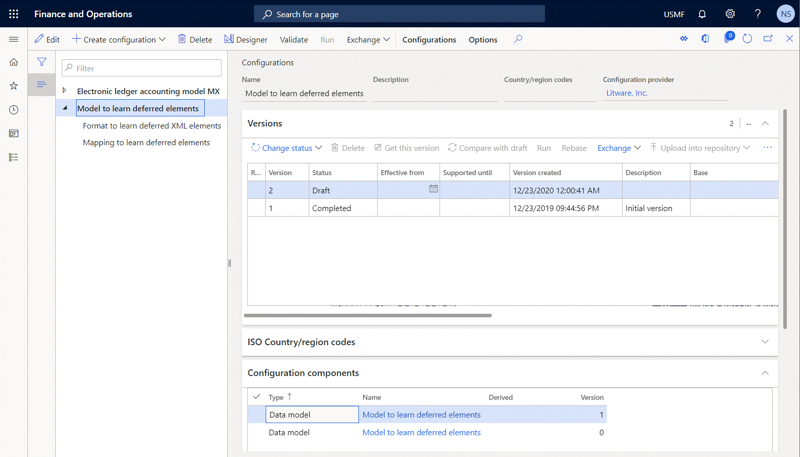
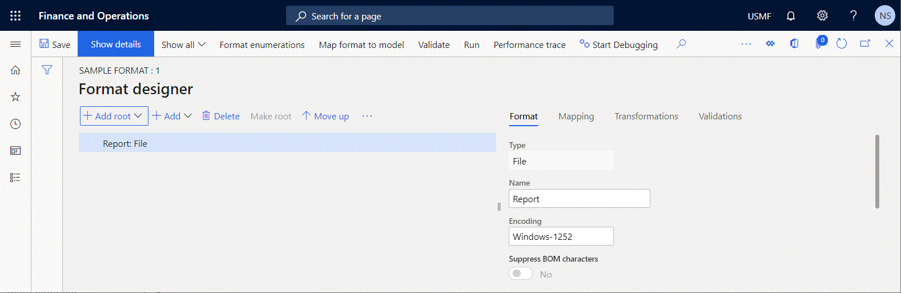
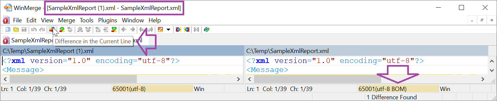

# Design ER configurations to suppress BOM characters in generated files

[!include [banner](../includes/banner.md)]

You can design an [Electronic reporting (ER)](general-electronic-reporting.md) [solution](er-quick-start1-new-solution.md) to generate outgoing documents. To generate the documents as text or XML files, the solution must include an ER [configuration](general-electronic-reporting.md#Configuration) that contains an ER format component. To specify the [character encoding](/windows/win32/intl/character-sets) that represents the set of characters in generated files, the ER format must contain the **Common\\File** format element. To configure the ER format component, open the draft version of the ER configuration in the ER format designer, and add the **Common\\File** element. In the **Encoding** field, specify the encoding of outbound files that are generated at runtime by using this component.

> [!NOTE]
> If the format contains an incorrect encoding name, an error is thrown when you save your changes to the format's settings.

If you specify **UTF-8**, **UTF-16**, or **UTF-32** as the encoding, the **Suppress BOM characters** option becomes available. Set this option to **Yes** to suppress [byte order mark (BOM) characters](/globalization/encoding/byte-order-mark) in outbound files that are generated at runtime when the editable ER format is run.

> [!NOTE]
> If you leave the **Encoding** field blank, the default **UTF-8** encoding is used.

To review the functionality at runtime, complete the appropriate procedure. For example, complete the steps in the [Defer the execution of XML elements in ER formats](er-defer-xml-element.md) article. After you've completed the steps in the [Modify the format so that the calculation is based on generated output](er-defer-xml-element.md#modify-the-format-so-that-the-calculation-is-based-on-generated-output) section of that article, follow these additional steps.

1. Specify the UTF encoding:

    1. Select the **Report** element of the **Common\\File** type.
    2. In the **Encoding** field, specify the **UTF-8** encoding.

2. Generate an XML file that includes a BOM character:

    1. Set the **Suppress BOM characters** option to **No** to include BOM characters in generated XML files.
    2. Complete the steps in the [Defer the execution of the summary XML element so that the calculated total is used](er-defer-xml-element.md#defer-the-execution-of-the-summary-xml-element-so-that-the-calculated-total-is-used) section of the [Defer the execution of XML elements in ER formats](er-defer-xml-element.md) article, and save the generated file as **SampleXmlReport.xml**.

3. Generate an XML file that doesn't include a BOM character:

    1. Set the **Suppress BOM characters** option to **Yes** to suppress BOM characters in generated XML files.
    2. Complete the steps in the [Defer the execution of the summary XML element so that the calculated total is used](er-defer-xml-element.md#defer-the-execution-of-the-summary-xml-element-so-that-the-calculated-total-is-used) section of the [Defer the execution of XML elements in ER formats](er-defer-xml-element.md) article, and save the generated file as **SampleXmlReport (1).xml**.

4. In a file comparison utility, compare the generated files.

    The first difference that you will notice is in the file header. The SampleXmlReport.xml file contains a BOM character, where the SampleXmlReport (1).xml file doesn't.

    

## See also

- [Defer the execution of XML elements in ER formats](er-defer-xml-element.md)

[!INCLUDE[footer-include](../../../includes/footer-banner.md)]
