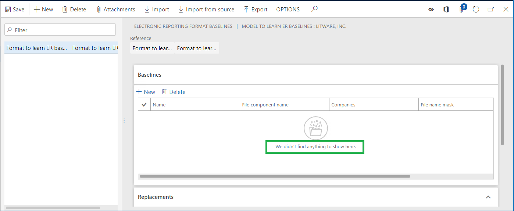
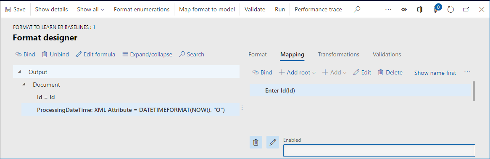
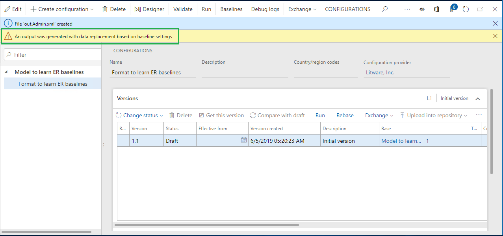

# Improve tracing the results of generated ER reports to compare with baseline values

[!include[banner](../includes/banner.md)]

This article describes the first set of improvements that have been made to the baseline feature of the Electronic reporting (ER) framework. These improvements are available in Microsoft Dynamics 365 Finance version 10.0.3 (June 2019) and later.

## Automate the setting of baseline rules

The [Trace generated report results and compare them with baseline values](er-trace-reports-compare-baseline.md) article explains how to configure the ER framework to collect information about ER format executions and evaluate the results of those executions. The example in this article shows the steps that must be completed.

Here are some of the steps:

- Run an ER format to generate an outbound file, and store the file locally.
- Add the locally stored file as an attachment of the baseline that was added for an ER format.
- Configure the baseline rule for the added baseline. This configuration includes the following steps:

    - Specify an ER format element that is used to generate an outbound file.
    - Select the attachment that refers to the generated outbound file.

> [!NOTE]
> These steps must be done manually, even though the new ER capabilities enable them to be automated. To learn more about this feature, complete the following example.

## Example: Automate the setting of baseline rules

To complete the steps in this example, you must first complete the steps in the example in the [Trace generated report results and compare them with baseline values](er-trace-reports-compare-baseline.md) article, up through the "Add a new baseline for a designed ER format" section.

### Review added baseline

1. Go to **Organization administration** \> **Electronic reporting** \> **Configurations**.
2. Select **Baselines**.

    > [!NOTE]
    > The **Baselines** button on the Action Pane is available only when the **Run in debug mode** ER user parameter is turned on for the current company.

The baseline has been added for the selected **Format to learn ER baselines** format, but the baseline rules haven't yet been added for this baseline.

### Make a new baseline rule

1. Go to **Organization administration** \> **Electronic reporting** \> **Configurations**.
2. In the tree, expand **Model to learn ER baselines**.
3. In the tree, select **Model to learn ER baselines\\Format to learn ER baselines**.
4. On the **Versions** FastTab, select **Run**.
5. In the **Enter Id** field, enter **1**.
6. Set the **Make baseline files** option to **Yes**.
7. Select **OK**.
8. Select **Baselines**.

    

    The generated outbound file has been automatically attached to the baseline of the executed ER format. The baseline rule has been automatically added to this baseline and also contains the reference to the attached file.

9. In the **Name** field, enter **Baseline 1**.
10. In the **File name mask** field, enter **.xml**.
11. Select **Save**.

### Run the format

You're now ready to complete the remaining steps in the example in the [Trace generated report results and compare them with baseline values](er-trace-reports-compare-baseline.md) article, starting from the "Run the designed ER format and review the log to analyze the results" section.

> [!NOTE]
> When you delete the automatically added baseline rule on the **Baselines** FastTab, the referenced attachment isn't automatically deleted.

## Configure the baseline so that it ignores constantly changing parts of the ER output

When an ER format has been designed to contain information that is changed when the format is run, the format must be required to use the ER baseline feature to compare the generated results with baseline values. For example, the information might be the processing date and time or the unique identifier of a generated document in different formats (globally unique identifier \[GUID\], and so on). The new ER capabilities let you configure the baseline rule so that it ignores changeable elements of an ER format when the format is run with the purpose of comparing baseline values with the results of the format's execution. To learn more about this feature, complete the following example.

## Example: Configure the baseline so that it ignores constantly changing parts of the ER output

To complete the steps in this example, you must first complete the steps in the example in the [Trace generated report results and compare them with baseline values](er-trace-reports-compare-baseline.md) article.

### Modify a configured ER format

1. Go to **Organization administration** \> **Electronic reporting** \> **Configurations**.
2. In the tree, expand **Model to learn ER baselines**.
3. In the tree, select **Model to learn ER baselines\\Format to learn ER baselines**.
4. Select **Designer**.
5. In the tree, select **Output\\Document**.
6. Select **Add**.
7. In the drop-down dialog box, in the tree, select **XML\\Attribute**.
8. In the **Name** field, enter **ProcessingDateTime**.
9. Select **OK**.
10. On the **Mapping** tab, in the tree, select **Output\\Document\\ProcessingDateTime**.
11. Select **Edit formula**.
12. In the **Formula** field, enter the following expression: **DATETIMEFORMAT(NOW(), "O")**
13. Select **Save**, and then select **Test**.
14. Select **Test** again to retest the configured expression.

    

    > [!NOTE]
    > The **Test result** tab shows that the configured expression returns a different date and time value whenever it's called.

15. Close the **Formula designer** page, and then select **Save**.

    

16. Close the **Format designer** page.

### Remove an existing baseline rule

1. Go to **Organization administration** \> **Electronic reporting** \> **Configurations**.
2. Select **Baselines**.
3. In the list of baselines, select the baseline that is configured for the **Format to learn ER baselines** format.
4. On the **Baselines** FastTab, select **Delete** to remove the baseline rule that you configured earlier.

### Define replacements for bindings of designed ER format

1. On the **Configurations** page, on the **Replacements** FastTab, select **Select components**.
2. In the format components tree, expand **Output**, expand **Output\\Document**, and then select the check box for **Output\\Document\\ProcessingDateTime**.
3. Select **OK**.

The selected ER format component has been added to the list of components on the **Replacements** FastTab. When the base ER format is run in debug mode, the format's binding for each component will be replaced by the binding that is shown in the **Binding** column. To change the default binding for a component that is listed on the **Replacements** FastTab, select **Edit**.

### Make a new baseline rule

Follow the steps in the "Example: Automate the setting of baseline rules" section earlier in this article. A notification warns you that the outbound file has been generated by using baseline settings, and that a forced replacement of the format bindings has occurred.

### Suppress warnings about the replacement of format bindings

By setting specific ER parameters, you can suppress notifications that warn about the replacement of format bindings. This suppression can be useful when format bindings are replaced in an unattended mode by using the Regression Suite Automation Tool. In this case, the warning can be considered a failure of the test case that is running.

1. On the **Configurations** page, on the Action Pane, on the **Configurations** tab, select **User parameters**.
2. Set the **Suppress baseline warnings** option to **Yes**, and then select **OK**.

### Review the generated baseline file

1. Go to **Organization administration** \> **Electronic reporting** \> **Configurations**.
2. Select **Baselines**.
3. Select **Attachments**.
    > [!NOTE]
    > The generated file contains the processing date and time text (**"#"**) from the binding that was configured in the added baseline rule, not from the format's binding.
    
4. Close the **Attachments** page.

### Run the designed ER format and review the log to analyze the results

1. Go to **Organization administration** \> **Electronic reporting** \> **Configurations**.
2. In the tree, expand **Model to learn ER baselines**.
3. In the tree, select **Model to learn ER baselines\\Format to learn ER baselines**.
4. On the **Versions** FastTab select **Run**.
5. In the **Enter Id** field, type **1**.
6. Select **OK**.
7. Go to **Organization administration** \> **Electronic reporting** \> **Configuration debug logs**.

The execution log contains information about the results of the comparison of the generated file with the configured baseline. The log indicates that the generated file and the baseline are equal, even though the executed format contains the binding to enter a constantly changing date and time value in the outbound file.

> [!NOTE]
> Although the outbound file has been generated by using baseline settings that force the replacement of the format's bindings, you don't receive any warnings about the replacement.

## Exchange baseline settings between environments

### Export baseline settings

The new ER capabilities let you export baseline settings for the selected ER format from the current environment and store them as XML files. 

To export baseline settings, on the **Electronic reporting format baselines** page, select **Export**.

### Import baseline settings

Exported baseline settings can be imported into a different environment. The environment must first be imported as an ER format. You can then import the baseline settings.

To import baseline settings from a locally stored XML file, on the **Electronic reporting format baselines** page, select **Import**, and then select **Browse** to select the XML file.

To import baseline settings from an XML file that is stored on the Microsoft SharePoint Server, based on the current Document management settings and the selected document type, on the **Electronic reporting format baselines** page, select **Import from source**. Then select the document type and the XML file. The required document type to access the SharePoint folder must be configured in advance.

> [!NOTE]
> You can use Task recorder to record the steps for selecting the required document type and the file name in the **Import from source** dialog box. In this way, you can keep required baseline settings on SharePoint Server and then automatically import them by playing a task recording when you run automated tests by using the Regression Suite Automation Tool.

## Additional resources

- [Trace generated report results and compare them with baseline values](er-trace-reports-compare-baseline.md)
- [Task recorder resources](../user-interface/task-recorder.md)

[!INCLUDE[footer-include](../../../includes/footer-banner.md)]

