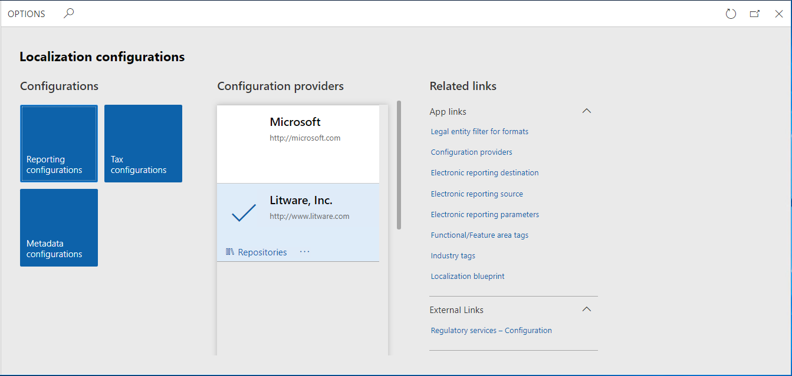
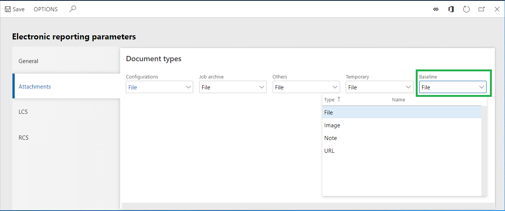
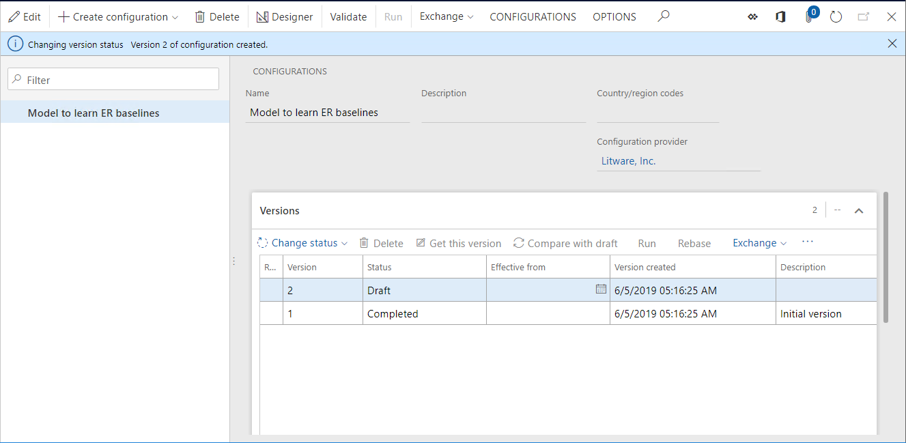
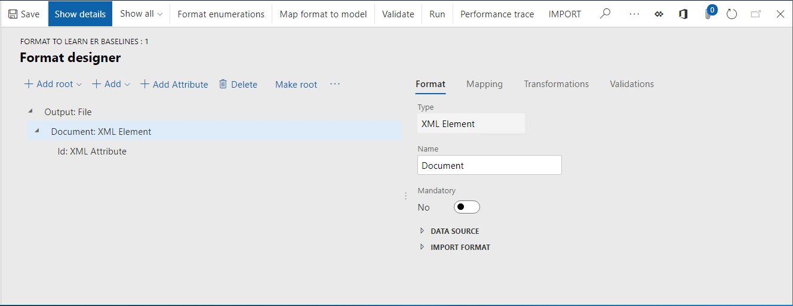
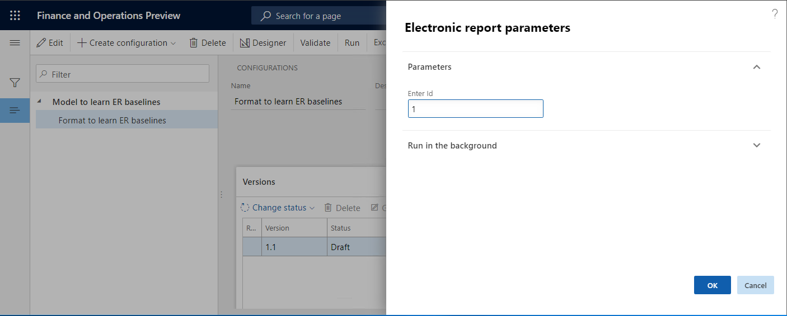
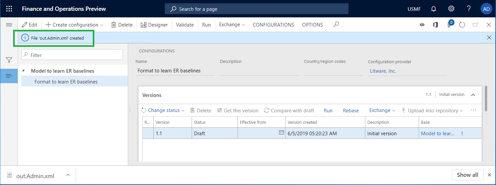
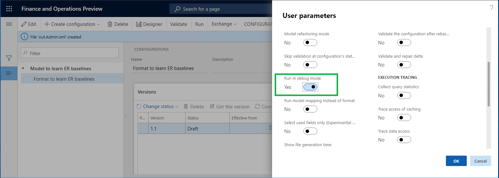
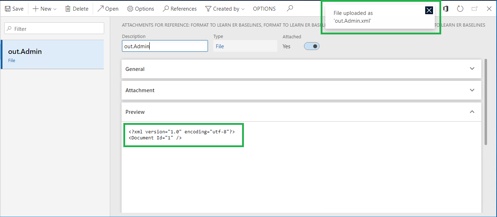
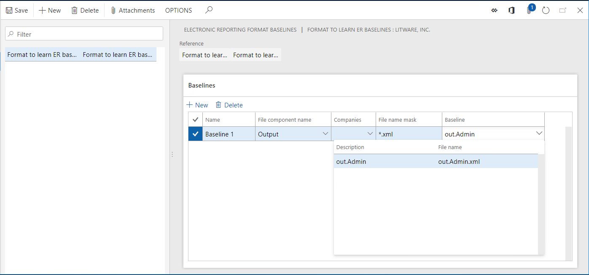

# Trace generated report results and compare them with baseline values

[!include[banner](../includes/banner.md)]

You can trace the results of Electronic reporting (ER) formats that generate outgoing electronic documents. When trace generation is turned on (by using the **Run in debug mode** ER user parameter), a new trace record is generated in the ER format execution log every time that an ER report is run. The following details are stored in each trace that is generated:

- All warnings that were generated by validation rules
- All errors that were generated by validation rules
- All generated files that are stored as attachments of the trace record

You can store individual baseline application files for any ER format. Files are considered baseline files when they describe the expected results of reports that are run. If a baseline file is available for an ER format that is run while trace generation is turned on, the trace stores, in addition to the details that were mentioned earlier, the result of the comparison of the generated electronic document with the baseline file. In one click, you can also get the generated electronic document and its baseline file in a single zip file. You can then do detailed comparison by using an external tool such as WinDiff.

You can evaluate the trace to analyze whether the electronic documents that are generated include the expected content. You can do this evaluation in a user acceptance testing (UAT) environment when the code base has been changed (for example, when you migrated to a new instance of the application, installed hotfix packages, or deployed code modifications). In this way, you can make sure that the evaluation doesn't affect the execution of ER reports that are used. For many ER reports, the evaluation can be done in unattended mode.

To learn more about this feature, play the **ER Generate reports and compare results (Part 1)** and **ER Generate reports and compare results (Part 2)** task guides, which are part of the **7.5.4.3 Test IT services/solutions (10679)** business process and can be downloaded from the [Microsoft Download Center](https://go.microsoft.com/fwlink/?linkid=874684). These task guides walk you through the process of configuring the ER framework to use baseline files to evaluate generated electronic documents.

## Example: Trace generated report results and compare them with baseline values

This procedure explains how to configure the ER framework to collect information about ER format executions and then evaluate the results of those executions. As part of that evaluation, generated documents are compared with their baseline files. In this example, you will create the required ER configurations for the Litware, Inc. sample company. This procedure is intended for users who have the System administrator or Electronic reporting developer role assigned to them. These steps can be completed by using any data set.

To complete the steps in this example, you must first complete the steps in [Create configuration providers and mark them as active](tasks/er-configuration-provider-mark-it-active-2016-11.md).

1. Go to **Organization administration** \> **Workspaces** \> **Electronic reporting**.
2. On the **Localization configurations** page, in the **Configuration providers** section, verify that the configuration provider for the Litware, Inc. sample company is listed, and that it's marked as **Active**. If you don't see this configuration provider, follow the steps in [Create configuration providers and mark them as active](tasks/er-configuration-provider-mark-it-active-2016-11.md).

### Configure document management parameters

1. Go to **Organization administration** \> **Document management** \> **Document types**, and create a new document type to store baseline files.
2. In the **Class** field, enter **Attach file**.
3. In the **Group** field, enter **File**.

> [!NOTE]
> A new document type that has the same name must be configured for each data set where you plan to use the ER baseline feature.

### Configure ER parameters to start to use the baseline feature

1. In the **Electronic reporting** workspace, in the **Related links** section, select **Electronic reporting parameters**.

    

2. On the **Attachments** tab, in the **Baseline** field, enter or select the document type that you just created.

    

3. Select **Save**, and then close the **Electronic reporting parameters** page.

### Add a new ER model configuration

1. In the **Electronic reporting** workspace, in the **Configurations** section, select the **Reporting configurations** tile.
2. On the Action Pane, select **Create configuration**.
3. In the drop-down dialog box, in the **Name** field, enter **Model to learn ER baselines**.
4. Select **Create configuration** to confirm the creation of a new ER data model entry.

### Design a data model

1. On the **Configurations** page, on the Action Pane, select **Designer**.
2. Select **New**.
3. In the drop-down dialog box, in the **Name** field, enter **Root**.
4. Select **Add**.
5. Select **Root reference**.
6. Select **OK**, and then select **Save**.
7. Close the **Model designer** page.
8. Select **Change status**.
9. Select **Complete**, and then select **OK**.

### Add a new ER format configuration

1. On the **Configurations** page, on the Action Pane, select **Create configuration**.
2. In the drop-down dialog box, in the **New** field group, select **Format based on data model Model to learn ER baselines**.
3. In the **Name** field, enter **Format to learn ER baselines**.
4. Select **Create configuration** to confirm the creation of a new ER format entry.

### Design a format

For this example, you will create a simple ER format to generate XML documents.

1. On the **Configurations** page, on the Action Pane, select **Designer**.
2. Select **Add root**.
3. In the drop-down dialog box, follow these steps:

    1. In the tree, select **Common\\File**.
    2. In the **Name** field, enter **Output**.
    3. Select **OK**.

4. Select **Add**.
5. In the drop-down dialog box, follow these steps:

    1. In the tree, select **XML\\Element**.
    2. In the **Name** field, enter **Document**.
    3. Select **OK**.

6. In the tree, select **Output\\Document**.
7. Select **Add**.
8. In the drop-down dialog box, follow these steps:

    1. In the tree, select **XML\\Attribute**.
    2. In the **Name** field, enter **ID**.
    3. Select **OK**.

    

9. On the **Mapping** tab, select **Delete**.
10. Select **Add root**.
11. In the drop-down dialog box, in the tree, select **General\\User input parameter**, and then follow these steps:

    1. In the **Name** field, enter **ID**.
    2. In the **Label** field, enter **Enter ID**.
    3. Select **OK**.

12. In the tree, select **Output\\Document\\Id**.
13. Select **Bind**, and then select **Save**.

Based on the designed structure, the configured format will generate an XML file. This XML contains the **Root** element that has the **ID** attribute that is set to the value that the user enters in the ER runtime dialog box.

### Generate a new baseline file for a designed ER format

1. On the **Configurations** page, on the **Versions** FastTab, select **Run**.
2. In the **Enter ID** field, enter **1**.
3. Select **OK**.

    

4. Save a local copy of the **out.Admin.xml** file that is generated, so that you can use it later as a baseline for this ER format.

    

### Configure ER parameters to use the baseline feature

1. On the **Configurations** page, on the Action Pane, on the **Configurations** tab, select **User parameters**.
2. Set the **Run in debug mode** option to **Yes**.
3. Select **OK**.

### Add a new baseline for designed ER format

1. Go to **Organization administration** \> **Electronic reporting** \> **Configurations**.
2. On the Action Pane, select **Baselines**.

    

3. On the Action Pane, select **New**.
4. Select the **Format to learn ER baselines** ER format that you designed earlier.
5. Select **Save**.

The baseline is added for the **Format to learn ER baselines** format.

### Configure a baseline rule for the added baseline

1. On the **Electronic reporting format baselines** page, on the Action Pane, select the **Attachments** button (the paper clip symbol).
2. On the Action Pane, select **New** \> **File**. In the ER parameters, the **File** document type should have been previously selected as the document type that is used to store baseline files.
3. Select **Browse**, and select the **out.Admin.xml** file that was generated when you ran the configured ER format earlier.

    

4. Close the **Attachments** page.
5. On the **Baselines** FastTab, select **New**.
6. In the **Name** field, enter **Baseline 1**.
7. In the **File component name** field, enter or select **Output**. This value indicates that the configured baseline will be compared with a file that is generated by using the **Output** format element.
8. In the **File name mask** field, enter **\*.xml**.

    > [!NOTE]
    > You can define the file name mask. When the file name mask is defined, the baseline record will be used to evaluate the generated output only when the name of the output file that is generated satisfies that mask.

9. If the configured baseline should be used only when the **Format to learn ER baselines** ER format is run by users who are signed in to specific companies, select those companies in the **Companies** field.
10. In the **Baseline** field, enter or select the **out.Admin** attachment.
11. Select **Save**.

### Run the designed ER format and review the log to analyze the results

1. Go to **Organization administration** \> **Electronic reporting** \> **Configurations**.
2. In the tree, expand **Model to learn ER baselines**, and then select **Model to learn ER baselines\\Format to learn ER baselines**.
3. On the **Versions** FastTab, select **Run**.
4. In the **Enter ID** field, enter **1**.
5. Select **OK**.
6. Go to **Organization administration** \> **Electronic reporting** \> **Configuration debug logs**.

    

    > [!NOTE]
    > The execution log contains information about the results of the comparison of the generated file with the configured baseline. In this example, the log indicates that the generated file and the baseline are equal.

7. Select **Delete all**.

### Run the designed ER format and review the log to analyze the results

1. Go to **Organization administration** \> **Electronic reporting** \> **Configurations**.
2. In the tree, expand **Model to learn ER baselines**, and then select **Model to learn ER baselines\\Format to learn ER baselines**.
3. On the **Versions** FastTab, select **Run**.
4. In the **Enter ID** field, enter **2**.
5. Select **OK**.
6. Go to **Organization administration** \> **Electronic reporting** \> **Configuration debug logs**.

    

    > [!NOTE]
    > The execution log contains information about the results of the comparison of the generated file with the configured baseline. In this example, the log indicates that the generated file and the baseline differ.

7. Select **Compare**.

> [!NOTE]
> The generated file and the baseline file are offered as a zip file. You can use external comparison tools such as WinDiff to compare the files and review the differences.

## Additional resources

- [Configure the Electronic reporting (ER) framework](electronic-reporting-er-configure-parameters.md)

[!INCLUDE[footer-include](../../../includes/footer-banner.md)]
