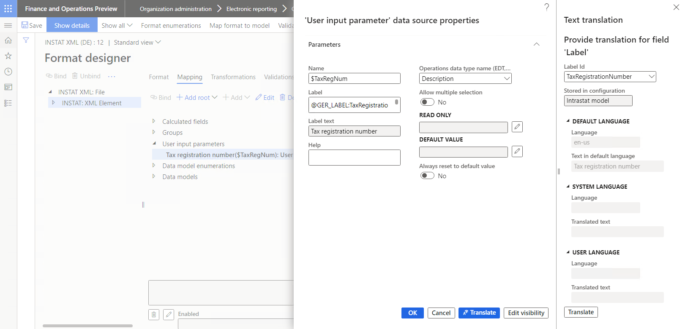
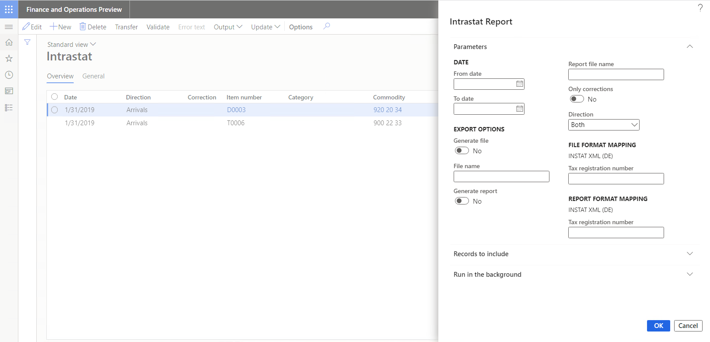
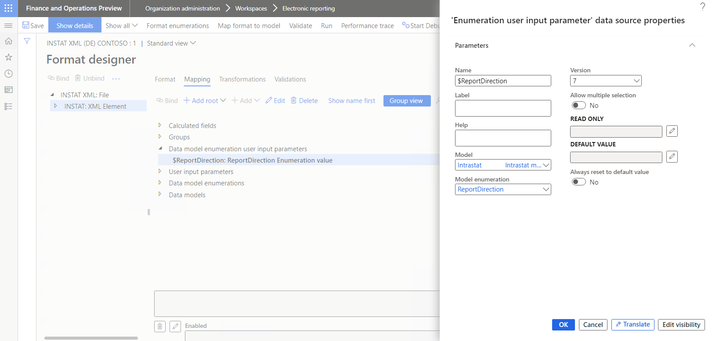

# Use USER INPUT PARAMETER data sources to specify parameters for a report

[!include[banner](../includes/banner.md)]

When you design [Electronic reporting](general-electronic-reporting.md) (ER) [model mapping](er-overview-components.md#model-mapping-component) and ER [format](er-overview-components.md#format-component) components, you can use data sources of a *USER INPUT PARAMETER* type to obtain the required values that can be specified in data entry fields in the dialog box at runtime, before execution of an ER format begins. This article describes the *USER INPUT PARAMETER* data sources that are currently supported.

## Mandatory properties

You must specify the following properties for data sources of every *USER INPUT PARAMETER* type:

- In the **Name** field, enter the internal name of the data source. You can use this name in other [expressions](er-formula-language.md) and bindings of the configured model mapping or format component.

## Optional properties

You can optionally specify the following properties for data sources of a *USER INPUT PARAMETER* type:

- In the **Label** field, specify the label that is used for the related data entry field in the dialog box at runtime. You can add different label text for different language codes by activating the **Label** field and then selecting **Translate**.
- In the **Help** field, specify the help text that is shown at design time at the bottom of the **Format designer** page or the **Model mapping designer** page when an editable data source of a *USER INPUT PARAMETER* type is selected. This text might provide additional details about the data source to help users when they configure the editable format or model mapping component. You can add different help text for different language codes by selecting **Translate**.

    > [!NOTE]
    > The **Translate** button that you can use to add [language specific labels and text](er-design-multilingual-reports.md#format-component) becomes available only after you add the data source, save your changes, and then reopen the data source for editing.

- In the **Read only** field, configure an expression that returns a *[Boolean](er-formula-supported-data-types-primitive.md#boolean)* value.

    - If the configured expression returns a value of **True** at runtime, the related data entry field appears dimmed in the dialog box, and you can't change its value.
    - If the configured expression returns a value of **False** at runtime, or if no expression is configured, the related data entry field is available in the dialog box, and you can change its value.

- In the **Default value** field, configure an expression that returns the value of the referenced parameter type. This value can be used to fill in a default value for the related data entry field in the dialog box at runtime.

    When you run an ER format, the value that you enter in the related data entry field in the dialog box at runtime is saved in memory as the previously used value. Previously used values are saved individually for each field, running ER format, current user, and current organization (company).

    - Set the **Always reset to default value** option to **Yes** if the value that is returned by the **Default value** expression should always be used as the default value, regardless of the previously used value.
    - Set the **Always reset to default value** option to **No** if the value that is returned by the **Default value** expression value should be used as the default value only when the previously used value is missing.

    > [!NOTE]
    > If you set the **Always reset to default value** option to **Yes**, an expression must be configured in the **Default value** field.

- If you set the **Allow multiple selection** option to **Yes**, you can select multiple values for the configured parameter at runtime. If you set it to **No**, you can select only a single value.

    > [!NOTE]
    > This option isn't applicable to all *USER INPUT PARAMETER* types. At design time, an exception is thrown to inform the user that the configured user input parameter doesn't support multiple selection, and that only a single value can be selected or entered.
    >
    > If you set the **Allow multiple selection** option to **Yes**, and you specified an expression in the **Default value** field, that expression can be used to set only a single default value.

- Select the **Edit visibility** option to specify whether the configured parameter should be shown in the dialog box at runtime.

    > [!NOTE]
    > The default visibility of data sources of a *USER INPUT PARAMETER* type depends on the ER component that holds them.
    >
    > - If a data source is configured in the format component, it's visible by default.
    > - If a data source is configured in the model mapping component, it's visible only if the value of the data source affects the outcome when an ER component is run. For example, you added a data source but didn't use it in expressions and bindings of the current model mapping component. In this case, by default, the relevant data entry field won't be shown in the dialog box at runtime. 

    On the **Formula designer** page, in the **Formula** field, configure an expression that returns a *Boolean* value.

    - If the configured expression returns a value of **True** at runtime, or if no expression is configured, the related data entry field is visible in the dialog box at runtime.
    - If the configured expression returns a value of **False**, the related data entry field is hidden in the dialog box at runtime. When it's called by other expressions at runtime, it returns the default value, the previously used value, or the default for the current data type value, depending on other settings.

## Type-specific properties

### Application-dependent user input parameter

Use a data source of the **General** \> **User input parameter** type to obtain the required value or values of a data type that is specified for the current instance of the Microsoft Dynamics 365 Finance application. When you add a data source of this type to an ER component, specify the following properties:

- In the **Operations data type name (EDT, enum)** field, select an application [extended data type (EDT)](../extensibility/extensible-edts.md) or an application enumeration.

> [!NOTE]
> We recommend that you review the expressions that are configured in the **Read only** and **Default value** fields when you change the **Operations data type name (EDT, enum)** reference in an editable data source of this *USER INPUT PARAMETER* type.

The following illustration shows properties of the `$TaxRegNum` data source that was configured in the **Instat XML (DE)** ER format configuration. This data source is configured to use the *Description* EDT to offer the **Tax registration number** data entry field in the dialog box at runtime.

The following illustration shows the dialog box that is shown at runtime when the **Instat XML (DE)** ER format configuration is run to [generate](../../../finance/localizations/tasks/eur-00002-eu-intrastat-declaration.md) the Intrastat declaration. Notice that the configured **Tax registration number** field is available for data entry.

### Data model enumeration user input parameter

Use a data source of the **Data model** \> **Enumeration user input parameter** type to obtain the required value or values of a single data model [enumeration](er-formula-supported-data-types-primitive.md#enumeration). When you add a data source of this type to an ER component, specify the following properties:

- In the **Model** field, specify a reference to the base data model.
- In the **Model enumeration** field, specify a reference to an enumeration of the referenced data model.
- In the **Version** field, select the revision number of the ER data model component that contains the referenced model enumeration.

    > [!TIP]
    > At design time, you can leave the **Version** field blank to access the list of enumerations for the referenced data model component that resides in the draft version of the corresponding ER data model configuration. In this way, you can simultaneously edit the draft version of your model mapping or format component and the draft version of the base data model component.
    >
    > However, note that the **Version** field can be left blank only in the draft version of a model mapping or format component. When you change the status of an ER model mapping or format configuration from **Draft** to **Completed**, this field is automatically filled in by the highest model revision number that is available in the current Finance instance. If you introduce a new enumeration or a new enumeration value in the draft version of your base data model and refer to it in the editable model mapping or format component, complete that draft version of the base data model configuration before the draft version of your ER model mapping or format configuration is completed. Otherwise, a "Path not found" exception will be thrown when you change the status of the model mapping or format configuration from **Draft** to **Completed**. The message will inform you that the referenced enumeration or enumeration value is missing in the base data model.

The following illustration shows properties of the `$ReportDirection` data source that was configured in the **Instat XML (DE) Contoso** ER format configuration. The **Instat XML (DE) Contoso** configuration has been [derived](general-electronic-reporting.md#Configuration) from the **Instat XML (DE)** configuration. This data source is configured to use the *ReportDirection* model enumeration to offer the appropriate lookup field in the dialog box at runtime.

### Format enumeration user input parameter

Use a data source of the **Format enumeration** \> **Enumeration user input parameter** type to obtain the required value or values of a single format enumeration. When you add a data source of this type to an ER component, specify the following properties:

- In the **Format enumeration** field, specify an enumeration of the editable format.

> [!NOTE]
> Data sources of this type can be configured only in the scope of the editable format component.

## Additional resources

[Formula designer in Electronic reporting](general-electronic-reporting-formula-designer.md)

[Initiate data source values of the USER INPUT PARAMETER type from source code](er-initiate-uip-data-source-value-from-source-code.md)
