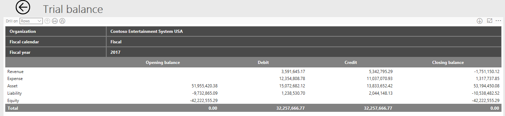
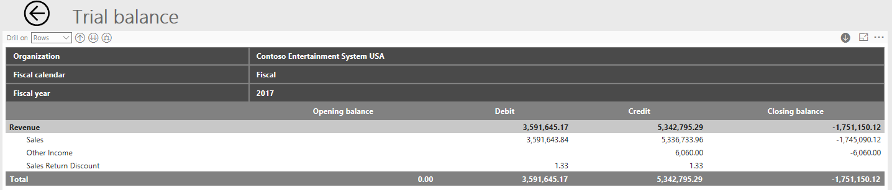

---
# required metadata

title: Financial analysis
description: Financial analysis uses Microsoft Power BI to bring together financial key performance indicators (KPIs), charts, and financial statements.
author: kweekley
ms.date: 08/24/2021
ms.topic: article
ms.prod: 
ms.technology: 

# optional metadata

# ms.search.form: 
# ROBOTS: 
audience: Application User, IT Pro
# ms.devlang: 
ms.reviewer: kfend
# ms.tgt_pltfrm: 
ms.custom: 106233
ms.assetid: 517e6a88-e7a1-4398-9971-b22fa83306ba
ms.search.region: Global
# ms.search.industry: 
ms.author: kweekley
ms.search.validFrom: 2016-02-28
ms.dyn365.ops.version: 7.3

---

# Financial analysis

[!include [banner](../includes/banner.md)]

**Financial analysis** uses Microsoft Power BI to bring together financial key performance indicators (KPIs), charts, and financial statements. Power BI is embedded in the application. The focus of **Financial analysis** is analytical reporting. Personas across an organization can view, research, understand, and act. 

**Financial analysis** combines data from the general ledger and subledgers to give a more complete picture of the financial health of an organization.

> [!NOTE]
> This document uses the following Power BI terminology:
> 
> - **Report** – A single .pbix file that all the visuals on all tabs are saved to.
> - **Page** – A tab in a single .pbix file. Each page can contain one or more visuals.
> - **Visual** – A single source of data, such as a card, KPI, chart, graph, matrix, or financial statement. A page that has a financial statement as a visual can have no other visuals, because of the size of the data that is being reported on.

The **Financial analysis** workspace is focused on letting you view and filter the data on existing reports. You are able to add new visuals to the **Financial analysis** workspace. The **Financial analysis** workspace is available for current company as well as all companies to show data for all legal entities, regardless of the legal entities that the role has access to.

- [Add or edit Power BI visualizations on your dashboard](/powerapps/user/add-powerbi-dashboards)

## Dynamics 365 Finance setup
**General ledger**

The main account type and the main account categories are used to fill in appropriate default main accounts on the **Balance sheet** financial statement and the various **Income statement** financial statements in **Financial analysis**.

On the **Main accounts** page, you must define your main account so that one of the following types is assigned to it:

- Revenue
- Expense
- Assets
- Liabilities
- Equity

Do not assign any other main account type, such as **Balance sheet** or **Profit and Loss**, to your main accounts. Reporting can't determine the type of main account when other main account types are assigned, because they aren't granular enough. The type of main account must be determined to show liabilities and revenue as positive amounts on financial reports.

To appear on the financial statements and to be included in various other visuals, such as KPIs, each main account must be assigned a main account category. The main account categories have been enhanced so that they include a display order. The display order is used specifically on financial statements in **Financial analysis**. After you edit or add a new main account category, you can change the **Display order** value to define the order that the main account categories should be shown in on a financial statement. If you must change the display order for many main account categories, you can use the Open in Excel feature to quickly edit and publish the changes back to the application.

## Entity store
The data for **Financial analysis** is pulled from the Entity store (**System administration** \> **Setup** \> **Entity store**). If you open the **CFO overview** or **Financial analysis** workspace, and the following warning message appears in the visuals, you must update the entities.

You must update the following entities to see data in the **Financial analysis** workspace:

- Financial reporting transaction data version 3 
- Credit and collections V2
- LedgerCovLiquidityMeasurement
- Purchase cube
- Sales cube

You can define a recurring batch to regularly update the data in the entities. Because each entity is completely rebuilt during an update, select the time and frequency of entity updates carefully. The primary entity that is used for financial statements is the FinancialReportingTransactionData entity. Therefore, you might decide to update that entity more often.

## Security
Currently, the data on embedded Power BI reports can't be limited to the legal entities that the user has access to. Therefore, the embedded Power BI reports are controlled through duties in the security setup. The duties that are defined allow access to data for either all legal entities or only the active company. The following table shows the duties that exist and the roles that they are assigned to. The duties can be removed or assigned to different roles, based on your organization's requirements.

| Duty                                    | Roles | Description |
|-----------------------------------------|-------|------------|
| View financial analysis current company | <ul><li>Accountant</li><li>Accounting manager</li><li>Accounting supervisor</li><li>Auditor</li><li>Budget manager</li><li>Chief executive officer</li><li>Chief financial officer</li><li>Financial controller</li></ul> | This duty provides access to Financial analysis. By default, the active company is used as a filter. You can't add other legal entities. |
| View financial analysis all company   | In Microsoft Dynamics 365 for Finance and Operations, Enterprise edition 7.3, this duty isn't assigned to a role. In the next release, this duty will be assigned to the Chief financial officer role. | This duty provides access to the menu item for the CFO overview workspace. By default, the active company is used as a filter. However, you can add all legal entities, regardless of whether the user has access to the other legal entities. |

## Financial reporting vs. Financial analysis
Although **Financial analysis** contains financial statements, it isn't a replacement for Financial reporting in the application. The default financial statements in **Financial analysis** are limited in scope and don't include all types of financial statements. Financial reporting is still the primary tool for designing, creating, and generating statutory financial statements.

The following comparison chart will help differentiate the two options:

| Feature                                                   | Financial Reporting                                               | Financial analysis |
|----------------------------------------------------------|-------------------------------------------------------------------|--------------------|
| **Edit default reports**                                 | Yes                                                               | No |
| **Create new reports**                                   | Yes                                                               | No |
| **Print reports**                                        | Yes                                                               | No |
| **Export to Excel**                                      | Yes                                                               | Limited Exports raw data to Excel, not a formatted report |
| **Support reporting hierarchy/Organization hierarchy**   | Yes                                                               | No |
| **Report on subledger data**                             | Yes Limited to only vendor, customer                              | Yes Vendor, customer, vendor/customer groups, vendor/customer addresses, etc. |
| **Reporting Currency**                                   | Yes Accounting currency and translate to reporting currency       | No Accounting currency only |
| **Security**                                             | Yes Adheres to Finance reporting tree security | Limited View reports for all companies (regardless of Finance and Operations security) or only active company |
| **Support different Chart of accounts and fiscal years** | Yes                                                               | No |
| **report on external data**                              | No                                                                | No |
| **Support consolidations**                               | Yes                                                               | Limited Can report on multiple companies but use accounting currency only |

The following financial statements are available:

- Trial balance
- Balance sheet
- Income statement by region
- Income statement actual vs. budget
- Income statement with variances
- 12-month trend income statement
- Expenses three-year trend
- Expenses by vendor
- Sales by customer

## Edit visuals
In previous releases of **Financial analysis**, none of the visuals could be edited. In future releases, users who have the appropriate security will be able to create new visuals, copy existing visuals, and edit visuals. Although the .pbix files that contain the reports are available as resources, we don't recommend that you edit the default reports. Additional changes will be made to the data model, default reports, and custom financial statement visual that are used to create the financial statements. Therefore, to take advantage of new features and changes to the data model in the next release, you will have to redo any changes that you made to the default reports through Microsoft Power BI Desktop.

## Filtering
Users can filter the report by using the **Filter** pane on the left. This pane is the same pane that is available through Power BI Desktop. There are various levels of filtering, some of which might not be available, depending on what you've selected on a page (tab) or whether you're using the drill-through capabilities:

- **Report-level filters** – These filters are applied to all visuals on all pages (tabs).
- **Page-level filters** – These filters are applied to all visuals on the active tab. These filters are applied on top of the report-level filters.
- **Visual-level filters** – These filters are applied only to the selected visual. These filters are applied on top of the page level filters.
- **Drill-through filter** – This filter filters from a “source” visual that is applied to the current visual when you drill through from the source visual to the current visual.

To remove a specific filter value, select the eraser symbol next to it. Don't remove a filter by selecting the X. If you select the X, the field that you're filtering on is removed as a filter option. If you accidentally remove a field from the filter, close the workspace, and then reopen it. The default filter settings will be reapplied.

By default, when you first open workspaces, the active legal entity is used as the report-level filter. Depending on their security, users might be able to add other legal entities or change the default legal entity that is selected in the filter.

The **Fiscal calendar** filter is required so that the correct calendar is used for the visual. By default, the report-level filter is set to the active legal entity's fiscal calendar. If you change the filter to a fiscal calendar that has a different start or end date, the beginning balances won't be included. Therefore, your **Balance sheet** financial statements won't show the correct balances. If you select an additional fiscal calendar in the filter, you will have an additional set of columns. Each additional set of columns shows the amounts for a different fiscal calendar.

The **Posting layer** filter is also required. By default, the filter is set to Current. You can select additional posting layers in the filter to show the aggregated amounts.

Filters are also available for the **Date** and **Fiscal year** fields. Typically, these filters are applied at the page level. By default, the **Date** filter uses a relational date that you can change. You can also remove the relational date filter and use the **Fiscal year** filter instead.

## Currency

All visuals that report on general ledger data show amounts in the accounting currency. Therefore, when you filter on the legal entity, you must be careful to include only legal entities that have the same accounting currency. Otherwise, you will aggregate data in different currencies.

All visuals that report on subledger data, such as the **Cash flow forecast** and **Top 10** visuals, show amounts in the system currency. The system currency and system exchange rate type are defined on the **System parameters** page.

The **Balance by bank account** visual uses amounts in the bank accounts' currency.

## Dimensions

The default financial statements don't include any financial dimensions but are focused only on the main account. Support for financial dimensions will be available in future releases, when the reports become editable. Organizations will then be able to filter on financial dimension values.

Some financial statements contain dimensions that are based on subledger transactions. The goal of the new financial statements is to enable filtering on dimensions that aren't set up as financial dimensions. For example, the default Expenses by vendor report lets you expand down beyond the main account, so that you can see the balances broken down by vendor. The vendor isn't set up as a financial dimension. Instead, the system returns to the originating subledger transaction to find the vendor.

The following dimensions are used on the default reports. None of these dimensions are financial dimensions.

- Vendor
- Vendor group
- Customer
- Customer group
- Country/region
- State/province
- City

> [!IMPORTANT] 
> If you summarize transactions for multiple vendors or customers in a single voucher by using the financial journals, the data will be incorrect. The reporting process can't determine which vendor or customer is related to a specific ledger account in a journal entry, because that information isn't maintained anywhere. Therefore, we do not recommend that you enter multiple vendors, customers, fixed assets, or projects in a single voucher.

## Drill on data

Various levels of drilling are available through Power BI. Each level has a different name and different functionality. You can also drill on rows and columns. This section discusses the various options by using the **Trial balance** financial statement as an example and showing how you can drill on the rows. The same functionality exists for columns. You just have to change the **Drill on** setting.

In the following illustration, the **Trial balance** statement is collapsed to the highest level of the row hierarchy, the main account type.

To view the next level of the hierarchy, the main account categories, you can set the **Drill on** field to **Rows** and then select the **Expand** button (the third button after the Drill on field). You now see all the main account categories expanded. Currently, Power BI doesn't let you expand only one row or column but still see all the other rows or columns.

To expand to the main accounts for all rows, you can again use the **Expand** button. However, to drill down to the main accounts for only one row, first select the **Drill down** button (the single downward-pointing arrow on the right side of the window), and then select the row to drill down on. The following illustration shows the result when the **Sales** row is selected after the **Drill down** button is selected.

After you drill down on a single row, multiple clicks are required to return to the full trial balance. The **Drill up** button (the first button after the **Drill** on field) drills up only in the context of the **Sales** category, as shown in the following illustration.

You can continue to use the **Drill up** button to return to the highest level of summarization for the rows.

Power BI also has a button that lets you go to the next level in the hierarchy (the second button after the **Drill on** field). The effect of this button differs from the effect of the **Expand** button (the third button after the **Drill on** field), which is used to expand the hierarchy. When you expand the hierarchy, the hierarchy is maintained on the report. For example, as was shown earlier, if you expand on the main account type, you still see the main account type on the report. However, when you go to the next level in the hierarchy, the report no longer shows the parent in the hierarchy, as shown in the following illustration.

To see the transaction details behind the summarized balances, you can select some amounts to drill back into Financial and Operations.

The drill-back from the financial statements takes you to the Accounting source explorer (ASE), not to the voucher transactions. The ASE doesn't show just the accounting entries in the general ledger. Instead, it shows the details of the subledger transaction. Therefore, you get much more detail about the originating transaction and can use it for analysis. For example, you can see who the vendor or customer was, what the customer bought or the vendor sold, and even what project was on the transaction.

The following filters from the financial statements are sent to the ASE, so that the ASE shows the transactions that are aggregated:

Required fields for filtering:

- Legal entity
- Fiscal calendar
- Year
- Main account ID

Optional fields for filtering:

- Quarter
- Month
- Period

If you don't expand down far enough on a row, the drill-down doesn't work. For example, if you expand down only to the main account category, you can't drill down into the ASE on the balance, because the main account is a required field for filtering in the ASE.

If you expand down too far on a row, the additional filters on the financial statements aren't sent to the ASE. Therefore, you might see a difference in your numbers. For example, if you expand down to the country or region on the rows of the Income statement by region financial statement, the country or region isn't be included as a filter in the ASE.

> [!NOTE]
> You can drill further down on the financial statement rows or columns than the ASE currently supports for filtering. Therefore, in some situations, the sum of detailed transactions in the ASE won't match the balance that you're drilling back on. This functionality will continue to be enhanced in the future.

## Hierarchies

The default financial statements use two hierarchies to drill and expand on the data. One hierarchy is for the rows, and the other hierarchy is for the columns. Both hierarchies are predefined in the design of the financial statement. For most financial statements, the row hierarchy is **Main account type** \> **Main account categories** \> **Main account**. However, some reports have additional fields, such as Country and Region. The additional nodes of the hierarchy are based on subledger data for each transaction.

For the columns, the hierarchy is focused on the legal entities and the fiscal periods. For most financial statements, the column hierarchy is **Legal entity** \> **Fiscal calendar** \> **Fiscal year** \> **Quarter** \> **Period**.

Currently, the financial statements don't support the organizational hierarchies, which let you aggregate data.

## Data limitations
The financial statement visuals have a limit on the number of rows that can be shown. Currently, the limit is set to 30,000. If you exceed this limit, the visual will have a warning symbol to notify you about this situation.

If the maximum is exceeded, the totals that appear on the financial statement will be incorrect, because not all the rows were loaded into the visual.

### Empty rows
Power BI doesn't provide an option to hide and show empty rows. If a row doesn't have any data, the row won't appear in the visual.

## Additional resources for Power BI

The information in the following resources isn't required in order to enable the embedded reports for the **Financial analysis** workspace in a production environment. Instead, they are helpful for dev boxes and if you want to embed your own Power BI reports.

- [Accessing Analytical Workspaces and Reports on 1-box environment](/archive/blogs/dynamicsaxbi/accessing-analytical-workspaces-on-1box-environment)

- [Add analytics to workspaces by using Power BI Embedded](/dynamics365/unified-operations/dev-itpro/analytics/add-analytics-tab-workspaces)

[!INCLUDE[footer-include](../../../includes/footer-banner.md)]
