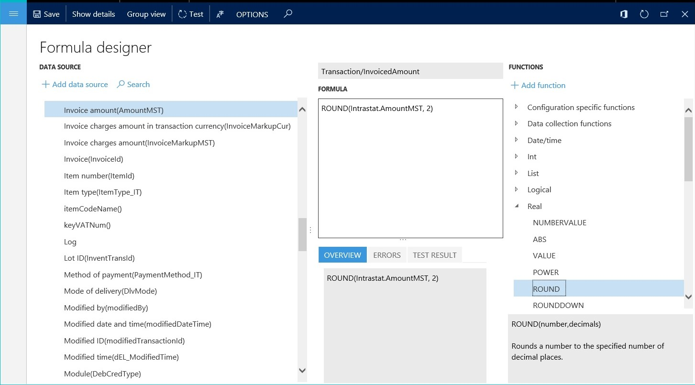
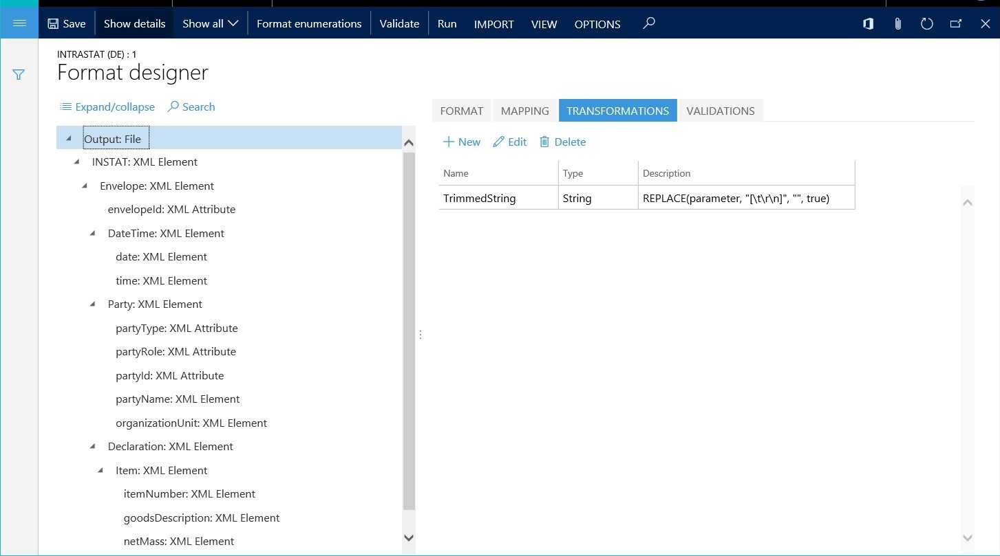
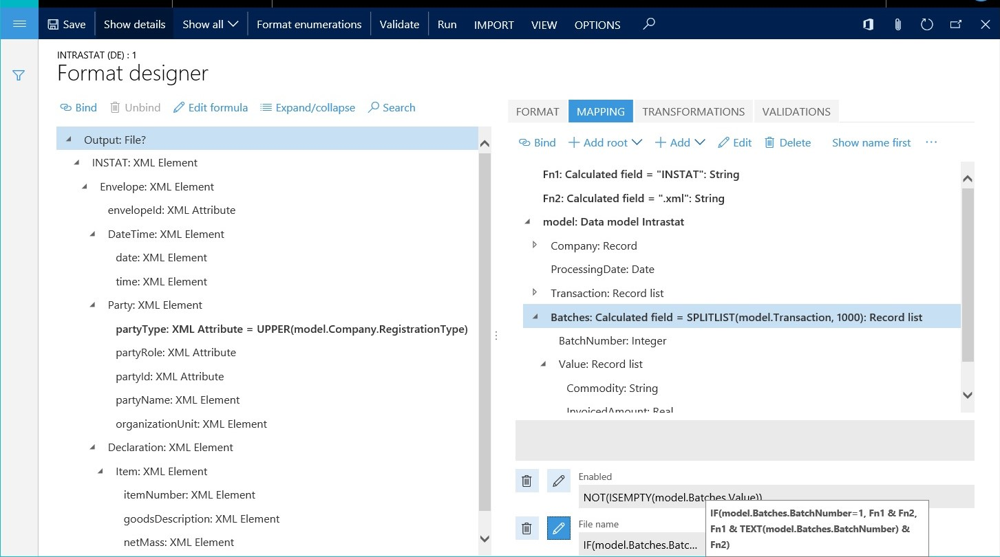
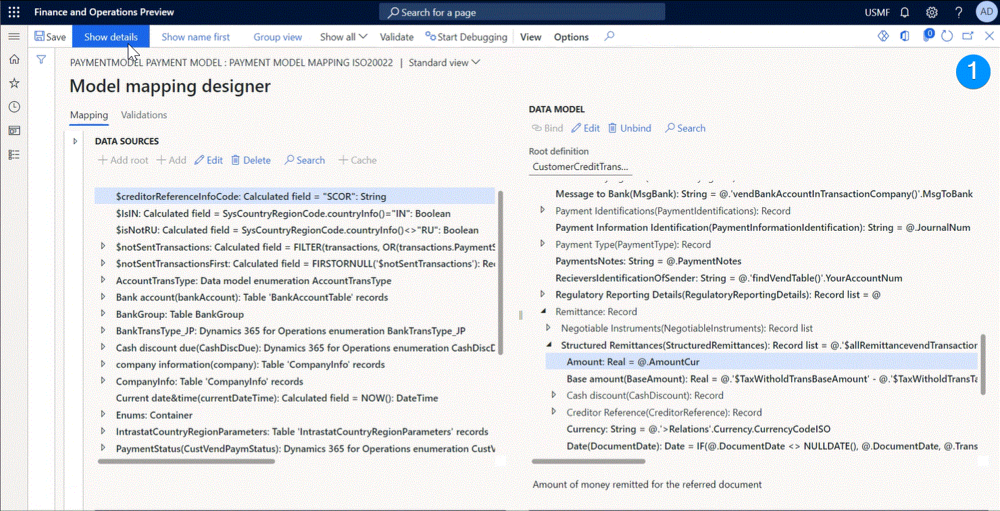
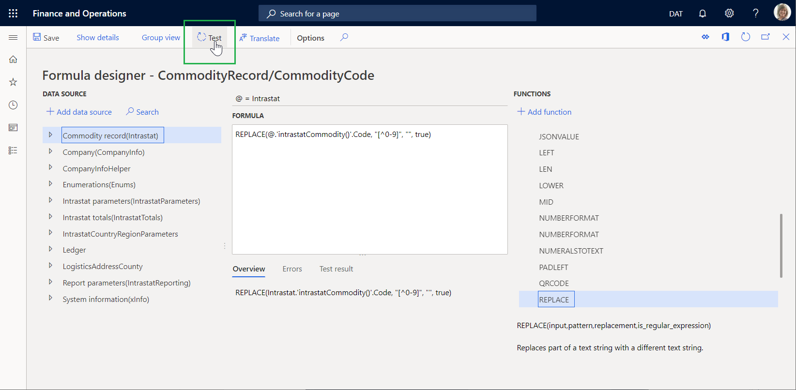
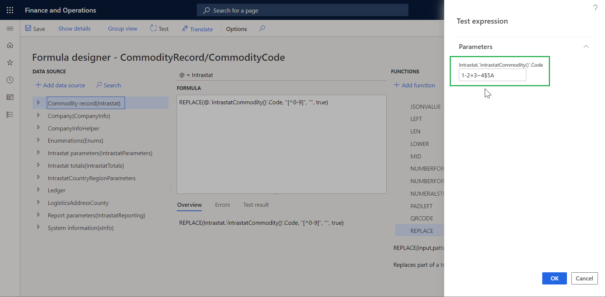
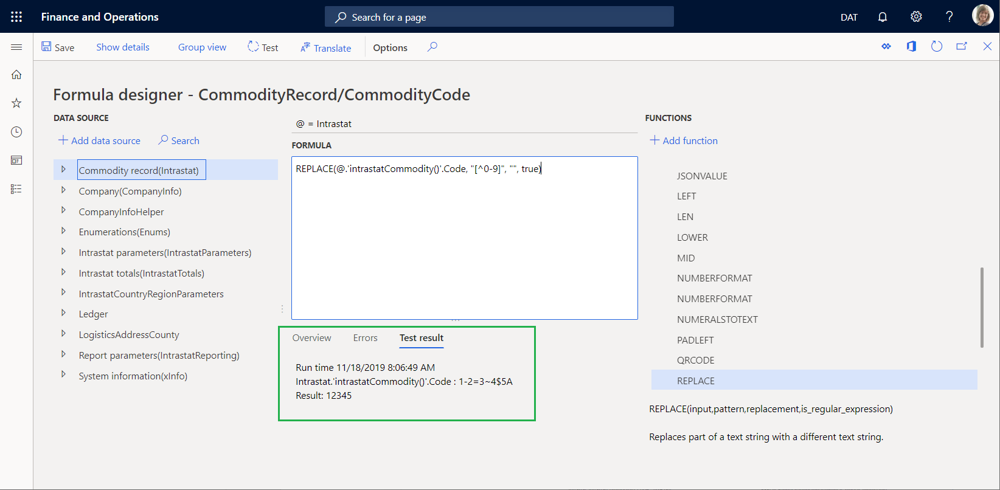
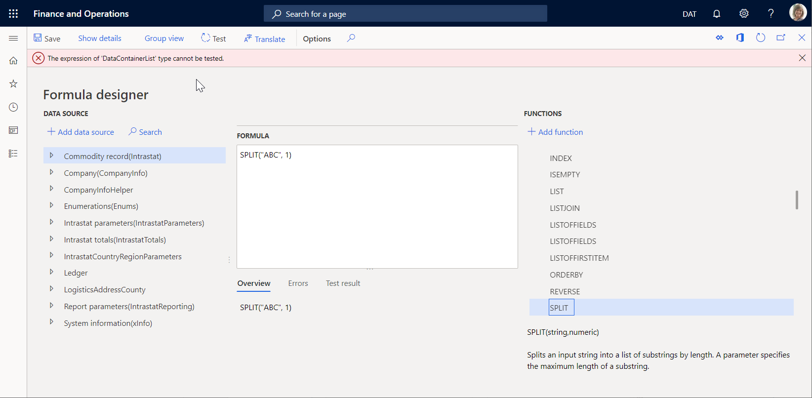

# Formula designer in Electronic reporting (ER)

[!include [banner](../includes/banner.md)]

This article explains how to use the formula designer in Electronic reporting (ER). When you design a format for a specific electronic document in ER, you can use formulas to transform data so that it meets the requirements for the document's fulfillment and formatting. These formulas resemble formulas in Microsoft Excel. Various types of functions are supported in the formulas: text, date and time, mathematical, logical, information, and data type conversion functions, and also other, business domain–specific functions.

## Formula designer overview

ER supports the formula designer. Therefore, at design time, you can configure expressions that can be used for the following tasks at runtime:

- Transform data that is received from an application database and that should be entered in an ER data model that is designed to be a data source for ER formats. (For example, these transformations might include filtering, grouping, and data type conversion.)
- Format data that must be sent to a generating electronic document in accordance with the layout and conditions of a specific ER format. (For example, the formatting might be done in accordance with the requested language or culture, or the encoding).
- Control the process of creating electronic documents. (For example, the expressions can enable or disable the output of specific elements of the format, depending on processing data. They can also interrupt the document creation process or throw messages to users.)

You can open the **Formula designer** page when you perform any of the following actions:

- Bind data source items to data model components.
- Bind data source items to format components.
- Complete maintenance of calculated fields that are part of data sources.
- Define the visibility and editability conditions for user input parameters.
- Define the default values for user input parameters.
- Design a format's transformations.
- Define the enabling conditions for the format's components.
- Define the file names for the format's FILE components.
- Define the conditions for process control validations.
- Define the message text for process control validations.

## Data binding

The ER formula designer can be used to define an expression that transforms data that is received from data sources, so that the data can be entered in the data consumer in the following ways at runtime:

- From application data sources and runtime parameters to an ER data model
- From an ER data model to an ER format
- From application data sources and runtime parameters to an ER format

The following illustration shows the design of an expression of this type. In this example, the expression rounds the value of the **Intrastat.AmountMST** field in the Intrastat table to two decimal places and then returns the rounded value.

The following illustration shows how an expression of this type can be used. In this example, the result of the designed expression is entered in the **Transaction.InvoicedAmount** component of the **Tax reporting model** data model.

At runtime, the designed formula, `ROUND (Intrastat.AmountMST, 2)`, rounds the value of the **AmountMST** field for each record in the Intrastat table to two decimal places. It then enters the rounded value in the **Transaction.InvoicedAmount** component of the **Tax reporting** data model.

## Data formatting

The ER formula designer can be used to define an expression that formats data that is received from data sources, so that the data can be sent as part of the generating electronic document. You might have formatting that must be applied as a typical rule that should be reused for a format. In this case, you can introduce that formatting one time in the format configuration, as a named transformation that has a formatting expression. This named transformation can then be linked to many format components where the output must be formatted according to the formatting expression that you created.

The following illustration shows the design of a transformation of this type. In this example, the **TrimmedString** transformation truncates incoming data of the *String* data type by removing leading and trailing spaces. It then returns the truncated string value.

The following illustration shows how a transformation of this type can be used. In this example, several format components send text as output to the generating electronic document at runtime. All these format components refer to the **TrimmedString** transformation by name.

When format components, such as the **partyName** component in the preceding illustration, refer to the **TrimmedString** transformation, the transformation sends text as output to the generating electronic document. This text doesn't include leading and trailing spaces.

If you have formatting that must be applied individually, you can introduce that formatting as an individual expression of a binding of a specific format component. The following illustration shows an expression of this type. In this example, the **partyType** format component is bound to the data source via an expression that converts incoming data from the **Model.Company.RegistrationType** field in the data source to uppercase text. The expression then sends that text as output to the electronic document.

## Process flow control

The ER formula designer can be used to define expressions that control the process flow of generating electronic documents. You can perform the following tasks:

- Define conditions that determine when a document creation process must be stopped.
- Specify expressions that either create messages for the user about stopped processes or throw execution log messages about the continuing process of report generation.
- Specify the file names of generating electronic documents, and control the conditions of their creation.

Each rule of the process flow control is designed as an individual validation. The following illustration shows a validation of this type. Here is an explanation of the configuration in this example:

- The validation is evaluated when the **INSTAT** node is created during generation of the XML file.
- If the list of transactions is empty, the validation stops the execution process and returns **FALSE**.
- The validation returns an error message that includes the text of label SYS70894 in the user's preferred language.

The ER formula designer can also be used to generate a file name for a generating electronic document and to control the file creation process. The following illustration shows the design of a process flow control of this type. Here is an explanation of the configuration in this example:

- The list of records from the **model.Intrastat** data source is divided into batches. Each batch contains up to 1,000 records.
- The output creates a zip file that contains one file in XML format for every batch that was created.
- An expression returns a file name for generating electronic documents by concatenating the file name and the file name extension. For the second batch and all subsequent batches, the file name contains the batch ID as a suffix.
- An expression enables (by returning **TRUE**) the file creation process for batches that contain at least one record.

## Document content control

The ER formula designer can be used to configure expressions that control what data will be put into generated electronic documents at runtime. The expressions can enable or disable the output of specific elements of the format, depending on processing data and configured logic. These expressions can be entered for a single format element in the **Enabled** field on the **Mapping** tab of the **Operations designer** page. You can enter the expressions as a logic condition that returns a *Boolean* value:

- If the condition returns **True**, the current format element is run.
- If the condition returns **False**, the current format element is skipped.

The following illustration shows expressions of this type. (Version 11.12.11 of the **ISO20022 Credit transfer (NO)** format configuration that is provided by Microsoft is used as an example.) The **XMLHeader** format component is configured to describe the structure of the credit transfer message according to the ISO 20022 XML message standards. The **XMLHeader/Document/CstmrCdtTrfInitn/PmtInf/CdtTrfTxInf/RmtInf/Ustrd** format component is configured to add the **Ustrd** XML element to the generated message and to put the remittance information in an unstructured format as text of the following XML elements:

- The **PaymentNotes** component is used to generate the text of payment notes.
- The **DelimitedSequence** component generates comma-separated invoice numbers that are used to settle the current credit transfer.

> [!NOTE]
> The **PaymentNotes** and **DelimitedSequence** components are labeled by using a question mark. A question mark indicates that the use of a component is conditional. In this case, use of the components is based on the following criteria:
>
> - The `@.PaymentsNotes <> ""` expression that is defined for the **PaymentNotes** component enables (by returning **TRUE**) the **Ustrd** XML element to be filled with the text of payment notes, if that text isn't blank for the current credit transfer.
>
>    
>
> - The `@.PaymentsNotes = ""` expression that is defined for the **DelimitedSequence** component enables (by returning **TRUE**) the **Ustrd** XML element to be filled with a comma-separated list of the invoice numbers that are used to settle the current credit transfer, if the text of payment notes for that credit transfer is blank.
>
>    
> 
> Based on this setup, the message that is generated for each debtor payment, the **Ustrd** XML element, will contain either the text of payment notes or, when that text is blank, a comma-separated list of the invoice numbers that are used to settle the payment.

## Assistance in formulas writing

### Data sources navigator

You can edit a formula that represents an element of a structured data source. When you configured your ER parameters to present the path to an element of a structured data source as the [relative path](relative-path-data-bindings-er-models-format.md), the "at" (@) sign is [shown](er-formula-language.md#relative-path) in the formula instead of the remaining part of the absolute path of the hierarchical tree structure that is used. This remaining part of the absolute path is pointed to a parent element of the editable one. In Finance version **10.0.30 and later**, on the **Formula designer** page, in the **Data sources** pane, you can select the **Go to @** option to position the cursor of the data sources tree to an element that is the parent of the editable one. The structure of all collapsed ascending elements will be automatically and recursively expanded when required. This expansion can help you to quickly visualize the base element of the editable one, observe siblings of the editable element in the data sources tree, and use each of them in the editable formula if needed.

### Data sources picker

On the **Formula designer** page, in the **Data sources** pane on the left, select an element of a data source that you want to bring in to the editable formula. Then select **Add data source**. Notice that the selected element is added to the text of the editable formula.

> [!TIP]
> When you use the **Add data source** option in the default formula editor, the selected element is always added to the end of the formula text. When you do the same in the [Advanced formula editor](er-advanced-formula-editor.md), the selected element is inserted to the formula text at the current cursor position.

### Built-in functions picker

On the **Formula designer** page, in the **Functions** pane on the right, select an ER built-in function that you want to bring in to the editable formula. Then, select **Add function**. Notice that the selected function is added to the text of the editable formula.

> [!TIP]
> When you use the **Add function** option in the default formula editor, the selected function is always added to the end of the formula text. When you do the same in the [Advanced formula editor](er-advanced-formula-editor.md), the selected function is inserted to the formula text at the current cursor position.

### Validation of configured formulas

On the **Formula designer** page, select **Test** to validate how the configured formula works.

When the values of formula arguments are required, you can open the **Test expression** dialog box from the **Formula designer** page. In most cases, these arguments must be manually defined, because the configured bindings aren't run at design time. The **Test result** tab on the **Formula designer** page shows the result from execution of the configured formula.

The following example shows how you can test the formula that is configured for the foreign trade domain to make sure that the Intrastat commodity code contains only digits.

When you test this formula, you can use the **Test expression** dialog box to specify the value of the Intrastat commodity code for testing.

After you specify the Intrastat commodity code and select **OK**, the **Test result** tab on the **Formula designer** page shows the result of execution of the configured formula. You can then evaluate whether the result is acceptable. If the result isn't acceptable, you can update the formula and test it again.

Some formulas can't be tested at design time. For example, a formula might return a result of a data type that can't be shown on the **Test result** tab. In this case, you receive an error message that states that the formula can't be tested.

## Additional resources

- [Electronic Reporting overview](general-electronic-reporting.md)
- [Electronic reporting formula language](er-formula-language.md)

[!INCLUDE[footer-include](../../../includes/footer-banner.md)]
