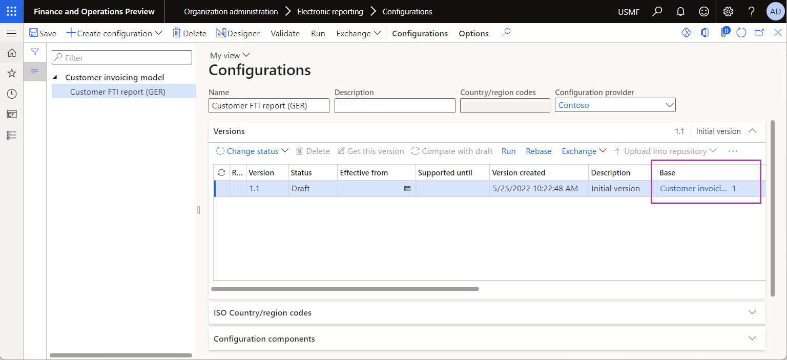
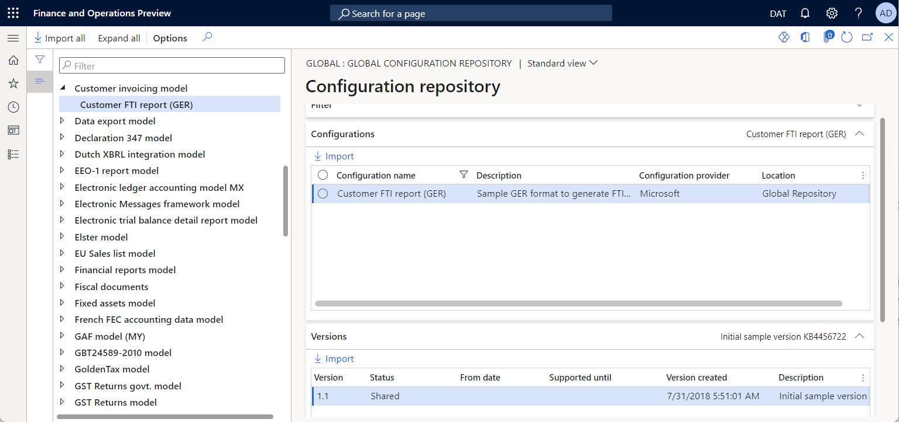
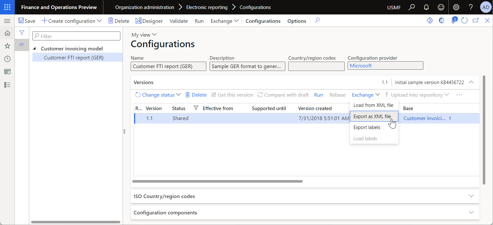
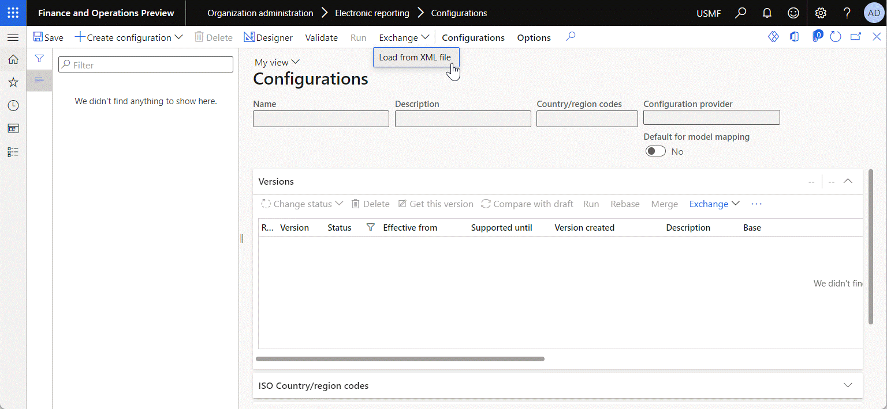
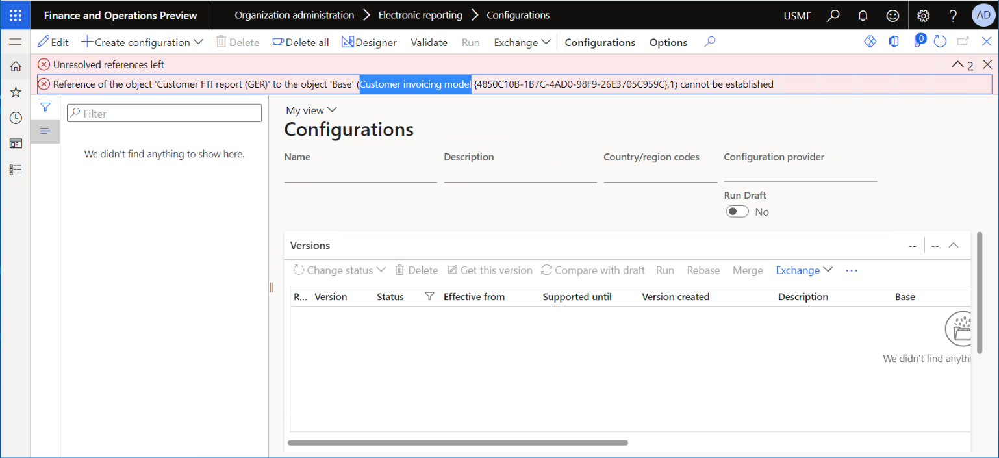

# Manage the Electronic reporting (ER) configuration lifecycle

[!include [banner](../includes/banner.md)]

This article describes how to manage the lifecycle of [Electronic reporting](general-electronic-reporting.md) (ER) [configurations](general-electronic-reporting.md#Configuration) for Dynamics 365 Finance.

## Overview

Electronic reporting (ER) is an engine that supports statutory required and country-specific electronic documents. In general, ER assumes an ability to perform the following tasks for a single electronic document. For more details, see [Electronic reporting (ER) overview](general-electronic-reporting.md).

- Design a template for an electronic document:

    - Identify the required sources of data that can be presented in the document:

        - Underlying data, such as data tables, data entities, and classes.
        - Process-specific properties, such as execution date and time, and time zone.
        - User input parameters, specified by the end user at run time.

    - Define the required document elements and their topology to specify a final document format.
    - Configure the desired flow of data from selected data sources to defined document elements (via data source bindings to document format components), and specify process control logic.

- Make a template available so that it can be used in other instances:

    - Transform a document template that was created into an ER configuration, and export the configuration from the current application instance as an XML package that can be stored either locally or in Lifecycle Services (LCS).
    - Transform an ER configuration into an application document template.
    - Import an XML package that is stored either locally or in LCS into the current instance.

- Customize the template of an electronic document:

    - Bring a template from LCS into the current instance as an ER configuration.
    - Design a custom version of an ER configuration, and keep a reference to the base version.

- Integrate a template with a particular business process, so that it's available in the application:

    - Configure settings so that the application starts to use an ER configuration, by referring to that configuration in a process-related parameter. For example, refer to the ER configuration in a specific Accounts payable payment method to generate an electronic payment message for processing invoices.

- Use a template in a specific business process:

    - Run an ER configuration in a specific business process. For example, to generate an electronic payment message for processing invoices when a payment method that references the ER configuration is selected.

## Concepts
The following roles and related activities are associated with the ER configuration lifecycle.

| Role                                       | Activities                                                      | Description |
|--------------------------------------------|-----------------------------------------------------------------|-------------|
| Electronic reporting functional consultant | Create and manage ER components (models and formats).           | A business person who designs ER domain–specific data models, designs the required templates for electronic documents, and binds them accordingly. |
| Electronic reporting developer             | Create and manage data model mappings.                          | A specialist who selects the required Finance data sources and binds them to ER domain–specific data models. |
| Accounting supervisor                      | Configure process-related settings that reference ER artifacts. | For example, an **Accounting supervisor** role that allows the settings of an ER configuration to be used in a particular Accounts payable payment method to generate an electronic payment message for processing invoices. |
| Accounts payable payments clerk            | Use ER artifacts in a specific business process.                | For example, an **Accounts payable payments clerk** role that allows electronic payment messages to be generated for processing invoices, based on the ER format that is configured for a specific payment method. |

## ER configuration development lifecycle
For the following ER-related reasons, we recommend that you design ER configurations in the development environment, as a separate instance of finance and operations:

- Users in either the **Electronic reporting developer** role or the **Electronic reporting functional consultant** role can edit configurations and run them for testing purposes. This scenario can cause calls of methods of classes and tables that might harm business data and the performance of the instance.
- Calls of methods of classes and tables as ER data sources of ER configurations aren't restricted by entry points and logged company content. Therefore, users in either the **Electronic reporting developer** role or the **Electronic reporting functional consultant** role can access business-sensitive data.

ER configurations that are designed in the development environment can be [uploaded](#data-persistence-consideration) to the test environment for the configuration evaluation (proper process integration, correctness of results, and performance) and quality assurance, such as correctness of role-driven access rights and segregation of duties. The features that enable ER configuration interchange can be used for this purpose. Proven ER configurations can be uploaded to LCS to share them with service subscribers, or they can be [imported](#data-persistence-consideration) to the production environment for internal use.

## Data persistence consideration

You can individually [import](tasks/er-import-configuration-lifecycle-services.md) different versions of an ER [configuration](general-electronic-reporting.md#Configuration) to your Finance instance. When a new version of an ER configuration is imported, the system controls the content of the draft version of this configuration:

- When the imported version is lower than the highest version of this configuration in the current Finance instance, the content of the draft version of this configuration remains unchanged.
- When the imported version is higher than any other version of this configuration in the current Finance instance, the content of the imported version is copied to the draft version of this configuration to let you continue editing the last completed version.

If this configuration is owned by the configuration [provider](general-electronic-reporting.md#Provider) that is currently activated, the draft version of this configuration is visible to you on the **Versions** FastTab of the **Configurations** page (**Organization administration** > **Electronic reporting** > **Configurations**). You can select the draft version of the configuration and [modify](er-quick-start2-customize-report.md#ConfigureDerivedFormat) its content by using the relevant ER designer. When you have edited the draft version of an ER configuration, its content no longer matches the content of the highest version of this configuration in the current Finance instance. To prevent the loss of your changes, the system displays an error that the import is unable to continue because the version of this configuration is higher than the highest version of this configuration in the current Finance instance. When this happens, for example with the format configuration **X**, the **Format 'X' version is not completed** error is displayed.

To undo the changes that you introduced in the draft version, select the highest completed or shared version of your ER configuration in Finance on the **Versions** FastTab, and then select the **Get this version** option. The content of the selected version is copied to the draft version.

## Applicability consideration

When you design a new version of an ER configuration, you can define its [dependency](tasks/er-define-dependency-er-configurations-from-other-components-july-2017.md) on other software components. This step is considered a prerequisite for controlling the download of this configuration's version from an ER repository or an external XML file, and for any further use of the version. When you try to import a new version of an ER configuration, the system uses the configured prerequisites to control whether the version can be imported.

In some cases, you might require that the system ignore the configured prerequisites when you import new versions of ER configurations. To have the system ignore the prerequisites during import, follow these steps.

1. Go to **Organization administration** \> **Electronic reporting** \> **Configurations**.
2. On the **Configurations** page, on the Action Pane, on the **Configurations** tab, in the **Advanced settings** group, select **User parameters**.
3. Set the **Skip product updates and version prerequisite check during import** option to **Yes**.

    > [!NOTE]
    > This parameter is user-specific and company-specific.

## Dependencies on other components

ER configurations can be configured as [dependent](er-download-configurations-global-repo.md#import-filtered-configurations) on other configurations. For example, you can [import](er-download-configurations-global-repo.md) an ER [data model](er-overview-components.md#data-model-component) configuration from the Global repository into your [Microsoft Regulatory Configuration Services (RCS)](../../../finance/localizations/rcs-overview.md) or Dynamics 365 Finance instance, and then create a new ER [format](er-overview-components.md#format-component) configuration that is [derived](er-quick-start2-customize-report.md#DeriveProvidedFormat) from the imported ER data model configuration. The derived ER format configuration will be dependent on the base ER data model configuration.

When you've finish designing the format, you can change the status of your initial version of the ER format configuration from **Draft** to **Completed**. You can then share the completed version of the ER format configuration by [publishing](../../../finance/localizations/rcs-global-repo-upload.md) it to the Global repository. Next, you can access the Global repository from any RCS or Finance cloud instance. You can then import any ER configuration version that is applicable to the application from the Global repository into that application.

Based on the configuration dependency, when you select the ER format configuration in the Global repository to import it into a newly deployed RCS or Finance instance, the base ER data model configuration is automatically found in the Global repository and imported together with the selected ER format configuration as the base configuration.

You can also export your ER format configuration version out of your current RCS or Finance instance, and store it locally as an XML file.

In versions of Finance **before version 10.0.29**, when you try to import the ER format configuration version from that XML file or from any repository other than the Global repository into a newly deployed RCS or Finance instance that doesn't yet contain any ER configurations, the following exception will be thrown to inform you that a base configuration can't be obtained:

> Unresolved references left 
Reference of the object '\<imported configuration name\>' to the object 'Base' (\<globally unique identifier of the missed base configuration\>,\<version of the missed base configuration\>) cannot be established

In version **10.0.29 and later**, when you try to do the same configuration import, if a base configuration can't be found in the current application instance or in the source repository that you're currently using (if applicable), the ER framework will automatically try to find the name of the missing base configuration in the Global repository cache. It will then present the name and globally unique identifier (GUID) of the missing base configuration in the text of the exception that is thrown.

> Unresolved references left 
Reference of the object '\<imported configuration name\>' to the object 'Base' (\<name of the missed base configuration\> \<globally unique identifier of the missed base configuration\>,\<version of the missed base configuration\>) cannot be established

You can use the provided name to find the base configuration and then manually import it.

> [!NOTE]
> This new option works only when at least one user has already signed in to the Global repository by using the [Configuration repositories](er-download-configurations-global-repo.md#open-configurations-repository) page or one of the Global repository [lookup](er-extended-format-lookup.md) fields in the current Finance instance, and when the Global repository content has been cached.

## Additional resources

[Electronic reporting (ER) overview](general-electronic-reporting.md)

[Define the dependency of ER configurations on other components](tasks/er-define-dependency-er-configurations-from-other-components-july-2017.md)

[!INCLUDE[footer-include](../../../includes/footer-banner.md)]

