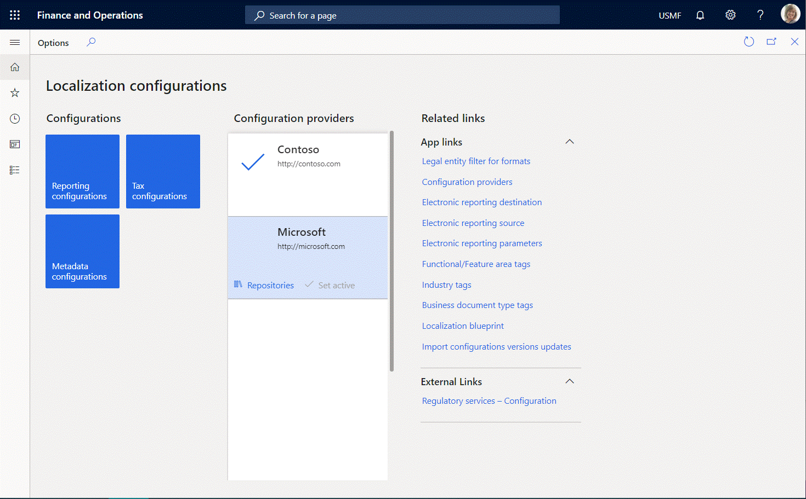

# Electronic reporting (ER) overview

[!include [banner](../includes/banner.md)]

This article provides an overview of the Electronic reporting (ER) tool. It includes information about key concepts, the scenarios that ER supports, and a list of formats that have been designed and released as part of the solution.

ER is a configurable tool that helps you create and maintain regulatory electronic reporting and payments. It's based on the following three concepts:

- Configuration instead of coding:

    - Configuration can be done by a business user and doesn't require a developer.
    - The data model is defined in business terms.
    - Visual editors are used to create all components of the ER configuration.
    - The language that is used for data transformation resembles the language that is used in Microsoft Excel.

- One configuration for multiple Dynamics 365 Finance releases:

    - Manage one domain-specific data model that is defined in business terms.
    - Isolate application release details in release-dependent data model mappings.
    - Maintain one format configuration for multiple releases of the current version, based on the data model.

- Easy or automatic upgrade:

    - Versioning of ER configurations is supported.
    - The Microsoft Dynamics Lifecycle Services (LCS) Assets library can be used as a repository for ER configurations, for version exchange.
    - Localizations that are based on original ER configurations can be introduced as child versions.
    - An ER configuration tree is provided as a tool that helps control dependencies for versions.
    - Differences in localization, or the delta configuration, are recorded to enable automatic upgrade to a new version of the original ER configuration.
    - It's easy to manually resolve conflicts that are discovered during automatic upgrade of localization versions.

ER lets you define electronic format structures and then describe how the structures should be filled by using data and algorithms. You can use a formula language that resembles the Excel language for data transformation. To make the database-to-format mapping more manageable, reusable, and independent of format changes, an intermediate data model concept is introduced. This concept enables implementation details to be hidden from the format mapping and enables a single data model to be reused for multiple format mappings.

You can use ER to configure formats for both incoming and outgoing electronic documents in accordance with the legal requirements of various countries and regions. ER lets you manage these formats during their lifecycle. For example, you can adopt new regulatory requirements and generate business documents in the required format to electronically exchange information with government bodies, banks, and other parties.

The ER engine is targeted at business users instead of developers. Because you configure formats instead of code, the processes for creating and adjusting formats for electronic documents are faster and easier.

ER currently supports the TEXT, XML, JSON, PDF, Microsoft Word, Microsoft Excel, and OPENXML worksheet formats.

## Capabilities

The ER engine has the following capabilities:

- It represents a single shared tool for electronic reporting in different domains and replaces more than 20 different engines that do some type of electronic reporting for finance and operations.
- It makes a report's format insulated from the current implementation. In other words, the format is applicable for different versions.
- It supports the creation of a custom format that is based on an original format. It also includes capabilities for automatically upgrading the customized format when the original format is changed because of localization/customization requirements.
- It becomes the primary standard tool to support localization requirements in electronic reporting, both for Microsoft and for Microsoft partners.
- It supports the ability to distribute formats to partners and customers through Microsoft Dynamics Lifecycle Services (LCS).

## Key concepts

### Main data flow

### Component

ER supports the following types of components:

- Data model
- Model mapping
- Format
- Metadata

For more information, see [Electronic reporting components](er-overview-components.md).

### Configuration

An ER configuration is the wrapper of a particular ER component. That component can be either a data model component or a format component. A configuration can include different versions of an ER component. Each configuration is marked as owned by a specific configuration provider. The **Draft** version of a component of a configuration can be edited when the owner of the configuration has been selected as an active provider in the ER settings in the application.

Each model configuration contains a data model component. A new format configuration can be derived from a specific data model configuration. In the configuration tree, the format configuration that is created appears as a child of the original data model configuration.

The format configuration that is created contains a format component. The data model component of the original model configuration is automatically inserted into the format component of the child format configuration as a default data source.

An ER configuration is shared for application companies.

### Provider

The ER provider is the party identifier that is used to indicate the author (owner) of each ER configuration. ER lets you manage the list of configuration providers. Format configurations that are released for electronic documents as part of the finance and operations solution are marked as owned by the **Microsoft** configuration provider.

To learn how to register a new ER provider, play the task guide, **ER Create a configuration provider and mark it as active** (part of the **7.5.4.3 Acquire/Develop IT service/solution components (10677)** business process).

### Repository

An ER repository stores ER configurations. The following types of ER repositories are currently supported: 

- LCS shared library
- LCS project
- File system
- RCS
- Operations resources
- Global repository

An **LCS shared library** repository provides access to the list of configurations within the Shared asset library in Lifecycle Services (LCS). This type of ER repository can only be registered for the Microsoft provider. From the LCS Shared asset library you can import the latest versions of ER configurations into the current instance.

An **LCS project** repository provides access to the list of configurations of a specific LCS project (LCS project assets library) that was selected when the repository was registered. ER lets you upload shared configurations from the current instance to a specific **LCS project** repository. You can also import configurations from an **LCS project** repository into the current instance of your finance and operations apps.

A **File system** repository provides access to the list of configurations that are located as XML files in the specific folder of the local file system of the machine where the AOS service is hosted. The required folder is selected at the repository registration stage. You can import configurations from a **File system** repository into the current instance. 

Note that this repository type is accessible in the following environments:

- Cloud-hosted environments deployed for development purposes (containing test models of enclosed suites)
- Locally deployed environments (on-premises)

For more information, see [Import Electronic reporting (ER) configurations](./electronic-reporting-import-ger-configurations.md).

An **RCS** repository provides access to the list of configurations of a specific instance of [Configuration service (RCS)](/business-applications-release-notes/october18/dynamics365-finance-operations/regulatory-service-configuration) that was selected at the repository registration stage. ER lets you import completed or shared configurations from the selected RCS instance into the current instance so you can use them for electronic reporting.

For more information, see [Import Electronic reporting (ER) configurations from RCS](./rcs-download-configurations.md).

A **Global repository** repository provides access to the list of configurations within the global repository in the [Configuration service](/business-applications-release-notes/october18/dynamics365-finance-operations/regulatory-service-configuration). This type of ER repository can only be registered for the Microsoft provider. From the global repository, you can import the latest versions of ER configurations into the current instance.

For more information, see [Import Electronic reporting (ER) configurations from Global repository of Configuration service](./er-download-configurations-global-repo.md).

An **Operations resources** repository provides access to the list of configurations that Microsoft, as an ER configuration provider, initially releases as part of the application solution. These configurations can be imported into the current instance and used for electronic reporting or playing sample task guides. They can also be used for additional localizations and customizations. Note that the latest versions provided by Microsoft ER configurations must be imported from the LCS Shared asset library by using the corresponding ER repository.

Required **LCS project**, **File system**, and **Regulatory Configuration Services (RCS)** repositories can be registered individually for each configuration provider of the current instance. Each repository can be dedicated to a specific configuration provider.

## Supported scenarios

### Building a data model

ER provides a model designer that you can use to build a data model for a particular business domain. All domain-specific business entities, and the relations between them, can be presented in a data model as a hierarchical structure. 

To become familiar with the details of this scenario, play the **ER Design domain specific data model** task guide (part of the **7.5.4.3 Acquire/Develop IT service/solution components (10677)** business process).

### Translating data model content

Data model content (labels and descriptions) can be translated into other languages that the applications support. You might want to translate data model content for the following reasons:

- At design time, to make the content more intelligible for format designers who speak other languages, and who will use the data model for data mapping of format components.
- At run time, to make the content more user-friendly by presenting prompts and help for run-time parameters, and configured validation messages (errors and warnings), in the language that the currently signed-in user prefers.

### Configuring data model mappings for outgoing documents

ER provides a model mapping designer that lets users map data models that they have designed to specific application data sources. Based on the mapping, the data will be imported at run time from selected data sources into the data model. The data model is then used as an abstract data source of ER formats that generate outgoing electronic documents. 

To become familiar with the details of this scenario, play the **ER Define model mapping and select data sources** and **ER Map data model to selected data sources** task guides (part of the **7.5.4.3 Acquire/Develop IT service/solution components (10677)** business process).

### Configuring data model mappings for incoming documents

ER provides a model mapping designer that lets users map data models that they have designed to specific destinations. For example, data models can be mapped to the updatable data components (tables, data entities, and views). Based on the mapping, the data will be updated at run time by using the data from the data model. As abstract storage of the ER format, the data model is filled with data that is imported from an incoming electronic document. 

### Storing a designed model component as a model configuration

ER can store a designed data model, together with associated data mappings, as a model configuration of the current instance. 

To become familiar with the details of this scenario, play the **ER Map data model to selected data sources** task guide (part of the **7.5.4.3 Acquire/Develop IT service/solution components (10677)** business process).

### Building a format that uses a data model as a base

ER supports a format designer that you can use to build the format of an electronic document for a selected business domain by selecting the model component as a base. The same ER format designer lets you map a format that you create to a selected domain's data model mapping as a data source. 

To become familiar with the details of this scenario, play the **ER Design domain specific format** task guide (part of the **7.5.4.3 Acquire/Develop IT service/solution components (10677)** business process).

### Building a configuration to generate electronic documents in OPENXML worksheet format

The ER format designer can be used to build an electronic document in OPENXML worksheet format. 

To become familiar with the details of this scenario, play the **ER Create a configuration for reports in OPENXML format** task guide (part of the **7.5.4.3 Acquire/Develop IT service/solution components (10677)** business process). As part of the task guide step for importing a template, use the [Template of Payment Report (SampleVendPaymWsReport.xlsx)](https://download.microsoft.com/download/3/f/0/3f0658b2-042c-43cf-a776-0f4c7f7cfe4e/SampleVendPaymWsReport.xlsx) Excel file as a template.

### Building a configuration to generate electronic documents in a Word document format

The ER format designer can be used to build an electronic document in a Word document format. This format reuses the existing ER configuration that was originally designed to generate the report output in OPENXML format.

To become familiar with the details of this scenario, play the ER Design a configuration for generating reports in Microsoft WORD format task guide (part of the 7.5.4.3 Acquire/Develop IT service/solution components (10677) business process). As part of the task guide step for importing a template, use the following Word files as templates for the ER format:

- [Template of Payment Report (SampleVendPaymDocReport.docx)](https://download.microsoft.com/download/0/d/e/0de5a87c-95fc-4dfa-958f-285cb28b5b2b/SampleVendPaymDocReport.docx)
- [Bounded template of Payment Report (SampleVendPaymDocReportBounded.docx)](https://download.microsoft.com/download/a/1/2/a126cb43-6281-4f7b-bde0-25e03ff9bc1e/SampleVendPaymDocReportBounded.docx)

### Building a configuration to import data from incoming electronic documents

The ER format designer can be used to describe an electronic document that is planned for data import in either XML or text format. The designed format is used to parse an incoming document. The ER format mapping designer can be used to define the binding of the elements of the designed format to the data model. 

To become familiar with the details of this scenario, play the Create required ER configurations to import data from an external file task guide (part of the 7.5.4.3 Acquire/Develop IT service/solution components (10677) business process). Use the following files to play this guide:

- [ER data model configuration (1099model.xml)](https://download.microsoft.com/download/b/d/9/bd9e8373-d558-4ab8-aa9b-31981adc97ea/1099model.xml)
- [ER format configuration (1099format.xml)](https://download.microsoft.com/download/e/8/7/e87154b0-b53f-431f-8e1e-0b7f7c9805a9/1099format.xml)
- [Sample of the incoming document in XML format (1099entries.xml)](https://download.microsoft.com/download/4/0/3/403a4958-df24-476a-b8b0-6843a9fa7f89/1099entries.xml)
- [Sample of the workbook to manage data of incoming document (1099entries.xlsx)](https://download.microsoft.com/download/6/0/0/6001abab-a331-48db-a939-41851fb0f5d0/1099entries.xlsx)

### Storing a designed format component in a format configuration

ER can store a designed format together with the configured data mappings as a format configuration of the current instance. The preceding illustration shows an example of this type of format configuration (**BACS (UK)**, which is a child of the **Payment model** configuration). To become familiar with the details of this scenario, play the **ER Design domain specific format** task guide (part of the **7.5.4.3 Acquire/Develop IT service/solution components (10677)** business process).

### Configuring Finance to start to use a created format internally

The application can be configured to start to use a created format to generate electronic reports. The reference to the created format configuration should be defined in the settings of a specific domain. For example, to start to use an ER format configuration for electronic vendor payments in BACS format, the format configuration should be referenced in specific methods of payment.

To become familiar with the details of this scenario, play the **ER Use format to generate electronic document for payments** task guide (part of the **7.5.4.3 Acquire/Develop IT service/solution components (10677)** business process).

## Handling ER components

### Publishing an ER component in LCS to offer it externally (localization)

The owner of a component (model or format) that has been created can use ER to publish the completed version of the component to LCS. A repository of the **LCS project** type for the current ER configuration provider is required. When the status of the completed version of a component is changed from **COMPLETED** to **SHARED**, that version is published in LCS. When a component has been published to LCS, the owner of that component becomes a provider of the service to support the component. For example, if the format component is designed to generate an electronic document that is legally required (for example, in accordance with a localization scenario), it's assumed that the format will be kept compliant with legislative changes, and that the provider will issue new versions of the component whenever new legislative requirements arise. To become familiar with the details of this scenario, play the **ER Upload a configuration into Lifecycle Services** task guide (part of the **7.5.4.3 Acquire/Develop IT service/solution components (10677)** business process).

### Importing an ER component from LCS to use it internally

ER lets you import ER components from LCS to the current instance. A repository of the **LCS project** type is required. When an ER component has been imported from LCS to the current instance, the owner of the instance becomes a consumer of the service that is provided by the owner (author) of the imported component. For example, if a format component is designed to generate a specific electronic document from the application in a country/region-specific format (localization scenario), it's assumed that the service consumer will be able to obtain any updates that are made to that format, to keep it compliant with legislative requirements. To become familiar with the details of this scenario, play the **ER Import a configuration from Lifecycle Services** task guide (part of the **7.5.4.3 Acquire/Develop IT service/solution components (10677)** business process).

### Building a format selecting another format as a base (customization)

ER lets you create (derive) a new component from the current version of a component (base) that was imported from LCS. For example, a user wants to derive a new format to implement some special requirements for an electronic document (such as an additional field or an extensive description) to support a customization scenario. To become familiar with the details of this scenario, play the **ER Upgrade format by adoption of new base version of it** task guide (part of the **7.5.4.3 Acquire/Develop IT service/solution components (10677)** business process).

### Upgrading a format selecting a new version of base format (rebase)

ER lets you automatically adopt changes of the latest version of the base component in the current draft version of the derived component. This process is known as *rebasing*. For example, a new regulatory change that has been introduced in the latest version of the format that was imported from LCS can be automatically merged into the customized version of this format of the electronic document. Any changes that can't be merged automatically are considered conflicts. These conflicts are presented for manual resolution in the designer tool for the appropriate component. To become familiar with the details of this scenario, play the **ER Upgrade format by adoption of new base version of that format** task guide (part of the **7.5.5.3 Acquire/Develop changed IT service/solution component (10683)** business process).

## List of ER configurations that have been released in Finance

The list of ER configurations for Finance is constantly updated. Open the [Global repository](er-download-configurations-global-repo.md) to review the list of ER configurations that are currently supported. On the **Discontinuation details** FastTab, you can review the information about configurations that have been discontinued or that are no longer being maintained. 

## Additional resources

- [Electronic reporting components](er-overview-components.md)
- [Create Electronic reporting (ER) configurations](electronic-reporting-configuration.md)
- [Manage the Electronic reporting (ER) configuration lifecycle](general-electronic-reporting-manage-configuration-lifecycle.md)

[!INCLUDE[footer-include](../../../includes/footer-banner.md)]

