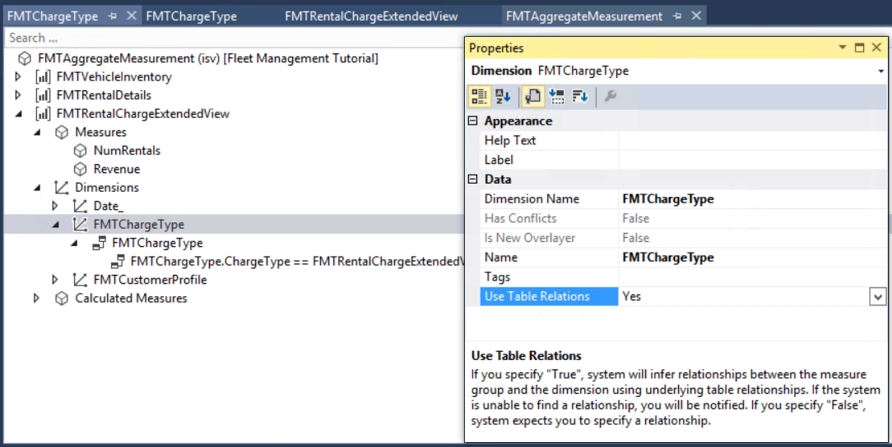

# Model aggregate data

[!include [banner](../includes/banner.md)]

This tutorial will walk you through the process of modeling aggregate data.

## Prerequisites

This tutorial requires you to access the environment using Remote Desktop, and be provisioned as an administrator. For more information, see the article named [Deploy and access development environments](../dev-tools/access-instances.md).

## Key concepts
- **Aggregate measurements**, similar to **perspectives** and **Cubes** from earlier versions, enable you to model and consume aggregate data.
- **Key Performance Indicators (KPIs)** are a form of analytic controls that track organizational performance against the current status. KPIs are represented as tiles in a **workspace** or the **dashboard**. In this tutorial, you will model a KPI in Visual Studio.
- KPIs that are modeled in Visual Studio can be modified in the client. A user also has the ability to model new KPIs using the client.
- A **workspace** is an overview page that is specific to a particular subject area. Workspaces are common to all users.
- The **dashboard** is the default home page for each user.
- **Tiles** are securable objects that can be pinned to a workspace or the dashboard. KPIs and aggregate data that are shown on the dashboard, or a workspace, can be secured by using menu items.
- Aggregate data can be consumed in building charts and other controls. Using the model driven approach, you have the ability to create data entities by directly referencing aggregate measurements and aggregate dimensions. These entities are referred to as **Aggregate data entities**. Aggregate data entities are read-only data entities used for reporting purposes.
- **The aggregate programming model** enables a developer to consume aggregate data programmatically using either X++ or C\# code. Data retrieved using the aggregate programming model can be used as a data source in forms.
- **Method expressions** enable a developer to build rich expressions using aggregate data. Method expressions are an X++ class. KPIs can be modeled using method expressions, thereby eliminating the need to build MDX expressions.
- **Contextual BI** refers to providing required insights as part of the user experience such that the user has relevant insights to not only achieve the task at hand, but be highly-productive during the course of the day.
- **Embedded BI** refers to analytic content being embedded within the user experience. Contextual BI and embedded BI teams are closely related. Contextual BI implies the added notion that the context of analytic context revolves around the data or the task.
- **Self-service BI** refers to enabling a user to tweak existing and/or create new analytic content such as reports, KPIs, and dashboards.

## Set up
If this is the first tutorial you are working on, make sure you have configured the administrator user if you are running on a local VM.

### Import the tutorial project

If you have already imported the Fleet management tutorial project, skip to the next section. In Visual Studio, on the **Dynamics 365** menu, click **Import Project**.

1. Download the Fleet Management sample from <https://github.com/Microsoft/FMLab>, save it to **c:\\**, and unzip it.
2. In the **Import Project** window, next to the **Filename** text box, click the ellipsis button.
3. In the **Select the file to import** window, browse to the location of the **FMLab** folder, click **FMTutorialDataModel.axpp**, and then click **Open**.
4. In the **Project file location** text box, enter **C:\\FMLab**.
5. Select the **Overwrite Elements** check box, and then click **OK**.

### Open the tutorial project

1. In Visual Studio, open the **FMTutorial** project. On the **File** menu, point to **Open**, and then click **Project/Solution**.
2. In the **Open Project** dialog box, browse to C:\\FMLab\\FMTutorial, and then click FMTutorial. Click **Open**. The **FMTutorial** project appears in **Solution Explorer**.
3. Use the FMTDataHelper class to load data for the Fleet Management tutorial. In **Solution Explorer**, in the FMTutorial project, expand **Classes**. Right-click **FMTDataHelper**, and then click **Set as Startup Object**.
4. On the **Build** menu, click **Rebuild Solution**. You use the rebuild to update the timestamps of the imported artifacts. You can view the build progress in the **Output** window.
5. Press Ctrl+F5 to run the project and load the data.

## Model an aggregate measurement for rental charges
Often, when a user asks for additional information, you get a request for one or more new reports. Imagine that the manager of a rental car company has called and asked for a report. The manager is interested in finding out how the rental business is performing. The manager wants a report that shows rental revenue by month. You soon find out that the manager is interested in a breakdown of rental revenues. The manager wants to know whether the rental revenue is high in cases where they have sold additional services, for example, car seats, GPS, re-fueling, as opposed to the base rental charge. As it turns out, the manager suspects that specific customer groups are driving revenue up, and this is why the manager wanted the report in the first place. The manager insists on adding Customer group to the report. Because the revenue must be considered in relation to the number of rentals, the manager doesn’t want a few large corporate rentals to skew the analysis. You both agree that the number of rentals needs to be shown along with revenue. We could represent this requirement as a set of business questions using a matrix. Rows indicate the **measures** (or numbers) and the columns indicate the **dimensions** (or slicers). An "X" in the intersection between a measure and a dimension indicates that the measure needs to be "grouped by" the dimension.

| Item                  | Rental date | Customer group | Rental charge type |
|-----------------------|-------------|----------------|--------------------|
| **Revenue**           | X           | X              | X                  |
| **Number of rentals** | X           | X              | X                  |

Next, we will model an aggregate measurement to answer this business question.

### Add a measure group for rental charges by using an existing view

In this section you will add a new measure group to an existing aggregate measurement.

1. In **Solution Explorer**, expand the **Analytics** folder of the project, and then double-click the aggregate measurement, **FMTAggregateMeasurement**. The aggregate measurement will be launched in the designer. Notice that the existing aggregate measurement contains two measure groups related to vehicle inventory and rental details. You will create a new measure group related to rental charges.

    

2. In **Solution Explorer**, expand the **Views** folder of the project, and then select the **FMTRentalChargeExtendedView** view.
3. Drag-and-drop the **FMTRentalChargeExtendedView** into the root node of the **FMTAggregateMeasurement** aggregate measurement in the designer. Notice that a new measure group is created and the values of properties have been applied as follows.

    | Property | Value                      |
    |----------|----------------------------|
    | Name     | FMRentalChargeExtendedView |
    | Table    | FMRentalChargeExtendedView |

4. In **Solution Explorer**, double-click the **FMRentalChargeExtendedView** view. When the designer form opens, expand the **Fields** node.
5. Select the **ExtendedAmount** and **RentalID** fields, and then drag-and-drop the two fields onto the **Measures** node of the newly created **FMAggregateMeasurement** measure group called **FMRentalChargeExtendedView**. As you drag the fields, hover your cursor over the **FMAggregateMeasurement** tab to access the **Measures** node. By default, when you drag-and-drop the fields, the system assumes that you want counts of the measures. In this case, you need to modify default properties for the **ExtendedAmount** and **RentalId** measures as follows:

    | Property (ExtendedAmount) | Value                               |
    |---------------------------|-------------------------------------|
    | Default Aggregate         | **Sum**                             |
    | Field                     | ExtendedAmount (no change required) |
    | Name                      | Revenue                             |

    | Property (RentalId) | Value                         |
    |---------------------|-------------------------------|
    | Default Aggregate   | **DistinctCount**             |
    | Field               | RentalId (no change required) |
    | Name                | NumRentals                    |

6. Next let's create another measure which calculates **Revenue per Rental** by copying an existing measure. Select the **TotalRevenue** measure. Right-click and select **Copy** from the **Context** menu.
7. Select the **FMRentalDetails** measure group. Right-click and select paste. Rename the newly created measure to **RevenuePerRental**. Modify the aggregation function to **Average**.

### Model an aggregate dimension charge type

To analyze rental revenue by the different charge types, you need to be able to slice revenue by the charge type. For this purpose, you will first model a charge type dimension.

1. In **Solution Explorer**, under **FMTutorial**, right-click **Analytics**, point to **Add**, and then click **New Item**.
2. Select **Dynamics 365 Artifacts** &gt; **Analytics** &gt; **Aggregate Dimension** from the list of items.
3. In the **Name** property, enter **FMTChargeType**. This is the name of the aggregate dimension that will be created. This name must be unique. Click **Add**. The new dimension will appear in Visual Studio.
4. In **Application Explorer**, expand the **AOT** and click **Data Model** &gt; **Tables**. Drag-and-drop the **FMTChargeType** table from **Application Explorer** onto the root node of the newly created **FMTChargeType** dimension in the designer. Notice that dimension attributes and corresponding keys have been added using the AutoReport field group of the table.
5. Expand the **Attributes** node of the new dimension. Notice that several attributes have been created for you by default. The system has also created a dimension key based on unique indexes of the table. You can add additional fields by dragging and dropping them into the **Fields** node.

    

6. Save the new dimension.
7. You may get a warning asking you to rename the field name Description to avoid the MDX reserved word. Even though the aggregate dimension may not be deployed to SSAS in this aggregate measurement, it's possible that this dimension may be used by an aggregate measurement deployed to SSAS in the future. To avoid potential issues in the future, rename the field name **Description** to **ChargeDescription**.

### Model dimension references for customer profile and charge type dimensions

Next, create dimension references to new and existing dimensions so that revenue can be sliced by customer as well as charge type.

1. In **Solution Explorer**, double-click **FMTAggregateMeasurement** or, if you have it open, navigate to it in the designer.
2. In **Solution Explorer**, select the dimensions **FMTChargeType** and **FMTCustomerProfile**.
3. Drag-and-drop them into the **Dimensions** node of the **FMTRentalChargeExtendedView** measure group. Notice that dimension references have been created along with relations.
4. Save changes to **FMTAggregateMeasurement**. Review the property sheet for the dimension relation and notice that the **Use Table relations** property is set to **Yes**. Notice that the drag-and-drop operation created relationships between the measure group dimensions **FMTRentalChargeExtendedView** and **FMTChargeType**, **FMTCustomerProfile**. Review the property sheet for the dimension relation and notice that the **Use Table relations** property is set to **Yes**.

    

    > [!NOTE]
    > In platform update 1611 and later, **UseTableRelations** property has been removed. When a new dimension reference is created, system will default existing relationships. You can continue to provide an explicit relationship by changing the relationship field that was defaulted. Providing an explicit relationship is equal to setting **UseTableRelationship** to **No**.

5. Expand the Dimension relations node for the **FMTCustomerProfile** dimension. Notice that the **UseTableRelations** property is set to **No**. In this case, the system has not been able to find a suitable relationship between the Measure group and dimension. You will need to specify one manually.
6. Expand the **FMTCustomerProfile** dimension reference if you have not done so already. Select the node **FMTCustomerExtendedView**. Right-click and see the property sheet.
7. Select **CustomerID** as the value for property **DimensionAttribute**. Select the relationship shown below. Select **Customer** for the property value **RelatedField**.
8. Save changes to **FMTAggregateMeasurement**.

    

9. In this scenario, we specified a relationship because the system was unable to find one. You could also specify a different relationship if you want to override the system choice by setting **Use Table Relations property** to **No**.

### Model dimension references for the date dimension's rental start date and transaction date

Assume that for analysis purposes, you want to enable slicing by the start date of the rental; but for accounting purposes, you want to enable slicing by the transaction date for each of the charges. To do this, you need to associate the rental charges measure group with two date dimensions. In the BI world, this pattern is known as **Role Playing dimensions**. By default, a date dimension is added to the measure group. You can rename the default name appropriately and add new date dimensions as required.

1. Expand the **Dimensions** node of the **FMTRentalChargeExtendedView** measure group. Notice that the **Date\_** dimension has already been included as dimension slicers.

    > [!NOTE]
    > If the table or the view used to model the measure group is a Company-specific table, for example it contains DATAAREAID as part of the key), a **Company** dimension relation will be created by default. In this case, the view we used is not a company specific one.

    

2. Select the **Date** dimension and specify the following properties.

    | Property            | Value                                        |
    |---------------------|----------------------------------------------|
    | Name                | RentalStartDate                              |
    | Use Table Relations | No (This is the default – no need to change) |

3. Define the table relationship. Expand **RentalStartDate**, and then expand the **Date** node.
4. Select the Relationship shown. Right-click and select the property sheet. Select **StartDate** for the value of **Related field** property.
5. The relationship you defined should look like the following screenshot.

    

6. Next, enable slicing of measures by the TransactionDate dimension. TransactionDate is also a date dimension, so you will add another reference to the date dimension and associate that with the corresponding field that contains the transaction date. When more than one date dimension is used as a slicer, each date dimension is known as a **Role playing date dimension**.
7. Under the **FMTRentalChargeExtendedView** measure group, right-click the **Dimensions** node, and then click **New Dimension**. A new dimension will be added to the list of dimension references.
8. Specify the following properties for the new dimension reference.

    | Property            | Value |
    |---------------------|-------|
    | Dimension Name      | Date\_<blockquote>[!NOTE] If you select the Dimension Name in the wrong order, it will reset the other values you already set.</blockquote> |
    |  Name               | TransactionDate |
    | Use table relations | No |
    | Tags                | RolePlayingDate; Fleet |

    Notice the new property called **Tags**. This property enables the discovery of patterns within code and metadata from within the Visual studio environment. You can enter any number of tags and they can be searched using the hot keys or the **Dynamics 365** menu in Visual Studio.

9. Define the table relationship. Right-click **TransactionDate**, and then click **New Relation**. You do not need to specify any properties in the DimensionsRelation at this point.
10. Expand **BIDateDimensionValue**, and then select the **Relationship** **Constraint**. Right-click and select the property sheet.
11. Specify the following properties for the BIDateDimensionsView relation constraint.

    | Property      | Value    |
    |---------------|----------|
    | Field         | Date     |
    | Related Field | TranDate |

    The relationship you defined should look like the following screenshot.

    

12. Save the aggregate measurement.

### Deploy the newly generated aggregate measurement

Now that you have completed modeling the aggregate measurement, you can deploy the aggregate measurement and continue with building KPIs and visualizations. You have 2 deployment choices as shown below.

| Option                | Considerations |
|-----------------------|----------------|
| In-memory real-time   | This option will leverage the In-memory Column store indexes of SQL Server database to deploy Aggregate Measurements. This option is recommended when the Aggregate measurement is used for embedded analytics within the client where you need **real-time analytics**. For an overview of concepts on real-time analytics, see [Analytics, aggregate measurements, and KPI modeling](analytics.md). |
| Stage in Entity Store | This option leverages Entity store, the operational data store that enables **near real-time PowerBI reporting**. If you choose this option, Aggregate measurement can be deployed to Entity store and you can schedule the data to be refreshed periodically. For an overview of this approach, refer to the blog post here: [https://blogs.msdn.microsoft.com/dynamicsaxbi/2016/06/09/power-bi-integration-with-entity-store-in-dynamics-ax-7-may-update/](/archive/blogs/dynamicsaxbi/power-bi-integration-with-entity-store-in-dynamics-ax-7-may-update) |

> [!NOTE]
> **SSAS Cube** option is no longer supported when modeling aggregate measurements.

1. Select the **FMTAggregateMeasurement** node. Right-click and select **Properties**. Select **InMemoryRealTime** as the value for the property **Usage**.

    

2. InMemoryRealTime aggregate models are deployed to SQL Server using Non-Clustered Column Store Index (NCCI) technology. NCCIs is an in-memory technology that enables analytical and operational workloads to be served from SQL server database. NCCI indexes can be defined on tables similar to any other index. While NCCI indexes can be defined manually, framework has the ability to analyze index requirements and add them to underlying tables where necessary.
3. Right-click **FMAggregateMeasurement** in Solution Explorer, and then click **Add Column store indices option**. You will notice several new indexes being added by the system.
4. Save and build the project.
5. InMemoryRealTime aggregate models do not require data processing as the models are queried real-time. If you have not enabled database synchronization along with the build, manually synchronize the database.

## Model a KPI to show revenue per rental
### Model a KPI in Visual Studio

Model a KPI definition in Visual Studio by using the aggregate measurement you defined above.

1. In **Solution Explorer**, right-click **FMTutorial**, point to **Add**, and then click **New Item**.
2. Select **Dynamics 365 Artifacts** &gt; **Analytics** &gt; **Key Performance Indicator**. Enter FMTRevenuePerRental as the name of the KPI, and then click **Add**. The name must be unique across KPIs. The KPI is created.
3. Select **FMTRevenuePerRental**, and specify the **Measurement** Leave the default values for the other properties.

    | Property              | Value                   |
    |-----------------------|-------------------------|
    | Measurement           | FMTAggregateMeasurement |
    | Bad Threshold         | 0                       |
    | Good Threshold        | 0                       |
    | Scoring Pattern       | MoreIsBetter            |
    | Show Goal             | Yes                     |
    | Show Status and Trend | Yes                     |
    | Threshold Type        | Value                   |

4. Define the expression for the KPI value. Under **FMTRevenuePerRental**, select **Value**, and specify the following properties.

    > [!NOTE]
    > The values must be entered in the order they appear in the table:

    | Property      | Value                       |
    |---------------|-----------------------------|
    | Value Type    | BasedOnMeasure              |
    | Measure Group | FMTRentalChargeExtendedView |
    | Measure       | RevenuePerRental            |

5. Define the expression for the KPI Goal. Select **Goal**, and specify the following properties.

    | Property  | Value        |
    |-----------|--------------|
    | Goal Type | BasedOnValue |
    | Value     | 250          |

    > [!NOTE]
    > You could have defined a goal based on an aggregate measure as well. In this case, we will define a number as the goal.

6. Save the KPI definition.

### Preview KPI in client

Next you will preview the KPI definition in the client.

1. Right-click **FMTutorial**, and then click **Re-Build**. On completion of the build, select the **Synchronize ... database** option.
2. Open Internet Explorer, and navigate to your Rainier instance base URL.
3. Navigate to the **Reservation Management workspace** under **App links** &gt; **Fleet Management** &gt; **Workspaces** &gt; **Reservation Management**.
4. Select the KPI tile **Total Revenue**. KPI details page for T**otal Revenue** KPI will be displayed.
5. To navigate to the newly defined KPI, select the **Show list** icon on top left. From the list of KPIs shown, select **FMTRevenuePerRental**.

    Notice that the KPI details page for the new KPI, **FMTRevenuePerRental** is shown. Even though we did not define trend charts, the system created a set of charts based on the limited metadata defined by the developer. Users have the ability to modify KPI definitions and create new ones in the client. Next, you will modify the newly defined KPI.

6. To demonstrate this capability, you can change the KPI Goal. Click the **Edit** button on top left, and enter 900 as the Goal Value.
7. Modify the threshold properties as follows:

    |  Property          | Value      |
    |--------------------|------------|
    | Threshold Type     | Percentage |
    | Red if less than   | 90         |
    | Green if more than | 110        |

8. Click **Save** on the bottom left to save changes. Notice that the KPI status color has changed in the KPI tile shown.

[!INCLUDE[footer-include](../../../includes/footer-banner.md)]
