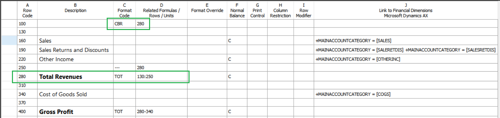

---
# required metadata

title: Modify row definition cells
description: This article describes the information that is required for each cell in a row definition on a financial report and explains how to enter that information.
author: aprilolson
ms.date: 08/11/2021
ms.topic: article
ms.prod: 
ms.technology: 

# optional metadata

ms.search.form: FinancialReports
# ROBOTS: 
audience: Application User
# ms.devlang: 
ms.reviewer: twheeloc
# ms.tgt_pltfrm: 
ms.custom: 58881
ms.assetid: 0af492df-a84e-450c-8045-78ef1211abaf
ms.search.region: Global
# ms.search.industry: 
ms.author: aolson
ms.search.validFrom: 2016-11-30
ms.dyn365.ops.version: Version 1611

---

# Modify row definition cells

[!include [banner](../includes/banner.md)]

This article describes the information that is required for each cell in a row definition on a financial report and explains how to enter that information.

## Specify a row code in a row definition

In row definitions, the numbers or labels in the **Row code** cell identify each line in the row definition. You can specify the row code to refer to data in calculations and totals.

### Row code requirements

A row code is required for all rows. You can mix numeric, alphanumeric, and unset (empty) row codes in a row definition. The row code can be any positive integer (below 100,000,000) or a descriptive label that identifies that row. A descriptive label must follow these rules:

- The label must begin with an alphabetical character (a through z or A through Z), and can be any combination of numbers and letters up to 16 characters.

    > [!NOTE]
    > A label can include the underscore character (\_), but no other special characters are allowed.

- The label can't use any of the following reserved words: AND, OR, IF, THEN, ELSE, PERIODS, TO, BASEROW, UNIT, NULL, CPO, or RPO.

The following examples are valid row codes:

- 320
- TL\_NET\_INCOME
- TL\_NET\_94

### Change a row code in a row definition

1. In Report designer, click **Row definitions**, and then open the row definition to modify.
2. In the appropriate row, enter the new value in the cell in the **Row code** column.

### Reset numeric row codes

1. In Report designer, click **Row definitions**, and then open the row definition to modify.
2. On the **Edit** menu, click **Renumber rows**.
3. In the **Renumber rows** dialog box, specify new values for the starting row code and the row code increment. You can reset the numeric row codes to equally spaced values. However, report designer renumbers only row codes that begin with numbers (for example, 130 or 246). It doesn't renumber row codes that begin with letters (for example, INCOME\_93 or TP0693).

> [!NOTE]
> When you renumber row codes, report designer automatically updates **TOT** and **CAL** references. For example, if a **TOT** row refers to a range that starts with row code 100, and you renumber rows, starting with 90, the starting **TOT** reference changes from 100 to 90.

## Add a description
The description cell provides the description of the financial data in the row of the report, such as "Revenue" or "Net Income." The text in the **Description** cell appears on the report exactly as you enter it in the row definition.

> [!NOTE]
> The width of the description column on the report is set in the column definition. If the text in the **Description** column in the row definition is long, verify the width of the **DESC** column. When you use the **Insert Rows from** dialog box, the values in the **Description** column are the segment values or dimension values from the financial data. You can insert rows to add descriptive text, such as a section heading or a section total, and to add formatting, such as a line before a total row. If the report includes a reporting tree, you can include the additional text that is defined for the reporting units in the reporting tree. You can also limit the additional text to a specific reporting unit.

### Add the description for a line on a report

1. In Report designer, click **Row definitions**, and then open the row definition to modify.
2. Select the **Description** cell, and then enter the name of the report row.
3. Apply formatting.

### Add additional text from a reporting tree in the description

1. In Report designer, click **Row definitions**, and then open the row definition to modify.
2. Enter the additional text code and any other text in the appropriate **Description** cell.
3. Apply formatting.

### Limit the additional text to a specific reporting unit

1. In Report designer, click **Row definitions**, and then open the row definition to modify.
2. Locate the row where additional text should be created, and then double-click the cell in the **Related Formulas/Rows/Units** column.
3. In the **Reporting unit selection** dialog box, in the **Reporting tree** field, select a reporting tree.
4. In the **Select reporting unit for restriction** field, expand or collapse the reporting tree, and then select a reporting unit.

## Add a format code
The **Format code** cell offers a selection of preformatted choices for the content of that row. If the **Format code** cell is blank, the row is interpreted as a financial data detail row.

> [!NOTE]
> If a report contains non-amount formatting rows that are related to amount rows that have been suppressed (for example, because of zero balances), you can use the **Related Formulas/Rows/Units** column to prevent title and format rows from being printed.

### Add a format code to a report row

1. In Report designer, click **Row definitions**, and then select a row definition to modify.
2. Double-click the **Format code** cell.
3. Select a format code in the list. The following table describes the format codes and their actions.

    | Format code                   | Interpretation of the format code | Action |
    |-------------------------------|-----------------------------------|--------|
    | (None)                        |                                   | Clears the **Format code** cell. |
    | TOT                           | Total                             | Identifies a row that uses mathematical operators in the **Related Formulas/Rows/Units** column. Totals contain simple operators, such as **+** or **-**. |
    | CAL                           | Calculation                       | Identifies a row that uses mathematical operators in the **Related Formulas/Rows/Units** column. Calculations contain complex operators, such as **+**, **-**, **\***, **/**, and **IF/THEN/ELSE** statements. |
    | DES                           | Description                       | Identifies a heading line or an empty line on a report. |
    | LFT RGT CEN                   | Left Right Center                 | Aligns the row description text on the report page, regardless of the text's placement in the column definition. |
    | CBR                           | Change Base Row                   | Identifies a row that sets the base row for column calculations. |
    | COLUMN                        | Column break                      | Starts a new column on the report. |
    | PAGE                          | Page break                        | Starts a new page on the report. |
    | \---                          | Single underline                  | Puts a single line under all amount columns on the report. |
    | ===                           | Double underline                  | Puts a double line under all amount columns on the report. |
    | LINE1                         | Thin line                         | Draws a single thin line across the page. |
    | LINE2                         | Thick line                        | Draws a single thick line across the page. |
    | LINE3                         | Dotted line                       | Draws a single dotted line across the page. |
    | LINE4                         | Thick line and thin line          | Draws a double line across the page. The top line is thick, and the bottom line is thin. |
    | LINE5                         | Thin line and thick line          | Draws a double line across the page. The top line is thin, and the bottom line is thick. |
    | BXB BXC                       | Boxed row                         | Draws a box around the report rows that begin with the **BXB** row and end with the **BXC** row. |
    | REM                           | Remark                            | Identifies a row that is a comment row and should not be printed on the report. For example, a remark row might explain your formatting techniques. |
    | SORT ASORT SORTDESC ASORTDESC | Sort                              | Sorts expenses or revenues, sorts an actual or budget variance report by the largest variance, or sorts the row descriptions alphabetically. |

## Specify related formulas/rows/units
The **Related formulas/Rows/Units** cell has multiple purposes. Depending on the type of row, a **Related Formulas/Rows/Units** cell can perform one of the following functions:

- Define the rows to include in a calculation when you use a **TOT** format code or a **CAL** format code.
- Link a formatting row to an amount row, so that the formatting is printed only when the related amount is printed.
- Limit a row to a specific reporting unit.
- Define the base row for calculations when you use the **BASEROW** format code.
- Define the rows to sort when you use any of the sorting format codes.

### Use a row total in a row definition

Use a row total formula to add or subtract amounts in other rows. A formula for creating a row total can include the + and - operators to combine individual row codes and ranges. Ranges are indicated by a colon (:). The formula can contain up to 1,024 characters. Here is an example of a standard totaling formula: 400+420+430+450+460LIABILITIES+EQUITY520:546520:546-LIABILITIES

### Components of a row total formula

When you create a row total formula, you must use row codes to specify which rows to add or subtract in the current row definition, and you must use operators to specify how the rows are combined. Total rows and amount rows can be used in any combination.

> [!NOTE]
> All total rows that are in a range are excluded. To create a grand total, you can specify the range of rows. If the first row of a range is a total row, that row is included in the new total. The following table describes how operators are used in row total formulas.

| Operator | Example formula | Description                                                 |
|----------|-----------------|-------------------------------------------------------------|
| +        | 100+330         | Adds the amount in row 100 to the amount in row 330.        |
| :        | 100:330         | Adds the totals of all rows between row 100 and row 330.    |
| -        | 100-330         | Subtracts the amount in row 100 from the amount in row 330. |

### Create a row total

1. In Report designer, click **Row definitions**, and then open the row definition to modify.
2. Double-click the **Format code** cell in the row definition, and select **TOT**.
3. In the **Related Formulas/Rows/Units** cell, enter the total formula.

### Relate a format row to an amount row

In the **Format code** column in a row definition, the **DES**, **LFT**, **RGT**, **CEN**, **---**, and **===** format codes apply formatting to non-amount rows. To prevent this formatting from being printed when the related amount rows are suppressed (for example, because the amount rows contain zero values or no period activity), you must relate the format rows to the corresponding amount rows. This functionality is useful when you want to prevent headers or formatting that is related to subtotals from being printed when there is no detail to print for the period.

> [!NOTE]
> You can also prevent the detailed amount rows from being printed by clearing the option to display rows without amounts. This option is located on the **Settings** tab of the report definition. By default, transaction detail accounts that have a zero balance or no period activity are suppressed in reports. To show these transaction detail accounts, select the **Display rows without an amounts** check box on the **Settings** tab of the report definition.

### Relate a format row to an amount row

1. In Report Designer, click **Row definitions**, and then select a row definition to modify.
2. In the formatting row, in the **Related Formulas/Rows/Units** cell, enter the row code of the amount row to suppress.

    > [!NOTE]
    > To suppress an amount row, the balance of the row must be 0 (zero). An amount row that has a balance isn't suppressed.

3. On the **File** menu, click **Save**.

### Example of preventing printing of rows

In the following example, a user wants to prevent the heading and underscores in the **Total cash** row of their report from being printed, because there was no activity in either of the cash accounts. Therefore, in row 220 (which, as the **---** format code indicates, is a formatting row), in the **Related Formulas/Rows/Units** cell, the user enters **250**, which is the row code of the amount row that the user wants to suppress.

## Select the base row for a column calculation
In relational reporting, you assign one or more base rows in the row definition by using the **CBR** (change base row) format code. A base row is then referenced by a calculation in the column definition. Here are some typical examples of CBR calculations:

- Percentage of total revenue as it's related to individual revenue items
- Percentage of total expense as it's related to individual expense items
- Percentage of gross margin as it's related to division or department details.

One or more base rows are defined in the row definition, and then the column definition determines the relationship that the base row is reported on. The code that is used in the column formula is **BASEROW**. The following basic mathematical operations are used with **BASEROW**: divide, multiply, add, or subtract. The operation that is used most often is divide by **BASEROW**, where the result is shown as a percentage. Column calculations that use **BASEROW** in the formula use the row definition for the related base row codes. **CBR** rows have the following characteristics:

- **CBR** rows aren't printed on the completed report.
- The **CBR** format code and its related row code are positioned above the row or section that displays related calculations.

In a column definition, the **CALC** column type indicates a column that specifies a formula in the **Formula** row. This formula operates on the data for this column of the report and uses the Baserow keyword to base calculations on the **CBR** format codes in the row. In the row definition, the **CBR** format code defines the base row for columns that calculate a percentage of or multiply by the base row for each row in the report. You can have multiple **CBR** format codes in a row format, such as one for net sales, one for gross sales, and one for total expenses. Usually, the **CBR** format code is used to create a percentage for accounts that are compared to a total line. A base row is used for all calculations until another base row is defined. You must define a starting **CBR** format code and an ending **CBR** format code. For example, to determine expenses as a percentage of net sales, you can divide the value in each expense row by the value in the net sales row. In this case, the net sales row is the base row. You can define a column definition that reports current and year-to-date results, together with a base percentage of each result, as shown in the example that follows. Start with a detailed income statement.

### Select the base row in a row definition for a column calculation

1. In Report designer, click **Column definitions**, and then open the column definition for an income statement.
2. Add a new column to the column definition, and set the column type to **CALC**.
3. In the **Formula** cell of the new column, enter the formula **X/BASEROW**, where **X** is the **FD** column type to see a percentage of.
4. Double-click the **Format/Currency override** cell.
5. In the **Format override** dialog box, in the **Format category** list, select **Percentage**, and then click **OK**.
6. On the **File** menu, click **Save As** to save the column definition under a new name. Append **CBR** to the current file name (for example, **CUR\_YTD\_CBR**). This column definition is your base row column definition.
7. In Report Designer, click **Row definitions**, and then open the row definition to modify by using the base row calculation.
8. Insert a new row above the row where the base row calculation should start.
9. Double-click the **Format code** cell of the row definition, and then select **CBR**.
10. In the **Related Formulas/Rows/Units** cell, enter the row code number for the base row.

### Example of base row calculation

In the following example of a row definition, row 100 shows that the base row for calculations is row 280.

In the following example of a column definition, the calculations use the **CBR** format code. The calculation in column C divides the value in column B of the report by the value in row 280 of column B. The format override in column B prints the result of the calculation as a percentage. Similarly, each amount in column E is the amount in column D as a percentage of net sales.

The following example shows a report that might be generated based on the previous calculations.

## Select a sorting code for a row definition
Sorting codes sort accounts or values, sort an actual or budget variance report by the largest variance, or sort the row descriptions alphabetically. The following sorting codes are available:

- **SORT** – Sorts the report in ascending order, based on the values in the specified column.
- **ASORT** – Sorts the report in ascending order, based on the absolute value of the values in the specified column. In other words, the sign of each value is ignored when the values are sorted. This format code sequences the values by the magnitude of the variance, regardless of whether the variance is positive or negative.
- **SORTDESC** – Sorts the report in descending order, based on the values in the specified column.
- **ASORTDESC** – Sorts the report in descending order, based on the absolute value of the values in the specified column.

### Select a sorting code

1. In Report designer, click **Row definitions**, and then open the row definition to modify.
2. Double-click the **Format code** cell, and then select a sorting code.
3. In the **Related Formulas/Rows/Units** cell, specify the range of row codes to sort. To specify a range, enter the first row code, a colon (:), and then the last row code. For example, enter **160:490** to specify that the range is row 160 through row 490.
4. In the **Column restriction** cell, enter the letter of the report column to use for the sorting.

    > [!NOTE]
    > Include only amount rows in a sort calculation.

### Examples of ascending and descending column values

In the following example, the values in column D of the report will be sorted in ascending order for rows 160 through 490. Additionally, the absolute values in column G of the report will be sorted in descending order for rows 610 through 940.

| Row code | Description                             | Format code | Related Formulas/Rows/Units | Normal balance | Column restriction | Link to financial dimensions |
|----------|-----------------------------------------|-------------|-----------------------------|----------------|--------------------|------------------------------|
| 100      | Sorted by Monthly Variance in Ascending Order       | DES         |                |                |                    |                              |
| 130      |                                        | SORT        | 160:490                     |                | D                  |                              |
| 160      | Sales                                   |             |                             | C              |                    | 4100                         |
| 190      | Sales Returns                        |             |                             |                |                    | 4110                         |
|          | ...                             |             |                             |                |                    |                              |
| 490      | Interest Income              |             |                             | C              |                    | 7000                         |
| 520      |                                     | DES         |                             |                |                    |                              |
| 550      | Sorted by YTD Absolute Variance in Descending Order | DES         |             |                |                    |                              |
| 580      |                              | ASORTDESC   | 610:940                     |                | G                  |                              |
| 610      | Sales                     |             |                             | C              |                    | 4100                         |
| 640      | Sales Returns                |             |                             |                |                    | 4110                         |
|          | ...                       |             |                             |                |                    |                              |
| 940      | Interest Income               |             |                             | C              |                    | 7000                         |

## Specify a format override cell
The **Format override** cell specifies the formatting that is used for the row when the report is printed. This formatting overrides the formatting that is specified in the column definition and the report definition. By default, the formatting that is specified in those definitions is currency. If one row of the report lists the number of assets, such as the number of buildings, and another row lists the monetary value of those assets, you can override the currency formatting and enter numeric formatting for the row that specifies the number of buildings. You specify this information in the **Format override** dialog box. The available options depend on the format category that you select. The **Sample** area of the dialog box shows example formats. The following format categories are available:

- Currency formatting
- Numeric formatting
- Percentage formatting
- Custom formatting

### Override cell formatting

1. In Report designer, open the row definition to modify.
2. In the row to override the format for, double-click the cell in the **Format override** column.
3. In the **Format override** dialog box, select the formatting options to use for that row in the report.
4. Click **OK**.

### Currency formatting

Currency formatting applies to a fiscal amount and includes the currency symbol. The following options are available:

- **Currency symbol** – The currency symbol for the report. This value overrides the **Regional Options** setting for the company information.
- **Negative numbers** – Negative numbers can have a minus sign (-), they can appear in parentheses, or they can have a triangle (∆).
- **Decimal places** – The number of digits to show after the decimal point.
- **Zero value override text** – The text to include in the report when the amount is 0 (zero). This text appears as the last line in the **Sample** area.

    > [!NOTE]
    > If printing is suppressed for zero values or no period activity, this text is suppressed.

### Numeric formatting

Numeric formatting applies to any amount and doesn't include a currency symbol. The following options are available:

- **Negative numbers** – Negative numbers can have a minus sign (-), they can appear in parentheses, or they can have a triangle (∆).
- **Decimal places** – The number of digits to show after the decimal point.
- **Zero value override text** – The text to include in the report when the amount is 0 (zero). This text appears as the last line in the **Sample** area.

    > [!NOTE]
    > If printing is suppressed for zero values or no period activity, this text is suppressed.

### Percentage formatting

Percentage formatting includes the percent sign (%). The following options are available:

- **Negative numbers** – Negative numbers can have a minus sign (-), they can appear in parentheses, or they can have a triangle (∆).
- **Decimal places** – The number of digits to display after the decimal point.
- **Zero value override text** – The text to include in the report when the amount is 0 (zero). This text appears as the last line in the **Sample** area.

    > [!NOTE]
    > If printing is suppressed for zero values or no period activity, this text is suppressed.

### Custom formatting

Use the custom formatting category to create a custom format override. The following options are available:

- **Type** – The custom format.
- **Zero value override text** – The text to include in the report when the amount is 0 (zero). This text appears as the last line in the **Sample** area.

    > [!NOTE]
    > If printing is suppressed for zero values or no period activity, this text is suppressed.

The type should represent the positive value and then the negative value. Typically, you enter a similar format that differentiates positive and negative values. For example, to specify that both positive and negative values have two decimal places, but negative values appear in parentheses, enter **0.00;(0.00)**. The following table shows custom formats that you can use to control the format of your values. All the examples start from the value 1234.56.

| Format                         | Positive   | Negative     | Zero    |
|--------------------------------|------------|--------------|---------|
| 0                              | 1235       | -1235        | 0       |
| 0;0                            | 1235       | 1235         | 0       |
| 0;(0);-                        | 1235       | 1235         | -       |
| \#,\#\#\#;(\#,\#\#\#);""       | 1,235      | (1,235)      | (Blank) |
| \#,\#\#0.00;(\#,\#\#0.00);zero | 1,234.56   | (1,234.56)   | zero    |
| 0.00%;(0.00%)                  | 123456.00% | (123456.00%) | 0.00%   |

## Specify a Normal Balance cell
The **Normal Balance** cell in a row definition controls the sign of the amounts in a row. To reverse the sign of a row, or if the normal balance of an account is a credit, enter a **C** in the **Normal balance** cell for that row. Report designer reverses the sign on all credit balance accounts in that row. When Report designer converts these accounts, it removes the debit/credit characteristic from all amounts and therefore makes totaling straightforward. For example, to calculate net income, you subtract expenses from income. Typically, totaled and calculated rows aren't affected by a **C** code. However, the **XCR** print control in the column definition reverses the sign of any row that contains a **C** in the **Normal balance** column. This formatting is especially important when you want to show all unfavorable variances as negative amounts. If a totaled or calculated number has the wrong sign, enter a **C** in the **Normal balance** cell for the row to reverse the sign.

## Specify a row modifier cell
The content of the **Row modifier** cell in a row definition overrides the fiscal years, periods, and other information that is specified in the column definition for that row. The selected modifier applies to every account in the row. You can modify each row by using one or more of the following types of modifiers:

- Account modifiers
- Book code modifiers
- Account and transaction attributes

### Override a column definition

1. In Report designer, open the row definition to modify.
2. In the row where you want to override the column definition, double-click the **Row modifier** cell.
3. In the **Row modifier** dialog box, select an option in the **Account modifier** field. For a description of the options, see the "Account modifiers" section.
4. In the **Book code modifier** field, select the book code to use for the row.
5. Under **Attributes**, follow these steps to add an entry for each attribute that should be included with the row code:

    1. Double-click the **Attribute** cell, and select an attribute name.

        > [!IMPORTANT]
        > Replace the number sign (\#) with a numeric value.

    2. Double-click the **From** cell, and enter the first value for the range.
    3. Double-click the **To** cell, and enter the last value for the range.

6. Click **OK**.

### Account modifiers

When you select a specific account, report designer usually combines the account and the fiscal years, periods, and other information that you specify in the column definition. You can use different information, such as different fiscal periods, for specific rows. The following table shows the account modifiers that are available. Replace the number sign (\#) with a value that is equal to or less than the number of periods in a fiscal year.

| Account modifier | What is printed                                                                           |
|------------------|-------------------------------------------------------------------------------------------|
| /BB              | The beginning balance for an account.                                                     |
| /\#              | The balance for the specified period.                                                     |
| /-\#             | The balance for the period that is \# periods before the current period.                  |
| /+\#             | The balance for the period that is \# periods after the current period.                   |
| /C               | The balance for the current period.                                                       |
| /C-\#            | The balance for the period that is \# periods before the current period.                  |
| /C+\#            | The balance for the period that is \# periods after the current period.                   |
| /Y               | The year-to-date balance through the current period.                                      |
| /Y-\#            | The year-to-date balance through the period that is \# periods before the current period. |
| /Y+\#            | The year-to-date balance through the period that is \# periods after the current period.  |

### Book code modifiers

You can limit a row to an existing book code. The column definition must include at least one **FD** column that has a book code.

> [!NOTE]
> The book code restriction for a row overrides the book code restrictions in the column definition for that row.

### Account and transaction attributes

Some accounting systems support account attributes and transaction attributes in the financial data. These attributes function like virtual account segments, and can carry additional information about the account or transaction. This additional information might be account IDs, batch IDs, postal codes, or other attributes. If your accounting system supports attributes, you can use account attributes or transaction attributes as row modifiers in the row definition. For information about how to override row information, see the "Override a column definition" section earlier in this article.

## Specify a link to financial dimensions cell
The **Link to financial dimensions** cell contains links to the financial data that should be included in each row of a report. This cell contains dimension values. To open the **Dimensions** dialog box, double-click the **Link to financial dimensions** cell.

> [!NOTE]
> Report designer can't select accounts, dimensions, or fields from the Microsoft Dynamics 365 Finance system that include any of the following reserved characters: &, \*, \[, \], {, or }. To specify information for a row that is already in the row definition, add the information in the **Link to financial dimensions** cell. To add new rows that link to the financial data, use the **Insert Rows from** dialog box to create new rows in the report definition. The column title changes, depending on how the column is configured, as shown in the following table.

| Link type that is selected       | The description of the Link column changes to this |
|----------------------------------|----------------------------------------------------|
| Financial Dimensions             | Link to Financial Dimensions                       |
| Report Worksheet                 | Financial Reporting Report                         |

### Specify a dimension or range

1. In Report designer, open the row definition to modify.
2. Double-click a cell in the **Link to financial dimensions** column.
3. In the **Dimensions** dialog box, double-click a cell under the dimension name.
4. In the dialog box for the dimension, select **Individual or range**.
5. In the **From** field, enter the starting dimension, or click  to search for available dimensions. To enter a range of dimensions, enter the ending dimension in the **To** field.
6. Click **OK** to close the dialog box for the dimension. The **Dimensions** dialog box displays the updated dimension or range.
7. Click **OK** to close the **Dimensions** dialog box.

## Display zero balance accounts in a row definition
By default, report designer doesn't print any row that doesn't have a corresponding balance in the financial data. Therefore, you can create one row definition that includes all natural segment values or all dimension values, and then use that row definition for any of your departments.

### Modify zero balance settings

1. In Report designer, open the report definition to modify.
2. On the **Settings** tab, under **Other formatting**, select options for the row definition that is used in the report definition.
3. On the **File** menu, click **Save** to save your changes.

## Use wildcard characters and ranges in a row definition
When you enter a natural segment value in the **Dimensions** dialog box, you can put a wildcard character (? or \*) in any position of a segment. Report designer extracts all the values for the defined positions without considering the wildcard characters. For example, the row definition contains only natural segment values, and natural segments have four characters. By entering **6???** in a row, you instruct report designer to include all accounts that have a natural segment value that starts with a 6. If you enter **6\***, the same results are returned, but the results also include variable-width values, such as **60** and **600000**. Report designer replaces each wildcard character (?) with the complete range of possible values, which include letters and special characters. For example, in the range from **12?0** through **12?4**, the wildcard character in **12?0** is replaced with the lowest value in the character set, and the wildcard character in **12?4** is replaced with the highest value in the character set.

> [!NOTE]
> You should avoid using wildcard characters for the starting and ending accounts in ranges. If you use wildcard characters in either the starting account or the ending account, you might receive unexpected results.

### Single-segment or single-dimension ranges

You can specify a range of segment values or dimension values. The benefit of specifying a range is that you don't have to update the row definition every time that a new segment value or dimension value is added to the financial data. For example, the range **+Account=\[6100:6900\]** pulls the values from accounts 6100 through 6900 into the row amount. When a range includes a wildcard character (?), report designer doesn't evaluate the range on a character-by-character basis. Instead, the low and high ends of the range are determined, and then the end values and all values between them are included.

> [!NOTE]
> Report designer can't select accounts, dimensions, or fields from the Microsoft Dynamics 365 Finance system that include any of the following reserved characters: &, \*, \[, \], {, or }. You can add an ampersand (&) only when you're automatically building row definitions by using the **Insert rows from dimensions** dialog box.

### Multiple-segment or multiple-dimension ranges

When you enter a range by using combinations of multiple dimension values, the range comparison is done on a ..\\financial-dimensions\\dimension-by-dimension basis. The range comparison can't be done on either a character-by-character basis or a partial segment basis. For example, the range **+Account=\[5000:6000\], Department=\[1000:2000\], Cost center=\[00\]** includes only the accounts that match each segment. In this scenario, the first dimension must be in the range from 5000 through 6000, the second dimension must be in the range from 1000 through 2000, and the last dimension must be 00. For example, **+Account=\[5100\], Department=\[1100\], Cost center=\[01\]** isn't included on the report, because the last segment is outside the specified range. If a segment value includes spaces, enclose that value in square brackets (\[ \]). The following values are valid for a four-character segment: **\[ 234\], \[123 \], \[1 34\]**. Dimension values should be enclosed in square brackets (\[ \]), and report designer adds these brackets for you. When a multiple-segment or multiple-dimension range includes wildcard characters (? or \*), the low and high ends of the whole multiple-segment or multiple-dimension range are determined, and then the end values and all values between them are included. If you have a large range, such as the whole range of accounts from 40000 through 99999, you should specify a valid starting account and ending account whenever possible.

> [!NOTE] 
> Report designer can't select accounts, dimensions, or fields from the Microsoft Dynamics 365 Finance system that include any of the following reserved characters: &, \*, \[, \], {, or }. You can add an ampersand (&) only when you're automatically building row definitions by using the **Insert rows from dimensions** dialog box.

## Add or subtract from other accounts in a row definition
To add or subtract the monetary amounts in one account from the monetary amounts in another account, you can use the plus sign (+) and the minus sign (-) in the **Link to Financial Dimensions** cell. The following table shows acceptable formats for adding and subtracting links to financial data.

| Operation                                            | Use this format                                                                                              |
|----------------------------------------|--------------------------------------------------------------------------------------------------------------|
| Add two fully qualified accounts.      | +Division=\[000\], Account=\[1205\], Department=\[00\]+Division=\[100\], Account=\[1205\], Department=\[00\] |
| Add two segment values.                    | +Account=\[1205\]+Account=\[1210\]                                                                           |
| Add segment values that include wildcard characters.  | +Account=\[120?+Account=\[11??\]                                                                     |
| Add a range of fully qualified accounts.              | +Division=\[000:100\], Account=\[1205\], Department=\[00\]                                           |
| Add a range of segment values.                | +Account=\[1200:1205\]                                                                                       |
| Add a range of segment values that include wildcard characters.         | +Account=\[120?:130?\]                                                           |
| Subtract one fully qualified account from another fully qualified account.              | +Division=\[000\], Account=\[1205\], Department=\[00\]-Division=\[100\], Account=\[1205\], Department=\[00\] |
| Subtract one segment value from another segment value.          | +Account=\[1205\]-Account=\[1210\]                                                               |
| Subtract a segment value that includes a wildcard character from another segment value. | +Account=\[1200\]-Account=\[11??\]                                        |
| Subtract a range of fully qualified accounts.                               | -Division=\[000:100\], Account=\[1200:1205\], Department=\[00:01\]                   |
| Subtract a range of segment values.                   | -Account=\[1200:1205\]                                                                                       |
| Subtract a range of segment values that include wildcard characters.                    | -Account=\[120?:130?\]                                               |

Although you can modify the accounts directly, you can also use the **Dimensions** dialog box to apply the correct formatting to your financial data links. Any of the values can include wildcard characters (? or \*). However, Report Designer can't select accounts, dimensions, or fields from the Microsoft Dynamics ERP system that include any of the following reserved characters: &, \*, \[, \], {, or }.

> [!NOTE]
> To subtract values, you must put parentheses around those values. For example, if you enter **450?-(4509)**, it's displayed as **+Account=\[4509\]-Account=\[450?\]**, and you're instructing report designer to subtract the amount for account segment 4509 from the amount for any account segment that starts with 450.

### Add or subtract accounts from other accounts

1. In Report designer, open the row definition to modify.
2. In the appropriate row, double-click the cell in the **Link to financial dimensions** column.
3. In the first row of the **Dimensions** dialog box, follow these steps:

    1. In the first field, select all dimensions (default), or click to open the **Manage dimension sets** dialog box, where you can create, modify, copy, or delete a set.
    2. Double-click the **Operator +/-** cell, and select the plus (**+**) or minus (**-**) operator that applies to one or more dimension values or sets in the row.
    3. In the appropriate dimension value column, double-click the cell to open the **Dimensions** dialog box, and select whether this dimension value is for an individual or range, a dimension value set, or totaling accounts. For descriptions of the fields in the **Dimensions** dialog box, see the "Description of the dimension dialog box" section.
    4. Enter segment values in the **From** column and **To** column.

4. Repeat steps 2 through 3 to add more operations.

> [!NOTE]
> The operator applies to all dimensions in the row.

## Description of the dimensions dialog box
The following table describes the fields in the **Dimensions** dialog box.

| Item                | Description |
|---------------------|-------------|
| Individual or range | In the **From** field, enter the name of an account, or click the **Browse** button  to browse for the account. To select a range, enter or browse for a value in the **To** field. |
| Dimension Value Set | In the **Name** field, enter the name of a dimension value set. To create, modify, copy, or delete a set, click **Manage Dimension Value Sets**. The **Formula** field is populated with the formula from the **Link to financial dimensions** cell for this dimension value set in the row definition. |
| Totaling accounts   | In the **Name** field, enter or browse for a dimension of totaling accounts. The **Formula** field is populated with the formula in the **Link to financial dimensions** cell for this totaling account in the report definition. |

## Add dimension value sets in a row definition
A dimension value set is a named group of dimension values. A dimension value set can contain values in a single dimension only, but you can use a dimension value set in multiple row definitions, column definitions, reporting tree definitions, and report definitions. You can also combine dimension values sets in a report definition. When a change to your financial data requires that you change the dimension value set, you can update the dimension value set definition, and that update applies to all areas that use the dimension value set. For example, if you often indicate a range of values to link to your financial data, such as the values from 5100 through 5600, you can assign this range to an account set that is named Sales. After you create a set of dimension values, you can select that set as your financial data link. As another example, if the value range of 5100 through 5600 is assigned to Sales, and 4175 is assigned to Discounts, you can determine total sales by subtracting Discounts from Sales. This operation is indicated as **(5100:5600)-4175**.

### Create a set of dimension values

1. In Report designer, open the row, column, or tree definition to modify.
2. On the **Edit** menu, click **Manage dimension value sets**.
3. In the **Manage dimension value sets** dialog box, in the **Dimension** field, select the type of dimension value set to create, and then click **New**.
4. In the **New** dialog box, enter a name and description for the set.
5. In the **From** column, double-click in a cell.
6. In the **Account** dialog box, select the account name in the list, or search for the entry in the **Search** field. Then click **OK**.
7. Repeat steps 5 through 6 in the **To** column to design a formula for that operator.
8. When the formula is completed, click **OK**.
9. In the **Manage dimension sets** dialog box, click **Close**.

### Update a set of dimension values

1. In Report designer, open the row, column, or tree definition to modify.
2. On the **Edit** menu, click **Manage dimension value sets**.
3. In the **Manage dimension value sets** dialog box, in the **Dimension** field, select the dimension type.
4. In the list, select the dimension value set to update, and then click **Modify**.
5. In the **Modify** dialog box, modify the formula values to include in the set.

    > [!NOTE]
    > If you add new accounts or dimensions, make sure that you modify the existing dimension value sets to incorporate the changes.

6. Double-click the cell, and select the appropriate operator, **From** account, and **To** account.
7. Click **OK** to close the **Modify** dialog box and save your changes.

### Copy a dimension set

1. In Report designer, open the row, column, or tree definition to modify.
2. On the **Edit** menu, click **Manage dimension value sets**.
3. In the **Manage dimension value sets** dialog box, in the **Dimension** field, select the dimension type.
4. In the list, select the set to copy, and then click **Save as**.
5. Enter a new name for the copied set, and then click **OK**.

### Delete a dimension set

1. In Report designer, open the row, column, or tree definition to modify.
2. On the **Edit** menu, click **Manage dimension value sets**.
3. In the **Manage dimension value sets** dialog box, in the **Dimension** field, select the dimension type.
4. Select the set to delete, and then click **Delete**. Click **Yes** to permanently delete the dimension value set.

## Additional resources

[Financial reporting](financial-reporting-intro.md)

[!INCLUDE[footer-include](../../../includes/footer-banner.md)]
