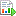

---
# required metadata

title: Organize report components in report designer
description: This article explains how to organize existing reports, building blocks, and objects in report designer.
author: aprilolson
ms.date: 11/22/2022
ms.topic: article
ms.prod: 
ms.technology: 

# optional metadata

ms.search.form: FinancialReports
# ROBOTS: 
audience: Application User
# ms.devlang: 
ms.reviewer: twheeloc
# ms.tgt_pltfrm: 
ms.assetid: 32e728c5-3b06-4049-8070-ade01e951d49
ms.search.region: Global
# ms.search.industry: 
ms.author: aolson
ms.search.validFrom: 2016-11-30
ms.dyn365.ops.version: Version 1611

---

# Organize report components in report designer

[!include [banner](../includes/banner.md)]

After you've designed building blocks and generated reports, it's helpful to organize these objects so that they are easier for users to locate. This article explains how to organize existing reports, building blocks, and objects in report designer.

You can rename folders, reports, building blocks, and other objects in Report designer to help organize your files. Depending on the type of object that you rename, you might have to update associations with that object.

## Rename a folder or building block in Report designer
In Report designer, you can rename folders, report definitions, row definitions, column definitions, and reporting tree definitions.

### Rename a folder or building block in Report designer

1. In Report designer, use the navigation pane to locate the folder or object to rename.
2. Right-click the folder or object, and then click **Rename**. The **Name** field in the navigation pane becomes available.
3. Type a new name, and then press **Enter**.
4. If the building block is a row definition, column definition, or reporting tree definition, you must update other building blocks that are associated with it. Right-click the building block that you renamed in step 3, select **Associations**, and then select an item in the list to update it.
5. Repeat step 4 until all associated items are updated.

## Create and manage report groups
You can group report definitions to generate multiple reports at the same time. To create, modify, delete, and generate report groups, you must have the designer or administrator role. Users who have the generator role can generate report groups and can also modify the user report definitions setting for report groups.

### Create a report group

1. In Report designer, in the navigation pane, click **Report groups**.
2. On the **File** menu, click **New** &gt; **Report group definition** to open a new report group in the viewer window. Alternatively, click the **Report group** button  on the toolbar.
3. Click the **Report group** tab. To override the information on the individual report definitions for the generation of this report, select the **Override company, detail, and date settings from individual report definitions** checkbox. The company name, detail level, provisional setting, and date information are entered automatically, but you can make updates.
4. To generate multiple reports that show the reporting currencies, select the **Include all reporting currencies** checkbox. You can then access multiple views by clicking the **Currency** button in the Web Viewer when you view the report.
5. In the **Reports in group** field, click **Add** to select the reports to include in the report group. To select multiple reports in the **Add** dialog box, hold down the Ctrl key while you select reports. When you've finished selecting reports, click **OK**.
6. Click **File** &gt; **Save** to save the new report group.

### Modify a report group

1. In Report designer, in the navigation pane, click **Report groups**.
2. Double-click the report group to modify.
3. On the **Report group** tab, make the changes that you want.
4. On the **File** menu, click **Save** to save the modified report group, Alternatively, click the **Save** button  on the toolbar.

> [NOTE]
> If you've scheduled reports so that they are generated at set intervals, you can override those settings and generate a report immediately.

### Generate a report group report

1. In Report designer, in the navigation pane, click **Report groups**.
2. Open the report group to generate.
3. Click the **Generate report** button  to generate reports.

### Delete a report group

1. In Report designer, in the navigation pane, click **Report groups**.
2. Right-click the report group to delete, and then select **Delete**.
3. When a confirmation message appears, click **Yes**.

## Report group tab controls
The following table describes the controls on the **Report group** tab.

<table>
<thead>
<tr>
<th>Control</th>
<th>Description</th>
</tr>
</thead>
<tbody>
<tr>
<td>Override company, detail, and date settings from individual report definitions</td>
<td>Select this checkbox to override individual report definitions of the reports in this report group for the generation of these reports only.</td>
</tr>
<tr>
<td>Company name</td>
<td>Select the company to use for the reports.</td>
</tr>
<tr>
<td>Detail level</td>
<td>Specify the level of detail that the reports include.
<ul>
<li><strong>Financial</strong> − A high-level summary report. You can&#39;t drill down to accounts and dimensions, except for those accounts and dimensions that have been added through a reporting tree.</li>
<li><strong>Financial &amp; Account</strong> − A report that contains a high-level summary and account details.</li>
<li><strong>Financial, Account, &amp; Transaction</strong> − A report that contains a high-level summary and transaction details.</li>
</ul></td>
</tr>
<tr>
<td>Provisional</td>
<td>Specify the types of activity that the reports include.
<ul>
<li><strong>Posted activity only</strong> − Include only the transactions and balances that are posted in your financial data.</li>
<li><strong>Posted and unposted activity</strong> − Include all the transactions and balances that are entered and posted in your financial data.</li>
<li><strong>Unposted activity only</strong> − Include only the transactions that are entered, but not yet posted, in your financial data.</li>
</ul></td>
</tr>
<tr>
<td>Include all reporting currencies</td>
<td>Any additional reporting currencies that are configured in your Microsoft Dynamics 365 Finance system are listed here. Select this checkbox to generate additional reports in the currencies that are indicated. To view these reports in the Web Viewer, click the <strong>Currency</strong> button, and then select a currency.</td>
</tr>
<tr>
<td>Date information not saved with report definition</td>
<td><ul>
<li>Base period</li>
<li>Base year</li>
<li>Period covered</li>
</ul>
Only default base period settings are saved with the report definition.</td>
</tr>
<tr>
<td>Date information saved with report definition</td>
<td><ul>
<li>Report date</li>
<li>Default base period</li>
</ul></td>
</tr>
<tr>
<td>Reports in group</td>
<td>Add, remove, and re-order reports in the report group.
<ul>
<li>To add report definitions to the report group, double-click the report group to open it, and then click <strong>Add</strong>. Select the reports to include in the report group, and then click <strong>OK</strong>.</li>
<li>To remove a report from the report group, select it, and then click <strong>Remove</strong>.</li>
<li>To modify the order that the reports are generated in, select a report in the list, and then click <strong>Move up</strong> or <strong>Move down</strong>.</li>
</ul></td>
</tr>
</tbody>
</table>

## Additional resources

[Financial reporting](financial-reporting-intro.md)

[!INCLUDE[footer-include](../../../includes/footer-banner.md)]
