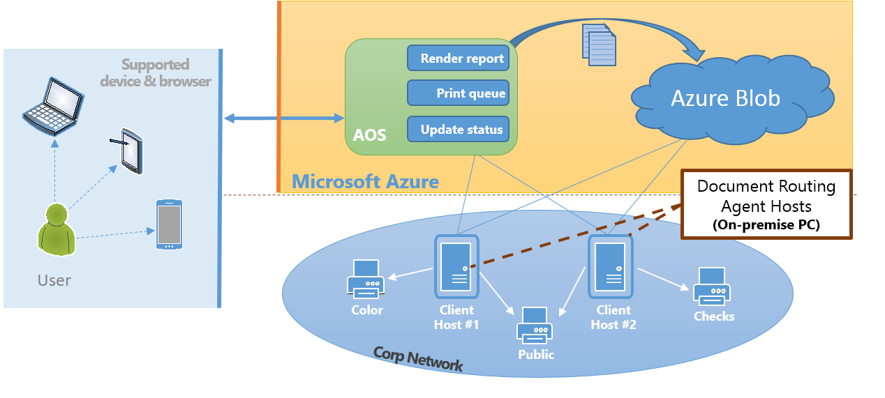

# Document printing overview

[!include [banner](../includes/banner.md)]

You can print documents by using either a local printer or a network-connected device. This article provides an overview of how documents are printed.

## Printing overview

The application provides integrated services and client applications that make it easy to generate, store, and distribute documents that support business activity. You can print documents by using either a local printer or a network-connected device. In addition, you can export pages and reports directly from the client, as PDF files or Microsoft Office documents. Finally, the distributed workload lets you print business documents directly from a mobile device by using network resources. Although printing requirements might vary, all industries typically must create hard copies of business documents by using the application. Printing documents on network devices from hosted applications presents a unique set of challenges. Here are some examples:

- Print drivers might not be available on the user's device.
- The user's device might not be connected to the corporate network.

By using a dedicated host and following a few easy steps, system administrators can configure deployments so that users can print directly from business applications on network devices.

### Application printing scenarios 

The following table describes the three primary printing scenarios.

| Scenario                        | Goal                                                      | Solution |
|---------------------------------|-----------------------------------------------------------|----------|
| 1. Printing what you see        | Print what is currently shown in the browser.             | A "print-friendly" version of the webpage is generated for the browser. |
| 2. Interactive printing         | Print a precision document on a locally connected device. | You can export a PDF version of the report and download it to the browser. |
| 3. Printing on a network device | Send a precision document to a domain printer device.     | A precision document is sent to a client application that runs on a server that is hosted in the customer's domain. |

Because the solution varies, depending on the scenario, applications provide built-in services and tooling to help users accomplish their goals:

- **Scenario 1** is supported by the browser's rendering of the HTML5 client.
- **Scenario 2** uses client applications and Microsoft 365 services.
- **Scenario 3** requires support from client applications and from services that are hosted in Microsoft Azure.

In addition to the platform that is deployed to the Azure subscription, finance and operations applications provide customers with an integrated, first-party Azure application that helps them more easily use domain-hosted devices to print documents.

## Service overview
While documents that are produced by the hosted applications are waiting to be printed on a network-connected device, they are stored in Azure blob storage. The [Install the Document Routing Agent to enable network printing](install-document-routing-agent.md) uses Azure authentication to establish a secure channel to the Azure services.

**Execution sequence**

1. The report is generated by Microsoft SQL Server Reporting Services (SSRS) and stored in Azure blob storage. Attached printer settings are stored together with the document.
2. The Document Routing Agent queries the Azure Service Bus queue for active jobs.
3. The document is downloaded by the Document Routing Agent and spooled to the network printer.

The client-based solution lets customers manage the scale of their printing needs. Customers who have heavy-volume printing workloads can install many Document Routing Agents to increase the number of concurrent printing operations. Alternatively, some customers require very few installations of the Document Routing Agent to handle their anticipated printing needs.

### Service components for network printing

The following diagram shows the basic components that help support network printing operations.

Note that a single printer can be registered with multiple Document Routing Agents. To resolve the printer preferences, the hosted service uses the network path that uniquely identifies every network printer. As a result, even when a printer is registered by multiple clients, it appears as a single selection in the list of printers available in applications.

[!INCLUDE[footer-include](../../../includes/footer-banner.md)]
