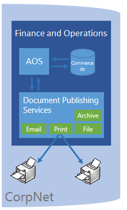
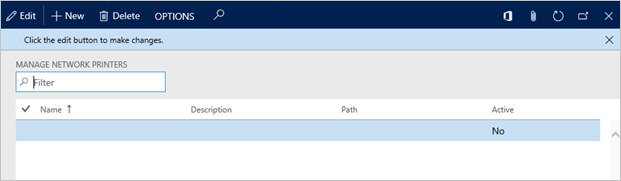

# Document generation, publishing, and printing in on-premises deployments

[!include [banner](../includes/banner.md)]

This article describes the capabilities for generating, publishing, and printing documents in on-premises deployments of Microsoft Dynamics 365 Finance + Operations (on-premises). The application provides a fully integrated experience for enterprise document generation that is powered by Microsoft SQL Server Reporting Services (SSRS). From any supported device, users can produce standard industry documents that are linked to business processes. These documents include sales invoices, checks, and packing slips. Built-in tools let administrators configure the service so that users can securely connect to network printers.

You can upgrade solutions that are built on the Microsoft Dynamics AX 2012 SQL Reporting Services framework, or you can take advantage of the modern solutions that are available in [Microsoft Dynamics Lifecycle Services (LCS)](https://lcs.dynamics.com).

## Document publishing services: secure, reliable, and convenient
Employees spend lots of time on the go. Therefore, businesses depend on their employees' ability to stay productive while they work remotely. However, even today, documents remain critical for business transactions and record keeping.

From their mobile devices, users can print documents on network printers. Users can also automate the creation of business documents and use built-in tools to configure instructions for routing documents to multiple recipients.

The following options are available for document publishing:

- **Email** – Distribute mail via a server, and link reports as attachments.
- **Archive** – Store reports for future reference and regulatory compliance.
- **File** – Produce a PDF file that is downloaded directly to the browser for local printing.
- **Print** – Send documents directly to network printers from all supported platforms. These platforms include mobile devices.



For a high-level summary of the options for information access that are available in the cloud-hosted solution, see [Document printing overview](print-documents.md).

## Comparing the cloud-hosted and on-premises services
Unlike the cloud-hosted service, the on-premises publishing service produces documents as PDF files that are automatically downloaded to the browser. Therefore, users can save documents or print hard copies by using local connected devices. Administrators can manage access to network printers directly from the application, by using built-in administrative pages. Users can interact with reports on demand, or they can schedule automatic jobs to securely generate and distribute documents on a recurring basis.

The following illustration shows the components that are involved in document printing.


For information about how to use extensions to manage availability of the embedded drill-through links in application reports, see the Appendix.

## Managing access to network printers
Administrators can use built-in administrative pages to manage access to network printers. Network printers are secured per company and shared by users of the application. Documents are then printed by using a privileged domain account, based on settings that the user provides. In on-premises deployments, you don't have to install an adapter to connect to domain resources such as printers and fax machines.

The following illustration shows the page that is used to manage network printers.



## Appendix

### Turning on embedded links in business documents
Here is the code that you can use to make embedded drill-through links available in PDF documents. 

```xpp
class Controller extends SrsReportRunController
{
    protected void preRunModifyContract()
    {
        this.parmReportContract().parmRdlContract().parmEnableFileDrillThrough(true);
        super();
    }
    static void main(Args _args)
    {
        ...
    }
}
```


[!INCLUDE[footer-include](../../../includes/footer-banner.md)]
