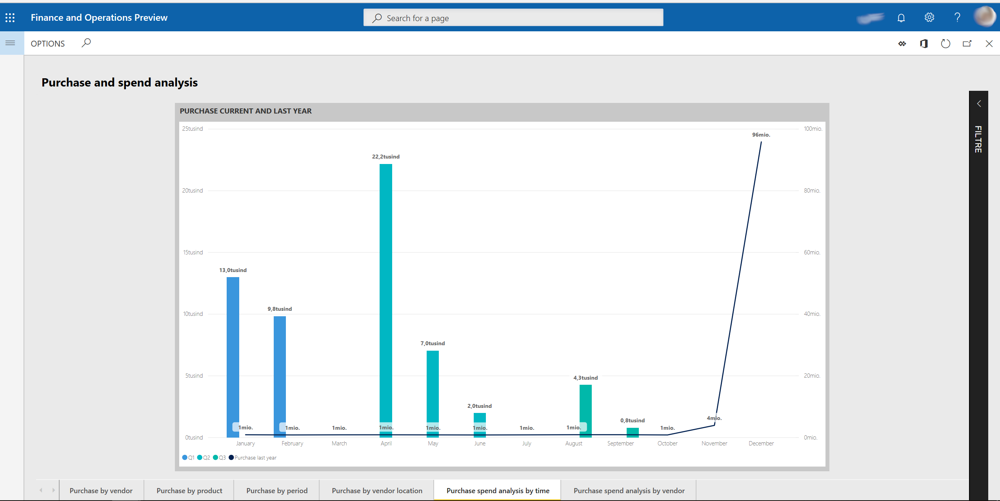
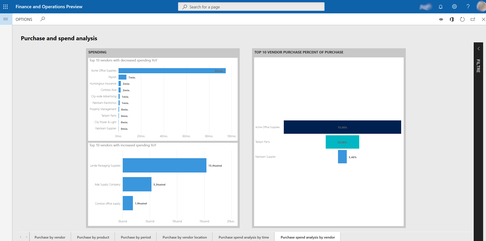

# Purchase spend analysis Power BI content

[!include [banner](../includes/banner.md)]

This article describes what is included in the **Purchase spend analysis** Microsoft Power BI content. It explains how to access the Power BI reports, and provides information about the data model and entities that are used to build the content.

## Overview

The **Purchase spend analysis** Power BI content was designed to help purchasing managers and managers who are responsible for budgets keep track of purchase spending. Managers can analyze purchase spending in the following ways:

- Year-to-date purchase (by vendor group and individual vendors, procurement category and individual products, and vendor location)
- Year-over-year purchase change (by vendor group and procurement category)

The content uses purchase transactional data, and provides both an aggregate view of the company-wide purchase figures and a breakdown of purchase spending by vendor and product. Reports highlight changes in purchase spending over time. Therefore, the reports can be used to alert managers about positive and negative spending trends for individual vendors and products. Additionally, charts show purchase spending for different procurement categories and vendor groups. Therefore, category and regional managers can use the charts to help identify changes in spending behavior.

## Accessing the Power BI content
The **Purchase spend analysis** Power BI content is shown on the **Purchase and spend analysis** page (**Procurement and sourcing** \> **Inquiries and reports** \> **Purchase performance analysis** \> **Purchase and spend analysis**).

## Metrics that are included in the Power BI content
The **Purchase spend analysis** Power BI content includes a report that consists of a set of metrics. These metrics are visualized as charts, tiles, and tables. 

The following sections provide an overview of the visualizations.

### Purchase by vendor report page
**Charts**
- Top 10 vendors by purchase (stacked bar chart)
- Total purchase by vendor group / country/region / name (pie chart)
- Purchase by vendor group / country/region / name (column chart)
- Average purchase by vendor group / country/region / name (column chart)

**Tiles**
- Total purchase
- YOY purchase growth
- Total # vendors
- Total # of active vendors

**Example**

### Purchase by product report page

**Charts**
- Purchase by procurement category / product name (column chart)
- Total purchase by procurement category / product name (pie chart)
- Top 10 products by purchase (stacked bar chart)

**Tiles**
- Total # of products</li>
- Total active products percentage of total # of products
- Number of products accounting for 80% purchase

**Example**

### Purchase by period report page
This page shows purchases this year and last year, and growth by procurement category.

**Charts** 
- Purchase by month / day (column chart)
- Cumulative purchase YOY variance (waterfall chart)
- Total purchase YOY growth (column chart)
- Procurement statement (matrix)

**Tiles**
- YOY purchase growth
- YOY purchase growth %

**Example**

### Purchase by vendor location report page

**Charts**
- Purchase by city
- Purchase YOY growth %
- Purchase by country/region

**Example**

### Purchase spend analysis by time report page

**Charts** 
- Purchase current year by month / day (line chart)
- Purchase current and last year (line and column chart)

**Example**

### Purchase spend analysis by vendor report page

**Charts** 
- Top 10 vendor purchase % of purchase (funnel)
- Top 10 vendors with increased spending YOY
- Top 10 vendors with decreased spending YOY

**Example** 

## Data model and entities
The following data is used to fill the report pages in the **Purchase spend analysis** Power BI content. This data is represented as aggregate measurements that are staged in the Entity store. The Entity store is a Microsoft SQL Server database that is optimized for analytics. For more information, see [Power BI integration with Entity store](power-bi-integration-entity-store.md).

The aggregate measurements in this content are the subset of aggregate measurements that were available in the Purchase Cube in Microsoft Dynamics AX 2012 and Microsoft Dynamics AX 2012 R3. To stage the cube's aggregate measurements in the Entity store, you must make them deployable. For more information, see the procedure for staging aggregate measurements in the Entity store in [Power BI integration with Entity store](power-bi-integration-entity-store.md). The following key aggregate measurements are available directly from the Invoice lines entity and are used as the basis of the content.

| Entity        | Key aggregate measurements | Data source                                 | Field              | Description                            |
|---------------|----------------------------|---------------------------------------------|--------------------|----------------------------------------|
| Invoice lines | Purchase                   | VendInvoiceTrans                            | SUM(LineAmountMST) | The amount in the accounting currency. |

The following table shows the key measurements in the content that are calculated from the Invoice lines entity.

| Measure               | Calculation                                                                                         |
|-----------------------|-----------------------------------------------------------------------------------------------------|
| Purchase current year | Purchase current year = SUM('Invoice lines'\[Purchase\])                                            |
| Purchase last year    | Purchase last year = CALCULATE(SUM('Invoice lines'\[Purchase\]), SAMEPERIODLASTYEAR(Dates\[Date\])) |
| YOY purchase growth   | YOY purchase growth = \[Purchase current year\] – \[Purchase last year\]                            |

The following key dimensions in the content are used as filters to slice the aggregate measurements, so that you can achieve more granularity and gain deeper analytical insights.

| Entity                 | Examples of attributes                                |
|------------------------|-------------------------------------------------------|
| Vendors                | Vendor groups, Vendor country or regions, Vendor name |
| Products               | Product number, Product name, Item groups name        |
| Procurement categories | Procurement category, Procurement category names      |
| Legal entities         | Legal entity name                                     |
| Dates                  | Dates, Year offset                                    |

By default, the content shows data for the current calendar year. However, you can change the date filter in the report filters section. You can also change the company filter.

[!INCLUDE[footer-include](../../../includes/footer-banner.md)]
