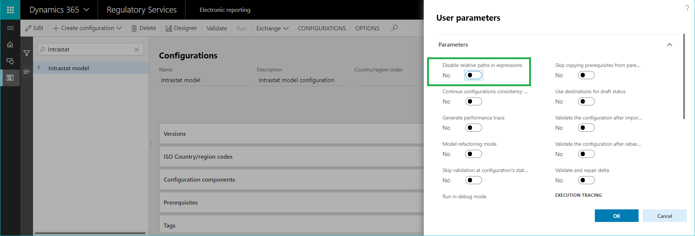
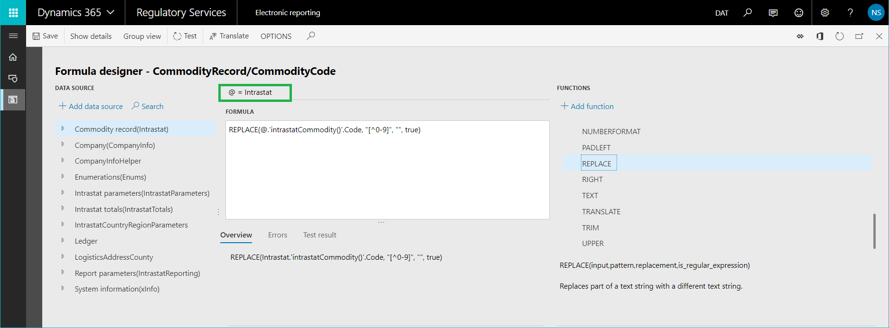

---
# required metadata

title: Use a relative path in data bindings of ER models and formats
description: The Electronic reporting tool lets you define electronic format structures and then describe how those structures should be filled. 
author: NickSelin
ms.date: 07/03/2019
ms.topic: article
ms.prod: 
ms.technology: 

# optional metadata

ms.search.form: ERSolutionTable, ERModelMappingDesigner, EROperationDesigner, ERExpressionDesignerFormula 
# ROBOTS: 
audience: Application User, Developer, IT Pro
# ms.devlang: 
ms.reviewer: kfend
# ms.tgt_pltfrm: 
# ms.custom: 
# ms.assetid: 
ms.search.region: global
# ms.search.industry: 
ms.author: nselin
ms.search.validFrom: 
ms.dyn365.ops.version: 

---

# Use a relative path in data bindings of ER models and formats

[!include[banner](../includes/banner.md)]

The Electronic reporting (ER) tool lets users define electronic format structures and then describe how those structures should be filled by using data and algorithms that exist in the application. For more information, see [Create Electronic reporting (ER) configurations](electronic-reporting-configuration.md). To specify the data flow for retrieving Finance and Operations data and using it to generate  an electronic document, you need to do the following:

- Bind configured data sources to elements of the designed domain-specific data model. The model structure and selected data sources might be part of a complex hierarchical structure. Because of this, final bindings can be quite large and contain many elements of different types (for example, relations, tables, and methods,). The bindings can become less readable and quite complex to review and understand, especially for non-owners. 
- Bind data model elements with format components to define what data will be populated from the data model to the generated format’s output.

To improve usability of ER mapping designers, the [relative path](er-formula-language.md#relative-path) feature has been released. By default, the relative path representation option is turned on for any new instance of the application where ER design experience is enabled (Microsoft Dynamics 365 Finance, Microsoft Regulatory Configuration Service). 
We implemented the relative path parameter so that users can keep using the full path when work with this presentation of ER bindings.

 
When the relative path usage parameter is turned on, a single @ character replaces the path to the parent item in the binding of the current model element. The entire binding path becomes shorter, which makes the entire mapping more obvious and easier to understand. In most cases, no additional scrolling is required in the ER designer to view all the bindings of the data model.

 
When you start designing a new ER expression, you need to enter only one character to define a binding to a field of the parent item.

 
When you decide to change the data source of the parent model item, with absolute path usage, you have to manually rebind this model item, as well as all nested items, to a new data source. When relative path usage is turned on, and you select a new data source to be bound to a parent item, you are offered an option to automatically rebind all nested elements of this parent item with one click.

 
If you confirm rebinding of nested items, the new parent item will be placed to the path of each nested item containing the existing parent item.
This feature does not break the backward compatibility of the ER framework. All previously designed ER configurations will work with this new feature, and no upgrades or conversions are required.

> [!NOTE]
> All changes that are introduced by mass modification of bindings of nested elements in model mappings are correctly saved in a configuration delta (trace of changes). This allows customers to rebase their derived version of model mappings to any new base version of it that has been modified by using this new feature.

## Additional resources

[ER formula language](er-formula-language.md)

[!INCLUDE[footer-include](../../../includes/footer-banner.md)]
