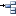
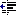

# Report Designer interface

[!include [banner](../includes/banner.md)]

This article explains how to navigate through Report designer and how to use the various options to meet your specific requirements.

## Report designer menu commands

The following tables describe the menu commands and options that you can use when you design financial reports. Some menu commands and options are available only in specific circumstances. For example, the commands for promoting and demoting reporting units are available only when you're modifying a reporting tree definition.

### File menu

The **File** menu is available to all users and includes the following commands.

| Command                           | Description |
|-----------------------------------|-------------|
| New                               | Create a new report definition, row definition, column definition, reporting tree definition, report group definition, or folder. Additional options are available, depending on your user role. |
| Open                              | Open an existing row definition, column definition, reporting tree definition, or report definition. |
| Close                             | Close the current building block. |
| Close all                         | Close all building blocks. |
| Save                              | Save the current row definition, column definition, reporting tree definition, or report definition. |
| Save as                           | Save the current row definition, column definition, reporting tree definition, or report definition under a new name. |
| Properties                        | Open the **Properties** dialog box, where you can change the name and description of a report. |
| Generate                          | Generate the current report. This command is available from a report definition. |
| View report                       | Open the most recent version of the generated report. This command is available from a report definition if you've generated at least one report. |
| Recent report definitions         | Show a list of reports that have recently been created or modified. You can then select a report in the list. |
| Recent row definitions            | Show a list of row definitions that have recently been created or modified. You can then select a row definition in the list. |
| Recent column definitions         | Show a list of column definitions that have recently been created or modified. You can then select a column definition in the list. |
| Recent reporting tree definitions | Show a list of reporting tree definitions that have recently been created or modified. You can then select a reporting tree definition in the list. |
| Exit                              | Exit Report Designer. |

### Edit menu

The **Edit** menu is available to users who have the **Designer** or **Administrator** role. This menu includes the following commands.

| Command                                | Description |
|----------------------------------------|-------------|
| Undo                                   | Undo the last action. |
| Redo                                   | Reverse the last undo action. |
| Cut                                    | Delete the selected text, and copy it to the clipboard. |
| Copy                                   | Copy the selected text to the clipboard. |
| Paste                                  | Insert the most recently cut or copied text from the clipboard. |
| Clear                                  | Delete the contents of the selected building block cell. |
| Find                                   | Open the **Find and Replace** dialog box, where you can search text in the view pane. |
| Replace                                | Open the **Find and Replace** dialog box, where you can search and replace text in the view pane. |
| Insert rows from dimensions            | Open the **Insert Rows from Dimensions** dialog box, where you can select the dimension values to include in the row definition. This command is available from a row definition. |
| Renumber rows                          | Renumber all numeric row codes. This command is available from a row definition. |
| Row links                              | Open the **Row Links** dialog box, where you can specify the sources for data links in row definitions and reporting tree definitions. This command is available from a row definition. |
| Rounding adjustment                    | Open the **Rounding Adjustments** dialog box, where you can specify the parameters for rounding. This command is available from a row definition. |
| Manage dimension sets                  | Open the **Dimension Sets** dialog box, where you can create and modify dimension sets. This command is available from a row definition or reporting tree definition. |
| Insert row                             | Insert an empty row into the row definition or an empty header row into the column definition. This command is available from a row definition or column definition. |
| Delete row                             | Delete the selected row from the row definition or the selected header row from the column definition. This command is available from a row definition or column definition. |
| Insert column                          | Insert an empty column into the column definition. This command is available from a column definition. |
| Delete column                          | Delete the selected column from the column definition. This command is available from a column definition. |
| Insert reporting units from dimensions | Open the **Insert Reporting Units from Dimensions** dialog box, where you can select the dimension values to include in the reporting tree definition. This command is available from a reporting tree definition. |
| Import dimension set hierarchy         | Open the **Dimension Set Hierarchy** dialog box, where you can import a dimension set hierarchy from the financial data. This command is available from a reporting tree definition for a ..\\financial-dimensions\\dimension-based system. |
| Insert reporting unit                  | Insert an empty row into the reporting tree definition. This command is available from a reporting tree definition. |
| Delete reporting unit                  | Delete the selected reporting unit row from the reporting tree definition. This command is available from a reporting tree definition. |

### View menu

The **View** menu is available to all users and includes the following commands.

| Command         | Description                                                            |
|-----------------|------------------------------------------------------------------------|
| Navigation Pane | Show or hide the navigation pane.                                      |
| Toolbars        | Select the toolbars that are visible.                                  |
| Status Bar      | Show or hide the status information in the **Report designer** window. |
| Welcome Page    | Open the **Welcome** page.                                             |

### Format menu

The **Format** menu is available to users who have the **Designer** or **Administrator** role. This menu includes the following commands.

| Command               | Description |
|-----------------------|-------------|
| Styles and Formatting | Open the **Styles and formatting** dialog box, where you can create and modify the style for text in row definitions and column definitions. This command is available from a row definition or a column definition. |
| Column Width          | Open the **Column width** dialog box, where you can set the width of the selected column. This command is available from a row definition, a column definition, or a reporting tree definition. |
| Hide                  | Hide the selected column. This command is available from a row definition, a column definition, or reporting tree definition. |
| Unhide                | Make the hidden columns between the selected columns visible. This command is available from a row definition, column definition, or reporting tree definition. |

### Company menu

The **Company** menu is available to users who have the **Designer** or **Administrator** role. This menu includes the following commands.

| Command               | Description                                                                                                            |
|-----------------------|------------------------------------------------------------------------------------------------------------------------|
| Companies             | Open the **Companies** dialog box, where you can create and modify companies.                                          |
| Building Block Groups | Open the **Building block groups** dialog box, where you can create, modify, import, and export building block groups. |

### Go menu

The **Go** menu is available to all users and includes the following commands.

> [!NOTE]
> These commands have no visible effect unless the navigation pane is visible.

| Commands                   | Description                                                                        |
|----------------------------|------------------------------------------------------------------------------------|
| Report Definitions         | Show report definitions in the navigation pane.                                    |
| Row Definitions            | Show row definitions in the navigation pane.                                       |
| Column Definitions         | Show column definitions in the navigation pane.                                    |
| Reporting Tree Definitions | Show reporting tree definitions in the navigation pane.                            |
| Security                   | Show security information for users, groups, and companies in the navigation pane. |

### Tools menu

The **Tools** menu is available to all users, but some commands have limited availability. This menu includes the following commands.

| Command                       | Description |
|-------------------------------|-------------|
| Protect                       | Apply a password to the current building block. This command is available to users who have the **Designer** or **Administrator** role. |
| Report Queue Status           | Open the **Report Queue Status** dialog box, where you can see all recently generated reports and the details for each report. |
| Source System Information     | Show the settings for your Microsoft Dynamics ERP system. This command is available to users who have the **Designer** or **Administrator** role. |
| Checked Out Items             | Show the row definitions, column definitions, reporting tree definitions, and report definitions that are currently open. This command is available to users who have the **Designer** or **Administrator** role. |
| Refresh Cached Financial Data | Update the data in the financial dimensions column. |
| Options                       | Open the **Options** dialog box, where you can modify user preferences for Report Designer. |

### Window menu

The **Window** menu is available to all users and includes the following commands.

| Command              | Description |
|----------------------|-------------|
| Tile Horizontally    | Show all open windows next to each other. |
| Tile Vertically      | Show all open windows, one on top of the other. |
| Cascade              | Layer all open windows, so that the title bar of each window is visible. |
| Freeze Horizontal    | Freeze the selected row so that, as you scroll, that row continues to be visible in the window. This command is available to users who have the **Designer** or **Administrator** role. |
| Freeze Vertical      | Freeze the selected column so that, as you scroll, that column continues to be visible in the window. This command is available to users who have the **Designer** or **Administrator** role. |
| List of Open Windows | Show a list of windows that are open. Select a window to bring it to the front. |

### Help menu

The **Help** menu is available to all users and includes the following commands.

| Command | Description                                                              |
|---------|--------------------------------------------------------------------------|
| Help    | Open the help article page for financial reporting. |
|         |                                                                          |

## Report designer toolbar buttons
The following tables describe the toolbar buttons that you can use when you design reports. Some toolbar buttons are available only in specific circumstances. For example, the buttons for promoting and demoting reporting units are available only when you're modifying a reporting tree definition.

### Standard toolbar

The standard toolbar provides quick access to file and edit commands. This toolbar includes the following buttons.

| Button                                                                                       | Description |
|----------------------------------------------------------------------------------------------|-------------|
|                               | Create a new (empty) report definition, row definition, column definition, or reporting tree definition. |
|                | Open an existing row definition, column definition, reporting tree definition, or report definition. |
|                            | Save the current row definition, column definition, reporting tree definition, or report definition. |
|                            | Copy the selected text to the clipboard. |
|                               | Delete the selected text, and copy it to the clipboard. |
|                         | Insert the text from the clipboard. |
|                            | Undo the last action. |
|                            | Reverse the last undo action. |
|                            | Open the **Find and Replace** dialog box, where you can search and replace text in the active window. |
|            | Insert an empty row into the row definition or an empty header row into the column definition. This button is available from a row definition or column definition. |
|   | Insert an empty column into the column definition. This button is available from a column definition. |
|                            | Apply a password to the current building block. This button is available to users who have the **Designer** or **Administrator** role. |
|                  | Open the **Row Links** dialog box, where you can specify the sources for data links in row definitions and reporting tree definitions. This button is available from a row definition. |
|                   | Promote a unit of the reporting tree definition. When you select a child unit and then click **Promote**, the child unit is moved to the same level as its parent unit. |
|                      | Demote a unit of the reporting tree definition. When you select a unit and then click **Demote**, the unit becomes a child of the unit that precedes it. |
|  | Expand all units of the reporting tree definition at the level of the selected unit. |
|                | Collapse the reporting tree. |
|                            | Open Help. |

### Formatting toolbar

The formatting toolbar provides easy access to style commands. This toolbar includes the following buttons.

| Button                                                                                                       | Description                                           |
|--------------------------------------------------------------------------------------------------------------|--------------------------------------------------|
|                          | Apply the selected font style to the current text.   |
|                                                  | Set the current text to the selected font.           |
|                                             | Set the current text to selected font size (in  points). |
|                                            | Make the current text bold.                          |
|                                    | Make the current text italic.                        |
|                             | Underline the current text.                          |
|                       | Decrease the indent of the current text.             |
|                         | Increase the indent of the current text.             |
|  | Change the background color of the current cell.     |
|                            | Change the color of the current text.                |

### Report designer toolbar

The report designer toolbar provides quick access to commands for navigating within report designer. This toolbar includes the following buttons.

| Button                                                                                              | Description |
|-----------------------------------------------------------------------------------------------------|-------------|
|             | Show the report definition that is listed on the **Window** menu. |
|              | Show the row definition that is assigned to the active report definition. |
|   | Show the column definition that is assigned to the active report definition. |
|              | Show the reporting tree definition that is assigned to the active report definition. |
|          | Start the Report Viewer and show the most recent version of the generated report. This button is available from a report definition if you've generated at least one report. |
|  | Generate a report from the active report definition. This button is available from a report definition. |

## Additional resources

[Financial reporting](financial-reporting-intro.md)

[Generate financial reports](generate-financial-report.md)

[!INCLUDE[footer-include](../../../includes/footer-banner.md)]
