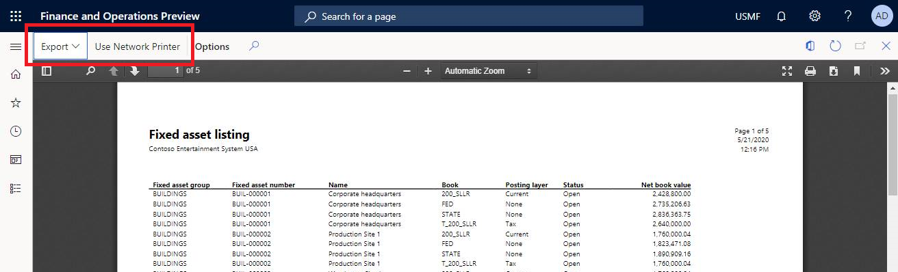
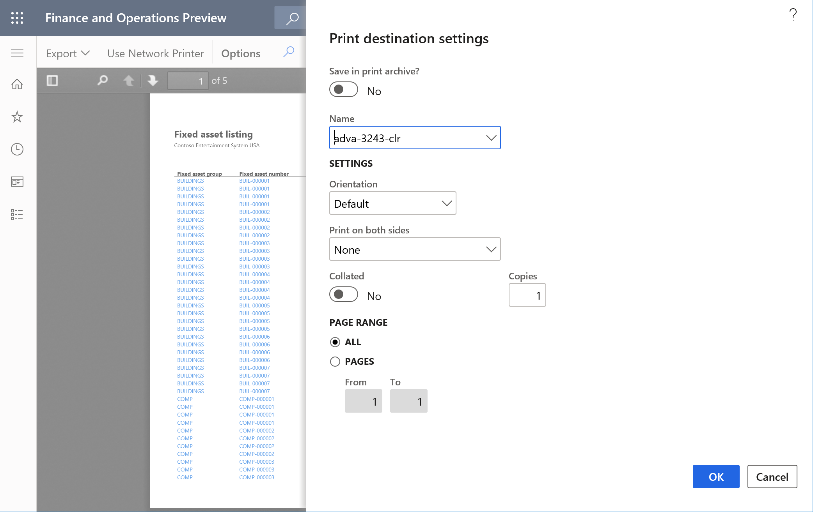

# Document reporting preview options

[!include[banner](../includes/banner.md)]

finance and operations apps offer an expanded collection of options to use while previewing documents within the embedded PDF viewer. This article describes the **Export** and **Network Printer** options.

## Overview
The efficient publication and distribution of documents is not only a key component to many operations, but it’s also critical to daily business functions. Documents are used to capture transaction details and may represent an agreement between two parties. From quotations to sales invoices used in the packing slip process, which ultimately produces receipts and customer statements, business documents come in many forms. The document reporting preview options empower you to quickly take the appropriate action on documents.

Almost half of all document interactions involve the screen preview. The toolbar options that are available are for all supported devices and offer a simple and intuitive solution for exporting and printing documents rendered by finance and operations apps.

## File export
Additional user options replace functions previously supplied by the HTML-based **Report viewer** control. You can use these toolbar options to export files to the various  supported formats. This includes Microsoft Word, Excel, HTML, CSV, and more. To ensure a consistent layout with the printer output, the new modern experience displays documents using the PDF pagination rules. For more information, see [Pagination in reports](/sql/reporting-services/report-design/pagination-in-reporting-services-report-builder-and-ssrs).

## Network printing
You can choose to print on locally connected devices using the **Print** button or send documents directly to network printers using the toolbar option. Using the network print option, you can initiate print instructions to network connected printers while working remotely from nearly any internet connected device, including mobile phones.

Use the toolbar option to choose the network printer and establish print settings.

## Access preview options
Use the Feature Management area to access the document preview options. The two additional features are:
- **Enable Export on Report PDF viewer**
- **Enable Network Printing on Report PDF viewer**

Select these features, and then select **Enable now** to begin taking advantage of the new user options. For more information, see [Feature management overview](../../fin-ops/get-started/feature-management/feature-management-overview.md).

[!INCLUDE[footer-include](../../../includes/footer-banner.md)]
