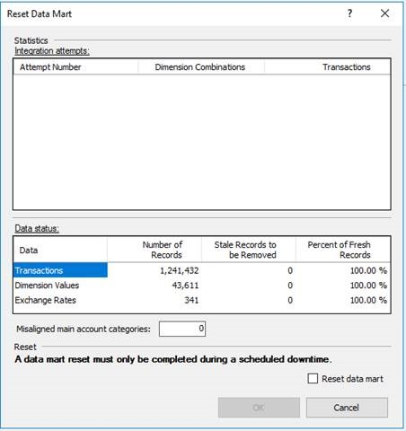

# Reset the Financial reporting data mart

[!include [banner](../includes/banner.md)]

This article explains how to reset the Financial reporting data mart for Microsoft Dynamics 365 Finance. The data mart can be reset in multiple ways, depending on the user's role and access to the client or infrastructure.

You should reset the data mart only when a small amount of processing is occurring on the database. Financial reporting will be unavailable during the reset process.

> [!NOTE]
> To confirm that it's necessary to reset your data mart, see [When to reset a data mart](when-to-reset-data-mart.md).

> A reset of the data mart doesn't affect any report definitions that define the structure of reports. Nevertheless, it's always a good idea to have a backup of your reports, which you accomplish by exporting them. The steps for exporting report definitions are included at the end of this article in the section titled, Export and import report definitions, later in this article.

### Reset the Financial reporting data mart from Report designer

To find the version of report designer, watch this video: [How to find the version of Report designer](https://www.youtube.com/watch?v=icfA5Q3kp4w).

To reset the data mart, in Report designer, on the **Tools** menu, select **Reset Data Mart** as shown in the following illustration. The dialog box that appears has two sections: **Statistics** and **Reset**.

[](./media/Reset-72.jpg)

##### Integration attempts

The **Integration attempts** grid shows how many times the system has tried to integrate transactions. The system continues to try to integrate data over a period of days if the first few attempts aren't successful. You will know that the data mart must be reset is if the number of attempts is 8 or more, and if there are many Dimension combination or Transaction records. In this situation, the data won't be reported on.

##### Data status

The **Data status** grid provides a snapshot of the transactions, exchange rates, and dimension values in the data mart. A large number of stale records indicates that numerous updates to the records have occurred. This situation might increase the time that is required to generate reports.

##### Misaligned main account categories

If you're using a release that is earlier than Financial reporting release 7.2.1, you might have to reset the data mart if you rename accounts and move accounts between account categories. These actions can cause main account categories to become misaligned. The **Misaligned main account categories** field shows whether you're experiencing that issue.

### Reset the data mart and select a reason

If you determine that a data mart reset is required, select the **Reset data mart** check box, and then select a reason in the **Reason** field. The following options are available:

- **Missing or incorrect data** – Based on the statistics, you've determined that data might be missing. Before you continue, we recommend that you work with Support to determine the root cause.
- **Restore database** – The database was restored, but the database for the Financial reporting data mart wasn't restored.
- **Other** – You're resetting the data mart for another reason. If you're concerned that there is an issue, contact Support to identify it.

[](./media/Integration.png)

> [!NOTE]
> Verify that all data mart reset tasks have completed an initial load before you begin a reset. You can confirm this by looking for a value in the Last Runtime column by selecting **Tools** &gt; **Integration status**.

#### Clear users and companies

Select the **Clear users and companies** check box if you restored your database, but then changed users or companies. You should rarely have to select this check box.

When you're ready to start the reset process, select **OK**. You're prompted to confirm that you're ready to start the process. Note that Financial reporting won't be available during the reset and the initial data integration that occurs afterward.

If you want to review the status of the integration, select **Tools** &gt; **Integration status** to see the last time that the integration was run and the status.

[](./media/New-integration.PNG)

> [!NOTE]
> The reset is finished when all mappings show a status of **RanToCompletion**, and an "Integration complete" message appears in the lower-left corner of the **Integration Status** dialog box.

## Reset the Financial reporting data mart through Windows PowerShell

If you ever restore your database from a backup or copy the database from another environment, you must follow the steps in this section to help guarantee that the Financial reporting data mart correctly uses the restored database.

### Stop services

The following Microsoft Windows services will have open connections to the finance and operations database. Therefore, you must use Microsoft Remote Desktop to connect to all the computers in the environment and then use services.msc to stop these services.

- World wide web publishing service (on all Application Object Servers \[AOS\] computers)
- Batch Management Service (on non-private AOS computers only)
- Management Reporter 2012 Process Service (on Business intelligence \[BI\] computers only)

### Reset

#### Download the latest MinorVersionDataUpgrade.zip package

Download the latest MinorVersionDataUpgrade.zip package. For instructions about how to find and download the correct version of the data upgrade package, see the section [Upgrade data in development or demo environments](../migration-upgrade/upgrade-data-to-latest-update.md#select-the-correct-data-upgrade-deployable-package) in the Upgrade data in development, demo, or sandbox environments article.

An upgrade isn't required in order to download the MinorVersionDataUpgrade.zip package. Therefore, you just have to follow the steps in the "Download the latest data upgrade deployable package" section of that article. You can skip all the other steps in the article.

#### Run prerequisite SQL scripts against the database

Run the following scripts against the database (not against the Financial reporting database):

- DataUpgrade.zip\\AosService\\Scripts\\ConfigureAxReportingIntegration.sql
- DataUpgrade.zip\\AosService\\Scripts\\GrantAxViewChangeTracking.sql

These scripts help guarantee that the users, roles, and change tracking settings are correct.

#### Run a Windows PowerShell script to reset the database

On the AOS computer, start Microsoft Windows PowerShell as an administrator, and run the following commands to reset the integration between application and Financial reporting.

```powershell
F:
cd F:\MRApplicationService\MRInstallDirectory
Import-Module .\Server\MRDeploy\MRDeploy.psd1
Reset-DatamartIntegration -Reason OTHER -ReasonDetail "<reason for resetting>" -SkipMRTableReset
```

> [!NOTE]
> - SkipMRTableReset preserves tree unit security if you're using it.
> - If you get an error that a parameter cannot be found that matches SkipMRTableReset, you can remove the parameter and try again (later versions have updated the default behavior to include this switch).

Here is an explanation of the parameters in the **Reset-DatamartIntegration** command:

- The valid values for **-Reason** are **SERVICING**, **BADDATA**, and **OTHER**.
- The **-ReasonDetail** parameter is free text.
- The reason and reason detail will be recorded in telemetry/environment monitoring.

> [!NOTE]
> After you run the commands, you will be asked to enter **Y** to confirm that you want to reset the database.

#### Restart services

Use services.msc to restart the services that you stopped earlier:

- World wide web publishing service (on all AOS computers)
- Batch Management Service (on non-private AOS computers only)
- Management Reporter 2012 Process Service (on BI computers only)

## Reset the Financial reporting data mart for Dynamics 365 Finance + Operations (CHE, LBD and VHD) through SQL Server Management Studio 

> [!NOTE]
> The following steps are designed for Cloud Hosted Environments (CHE Tier 1 Dev), downloadable VHD images, and LBD On-Premises.

Before getting started, be sure that all users close Report designer and exit the Financial reporting area.

1. On the database used for Financial reporting (CHE & VHD - ManagementReporter or MRDB; LBD - FinancialReporting), execute the following script. which was last updated April 9, 2020: Reset Datamart Begin.txt

    ```sql
	------------------------------------------------------------------------------------------
	------------------------------------------------------------------------------------------
	--setup for servicing mode

	BEGIN TRANSACTION
    IF NOT EXISTS(SELECT SCHEMA_NAME FROM INFORMATION_SCHEMA.SCHEMATA WHERE SCHEMA_NAME = 'Servicing')
    BEGIN 
        EXEC ('CREATE SCHEMA Servicing') 
    END

    IF (DATABASE_PRINCIPAL_ID('GeneralUser') IS NULL)
    BEGIN
        CREATE ROLE [GeneralUser] AUTHORIZATION [dbo];
    END
    ALTER AUTHORIZATION ON SCHEMA::Servicing TO [GeneralUser]

    IF NOT EXISTS(SELECT NAME FROM SYS.TABLES WHERE Name = 'ServicingLock')
    BEGIN 
        CREATE TABLE [Servicing].[ServicingLock] ([Name] nvarchar(255) not null, [Value] int not null, [LastServiceTimestamp] datetime null)
    END

    IF NOT EXISTS(SELECT 1 FROM [Servicing].[ServicingLock])
    BEGIN 
        INSERT INTO [Servicing].[ServicingLock] (Name, Value) VALUES ('ServicingLockMode', 0)
    END
	COMMIT TRANSACTION


	PRINT 'Entering servicing mode'
	DECLARE @result int;
	EXEC @result = sp_getapplock @DbPrincipal='public', @Resource='ServicingLock', @LockMode='Exclusive', @LockOwner='Session', @LockTimeout=300000;
	IF @result < 0 RAISERROR ('Unable to acquire SQL applock. Result: %d', 16, 1, @result);

	BEGIN TRY
	IF EXISTS(SELECT TOP 1 1 FROM INFORMATION_SCHEMA.COLUMNS WHERE TABLE_SCHEMA = 'Scheduling' COLLATE DATABASE_DEFAULT AND TABLE_NAME = 'SchedulerRegister' COLLATE DATABASE_DEFAULT AND COLUMN_NAME = 'ServicingMode' COLLATE DATABASE_DEFAULT)
	BEGIN		
		   UPDATE Scheduling.SchedulerRegister SET ServicingMode = 1 WHERE ServicingMode = 0		
		   UPDATE [Servicing].[ServicingLock] SET Name = 'SchedulerServicingMode', Value = 1, LastServiceTimestamp = GETUTCDATE() WHERE Value = 0
	END
	PRINT 'Acquired servicing locks'

	--Disable maps
	DECLARE @triggerIds table(id uniqueidentifier, taskTypeId uniqueidentifier)
	INSERT INTO @triggerIds SELECT tr.[Id], tt.[Id]
	FROM [Scheduling].[Task] t with(nolock)
	JOIN [Scheduling].[Trigger] tr ON t.[TriggerId] = tr.[Id]
	JOIN [Scheduling].[TaskState] ts ON ts.[TaskId] = t.[Id]
	LEFT JOIN [Scheduling].[TaskCategory] tc ON tc.[Id] = t.[CategoryId]
	JOIN [Scheduling].[TaskType] tt ON t.[TypeId] = tt.[Id]
	WHERE tt.[Id] IN ('D81C1197-D486-4FB7-AF8C-078C110893A0', '55D3F71A-2618-4EAE-9AA6-D48767B974D8') -- 'Maintenance Task', 'Map Task'
	PRINT 'Disable integration tasks'
	UPDATE [Scheduling].[Trigger] SET IsEnabled = 0 WHERE [Id] in (SELECT id FROM @triggerIds)

	------------------------------------------------------------------------------------------
	------------------------------------------------------------------------------------------
	------------------------------------------------------------------------------------------


	------------------------------
	PRINT 'Save and Drop Indexes Of FactAttributeValue and DimensionValueAttributeValue'
	------------------------------

	IF EXISTS(SELECT 1 FROM sys.procedures WHERE object_id = OBJECT_ID('[Datamart].[SaveAndDropAttributeValueIndexes]'))
	BEGIN
		IF (NOT EXISTS (SELECT * FROM INFORMATION_SCHEMA.TABLES WHERE TABLE_SCHEMA = 'Datamart' AND  TABLE_NAME = 'AttributeValueIndexesBackUp'))
		BEGIN
			--create table to store indexses
			-- Indexes of different table can have same index_id,but we need unique index id
			Create table [Datamart].[AttributeValueIndexesBackUp]
			(
				IndexID INT not null IDENTITY(1,1) PRIMARY KEY,
				IndexName NVARCHAR(255),
				IsUnique BIT,
				IndexType NVARCHAR(60),
				FilterDefinition NVARCHAR(max),
				KeyColumns NVARCHAR(max),
				IncludedColumns NVARCHAR(max),
				IndexRetry INT,
				IndexStatus NVARCHAR(60),
				AttributeType INT,
			)
		END

		IF (EXISTS (SELECT * FROM INFORMATION_SCHEMA.TABLES WHERE TABLE_SCHEMA = 'Datamart' AND  TABLE_NAME = 'FactAttributeValue')) 
		BEGIN
			--truncate table to increase index drop performance
			PRINT('TRUNCATE TABLE [Datamart].[FactAttributeValue]')
			EXEC('TRUNCATE TABLE [Datamart].[FactAttributeValue]')
			EXEC [Datamart].[SaveAndDropAttributeValueIndexes] 'FACTID','[Datamart].[FactAttributeValue]'
		END

		IF (EXISTS (SELECT * FROM INFORMATION_SCHEMA.TABLES WHERE TABLE_SCHEMA = 'Datamart' AND  TABLE_NAME = 'DimensionValueAttributeValue')) 
		BEGIN
			--truncate table to increase index drop performance
			PRINT('TRUNCATE TABLE [Datamart].[DimensionValueAttributeValue]')
			EXEC('TRUNCATE TABLE [Datamart].[DimensionValueAttributeValue]')
			EXEC [Datamart].[SaveAndDropAttributeValueIndexes] 'DIMENSIONVALUEID','[Datamart].[DimensionValueAttributeValue]'
		END
	End

	------------------------------
	PRINT 'Drop archive tables'
	------------------------------
	DECLARE @stagingTableName nvarchar(max)
	DECLARE dropCursor CURSOR LOCAL FAST_FORWARD FOR
	SELECT t.TABLE_NAME as TableName
	FROM INFORMATION_SCHEMA.TABLES t WITH (NOLOCK)
	WHERE t.TABLE_SCHEMA = 'Datamart' and (t.TABLE_NAME like 'FactStaging[0-9]%' or t.TABLE_NAME like 'DimensionCombinationStaging[0-9]%')
	OPEN dropCursor
	FETCH NEXT FROM dropCursor INTO @stagingTableName
	WHILE @@FETCH_STATUS = 0
	BEGIN
		EXEC('DROP TABLE IF EXISTS [Datamart].' + @stagingTableName)
		FETCH NEXT FROM dropCursor INTO @stagingTableName
	END
	CLOSE dropCursor
	DEALLOCATE dropCursor

	------------------------------
	PRINT 'Dropping tables with dynamic columns'
	------------------------------
	DROP TABLE IF EXISTS [Datamart].DimensionCombinationProcessing
	DROP TABLE IF EXISTS [Datamart].DimensionCombination
	DROP TABLE IF EXISTS [Datamart].DimensionCombinationResolving
	DROP TABLE IF EXISTS [Datamart].DimensionCombinationStaging
	DROP TABLE IF EXISTS [Datamart].DimensionCombinationUnreferenced
	DROP TABLE IF EXISTS [Datamart].DimensionValueAttributeValue
	DROP TABLE IF EXISTS [Datamart].FactAttributeValue
	DROP TABLE IF EXISTS [Datamart].TranslatedPeriodBalance
	DROP TABLE IF EXISTS [Datamart].TranslatedPeriodBalanceChanges

	------------------------------
	PRINT 'Begin Truncating tables'
	------------------------------
	DECLARE @tablename nvarchar(200)
	DECLARE @schemaname nvarchar(200)
	DECLARE clear_tables CURSOR
	FOR SELECT TABLE_NAME, TABLE_SCHEMA FROM INFORMATION_SCHEMA.TABLES WHERE TABLE_SCHEMA = 'Datamart' AND TABLE_TYPE='BASE TABLE'
	PRINT 'remove check constraints'
	OPEN clear_tables
	FETCH NEXT FROM clear_tables INTO @tablename, @schemaname
	WHILE @@FETCH_STATUS = 0
	BEGIN
		IF @tablename <> 'VersionHistory'
		BEGIN
			EXEC('ALTER TABLE [' + @schemaname + '].[' + @tablename + '] NOCHECK CONSTRAINT ALL')
		END
		FETCH NEXT FROM clear_tables INTO @tablename, @schemaname
	END
	CLOSE clear_tables

	------------------------------
	PRINT 'delete data from tables and rebuild indexes'
	------------------------------
	OPEN clear_tables
	FETCH NEXT FROM clear_tables INTO @tablename, @schemaname
	WHILE @@FETCH_STATUS = 0
	BEGIN
		IF @tablename <> 'VersionHistory' and @tablename <> 'AttributeValueIndexesBackUp'
		BEGIN
			IF(EXISTS (select TOP 1 1 from sys.foreign_keys where referenced_object_id = OBJECT_ID(@schemaname + '.' + @tablename)) OR
				EXISTS(SELECT TOP 1 1 FROM sys.sql_expression_dependencies sed
				INNER JOIN sys.objects o ON sed.referencing_id = o.[object_id]
				WHERE o.[type] = 'V'
				AND referenced_schema_name = @schemaname
				AND referenced_entity_name = @tablename))
			BEGIN
				PRINT 'deleting from ' + @tablename
				EXEC('DELETE FROM [' + @schemaname + '].[' + @tablename + ']')
			END
			ELSE
			BEGIN
				PRINT 'truncating from ' + @tablename
				EXEC('TRUNCATE TABLE [' + @schemaname + '].[' + @tablename + ']')
			END
		END
		EXEC('ALTER INDEX ALL ON [' + @schemaname + '].[' + @tablename + '] REBUILD')
		FETCH NEXT FROM clear_tables INTO @tablename, @schemaname
	END
	CLOSE clear_tables

	------------------------------
	PRINT 'reenable check constraints'
	------------------------------
	OPEN clear_tables
	FETCH NEXT FROM clear_tables INTO @tablename, @schemaname
	WHILE @@FETCH_STATUS = 0
	BEGIN
		IF @tablename <> 'VersionHistory'
		BEGIN
			EXEC('ALTER TABLE [' + @schemaname + '].[' + @tablename +'] WITH CHECK CHECK CONSTRAINT ALL')
		END
		FETCH NEXT FROM clear_tables INTO @tablename, @schemaname
	END
	CLOSE clear_tables
	DEALLOCATE clear_tables
	------------------------------
	PRINT 'Complete Truncating tables'
	------------------------------

	-- Rebuild the tables with dynamic columns
	IF EXISTS(SELECT 1 FROM sys.procedures WHERE object_id = OBJECT_ID('[Datamart].[AddDynamicTables]'))
		BEGIN
			EXEC [Datamart].AddDynamicTables
		END
	ELSE
		BEGIN
			---- Basically a copy of sproc AddDynamicTables
			IF NOT EXISTS (SELECT 1 FROM INFORMATION_SCHEMA.TABLES WHERE TABLE_TYPE ='BASE TABLE' AND TABLE_NAME = 'DimensionCombinationStaging' AND TABLE_SCHEMA = 'Datamart')
			BEGIN
				CREATE TABLE [Datamart].[DimensionCombinationStaging](
					[Id] [bigint] NOT NULL,
					[OrganizationId] [int] NULL,
					[Description] [nvarchar](51) NULL,
					[SourceKey] [nvarchar](100) NOT NULL,
					[OrganizationKey] [nvarchar](100) NULL,
					[FreshnessDate][datetime2] NULL default sysutcdatetime())

				CREATE STATISTICS [stat_dcs_org] ON [Datamart].DimensionCombinationStaging (OrganizationKey)
			END

			IF NOT EXISTS (SELECT 1 FROM INFORMATION_SCHEMA.TABLES WHERE TABLE_TYPE ='BASE TABLE' AND TABLE_NAME = 'DimensionCombinationResolving' AND TABLE_SCHEMA = 'Datamart')
			BEGIN
				CREATE TABLE [Datamart].[DimensionCombinationResolving]
				(
					[Id] [BIGINT] NOT NULL,
					[Description] [NVARCHAR](51) NULL,
					[SourceKey] [NVARCHAR](100) NULL,
					[OrganizationId] [INT] NULL
				)
			END

			IF NOT EXISTS(SELECT * FROM INFORMATION_SCHEMA.TABLES WHERE TABLE_TYPE ='BASE TABLE' AND TABLE_NAME='DimensionCombination' AND TABLE_SCHEMA='Datamart')
			BEGIN
				CREATE TABLE [Datamart].[DimensionCombination](
					[Id] [bigint] NOT NULL,
					[Description] [nvarchar](51) NULL,
					[SourceKey] [nvarchar](100) NULL,
					[OrganizationId] [int] NULL
				)
			END

			IF NOT EXISTS(SELECT * FROM INFORMATION_SCHEMA.TABLES WHERE TABLE_TYPE ='BASE TABLE' AND TABLE_NAME='FactAttributeValue' AND TABLE_SCHEMA='Datamart')
			BEGIN
				CREATE TABLE [Datamart].[FactAttributeValue](
					[FactId] [bigint] NOT NULL
				)
			END

			IF NOT EXISTS(SELECT * FROM INFORMATION_SCHEMA.TABLES WHERE TABLE_TYPE ='BASE TABLE' AND TABLE_NAME='DimensionValueAttributeValue' AND TABLE_SCHEMA='Datamart')
			BEGIN
				CREATE TABLE [Datamart].[DimensionValueAttributeValue](
					[DimensionValueId] [bigint] NOT NULL
				)
			END

			IF NOT EXISTS(SELECT 1 FROM INFORMATION_SCHEMA.TABLES WHERE TABLE_TYPE ='BASE TABLE' AND TABLE_NAME='PeriodExchangeRate' AND TABLE_SCHEMA='Datamart')
			BEGIN
				CREATE TABLE [Datamart].[PeriodExchangeRate]
				(
					[PeriodId] INT NOT NULL,
					[FromUnitOfMeasureId] INT NOT NULL,
					[CurrencyMethod] TINYINT NOT NULL,
					[ExchangeRateTypeId] INT NOT NULL,
					CONSTRAINT [PK_PeriodExchangeRates] PRIMARY KEY ([FromUnitOfMeasureId], [PeriodId], [CurrencyMethod], [ExchangeRateTypeId])
				)
			END

			IF NOT EXISTS(SELECT 1 FROM INFORMATION_SCHEMA.TABLES WHERE TABLE_TYPE ='BASE TABLE' AND TABLE_NAME='TranslatedPeriodBalance' AND TABLE_SCHEMA='Datamart')
			BEGIN
				CREATE TABLE [Datamart].[TranslatedPeriodBalance](
					[PeriodId] [INT] NOT NULL,
					[DimensionsId] [BIGINT] NOT NULL,
					[ScenarioId] [INT] NOT NULL,
					[FactType] [SMALLINT] NOT NULL,
					[PostingLayerId] [INT] NULL
				)
			END

			IF NOT EXISTS(SELECT 1 FROM INFORMATION_SCHEMA.TABLES WHERE TABLE_TYPE ='BASE TABLE' AND TABLE_NAME='TranslatedPeriodBalanceChanges' AND TABLE_SCHEMA='Datamart')
			BEGIN
				CREATE TABLE [Datamart].TranslatedPeriodBalanceChanges(PeriodId bigint, DimensionsId bigint, ScenarioId int, PostingLayerId int null, FactType smallint,
						constraint [IDX_BC1] unique Clustered (PeriodId, DimensionsId, ScenarioId, PostingLayerId, FactType DESC))
			END

			IF EXISTS (SELECT 1 FROM INFORMATION_SCHEMA.TABLES WHERE TABLE_NAME = 'DimensionCombinationArchive' AND TABLE_SCHEMA='Datamart')
			BEGIN
				IF EXISTS (SELECT TOP 1 * FROM [Datamart].[DimensionCombinationArchive])
				BEGIN
					-- move archived combinations from the obsolete DimensionCombinationArchive table to a new table in the archive
					-- and set its generation to 5, so it will run in 4 hours (which is how long the archived combinations were attempted originally before moving to the archive table).
					DECLARE @archiveId INT = 0
					INSERT INTO [Datamart].[Archive] (Generation, NextAttempt) VALUES (5, DATEADD(MINUTE, POWER(3, 5), SYSUTCDATETIME()))
					SET @archiveId = SCOPE_IDENTITY()

					DECLARE @comboArchiveTableName nvarchar(100) = 'DimensionCombinationStaging' + CAST(@archiveId as nvarchar(10))
					EXEC sp_rename 'Datamart.DimensionCombinationArchive', @comboArchiveTableName

					DECLARE @factArchiveTableName nvarchar(100) = 'FactStaging' + CAST(@archiveId as nvarchar(10))
					EXEC ('select top 0 * into Datamart.' + @factArchiveTableName + ' from Datamart.FactStaging')
				END
				ELSE
				BEGIN
					DROP TABLE [Datamart].[DimensionCombinationArchive]
				END
			END

			IF NOT EXISTS (SELECT * FROM INFORMATION_SCHEMA.TABLES WHERE TABLE_TYPE='BASE TABLE' AND TABLE_NAME = 'DimensionCombinationUnreferenced' and TABLE_SCHEMA ='Datamart')
			BEGIN
				CREATE TABLE [Datamart].[DimensionCombinationUnreferenced]
				(
					[Id] [bigint] NOT NULL,
					[Description] [nvarchar](51) NULL,
					[SourceKey] [nvarchar](100) NULL,
					[OrganizationId] [int] NULL
				)

				DECLARE @columnIndex int
				DECLARE @idColumn nvarchar(128)
				DECLARE columnCursor CURSOR LOCAL FAST_FORWARD FOR SELECT DISTINCT ColumnIndex FROM [Datamart].DimensionDefinition ORDER BY ColumnIndex
				OPEN columnCursor
				FETCH NEXT FROM columnCursor INTO @columnIndex
				WHILE (@@FETCH_STATUS <> -1)
				BEGIN
					SET @idColumn = 'Dimension' + CAST(@columnIndex as nvarchar(3)) + 'Id'
					EXEC [Datamart].AddColumn @schemaName = 'Datamart', @tableName = 'DimensionCombinationUnreferenced', @columnName = @idColumn, @columnType = 'bigint NULL'
					FETCH NEXT FROM columnCursor INTO @columnIndex
				END
				CLOSE columnCursor
				DEALLOCATE columnCursor


				DECLARE @dcColumnList nvarchar(max) = ''
				DECLARE @rowsCopied bigint
				DECLARE @columnName nvarchar(100)
				DECLARE columnNameCursor cursor local fast_forward for select distinct Name from sys.columns c where c.object_id = OBJECT_ID('DimensionCombination')
				OPEN columnNameCursor
				FETCH NEXT FROM columnNameCursor INTO @columnName
				WHILE (@@FETCH_STATUS <> -1)
				BEGIN
					IF @dcColumnList <> ''
						SET @dcColumnList = @dcColumnList + ', '

					SET @dcColumnList = @dcColumnList + @columnName
					FETCH NEXT FROM columnNameCursor INTO @columnName
				END
				CLOSE columnNameCursor
				DEALLOCATE columnNameCursor

				if @dcColumnList <> ''
				BEGIN
					exec ('
						insert into [Datamart].DimensionCombinationUnreferenced (' + @dcColumnList + ')
						select ' + @dcColumnList + ' from [Datamart].DimensionCombination dc
						where dc.Id not in (Select distinct DimensionsId from [Datamart].Fact)')

					SET @rowsCopied = @@ROWCOUNT
					IF @rowsCopied > 0
					BEGIN
						DECLARE @comboCount bigint
						EXEC [Datamart].GetRowCount 'DimensionCombination', @comboCount

						IF (@rowsCopied * 2) > @comboCount
						BEGIN
							-- most of the combinations in the combination table were unreferenced, so it would be faster to move the referenced out, truncate the table, then move back
							SELECT * INTO #referencedCombos from [Datamart].DimensionCombination dc
							WHERE dc.Id NOT IN (SELECT Id from [Datamart].DimensionCombinationUnreferenced)

							TRUNCATE TABLE [Datamart].[DimensionCombination]

							INSERT INTO [Datamart].[DimensionCombination]
							SELECT * FROM #referencedCombos

							DROP TABLE #referencedCombos
						END
						ELSE
						BEGIN
							-- we didn't find many unreferenced combinations, so delete them
							DELETE FROM [Datamart].[DimensionCombination] WHERE Id in (SELECT Id FROM [Datamart].[DimensionCombinationUnreferenced])
						END
					END
				END
			END
		END


	-- Rebuild dropped indexes that are dynamic
	EXEC [Datamart].ConfigureIndexesAndConstraints
	
	EXEC sys.sp_releaseapplock @Resource='ServicingLock', @LockOwner='Session'
	END TRY
	BEGIN CATCH
	EXEC sys.sp_releaseapplock @Resource='ServicingLock', @LockOwner='Session'
	;THROW;
	END CATCH
	

2. (Optional) On the database used for Financial reporting, execute the following script, which was last updated February 25, 2020: ResetUsersAndCompanies.txt
> [!NOTE]
> Do not run this script unless you need to delete all users and companies. This script will remove user references from previously generated reports, and remove users from their assigned security groups. This step isn't required in most cases.

```sql
-- Attempt to delete integrated users
	DECLARE @userId nvarchar(max)
	DECLARE removeUserCursor CURSOR LOCAL FAST_FORWARD FOR
	select UserID from Reporting.SecurityUser where UserID <> '00000000-0000-0000-0000-000000000002'
	OPEN removeUserCursor
	FETCH NEXT FROM removeUserCursor INTO @userId
	WHILE @@FETCH_STATUS = 0
	BEGIN
		BEGIN TRY
		   exec Reporting.SecurityUserDeleteRelatedEntities @userId
		   delete from Reporting.SecurityGroupUser where UserID = @userId
		   delete from Reporting.SecurityUser where UserID = @userId
		END TRY
		BEGIN CATCH
		-- Just skip if we cannot delete a user, integration should take care of it
		END CATCH
		FETCH NEXT FROM removeUserCursor INTO @userId
	END
	CLOSE removeUserCursor
	DEALLOCATE removeUserCursor

-- Attempt to delete integrated companies
	DECLARE @companyId nvarchar(max)
	DECLARE removeCompanyCursor CURSOR LOCAL FAST_FORWARD FOR
	select cc.ID from Reporting.ControlCompany cc join Reporting.ControlCompanyIntegration cci on cc.ID = cci.ID
	OPEN removeCompanyCursor
	FETCH NEXT FROM removeCompanyCursor INTO @companyId
	WHILE @@FETCH_STATUS = 0
	BEGIN
		BEGIN TRY
		   delete from Reporting.ControlCompany where ID = @companyId
		END TRY
		BEGIN CATCH
		-- Just skip if we cannot delete a company
		END CATCH
		FETCH NEXT FROM removeCompanyCursor INTO @companyId
	END
	CLOSE removeCompanyCursor
	DEALLOCATE removeCompanyCursor
```

3. On the database for Dynamics 365 Finance, which is referred to as AXDB, clear the financial reporting related tables with the following script, which was last updated February 25, 2019: Reset Datamart AXDB.txt

```sql
IF EXISTS (SELECT 1 FROM [INFORMATION_SCHEMA].[TABLES] WHERE [TABLE_SCHEMA] = 'dbo' and [TABLE_NAME] = 'FINANCIALREPORTS') 
BEGIN 
    TRUNCATE TABLE [dbo].[FINANCIALREPORTS] 
END 
IF EXISTS (SELECT 1 FROM [INFORMATION_SCHEMA].[TABLES] WHERE [TABLE_SCHEMA] = 'dbo' and [TABLE_NAME] = 'FINANCIALREPORTVERSION') 
BEGIN 
    TRUNCATE TABLE [dbo].[FINANCIALREPORTVERSION] 
END  
```


4. On the database used for Financial reporting, re-enable the integration and end servicing mode with the script below, which was last updated clear the financial reporting related tables with the script below, which was last updated February 25, 2019: Reset Datamart END.txt


```sql
DECLARE @triggerIds table(id uniqueidentifier, taskTypeId uniqueidentifier)
INSERT INTO @triggerIds SELECT tr.[Id], tt.[Id]
FROM [Scheduling].[Task] t with(nolock)
JOIN [Scheduling].[Trigger] tr ON t.[TriggerId] = tr.[Id]
JOIN [Scheduling].[TaskState] ts ON ts.[TaskId] = t.[Id]
LEFT JOIN [Scheduling].[TaskCategory] tc ON tc.[Id] = t.[CategoryId]
JOIN [Scheduling].[TaskType] tt ON t.[TypeId] = tt.[Id]
WHERE tt.[Id] IN ('D81C1197-D486-4FB7-AF8C-078C110893A0', '55D3F71A-2618-4EAE-9AA6-D48767B974D8') -- 'Maintenance Task', 'Map Task'
------------------------------------------
------------------------------------------
PRINT 'Reset the map tokens'
UPDATE [Connector].[Map] SET InitalLoad = 0, ReaderToken=NULL, LastQuerySuccess='1900-01-01' WHERE MapId IN (SELECT t.[Id]
FROM [Scheduling].[Task] t with(nolock)
JOIN [Scheduling].[Trigger] tr ON t.[TriggerId] = tr.[Id]
JOIN [Scheduling].[TaskState] ts ON ts.[TaskId] = t.[Id]
LEFT JOIN [Scheduling].[TaskCategory] tc ON tc.[Id] = t.[CategoryId]
JOIN [Scheduling].[TaskType] tt ON t.[TypeId] = tt.[Id]
WHERE tt.[Id] = '55D3F71A-2618-4EAE-9AA6-D48767B974D8')
PRINT 'Reset the tasks'
UPDATE [Scheduling].[TaskState] SET StateType = 0, Progress = 0.0, LastRunTime = NULL, NextRunTime = NULL WHERE TaskId IN (SELECT ts.[TaskId]
FROM [Scheduling].[Task] t with(nolock)
JOIN [Scheduling].[Trigger] tr ON t.[TriggerId] = tr.[Id]
JOIN [Scheduling].[TaskState] ts ON ts.[TaskId] = t.[Id]
LEFT JOIN [Scheduling].[TaskCategory] tc ON tc.[Id] = t.[CategoryId]
JOIN [Scheduling].[TaskType] tt ON t.[TypeId] = tt.[Id]
WHERE tt.[Id] IN ('D81C1197-D486-4FB7-AF8C-078C110893A0', '55D3F71A-2618-4EAE-9AA6-D48767B974D8'))
PRINT 'Enable integration tasks, RunImmediately'
UPDATE [Scheduling].[Trigger] SET IsEnabled = 1, RunImmediately = 1, StartBoundary = '1900-01-01' 
WHERE Id in (SELECT [id] from @triggerIds WHERE taskTypeId = '55D3F71A-2618-4EAE-9AA6-D48767B974D8')
PRINT 'Enable the Maintenance Task'
UPDATE [Scheduling].[Trigger] SET IsEnabled = 1, RunImmediately = 0, StartBoundary = GETDATE() WHERE Id in
(SELECT [id] from @triggerIds WHERE taskTypeId = 'D81C1197-D486-4FB7-AF8C-078C110893A0')
------------------------------------------
------------------------------------------

UPDATE [Servicing].[ServicingLock] SET [Value] = 0 WHERE [Value] = 1
IF EXISTS(SELECT TOP 1 1 FROM INFORMATION_SCHEMA.COLUMNS WHERE TABLE_SCHEMA = 'Scheduling' COLLATE DATABASE_DEFAULT AND TABLE_NAME = 'SchedulerRegister' COLLATE DATABASE_DEFAULT AND COLUMN_NAME = 'ServicingMode' COLLATE DATABASE_DEFAULT)
BEGIN
       UPDATE Scheduling.SchedulerRegister SET ServicingMode = 0
END
```


5. After the reset, you can manually verify the data reload by running the following query against the Financial reporting database.

    ```sql
    select ReaderObjectName, WriterObjectName, LastRunTime, StateType from Connector.MapsWithDetail with (nolock)
    ```

Confirm that all rows have a **LastRunTime** value, and that **StateType** is set to **5**. A **StateType** value of **5** indicates that the data was successfully reloaded. A value of **7** indicates a faulted state. Sometimes, the Organization Hierarchy map has this state the first time that it runs. However, the default state but should be automatically resolved.

## Export and import report definitions

Although a reset of the data mart doesn't affect any report definitions, some data movement activities can cause report definitions to be lost. Be very careful when you perform a data movement activity such as overwriting a user acceptance testing (UAT) test environment with a copy of the production environment if new reports were being created in the UAT environment. Exporting report definitions can provide a backup in the event that it becomes necessary to restore your definitions. 

### Export report definitions

First, follow these steps to export the report designs from Report designer.

1. In Report designer, select **Company** &gt; **Building Block Groups**.
2. Select the building block group to export, and then select **Export**.

    > [!NOTE]
    > For finance and operations, only one building block group is supported: **Default**.

3. Select the report definitions to export:

    - To export all your report definitions and the associated building blocks, select **Select All**.
    - To export specific reports, rows, columns, trees, or dimension sets, select the appropriate tab, and then select the items to export. To select multiple items on a tab, press and hold the **Ctrl** key while you make your selections. When you select reports to export, the associated rows, columns, trees, and dimension sets are also selected.

4. Select **Export**.
5. Enter a file name, and select a secure location to save the exported report definitions in.
6. Select **Save**.

You can copy or upload the file to a secure location.

> [!WARNING]
> Be aware of the behavior of drive D on Microsoft Azure virtual machines (VMs). Don't permanently store your exported building block groups on drive D. For more information about temporary drives, see [Understanding the temporary drive on Windows Azure Virtual Machines](/archive/blogs/mast/understanding-the-temporary-drive-on-windows-azure-virtual-machines).

### Import report definitions

Next, import your report designs from Report designer by using the file that was created during export.

1. In Report designer, select **Company** &gt; **Building Block Groups**.
2. Select the **Default** building block, and then select **Import**.
3. Select the file that contains the exported report definitions, and then select **Open**.
4. In the **Import** dialog box, select the report definitions to import:

    - To import all the report definitions and the associated building blocks, select **Select All**.
    - To import specific reports, rows, columns, trees, or dimension sets, select them.

5. Select **Import**.


[!INCLUDE[footer-include](../../../includes/footer-banner.md)]

