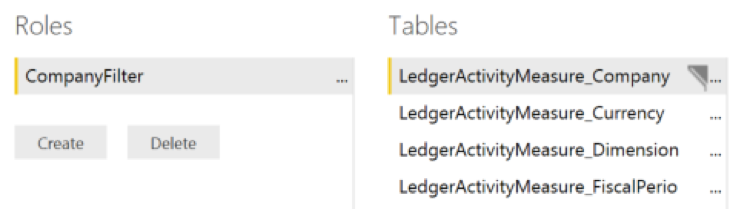

# Help secure analytical workspaces and reports by using Power BI Embedded

[!include [banner](../includes/banner.md)]

> [!NOTE]
> This feature is supported in Microsoft Dynamics 365 Finance, Enterprise edition (July 2017) (version 7.2) and later releases.

## Introduction
This article provides a walk-through for application developers who want to help secure analytical workspaces and reports that are delivered by using Microsoft Power BI Embedded. It describes the recommended strategies for securing access to both the reports and the data set, based on viewer access rights. By using the techniques that are described in this article, you can hide reports from users and filter reports to show the data set that is appropriate for a specific user, based on the active company context.

## Prerequisites
+ Access to a developer environment that runs Platform update 8 or later
+ An analytical report (.pbix file) that was created by using Microsoft Power BI Desktop, and that has a data model that is sourced from the Entity store database

## Overview
Whether you're extending an existing application workspace or adding your own workspace, you can use embedded analytical views to deliver insightful and interactive views of your business data. Before you add new analytical workspaces and reports, it's important that you establish a strategy to help secure the content.

There are several considerations that you should be aware of when you develop analytical solutions by using Power BI Embedded. Analytical reports are secured by using menu items. After they have access to a report, all viewers can access the underlying data model that is defined in the report. Although service options are available that automatically hide the fields that back a report data set, all viewers of the report have effective access to the fields in the data model. Additionally, X++ extensions are available that influence the way that the report is presented in the client. Both the **Filter** pane and the **Report** tabs can be hidden. However, Microsoft Power BI filters can be modified by using client-side script injections.

### Recommendation
Create scenario-specific .pbix files to deliver analytical views:

+ Area overviews that are delivered by using workspaces
+ Subject matter–specific analytical reports

    > [!NOTE]
    > These analytical reports are often used to deliver reports that contain medium-business-impact and high-business-impact data.

For more information about how to create analytical reports, see [Getting started with Power BI Desktop](https://powerbi.microsoft.com/documentation/powerbi-desktop-getting-started/). This page is a great source for insights that can help you create compelling analytical reporting solutions.

## Help secure analytical views that are provided through embedded Power BI reports
Power BI report filters and the **Filter** pane serve as a mechanism for passing session context into the report that is embedded on the **Analytics** tab. The capability to turn the visibility of the **Filter** pane on and off isn't a security feature. Power BI report filters and the capability to hide and show the **Filter** pane are user experience (UX) decisions that the application designer makes.

Row-level security that is defined isn't inherited by Power BI reports. Instead, application developers can help secure the workspace or the report.

### Help secure analytical workspaces on the Analytics tab
Analytical workspaces are embedded Power BI reports that are shown in a form control. Unless you complete the following procedure, anyone who has access to the workspace can see the **Analytics** tab and access the Power BI reports.

1. Add a menu item for the analytical workspace.
2. Verify that the form initialization uses the **hasMenuItemAccess** application programming interface (API) to verify that the user has access to the menu item.

    ```xpp
    // Note: secure entry point into the Workspace's Analytics report
    if (Global::hasMenuItemAccess(menuItemDisplayStr(FMClerkWorkspace), MenuItemType::Display))
    {
        FMPBIWorkspaceController controller = new FMPBIWorkspaceController();
        PBIReportHelper::initializeReportControl('FMPBIWorkspaces', powerBIReportGroup);
    }
    ```

The preceding logic will prevent the Power BI Viewer control from being initialized. Therefore, an empty tab will appear on the page. By default, the framework automatically hides empty tabs. Therefore, the **Analytics** tab is hidden and can't be access if the user doesn't have access to the menu item that is associated with the analytical workspace.

### Help secure analytical reports
Embedded Power BI reports in the application are secured by using menu items. Users who try to access a Power BI report directly, by using a menu item in application, will receive an error. Follow these steps to help secure the analytical reports.

1. Add a menu item for the report or the appropriate tab. By default, the first tab of the report will be shown if no other tab is selected.
2. Link the menu item to the **PowerBIEmbedded\_App** configuration key.

    

The menu item is now associated with the availability of the Power BI Embedded service. If the service is unavailable, the links for the menu items will be removed from the application.

## Help secure analytical workspaces and reports by company
Power BI workspaces and reports can be secured by company (for example, **DataAreaID** value). Application solutions must apply the following steps for company-level security in analytical workspaces and reports.

In this scenario, the workspaces and reports that the sales manager from Contoso USA sees are limited to data that is related to Contoso USA. The report viewer must not have access to data that associated with any other company, unless the company context is changed.

1. Open the analytical report in Power BI Desktop by double-clicking the resource in a Microsoft Visual Studio project.
2. On the **Modeling** tab, click **Manage Roles**.
3. Create a new role against a column in the data model that contains the **Company** field. Name the new role **CompanyFilter**. A **COMPANY** field must be present in the data model to restrict access by company.

    

4. In the **Table filter DAX expression** field, enter **\[COMPANY\]=username()**.
5. To make sure that the rules work, on the **Modeling** tab, click **View as Roles**. In the dialog box, set the following fields:

    1. Clear the **None** check box.
    2. Select the **Other user** check box, and then enter **USMF** in the text box.
    3. Select the **CompanyFilter** check box.

The reports will now show data as if you're running the USMF company.


[!INCLUDE[footer-include](../../../includes/footer-banner.md)]

