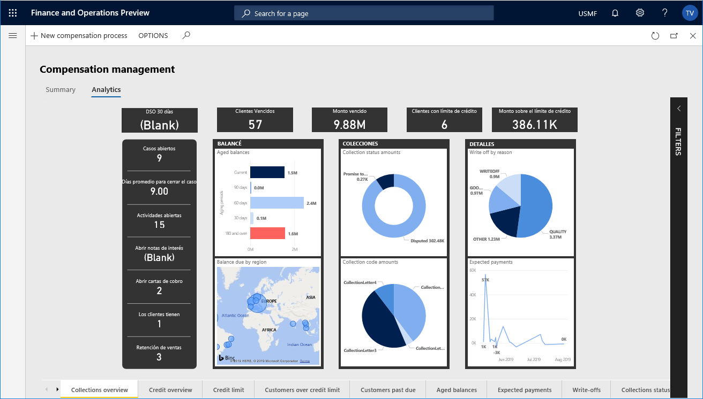

# Select analytical workspaces from Power BI

[!include[banner](../includes/banner.md)]

## Analytical workspaces

The analytical workspaces that are bundled with the application suite offer users relevant insights into their business data. However, in some cases, it might make sense to replace standard reports with custom reports that are designed specifically for the users in your organization.

The world-class tooling that PowerBI.com provides lets you produce analytical reports that contain mashup views that use data from external sources. In Platform update 26 for finance and operations, power users can replace the standard embedded reports with those that are hosted on PowerBI.com.

> [!IMPORTANT]
> The functionality that this article describes isn't a personalization. The customization of analytical workspaces applies to all users in the active legal entity.

### Motivations for embedding PowerBI.com reports

Although standard reports deliver insights that are tailored for a given business persona, an organization might prefer a custom report in some cases. The application lets power users promote custom reports that are hosted on PowerBI.com and shared with members of the organization.

Here are some of the top motivations for selecting reports that are hosted on PowerBI.com:

- PowerBI.com reports support data mashups that use external data sources and can be accessed outside the application.
- The reports are appropriate for demonstrating custom solutions that are hosted on PowerBI.com and embedded in the application in one-box deployments.
- Organizations that have Microsoft Power BI Premium services want to augment the standard reports.

### Embed a PowerBI.com report in an analytical workspace

> [!VIDEO https://learn-video.azurefd.net/vod/player?id=ecad8101-d1a3-4045-bf49-8703338f355a]

The [How to embed PowerBI.com reports](https://www.youtube.com/watch?v=gGWuNJDoi-M&feature=youtu.be) video (shown above) is included in the [finance and operations playlist](https://www.youtube.com/playlist?list=PLcakwueIHoT_SYfIaPGoOhloFoCXiUSyW) available on YouTube.

To replace the standard reports, you must be a member of the System Report Editors security group. Members of this security group can access the options in application workspaces that let them customize the standard reports. This example shows how to replace the standard analytical report with a customized report that is hosted on PowerBI.com.

1. Sign in and open the application report that you want to customize. In this example, you will replace the standard analytical report that is embedded in the **Compensation management** workspace.

    

2. Select the **Analytics** tab to access the workspace's embedded analytical report.

    

    By default, you will see the standard analytical workspace solution that is included with your application. The reports in this solution are automatically deployed and configured for your environment during the provisioning process.

    > [!NOTE]
    > The analytical workspaces require a hosted Power BI service that is available only for dedicated environments. For more information, see the blog post, [Accessing Analytical Workspaces and Reports on 1-Box Environments](/archive/blogs/dynamicsaxbi/accessing-analytical-workspaces-on-1box-environment).

3. On the Action Pane, on the **Options** tab, in the **Power BI** group, select **Select Analytics** to open the **Power BI Reports** dialog box.

    

    This dialog box lets you select among the reports that have been shared on the PowerBI.com service. The reports are organized by workspace.

4. In the drop-down list, select the workspace that contains the report.
5. Select the report to embed in the application workspace, and then select **OK**.
6. To view the updates to the workspace, you must reload the page. Either move away from the workspace and then return, or refresh your browser.
7. In the **Compensation management** workspace, select the **Analytics** tab to access the PowerBI.com report that is now embedded in the analytical workspace.

    

### Revert to the standard solution

After a PowerBI.com report has been embedded in an application workspace, updates to the report are reflected immediately for users. However, to replace the report with another PowerBI.com solution, a power user must first revert to the standard application solution. Follow these steps to revert to the standard application solution.

1. On the Action Pane, on the **Options** tab, in the **Power BI** group, select **Restore Analytics**.

    

2. To view the updates to the workspace, you must reload the page. Either move away from the workspace and then return, or refresh your browser.
3. In the **Compensation management** workspace, select the **Analytics** tab to access the standard solution that is now embedded in the analytical workspace.

[!INCLUDE[footer-include](../../../includes/footer-banner.md)]
