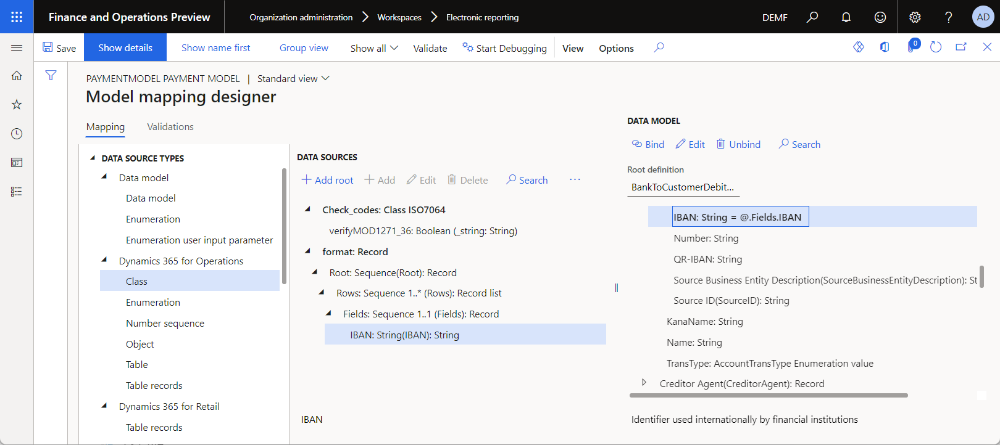

# Design ER expressions to call application class methods

[!include [banner](../../includes/banner.md)]

This article describes how to reuse the existing application logic in [Electronic reporting (ER)](../general-electronic-reporting.md) configurations by calling required methods of application classes in ER expressions. Values of arguments for calling classes can be dynamically defined at runtime. For example, values can be based on information in the parsing document, to ensure its correctness.

For the example in this article, you will design a process that parses incoming bank statements for an application data update. You will receive the incoming bank statements as text (.txt) files that contain International Bank Account Number (IBAN) codes. As part of the process of importing the bank statements, you must validate the correctness of the IBAN code by using the logic that is already available.

## Prerequisites

The procedures in this article are intended for users who have been assigned the **System administrator** or **Electronic reporting developer** role.

The procedures can be completed by using any data set.

To complete them, you must download and save the following file: [SampleIncomingMessage.txt](https://download.microsoft.com/download/8/0/a/80adbc89-f23c-46d9-9241-e0f19125c04b/SampleIncomingMessage.txt).

In this article, you will create the required ER configurations for the Litware, Inc. sample company. Therefore, before you complete the procedures in this article, you must follow these steps.

1. Go to **Organization administration** \> **Workspaces** \> **Electronic reporting**.
2. On the **Localization configurations** page, verify that the configuration provider for the **Litware, Inc.** sample company is available and marked as active. If you don't see this configuration provider, you must first complete the steps in [Create configuration providers and mark them as active](er-configuration-provider-mark-it-active-2016-11.md).

## Import a new ER model configuration

1. On the **Localization configurations** page, in the **Configuration providers** section, select the tile for the **Microsoft** configuration provider.
2. Select **Repositories**.
3. On the **Localization repositories** page, select **Show filters**.
4. To select the Global repository record, add a **Name** filter field.
5. In the **Name** field, enter **Global**. Then select the **contains** filter operator.
6. Select **Apply**.
7. Select **[Open](../er-download-configurations-global-repo.md#open-configurations-repository)** to review the list of ER configurations in the selected repository.
8. On the **Configuration repository** page, in the configuration tree, select **Payment model**.
9. On the **Versions** FastTab, if the **Import** button is available, select it, and then select **Yes**.

    If the **Import** button isn't available, you've already imported the selected version of the **Payment model** ER configuration.

10. Close the **Configuration repository** page, and then close the **Localization repositories** page.

## Add a new ER format configuration

Add a new ER format to parse incoming bank statements in TXT format.

1. On the **Localization configurations** page, select the **Reporting configurations** tile.
2. On the **Configurations** page, in the configuration tree in the left pane, select **Payment model**.
3. Select **Create configuration**. 
4. In the drop-down dialog box, follow these steps:

    1. In the **New** field, enter **Format based on data model PaymentModel**.
    2. In the **Name** field, enter **Bank statement import format (sample)**.
    3. In the **Supports data import** field, select **Yes**.
    4. Select **Create configuration** to finish creating the configuration.

## Design the ER format configuration – Format

Design an ER format that represents the expected structure of the external file in TXT format.

1. For the **Bank statement import format (sample)** format configuration that you added, select **Designer**.
2. On the **Format designer** page, in the format structure tree in the left pane, select **Add root**.
3. In the dialog box that appears, follow these steps:

    1. In the tree, select **Text\\Sequence** to add a **Sequence** format component.
    2. In the **Name** field, enter **Root**.
    3. In the **Special characters** field, select **New line - Windows (CR LF)**. Based on this setting, each line in the parsing file will be considered a separate record.
    4. Select **OK**.

4. Select **Add**.
5. In the dialog box that appears, follow these steps:

    1. In the tree, select **Text\\Sequence**.
    2. In the **Name** field, enter **Rows**.
    3. In the **Multiplicity** field, select **One many**. Based on this setting, at least one line will be expected to be present in the parsing file.
    4. Select **OK**.

6. In the tree, select **Root\\Rows**, and then select **Add Sequence**.
7. In the dialog box that appears, follow these steps:

    1. In the **Name** field, enter **Fields**.
    2. In the **Multiplicity** field, select **Exactly one**.
    3. Select **OK**.

8. In the tree, select **Root\\Rows\\Fields**, and then select **Add**.
9. In the dialog box that appears, follow these steps:

    1. In the tree, select **Text\\String**.
    2. In the **Name** field, enter **IBAN**.
    3.. Select **OK**.

10. Select **Save**.

The configuration is now set up so that each line in the parsing file contains only the IBAN code.

## Design the ER format configuration – Mapping to a data model

Design an ER format mapping that uses information from the parsing file to fill in a data model.

1. On the **Format designer** page, on the Action Pane, select **Map format to model**.
2. On the **Model to datasource mapping** page, on the Action Pane, select **New**.
3. In the **Definition** field, select **BankToCustomerDebitCreditNotificationInitiation**.
4. In the **Name** field, enter **Mapping to data model**.
5. Select **Save**.
6. Select **Designer**.
7. On the **Model mapping designer** page, in the **Data source types** tree, select **Dynamics 365 for Operations\\Class**.
8. In the **Data sources** section, select **Add root** to add a data source that calls the existing application logic for IBAN codes validation.
9. In the dialog box that appears, follow these steps:

    1. In the **Name** field, enter **Check\_codes**.
    2. In the **Class** field, enter or select **ISO7064**.
    3. Select **OK**.

10. In the **Data source types** tree, follow these steps:

    1. Expand the **format** data source.
    2. Expand **format\\Root: Sequence(Root)**.
    3. Expand **format\\Root: Sequence(Root)\\Rows: Sequence 1..\* (Rows)**.
    4. Expand **format\\Root: Sequence(Root)\\Rows: Sequence 1..\* (Rows)\\Fields: Sequence 1..1 (Fields)**.

11. In the **Data model** tree, follow these steps:

    1. Expand the **Payments** field of the data model.
    2. Expand **Payments\\Creditor Account(CreditorAccount)**.
    3. Expand **Payments\\Creditor Account(CreditorAccount)\\Identification**.
    4. Expand **Payments\\Creditor Account(CreditorAccount)\\Identification\\IBAN**.

12. Follow these steps to bind components of the configured format to data model fields:

    1. Select **format\\Root: Sequence(Root)\\Rows: Sequence 1..\* (Rows)**.
    2. Select **Payments**.
    3. Select **Bind**. Based on this setting, each line in the parsing file will be considered a single payment.
    4. Select **format\\Root: Sequence(Root)\\Rows: Sequence 1..\* (Rows)\\Fields: Sequence 1..1 (Fields)\\IBAN: String(IBAN)**.
    5. Select **Payments\\Creditor Account(CreditorAccount)\\Identification\\IBAN**.
    6. Select **Bind**. Based on this setting, the **IBAN** field of the data model will be filled with the value from the parsing file.

    

13. On the **Validations** tab, follow these steps to add a [validation](../general-electronic-reporting-formula-designer.md#Validation) rule that shows an error message for any line in the parsing file that contains an invalid IBAN code:

    1. Select **New**, and then select **Edit condition**.
    2. On the **Formula designer** page, in the **Data source** tree, expand the **Check\_codes** data source that represents the **ISO7064** application class to view the available methods of this class.
    3. Select **Check\_codes\\verifyMOD1271\_36**.
    4. Select **Add data source**.
    5. In the **Formula** field, enter the following [expression](../general-electronic-reporting-formula-designer.md#Binding): **Check\_codes.verifyMOD1271\_36(format.Root.Rows.Fields.IBAN)**.
    6. Select **Save**, and then close the page.
    7. Select **Edit message**.
    8. On the **Formula designer** page, in the **Formula** field, enter **CONCATENATE("Invalid IBAN code has been found:&nbsp;", format.Root.Rows.Fields.IBAN)**.
    9. Select **Save**, and then close the page.

    Based on these settings, the validation condition will return *[FALSE](../er-formula-supported-data-types-primitive.md#boolean)* for any invalid IBAN code by calling the existing **verifyMOD1271\_36** method of the **ISO7064** application class. Note that the value of the IBAN code is dynamically defined at runtime as the argument of the calling method, based on the content of the parsing text file.

    

14. Select **Save**.
15. Close the **Model mapping designer** page, and then close the **Model to datasource mapping** page.

## Run the format mapping

For testing purposes, run the format mapping by using the SampleIncomingMessage.txt file that you downloaded earlier. The generated output will include data that is imported from the selected text file and ported to the custom data model during the real import.

1. On the **Model to datasource mapping** page, select **Run**.
2. On the **Electronic report parameters** page, select **Browse**, browse to the **SampleIncomingMessage.txt** file that you downloaded, and select it.
3. Select **OK**.
4. Notice that the **Model to datasource mapping** page shows an error message about an invalid IBAN code.

    

5. Review the output in XML format that represents the data that has been imported from the selected file and ported to the data model. Notice that only three lines of the imported text file were processed without errors. The IBAN code on line 4 isn't valid and was skipped.

    

[!INCLUDE[footer-include](../../../../includes/footer-banner.md)]
