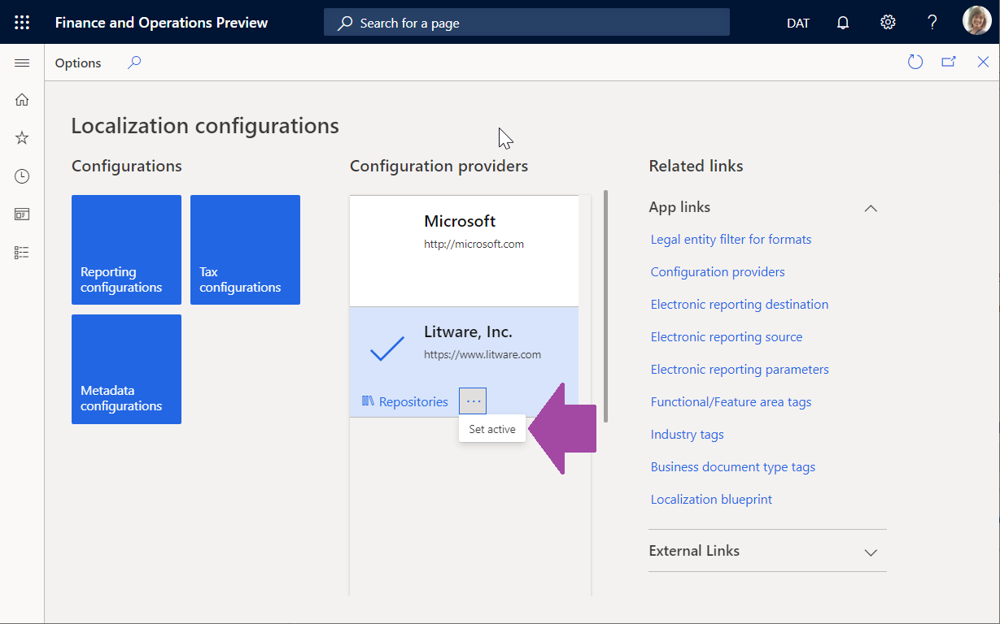

# Create configuration providers and mark them as active

[!include [banner](../../includes/banner.md)]

This article explains how a user assigned to the System Administrator or Electronic Reporting Developer role can create a configuration provider for Electronic reporting (ER). Each ER configuration will refer to the provider as the author of the configuration. In this example, you will create a configuration provider for sample company, Litware, Inc. These steps can be performed in any company as ER configuration providers are shared among all companies.

## Create a provider
1. Go to the **navigation pane** in the upper left corner and select **Organization administration**.
2. Go to **Workspaces > Electronic reporting**.
3. Go to **Related links > Configuration providers**.
4. Select **New**.
    - A provider record has a unique name and URL. Review the content of this page and skip this procedure if a record for Litware, Inc. (https://www.litware.com) already exists.  
5. In the Name field, type `Litware, Inc.`.
6. In the Internet address field, type `https://www.litware.com`.
7. Select **Save**.
8. Close the page.

## Select as an active provider
1. Select the Litware, Inc. provider.
2. Select **Set active**.

[!INCLUDE[footer-include](../../../../includes/footer-banner.md)]
