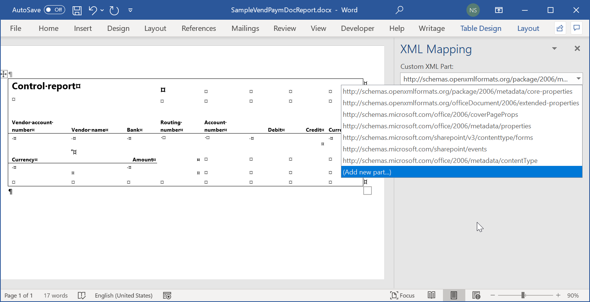
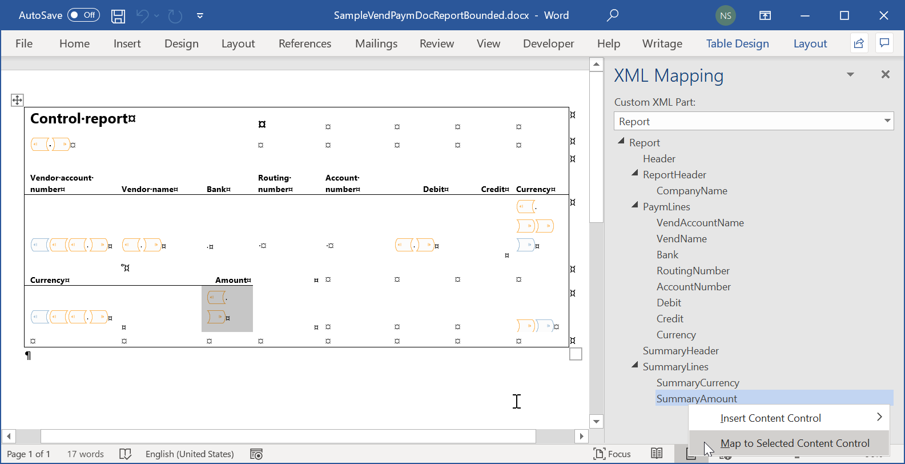
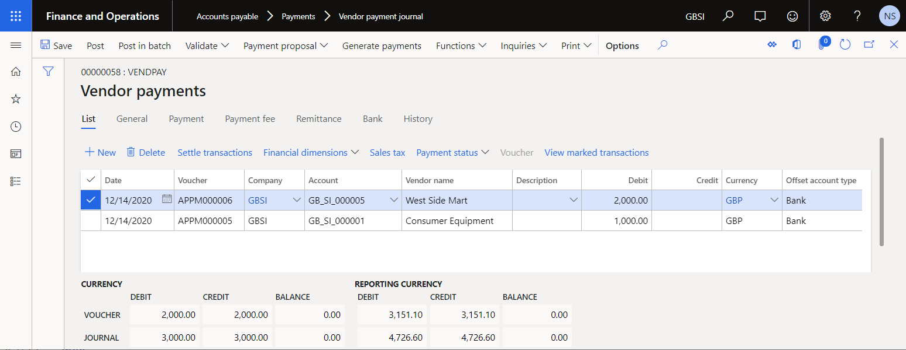
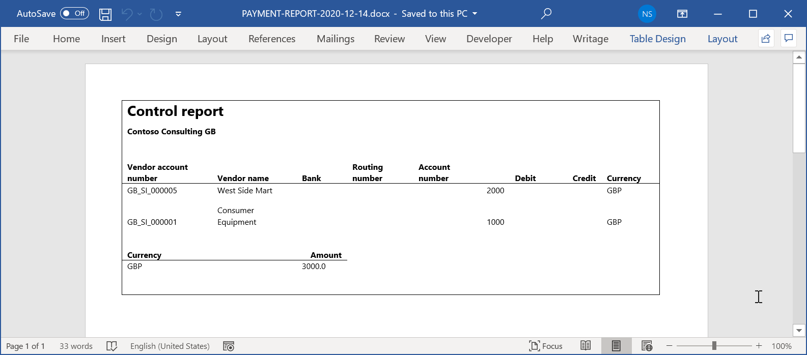

# Reuse ER configurations with Excel templates to generate reports in Word format

[!include [banner](../../includes/banner.md)]

To generate reports as Microsoft Word documents, you can [configure](../er-design-configuration-word.md) a new [Electronic reporting (ER)](../general-electronic-reporting.md) format. Alternatively, you can reuse an ER format that was originally designed to generate reports as Excel workbooks. In this case, you must replace the Excel template with a Word template.

The following procedures show how a user in either the System administrator role or the Electronic reporting developer role can configure an ER format to generate reports as Word files by reusing an ER format that was designed to generate reports as Excel files.

These procedures can be completed in the GBSI company.

## Prerequisites

To complete these procedures, you must first follow the steps in the [Design a configuration for generating reports in OPENXML format](er-design-reports-openxml-2016-11.md) task guide.

You must also download and locally save the following templates for the sample report:

- [Template of Payment Report (SampleVendPaymDocReport.docx)](https://download.microsoft.com/download/0/d/e/0de5a87c-95fc-4dfa-958f-285cb28b5b2b/SampleVendPaymDocReport.docx)
- [Bounded Template of Payment Report (SampleVendPaymDocReportBounded.docx)](https://download.microsoft.com/download/a/1/2/a126cb43-6281-4f7b-bde0-25e03ff9bc1e/SampleVendPaymDocReportBounded.docx)

These procedures are for a feature that was added in Dynamics 365 for Operations version 1611 (November 2016).

## Select the existing ER report configuration

1. In Dynamics 365 Finance, go to **Organization administration** \> **Workspaces** \> **Electronic reporting**.
2. Make sure that the **Litware, Inc.** configuration provider is selected as **Active**. If it isn't, follow the steps in the [Create configuration providers and mark them as active](er-configuration-provider-mark-it-active-2016-11.md) task guide.
3. Select **Reporting configurations**. You will reuse the existing ER configuration that was designed to generate the report output in OPENXML format.
4. On the **Configurations** page, in the configuration tree in the left pane, expand **Payment model**, and select **Sample worksheet report**.

    > [!NOTE]
    > The draft version of the selected ER format can be edited on the **Versions** FastTab.

5. Select **Designer**.
6. On the **Format designer** page, notice that the title of the root format element indicates that an Excel template is currently used.

## Review the downloaded Word template

1. In the Word desktop application, open the **SampleVendPaymDocReport.docx** template file that you downloaded earlier.
2. Verify that the template contains only the layout of the document that you want to generate as ER output.

## Replace the Excel template with the Word template and add a custom XML part

Currently, the Excel document is used as a template to generate the output in OPENXML format. You will replace this template with the SampleVendPaymDocReport.docx Word template file that you downloaded earlier. You will also extend the Word template by adding a custom XML part.

1. In Finance, on the **Format designer** page, on the **Format** tab, select **Attachments**.
2. On the **Attachments** page, select **Delete** to remove the existing Excel template. Select **Yes** to confirm the change.
3. Select **New** \> **File**.

    > [!NOTE]
    > You must select a document type that has been [configured](../electronic-reporting-er-configure-parameters.md#parameters-to-manage-documents) in the ER parameters to store templates of ER formats.

4. Select **Browse**, and then browse to and select the **SampleVendPaymDocReport.docx** file that you downloaded earlier.
5. Select **OK**.
6. Close the **Attachments** page.
7. On the **Format designer** page, in the **Template** field, enter or select the **SampleVendPaymDocReport.docx** file to use that Word template instead of the Excel template that was previously used.
8. Select **Save**.

    In addition to storing configuration changes, the **Save** action updates the attached Word template. The hierarchical structure of the designed format is added to the attached Word document as a new custom XML part that is named **Report**. The attached Word template contains the layout of the document that will be generated as ER output and the structure of data that ER will enter in that template at runtime.

9. Notice that the title of the root format element indicates that a Word template is currently used.

    

10. On the **Format** tab, select **Attachments**.

You can now map the elements of the **Report** custom XML part to the content controls of the Word document.

If you're familiar with the process of designing Word documents as forms that contain [content controls](/office/client-developer/word/content-controls-in-word) that are mapped to elements of [custom XML parts](/visualstudio/vsto/custom-xml-parts-overview), complete all steps in the next procedure to create the document. For more information, see [Create forms that users complete or print in Words](https://support.office.com/article/Create-forms-that-users-complete-or-print-in-Word-040c5cc1-e309-445b-94ac-542f732c8c8b). Otherwise, skip the next procedure.

## Get a Word document that has a custom XML part and do data mapping

1. In Finance, on the **Attachments** page, select **Open** to download the selected template from Finance and store it locally as a Word document.
3. In the Word desktop application, open the document that you just downloaded.
4. On the **Developer** tab, select **XML Mapping Pane**.

    > [!NOTE]
    > If the **Developer** tab doesn't appear on the ribbon, customize the ribbon to add it.

5. In the **XML Mapping** pane, in the **Custom XML Part** field, select the **Report** custom XML part.
6. Map the elements of the selected **Report** custom XML part and the content controls of the Word document.
7. Save the updated Word document locally as **SampleVendPaymDocReportBounded.docx**.

## Review the Word template where the custom XML part is mapped to content controls

1. In the Word desktop application, open the **SampleVendPaymDocReportBounded.docx** template file.
2. Verify that the template contains the layout of the document that you want to generate as ER output. The content controls that are used as placeholders for data that ER will enter in this template at runtime are based on the mappings that are configured between elements of the **Report** custom XML part and the content controls of the Word document.

## Upload the Word template where the custom XML part is mapped to content controls

1. In Finance, on the **Attachments** page, select **Delete** to remove the Word template that has no mappings between elements of the **Report** custom XML part and content controls. Select **Yes** to confirm the change.
2. Select **New** \> **File** to add a new template file that contains mappings between elements of the **Report** custom XML part and content controls.

    > [!NOTE]
    > You must select a document type that has been [configured](../electronic-reporting-er-configure-parameters.md#parameters-to-manage-documents) in the ER parameters to store templates of ER formats.

3. Select **Browse**, and then browse to and select the **SampleVendPaymDocReportBounded.docx** file that you downloaded or prepared by completing the procedure in the [Get a Word that has a custom XML part to do data mapping](#get-word-doc) section.
4. Select **OK**.
5. Close the **Attachments** page.
6. On the **Format designer** page, in the **Template** field, select the document that you just downloaded.
7. Select **Save**.
8. Close the **Format designer** page.

## Mark the configured format as runnable

To run the draft version of the editable format, you must make it [runnable](../er-quick-start2-customize-report.md#MarkFormatRunnable).

1. In Finance, on the **Configurations** page, on the Action Pane, on the **Configurations** tab, in the **Advanced settings** group, select **User parameters**.
2. In the **User parameters** dialog box, set the **Run settings** option to **Yes**, and then select **OK**.
3. Select **Edit** to make the current page editable, as required.
4. For the currently selected **Sample worksheet report** configuration, set the **Run Draft** option to **Yes**.
5. Select **Save**.

## Run the format to create output in Word format

1. In Finance, go to **Accounts payable** \> **Payments** \> **Payment journal**.
2. In a payment journal that you entered earlier, select **Lines**.
3. On the **Vendor payments** page, select all rows in the grid.
4. Select **Payment status** \> **None**.

    

5. On the Action Pane, select **Generate payments**.
6. In the dialog box that appears, follow these steps:

    1. In the **Method of payment** field, select **Electronic**.
    2. In the **Bank account** field, select **GBSI OPER**.
    3. Select **OK**.

7. In the **Electronic report parameters** dialog box, select **OK**.
8. The generated output is presented in Word format and contains the details of the processed payments. Analyze the generated output.

    

## Additional resources

- [Design a new ER configuration to generate reports in Word format](../er-design-configuration-word.md)
- [Embed images and shapes in documents that you generate by using ER](../electronic-reporting-embed-images-shapes.md#embed-an-image-in-a-word-document)

[!INCLUDE[footer-include](../../../../includes/footer-banner.md)]
