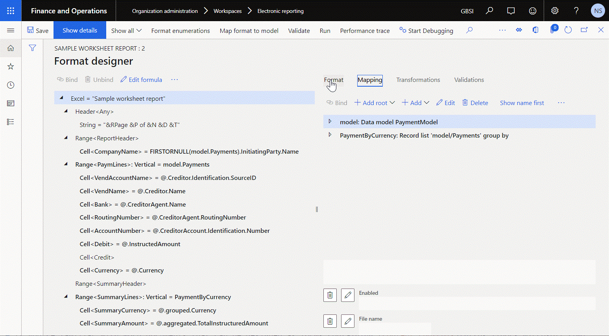

--- 
# required metadata 
 
title: Design ER configurations to generate reports in Word format
description: The following steps explain how a user in either the System administrator or Electronic reporting developer role can configure an Electronic reporting formats to generate reports as Microsoft Word files. 
author: NickSelin
manager: AnnBe 
ms.date: 08/12/2019
ms.topic: business-process 
ms.prod:  
ms.service: dynamics-ax-applications 
ms.technology:  
 
# optional metadata 
 
ms.search.form: ERWorkspace, ERSolutionTable, EROperationDesigner,  LedgerJournalTable, LedgerJournalTransVendPaym   
audience: Application User 
# ms.devlang:  
ms.reviewer: kfend
# ms.tgt_pltfrm:  
# ms.custom:  
ms.search.region: Global
# ms.search.industry: 
ms.author: nselin
ms.search.validFrom: 2016-06-30 
ms.dyn365.ops.version: Version 7.0.0 
---
# Design ER configurations to generate reports in Word format

[!include [banner](../../includes/banner.md)]

## Overview

To generate reports as Word documents, you can configure a new ER format. It must contain the **Excel\File** format element that is linked with a Word document using at runtime as a template of a generated report. You can add **Excel\Range** and **Excel\Cell** nested elements for the added **Excel\File** element to specify the structure of data that will be placed to a generated report at runtime.

> [!NOTE]
> Whenever you save changes of the editable ER format at design time, the structure of your format is stored in your Word template as the custom XML part named **Report**. As soon as you have got a Word template with residing in it **Report** custom XML part, you can design your template using Word content controls as placeholders of data that will be filled in at runtime. You need to map every content control to an appropriate field of the **Report** custom XML part to specify how content controls are filled in.

Then, you can bind added ER format elements with necessary data sources of your ER format to specify what actual data is placed at runtime to a generated report as the **Report** custom XML part.

> [!NOTE]
> Whenever you run the configured ER format, the attached Word template is used to make a new report in Word format. The actual data is stored in your Word report as the custom XML part named **Report**. Word content controls are filled in by data from the **Report** custom XML part as soon as a generated report is opened.

Alternatively, you can re-use an ER format that has been initially configured to generate reports as an Excel workbook. In this case you just need to replace an Excel template with a Word one.

The following steps explain how a user in either the System administrator or Electronic reporting developer role can configure an [Electronic reporting (ER)](../general-electronic-reporting.md) [format](../general-electronic-reporting.md#FormatComponentOutbound) to generate reports as Microsoft Word files re-using an ER format that has been initially configured to generate reports as Microsoft Excel files.

These steps can be performed in the GBSI company.

To complete these steps, you must first complete the steps in the [Design a configuration for generating reports in OPENXML format](er-design-reports-openxml-2016-11.md) task guide. In advance, you must also download and save the following templates locally for the sample report:

- [Template of Payment Report (SampleVendPaymDocReport.docx)](https://go.microsoft.com/fwlink/?linkid=862266)
- [Bounded Template of Payment Report (SampleVendPaymDocReportBounded.docx)](https://go.microsoft.com/fwlink/?linkid=862266)

This procedure is for a feature that was added in Microsoft Dynamics 365 for Operations version 1611.

## Select the existing ER report configuration

1.  In the **Navigation pane**, go to **Modules \> Organization administration \> Workspaces \> Electronic reporting**. Make sure that the configuration provider 'Litware, Inc.' is selected as active. Otherwise, complete the steps in the [Create configuration providers and mark them as active](er-configuration-provider-mark-it-active-2016-11.md) task guide.
2.  Select **Reporting configurations**. We will re-use the existing ER configuration that has been originally designed to generate the report output in OPENXML format.  
3.  On the **Configurations** page, in the configuration tree in the left pane, expand **Payment model**.
4.  In the configuration tree, select **Payment model\Sample worksheet report**.
    >[!NOTE]
    > Note that the draft version of the selected ER format is offered for editing in the **Versions** FastTab.
5.  Select **Designer**.
    >[!NOTE]
    > Please, note that the title of the root format element indicates that an Excel template is currently used.
     

## Review the downloaded Word template

1.  Open the SampleVendPaymDocReport.docx in the Microsoft Word desktop application.
2.  Verify that this template only contains the layout of the document we want to generate as ER output.
     

## Replace the Excel template with the Word template

Currently, the Excel document is used as a template to generate the output in OPENXML format. We will replace this template by a new  template in Word format that you downloaded earlier, SampleVendPaymDocReport.docx. 

1.  On the **Format designer** page, select **Attachments**.   
2.  On the **Attachments** page, select **Delete** to remove the existing Excel template. Select **Yes** to confirm deletion.
3.  Select **New**.
    > [!NOTE]
    > You must select a document type that has been [configured](../electronic-reporting-er-configure-parameters.md#parameters-to-manage-documents) earlier in ER parameters to store templates of ER formats.
5.  Select **Browse**. Navigate to and select SampleVendPaymDocReport.docx that you previously downloaded.
6.  Select **OK**.
7.  Close the **Attachments** page. 
8.  On the **Format designer** page, in the **Template** field, enter or select the SampleVendPaymDocReport.docx Word template that you downloaded in the previous step to use it instead of previously used Excel template.

## Extend the Word template by adding a custom XML part

1.  Select **Save**.
    > [!TIP]
    > In addition to storing configuration changes, the **Save** action also updates the attached Word template. The hierarchical structure of the designed format is ported to the attached Word document as a new custom XML part with the name **Report**. Note that the attached Word template contains not only the layout of the document we want to generate as ER output, it also contains the structure of data that ER will populate into this template at runtime.

    >[!NOTE]
    > Please, note that the title of the root format element indicates that a Word template is currently used.
     
2. Select **Attachments**.
    + Now you need to map the elements of the custom XML part **Report** to the Word document content controls.  
    + If you're familiar with Word documents that can be designed as forms containing [content controls](https://docs.microsoft.com/office/client-developer/word/content-controls-in-word) that are mapped with elements of [custom XML parts](https://docs.microsoft.com/visualstudio/vsto/custom-xml-parts-overview?view=vs-2019) – play all steps of the next sub-task to create such a document. For more details, see [Create forms that users complete or print in Words](https://support.office.com/article/Create-forms-that-users-complete-or-print-in-Word-040c5cc1-e309-445b-94ac-542f732c8c8b?ui=en-US&rs=en-US&ad=US). Otherwise, skip all the steps in the next sub-task.

## Get Word with custom XML part to do data mapping

1.  Select **Open** to download the selected template from Finance application and store it locally as a Word document.
2.  Open this document in Word desktop application and do the following:
    + Open the Word Developer tab (customize the ribbon if it is not enabled yet).
    + Select XML mapping pane.
    + Select the **Report** custom XML part in the lookup.
    + Do mapping of the elements of the selected **Report** custom XML part and content controls of the Word document.
    + Save the updated Word document on a local drive as the SampleVendPaymDocReportBounded.docx document.

## Review the Word template with custom XML part mapped to content controls

1.  Open the SampleVendPaymDocReportBounded.docx in the Microsoft Word desktop application.
2.  Verify that this template contains the layout of the document we want to generate as ER output, content controls that are used as placeholders of data that ER will populate to this template at runtime based on configured mappings between elements of the custom XML part **Report** and the Word document content controls.
     

## Upload the Word template with custom XML part mapped to content controls

1.  On the **Attachments** page, select **Delete** to remove the Word template containing no mappings between elements of the **Report** custom XML part and content controls. Select **Yes** to confirm deletion.
2.  Select **New** to add a new template containing mappings between elements of the **Report** custom XML part and content controls.
3.  Select **File**.
    > [!NOTE]
    > You must select a document type that has been [configured](../electronic-reporting-er-configure-parameters.md#parameters-to-manage-documents) earlier in ER parameters to store templates of ER formats.
4.  Select **Browse**. Navigate to and select SampleVendPaymDocReportBounded.docx that you either previously downloaded or prepared completing the previous **Get Word with custom XML part to do data mapping** sub-task. Click **OK**.
5. In the **Template** field, select the document that you downloaded in the previous step.
6. Select **Save**.
7. Close the **Format designer** page.

## Mark the configured format as runnable

If you want to run the draft version of the editable format, you need to make it [runnable](../er-quick-start2-customize-report.md#MarkFormatRunnable).

1.  On the **Configurations** page, on the Action Pane, on the **Configurations** tab, in the **Advanced settings** group, select **User parameters**.
2.  In the **User parameters** dialog box, set the **Run settings** option to **Yes**, and then select **OK**.
3.  Select **Edit** to make the current page editable, as required.
4.  For the currently selected **Sample worksheet report** configuration, set the **Run Draft** option to **Yes**.
5.  Select **Save**.

## Execute the format to create Word output

1.  In the **Navigation pane**, go to **Modules \> Accounts payable \> Payments \> Payment journal**.
2.  For the entered earlier payment journal, select **Lines**.
3.  In the list of the **Vendor payments** page, mark all rows.
4.  Select **Payment status \> None**.
     
5.  Select **Generate payments**.
    + In the **Method of payment** field, select the **Electronic** value.
    + In the **Bank account** field, select the **GBSI OPER** value.
    + Select **OK**.
6.  On the **Electronic report parameters** dialog box, select **OK**.

Analyze the generated output. Note that the created output is presented in Word format and contains the details of the processed payments.

## Frequently asked questions

**Question:** I have configured an ER format to print out a Word document that contains a company address. In Word template of this ER format, I have inserted a Rich Text Content Control to present a company address. In Finance I have entered the company address as multi-line text executing a carriage return (Enter) for every entered line. So, I expect to see the company address as multi-line text in a generated document as well. But the address is presented as a single line text containing a special symbol instead of a carriage return. What is wrong with my setting?

**Answer:** Instead of a Rich Text Content Control, you need to use a Plain Text Content Control the property **Allow carriage returns (multiple paragraphs)** of which must be enabled.

## Additional resources

- [Embed images and shapes in documents that you generate by using ER](../electronic-reporting-embed-images-shapes.md#embed-an-image-in-a-word-document)
