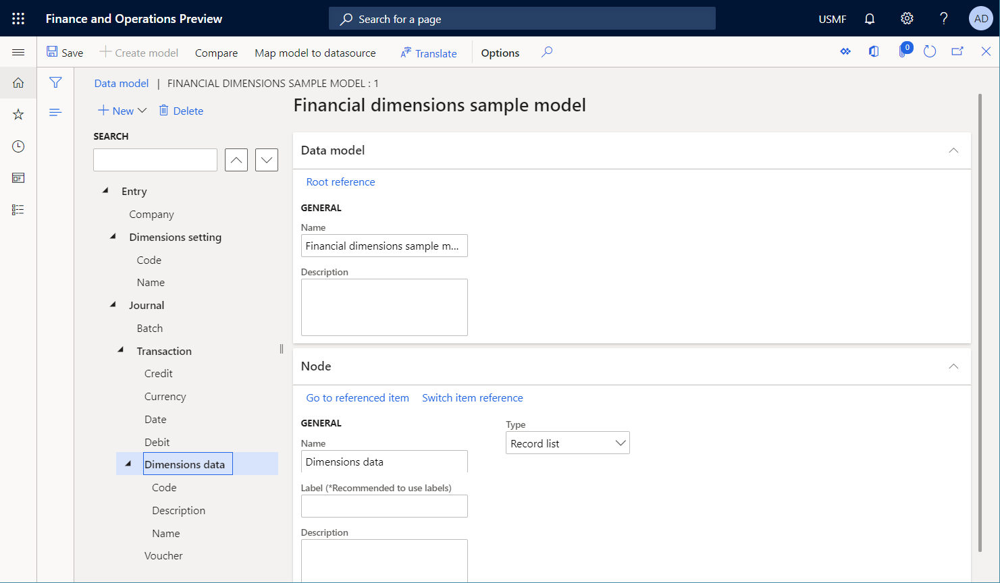

# ER Use financial dimensions as a data source (Part 1 - Design data model)

[!include [banner](../../includes/banner.md)]

The following steps explain how either a system administrator or electronic reporting developer can configure an Electronic reporting (ER) model to use financial dimensions as a data source for ER reports. These steps can be performed in any company.

To complete these steps, you must first complete the steps in the procedure, "Create a configuration provider and mark it as active".

## Create a new data model
1. Go to Organization administration > Workspaces > Electronic reporting.
    * Make sure that the "Litware, Inc." provider is available and marked as active.  
2. Click Reporting configurations.
3. Click Create configuration to open the drop dialog.
4. In the Name field, type 'Financial dimensions sample model'.
5. Click Create configuration.
6. Click Designer.
7. Click New to open the drop dialog.
8. In the Name field, type 'Entry'.
9. Click Add.
10. Click New to open the drop dialog.
11. In the Name field, type 'Company'.
12. Click Add.
    * We will add to our model a new record list. This list will expose (for any ER reports using this model as data source) the settings of selected financial dimensions. Each financial dimension will be presented in this list as a record with appropriate fields representing dimension's setting.  
13. Click New to open the drop dialog.
14. In the Name field, type 'Dimensions setting'.
15. In the Item type field, select 'Record list'.
16. Click Add.
17. Click New to open the drop dialog.
18. In the Name field, type 'Code'.
19. In the Item type field, select 'String'.
20. Click Add.
21. Click New to open the drop dialog.
22. In the Name field, type 'Name'.
23. Click Add.
24. In the tree, select 'Entry'.
25. Click New to open the drop dialog.
26. In the Name field, type 'Journal'.
27. In the Item type field, select 'Record list'.
28. Click Add.
29. Click New to open the drop dialog.
30. In the Name field, type 'Batch'.
31. In the Item type field, select 'String'.
32. Click Add.
33. Click New to open the drop dialog.
34. In the Name field, type 'Transaction'.
35. In the Item type field, select 'Record list'.
36. Click Add.
37. Click New to open the drop dialog.
38. In the Name field, type 'Date'.
39. In the Item type field, select 'Date'.
40. Click Add.
41. Click New to open the drop dialog.
42. In the Name field, type 'Debit'.
43. In the Item type field, select 'Real'.
44. Click Add.
45. Click New to open the drop dialog.
46. In the Name field, type 'Credit'.
47. Click Add.
48. Click New to open the drop dialog.
49. In the Name field, type 'Currency'.
50. In the Item type field, select 'String'.
51. Click Add.
52. Click New to open the drop dialog.
53. In the Name field, type 'Voucher'.
54. Click Add.
55. Click New to open the drop dialog.
56. In the Name field, type 'Dimensions data'.
57. In the Item type field, select 'Record list'.
58. Click Add.
    * We added to our model a new record list. This list will expose (for any ER reports using this model as data source) the values of selected financial dimensions. Each financial dimension will be presented in this list as a record with appropriate fields representing dimension's values. Dimension name will be also presented in this record as a field to be used, if needed, for selection purposes.  
59. Click New to open the drop dialog.
60. In the Name field, type 'Code'.
61. In the Item type field, select 'String'.
62. Click Add.
63. Click New to open the drop dialog.
64. In the Name field, type 'Description'.
65. Click Add.
66. Click New to open the drop dialog.
67. In the Name field, type 'Name'.
68. Click Add.
69. Click Save.
70. Close the page.

[!INCLUDE[footer-include](../../../../includes/footer-banner.md)]
