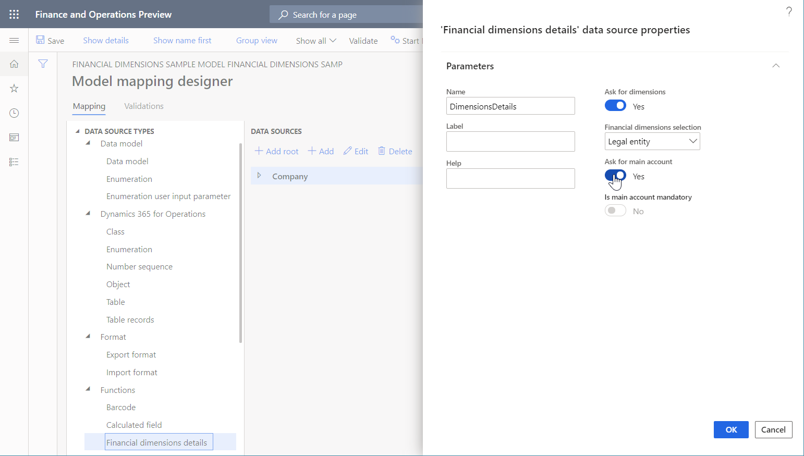
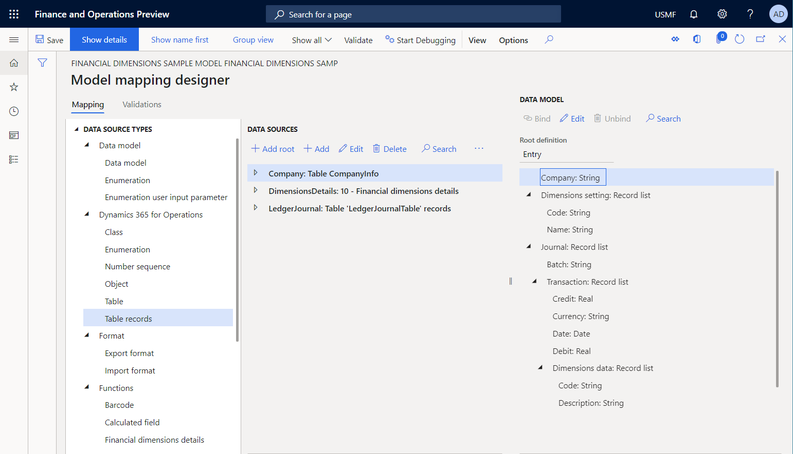
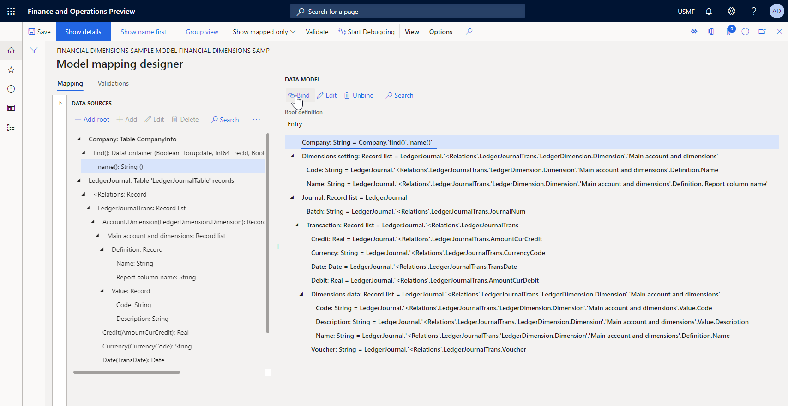
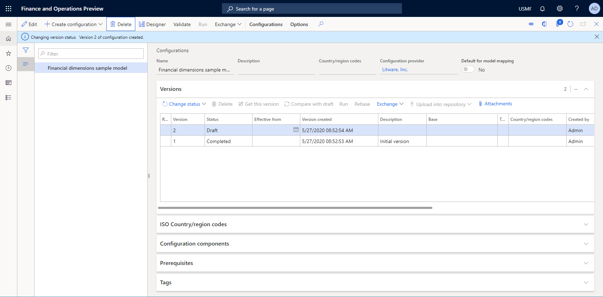

# ER Use financial dimensions as a data source (Part 2 - Model mapping)

[!include [banner](../../includes/banner.md)]

The following steps explain how a user assigned to the system administrator or electronic reporting developer role can configure an Electronic reporting (ER) model to use financial dimensions as a data source for ER reports. These steps can be performed in any company.

To complete these steps, you must first complete the steps in the "ER Use financial dimensions as a data source (Part 1: Design data model" procedure.

## Add required data sources to model mapping
1. Go to Organization administration > Electronic reporting > Configurations.
2. In the tree, select 'Financial dimensions sample model'.
3. Click Designer.
4. Click Map model to datasource.
5. Click New.
6. In the Definition field, select Entry.
7. In the Name field, type 'Dimensions data mapping'.
8. In the Description field, type 'Dimensions data mapping'.
9. Click Save.
10. Click Designer.
11. In the tree, select 'Dynamics 365 for Operations\Table'.
12. Click Add root.
13. In the Name field, type 'Company'.
14. In the Table field, type 'CompanyInfo'.
15. Click OK.
16. In the tree, select 'Functions\Financial dimensions details'.
17. Click Add root.
    * This data source specifies how the scope of financial dimensions will be defined for any report that will use this model as a data source.  
18. In the Name field, type a value.
19. Select Yes in the Ask for dimensions field.
    * Select Yes to allow the user to select dimensions at run-time on the User dialog form. If set to No, all financial dimensions of the current instance will be used by default.  
20. In the Financial dimensions selection field, select 'Legal entity'.
    * Select All to allow the user to select desire dimensions for the current  instance in the Lookup field.  Select Legal entity to allow the user to select dimensions for the company in the Lookup field.  Select Dimension to allow the user to select dimensions using a single dimension set.  
21. Select Yes in the Ask for main account field.
    * Set 'Ask for main account' to Yes to allow users to select the main account as part of the list of dimensions.   If set to No, the main account will not be included to the list of dimensions and the 'Is main account mandatory' option is enabled. If "Is main account mandatory' is set to Yes, include the main account in the list of dimensions regardless of the user's selection.  
22. Click OK.

23. In the tree, select 'Dynamics 365 for Operations\Table records'.
24. Click Add root.
25. In the Name field, type 'LedgerJournal'.
26. Select Yes in the Ask for query field.
27. In the Table field, type 'LedgerJournalTable'.
28. Click OK.

## Map data model elements to added data sources
1. In the tree, expand 'Journal'.
2. In the tree, expand 'Journal\Transaction'.
3. In the tree, expand 'Journal\Transaction\Dimensions data'.
4. In the tree, expand 'Dimensions setting'.
5. In the tree, expand 'LedgerJournal'.
6. In the tree, expand 'LedgerJournal\<Relations'.
7. In the tree, expand 'LedgerJournal\<Relations\LedgerJournalTrans'.
8. In the tree, select 'LedgerJournal\<Relations\LedgerJournalTrans\Voucher'.
9. In the tree, select 'Journal\Transaction\Voucher'.
10. Click Bind.
11. In the tree, select 'LedgerJournal\<Relations\LedgerJournalTrans\Account.Dimension(LedgerDimension.Dimension)'.
    * Note that for any reference to financial dimensions that is set to, for instance, LedgerDimension, a corresponding data source item is available (LedgerDimension.Dimension). This data source item offers the financial dimensions of that dimensions set as the record's list.  
12. In the tree, expand 'LedgerJournal\<Relations\LedgerJournalTrans\Account.Dimension(LedgerDimension.Dimension)'.
13. In the tree, expand 'LedgerJournal\<Relations\LedgerJournalTrans\Account.Dimension(LedgerDimension.Dimension)\Main account and dimensions'.
14. In the tree, expand 'LedgerJournal\<Relations\LedgerJournalTrans\Account.Dimension(LedgerDimension.Dimension)\Main account and dimensions\Value'.
15. In the tree, expand 'LedgerJournal\<Relations\LedgerJournalTrans\Account.Dimension(LedgerDimension.Dimension)\Main account and dimensions\Definition'.
16. In the tree, select 'LedgerJournal\<Relations\LedgerJournalTrans\Account.Dimension(LedgerDimension.Dimension)\Main account and dimensions\Definition\Name'.
17. In the tree, select 'Journal\Transaction\Dimensions data\Name'.
18. Click Bind.
19. In the tree, select 'LedgerJournal\<Relations\LedgerJournalTrans\Account.Dimension(LedgerDimension.Dimension)\Main account and dimensions\Value\Description'.
20. In the tree, select 'Journal\Transaction\Dimensions data\Description'.
21. Click Bind.
22. In the tree, select 'LedgerJournal\<Relations\LedgerJournalTrans\Account.Dimension(LedgerDimension.Dimension)\Main account and dimensions\Value\Code'.
23. In the tree, select 'Journal\Transaction\Dimensions data\Code'.
24. Click Bind.
25. In the tree, select 'LedgerJournal\<Relations\LedgerJournalTrans\Account.Dimension(LedgerDimension.Dimension)\Main account and dimensions'.
26. In the tree, select 'Journal\Transaction\Dimensions data'.
27. Click Bind.
!Model mapping designer page, Mapping tab, Data sources tree.](../media/er-financial-dimensions-guides-model-mapping3.png)
28. In the tree, select 'LedgerJournal\<Relations\LedgerJournalTrans\Debit(AmountCurDebit)'.
29. In the tree, select 'Journal\Transaction\Debit'.
30. Click Bind.
31. In the tree, select 'LedgerJournal\<Relations\LedgerJournalTrans\Date(TransDate)'.
32. In the tree, select 'Journal\Transaction\Date'.
33. Click Bind.
34. In the tree, select 'LedgerJournal\<Relations\LedgerJournalTrans\Currency(CurrencyCode)'.
35. In the tree, select 'Journal\Transaction\Currency'.
36. Click Bind.
37. In the tree, select 'LedgerJournal\<Relations\LedgerJournalTrans\Credit(AmountCurCredit)'.
38. In the tree, select 'Journal\Transaction\Credit'.
39. Click Bind.
40. In the tree, select 'LedgerJournal\<Relations\LedgerJournalTrans'.
41. In the tree, select 'Journal\Transaction'.
42. Click Bind.
43. In the tree, select 'LedgerJournal\Journal batch number(JournalNum)'.
44. In the tree, select 'Journal\Batch'.
45. Click Bind.
46. In the tree, select 'LedgerJournal'.
47. In the tree, select 'Journal'.
48. Click Bind.
49. In the tree, expand 'Dimensions'.
50. In the tree, expand 'Dimensions\Main account and dimensions'.
51. In the tree, expand 'Dimensions\Main account and dimensions\Definition'.
52. In the tree, select 'Dimensions\Main account and dimensions\Definition\Name'.
53. In the tree, select 'Dimensions setting\Code'.
54. Click Bind.
55. In the tree, select 'Dimensions\Main account and dimensions\Definition\Report column name'.
56. In the tree, select 'Dimensions setting\Name'.
57. Click Bind.
58. In the tree, select 'Dimensions\Main account and dimensions'.
59. In the tree, select 'Dimensions setting'.
60. Click Bind.
61. In the tree, select 'Company'.
62. Click Edit.
63. In the expressionAsStringText field, enter 'Company.'find()'.'name()''.
    * Company.'find()'.'name()'  
64. Click Save.

65. Close the page.
66. Click Save.
67. Close the page.

## Complete this draft model's version
1. Close the page.
2. Close the page.
3. Click Change status.
4. Click Complete.
5. Click OK.

[!INCLUDE[footer-include](../../../../includes/footer-banner.md)]
