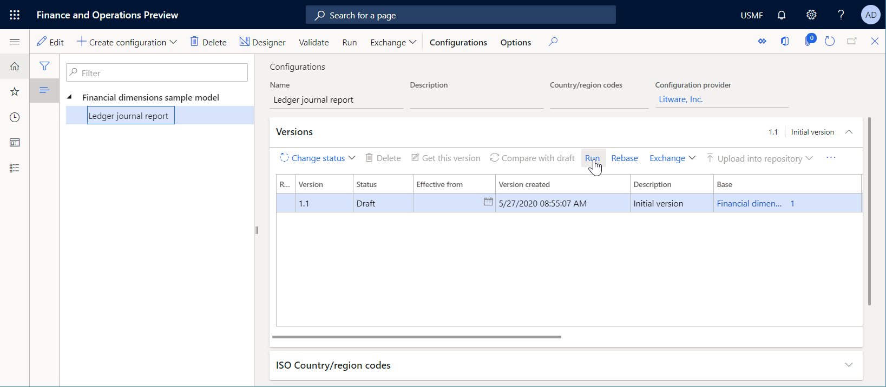
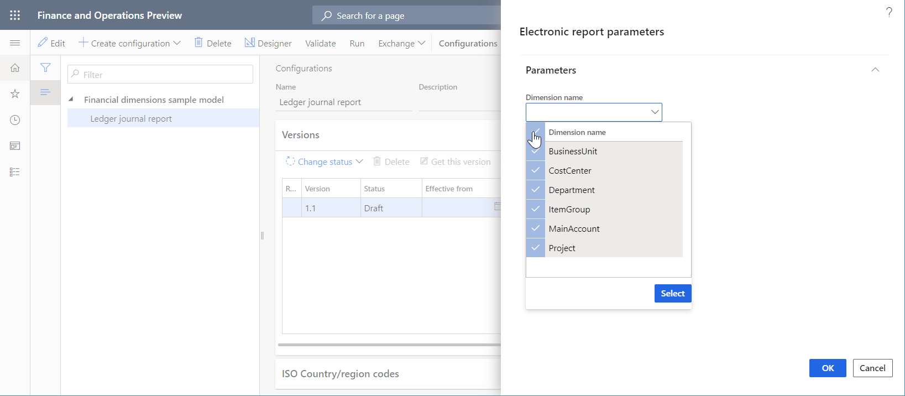
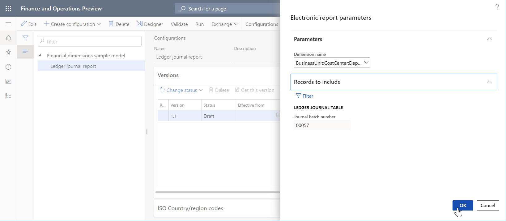
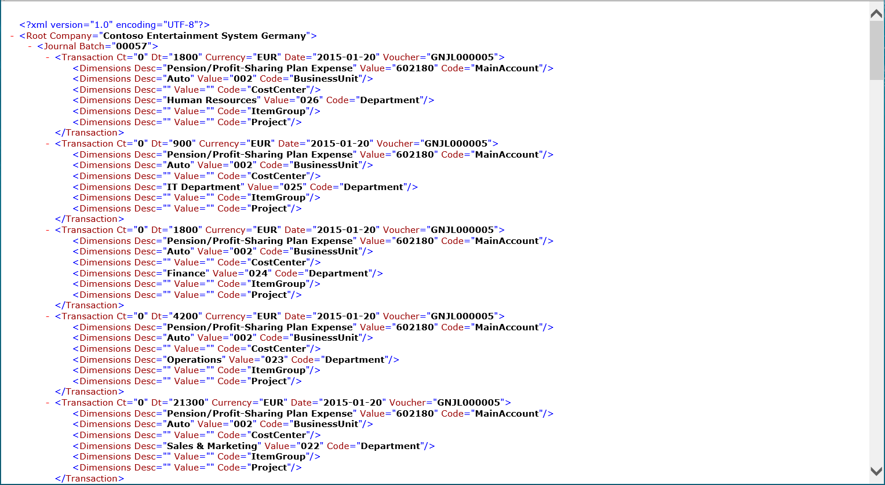

# ER Use financial dimensions as a data source (Part 4 - Run the report)

[!include [banner](../../includes/banner.md)]

The following steps explain how a user assigned to the system administrator or electronic reporting developer role can configure an Electronic reporting (ER) model to use financial dimensions as a data source for ER reports. These steps can be performed in the DEMF company.

To complete these steps, you must first complete the steps in the "ER Use financial dimensions as a data source (Part 3: Design the report)" procedure. You must also configure default document types on the Electronic reporting parameters page. Default document types are also set when you download and import any ER configuration. 

## Run report
1. Go to Organization administration > Electronic reporting > Configurations.
2. In the tree, expand 'Financial dimensions sample model'.
3. In the tree, select 'Financial dimensions sample model\Ledger journal report'.
4. Click Run.

5. In the Dimension name field, enter or select a value.
    * To select all dimensions in the current company, enter the following information:  BusinessUnit;CostCenter;Department;ItemGroup;MainAccount;Project  

6. Expand the Records to include section.
7. Click Filter.
8. Select the row for the Ledger journal table and the Journal batch number field.
9. In the Criteria field, type '00057'.
10. Click OK.
11. Click OK.

    * Review the generated output. For each transaction of the selected batch, the financial dimensions from the corresponding dimensions set are presented. Run this report and select different dimensions to see that the report is not dependent on the number of selected dimensions or the number of dimensions configured for this instance.  

[!INCLUDE[footer-include](../../../../includes/footer-banner.md)]
