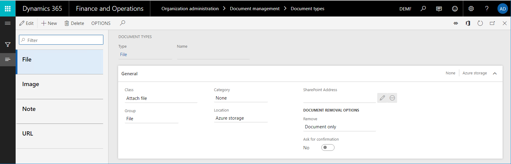
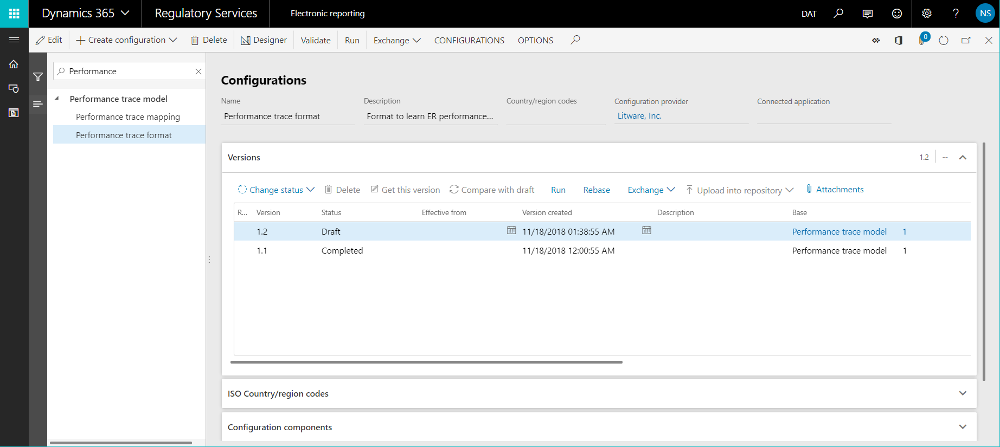
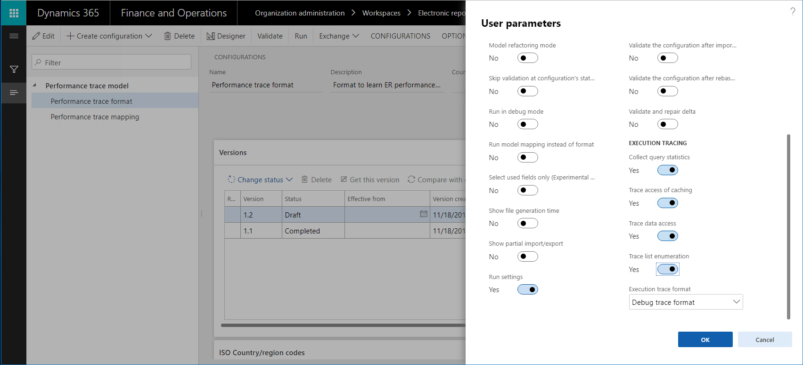
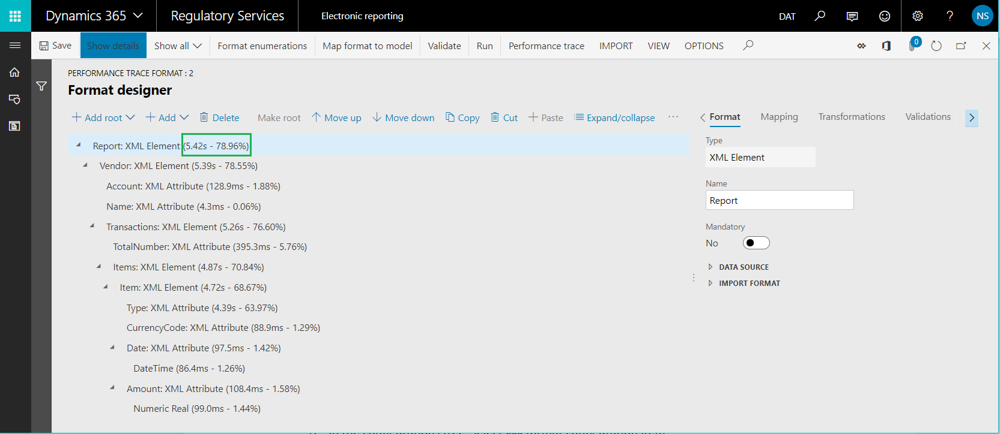
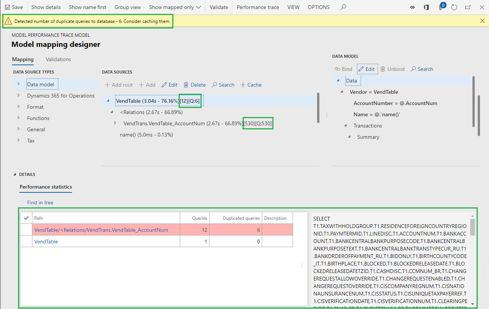
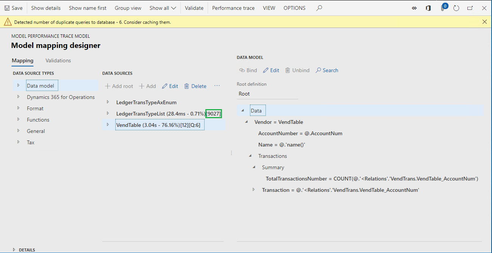
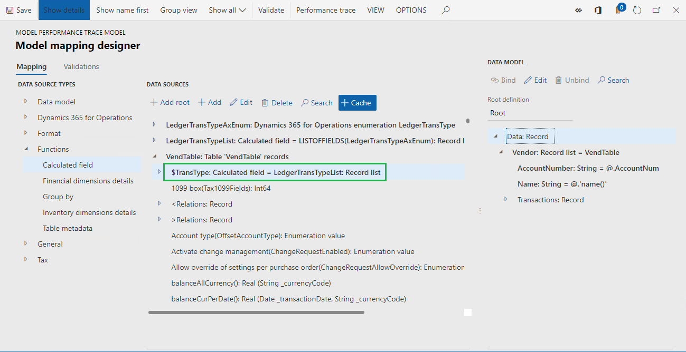
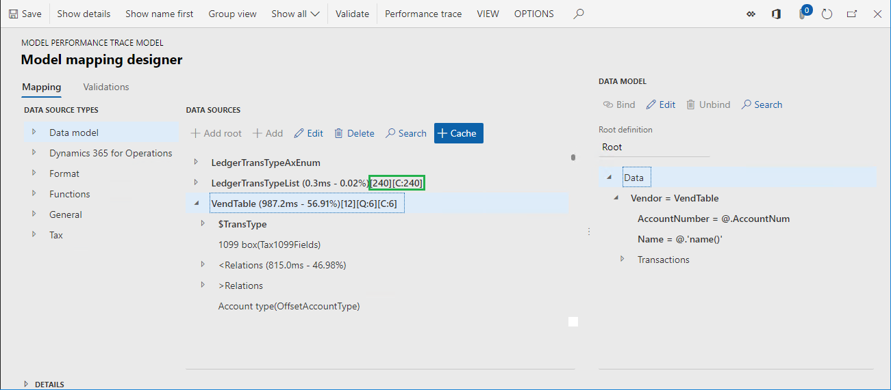
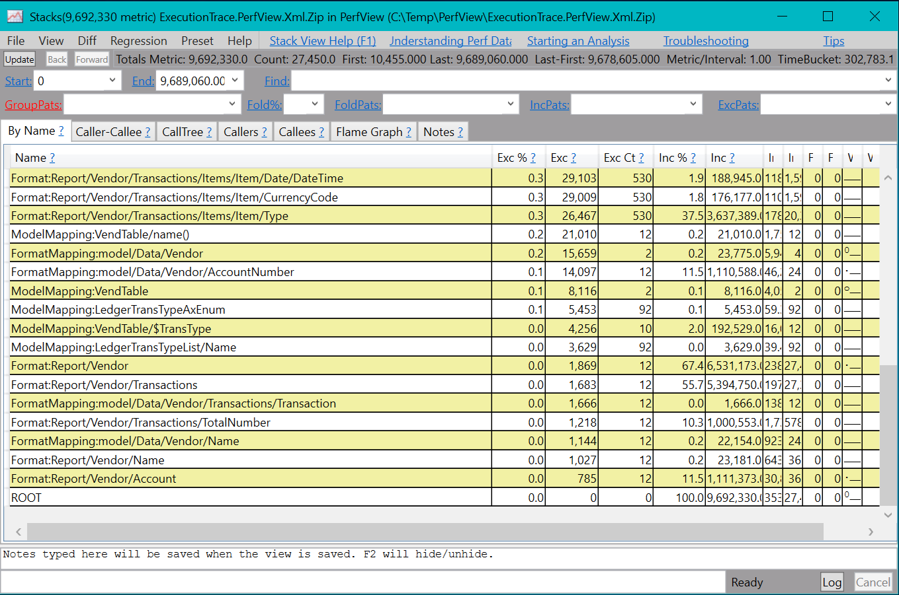

# Trace the execution of ER formats to troubleshoot performance issues

[!include[banner](../includes/banner.md)]

As part of the process of designing Electronic reporting (ER) configurations to generate electronic documents, you define the method that is used to get data out of the application and enter it in the output that is generated. The ER performance trace feature helps significantly reduce the time and cost that are involved in collecting the details of ER format execution and using them to troubleshoot performance issues. This tutorial provides guidelines about how to take performance traces for executed ER formats, and how to use the information from these traces to help improve performance.

## Prerequisites

To complete the examples in this tutorial, you must have the following access:

- Access to one of the following roles:

    - Electronic reporting developer
    - Electronic reporting functional consultant
    - System administrator

- Access to the instance of Regulatory Configuration Services (RCS) that has been provisioned for the same tenant as the application, for one of the following roles:

    - Electronic reporting developer
    - Electronic reporting functional consultant
    - System administrator

You must also download and locally store the following files.

| File                                  | Content                               |
|---------------------------------------|---------------------------------------|
| Performance trace model.version.1     | [Sample ER data model configuration](https://download.microsoft.com/download/0/a/a/0aa84e48-8040-4c46-b542-e3bf15c9b2ad/Performancetracemodelversion.1.xml)    |
| Performance trace metadata.version.1  | [Sample ER metadata configuration](https://download.microsoft.com/download/a/9/3/a937e8c4-1f8a-43e4-83ee-7d599cf7d983/Performancetracemetadataversion.1.xml)      |
| Performance trace mapping.version.1.1 | [Sample ER model mapping configuration](https://download.microsoft.com/download/7/7/3/77379bdc-7b22-4cfc-9b64-a9147599f931/Performancetracemappingversion1.1.xml) |
| Performance trace format.version.1.1  | [Sample ER format configuration](https://download.microsoft.com/download/8/6/8/868ba581-5a06-459e-b173-fb00f038b37f/Performancetraceformatversion1.1.xml)       |

### Configure ER parameters

Each ER performance trace that is generated in the application is stored as an attachment of the execution log record. The Document management (DM) framework is used to manage these attachments. You must configure ER parameters in advance, to specify the DM document type that should be used to attach performance traces. In the **Electronic reporting** workspace, select **Electronic reporting parameters**. Then, on the **Electronic reporting parameters** page, on the **Attachments** tab, in the **Others** field, select the DM document type to use for performance traces.

To be available in the **Others** lookup field, a DM document type must be configured in the following manner on the **Document types** page (**Organization administration \> Document management \> Document types**):

- **Class:** Attach file
- **Group:** File

> [!NOTE]
> The selected document type must be available in every company of the current instance, because DM attachments are company-specific.

### Configure RCS parameters

ER performance traces that are generated will be imported into RCS for analysis by using the ER format designer and the ER mapping designer. Because ER performance traces are stored as attachments of the execution log record that is related to the ER format, you must configure RCS parameters in advance, to specify the DM document type that should be used to attach performance traces. In the instance of RCS that has been provisioned for your company, in the **Electronic reporting** workspace, select **Electronic reporting parameters**. Then, on the **Electronic reporting parameters** page, on the **Attachments** tab, in the **Others** field, select the DM document type to use for performance traces.

To be available in the **Others** lookup field, a DM document type must be configured in the following manner on the **Document types** page (**Organization administration \> Document management \> Document types**):

- **Class:** Attach file
- **Group:** File

## Design an ER solution

Assume that you've started to design a new ER solution to generate a new report that presents vendor transactions. Currently, you can find the transactions for a selected vendor on the **Vendor transactions** page (go to **Account payable \> Vendors \> All vendors**, select a vendor, and then, on the Action Pane, on the **Vendor** tab, in the **Transactions** group, select **Transactions**). However, you want to have all vendor transaction at the same time in one electronic document in XML format. This solution will consist of several ER configurations that contain the required data model, metadata, model mapping, and format components.

1. Sign in to the instance of RCS that has been provisioned for your company.
2. In this tutorial, you will create and modify configurations for the **Litware, Inc.** sample company. Therefore, make sure that this configuration provider has been added to RCS and selected as active. For instructions, see the [Create configuration providers and mark them as active](tasks/er-configuration-provider-mark-it-active-2016-11.md) procedure.
3. In the **Electronic reporting** workspace, select the **Reporting configurations** tile.
4. On the **Configurations** page, import the ER configurations that you downloaded as a prerequisite into RCS, in the following order: data model, metadata, model mapping, format. For each configuration, follow these steps:

    1. On the Action Pane, select **Exchange \> Load from XML file**.
    2. Select **Browse** to select the appropriate file for the required ER configuration in XML format.
    3. Select **OK**.

    

## Run the ER solution to trace execution

Assume that you've finished designing the first version of the ER solution. You now want to test it in your instance and analyze execution performance.

### Import an ER configuration from RCS into finance and operations

1. Sign in to your application instance.
2. For this tutorial, you will import configurations from your RCS instance (where you design your ER components) into your instance (where you test and finally use them). Therefore, you must make sure that all the required artifacts have been prepared. For instructions, see the [Import Electronic reporting (ER) configurations from Regulatory Configuration Services (RCS)](rcs-download-configurations.md) procedure.
3. Follow these steps to import the configurations from RCS into the application:

    1. In the **Electronic reporting** workspace, on the tile for the **Litware, Inc.** configuration provider, select **Repositories**.
    2. On the **Configuration repository** page, select the repository of the **RCS** type, and then select **Open**.
    3. On the **Configurations** FastTab, select the **Performance trace format** configuration.
    4. On the **Versions** FastTab, select version **1.1** of the selected configuration, and then select **Import**.

    

The corresponding versions of the data model and model mapping configurations are automatically imported as prerequisites for the imported ER format configuration.

### Turn on the ER performance trace

1. Go to **Organization administration \> Electronic reporting \> Configurations**.
2. On the **Configurations** page, on the Action Pane, on the **Configurations** tab, in the **Advanced settings** group, select **User parameters**.
3. In the **User parameters** dialog box, in the **Execution tracing** section, follow these steps:

    1. In the **Execution trace format** field, specify the format of the generated performance trace that the execution details should be stored in for ER format and mapping elements:

        - **Debug trace format** – Select this value if you plan to interactively run an ER format that has a short execution time. The collection of details about ER format execution is then started. When this value is selected, the performance trace collects information about the time that is spent on the following actions:

            - Running each data source in the model mapping that is called to get data
            - Processing each format item to enter data in the output that is generated

            If you select the **Debug trace format** value, you can analyze the content of the trace in the ER Operation designer. There, you can view the ER format or mapping elements that are mentioned in the trace.

        - **Aggregated trace format** – Select this value if you plan to run an ER format that has a long execution time in batch mode. The collection of the aggregated details about ER format execution is then started. When this value is selected, the performance trace collects information about the time that is spent on the following actions:

            - Running each data source in the model mapping that is called to get data
            - Running each data source in the format mapping that is called to get data
            - Processing each format item to enter data in the output that is generated

            The **Aggregated trace format** value is available in Microsoft Dynamics 365 Finance version 10.0.20 and later.

            In the ER format designer and ER model mapping designer, you can view the total execution time for a single component. Additionally, the trace contains details about the execution, such as the number of executions, and the minimum and maximum time of a single execution.

            > [!NOTE]
            > This trace is collected based on the traced components path. Therefore, the statistics might be incorrect when a single parent component contains several unnamed child components, or when several child components have the same name.

    2. Set the following options to **Yes** to collect specific details of the execution of the ER model mapping and ER format components:

        - **Collect query statistics** – When this option is turned on, the performance trace will collect the following information:

            - The number of database calls that were made by data sources
            - The number of duplicate calls to the database
            - Details of the SQL statements that were used to make database calls

        - **Trace access of caching** – When this option is turned on, the performance trace will collect information about the ER model mapping's cache usage.
        - **Trace data access** – When this option is turned on, the performance trace will collect information about the number of calls to the database for executed data sources of the record list type.
        - **Trace list enumeration** – When this option is turned on, the performance trace will collect information about the number of records that are requested from data sources of the record list type.

    > [!NOTE]
    > The parameters in the **User parameters** dialog box are specific to the user and the current company.

    

### Run the ER format

1. Select the **DEMF** company.
2. Go to **Organization administration \> Electronic reporting \> Configurations**.
3. On the **Configurations** page, in the configuration tree, select the **Performance trace format** item.
4. On the Action Pane, select **Run**.

Notice that the file that is generated presents information about 265 transactions for six vendors.

## Review the execution trace

### Export the generated trace from the application

Performance traces are decoupled from the source ER format and can be serialized to an external zip file.

1. Go to **Organization administration \> Electronic reporting \> Configuration debug logs**.
2. On the **Electronic reporting run logs** page, in the left pane, in the **Configuration name** field, select **Performance trace format** to find the log records that have been generated by the execution of the **Performance trace format** configuration.
3. Select the **Attachments** button (the paper clip symbol) in the upper-right corner of the page, or press **Ctrl+Shift+A**.

    

4. On the **Attachments for Electronic reporting run logs** page, on the Action Pane, select **Open** to get the performance trace as a zip file and store it locally.

    

> [!NOTE]
> The trace that is generated has a reference to the source ER report via a unique report identifier in **GUID** format only. The version numbering of the format isn't considered.

Notice that the association between the performance trace that has been generated for the executed ER format and the ER model mapping is based on the root descriptor that was used and the common data model. The version numbering of the format and model mapping isn't considered. The setting of the **Default for model mapping** flag for the model mapping also isn't considered.

### Import the generated trace into RCS

1. In RCS, in the **Electronic reporting** workspace, select the **Reporting configurations** tile.
2. On the **Configurations** page, in the configuration tree, expand the **Performance trace model** item, and select the **Performance trace format** item.
3. On the Action Pane, select **Designer**.
4. On the **Format designer** page, on the Action Pane, select **Performance trace**.
5. In the **Performance trace result settings** dialog box, select **Import performance trace**.
6. Select **Browse** to select the zip file that you exported earlier.
7. Select **OK**.

    

### Use the performance trace for analysis in RCS – Format execution

1. In RCS, on the **Format designer** page, select **Expand/collapse** to expand the content of all format items.

    Notice that additional information is shown for some items of the current format:

    - The actual time that was spent entering data in the generated output by using the format item
    - The same time expressed as a percentage of the total time that was spent generating the whole output

    

2. Close **Format designer** page.

### Use the performance trace for analysis in RCS – Model mapping

1. In RCS, on the **Configurations** page, in the configuration tree, select the **Performance trace mapping** item.
2. On the Action Pane, select **Designer**.
3. Select **Designer**.
4. On the **Model mapping designer** page, on the Action Pane, select **Performance trace**.
5. Select the trace that you imported earlier.
6. Select **OK**.

Notice that new information becomes available for some data source items of the current model mapping:

- The actual time that was spent getting data by using the data source
- The same time expressed as a percentage of the total time that was spent running the whole model mapping

Notice that ER informs you that the current model mapping duplicates database requests while the VendTable/\<Relations/VendTrans.VendTable\_AccountNum data source is run. This duplication occurs because the list of vendor transactions is called two times for each iterated vendor record:

- One call is made to enter details of each transaction in the data model, based on configured bindings.
- One call is made to enter the calculated number of transactions per vendor in the data model.

The value **\[Q:530\]** indicates that the VendTrans table was called 530 times to return a record from that table to the VendTable/\<Relations/VendTrans.VendTable\_AccountNum data source. The value **\[530\]** indicates that the VendTable/\<Relations/VendTrans.VendTable\_AccountNum data source was called 530 times to return a record from that data source and enter the details from it in the data model.

We recommend that you use caching for the VendTable/\<Relations/VendTrans.VendTable\_AccountNum data source, to reduce the number of calls that are made to get the details for 265 transactions and help improve the performance of the model mapping.

It can also be useful to reduce the number of calls that are made to the LedgerTransTypeList data source. This data source is used to associate each value of the **LedgerTransType** enumeration with its label. By using this data source, you can find an appropriate label and enter it in the data model for each vendor transaction. The current number of calls to this data source (9,027) is quite high for 265 transactions.

## Improve the model mapping based on information from the execution trace

### Modify the logic of the model mapping

1. Follow these steps to use caching, to help prevent duplicate calls to the database:

    1. In RCS, on the **Model mapping designer** page, in the **Data sources** pane, select the **VendTable** item.
    2. Select **Cache**.
    3. Expand the **VendTable** item, expand the list of one-to-many relations for the VendTable data source (the **\<Relations** item), and select the **VendTrans.VendTable\_AccountNum** item.
    4. Select **Cache**.

    

2. Follow these steps to bring the LedgerTransTypeList data source into the scope of the VendTable data source:

    1. In the **Data source types** pane, expand the **Functions** item, and select the **Calculated field** item.
    2. In the **Data sources** pane, select the **VendTable** item.
    3. Select **Add**.
    4. In the **Name** field, enter **\$TransType**.
    5. Select **Edit formula**.
    6. In the **Formula** field, enter **LedgerTransTypeList**.
    7. Select **Save**.
    8. Close the **Formula editor** page.
    9. Click **OK**.

3. Follow these steps to do caching of the **\$TransType** field:

    1. Select the **LedgerTransTypeList** item.
    2. Select **Cache**.
    3. Select the **VendTable.\$TransType** item.
    4. Select **Cache**.

    

4. Follow these steps to change the **\$TransTypeRecord** field so that it starts to use the cached **\$TransType** field:

    1. In the **Data sources** pane, expand the **VendTable** item, expand the **\<Relations** item, expand the **VendTrans.VendTable\_AccountNum** item, and select the **VendTable. VendTrans.VendTable\_AccountNum.\$TransTypeRecord** item.
    2. Select **Edit**.
    3. Select **Edit formula**.
    4. In the **Formula** field, find the following expression:

        FIRSTORNULL (WHERE (LedgerTransTypeList, LedgerTransTypeList.Enum = \@.TransType))

    5. In the **Formula** field, enter the following expression:

        FIRSTORNULL (WHERE (VendTable.'\$TransType', VendTable.'\$TransType'.Enum = \@.TransType)).

    6. Select **Save**.
    7. Close the **Formula editor** page.
    8. Select **OK**.

5. Select **Save**.
6. Close the **Model mapping designer** page.
7. Close the **Model mappings** page.

### Complete the modified version of the ER model mapping

1. In RCS, on the **Configurations** page, on the **Versions** FastTab, select version **1.2** of the **Performance trace mapping** configuration.
2. Select **Change status**.
3. Select **Complete**.

### Import the modified ER model mapping configuration from RCS into the application

Repeat the steps in the [Import an ER configuration from RCS into finance and operations](#import-configuration) section earlier in this article to import version 1.2 of the **Performance trace mapping** configuration.

## Run the modified ER solution to trace execution

### Run the ER format

Repeat the steps in the [Run the ER format](#run-format) section earlier in this article to generate a new performance trace.

## Work with the execution trace

### Export the generated trace from the application

Repeat the steps in the [Export the generated trace from the application](#export-trace) section earlier in this article to save a new performance trace locally.

### Import the generated trace into RCS

Repeat the steps in the [Import the generated trace into RCS](#import-trace) section earlier in this article to import the new performance trace into RCS.

### Use the performance trace for analysis in RCS – Model mapping

Repeat the steps in the [Use the performance trace for analysis in RCS – Model mapping](#use-trace) section earlier in this article to analyze the latest performance trace.

Notice that the adjustments that you made to the model mapping have eliminated duplicate queries to database. The number of calls to database tables and data sources for this model mapping has been also reduced. Therefore, the performance of the whole ER solution has improved.

In the trace information, the value **\[12\]** for the VendTable data source indicates that this data source was called 12 times. The value **\[Q:6\]** indicates that six calls were translated to database calls to the VendTable table. The value **\[C:6\]** indicates that the records that were fetched from the database were cached, and six other calls were processed by using the cache.

Notice that the number of calls to the LedgerTransTypeList data source has been reduced from 9,027 to 240.

## Review the execution trace in the application

In addition to RCS, some versions might offer capabilities for an ER framework designer experience. These versions have an **Enable design mode** option that can be turned on. You can find this option on the **General** tab of the **Electronic reporting parameters** page, which you can open from the **Electronic reporting** workspace.

If you use one of these versions, you can analyze the details of generated performance traces directly in the application. You don't have to export them from the application and import them into RCS.

## Review the execution trace by using external tools

### Configure user parameters

1. Go to **Organization administration \> Electronic reporting \> Configurations**.
2. On the **Configurations** page, on the Action Pane, on the **Configurations** tab, in the **Advanced settings** group, select **User parameters**.
3. In the **User parameters** dialog box, in the **Execution tracing** section, in the **Execution trace format** field, select **PerfView XML**.

### Run the ER format

Repeat the steps in the [Run the ER format](#run-format) section earlier in this article to generate a new performance trace.

Notice that the web browser offers a zip file for download. This file contains the performance trace in PerfView format. You can then use the PerfView performance analysis tool to analyze the details of ER format execution.

## Use external tools to review an execution trace that includes database queries

Because of improvements that have been made to the ER framework, the performance trace that is generated in PerfView format now offers more details about ER format execution. In Microsoft Dynamics 365 Finance version 10.0.4 (July 2019), this trace can also include details of executed SQL queries to the application database.

### Configure user parameters

1. Go to **Organization administration** \> **Electronic reporting** \> **Configurations**.
2. On the **Configurations** page, on the Action Pane, on the **Configurations** tab, in the **Advanced settings** group, select **User parameters**.
3. In the **User parameters** dialog box, in the **Execution tracing** section, set the following parameters:

    - In the **Execution trace format** field, select **PerfView XML**.
    - Set the **Collect query statistics** option to **Yes**.
    - Set the **Trace query** option to **Yes**.

    

### Run the ER format

Repeat the steps in the [Run the ER format](#run-format) section earlier in this article to generate a new performance trace.

Notice that the web browser offers a zip file for download. This file contains the performance trace in PerfView format. You can then use the PerfView performance analysis tool to analyze the details of ER format execution. This trace now includes the details of SQL database access during the execution of the ER format.

## Additional resources

- [Electronic Reporting overview](general-electronic-reporting.md)
- [Improve performance of ER solutions by adding parameterized CALCULATED FIELD data sources](er-calculated-field-ds-performance.md)

[!INCLUDE[footer-include](../../../includes/footer-banner.md)]

