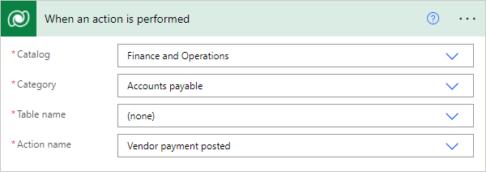

---
# required metadata

title: Business events in Microsoft Power Automate
description: This topic provides information about the business events that are available for consumption in Microsoft Power Automate via the application connector.
author: Sunil-Garg
ms.date: 10/18/2021
ms.topic: article
ms.prod: 
ms.technology: 

# optional metadata

# ms.search.form:  [Operations AOT form name to tie this topic to]
audience: IT Pro
# ms.devlang: 
ms.reviewer: sericks
# ms.custom: [used by loc for topics migrated from the wiki]
ms.search.region: Global for most topics. Set Country/Region name for localizations
# ms.search.industry: 
ms.author: sunilg
ms.search.validFrom: Platform update 24
ms.dyn365.ops.version: 2019-02-28
---

# Business events in Microsoft Power Automate

[!include[banner](../includes/banner.md)]

The Finance and Operations connector and Microsoft Dataverse connector are available for consuming business events in Microsoft Power Automate. The Finance and Operations connector has a **When a Business Event occurs** trigger. The Dataverse connector has a **When an action is performed** trigger. Either of these triggers can be used to subscribe to any of the business events that are available in the Finance and Operations apps. Both triggers provide the same functionality with slightly different execution.

You can use the Dataverse connector to subscribe to data events in Finance and Operations apps using the **When a row is added, modified or deleted** trigger. This trigger enables a Power Automate flow to be triggered by any create, update, or delete (CUD) event against a selected Finance and Operations apps entity.

## Prerequisite

It's important that you understand business events. For more information, see the [Business events](home-page.md) documentation.

## Subscribing to business events

### Using the Finance and Operations connector

The Finance and Operations connector communicates directly with Finance and Operations apps to establish subscriptions, but is triggered by Dataverse at runtime. The connector can connect to any instance of the Finance and Operations apps on the Azure Active Directory tenant. 

After the trigger, **When a Business Event happens** is added to a flow, the following information must be provided:

- **Instance** – Specify the host name of the instance where business events occur. Environment instances should be available in the provided drop-down menu, but if an environment is not listed it can be entered as a custom value.
- **Category** – Select the category of business events. The list of unique business event categories are displayed in the business event catalog in Finance and Operations apps.
- **Business event** – Select the business event from which you want the flow to be triggered. The business events displayed in the list are all business events in the Finance and Operations apps business event catalog in the selected category.
- **Legal entity** – Specify the legal entity where the business event is being subscribed to. The flow will be triggered when the business event occurs in that legal entity. By default, this field is blank and the business event is subscribed to in **all** legal entities.

When the flow is saved, a subscription to the selected business event is added into the environment instance. As part of the subscription process, the required endpoint is set up, and the corresponding business event is activated.

### Using the Dataverse connector

Business events for Finance and Operations apps are also exposed through the **When an action is performed** trigger of the Dataverse connector. The trigger exposes actions and table operations that are configured in Dataverse using the **Catalog** and **CatalogAssignment** tables. This provides a more generic business event framework in Dataverse that isn't limited to Finance and Operations apps business events. Business events in the Finance and Operations apps business event catalog are synchronized with the Dataverse business events catalog, providing a way to subscribe to Finance and Operations apps business events to initiate business logic in a Power Automate flow. For more information on the catalog in the Dataverse business events framework, see [Catalog and CatalogAssignment tables](/powerapps/developer/data-platform/catalog-catalogassignment).

To use the Finance and Operations apps business events in the **When an action is performed** trigger of the Dataverse connector, the Microsoft Power Platform integration must be enabled for the Finance and Operations apps environment, connecting the Finance and Operations apps environment to the Dataverse environment. For more information on enabling the Microsoft Power Platform integration for Finance and Operations environments, see [Enabling the Microsoft Power Platform integration](../power-platform/enable-power-platform-integration.md). 

> [!NOTE]
> The Microsoft Power Platform integration has a one-to-one connection between Finance and Operations apps and the Power Platform environment. Because of this relationship, you can't select from multiple Finance and Operations apps environments like the **When a Business Event happens** trigger of the Finance and Operations connector does. The trigger connects automatically to the Finance and Operations apps environment selected for the Microsoft Power Platform integration.

After the **When an action is performed** trigger is added to a flow in Power Automate, the following information must be provided:

- **Catalog** - Select **Finance and Operations**. This is the catalog that exposes Finance and Operations apps business events as a catalog Dataverse business events.
- **Category** - Select the category of the desired business event. This displays the list of unique business event categories in the business event catalog in Finance and Operations apps.
- **Table name** - If the action is related to a specific table, select the related table. This will typically be **(none)** for Finance and Operations apps business events.
- **Action name** - Select the action or business event from which you want the flow to be triggered. The drop-down list displays the list of all synchronized business events in the Finance and Operations apps business event catalog in the selected category.

  

For more information on using the trigger, **When an action is performed** in Power Automate, see [Trigger flows with actions](/power-automate/dataverse/action-trigger).

> [!NOTE]
> The Power Automate endpoint must not be configured manually. The endpoint will automatically get created from Power Automate as explained above.

## Subscribing to data events

Finance and Operations apps entities that are enbled as virtual entities in Dataverse are included in the **When a row is added, modified or deleted** trigger of the Dataverse connector. When adding the trigger to a flow in Power Automate, define the table name of the table for which you want to trigger the flow. The **Table name** list contains the list of all Finance and Operations apps entities that are exposed as virtual entities in Dataverse from the Finance and Operations apps environment that is connected to the Microsoft Power Platform environment through the Microsoft Power Platform integration. For information on enabling virtual entities, see [Enable Dataverse virtual entities](../power-platform/enable-virtual-entities.md).

> [!NOTE]
> Typing **mserp** in the **Table name** field filters the list of tables to display the list of available Finance and Operations apps virtual entities enabled for your environment.

For more information on using the **When a row is added, modified or deleted** trigger in the Dataverse connector, including advanced options, see [Trigger flows when a row is added, modified, or deleted](/power-automate/dataverse/create-update-delete-trigger).

## Unsubscribing from business events

If the trigger is deleted or the flow is turned off, the business event endpoint will be automatically deleted.

## Adjusting flow parameter limits

Multiple flows can subscribe to the same business event in different legal entities or in the same legal entity. The default endpoint limit per event is ten. If needed, adjust the **Endpoints allowed per event** on the **Business event parameters** page.

## Other ways to consume business events in Power Automate

The previous section explains how you can subscribe to business events directly from Power Automate by using the trigger in the connector. However, you can also consume business events in Microsoft Power Automate from Microsoft Azure Event Grid, by using the [Event Grid connector for Microsoft Power Automate](/connectors/azureeventgrid/).

Event Grid might be a viable approach for consuming business events in Power Automate if it's already being used for other integrations in an implementation. If a business event in the same legal entity must trigger multiple flows, you should consider consuming the business event from Event Grid.

This approach is applicable to any messaging or event platform that is used as an endpoint for business events, provided that a connector is available for it in Power Automate.

For information about how to use business events in Microsoft Flow, see [Consume business events in Microsoft Flow](how-to/how-to-flow.md). 

[!INCLUDE[footer-include](../../../includes/footer-banner.md)]
