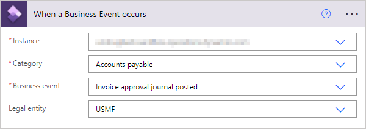

# Business events in Microsoft Power Automate

[!include[banner](../includes/banner.md)]

The finance and operations connector and Microsoft Dataverse connector are available for consuming business events in Microsoft Power Automate. The finance and operations connector has a **When a Business Event occurs** trigger. The Dataverse connector has a **When an action is performed** trigger. Either of these triggers can be used to subscribe to any of the business events that are available in finance and operations apps. Both triggers provide the same functionality, but the execution is slightly different.

The Dataverse connector lets you use the **When a row is added, modified or deleted** trigger to subscribe to data events in finance and operations apps. This trigger enables a Power Automate flow to be triggered by any create, update, or delete (CUD) event against a selected finance and operations apps entity.

## Prerequisite

It's important that you understand business events. For more information, see the [Business events](home-page.md) documentation.

## Subscribing to business events

### Using the finance and operations connector

The finance and operations connector communicates directly with finance and operations apps to establish subscriptions, but it's triggered by Dataverse at runtime. The connector can connect to any instance of finance and operations apps on the Microsoft Entra tenant. 

After the **When a Business Event occurs** trigger is added to a flow, the following information must be provided:

- **Instance** – Specify the host name of the instance where business events occur. Environment instances should be available in the provided drop-down menu, but if an environment is not listed it can be entered as a custom value.
- **Category** – Select the category of business events. The list of unique business event categories in the business event catalog in finance and operations apps is shown.
- **Business event** – Select the business event that the flow should be triggered from. All the business events that are shown in the list are business events in the selected category in the finance and operations apps business event catalog.
- **Legal entity** – Specify the legal entity where the business event is being subscribed to. The flow will be triggered when the business event occurs in that legal entity. By default, this field is blank and the business event is subscribed to in **all** legal entities.

When the flow is saved, a subscription to the selected business event is added into the environment instance. As part of the subscription process, the required endpoint is set up, and the corresponding business event is activated.

### Using the Dataverse connector

Business events for finance and operations apps are also exposed through the **When an action is performed** trigger of the Dataverse connector. This trigger exposes actions and table operations that are configured in Dataverse by using the **Catalog** and **CatalogAssignment** tables. This configuration provides a more generic business event framework in Dataverse that isn't limited to finance and operations apps business events. Business events in the finance and operations apps business event catalog are synchronized with the Dataverse business events catalog. Therefore, you can subscribe to finance and operations apps business events to initiate business logic in a Power Automate flow. For more information about the catalog in the Dataverse business events framework, see [Catalog and CatalogAssignment tables](/powerapps/developer/data-platform/catalog-catalogassignment).

To use the finance and operations apps business events in the **When an action is performed** trigger of the Dataverse connector, the Microsoft Power Platform integration must be enabled for the finance and operations apps environment, so that the finance and operations apps environment is connected to the Dataverse environment. For more information about how to enable the Microsoft Power Platform integration for finance and operations apps environments, see [Enabling the Microsoft Power Platform integration](../power-platform/enable-power-platform-integration.md). 

> [!NOTE]
> The Microsoft Power Platform integration has a one-to-one connection between finance and operations apps and the Microsoft Power Platform environment. Because of this relationship, you can't select among multiple finance and operations apps environments as the **When a Business Event occurs** trigger of the finance and operations connector does. The trigger automatically connects to the finance and operations apps environment that is selected for the Microsoft Power Platform integration.

After the **When an action is performed** trigger is added to a flow in Power Automate, the following information must be provided:

- **Catalog** – Select **Finance and operations**. This exposes finance and operations business events as a Dataverse business events catalog.
- **Category** – Select the category of the desired business event. The list of unique business event categories in the business event catalog in finance and operations apps is shown.
- **Table name** – If the action is related to a specific table, select the related table. Typically, the value will be **(none)** for finance and operations apps business events.
- **Action name** – Select the action or business event that the flow should be triggered from. The drop-down list shows all synchronized business events in the selected category in the finance and operations apps business event catalog.

For more information about how to use the **When an action is performed** trigger in Power Automate, see [Trigger flows with actions](/power-automate/dataverse/action-trigger).

> [!NOTE]
> The Power Automate endpoint must not be configured manually. The endpoint will automatically get created from Power Automate as explained above.

## Subscribing to data events

Finance and operations apps entities that are enabled as virtual entities in Dataverse are included in the **When a row is added, modified or deleted** trigger of the Dataverse connector. When you add the trigger to a flow in Power Automate, define the table name of the table that you want to trigger the flow for. The **Table name** list contains the list of all finance and operations apps entities that are exposed as virtual entities in Dataverse from the finance and operations apps environment that is connected to the Microsoft Power Platform environment through the Microsoft Power Platform integration. For information about how to enable virtual entities, see [Enable Dataverse virtual entities](../power-platform/enable-virtual-entities.md).

> [!NOTE]
> By entering **mserp** in the **Table name** field, you can filter the list of tables so that it shows only the available finance and operations apps virtual entities that are enabled for your environment.

For more information about how to use the **When a row is added, modified or deleted** trigger in the Dataverse connector, including information about advanced options, see [Trigger flows when a row is added, modified, or deleted](/power-automate/dataverse/create-update-delete-trigger).

## Unsubscribing from business events

If the trigger is deleted or the flow is turned off, the business event endpoint is automatically deleted.

## Adjusting flow parameter limits

Multiple flows can subscribe to the same business event in different legal entities or in the same legal entity. The default endpoint limit per event is ten. You can adjust the **Endpoints allowed per event** setting on the **Business event parameters** page as you require.

## Other ways to consume business events in Power Automate

The previous section explains how you can subscribe to business events directly from Power Automate by using the trigger in the connector. However, you can also consume business events in Microsoft Power Automate from Microsoft Azure Event Grid, by using the [Event Grid connector for Microsoft Power Automate](/connectors/azureeventgrid/).

Event Grid might be a viable approach for consuming business events in Power Automate if it's already being used for other integrations in an implementation. If a business event in the same legal entity must trigger multiple flows, you should consider consuming the business event from Event Grid.

This approach is applicable to any messaging or event platform that is used as an endpoint for business events, provided that a connector is available for it in Power Automate.

For information about how to use business events in Microsoft Flow, see [Consume business events in Microsoft Flow](how-to/how-to-flow.md). 

[!INCLUDE[footer-include](../../../includes/footer-banner.md)]